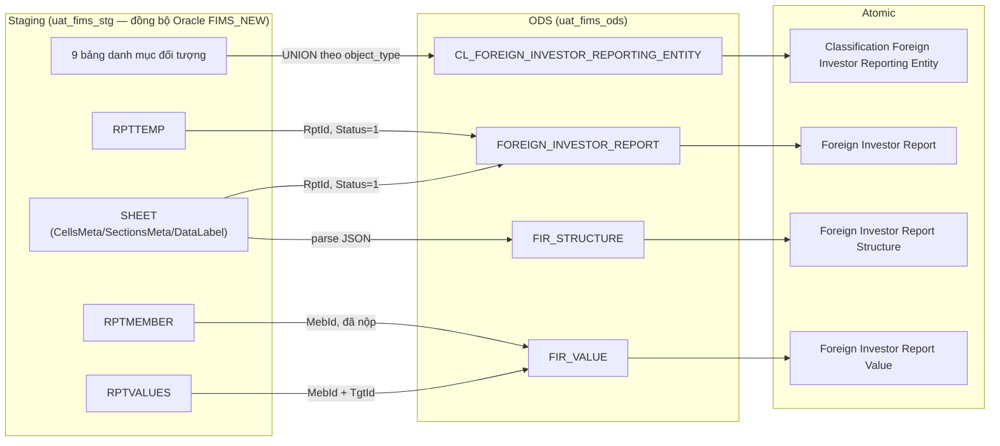

# FIMS — HLD Overview: Toàn cảnh thiết kế Atomic Layer

> **Nguồn:** Hệ thống FIMS — Quản lý giám sát và công bố thông tin thành viên thị trường (Oracle)
>
> **Phạm vi:** Đăng ký và theo dõi thành viên thị trường chứng khoán (Công ty QLQ, Công ty CK, Ngân hàng lưu ký, VSDC, Sở GD, CN QLQ NN), nhà đầu tư nước ngoài, người hành nghề chứng khoán, báo cáo định kỳ và sự vụ CBTT, cảnh báo giám sát và vi phạm, ủy quyền CBTT/giao dịch.
>
> **File chi tiết theo tầng:**
> - [FIMS_HLD_Tier1.md](FIMS_HLD_Tier1.md) — Independent Entities: Market Participant Organization, Foreign Investor, Foreign Investor Report, Classification Foreign Investor Reporting Entity, Reporting Period, Reporting Obligation Type, Warning Parameter, Trading Representative, Securities Closing Price (Geographic Area đã chuyển sang nguồn ECAT — xem mục 7f)
> - [FIMS_HLD_Tier2.md](FIMS_HLD_Tier2.md) — FK đến Tier 1: Foreign FM Branch Organization, Info Disclosure Representative, Market Participant Key Person, Member Periodic Report, Warning Condition, Foreign Investor Report Structure
> - [FIMS_HLD_Tier3.md](FIMS_HLD_Tier3.md) — FK đến Tier 2: Foreign Investor Securities Account, Foreign Investor Report Value, Report Processing Activity Log, Market Participant Conduct Violation, Info Disclosure Authorization, Trading Authorization, Info Disclosure Announcement
>
> **Cập nhật 2026-09-30 — nhóm Báo cáo động:** `Reporting Template` (RPTTEMP) và `Report Import Value` (RPTVALUES) được thay bằng 4 entity `Foreign Investor Report`, `Foreign Investor Report Structure`, `Foreign Investor Report Value`, `Classification Foreign Investor Reporting Entity`. Nhóm này đi qua luồng đặc biệt STG → parse → ODS → ATM (xem ghi chú cuối mục 7a), không map 1:1 từ staging.

---

#### 7a. Bảng tổng quan Atomic entities

| Tier | BCV Core Object | BCV Concept | Category | Source Table | Source Table Change Mode | Mô tả bảng nguồn | Atomic Entity | Table Type | BCV Term |
|---|---|---|---|---|---|---|---|---|---|
| 1 | Involved Party | [Involved Party] Organization | Organization | FUNDCOMPANY | Update | Danh sách công ty quản lý quỹ — đối tượng thành viên thị trường gửi báo cáo | Market Participant Organization | Fundamental | Organization — 7 loại thành viên thị trường (QLQ, CTCK, NHLK, VSDC, Sở GD) có cấu trúc cột tương đồng (tên VN/EN/viết tắt, địa chỉ, phone, email, giấy phép, vốn, trạng thái). Gộp vào 1 entity phân biệt bằng Organization Type Code (ETL-derived). FK đến NATIONAL (Geographic Area). Tách IP Postal Address + IP Electronic Address. |
| 1 | Involved Party | [Involved Party] Organization | Organization | SECURITIESCOMPANY | Update | Danh sách công ty chứng khoán — đối tượng thành viên thị trường | Market Participant Organization | Fundamental | Organization — cùng entity với FUNDCOMPANY, BANKMONI, DEPOSITORYCENTER, STOCKEXCHANGE. Organization Type Code = SECURITIES_COMPANY. |
| 1 | Involved Party | [Involved Party] Organization | Organization | BANKMONI | Update | Danh sách ngân hàng lưu ký giám sát | Market Participant Organization | Fundamental | Organization — cùng entity với FUNDCOMPANY. Organization Type Code = CUSTODIAN_BANK. |
| 1 | Involved Party | [Involved Party] Organization | Organization | DEPOSITORYCENTER | Update | Danh sách Trung tâm lưu ký chứng khoán (VSDC) | Market Participant Organization | Fundamental | Organization — cùng entity với FUNDCOMPANY. Organization Type Code = DEPOSITORY_CENTER. |
| 1 | Involved Party | [Involved Party] Organization | Organization | STOCKEXCHANGE | Update | Danh sách sở giao dịch chứng khoán | Market Participant Organization | Fundamental | Organization — cùng entity với FUNDCOMPANY. Organization Type Code = STOCK_EXCHANGE. |
| 1 | Involved Party | [Involved Party] Individual | Individual | INVESTOR | Update | Danh sách nhà đầu tư nước ngoài (cá nhân và tổ chức) tại Việt Nam | Foreign Investor | Fundamental | Individual — NĐT nước ngoài cá nhân (ObjectType=1) và tổ chức (ObjectType=2) đăng ký hoạt động tại VN theo quy định UBCKNN. Có trường nhận dạng (IdNo/IdDate/IdAdd), địa chỉ, liên lạc. Tách IP Postal Address (Address) + IP Electronic Address (Telephone/Fax/Email/Website) + IP Alt Identification (IdNo/IdDate/IdAdd) — bổ sung 2026-07-19 khi thiết kế LLD, áp dụng quy tắc grain=Involved Party bắt buộc tách đủ 3 shared entity (xem Tier1.md mục T1-07). FK đến NATIONAL, SECURITIESCOMPANY, BANKMONI (Classification Value). |
| 1 | Documentation | [Documentation] Form Document | Form Document | RPTTEMP (qua ODS `FOREIGN_INVESTOR_REPORT`) | Update (ODS ghi đè toàn bộ mỗi lần chạy) | Danh sách biểu mẫu báo cáo đầu vào do UBCKNN ban hành | Foreign Investor Report | Relative | Form Document — "Documentation Item presented in a standard template layout which requires additional information to be supplied". Grain = 1 sheet × 1 mẫu báo cáo. ODS dựng từ `RPTTEMP ⋈ SHEET` (`SHEET.RptId = RPTTEMP.Id`, chỉ `Status = 1`). Thay entity cũ `Reporting Template`. |
| 1 | Documentation | [Documentation] Form Document | Form Document | SHEET (qua ODS `FOREIGN_INVESTOR_REPORT`) | Update (ODS ghi đè toàn bộ mỗi lần chạy) | Danh sách các sheet trong biểu mẫu báo cáo đầu vào | Foreign Investor Report | Relative | Form Document — SHEET cung cấp grain (sheet_id = BK) + sheet_code/sheet_name/sheet_index; RPTTEMP cung cấp report_code/report_name/legal_basis/status. |
| 1 | Common | [Common] Classification | Classification | 9 bảng danh mục FUNDCOMPANY, SECURITIESCOMPANY, BANKMONI, DEPOSITORYCENTER, STOCKEXCHANGE, INFODISCREPRES, BRANCHS, INVESTOR, TRADINGREPRESENTATIVE (qua ODS `CL_FOREIGN_INVESTOR_REPORTING_ENTITY`) | Update (ODS ghi đè toàn bộ mỗi lần chạy) | Danh mục tổ chức/cá nhân từng là bên nộp báo cáo | Classification Foreign Investor Reporting Entity | Relative | Classification — bảng danh mục tra cứu đối tượng nộp báo cáo (quyết định Data Modeler 2026-09-30: BCO Common, không phải Involved Party); ODS UNION 9 bảng danh mục (không JOIN), gắn `object_type` theo bảng. BK = `object_id ‖ object_type` (object_id không duy nhất giữa các loại). 9 bảng đã in scope cho entity khác — không đổi scope. |
| 1 | Business Activity | [Business Activity] Assessment Period | Period | RPTPERIOD | Update | Danh sách kỳ của báo cáo đầu vào (kỳ tháng/quý/năm) | Reporting Period | Fundamental | Assessment Period — kỳ báo cáo định kỳ của biểu mẫu. Mỗi kỳ có ngày bắt đầu, ngày kết thúc, hạn nộp. FK đến RPTTEMP. |
| 1 | Business Activity | [Business Activity] Business Activity | Business Activity | RPT_EVENT_TYPE | Update | Danh sách loại sự vụ/nghĩa vụ báo cáo (CBTT, hồ sơ, báo cáo định kỳ) | Reporting Obligation Type | Fundamental | Business Activity — danh mục loại nghĩa vụ mà thành viên thị trường phải thực hiện theo quy định pháp luật. Ghi nhận mã sự vụ, tên, phân loại, loại nghĩa vụ, căn cứ pháp lý và cờ cho phép tự thiết lập kỳ báo cáo. |
| 1 | Condition | [Condition] Scoring Criterion | Scoring Criterion | PARAWARN | Update | Danh sách tham số cảnh báo giám sát thành viên thị trường | Warning Parameter | Fundamental | Scoring Criterion — tham số cảnh báo giám sát định nghĩa chỉ tiêu theo dõi (có công thức tính cho từng loại thành viên). Là nền tảng cho Warning Condition (Tier 2) và Conduct Violation (Tier 3). |
| 1 | Involved Party | [Involved Party] Registered Representative | Agent | TRADINGREPRESENTATIVE | Update | Danh sách đại diện giao dịch cho NĐT nước ngoài tại công ty chứng khoán | Trading Representative | Fundamental | Registered Representative — cá nhân đại diện thực hiện giao dịch cho NĐT NN, được ủy quyền qua Trading Authorization (T3) và tham chiếu trong Member Periodic Report (T2). Tách IP Postal Address + IP Electronic Address + IP Alt Identification. Chỉ FK đến NATIONAL + STATUS → Tier 1. |
| 1 | Condition | [Condition] Product Price Condition | Product Price Condition | CLOSING_PRICE_SECURITIES | Append | Giá đóng cửa chứng khoán theo phiên, nhận từ HOSE/HNX/UPCOM hoặc nhập tay | Securities Closing Price | Fact Snapshot | Product Price Condition — bảng giá cuối ngày theo mã chứng khoán, ví dụ mẫu chuẩn của Fact Snapshot pattern. Không FK đến entity nghiệp vụ nào (chỉ denormalize mã CK) → Tier 1. |
| 2 | Involved Party | [Involved Party] Organization | Organization | BRANCHS | Update | Danh sách chi nhánh/VPĐD của công ty QLQ nước ngoài tại Việt Nam | Foreign FM Branch Organization | Fundamental | Organization — VPĐD hoặc chi nhánh của công ty QLQ nước ngoài tại VN. Không FK đến FUNDCOMPANY (entity độc lập với thông tin giấy phép riêng, công ty mẹ nước ngoài). Tách IP Postal Address + IP Electronic Address. |
| 2 | Involved Party | [Involved Party] Organization | Organization | INFODISCREPRES | Update | Danh sách đối tượng ủy quyền CBTT/giao dịch (cá nhân và tổ chức) | Info Disclosure Representative | Fundamental | Organization — đại diện CBTT/giao dịch được thành viên thị trường ủy quyền. Cấu trúc cây self-referencing (RepresentedInfodiscrepresId). ProfileKind phân biệt 10 loại đối tượng. FK đến NATIONAL, STATUS. |
| 2 | Involved Party | [Involved Party] Individual Employment Status | Employment Status | TLPROFILES | Update | Danh sách nhân sự chủ chốt tại các tổ chức thành viên thị trường | Market Participant Key Person | Fundamental | Individual Employment Status — nhân sự giữ vị trí quan trọng tại thành viên thị trường (cán bộ chủ chốt, đại diện pháp luật, người hành nghề). FK đa hướng đến FUNDCOMPANY / SECURITIESCOMPANY / BANKMONI / DEPOSITORYCENTER / STOCKEXCHANGE / INFODISCREPRES. Tách IP Alt Identification. |
| 2 | Documentation | [Documentation] Gov. Registration Document | Government Registration Document | RPTMEMBER | Update | Hồ sơ kỳ báo cáo thành viên thị trường — 1 bản ghi per thành viên per kỳ | Member Periodic Report | Fundamental | Gov. Registration Document — báo cáo định kỳ pháp lý của thành viên thị trường gửi UBCKNN. FK đa hướng đến 7 loại thành viên + RPTTEMP + RPTPERIOD + RPT_EVENT_TYPE. Grain = 1 thành viên × 1 kỳ × 1 biểu mẫu. |
| 2 | Documentation | [Documentation] Form Document | Form Document | SHEET (qua ODS `FIR_STRUCTURE`) | Update (ODS ghi đè toàn bộ mỗi lần chạy) | Cấu hình ô chỉ tiêu của sheet (JSON CellsMeta/SectionsMeta/DataLabel) | Foreign Investor Report Structure | Relative | Form Document — cây chỉ tiêu (1 ô template trong 1 sheet). ODS sinh bằng **parse JSON** `CellsMeta`/`SectionsMeta`/`DataLabel` của SHEET (+ cấu hình đè `fims_row_overrides/`), không phải JOIN. BK = `sheet_id ‖ indicator_uid`. FK đến Foreign Investor Report. |
| 2 | Condition | [Condition] Scoring Criterion | Scoring Criterion | CDTWARN | Update | Danh sách điều kiện cảnh báo giám sát (ngưỡng min/max cho từng tham số) | Warning Condition | Fundamental | Scoring Criterion — điều kiện cảnh báo cụ thể (ngưỡng FromValue/ToValue, tham số so sánh kép). FK đến Warning Parameter. Là nền tảng cho Conduct Violation (Tier 3). |
| 3 | Arrangement | [Arrangement] Investment Account | Investment Account | SECURITIESACCOUNT | Update | Danh sách tài khoản giao dịch chứng khoán của NĐT nước ngoài | Foreign Investor Securities Account | Fundamental | Investment Account — tài khoản chứng khoán của NĐT NN mở tại công ty CK. FK đến Foreign Investor + Market Participant Organization (SECURITIESCOMPANY). Table Type đổi từ Relative sang Fundamental (2026-07-19). |
| 3 | Arrangement | [Arrangement] Investment Account | Investment Account | CATEGORIESSTOCK | Update | Số lượng và tỷ lệ sở hữu chứng khoán hiện tại của NĐT NN tại 1 CTCK | Foreign Investor Securities Account | Fundamental | Investment Account — cùng grain (Investor × Securities Company) với SECURITIESACCOUNT, chỉ khác thuộc tính. Gộp làm `current_holding_quantity` + `current_ownership_rate` trên entity đã có, không tạo entity riêng. |
| 3 | Documentation | [Documentation] Regulatory Information | Regulatory Information | RPTVALUES (qua ODS `FIR_VALUE`) | Update (ODS tích lũy theo `ngay_nop`) | Dữ liệu giá trị từng ô trong báo cáo thành viên (bảng phân vùng theo năm) | Foreign Investor Report Value | Classification (Upsert) | Regulatory Information — "Reported Information that is required to be filed with regulatory bodies". Grain = 1 ô × 1 lần nộp × 1 dòng động. ODS dựng từ `RPTMEMBER ⋈ RPTVALUES` (`RPTVALUES.MebId = RPTMEMBER.Id`, trạng thái đã nộp 2/3/5), tra `TgtId` → `indicator_uid` và FK đối tượng → `object_type/object_id`. BK = `report_log_id ‖ sheet_id ‖ indicator_uid ‖ row_order`. Thay entity cũ `Report Import Value`. |
| 3 | Documentation | [Documentation] Regulatory Information | Regulatory Information | RPTMEMBER (qua ODS `FIR_VALUE`) | Update | Lần nộp báo cáo của thành viên | Foreign Investor Report Value | Classification (Upsert) | RPTMEMBER cung cấp thông tin lần nộp denormalize trên từng ô: report_log_id (= RPTMEMBER.Id), kỳ, hạn nộp, trạng thái trễ hạn, đối tượng nộp. RPTMEMBER vẫn là nguồn chính của `Member Periodic Report` (T2). |
| 3 | Business Activity | [Business Activity] Status Log | Status Log | RPTPROCESS | Update | Lịch sử xử lý báo cáo của chuyên viên UBCKNN (duyệt/từ chối/yêu cầu gửi lại) | Report Processing Activity Log | Fact Append | Business Activity — ETL Pattern Status Log ghi nhận sự kiện xử lý báo cáo của cán bộ UBCKNN. FK đến Member Periodic Report + USERS. Mỗi hành động là 1 sự kiện insert-only. |
| 3 | Business Activity | [Business Activity] Conduct Violation | Conduct Violation | VIOLT | Append | Danh sách vi phạm điều kiện cảnh báo của thành viên thị trường | Market Participant Conduct Violation | Fact Append | Conduct Violation — vi phạm tham số giám sát của thành viên thị trường (QLQ, CTCK, NHLK, VSDC, Sở GD, CN QLQ NN). FK đa hướng đến Market Participant Organization + Warning Parameter + Warning Condition. Source Mode=Append → Fact Append. |
| 3 | Documentation | [Documentation] Gov. Registration Document | Government Registration Document | AUTHOANNOUNCE | Update | Danh sách ủy quyền CBTT — thành viên thị trường ủy quyền cho đại diện CBTT | Info Disclosure Authorization | Fundamental | Gov. Registration Document — giấy ủy quyền CBTT của thành viên thị trường cho Info Disclosure Representative. FK đa hướng đến Market Participant Organization + Info Disclosure Representative. |
| 3 | Arrangement | [Arrangement] Authority Arrangement | Authority Arrangement | TRADINGAUTHORIZATION | Update | Danh sách ủy quyền giao dịch cho đại diện giao dịch | Trading Authorization | Fundamental | Authority Arrangement — Foreign Investor ủy quyền cho Trading Representative hành động thay mặt trong giao dịch. FK đến Foreign Investor + Market Participant Organization + Trading Representative (T1). BCO đổi từ Documentation sang Arrangement (2026-07-19). |
| 3 | Communication | [Communication] Announcement | Announcement | ANNOUNCE | Update | Tin công bố thông tin (CBTT) của thành viên thị trường | Info Disclosure Announcement | Fundamental | Announcement — bản tin CBTT cụ thể, FK đa hướng đến Market Participant Organization + Info Disclosure Representative + Foreign Investor + Member Periodic Report (T2) + Reporting Obligation Type (T1). |

**Ghi chú 7a — Luồng đặc biệt nhóm Báo cáo động (STG → parse → ODS → ATM)**

Khác các bảng FIMS thông thường (staging map 1:1 lên Atomic), 4 entity Báo cáo động **bắt buộc đi qua lớp ODS trung gian** do `spark/spark_job/fims_staging_to_ods.py` dựng (nguồn: `FIMS_ODS_4BANG_HUONG_DAN_BA.md` mục 9). LLD map `source_columns` từ bảng ODS (namespace `ods.uat_fims_ods`); cột "Source Table" trong 7a ghi bảng staging gốc để truy vết và đánh scope.

| Bảng ODS (tên mới = physical Atomic) | Tên ODS cũ (DDL/tài liệu BA) | Dựng từ staging | Cách dựng | Atomic Entity |
|---|---|---|---|---|
| `CL_FOREIGN_INVESTOR_REPORTING_ENTITY` | `dim_object` | 9 bảng danh mục đối tượng | UNION, không JOIN; gắn `object_type` theo bảng | Classification Foreign Investor Reporting Entity |
| `FOREIGN_INVESTOR_REPORT` | `dim_report_template` | RPTTEMP ⋈ SHEET | `SHEET.RptId = RPTTEMP.Id`, lọc `Status = 1` | Foreign Investor Report |
| `FIR_STRUCTURE` | `dim_indicator` | SHEET | **Parse JSON** `CellsMeta`/`SectionsMeta`/`DataLabel` + cấu hình đè `fims_row_overrides/` | Foreign Investor Report Structure |
| `FIR_VALUE` | `fact_report_cell` | RPTMEMBER ⋈ RPTVALUES | `RPTVALUES.MebId = RPTMEMBER.Id`, trạng thái đã nộp 2/3/5, khoảng `DateSubmitted`; tra `TgtId`→`indicator_uid` (cùng `sheet_id`), FK đối tượng (secid→fundid→bankid→depid→stockid→inid→branid→investorid→tradingrepresentativeid, lấy cột đầu tiên có giá trị)→`object_type/object_id` | Foreign Investor Report Value |

```mermaid
flowchart LR
    subgraph STG["Staging (uat_fims_stg — đồng bộ Oracle FIMS_NEW)"]
        S_RPTTEMP["RPTTEMP"]
        S_SHEET["SHEET\n(CellsMeta/SectionsMeta/DataLabel)"]
        S_RPTMEMBER["RPTMEMBER"]
        S_RPTVALUES["RPTVALUES"]
        S_LOOKUP["9 bảng danh mục đối tượng"]
    end
    subgraph ODS["ODS (uat_fims_ods)"]
        O_CL["CL_FOREIGN_INVESTOR_REPORTING_ENTITY"]
        O_FIR["FOREIGN_INVESTOR_REPORT"]
        O_STR["FIR_STRUCTURE"]
        O_VAL["FIR_VALUE"]
    end
    subgraph ATM["Atomic"]
        A_CL["Classification Foreign Investor Reporting Entity"]
        A_FIR["Foreign Investor Report"]
        A_STR["Foreign Investor Report Structure"]
        A_VAL["Foreign Investor Report Value"]
    end
    S_LOOKUP -->|UNION theo object_type| O_CL
    S_RPTTEMP -->|RptId, Status=1| O_FIR
    S_SHEET -->|RptId, Status=1| O_FIR
    S_SHEET -->|parse JSON| O_STR
    S_RPTMEMBER -->|MebId, đã nộp| O_VAL
    S_RPTVALUES -->|MebId + TgtId| O_VAL
    O_CL --> A_CL
    O_FIR --> A_FIR
    O_STR --> A_STR
    O_VAL --> A_VAL
```

- 3 bảng dim ODS **ghi đè toàn bộ mỗi lần chạy** (chỉ phản ánh cấu trúc hiện tại) → Atomic giữ lịch sử bằng SCD2 (`Relative`). `fir_value` tích lũy theo `ngay_nop` → Atomic Upsert theo BK (table type `Classification`, quyết định Data Modeler 2026-09-30).
- Technical fields (`ds_*`) và cột kỹ thuật ODS (`_source_system`, `_loaded_at`) **không thiết kế vào LLD** nhóm này (quyết định Data Modeler 2026-09-30).

---

#### 7b. Diagram Atomic tổng (Mermaid)

```mermaid
graph TD
    classDef atomic fill:#dcfce7,stroke:#16a34a,color:#14532d
    classDef shared fill:#fae8ff,stroke:#9333ea,color:#4a044e
    classDef pattern fill:#e2e8f0,stroke:#64748b,color:#1e293b

    %% Tier 1
    MKT["**Market Participant Organization**\n(FUNDCOMPANY/SECURITIESCOMPANY/\nBANKMONI/DEPOSITORYCENTER/STOCKEXCHANGE)\n(T1)"]:::atomic
    GEOAREA["**Geographic Area**\n(nguồn ECAT — không còn tự thiết kế tại FIMS)"]:::shared
    FINV["**Foreign Investor**\n(INVESTOR)\n(T1)"]:::atomic
    FIR["**Foreign Investor Report**\n(RPTTEMP ⋈ SHEET qua ODS FOREIGN_INVESTOR_REPORT)\n(T1)"]:::atomic
    CLRE["**Classification Foreign Investor Reporting Entity**\n(9 bảng danh mục qua ODS CL_FOREIGN_INVESTOR_REPORTING_ENTITY)\n(T1)"]:::atomic
    RPRD["**Reporting Period**\n(RPTPERIOD)\n(T1)"]:::atomic
    ROBTYPE["**Reporting Obligation Type**\n(RPT_EVENT_TYPE)\n(T1)"]:::atomic
    WARN["**Warning Parameter**\n(PARAWARN)\n(T1)"]:::atomic
    TRADREP["**Trading Representative**\n(TRADINGREPRESENTATIVE)\n(T1)"]:::atomic
    CLOSEPRICE["**Securities Closing Price**\n(CLOSING_PRICE_SECURITIES)\n(T1)"]:::pattern

    %% Shared entities
    ADDR["IP Postal Address"]:::shared
    EADDR["IP Electronic Address"]:::shared
    ALTID["IP Alt Identification"]:::shared

    %% Tier 2
    FBRANCH["**Foreign FM Branch Organization**\n(BRANCHS)\n(T2)"]:::atomic
    IDREP["**Info Disclosure Representative**\n(INFODISCREPRES)\n(T2)"]:::atomic
    KEYP["**Market Participant Key Person**\n(TLPROFILES)\n(T2)"]:::atomic
    RPTMB["**Member Periodic Report**\n(RPTMEMBER)\n(T2)"]:::atomic
    WARNC["**Warning Condition**\n(CDTWARN)\n(T2)"]:::atomic
    FIRSTR["**Foreign Investor Report Structure**\n(SHEET parse JSON qua ODS FIR_STRUCTURE)\n(T2)"]:::atomic

    %% Tier 3
    INVACC["**Foreign Investor Securities Account**\n(SECURITIESACCOUNT)\n(T3)"]:::atomic
    FIRVAL["**Foreign Investor Report Value**\n(RPTMEMBER ⋈ RPTVALUES qua ODS FIR_VALUE)\n(T3)"]:::pattern
    RPTPROC["**Report Processing Activity Log**\n(RPTPROCESS)\n(T3)"]:::pattern
    VIOLT["**Market Participant Conduct Violation**\n(VIOLT)\n(T3)"]:::pattern
    AUTHANN["**Info Disclosure Authorization**\n(AUTHOANNOUNCE)\n(T3)"]:::atomic
    TRADAUTH["**Trading Authorization**\n(TRADINGAUTHORIZATION)\n(T3)"]:::atomic
    ANNOUNCE["**Info Disclosure Announcement**\n(ANNOUNCE)\n(T3)"]:::atomic

    %% Tier 1 relationships
    MKT -->|Geographic Area FK| GEOAREA
    FINV -->|Geographic Area FK| GEOAREA
    ADDR -.->|shared| MKT
    EADDR -.->|shared| MKT
    ADDR -.->|shared| FINV
    EADDR -.->|shared| FINV
    ALTID -.->|shared| FINV

    %% Tier 2
    IDREP -->|self-ref Represented FK| IDREP
    KEYP -->|Market Participant FK| MKT
    RPTMB -.->|Reporting Template FK — chờ repoint, xem 7e-12| FIR
    FIRSTR -->|Foreign Investor Report FK| FIR
    RPTMB -->|Reporting Period FK| RPRD
    RPTMB -->|Reporting Obligation Type FK| ROBTYPE
    RPTMB -->|Market Participant FK| MKT
    RPTMB -->|Trading Representative FK| TRADREP
    WARNC -->|Warning Parameter FK| WARN
    WARNC -->|Warning Parameter 2 FK| WARN
    ADDR -.->|shared| FBRANCH
    EADDR -.->|shared| FBRANCH

    %% Tier 3
    INVACC -->|Foreign Investor FK| FINV
    INVACC -->|Securities Company FK| MKT
    FIRVAL -->|Foreign Investor Report Structure FK| FIRSTR
    FIRVAL -->|Foreign Investor Report FK| FIR
    FIRVAL -.->|Reporting Entity Type Code + Code, không có Id| CLRE
    RPTPROC -->|Member Periodic Report FK| RPTMB
    VIOLT -->|Market Participant FK| MKT
    VIOLT -->|Warning Parameter FK| WARN
    VIOLT -->|Warning Condition FK| WARNC
    AUTHANN -->|Market Participant FK| MKT
    AUTHANN -->|Info Disclosure Representative FK| IDREP
    TRADAUTH -->|Foreign Investor FK| FINV
    TRADAUTH -->|Market Participant FK| MKT
    TRADAUTH -->|Trading Representative FK| TRADREP
    ANNOUNCE -->|Market Participant FK| MKT
    ANNOUNCE -->|Info Disclosure Representative FK| IDREP
    ANNOUNCE -->|Foreign Investor FK| FINV
    ANNOUNCE -->|Member Periodic Report FK| RPTMB
    ANNOUNCE -->|Reporting Obligation Type FK| ROBTYPE
```

---

#### 7c. Bảng Classification Value

| Source Table | Mô tả | BCV Term | Xử lý Atomic |
|---|---|---|---|
| STATUS | Danh mục tình trạng hoạt động của đối tượng (thành viên/NĐT) | Classification Value | Scheme: `FIMS_ACTIVITY_STATUS`. |
| INVESTORTYPE | Danh mục loại nhà đầu tư nước ngoài | Classification Value | Scheme: `FIMS_INVESTOR_TYPE`. |
| COMPANYTYPE | Danh mục loại hình doanh nghiệp | Classification Value | Scheme: `FIMS_COMPANY_TYPE`. |
| STOCKHOLDERTYPE | Danh mục loại cổ đông | Classification Value | Scheme: `FIMS_STOCKHOLDER_TYPE`. |
| SECURITIESTYPE | Danh mục loại chứng khoán | Classification Value | Scheme: `FIMS_SECURITIES_TYPE`. |
| SECURITIES | Danh mục chứng khoán (mã + tên) | Classification Value | Scheme: `FIMS_SECURITIES_CODE`. FK đến SECURITIESTYPE → denormalize. |
| BUSINESS | Danh mục nghiệp vụ kinh doanh | Classification Value | Scheme: `FIMS_BUSINESS_TYPE`. |
| CURRENCY | Danh mục tiền tệ | Classification Value | Scheme: `FIMS_CURRENCY`. |
| DEGREE | Danh mục trình độ học vấn | Classification Value | Scheme: `FIMS_DEGREE`. |
| VIOLATIONTYPE | Danh mục loại vi phạm | Classification Value | Scheme: `FIMS_VIOLATION_TYPE`. |
| REPORTTYPE | Danh mục loại báo cáo | Classification Value | Scheme: `FIMS_REPORT_TYPE`. |
| ANNOUNCETYPE | Danh mục loại CBTT | Classification Value | Scheme: `FIMS_ANNOUNCEMENT_TYPE`. |
| RELATEDPROPERTIES | Danh mục hình thức liên quan (quan hệ ủy quyền) | Classification Value | Scheme: `FIMS_RELATED_PROPERTY`. |
| RELATIONSHIP | Danh mục loại quan hệ | Classification Value | Scheme: `FIMS_RELATIONSHIP_TYPE`. |
| JOBTYPE | Danh mục chức vụ/loại công việc của nhân sự | Classification Value | Scheme: `FIMS_JOB_TYPE`. Dùng trong Market Participant Key Person (denormalize từ TLPROJOB). |
| UNIT | Danh mục đơn vị nội bộ FIMS (phân quyền người dùng) | Classification Value | Scheme: `FIMS_ORG_UNIT`. Chỉ phục vụ phân quyền hệ thống — không có giá trị nghiệp vụ ra ngoài. |
| *(ETL-derived, ODS `object_type`)* | Loại đối tượng nộp báo cáo (9 loại theo cột FK trên RPTMEMBER) | Classification Value | Scheme: `FIMS_REPORTING_ENTITY_TYPE`. Dùng trên Classification Foreign Investor Reporting Entity + Foreign Investor Report Value. |
| *(RPTTEMP.Status, ODS `template_status`)* | Trạng thái mẫu báo cáo | Classification Value | Scheme: `FIMS_REPORT_TEMPLATE_STATUS`. ODS chỉ nạp mẫu `Status = 1`. |
| *(SHEET SectionsMeta, ODS `section_type`)* | Loại vùng dữ liệu của ô chỉ tiêu (DYNAMIC/FIXED) | Classification Value | Scheme: `FIMS_REPORT_SECTION_TYPE`. |
| *(SHEET CellsMeta, ODS `format_data_type`)* | Kiểu dữ liệu ô chỉ tiêu (numberic/percentage/string...) | Classification Value | Scheme: `FIMS_REPORT_DATA_TYPE`. |
| *(RPTMEMBER, ODS `period_type`)* | Loại kỳ báo cáo (THANG/QUY/NAM...) | Classification Value | Scheme: `FIMS_REPORT_PERIOD_TYPE`. |
| *(RPTMEMBER, ODS `late_status_code`)* | Trạng thái nộp đúng hạn/trễ hạn | Classification Value | Scheme: `FIMS_REPORT_LATE_STATUS` (khác `FIMS_REPORT_SUBMISSION_STATUS` = RPTMEMBER.Status 1–5 của Member Periodic Report). |

---

#### 7d. Junction Tables

| Source Table | Mô tả | Entity chính | Xử lý trên Atomic |
|---|---|---|---|
| FUNDCOMBUSINES | Liên kết FUNDCOMPANY ↔ BUSINESS (nghiệp vụ KD của QLQ) | Market Participant Organization | Denormalize thành `ARRAY<Classification Value Code>` trên entity cha (business_type_codes). |
| SECCOMBUSINES | Liên kết SECURITIESCOMPANY ↔ BUSINESS (nghiệp vụ KD của CTCK) | Market Participant Organization | Cùng xử lý với FUNDCOMBUSINES — gộp vào cùng trường `business_type_codes`. |
| BRANCHSBUSINES | Liên kết BRANCHS ↔ BUSINESS (nghiệp vụ KD của CN QLQ NN) | Foreign FM Branch Organization | Denormalize thành `ARRAY<Classification Value Code>` trên entity cha. |
| INDIREBUSINESS | Liên kết INFODISCREPRES ↔ BUSINESS (nghiệp vụ KD của người hành nghề) | Info Disclosure Representative | Denormalize thành `ARRAY<Classification Value Code>` trên entity cha. |
| FUNDCOMTYPE | Liên kết FUNDCOMPANY ↔ loại hình công ty | Market Participant Organization | Denormalize thành `ARRAY<Classification Value Code>` — fund_company_type_codes. |
| SECCOMTYPE | Liên kết SECURITIESCOMPANY ↔ loại hình công ty | Market Participant Organization | Cùng trường fund_company_type_codes (sec_company_type_codes). |
| TLPROJOB | Liên kết TLPROFILES ↔ JOBTYPE (chức vụ của nhân sự) | Market Participant Key Person | Denormalize thành `ARRAY<Classification Value Code>` — job_type_codes. |
| TLPROSTOCKH | Liên kết TLPROFILES ↔ STOCKEXCHANGE (loại cổ đông) | Market Participant Key Person | Denormalize thành `ARRAY<STRUCT<stock_exchange_id BIGINT, stock_exchange_code STRING>>`. |
| ANNOUNCEINVES | Liên kết AUTHOANNOUNCE ↔ INVESTOR (NĐT NN ủy quyền) | Info Disclosure Authorization | Denormalize thành `ARRAY<STRUCT<investor_id BIGINT, investor_code STRING>>` trên Info Disclosure Authorization. |
| TRADINGAUTHORIZATIONINVES | Quan hệ 1:1 với TRADINGAUTHORIZATION (không phải junction nhiều-nhiều — xác nhận Data Modeler 2026-07-20) | Trading Authorization | Map 1:1 thành cặp FK `Authorized Investor Id/Code` trên Trading Authorization (thay thế quyết định denormalize ARRAY trước đây). |
| RPTPDSHT | Bảng trung gian RPTPERIOD ↔ SHEET (sheet nào thuộc kỳ nào) | Reporting Period | Denormalize thành `ARRAY<STRUCT<sheet_id BIGINT, sheet_code STRING>>` trên Reporting Period. |

---

#### 7e. Điểm cần xác nhận

| # | Tier | Câu hỏi | Ảnh hưởng |
|---|---|---|---|
| 1 | T1 | `FUNDCOMPANY`, `SECURITIESCOMPANY`, `BANKMONI`, `DEPOSITORYCENTER`, `STOCKEXCHANGE` có cấu trúc cột gần như đồng nhất. Xác nhận gộp 5 bảng thành 1 entity `Market Participant Organization` phân biệt bằng Organization Type Code (ETL-derived). | Quyết định này ảnh hưởng toàn bộ FK downstream (TLPROFILES, RPTMEMBER, VIOLT, AUTHOANNOUNCE). |
| 2 | T1 | ~~`RPTTEMP` + `RPTPERIOD` + `SHEET` — xác nhận đây là template/kỳ nghiệp vụ (không phải config IT). `SHEET` có nên là entity Atomic độc lập hay denormalize vào RPTTEMP?~~ **Đã chốt 2026-09-30:** RPTTEMP + SHEET gộp thành `Foreign Investor Report` (grain = sheet) qua ODS `FOREIGN_INVESTOR_REPORT`; SHEET đồng thời là nguồn parse JSON của `Foreign Investor Report Structure`. | RPTPDSHT (7d) vẫn giữ ARRAY `sheet_id` trên Reporting Period. |
| 3 | T2 | `RPTMEMBER.Status` (1=Chưa gửi, 2=Đã gửi, 3=Gửi muộn, 4=Bị hủy, 5=Đã gửi lại) — Change Mode = `Update`. Nhưng nếu cần lịch sử trạng thái → `RPTPROCESS` đã capture; xác nhận grain `RPTMEMBER` là trạng thái hiện tại (SCD4A), không phải Fact Append. | Quyết định Table Type: Fundamental (SCD4A) vs Fact Snapshot. |
| 4 | T2 | `INFODISCREPRES.ProfileKind` = 10 loại khác nhau (Sở GDCK, VSDC, QLQ NN, CTCK, NHLK, đại diện GD, đại diện CBTT, CN, tổ chức khác, cá nhân). Xác nhận gộp vào 1 entity `Info Disclosure Representative` phân biệt bằng Profile Kind Code. | Nếu tách → nhiều entity riêng cho từng loại. Gộp đơn giản hơn nhưng cần xác nhận các loại đủ thuần nhất. |
| 5 | T3 | ~~`RPTVALUES` — khi thành viên gửi lại → row được update hay insert new?~~ **Đã chốt 2026-09-30:** entity `Foreign Investor Report Value` (qua ODS `FIR_VALUE`) dùng cơ chế Upsert theo BK `report_log_id ‖ sheet_id ‖ indicator_uid ‖ row_order` — Table Type `Classification`. | Mỗi lần nộp lại sinh `report_log_id` mới (RPTMEMBER.Id) nên không ghi đè giá trị của lần nộp trước. |
| 6 | T3 | `TRADINGAUTHORIZATION` — FK đến `LO` (bảng loại hình quỹ — chưa xác định rõ). Xác nhận LO là Classification Value hay entity ngoài scope. | Nếu LO là entity nghiệp vụ → Trading Authorization cần review tier. |
| 7 | T1 | `RPT_EVENT_TYPE_LEGAL_BASIS`, `RPT_EVENT_TYPE_SCHEDULE`, `RPT_EVENT_TYPE_STATUS_LINK` đều FK đến `BC_SU_VU` (alias RPT_EVENT_TYPE). Xác nhận 3 bảng con này có attribute nghiệp vụ đủ để tạo entity riêng hay chỉ là config metadata của sự vụ. | Nếu chỉ là config → ngoài scope. Nếu có giá trị phân tích (lịch nộp báo cáo) → Tier 2. |
| 8 | T1 | ~~`CLOSING_PRICE_SECURITIES` — FIMS có phải source gốc của giá chứng khoán không?~~ **Đã chốt: in scope.** Áp dụng nguyên tắc Fact Snapshot chuẩn (bảng giá cuối ngày) bất kể FIMS là nguồn gốc hay chỉ cache lại từ HOSE/HNX/UPCOM — bản ghi phục vụ tính toán giám sát nội bộ (VD: giá trị NAV/room ngoại). | Thiết kế thành `Securities Closing Price` (Tier 1, Fact Snapshot). Xem Tier1.md mục T1-06 về cách ghi nhận nguồn giá thực tế trên `price_source_code`. |
| 9 | T1 | `TRADINGREPRESENTATIVE` (Trading Representative) bị bỏ sót ở lần thiết kế trước dù được FK trực tiếp từ `RPTMEMBER` (T2) và `TRADINGAUTHORIZATION` (T3). Đồng thời `INFODISCREPRES.ProfileKind = 6` cũng có giá trị "Đại diện giao dịch" — cần xác nhận đây có phải 2 cách lưu trùng lặp cho cùng vai trò hay không. | Đã bổ sung `Trading Representative` (Tier 1). Tạm giữ tách biệt với `Info Disclosure Representative` vì có PK/FK độc lập. Xem Tier1.md mục T1-05 — cần đội FIMS xác nhận để quyết định có gộp lại không. |
| 10 | T3 | Gộp `CATEGORIESSTOCK` vào `Foreign Investor Securities Account` dựa trên giả định 1 NĐT NN chỉ có 1 tài khoản tại 1 CTCK (cùng cặp FK Investor+SecuritiesCompany với `SECURITIESACCOUNT`). | Nếu giả định sai (1 NĐT NN có nhiều tài khoản tại cùng 1 CTCK) → cần tách lại thành entity `Foreign Investor Securities Holding` riêng. Xem Tier3.md mục T3-06. |
| 11 | T3 | `ANNOUNCE` trước đây bị treo ở trạng thái "Isolated — cần đánh giá lại". Rà soát lại cho thấy có FK rõ ràng đến `Member Periodic Report` (T2), `Info Disclosure Representative` (T2), `Foreign Investor` (T1) — không hề cô lập. | Đã thiết kế thành `Info Disclosure Announcement` (Tier 3, Fundamental, BCV `[Communication] Announcement`). Xem Tier3.md mục 6a. |
| 12 | T2 | `Member Periodic Report` (RPTMEMBER) trước đây FK đến `Reporting Template` (RPTTEMP) — entity này đã được thay bằng `Foreign Investor Report` có grain = sheet (BK `sheet_id`), không còn grain = mẫu báo cáo. Cần chốt: repoint FK sang `Foreign Investor Report` (qua `rpt_id`, 1 mẫu → n sheet) hay giữ `Reporting Template Code` dạng text denormalized. Tương tự `Reporting Period` (FK đến RPTTEMP). | Chưa có LLD cho Member Periodic Report / Reporting Period nên chưa phát sinh sửa file. |
| 13 | T3 | `Foreign Investor Report Value` chứa thông tin lần nộp (`rpt_log_id` = RPTMEMBER.Id, kỳ, hạn nộp, trạng thái trễ) — chồng lấn với `Member Periodic Report`. Theo bản map Data Modeler không tạo FK Id sang Member Periodic Report. | Nếu sau này thiết kế LLD Member Periodic Report → cân nhắc bổ sung cặp FK `Member Periodic Report Id/Code` trên `fir_value`. |
| 14 | T1/T3 | `fir_value` tham chiếu đối tượng nộp chỉ bằng `fi_reporting_entity_tp_code` + `fi_reporting_entity_code` (theo bản map, không có cặp Id). Join sang `Classification Foreign Investor Reporting Entity` phải dùng **đủ 2 cột** (object_id không duy nhất giữa các loại). | Datamart cần join 2 cột; nếu muốn surrogate FK chuẩn → bổ sung `Classification Foreign Investor Reporting Entity Id` hash từ `object_id ‖ object_type`. |
| 15 | T2 | `data_explorer_id` (ODS `item_id`) là MD5 của `report_code + legal_basis + sheet_name + row_path + column_path` → đổi khi `row_path` bị sửa qua `fims_row_overrides/`. Không dùng làm BK; BK là `sheet_id ‖ indicator_uid`. `mirror_of_uid` lọc tại bước ODS → ATM (không map). | SCD2 sẽ ghi nhận version mới khi `data_explorer_id`/`row_path` đổi. |
| 16 | Tất cả | Nhóm Báo cáo động **không thiết kế technical fields `ds_*`** trong LLD (quyết định Data Modeler 2026-09-30) — khác quy định chung `atomic-lld-design/reference/technical_fields.md` (2026-09-07). `value_nbr`/`late_duration` (DOUBLE nguồn) tạm dùng domain `Currency Amount` — `[PROPOSE NEW DOMAIN]` Numeric Value `decimal(38,10)`. | Cần reviewer xác nhận ngoại lệ technical fields + domain đề xuất. |

---

#### 7f. Bảng ngoài scope

| Nhóm | Source Table | Mô tả bảng nguồn | Lý do ngoài scope |
|---|---|---|---|
| Isolated | NATIONAL | Danh sách quốc gia/quốc tịch | Dữ liệu địa giới chuẩn hóa tại ECAT — không tự thiết kế Atomic entity, chỉ tra cứu qua mã tham chiếu (2026-07-10). |
| Isolated | LOCATION | Danh sách tỉnh/thành phố Việt Nam | Dữ liệu địa giới chuẩn hóa tại ECAT — không tự thiết kế Atomic entity, chỉ tra cứu qua mã tham chiếu (2026-07-10). |
| Operational / System | USERS | Tài khoản người dùng đăng nhập hệ thống FIMS | Operational/system data — không có giá trị nghiệp vụ. |
| Operational / System | USERSMENUS | Phân quyền menu cho từng người dùng | Operational/system data — không có giá trị nghiệp vụ. |
| Operational / System | USERSMENUS_CLONE | Bản sao phân quyền menu người dùng | Operational/system data — không có giá trị nghiệp vụ. |
| Operational / System | USERRPTI | Phân quyền sử dụng biểu mẫu báo cáo đầu vào | Operational/system data — không có giá trị nghiệp vụ. |
| Operational / System | USERRPTO | Phân quyền sử dụng biểu mẫu báo cáo đầu ra | Operational/system data — không có giá trị nghiệp vụ. |
| Operational / System | REFRESHTOKEN | Phiên làm việc (session) của người dùng | Operational/system data — không có giá trị nghiệp vụ. |
| Operational / System | GROUPS | Nhóm người dùng trong hệ thống | Operational/system data — không có giá trị nghiệp vụ. |
| Operational / System | GROUPUSERS | Liên kết người dùng vào nhóm | Operational/system data — không có giá trị nghiệp vụ. |
| Operational / System | GROUPROLES | Phân quyền nhóm theo vai trò | Operational/system data — không có giá trị nghiệp vụ. |
| Operational / System | ROLES | Danh mục vai trò trong hệ thống | Operational/system data — không có giá trị nghiệp vụ. |
| Operational / System | ROLESMENUS | Liên kết vai trò với menu quyền | Operational/system data — không có giá trị nghiệp vụ. |
| Operational / System | MENUS | Danh sách menu/quyền trong hệ thống | Operational/system data — không có giá trị nghiệp vụ. |
| Operational / System | MENUS_BU | Danh sách menu theo đơn vị | Operational/system data — không có giá trị nghiệp vụ. |
| Operational / System | MENU_CLONE | Bản sao danh sách menu | Operational/system data — không có giá trị nghiệp vụ. |
| Operational / System | MODULES | Danh sách module hệ thống | Operational/system data — không có giá trị nghiệp vụ. |
| Operational / System | PERMISSIONS | Danh sách phân quyền chi tiết | Operational/system data — không có giá trị nghiệp vụ. |
| Operational / System | CERTFCATE | Chứng thư số PKI của người dùng | Operational/system data — chứng thư số xác thực, không phải CCHN. |
| Operational / System | USERSESSIONS | Theo dõi tài khoản đang truy cập | Operational/system data — không có giá trị nghiệp vụ. |
| Operational / System | USER_DATA_PERMISSION | Phân quyền dữ liệu của người dùng | Operational/system data — không có giá trị nghiệp vụ. |
| Operational / System | API_MAPPINGS | Cấu hình ánh xạ API | Operational/system data — không có giá trị nghiệp vụ. |
| Operational / System | SHEDLOCK | Bảng khóa lịch tác vụ phân tán | Operational/system data — không có giá trị nghiệp vụ. |
| Audit Log nguồn | AUDIT_LOGS | Nhật ký kiểm toán hệ thống | Audit Log nguồn — cơ chế ghi lịch sử đặc thù source system, không phải sự kiện nghiệp vụ. |
| Audit Log nguồn | ERRORLOG | Lịch sử lỗi hệ thống | Audit Log nguồn — log kỹ thuật, không phải sự kiện nghiệp vụ. |
| Operational / System | DYNAMICCOLUMNS | Cấu hình cột động | Operational/system data — hạ tầng cấu hình biểu mẫu động. |
| Operational / System | DYNAMICCONNECTIONS | Cấu hình kết nối động | Operational/system data — hạ tầng cấu hình biểu mẫu động. |
| Operational / System | DYNAMICTABLES | Cấu hình bảng động | Operational/system data — hạ tầng cấu hình biểu mẫu động. |
| Form Metadata | RPTPDSHT | Bảng trung gian SHEET ↔ RPTPERIOD | Junction Table — xử lý thành ARRAY trên Reporting Period (xem 7d). |
| Form Metadata | RPTHTORY | Lịch sử thay đổi biểu mẫu báo cáo đầu vào | Audit Log nguồn — lịch sử phiên bản biểu mẫu. Chưa xác định entity Atomic tương ứng. |
| Form Metadata | REPORT_TEMPLATES | Mẫu báo cáo (template file) | Form Metadata — template xuất file báo cáo, không phải entity nghiệp vụ. |
| Form Metadata | FORM_SCHEMAS | Schema biểu mẫu động | Form Metadata — cấu hình biểu mẫu eform, không phải instance data. |
| Form Metadata | FORM_SCHEMA_VERSIONS | Lịch sử phiên bản schema biểu mẫu động | Form Metadata — version control biểu mẫu. |
| Form Metadata | RPT_FIELD_CATALOG | Danh mục trường báo cáo | Form Metadata — cấu hình field biểu mẫu. |
| Form Metadata | RPT_FIELD_CATALOG_USAGE | Thông tin sử dụng trường báo cáo | Form Metadata — usage log của field catalog. |
| Form Metadata | RPT_VALUE_CATALOG | Danh mục giá trị báo cáo | Form Metadata — danh mục giá trị cho dropdown trong biểu mẫu. |
| Form Metadata | SELFSETPD | Cấu hình kỳ báo cáo do cán bộ UB tự thiết lập | Form Metadata — cấu hình kỳ đặc biệt gắn với biểu mẫu. |
| Form Metadata | RPTTPOUT | Danh sách biểu mẫu báo cáo đầu ra | Form Metadata — template báo cáo đầu ra UBCK tự xuất. |
| Form Metadata | SHEETOUT | Danh sách sheet của báo cáo đầu ra | Form Metadata — cấu hình sheet output. |
| Form Metadata | TPOUTHTORY | Lịch sử thay đổi biểu mẫu báo cáo đầu ra | Form Metadata — version control biểu mẫu output. |
| Operational / System | RPTOUTMANAGEMENT | Cấu hình gen file thống kê tự động | Operational/system data — config tác vụ sinh file tự động. |
| Operational / System | RPTOUTFILESAVE | Danh sách file thống kê đã gen tự động | Operational/system data — danh sách file output. |
| Operational / System | RPTVALUESMANAGERMENT | Quản lý bảng phân vùng lưu giá trị báo cáo | Operational/system data — metadata quản lý partition. |
| Reference Data | SYSVAR | Tham số cấu hình hệ thống | Operational/system data — config hệ thống. |
| Reference Data | CALENDAR | Lịch hệ thống | Operational/system data — lịch ngày làm việc phục vụ tính hạn nộp. |
| Reference Data | CALENDARMANAGERMENT | Thay đổi lịch hệ thống | Operational/system data — log thay đổi lịch. |
| Audit Log nguồn | INVESTORHIS | Lịch sử thông tin nhà đầu tư nước ngoài | Audit Log nguồn — bảng snapshot lịch sử thông tin NĐT; thông tin hiện tại lấy từ INVESTOR. Nếu cần lịch sử → ETL parsing từ INVESTORHIS vào cột tường minh của entity. |
| Audit Log nguồn | SECURITIESACCOUNTHIS | Lịch sử tài khoản chứng khoán NĐT NN | Audit Log nguồn — snapshot lịch sử tài khoản. |
| Audit Log nguồn | CATEGORIESSTOCKHIS | Lịch sử sở hữu chứng khoán NĐT NN | Audit Log nguồn — snapshot lịch sử danh mục. |
| Audit Log nguồn | AUTHOANNOUNCEHIS | Lịch sử ủy quyền CBTT | Audit Log nguồn — snapshot lịch sử ủy quyền CBTT. |
| Audit Log nguồn | ANNOUNCEINVESHIS | Lịch sử NĐT NN trong ủy quyền CBTT | Audit Log nguồn — snapshot lịch sử thành viên ủy quyền. |
| Audit Log nguồn | TRADINGAUTHORIZATIONHIS | Lịch sử ủy quyền giao dịch | Audit Log nguồn — snapshot lịch sử ủy quyền giao dịch. |
| Audit Log nguồn | TRADINGAUTHORIZATIONINVESHIS | Lịch sử NĐT NN trong ủy quyền giao dịch | Audit Log nguồn — snapshot lịch sử thành viên ủy quyền giao dịch. |
| Cascade drop | ANNOUNCEINVES | Danh sách NĐT NN trong ủy quyền CBTT | Cascade drop từ AUTHOANNOUNCE — denormalize thành ARRAY trên Info Disclosure Authorization (xem 7d). |
| Operational / System | NOTIFICATION | Thông báo trong hệ thống FIMS | Operational/system data — thông báo UI, không phải nghiệp vụ. |
| Operational / System | DOCUMENT | Tài liệu hệ thống | Operational/system data — lưu trữ tài liệu hạ tầng. |
| Operational / System | EMAILSENTSYSTEM | Danh sách email trao đổi thông tin | Operational/system data — log giao tiếp email. |
| Operational / System | SYSEMAIL | Danh sách trao đổi thông tin qua mail | Operational/system data — log email nội bộ. |
| Operational / System | SYSTEMINTEGRATIONCONFIG | Cấu hình kết nối tích hợp hệ thống | Operational/system data — config kết nối MSS/ngoài. |
| Operational / System | SYSTEMINTEGRATIONDATA | Dữ liệu kết nối MSS | Operational/system data — log giao tiếp tích hợp. |
| Chưa có cột | RPT_EVENT_TYPE_LEGAL_BASIS | Danh sách căn cứ pháp lý của loại sự vụ | Chưa có thông tin cột đầy đủ — xem điểm 7e-7 để xác nhận scope. |
| Chưa có cột | RPT_EVENT_TYPE_SCHEDULE | Lịch nộp báo cáo theo loại sự vụ | Chưa có thông tin cột đầy đủ — xem điểm 7e-7 để xác nhận scope. |
| Chưa có cột | RPT_EVENT_TYPE_STATUS_LINK | Liên kết trạng thái loại sự vụ | Chưa có thông tin cột đầy đủ — xem điểm 7e-7 để xác nhận scope. |
| Reference Data | DEPARTMENT | Danh mục phòng ban nội bộ FIMS (phân quyền) | Không có quan hệ FK đến bảng nghiệp vụ nào — phục vụ phân quyền người dùng hệ thống FIMS, không phải thành viên thị trường. |

<!--
GRAIN: 1 dòng = 1 bảng nguồn. KHÔNG gộp `table1, table2`.
GROUP: dùng từ danh sách chuẩn (xem reference/group_classification.md).
-->

---

## Entities

> Single source of truth cho metadata entity. `aggregate_atomic.py` parse section này để sinh `atomic_entities.yaml`.
> Format bắt buộc: heading `### N.` + dòng `**Description:**` trong 500 ký tự đầu tiên sau heading.

### 1. Market Participant Organization
**Tier:** 1 | **Source:** `FUNDCOMPANY, SECURITIESCOMPANY, BANKMONI, DEPOSITORYCENTER, STOCKEXCHANGE` | **BCV Concept:** [Involved Party] Organization | **BCO:** Involved Party | **Table Type:** Fundamental
**Description:** Tổ chức thành viên thị trường chứng khoán được UBCKNN giám sát — công ty quản lý quỹ, công ty chứng khoán, ngân hàng lưu ký, Trung tâm lưu ký (VSDC) và sở giao dịch chứng khoán. Phân biệt bằng Organization Type Code (ETL-derived). Ghi nhận tên, địa chỉ, giấy phép hoạt động, vốn điều lệ và trạng thái.

### 3. Foreign Investor
**Tier:** 1 | **Source:** `INVESTOR` | **BCV Concept:** [Involved Party] Individual | **BCO:** Involved Party | **Table Type:** Fundamental
**Description:** Nhà đầu tư nước ngoài (cá nhân và tổ chức) được UBCKNN quản lý tại Việt Nam. Ghi nhận loại đối tượng (cá nhân/tổ chức), mã giao dịch VSDC, thông tin nhân thân/doanh nghiệp, tài khoản lưu ký và trạng thái hoạt động. Tách IP Postal Address + IP Electronic Address + IP Alt Identification (bổ sung 2026-07-19 khi thiết kế LLD).

### 4. Foreign Investor Report
**Tier:** 1 | **Source:** `RPTTEMP, SHEET` (qua ODS `FOREIGN_INVESTOR_REPORT`) | **BCV Concept:** [Documentation] Form Document | **BCO:** Documentation | **Table Type:** Relative
**Domain Prefix:** Foreign Investor Report
**Description:** Mẫu báo cáo đầu vào do UBCKNN ban hành, ở mức từng sheet (Phụ lục) — 1 dòng = 1 sheet của 1 mẫu báo cáo. Ghi nhận mã/tên mẫu, căn cứ pháp lý, trạng thái mẫu, mã/tên/thứ tự sheet. BK = sheet_id. Thay entity cũ Reporting Template (2026-09-30).
**Luồng dữ liệu:** STG `RPTTEMP ⋈ SHEET` (`SHEET.RptId = RPTTEMP.Id`, `Status = 1`) → ODS `FOREIGN_INVESTOR_REPORT` (ghi đè toàn bộ mỗi lần chạy) → ATM SCD2.

### 22. Classification Foreign Investor Reporting Entity
**Tier:** 1 | **Source:** 9 bảng danh mục đối tượng (qua ODS `CL_FOREIGN_INVESTOR_REPORTING_ENTITY`) | **BCV Concept:** [Common] Classification | **BCO:** Common | **Table Type:** Relative
**Domain Prefix:** Classification
**Description:** Danh mục tổ chức/cá nhân từng xuất hiện là bên nộp báo cáo động FIMS (quỹ, CTCK, ngân hàng lưu ký, VSDC, Sở GDCK, đại diện CBTT, CN QLQ nước ngoài, NĐT nước ngoài, đại diện giao dịch). BK = object_id ‖ object_type.
**Luồng dữ liệu:** STG 9 bảng danh mục (FUNDCOMPANY, SECURITIESCOMPANY, BANKMONI, DEPOSITORYCENTER, STOCKEXCHANGE, INFODISCREPRES, BRANCHS, INVESTOR, TRADINGREPRESENTATIVE) → UNION gắn object_type → ODS `CL_FOREIGN_INVESTOR_REPORTING_ENTITY` → ATM SCD2.

### 5. Reporting Period
**Tier:** 1 | **Source:** `RPTPERIOD` | **BCV Concept:** [Business Activity] Assessment Period | **BCO:** Business Activity | **Table Type:** Fundamental
**Description:** Kỳ báo cáo định kỳ gắn với biểu mẫu — xác định ngày bắt đầu, ngày kết thúc và hạn nộp. FK đến Reporting Template. Mỗi kỳ có thể có nhiều sheet hoặc cấu hình sheet riêng.

### 6. Reporting Obligation Type
**Tier:** 1 | **Source:** `RPT_EVENT_TYPE` | **BCV Concept:** [Business Activity] Business Activity | **BCO:** Business Activity | **Table Type:** Fundamental
**Description:** Loại sự vụ/nghĩa vụ báo cáo mà thành viên thị trường phải thực hiện theo quy định pháp luật (định kỳ, bất thường, theo yêu cầu). Ghi nhận mã sự vụ, tên, phân loại nghĩa vụ (báo cáo/CBTT/hồ sơ), căn cứ pháp lý và quy tắc tính hạn nộp.

### 7. Warning Parameter
**Tier:** 1 | **Source:** `PARAWARN` | **BCV Concept:** [Condition] Scoring Criterion | **BCO:** Condition | **Table Type:** Fundamental
**Description:** Tham số cảnh báo giám sát thành viên thị trường theo quy định pháp luật — định nghĩa chỉ tiêu theo dõi cùng công thức tính cho từng loại đối tượng. Là nền tảng cho Warning Condition và Conduct Violation.

### 8. Trading Representative
**Tier:** 1 | **Source:** `TRADINGREPRESENTATIVE` | **BCV Concept:** [Involved Party] Registered Representative | **BCO:** Involved Party | **Table Type:** Fundamental
**Domain Prefix:** (none)
**Description:** Cá nhân đại diện giao dịch cho nhà đầu tư nước ngoài tại công ty chứng khoán. Ghi nhận thông tin nhân thân, quốc tịch, địa chỉ, liên lạc và trạng thái hoạt động. Được tham chiếu từ Member Periodic Report và Trading Authorization.

### 9. Securities Closing Price
**Tier:** 1 | **Source:** `CLOSING_PRICE_SECURITIES` | **BCV Concept:** [Condition] Product Price Condition | **BCO:** Condition | **Table Type:** Fact Snapshot
**Domain Prefix:** (none)
**Description:** Giá đóng cửa chứng khoán theo từng phiên giao dịch, nhận từ HOSE/HNX/UPCOM hoặc nhập tay. Mỗi dòng là 1 lần chụp giá tại 1 ngày giao dịch cho 1 mã chứng khoán, phục vụ tính toán giám sát nội bộ (VD: giá trị nắm giữ, tỷ lệ sở hữu nước ngoài).

### 10. Foreign FM Branch Organization
**Tier:** 2 | **Source:** `BRANCHS` | **BCV Concept:** [Involved Party] Organization | **BCO:** Involved Party | **Table Type:** Fundamental
**Description:** Chi nhánh hoặc văn phòng đại diện của công ty quản lý quỹ nước ngoài tại Việt Nam. Entity độc lập (không FK đến Market Participant Organization) — có giấy phép riêng, thông tin công ty mẹ nước ngoài và nghiệp vụ kinh doanh đăng ký.

### 11. Info Disclosure Representative
**Tier:** 2 | **Source:** `INFODISCREPRES` | **BCV Concept:** [Involved Party] Organization | **BCO:** Involved Party | **Table Type:** Fundamental
**Description:** Đại diện công bố thông tin hoặc đại diện giao dịch được thành viên thị trường ủy quyền. Phân biệt bằng Profile Kind Code (10 loại: Sở GD, VSDC, QLQ NN, CTCK, NHLK, đại diện GD, đại diện CBTT, chi nhánh, tổ chức khác, cá nhân). Cấu trúc self-referencing.

### 12. Market Participant Key Person
**Tier:** 2 | **Source:** `TLPROFILES` | **BCV Concept:** [Involved Party] Individual Employment Status | **BCO:** Involved Party | **Table Type:** Fundamental
**Description:** Nhân sự chủ chốt tại tổ chức thành viên thị trường chứng khoán — cán bộ đăng ký với UBCKNN, ghi nhận thông tin nhân thân, ngày làm việc, chức vụ và chứng chỉ hành nghề. FK đa hướng đến Market Participant Organization.

### 13. Member Periodic Report
**Tier:** 2 | **Source:** `RPTMEMBER` | **BCV Concept:** [Documentation] Gov. Registration Document | **BCO:** Documentation | **Table Type:** Fundamental
**Description:** Hồ sơ kỳ báo cáo định kỳ của thành viên thị trường nộp lên UBCKNN. Grain = 1 thành viên × 1 kỳ × 1 biểu mẫu. Ghi nhận trạng thái nộp, ngày nộp thực tế, hạn nộp và loại sự vụ liên quan. FK đa hướng đến 7 loại thành viên và Trading Representative.

### 14. Warning Condition
**Tier:** 2 | **Source:** `CDTWARN` | **BCV Concept:** [Condition] Scoring Criterion | **BCO:** Condition | **Table Type:** Fundamental
**Description:** Điều kiện cảnh báo cụ thể xác định ngưỡng vi phạm cho từng tham số giám sát — ngưỡng tối thiểu/tối đa, điều kiện kép và số ngày vi phạm liên tiếp. FK đến Warning Parameter.

### 15. Foreign Investor Securities Account
**Tier:** 3 | **Source:** `SECURITIESACCOUNT, CATEGORIESSTOCK` | **BCV Concept:** [Arrangement] Investment Account | **BCO:** Arrangement | **Table Type:** Fundamental
**Description:** Tài khoản giao dịch chứng khoán của nhà đầu tư nước ngoài mở tại công ty chứng khoán. Ghi nhận số tài khoản, nơi mở, số lượng và tỷ lệ sở hữu chứng khoán hiện tại (từ CATEGORIESSTOCK — cùng grain Investor × Securities Company). FK đến Foreign Investor và Market Participant Organization (SECURITIESCOMPANY). Table Type đổi từ Relative sang Fundamental (2026-07-19).

### 16. Foreign Investor Report Value
**Tier:** 3 | **Source:** `RPTMEMBER, RPTVALUES` (qua ODS `FIR_VALUE`) | **BCV Concept:** [Documentation] Regulatory Information | **BCO:** Documentation | **Table Type:** Classification
**Domain Prefix:** Foreign Investor Report
**Description:** Giá trị thật đã nộp của từng ô chỉ tiêu trong 1 lần nộp báo cáo — 1 dòng = 1 ô × 1 lần nộp × 1 dòng động. Ghi nhận lần nộp, kỳ, hạn nộp, trạng thái trễ hạn, đối tượng nộp, giá trị gốc/số/chữ và các cờ chẩn đoán dữ liệu thật. FK đến Foreign Investor Report Structure và Foreign Investor Report. Thay entity cũ Report Import Value (2026-09-30).
**Luồng dữ liệu:** STG `RPTMEMBER ⋈ RPTVALUES` (`MebId`, trạng thái đã nộp 2/3/5) + tra `indicator_uid`/`object_type,object_id` → ODS `FIR_VALUE` (tích lũy theo `ngay_nop`) → ATM Upsert theo BK.

### 23. Foreign Investor Report Structure
**Tier:** 2 | **Source:** `SHEET` (qua ODS `FIR_STRUCTURE`) | **BCV Concept:** [Documentation] Form Document | **BCO:** Documentation | **Table Type:** Relative
**Domain Prefix:** Foreign Investor Report
**Description:** Cây chỉ tiêu của mẫu báo cáo — 1 dòng = 1 ô chỉ tiêu template trong 1 sheet. Ghi nhận vị trí dòng/cột, đường dẫn row_path/column_path, vùng động/cố định, cờ dòng tổng/cột STT, kiểu dữ liệu và nguồn cấu hình đè. BK = sheet_id ‖ indicator_uid. FK đến Foreign Investor Report.
**Luồng dữ liệu:** STG `SHEET` → parse JSON `CellsMeta`/`SectionsMeta`/`DataLabel` (+ `fims_row_overrides/`) → ODS `FIR_STRUCTURE` → ATM SCD2.

### 17. Report Processing Activity Log
**Tier:** 3 | **Source:** `RPTPROCESS` | **BCV Concept:** [Business Activity] Status Log | **BCO:** Business Activity | **Table Type:** Fact Append
**Description:** Nhật ký xử lý báo cáo của chuyên viên UBCKNN — ghi nhận từng hành động duyệt/từ chối/yêu cầu gửi lại kèm ghi chú. Mỗi dòng là 1 sự kiện insert-only. FK đến Member Periodic Report.

### 18. Market Participant Conduct Violation
**Tier:** 3 | **Source:** `VIOLT` | **BCV Concept:** [Business Activity] Conduct Violation | **BCO:** Business Activity | **Table Type:** Fact Append
**Description:** Vi phạm điều kiện cảnh báo giám sát của thành viên thị trường chứng khoán được UBCKNN ghi nhận. FK đa hướng đến Market Participant Organization, Warning Parameter và Warning Condition. Mỗi dòng là 1 sự kiện vi phạm.

### 19. Info Disclosure Authorization
**Tier:** 3 | **Source:** `AUTHOANNOUNCE` | **BCV Concept:** [Documentation] Gov. Registration Document | **BCO:** Documentation | **Table Type:** Fundamental
**Description:** Giấy ủy quyền công bố thông tin của thành viên thị trường cho Info Disclosure Representative. Ghi nhận thời hạn ủy quyền, phạm vi và hình thức liên quan. FK đến Market Participant Organization và Info Disclosure Representative.

### 20. Trading Authorization
**Tier:** 3 | **Source:** `TRADINGAUTHORIZATION` | **BCV Concept:** [Arrangement] Authority Arrangement | **BCO:** Arrangement | **Table Type:** Fundamental
**Description:** Thỏa thuận ủy quyền giao dịch — nhà đầu tư nước ngoài ủy quyền cho đại diện giao dịch tại thành viên thị trường hành động thay mặt. Ghi nhận phạm vi ủy quyền, thời hạn và người được ủy quyền (Trading Representative). FK đến Foreign Investor, Market Participant Organization và Trading Representative. BCO đổi từ Documentation sang Arrangement (2026-07-19).

### 21. Info Disclosure Announcement
**Tier:** 3 | **Source:** `ANNOUNCE` | **BCV Concept:** [Communication] Announcement | **BCO:** Communication | **Table Type:** Fundamental
**Domain Prefix:** Info Disclosure
**Description:** Bản tin công bố thông tin (CBTT) cụ thể do thành viên thị trường công bố, gắn với 1 sự vụ/kỳ báo cáo. Ghi nhận loại CBTT, nội dung tóm tắt, ngày công bố, file đính kèm. FK đa hướng đến Market Participant Organization, Info Disclosure Representative, Foreign Investor, Member Periodic Report và Reporting Obligation Type.
