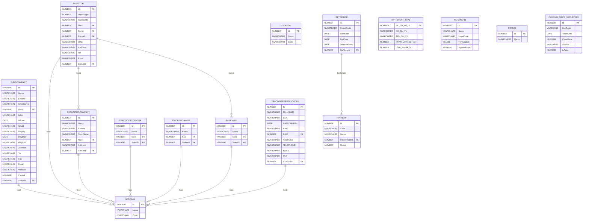

# FIMS HLD — Tier 1

**Source system:** FIMS (Hệ thống quản lý giám sát và công bố thông tin thành viên thị trường — Oracle)
**Tier 1:** Entity độc lập, không FK đến entity nghiệp vụ khác — chỉ FK đến Classification Value. Gồm 8 entity: Market Participant Organization (5 bảng nguồn gộp), Foreign Investor, Reporting Template, Reporting Period, Reporting Obligation Type, Warning Parameter, Trading Representative, Securities Closing Price.

> **Cập nhật (2026-07-10):** NATIONAL/LOCATION đã loại khỏi scope Atomic — dữ liệu địa
> giới hành chính chuyển sang chuẩn hóa tại nguồn **ECAT** (xem `ECAT_HLD_Tier1.md`).
> FIMS không tự thiết kế Geographic Area nữa, chỉ tham chiếu qua lookup giá trị. Xem
> mục 7f của `FIMS_HLD_Overview.md`.

---

## 6a. Bảng tổng quan BCV Concept

| BCV Core Object | BCV Concept | Category | Source Table | Mô tả bảng nguồn | Atomic Entity | table_type | BCV Term |
|---|---|---|---|---|---|---|---|
| Involved Party | [Involved Party] Organization | Organization | FUNDCOMPANY | Danh sách công ty quản lý quỹ — đối tượng thành viên thị trường gửi báo cáo lên UBCKNN | Market Participant Organization | Fundamental | (1) BCV term `[Involved Party] Organization` — tổ chức là Involved Party tham gia thị trường. (2) FUNDCOMPANY: Name, EName, ShortName, IdNo, RegNo, StatusId, Capital — đây là profile tổ chức pháp nhân đầy đủ. (3) Chọn `[Involved Party] Organization`. Gộp 5 bảng nguồn (FUNDCOMPANY, SECURITIESCOMPANY, BANKMONI, DEPOSITORYCENTER, STOCKEXCHANGE) thành 1 entity phân biệt bằng `FIMS_MARKET_PARTICIPANT_TYPE`. |
| Involved Party | [Involved Party] Organization | Organization | SECURITIESCOMPANY | Danh sách công ty chứng khoán — đối tượng thành viên thị trường | Market Participant Organization | Fundamental | Cùng entity với FUNDCOMPANY — gộp vào Market Participant Organization, `FIMS_MARKET_PARTICIPANT_TYPE = SECURITIES_COMPANY`. |
| Involved Party | [Involved Party] Organization | Organization | BANKMONI | Danh sách ngân hàng lưu ký giám sát — đối tượng thành viên thị trường | Market Participant Organization | Fundamental | Cùng entity với FUNDCOMPANY — gộp vào Market Participant Organization, `FIMS_MARKET_PARTICIPANT_TYPE = CUSTODIAN_BANK`. |
| Involved Party | [Involved Party] Organization | Organization | DEPOSITORYCENTER | Danh sách Trung tâm lưu ký chứng khoán (VSDC) — đối tượng thành viên thị trường | Market Participant Organization | Fundamental | Cùng entity với FUNDCOMPANY — gộp vào Market Participant Organization, `FIMS_MARKET_PARTICIPANT_TYPE = DEPOSITORY_CENTER`. |
| Involved Party | [Involved Party] Organization | Organization | STOCKEXCHANGE | Danh sách sở giao dịch chứng khoán — đối tượng thành viên thị trường | Market Participant Organization | Fundamental | Cùng entity với FUNDCOMPANY — gộp vào Market Participant Organization, `FIMS_MARKET_PARTICIPANT_TYPE = STOCK_EXCHANGE`. |
| Involved Party | [Involved Party] Individual | Individual | INVESTOR | Danh sách nhà đầu tư nước ngoài (cá nhân và tổ chức) đăng ký hoạt động tại Việt Nam theo quy định UBCKNN | Foreign Investor | Fundamental | (1) BCV term `[Involved Party] Individual` — đây là cá nhân/tổ chức nước ngoài. (2) INVESTOR: ObjectType(1=Cá nhân, 2=Tổ chức), IdNo, NaId, Address, Tel, Email, StatusId — profile NĐT NN với thông tin nhận dạng và liên lạc. (3) ObjectType gộp cả cá nhân lẫn tổ chức → 1 entity dùng Classification Value phân biệt. Chọn `[Involved Party] Individual` vì primary use case là cá nhân; tổ chức NĐT NN là ngoại lệ (ít trường hơn). |
| Business Activity | [Business Activity] Business Activity | Business Activity | RPTTEMP | Danh sách biểu mẫu báo cáo định kỳ do UBCKNN ban hành — master template mà thành viên thị trường phải nộp | Reporting Template | Fundamental | (1) BCV term `[Business Activity] Business Activity` — biểu mẫu báo cáo định nghĩa một nghĩa vụ hoạt động. (2) RPTTEMP: mã biểu mẫu, tên, loại báo cáo, trạng thái, phiên bản — đây là chuẩn báo cáo pháp lý. (3) Không phải Entity "Arrangement" (không có tài khoản/hợp đồng) hay "Documentation" (không phải hồ sơ cụ thể) → BCV `[Business Activity] Business Activity`. |
| Business Activity | [Business Activity] Assessment Period | Period | RPTPERIOD | Danh sách kỳ báo cáo định kỳ gắn với biểu mẫu — xác định ngày bắt đầu, kết thúc, hạn nộp | Reporting Period | Fundamental | (1) BCV term `[Business Activity] Assessment Period` — kỳ đánh giá/báo cáo. (2) RPTPERIOD: mã kỳ, ngày bắt đầu, ngày kết thúc, hạn nộp, FK đến RPTTEMP. (3) Kỳ báo cáo pháp lý mang ngữ nghĩa "assessment period" rõ ràng → chọn `[Business Activity] Assessment Period`. |
| Business Activity | [Business Activity] Business Activity | Business Activity | RPT_EVENT_TYPE | Danh mục loại sự vụ/nghĩa vụ báo cáo mà thành viên thị trường phải thực hiện theo pháp luật | Reporting Obligation Type | Fundamental | (1) BCV term `[Business Activity] Business Activity` — loại sự vụ định nghĩa một nghĩa vụ hoạt động. (2) RPT_EVENT_TYPE: MA_SU_VU, TEN_SU_VU, PHAN_LOAI_SU_VU, LOAI_NGHIA_VU — phân loại nghĩa vụ báo cáo/CBTT/hồ sơ. (3) Đây là danh mục loại nghĩa vụ (master reference) chứ không phải instance → Fundamental (Classification có cấu trúc rộng hơn Code+Name). |
| Condition | [Condition] Scoring Criterion | Scoring Criterion | PARAWARN | Danh sách tham số cảnh báo giám sát — định nghĩa chỉ tiêu theo dõi thành viên thị trường kèm công thức tính | Warning Parameter | Fundamental | (1) BCV term `[Condition] Scoring Criterion` — tham số cảnh báo là tiêu chí chấm điểm/đánh giá. (2) PARAWARN: Name, LegalCode, FormulaInfo (NCLOB), SystemObject — tham số kỹ thuật với công thức. (3) Đây là "criterion" định nghĩa ngưỡng đánh giá, không phải Condition instance → `[Condition] Scoring Criterion`. Nền tảng cho Warning Condition (Tier 2). |
| Involved Party | [Involved Party] Registered Representative | Agent | TRADINGREPRESENTATIVE | Danh sách đại diện giao dịch — cá nhân đại diện cho NĐT nước ngoài thực hiện giao dịch chứng khoán tại công ty CK | Trading Representative | Fundamental | (1) Term candidate `Registered Representative` (BCV Involved Party > Agent): "an Agent who is associated with a broker or dealer, who acts as an account executive for clients, advising them on trading investment products". (2) TRADINGREPRESENTATIVE: FullName, Sex, DateOfBirth, IdNo, NaId (FK→NATIONAL), Address, Telephone/Email/Fax, StatusId — đúng là hồ sơ cá nhân (Individual) đóng vai trò đại diện giao dịch tại CTCK cho NĐT NN, khớp cấu trúc `Registered Representative`. (3) Chọn `[Involved Party] Registered Representative`. Bị bỏ sót ở lần thiết kế trước dù được FK trực tiếp từ `RPTMEMBER.TradingRepresentativeId` (Tier 2) và `TRADINGAUTHORIZATION.TradingRepresentativeId` (Tier 3). Chỉ FK đến NATIONAL + STATUS (Classification/shared) → Tier 1. Grain = 1 Individual → tách IP Postal Address (Address) + IP Electronic Address (Telephone/Email/Fax) + IP Alt Identification (IdNo). Xem T1-05. |
| Condition | [Condition] Product Price Condition | Product Price Condition | CLOSING_PRICE_SECURITIES | Giá đóng cửa chứng khoán theo phiên giao dịch, nhận từ HOSE/HNX/UPCOM hoặc nhập tay | Securities Closing Price | Fact Snapshot | (1) Term candidate `Product Price Condition` (BCV Condition): "specifies the amount to be charged/valued for... a Financial Market Instrument" — giá chứng khoán là 1 dạng Product Price Condition. (2) CLOSING_PRICE_SECURITIES: SecCode (mã CK, không FK cấu trúc — chỉ denormalize Classification Value SECURITIES), TradeDate, ClosePrice, Source (HOSE/HNX/UPCOM/MANUAL), IsFake. Change Mode = Append, filter theo DateCreated — mỗi phiên 1 dòng giá, không update dòng cũ. (3) Đây chính là ví dụ mẫu "bảng giá cuối ngày" của Fact Snapshot pattern → Table Type = Fact Snapshot. Không FK đến entity nghiệp vụ nào (SecCode chỉ denormalize mã CK) → Tier 1. Xem T1-06 về nguồn gốc dữ liệu. |

---

## 6b. Diagram Source (Mermaid)

---

## 6c. Diagram Atomic (Mermaid)

```mermaid
erDiagram
    Market_Participant_Organization {
        bigint ds_market_participant_org_id PK
        string market_participant_org_code
        string market_participant_type_code
        string name
        string ename
        string short_name
        string geographic_area_code
        bigint geographic_area_id FK
        string activity_status_code
        string reg_no
        date reg_date
        decimal capital
        date ds_effective_from
        date ds_effective_to
        string ds_source_system
        timestamp ds_loaded_at
    }

    Geographic_Area {
        bigint ds_geographic_area_id PK
        string geographic_area_code
        string geographic_area_type_code
        string name
        string ds_source_system
    }

    IP_Postal_Address {
        bigint ds_ip_postal_address_id PK
        bigint ds_involved_party_id FK
        string address_type_code
        string address_text
    }

    IP_Electronic_Address {
        bigint ds_ip_electronic_address_id PK
        bigint ds_involved_party_id FK
        string electronic_address_type_code
        string electronic_address_value
    }

    IP_Alt_Identification {
        bigint ds_ip_alt_id_id PK
        bigint ds_involved_party_id FK
        string alt_id_type_code
        string alt_id_no
        date alt_id_date
        string alt_id_place
    }

    Foreign_Investor {
        bigint ds_foreign_investor_id PK
        string foreign_investor_code
        string investor_object_type_code
        bigint geographic_area_id FK
        string geographic_area_code
        string investor_type_code
        string activity_status_code
        timestamp ds_effective_from
        timestamp ds_effective_to
        string ds_source_system
        timestamp ds_loaded_at
    }

    Reporting_Template {
        bigint ds_reporting_template_id PK
        string reporting_template_code
        string name
        string report_type_code
        string activity_status_code
        string ds_source_system
        timestamp ds_loaded_at
    }

    Reporting_Period {
        bigint ds_reporting_period_id PK
        string reporting_period_code
        bigint ds_reporting_template_id FK
        string reporting_template_code
        date start_date
        date end_date
        date deadline_date
        string ds_source_system
        timestamp ds_loaded_at
    }

    Reporting_Obligation_Type {
        bigint ds_reporting_obligation_type_id PK
        string reporting_obligation_type_code
        string name
        string event_category_code
        string obligation_category_code
        string ds_source_system
        timestamp ds_loaded_at
    }

    Warning_Parameter {
        bigint ds_warning_parameter_id PK
        string warning_parameter_code
        string name
        string legal_code
        string formula_info
        string system_object_type_code
        string ds_source_system
        timestamp ds_loaded_at
    }

    Trading_Representative {
        bigint ds_trading_representative_id PK
        string trading_representative_code
        string full_name
        string gender_code
        date date_of_birth
        bigint geographic_area_id FK
        string geographic_area_code
        string activity_status_code
        date ds_effective_from
        date ds_effective_to
        string ds_source_system
        timestamp ds_loaded_at
    }

    Securities_Closing_Price {
        bigint ds_securities_closing_price_id PK
        string securities_code
        date trade_date
        decimal close_price
        string price_source_code
        int is_estimated_flag
        string ds_source_system
        timestamp ds_loaded_at
    }

    Market_Participant_Organization ||--o{ Geographic_Area : "geographic_area_id"
    Market_Participant_Organization ||--o{ IP_Postal_Address : "ds_involved_party_id"
    Market_Participant_Organization ||--o{ IP_Electronic_Address : "ds_involved_party_id"
    Market_Participant_Organization ||--o{ IP_Alt_Identification : "ds_involved_party_id"
    Foreign_Investor ||--o{ Geographic_Area : "geographic_area_id"
    Foreign_Investor ||--o{ IP_Alt_Identification : "ds_involved_party_id"
    Reporting_Period ||--o{ Reporting_Template : "ds_reporting_template_id"
    Trading_Representative ||--o{ Geographic_Area : "geographic_area_id"
    Trading_Representative ||--o{ IP_Postal_Address : "ds_involved_party_id"
    Trading_Representative ||--o{ IP_Electronic_Address : "ds_involved_party_id"
    Trading_Representative ||--o{ IP_Alt_Identification : "ds_involved_party_id"
```

---

## 6d. Mục Danh mục & Tham chiếu (Reference Data)

| Source Field / Bảng | Mô tả | Scheme Code | source_type | Ghi chú |
|---|---|---|---|---|
| FUNDCOMPANY.StatusId → STATUS | Tình trạng hoạt động của tổ chức thành viên | `FIMS_ACTIVITY_STATUS` | source_table | Dùng chung cho cả 5 loại tổ chức thành viên + NĐT NN |
| INVESTOR.InvesTypeId → INVESTORTYPE | Loại nhà đầu tư nước ngoài | `FIMS_INVESTOR_TYPE` | source_table | |
| FUNDCOMPANY.CompanyTypeId → COMPANYTYPE | Loại hình doanh nghiệp | `FIMS_COMPANY_TYPE` | source_table | |
| INVESTOR.ObjectType | Loại đối tượng NĐT NN (cá nhân/tổ chức) | `FIMS_STOCKHOLDER_TYPE` | source_table | → FIMS.STOCKHOLDERTYPE |
| ETL-derived | Loại thành viên thị trường (QLQ/CTCK/NHLK/VSDC/Sở GD) | `FIMS_MARKET_PARTICIPANT_TYPE` | etl_derived | Phân biệt 5 bảng nguồn gộp chung |
| RPTTEMP.ReportTypeId → REPORTTYPE | Loại báo cáo thành viên | `FIMS_REPORT_TYPE` | source_table | |
| RPT_EVENT_TYPE.PHAN_LOAI_SU_VU | Phân loại sự vụ (định kỳ/bất thường/theo yêu cầu) | `FIMS_REPORTING_EVENT_CATEGORY` | etl_derived | |
| RPT_EVENT_TYPE.LOAI_NGHIA_VU | Loại nghĩa vụ (BC/CBTT/hồ sơ/khác) | `FIMS_REPORTING_OBLIGATION_CATEGORY` | etl_derived | |
| PARAWARN.SystemObject | Loại đối tượng áp dụng tham số cảnh báo | `FIMS_SYSTEM_OBJECT_TYPE` | etl_derived | 1=QLQ, 2=CTCK, 3=NHLK, 4=VSDC, 5=Sở GD, 7=CN QLQ NN |
| CLOSING_PRICE_SECURITIES.Source | Nguồn dữ liệu giá đóng cửa (HOSE/HNX/UPCOM/MANUAL) | `FIMS_PRICE_SOURCE` | source_table | |

---

## 6e. Bảng chờ thiết kế

*(Không có — tất cả bảng Tier 1 đã có thông tin cột đầy đủ)*

---

## 6f. Điểm cần xác nhận

| # | Câu hỏi | Kết quả |
|---|---|---|
| T1-01 | FUNDCOMPANY, SECURITIESCOMPANY, BANKMONI, DEPOSITORYCENTER, STOCKEXCHANGE có cấu trúc cột gần đồng nhất — xác nhận gộp 5 bảng thành 1 entity `Market Participant Organization` phân biệt bằng `FIMS_MARKET_PARTICIPANT_TYPE`? | Đề xuất: Gộp. Cấu trúc (Name/EName/ShortName/NaId/IdNo/RegNo/Address/Tel/Fax/Email/Website/Capital/StatusId) đồng nhất. ETL union 5 bảng, thêm cột `market_participant_type_code` ETL-derived. |
| T1-02 | INVESTOR.ObjectType = 1 (cá nhân) và 2 (tổ chức) — có cần tách thành 2 entity riêng (Foreign Investor Individual + Foreign Investor Organization) không? | Đề xuất: Giữ 1 entity, phân biệt bằng `investor_object_type_code`. Cấu trúc cột đồng nhất — không có cột riêng cho từng loại. |
| T1-03 | RPTTEMP và RPTPERIOD — xác nhận đây là entity nghiệp vụ (không phải config IT) cần thiết kế Atomic? | Cần xác nhận. Nếu RPTTEMP là template cố định do UBCKNN ban hành → in scope. Nếu là config UI của hệ thống → ngoài scope. |
| T1-04 | Geographic Area — FIMS.NATIONAL và FIMS.LOCATION có nên bổ sung vào shared entity `Geographic Area` không? | **Đã chốt (2026-07-10) — không bổ sung.** Geographic Area chỉ còn 1 nguồn duy nhất là ECAT. NATIONAL/LOCATION loại khỏi scope (xem 7f Overview). Entity FIMS đang FK đến NATIONAL (Market Participant Organization, Foreign Investor, Trading Representative) sẽ resolve bằng lookup giá trị đối chiếu Geographic Area nguồn ECAT khi được thiết kế LLD. |
| T1-05 | `TRADINGREPRESENTATIVE` là bảng riêng cho đại diện giao dịch, nhưng `INFODISCREPRES.ProfileKind = 6` (`FIMS_PROFILE_KIND` scheme, Tier 2) cũng có giá trị "Đại diện giao dịch" (`TRADING_REPRESENTATIVE`). Đây có phải 2 cách lưu trùng lặp cho cùng 1 vai trò nghiệp vụ, hay `INFODISCREPRES` chỉ dùng ProfileKind=6 cho mục đích phân loại lịch sử/di trú dữ liệu còn `TRADINGREPRESENTATIVE` mới là bảng vận hành hiện tại? | Cần xác nhận với đội FIMS. Nếu trùng lặp → cân nhắc gộp `Trading Representative` vào `Info Disclosure Representative` (dùng Profile Kind Code phân biệt) thay vì giữ 2 entity riêng. Tạm thời giữ tách biệt vì `TRADINGREPRESENTATIVE` có PK và FK độc lập, được `RPTMEMBER`/`TRADINGAUTHORIZATION` FK trực tiếp (không qua `INFODISCREPRES`). |
| T1-06 | `CLOSING_PRICE_SECURITIES.Source` = HOSE/HNX/UPCOM/MANUAL — xác nhận FIMS có phải nguồn gốc dữ liệu giá hay chỉ cache lại từ sàn giao dịch để tính toán nội bộ (VD: tính tỷ lệ sở hữu/room ngoại trên `Foreign Investor Securities Account`)? | Không ảnh hưởng quyết định scope (đã in-scope vì FIMS lưu bản ghi giá cục bộ phục vụ nghiệp vụ giám sát), nhưng cần ghi rõ trong LLD: `ds_source_system = FIMS` chỉ phản ánh nơi bản ghi được lưu, `price_source_code` mới là nguồn gốc giá thực tế (HOSE/HNX/UPCOM/MANUAL). |
| T1-07 | **[GHI NHẬN 2026-07-19]** `INVESTOR` có cột `Address` (địa chỉ) và `Telephone/Fax/Email/Website` (liên lạc) nhưng HLD ban đầu chỉ ghi "Tách IP Alt Identification", bỏ sót IP Postal Address + IP Electronic Address. | Áp dụng quy tắc bắt buộc "grain = Involved Party → luôn tách đủ 3 shared entity" khi thiết kế LLD (`lld_FIMS_INVESTOR_IP_Postal_Address.yaml`, `lld_FIMS_INVESTOR_IP_Electronic_Address.yaml`) — không phụ thuộc HLD Tier có liệt kê hay không. Đã đồng bộ lại 7a/Entities/diagram của `FIMS_HLD_Overview.md`. |
