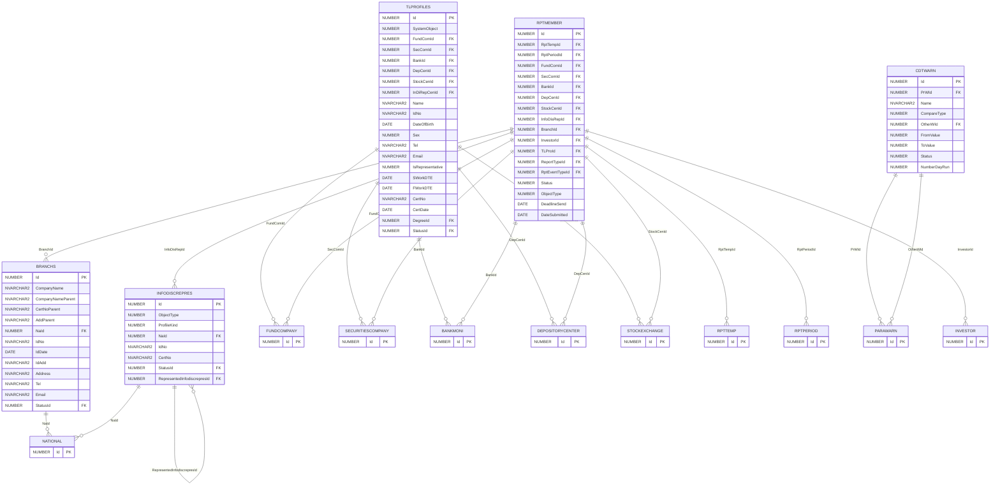

# FIMS HLD — Tier 2

**Source system:** FIMS (Hệ thống quản lý giám sát và công bố thông tin thành viên thị trường — Oracle)
**Tier 2:** Entity có FK đến Tier 1. Gồm 5 entity: Foreign FM Branch Organization (FK đến Geographic Area), Info Disclosure Representative (self-ref + FK Geographic Area), Market Participant Key Person (FK đến Market Participant Organization), Member Periodic Report (FK đến Reporting Template + Reporting Period + Market Participant Organization + Reporting Obligation Type), Warning Condition (FK đến Warning Parameter).

---

## 6a. Bảng tổng quan BCV Concept

| BCV Core Object | BCV Concept | Category | Source Table | Mô tả bảng nguồn | Atomic Entity | table_type | BCV Term |
|---|---|---|---|---|---|---|---|
| Involved Party | [Involved Party] Organization | Organization | BRANCHS | Chi nhánh hoặc văn phòng đại diện tại Việt Nam của công ty quản lý quỹ nước ngoài | Foreign FM Branch Organization | Fundamental | (1) BCV term `[Involved Party] Organization` — chi nhánh/VPĐD là tổ chức pháp nhân tại Việt Nam. (2) BRANCHS: CompanyNameParent, CertNoParent, AddParent, NaId (FK→NATIONAL cho quốc gia công ty mẹ), có IdNo/IdDate/IdAdd và profile địa chỉ VN riêng. (3) Entity độc lập — không FK đến FUNDCOMPANY (công ty mẹ nước ngoài, không phải FUNDCOMPANY trong hệ thống). Tier 2 vì FK đến NATIONAL (Geographic Area T1). Chọn `[Involved Party] Organization`. |
| Involved Party | [Involved Party] Organization | Organization | INFODISCREPRES | Danh sách đại diện CBTT/giao dịch được thành viên thị trường ủy quyền — 10 loại đối tượng | Info Disclosure Representative | Fundamental | (1) BCV term `[Involved Party] Organization` — đại diện CBTT là tổ chức/cá nhân được ủy quyền. (2) INFODISCREPRES: ProfileKind (10 loại), ObjectType, NaId, IdNo, CertNo, RepresentedInfodiscrepresId (self-ref), StatusId. (3) Self-referencing cây ủy quyền. ProfileKind gộp nhiều loại đối tượng → 1 entity phân biệt bằng `FIMS_PROFILE_KIND`. Tier 2 vì FK đến NATIONAL + STATUS. |
| Involved Party | [Involved Party] Individual Employment Status | Employment Status | TLPROFILES | Danh sách nhân sự chủ chốt tại các tổ chức thành viên thị trường đăng ký với UBCKNN | Market Participant Key Person | Fundamental | (1) BCV term `[Involved Party] Individual Employment Status` — nhân sự hành nghề tại tổ chức thành viên. (2) TLPROFILES: SystemObject (1=QLQ, 2=CTCK, 3=NHLK, 4=VSDC, 5=Sở GD, 7=CN QLQ NN), FundComId/SecComId/BankId/DepCenId/StockCenId (FK đa hướng đến 5 loại tổ chức), Name, IdNo, DateOfBirth, Sex, Tel, Email, IsRepresentative, CertNo, DegreeId, StatusId. (3) Đây là "employment status" — nhân sự đang làm việc tại tổ chức thành viên cụ thể. Tier 2 vì FK đến Market Participant Organization (T1). |
| Documentation | [Documentation] Gov. Registration Document | Government Registration Document | RPTMEMBER | Hồ sơ kỳ báo cáo của thành viên thị trường gửi UBCKNN — 1 bản ghi per thành viên per kỳ per biểu mẫu | Member Periodic Report | Fundamental | (1) BCV term `[Documentation] Gov. Registration Document` — báo cáo định kỳ pháp lý gửi cơ quan quản lý. (2) RPTMEMBER: FK đến 7 loại thành viên + RPTTEMP + RPTPERIOD + INFODISCREPRES + BRANCHS + REPORTTYPE + RPT_EVENT_TYPE + INVESTOR + TRADINGREPRESENTATIVE; Status, ObjectType, DeadlineSend, DateSubmitted. (3) Đây là hồ sơ pháp lý (gov. registration document) — báo cáo bắt buộc theo quy định pháp luật. Change Mode = Update → Fundamental SCD4A (trạng thái hiện tại). Tier 2 vì FK đến T1 entities. |
| Condition | [Condition] Scoring Criterion | Scoring Criterion | CDTWARN | Danh sách điều kiện cảnh báo giám sát — ngưỡng min/max cho từng tham số cảnh báo | Warning Condition | Fundamental | (1) BCV term `[Condition] Scoring Criterion` — điều kiện cảnh báo là tiêu chí đánh giá ngưỡng. (2) CDTWARN: PrWId (FK→PARAWARN primary), OtherWId (FK→PARAWARN secondary), FromValue, ToValue, NumberDayRun, CompareType, Status. (3) Đây là điều kiện cụ thể hóa tham số thành ngưỡng kích hoạt cảnh báo → `[Condition] Scoring Criterion`. FK đến Warning Parameter (T1) → Tier 2. |

---

## 6b. Diagram Source (Mermaid)

---

## 6c. Diagram Atomic (Mermaid)

```mermaid
erDiagram
    Foreign_FM_Branch_Organization {
        bigint ds_foreign_fm_branch_org_id PK
        string foreign_fm_branch_org_code
        string company_name
        string parent_company_name
        string parent_cert_no
        string parent_address
        bigint geographic_area_id FK
        string geographic_area_code
        string id_no
        date id_date
        string id_place
        string address
        string activity_status_code
        timestamp ds_effective_from
        timestamp ds_effective_to
        string ds_source_system
        timestamp ds_loaded_at
    }

    Info_Disclosure_Representative {
        bigint ds_info_disclosure_rep_id PK
        string info_disclosure_rep_code
        string object_type_code
        string profile_kind_code
        bigint geographic_area_id FK
        string geographic_area_code
        string id_no
        string cert_no
        bigint parent_info_disclosure_rep_id FK
        string activity_status_code
        timestamp ds_effective_from
        timestamp ds_effective_to
        string ds_source_system
        timestamp ds_loaded_at
    }

    Market_Participant_Key_Person {
        bigint ds_market_participant_key_person_id PK
        string market_participant_key_person_code
        bigint market_participant_org_id FK
        string market_participant_org_code
        string system_object_type_code
        string name
        string id_no
        date date_of_birth
        string gender_code
        string cert_no
        date cert_date
        date start_work_date
        date end_work_date
        string degree_code
        int is_representative
        array job_type_codes
        string activity_status_code
        timestamp ds_effective_from
        timestamp ds_effective_to
        string ds_source_system
        timestamp ds_loaded_at
    }

    Member_Periodic_Report {
        bigint ds_member_periodic_report_id PK
        string member_periodic_report_code
        bigint ds_reporting_template_id FK
        string reporting_template_code
        bigint ds_reporting_period_id FK
        string reporting_period_code
        bigint ds_market_participant_org_id FK
        string market_participant_org_code
        string market_participant_type_code
        bigint ds_reporting_obligation_type_id FK
        string reporting_obligation_type_code
        string report_submission_status_code
        string report_type_code
        date deadline_date
        date submitted_date
        timestamp ds_effective_from
        timestamp ds_effective_to
        string ds_source_system
        timestamp ds_loaded_at
    }

    Warning_Condition {
        bigint ds_warning_condition_id PK
        string warning_condition_code
        string name
        bigint primary_warning_parameter_id FK
        string primary_warning_parameter_code
        bigint secondary_warning_parameter_id FK
        string secondary_warning_parameter_code
        decimal from_value
        decimal to_value
        int number_day_run
        string compare_type_code
        int is_active
        string ds_source_system
        timestamp ds_loaded_at
    }

    Geographic_Area {
        bigint ds_geographic_area_id PK
    }

    Market_Participant_Organization {
        bigint ds_market_participant_org_id PK
    }

    Reporting_Template {
        bigint ds_reporting_template_id PK
    }

    Reporting_Period {
        bigint ds_reporting_period_id PK
    }

    Reporting_Obligation_Type {
        bigint ds_reporting_obligation_type_id PK
    }

    Warning_Parameter {
        bigint ds_warning_parameter_id PK
    }

    Foreign_FM_Branch_Organization ||--o{ Geographic_Area : "geographic_area_id"
    Info_Disclosure_Representative ||--o{ Geographic_Area : "geographic_area_id"
    Info_Disclosure_Representative ||--o{ Info_Disclosure_Representative : "parent_info_disclosure_rep_id"
    Market_Participant_Key_Person ||--o{ Market_Participant_Organization : "market_participant_org_id"
    Member_Periodic_Report ||--o{ Reporting_Template : "ds_reporting_template_id"
    Member_Periodic_Report ||--o{ Reporting_Period : "ds_reporting_period_id"
    Member_Periodic_Report ||--o{ Market_Participant_Organization : "ds_market_participant_org_id"
    Member_Periodic_Report ||--o{ Reporting_Obligation_Type : "ds_reporting_obligation_type_id"
    Warning_Condition ||--o{ Warning_Parameter : "primary_warning_parameter_id"
    Warning_Condition ||--o{ Warning_Parameter : "secondary_warning_parameter_id"
```

---

## 6d. Mục Danh mục & Tham chiếu (Reference Data)

| Source Field / Bảng | Mô tả | Scheme Code | source_type | Ghi chú |
|---|---|---|---|---|
| INFODISCREPRES.ProfileKind | Phân loại đối tượng đại diện CBTT (10 loại) | `FIMS_PROFILE_KIND` | etl_derived | Giá trị 1–10 ánh xạ thành code tường minh |
| INFODISCREPRES.ObjectType | Loại đối tượng (cá nhân/tổ chức) | `FIMS_STOCKHOLDER_TYPE` | source_table | → FIMS.STOCKHOLDERTYPE |
| TLPROFILES.SystemObject | Loại tổ chức thành viên (1–7) | `FIMS_SYSTEM_OBJECT_TYPE` | etl_derived | Dùng để xác định FK đúng trong ETL đa hướng |
| TLPROFILES.DegreeId → DEGREE | Trình độ học vấn nhân sự | `FIMS_DEGREE` | source_table | |
| TLPROFILES.Sex | Giới tính nhân sự | `INDIVIDUAL_GENDER` | modeler_defined | Dùng shared scheme (0=Nam, 1=Nữ — cần profile) |
| TLPROFILES.JobTypes → TLPROJOB | Chức vụ nhân sự (denormalize từ junction TLPROJOB) | `FIMS_JOB_TYPE` | source_table | ARRAY trong `job_type_codes` |
| RPTMEMBER.Status | Trạng thái nộp báo cáo (1–5) | `FIMS_REPORT_SUBMISSION_STATUS` | etl_derived | Giá trị 1–5 ánh xạ thành code |
| RPTMEMBER.ReportTypeId → REPORTTYPE | Loại báo cáo | `FIMS_REPORT_TYPE` | source_table | |
| CDTWARN.Status | Cờ kích hoạt điều kiện cảnh báo (1=active, 0=inactive) | `FIMS_ACTIVITY_STATUS` | etl_derived | Boolean → map ACTIVE/INACTIVE |

---

## 6e. Bảng chờ thiết kế

*(Không có — tất cả bảng Tier 2 đã có thông tin cột đầy đủ)*

---

## 6f. Điểm cần xác nhận

| # | Câu hỏi | Kết quả |
|---|---|---|
| T2-01 | RPTMEMBER.Status = Update (Change Mode) nhưng mỗi dòng = 1 báo cáo định kỳ pháp lý. Xác nhận Table Type = Fundamental SCD4A (trạng thái hiện tại) hay Fact Append (mỗi gửi = 1 event)? | Đề xuất: Fundamental SCD4A. Lý do: 1 thành viên chỉ có 1 bản ghi per kỳ per biểu mẫu; khi gửi lại → update Status và DateSubmitted. Lịch sử xử lý được capture riêng tại RPTPROCESS (Tier 3 Fact Append). |
| T2-02 | INFODISCREPRES.ProfileKind có 10 loại — có cần tách 10 entity riêng không? | Đề xuất: Giữ 1 entity. Cấu trúc cột đồng nhất, phân biệt bằng `FIMS_PROFILE_KIND`. |
| T2-03 | TLPROFILES có FK đến cả FUNDCOMPANY, SECURITIESCOMPANY, BANKMONI, DEPOSITORYCENTER, STOCKEXCHANGE và cả INFODISCREPRES — nhân sự làm việc tại tổ chức nào thì FK tương ứng non-null còn lại null. ETL cần xử lý: lấy FK nào để map `market_participant_org_id`? | Đề xuất: Dùng SystemObject để xác định bảng nguồn, sau đó COALESCE(FundComId, SecComId, BankId, DepCenId, StockCenId) → lookup `ds_market_participant_org_id`. |
| T2-04 | RPTMEMBER có cả FK đến INFODISCREPRES và BRANCHS song song với FK đến 5 loại tổ chức thành viên. Grain = thành viên thị trường nào nộp báo cáo này? ObjectType xác định loại thành viên. | Cần xác nhận: ObjectType có map 1-1 với các FK (ví dụ ObjectType=1 → FUNDCOMPANY) không? Hay có trường hợp ObjectType=CN_QLQ_NN → dùng BRANCHS thay vì 5 bảng thành viên thông thường? |
