# FIMS HLD — Tier 3

**Source system:** FIMS (Hệ thống quản lý giám sát và công bố thông tin thành viên thị trường — Oracle)
**Tier 3:** Entity có FK đến Tier 2. Gồm 7 entity: Foreign Investor Securities Account (FK→Foreign Investor + Market Participant Organization; gộp thêm CATEGORIESSTOCK — cùng grain Investor×Securities Company), Report Import Value (FK→Member Periodic Report), Report Processing Activity Log (FK→Member Periodic Report), Market Participant Conduct Violation (FK→Market Participant Organization + Warning Condition + Warning Parameter), Info Disclosure Authorization (FK→Market Participant Organization + Info Disclosure Representative), Trading Authorization (FK→Foreign Investor + Market Participant Organization + Trading Representative), Info Disclosure Announcement (FK→Member Periodic Report + Info Disclosure Representative + Foreign Investor + Market Participant Organization + Reporting Obligation Type).

---

## 6a. Bảng tổng quan BCV Concept

| BCV Core Object | BCV Concept | Category | Source Table | Mô tả bảng nguồn | Atomic Entity | table_type | BCV Term |
|---|---|---|---|---|---|---|---|
| Arrangement | [Arrangement] Investment Account | Investment Account | SECURITIESACCOUNT | Danh sách tài khoản giao dịch chứng khoán của nhà đầu tư nước ngoài mở tại công ty chứng khoán | Foreign Investor Securities Account | Fundamental | (1) BCV term `[Arrangement] Investment Account` — tài khoản giao dịch là arrangement giữa NĐT và CTCK. (2) SECURITIESACCOUNT: InvesId (FK→INVESTOR), SecId (FK→SECURITIESCOMPANY), Account (số tài khoản), OpenPlace. (3) Đây là tài khoản đầu tư mở tại tổ chức tài chính → `[Arrangement] Investment Account`. FK đến Foreign Investor (T1) + Market Participant Organization (T1) → Tier 3 theo dependency. **[ĐÃ ĐIỀU CHỈNH — quyết định Data Modeler 2026-07-19]** Table Type đổi từ Relative sang Fundamental (qua CATEGORIESSTOCK — xem dòng dưới); entity được xem là tài khoản gốc có lifecycle độc lập, không chỉ là thuộc tính bổ sung SCD2 của Foreign Investor/Market Participant Organization. |
| Arrangement | [Arrangement] Investment Account | Investment Account | CATEGORIESSTOCK | Danh mục chứng khoán NĐT NN đang nắm giữ tại 1 công ty chứng khoán — số lượng và tỷ lệ sở hữu hiện tại | Foreign Investor Securities Account | Fundamental | (1) CATEGORIESSTOCK: InvesId (FK→INVESTOR), SecId (FK→SECURITIESCOMPANY), Quantity, Rate (tỷ lệ sở hữu %) — **cùng cặp FK (Investor, Securities Company) với SECURITIESACCOUNT**, không có FK riêng đến 1 mã chứng khoán cụ thể (không FK đến SECURITIES). (2) Áp dụng quy tắc "Gộp entity khi hợp lý" — cùng grain 1 NĐT NN × 1 CTCK, chỉ khác thuộc tính (SECURITIESACCOUNT lưu số tài khoản/nơi mở, CATEGORIESSTOCK lưu số lượng/tỷ lệ sở hữu hiện tại). Không tạo entity riêng — gộp `current_holding_quantity` + `current_ownership_rate` làm thuộc tính bổ sung trên `Foreign Investor Securities Account`, thêm CATEGORIESSTOCK vào `source_table`. (3) `CATEGORIESSTOCKHIS` (lịch sử) giữ nguyên ngoài scope — audit log nguồn cho 2 trường này. **[ĐÃ ĐIỀU CHỈNH — quyết định Data Modeler 2026-07-19]** Table Type của `Foreign Investor Securities Account` đổi từ Relative sang Fundamental (SCD4A thay vì SCD2). |
| Documentation | [Documentation] Gov. Registration Document | Government Registration Document | RPTVALUES | Dữ liệu giá trị từng ô (cell) trong báo cáo định kỳ thành viên — bảng phân vùng theo năm | Report Import Value | Fact Append | (1) BCV term `[Documentation] Gov. Registration Document` — giá trị báo cáo là dữ liệu nội dung hồ sơ pháp lý. (2) RPTVALUES: RptMemberId (FK→RPTMEMBER), SheetId (FK→SHEET), Code (mã chỉ tiêu), Values (giá trị string), FormatDataType, IsDynamic. Bảng phân vùng RPTVALUES_YYYY. (3) Grain = 1 field per báo cáo thành viên. Change Mode = Update nhưng ETL cần xác nhận: tái nộp tạo dòng mới hay update? Fact Append nếu immutable; xem mục T3-01. |
| Business Activity | [Business Activity] Status Log | Status Log | RPTPROCESS | Lịch sử xử lý báo cáo của chuyên viên UBCKNN — duyệt/từ chối/yêu cầu gửi lại | Report Processing Activity Log | Fact Append | (1) BCV term ETL Pattern `[Business Activity] Status Log` — nhật ký sự kiện xử lý trạng thái. (2) RPTPROCESS: RptMemberId (FK→RPTMEMBER), UserId (FK→USERS), Status, Comment, DateChange. (3) Đây là event log ghi nhận từng hành động của cán bộ UBCKNN — insert-only (không update). Fact Append. |
| Business Activity | [Business Activity] Conduct Violation | Conduct Violation | VIOLT | Danh sách vi phạm điều kiện cảnh báo giám sát của thành viên thị trường | Market Participant Conduct Violation | Fact Append | (1) BCV term `[Business Activity] Conduct Violation` — vi phạm là sự kiện hoạt động. (2) VIOLT: FK đến các loại tổ chức thành viên (QLQ/CTCK/NHLK/VSDC/Sở GD/CN QLQ NN) + PrWId (FK→PARAWARN) + CDTWarnId (FK→CDTWARN); Change Mode = Append. (3) Mỗi dòng = 1 vi phạm phát sinh → Fact Append. Tier 3 vì FK đến Warning Condition (T2) + Market Participant Organization (T1). |
| Documentation | [Documentation] Gov. Registration Document | Government Registration Document | AUTHOANNOUNCE | Danh sách ủy quyền CBTT — thành viên thị trường ủy quyền cho đại diện CBTT | Info Disclosure Authorization | Fundamental | (1) BCV term `[Documentation] Gov. Registration Document` — giấy ủy quyền là hồ sơ pháp lý. (2) AUTHOANNOUNCE: FK đến nhiều loại tổ chức thành viên + InfoDisRepId (FK→INFODISCREPRES); có StartDate, EndDate, RelatedPropertyId. (3) Đây là văn bản ủy quyền có hiệu lực pháp lý → Gov. Registration Document. Fundamental SCD4A (ủy quyền có thể hết hạn/thu hồi). Tier 3 vì FK đến Info Disclosure Representative (T2). |
| Arrangement | [Arrangement] Authority Arrangement | Authority Arrangement | TRADINGAUTHORIZATION | Danh sách ủy quyền giao dịch — nhà đầu tư nước ngoài ủy quyền cho đại diện giao dịch | Trading Authorization | Fundamental | (1) **[ĐÃ ĐIỀU CHỈNH — quyết định Data Modeler 2026-07-19]** BCO đổi từ Documentation sang Arrangement. Term mới "Authority Arrangement" (Arrangement, id 6846): "Identifies an Involved Party Arrangement which specifies the manner in which one Involved Party has the power to act for another; for example, a specific Power Of Attorney Arrangement" — khớp trực tiếp bản chất TRADINGAUTHORIZATION: Foreign Investor (Involved Party) ủy quyền cho Trading Representative (Involved Party) hành động thay mặt trong giao dịch. Term cũ "Gov. Registration Document" bị loại vì trọng tâm dữ liệu là quan hệ ủy quyền giữa 2 Involved Party, không phải bản thân văn bản. (2) TRADINGAUTHORIZATION: FK đến INVESTOR + các loại tổ chức thành viên + LO (loại hình quỹ — cần xác nhận) + `TradingRepresentativeId` (FK→TRADINGREPRESENTATIVE, người được ủy quyền); StartDate, EndDate (thời hạn hiệu lực ủy quyền), RelatedPropertyId — đúng cấu trúc 1 Authority Arrangement giữa Investor và Trading Representative, có thời hạn. (3) Chọn `[Arrangement] Authority Arrangement`, Category "Authority Arrangement". Table Type giữ nguyên Fundamental SCD4A (ủy quyền có thể hết hạn/thu hồi — không thay đổi theo yêu cầu). Tier 3 vì FK đến Foreign Investor (T1) + Trading Representative (T1) — tuy nhiên FK đến LO cần xác nhận (xem T3-02). FK `TradingRepresentativeId` trước đây bị bỏ sót trên diagram — bổ sung tại lần cập nhật này. |
| Communication | [Communication] Announcement | Announcement | ANNOUNCE | Tin công bố thông tin (CBTT) của thành viên thị trường — bản tin cụ thể do 1 thành viên công bố theo 1 sự vụ/kỳ | Info Disclosure Announcement | Fundamental | (1) Term candidate `Announcement` (BCV Communication): "a Communication whose purpose is to make some information public or widely known" — khớp trực tiếp với "CBTT" (công bố thông tin). (2) ANNOUNCE: InRepId (FK→INFODISCREPRES), AnnounceTypeId (FK→ANNOUNCETYPE), FK đa hướng đến 5 loại tổ chức thành viên + BRANCHS + INVESTOR, RptMemberId (FK→RPTMEMBER), BcSuVuId (FK→RPT_EVENT_TYPE); YearValue/PeriodValue/PeriodType, ContentSummary, DateAnnounce, FileName/FileData, EformSubmissionJson — đúng cấu trúc 1 bản tin CBTT có nội dung, kỳ, file đính kèm. (3) Chọn `[Communication] Announcement`. Trước đây bị treo ở trạng thái "Isolated — cần đánh giá lại"; thực tế có FK rõ ràng đến `Member Periodic Report` (T2) và `Info Disclosure Representative` (T2) → không cô lập. Change Mode = Update → Fundamental SCD4A. Tier 3 vì FK cao nhất đến T2 (`Member Periodic Report`, `Info Disclosure Representative`). Domain Prefix `Info Disclosure` (cùng nhóm với Info Disclosure Representative, Info Disclosure Authorization). |

---

## 6b. Diagram Source (Mermaid)

```mermaid
erDiagram
    SECURITIESACCOUNT {
        NUMBER Id PK
        NUMBER InvesId FK
        NUMBER SecId FK
        NVARCHAR2 Account
        NVARCHAR2 OpenPlace
    }

    RPTVALUES {
        NUMBER Id PK
        NUMBER RptMemberId FK
        NUMBER PeriodId FK
        NUMBER SheetId FK
        NUMBER RptTempId FK
        NVARCHAR2 Values
        NVARCHAR2 Code
        NVARCHAR2 FormatDataType
        NUMBER IsDynamic
        NUMBER RowDynamic
        NVARCHAR2 FieldName
    }

    RPTPROCESS {
        NUMBER Id PK
        NUMBER RptMemberId FK
        NUMBER UserId FK
        NUMBER Status
        NVARCHAR2 Comment
        DATE DateChange
    }

    VIOLT {
        NUMBER Id PK
        NUMBER FundComId FK
        NUMBER SecComId FK
        NUMBER BankId FK
        NUMBER DepCenId FK
        NUMBER StockCenId FK
        NUMBER BranchId FK
        NUMBER PrWId FK
        NUMBER CDTWarnId FK
        DATE ViolationDate
        NVARCHAR2 Description
    }

    AUTHOANNOUNCE {
        NUMBER Id PK
        NUMBER FundComId FK
        NUMBER SecComId FK
        NUMBER BankId FK
        NUMBER DepCenId FK
        NUMBER StockCenId FK
        NUMBER BranchId FK
        NUMBER InfoDisRepId FK
        DATE StartDate
        DATE EndDate
        NUMBER RelatedPropertyId FK
    }

    TRADINGAUTHORIZATION {
        NUMBER Id PK
        NUMBER InvestorId FK
        NUMBER SecComId FK
        NUMBER BankId FK
        NUMBER LOId FK
        NUMBER TradingRepresentativeId FK
        DATE StartDate
        DATE EndDate
        NUMBER RelatedPropertyId FK
    }

    CATEGORIESSTOCK {
        NUMBER Id PK
        NUMBER InvesId FK
        NVARCHAR2 SecId FK
        NUMBER Quantity
        NUMBER Rate
    }

    ANNOUNCE {
        NUMBER Id PK
        NUMBER InRepId FK
        NUMBER AnnounceTypeId FK
        NUMBER FundComId FK
        NUMBER SecComId FK
        NUMBER BankId FK
        NUMBER DepCenId FK
        NUMBER StockCenId FK
        NUMBER BranchsId FK
        NUMBER InvestorId FK
        NUMBER RptMemberId FK
        NUMBER BcSuVuId FK
        NUMBER YearValue
        NVARCHAR2 PeriodValue
        NUMBER PeriodType
        NVARCHAR2 ContentSummary
        TIMESTAMP DateAnnounce
        NUMBER Status
    }

    INVESTOR {
        NUMBER Id PK
    }

    SECURITIESCOMPANY {
        NUMBER Id PK
    }

    FUNDCOMPANY {
        NUMBER Id PK
    }

    BANKMONI {
        NUMBER Id PK
    }

    DEPOSITORYCENTER {
        NUMBER Id PK
    }

    STOCKEXCHANGE {
        NUMBER Id PK
    }

    BRANCHS {
        NUMBER Id PK
    }

    RPTMEMBER {
        NUMBER Id PK
    }

    PARAWARN {
        NUMBER Id PK
    }

    CDTWARN {
        NUMBER Id PK
    }

    INFODISCREPRES {
        NUMBER Id PK
    }

    TRADINGREPRESENTATIVE {
        NUMBER ID PK
    }

    RPT_EVENT_TYPE {
        NUMBER BC_SU_VU_ID PK
    }

    ANNOUNCETYPE {
        NUMBER Id PK
    }

    SECURITIESACCOUNT ||--o{ INVESTOR : "InvesId"
    SECURITIESACCOUNT ||--o{ SECURITIESCOMPANY : "SecId"
    CATEGORIESSTOCK ||--o{ INVESTOR : "InvesId"
    CATEGORIESSTOCK ||--o{ SECURITIESCOMPANY : "SecId"
    RPTVALUES ||--o{ RPTMEMBER : "RptMemberId"
    RPTPROCESS ||--o{ RPTMEMBER : "RptMemberId"
    VIOLT ||--o{ FUNDCOMPANY : "FundComId"
    VIOLT ||--o{ SECURITIESCOMPANY : "SecComId"
    VIOLT ||--o{ BANKMONI : "BankId"
    VIOLT ||--o{ DEPOSITORYCENTER : "DepCenId"
    VIOLT ||--o{ STOCKEXCHANGE : "StockCenId"
    VIOLT ||--o{ BRANCHS : "BranchId"
    VIOLT ||--o{ PARAWARN : "PrWId"
    VIOLT ||--o{ CDTWARN : "CDTWarnId"
    AUTHOANNOUNCE ||--o{ FUNDCOMPANY : "FundComId"
    AUTHOANNOUNCE ||--o{ SECURITIESCOMPANY : "SecComId"
    AUTHOANNOUNCE ||--o{ BANKMONI : "BankId"
    AUTHOANNOUNCE ||--o{ DEPOSITORYCENTER : "DepCenId"
    AUTHOANNOUNCE ||--o{ STOCKEXCHANGE : "StockCenId"
    AUTHOANNOUNCE ||--o{ BRANCHS : "BranchId"
    AUTHOANNOUNCE ||--o{ INFODISCREPRES : "InfoDisRepId"
    TRADINGAUTHORIZATION ||--o{ INVESTOR : "InvestorId"
    TRADINGAUTHORIZATION ||--o{ SECURITIESCOMPANY : "SecComId"
    TRADINGAUTHORIZATION ||--o{ BANKMONI : "BankId"
    TRADINGAUTHORIZATION ||--o{ TRADINGREPRESENTATIVE : "TradingRepresentativeId"
    ANNOUNCE ||--o{ INFODISCREPRES : "InRepId"
    ANNOUNCE ||--o{ ANNOUNCETYPE : "AnnounceTypeId"
    ANNOUNCE ||--o{ FUNDCOMPANY : "FundComId"
    ANNOUNCE ||--o{ SECURITIESCOMPANY : "SecComId"
    ANNOUNCE ||--o{ BANKMONI : "BankId"
    ANNOUNCE ||--o{ DEPOSITORYCENTER : "DepCenId"
    ANNOUNCE ||--o{ STOCKEXCHANGE : "StockCenId"
    ANNOUNCE ||--o{ BRANCHS : "BranchsId"
    ANNOUNCE ||--o{ INVESTOR : "InvestorId"
    ANNOUNCE ||--o{ RPTMEMBER : "RptMemberId"
    ANNOUNCE ||--o{ RPT_EVENT_TYPE : "BcSuVuId"
```

---

## 6c. Diagram Atomic (Mermaid)

```mermaid
erDiagram
    Foreign_Investor_Securities_Account {
        bigint ds_foreign_investor_securities_account_id PK
        string account_no
        bigint ds_foreign_investor_id FK
        string foreign_investor_code
        bigint ds_market_participant_org_id FK
        string market_participant_org_code
        string open_place
        decimal current_holding_quantity
        decimal current_ownership_rate
        timestamp ds_effective_from
        timestamp ds_effective_to
        string ds_source_system
        timestamp ds_loaded_at
    }

    Report_Import_Value {
        bigint ds_report_import_value_id PK
        bigint ds_member_periodic_report_id FK
        string member_periodic_report_code
        string sheet_code
        string field_code
        string field_name
        string value
        string format_data_type
        int is_dynamic
        int row_dynamic
        string ds_source_system
        timestamp ds_loaded_at
    }

    Report_Processing_Activity_Log {
        bigint ds_report_processing_activity_log_id PK
        bigint ds_member_periodic_report_id FK
        string member_periodic_report_code
        string processed_by_user_code
        string processing_status_code
        string comment
        timestamp processing_date
        string ds_source_system
        timestamp ds_loaded_at
    }

    Market_Participant_Conduct_Violation {
        bigint ds_market_participant_conduct_violation_id PK
        bigint ds_market_participant_org_id FK
        string market_participant_org_code
        string market_participant_type_code
        bigint ds_warning_parameter_id FK
        string warning_parameter_code
        bigint ds_warning_condition_id FK
        string warning_condition_code
        date violation_date
        string description
        string ds_source_system
        timestamp ds_loaded_at
    }

    Info_Disclosure_Authorization {
        bigint ds_info_disclosure_authorization_id PK
        bigint ds_market_participant_org_id FK
        string market_participant_org_code
        string market_participant_type_code
        bigint ds_info_disclosure_rep_id FK
        string info_disclosure_rep_code
        date start_date
        date end_date
        string related_property_code
        array authorized_investor_ids
        timestamp ds_effective_from
        timestamp ds_effective_to
        string ds_source_system
        timestamp ds_loaded_at
    }

    Trading_Authorization {
        bigint ds_trading_authorization_id PK
        bigint ds_foreign_investor_id FK
        string foreign_investor_code
        bigint ds_market_participant_org_id FK
        string market_participant_org_code
        bigint ds_trading_representative_id FK
        string trading_representative_code
        date start_date
        date end_date
        string related_property_code
        array authorized_investor_ids
        timestamp ds_effective_from
        timestamp ds_effective_to
        string ds_source_system
        timestamp ds_loaded_at
    }

    Info_Disclosure_Announcement {
        bigint ds_info_disclosure_announcement_id PK
        string info_disclosure_announcement_code
        bigint ds_info_disclosure_rep_id FK
        string info_disclosure_rep_code
        string announcement_type_code
        bigint ds_market_participant_org_id FK
        string market_participant_org_code
        string market_participant_type_code
        bigint ds_foreign_investor_id FK
        string foreign_investor_code
        bigint ds_member_periodic_report_id FK
        string member_periodic_report_code
        bigint ds_reporting_obligation_type_id FK
        string reporting_obligation_type_code
        int year_value
        string period_value
        string period_type_code
        string content_summary
        timestamp announce_date
        string activity_status_code
        string ds_source_system
        timestamp ds_loaded_at
    }

    Foreign_Investor {
        bigint ds_foreign_investor_id PK
    }

    Market_Participant_Organization {
        bigint ds_market_participant_org_id PK
    }

    Member_Periodic_Report {
        bigint ds_member_periodic_report_id PK
    }

    Warning_Parameter {
        bigint ds_warning_parameter_id PK
    }

    Warning_Condition {
        bigint ds_warning_condition_id PK
    }

    Info_Disclosure_Representative {
        bigint ds_info_disclosure_rep_id PK
    }

    Trading_Representative {
        bigint ds_trading_representative_id PK
    }

    Reporting_Obligation_Type {
        bigint ds_reporting_obligation_type_id PK
    }

    Foreign_Investor_Securities_Account ||--o{ Foreign_Investor : "ds_foreign_investor_id"
    Foreign_Investor_Securities_Account ||--o{ Market_Participant_Organization : "ds_market_participant_org_id"
    Report_Import_Value ||--o{ Member_Periodic_Report : "ds_member_periodic_report_id"
    Report_Processing_Activity_Log ||--o{ Member_Periodic_Report : "ds_member_periodic_report_id"
    Market_Participant_Conduct_Violation ||--o{ Market_Participant_Organization : "ds_market_participant_org_id"
    Market_Participant_Conduct_Violation ||--o{ Warning_Parameter : "ds_warning_parameter_id"
    Market_Participant_Conduct_Violation ||--o{ Warning_Condition : "ds_warning_condition_id"
    Info_Disclosure_Authorization ||--o{ Market_Participant_Organization : "ds_market_participant_org_id"
    Info_Disclosure_Authorization ||--o{ Info_Disclosure_Representative : "ds_info_disclosure_rep_id"
    Trading_Authorization ||--o{ Foreign_Investor : "ds_foreign_investor_id"
    Trading_Authorization ||--o{ Market_Participant_Organization : "ds_market_participant_org_id"
    Trading_Authorization ||--o{ Trading_Representative : "ds_trading_representative_id"
    Info_Disclosure_Announcement ||--o{ Info_Disclosure_Representative : "ds_info_disclosure_rep_id"
    Info_Disclosure_Announcement ||--o{ Market_Participant_Organization : "ds_market_participant_org_id"
    Info_Disclosure_Announcement ||--o{ Foreign_Investor : "ds_foreign_investor_id"
    Info_Disclosure_Announcement ||--o{ Member_Periodic_Report : "ds_member_periodic_report_id"
    Info_Disclosure_Announcement ||--o{ Reporting_Obligation_Type : "ds_reporting_obligation_type_id"
```

---

## 6d. Mục Danh mục & Tham chiếu (Reference Data)

| Source Field / Bảng | Mô tả | Scheme Code | source_type | Ghi chú |
|---|---|---|---|---|
| AUTHOANNOUNCE.RelatedPropertyId → RELATEDPROPERTIES | Hình thức liên quan trong ủy quyền CBTT | `FIMS_RELATED_PROPERTY` | source_table | |
| TRADINGAUTHORIZATION.RelatedPropertyId → RELATEDPROPERTIES | Hình thức liên quan trong ủy quyền giao dịch | `FIMS_RELATED_PROPERTY` | source_table | Dùng chung scheme với AUTHOANNOUNCE |
| RPTVALUES.FormatDataType | Định dạng kiểu dữ liệu của ô báo cáo (text/number/date) | modeler_defined | modeler_defined | Không cần scheme riêng — lưu trực tiếp dạng string classification |
| VIOLT (Conduct Violation) | Loại vi phạm giám sát | `FIMS_VIOLATION_TYPE` | source_table | → FIMS.VIOLATIONTYPE (nếu có FK); cần xác nhận |
| ANNOUNCE.AnnounceTypeId → ANNOUNCETYPE | Loại hình công bố thông tin | `FIMS_ANNOUNCEMENT_TYPE` | source_table | Scheme đã đăng ký ở Overview 7c — dùng lại |
| ANNOUNCE.PeriodType | Loại kỳ CBTT/báo cáo (1=Ngày, 2=Tuần, 3=Nửa tháng, 4=Tháng, 5=Quý, 6=Bán niên, 7=Năm) | `FIMS_PERIOD_TYPE` | etl_derived | |
| ANNOUNCE.SystemObject | Loại đối tượng công bố (0=UBCK...12=Đại diện GD) | `FIMS_SYSTEM_OBJECT_TYPE` | etl_derived | Dùng lại scheme đã đăng ký ở Tier1 6d (PARAWARN.SystemObject) |
| ANNOUNCE.IncidentMatterType | Loại sự cố/sự vụ phát sinh khi CBTT là báo cáo sự vụ | `FIMS_INCIDENT_MATTER_TYPE` | etl_derived | Chưa có danh sách giá trị cụ thể — đăng ký `values: []`, chờ profile dữ liệu ở LLD |

---

## 6e. Bảng chờ thiết kế

*(Không có — ANNOUNCE đã được thiết kế thành `Info Disclosure Announcement`, xem mục 6a)*

---

## 6f. Điểm cần xác nhận

| # | Câu hỏi | Kết quả |
|---|---|---|
| T3-01 | RPTVALUES.Change Mode = Update. Khi thành viên gửi lại báo cáo (RPTMEMBER.Status = 5=Đã gửi lại) → các giá trị RPTVALUES được update hay tạo dòng mới? | Cần xác nhận từ team FIMS. Nếu update → Table Type = Fundamental SCD4A. Nếu insert mới + đánh dấu inactive dòng cũ → Fact Append với partition. Tác động lớn đến ETL pattern. |
| T3-02 | TRADINGAUTHORIZATION có FK đến LO (loại hình quỹ / đại lý). LO là bảng gì trong FIMS — Classification Value hay entity nghiệp vụ? | Cần đọc brd_FIMS_TRADINGAUTHORIZATION.yaml và xác định LO. Nếu LO = Classification Value → scheme `FIMS_LO_TYPE`. Nếu LO = entity nghiệp vụ → xem xét tier của Trading Authorization. |
| T3-03 | AUTHOANNOUNCE: ANNOUNCEINVES (junction AUTHOANNOUNCE + INVESTOR) đã được denormalize thành ARRAY trên Info Disclosure Authorization. Xác nhận cardinality: 1 ủy quyền CBTT có thể ủy quyền cho nhiều NĐT NN không? | Nếu 1:N → ARRAY là đúng. Nếu 1:1 → lưu trực tiếp trường `authorized_investor_id` đơn giản hơn. |
| T3-04 | VIOLT (vi phạm): có FK đến cả BRANCHS (chi nhánh QLQ NN) song song với 5 loại tổ chức thành viên. ETL xử lý tương tự TLPROFILES — cần COALESCE dựa vào SystemObject để xác định `ds_market_participant_org_id`. | Xác nhận: BRANCHS có được map vào Market Participant Organization entity không, hay cần tạo FK riêng đến Foreign FM Branch Organization (T2)? |
| T3-05 | RPTVALUES bảng phân vùng theo năm (RPTVALUES_2020, RPTVALUES_2021, ...). ETL cần union all partitions. Xác nhận có bao nhiêu partition hiện tại và strategy incremental load là gì? | Cần input từ ETL team. |
| T3-06 | Gộp `CATEGORIESSTOCK` vào `Foreign Investor Securities Account` dựa trên giả định: 1 NĐT NN chỉ có 1 tài khoản tại 1 CTCK (grain SECURITIESACCOUNT và CATEGORIESSTOCK trùng nhau — cùng cặp InvesId+SecId). Xác nhận giả định này đúng — nếu 1 NĐT NN có thể mở nhiều tài khoản tại cùng 1 CTCK, cần tách `CATEGORIESSTOCK` thành entity con riêng (Holding) thay vì gộp thuộc tính. | Nếu đúng 1:1 → giữ nguyên gộp. Nếu 1:N → tách `Foreign Investor Securities Holding` (Relative, FK đến Foreign Investor Securities Account). |
| T3-07 | `ANNOUNCE.EformSubmissionJson` — dữ liệu eform CBTT nộp qua form động (JSON). Có cần parse chi tiết từng field JSON thành entity con (tương tự RPTVALUES cho RPTMEMBER) hay giữ nguyên dạng JSON string trên `Info Disclosure Announcement`? | Đề xuất tạm thời: giữ nguyên JSON string ở Atomic (không parse), vì không có catalog field cố định như RPT_FIELD_CATALOG. Đánh giá lại nếu có yêu cầu báo cáo chi tiết theo field. |
| T3-08 | `ANNOUNCE.IncidentMatterType` chưa có danh mục giá trị tường minh trong BRD. Cần profile dữ liệu thực tế để hoàn thiện `FIMS_INCIDENT_MATTER_TYPE`. | Chờ LLD — không ảnh hưởng quyết định scope/tier của `Info Disclosure Announcement`. |
