# FMS HLD — Overview

**Source system:** FMS (Hệ thống quản lý giám sát công ty chứng khoán và quỹ đầu tư chứng khoán)
**Mô tả:** FMS quản lý thông tin và giám sát công ty quản lý quỹ (QLQ), quỹ đầu tư chứng khoán, ngân hàng lưu ký giám sát, đại lý phân phối, nhà đầu tư, báo cáo định kỳ và xếp hạng thành viên thị trường.

---

## Tổng quan Atomic Entities

| Tier | Atomic Entity | BCV Core Object | BCV Concept | table_type | Source Table(s) | Ghi chú |
|---|---|---|---|---|---|---|
| T1 | Fund Management Company | Involved Party | [Involved Party] Portfolio Fund Management Company | Fundamental | FMS.SECURITIES | Bao gồm IP Postal Address + IP Electronic Address + IP Alt Identification |
| T1 | Geographic Area | Location | [Location] Geographic Area | Fundamental | FMS.NATIONAL | Shared entity — bổ sung source FMS.NATIONAL |
| T1 | Custodian Bank | Involved Party | [Involved Party] Organization | Fundamental | FMS.BANKMONI | Bao gồm IP Postal Address + IP Electronic Address |
| T1 | Fund Distribution Agent | Involved Party | [Involved Party] Organization | Fundamental | FMS.AGENCIES | Bao gồm IP Postal Address |
| T1 | Member Rating Period | Event | [Event] Assessment Period | Fundamental | FMS.RATINGPD | |
| T1 | Rating Criterion | Condition | [Condition] Scoring Criterion | Fundamental | FMS.RNKFACTOR | Self-ref cha/con |
| T1 | Reporting Period | Event | [Event] Business Activity | Fundamental | FMS.RPTPERIOD | |
| T1 | Member Conduct Violation | Business Activity | [Business Activity] Conduct Violation | Fundamental | FMS.VIOLT | FK đa hướng — cần xác nhận tier |
| T2 | Fund Management Company Organization Unit | Involved Party | [Involved Party] Organization | Fundamental | FMS.BRANCHES | Bao gồm IP Postal Address + IP Electronic Address + IP Alt Identification |
| T2 | Foreign Fund Management Organization Unit | Involved Party | [Involved Party] Organization | Fundamental | FMS.FORBRCH | Bao gồm IP Postal Address + IP Electronic Address + IP Alt Identification |
| T2 | Fund Management Company Key Person | Involved Party | [Involved Party] Individual Employment Status | Fundamental | FMS.TLProfiles | Bao gồm IP Alt Identification |
| T2 | Investment Fund | Arrangement | [Arrangement] Investment Fund | Fundamental | FMS.FUNDS | |
| T2 | Discretionary Investment Investor | Involved Party | [Involved Party] Individual | Fundamental | FMS.INVES | Bao gồm IP Alt Identification |
| T2 | Fund Distribution Agent Organization Unit | Involved Party | [Involved Party] Organization | Fundamental | FMS.AGENCIESBRA | Bao gồm IP Postal Address |
| T2 | Member Rating | Business Activity | [Business Activity] Business Activity | Fact Append | FMS.RANK | Source Change Mode=Append → phù hợp Fact Append |
| T2 | Member Periodic Report | Documentation | [Documentation] Gov. Registration Document | Fact Append | FMS.RPTMEMBER | Source Change Mode=Append → phù hợp Fact Append |
| T3 | Foreign Fund Management Organization Unit Staff | Involved Party | [Involved Party] Individual Employment Status | Fundamental | FMS.STFFGBRCH | |
| T3 | Investment Fund Representative Board Member | Involved Party | [Involved Party] Individual Employment Status | Fundamental | FMS.REPRESENT | |
| T3 | Investment Fund Investor Membership | Arrangement | [Arrangement] Investment Fund | Relative | FMS.MBFUND | |
| T3 | Discretionary Investment Account | Arrangement | [Arrangement] Investment Account | Relative | FMS.INVESACC | |
| T3 | Report Import Value | Documentation | [Documentation] Gov. Registration Document | Fact Append | FMS.RPTVALUES | Source Change Mode=Append → phù hợp Fact Append |
| T3 | Member Periodic Report Status Log | Business Activity | [Business Activity] Status Log | Fact Append | FMS.RPTMBHS | Source Change Mode=Append → phù hợp Fact Append |
| T4 | Investment Fund Investor Capital Change Log | Transaction | [Event] Transaction | Fact Append | FMS.MBCHANGE | Source Change Mode=Append → phù hợp Fact Append |
| T4 | Investment Fund Certificate Transfer | Transaction | [Event] Transaction | Fact Append | FMS.TRANSFERMBF | Source Change Mode=Append → phù hợp Fact Append |
| T4 | Fund Management Company Share Transfer | Transaction | [Event] Transaction | Fact Append | FMS.TRSFERINDER | Source Change Mode=Append → phù hợp Fact Append |

**Tổng: 25 Atomic entities** (8 Tier 1, 8 Tier 2, 6 Tier 3, 3 Tier 4)
*(Trong đó: 1 shared entity extend source_table — Geographic Area không tạo mới)*

---

## Diagram Phân tầng Dependencies (Mermaid)

```mermaid
graph TD
    classDef atomic fill:#dcfce7,stroke:#16a34a,color:#14532d
    classDef shared fill:#fae8ff,stroke:#9333ea,color:#4a044e
    classDef pattern fill:#e2e8f0,stroke:#64748b,color:#1e293b

    subgraph T1["Tier 1 — Independent Entities"]
        FMC["**Fund Management Company**"]:::atomic
        CB["**Custodian Bank**"]:::atomic
        FDA["**Fund Distribution Agent**"]:::atomic
        MRP["**Member Rating Period**"]:::atomic
        RC["**Rating Criterion**"]:::atomic
        RP["**Reporting Period**"]:::atomic
        MCV["**Member Conduct Violation**"]:::atomic
        GEO["Geographic Area (shared)"]:::shared
    end

    subgraph T2["Tier 2 — FK to Tier 1"]
        FMCOU["**Fund Management Company Organization Unit**"]:::atomic
        FFMOU["**Foreign Fund Management Organization Unit**"]:::atomic
        KP["**Fund Management Company Key Person**"]:::atomic
        IF["**Investment Fund**"]:::atomic
        DII["**Discretionary Investment Investor**"]:::atomic
        FDAOU["**Fund Distribution Agent Organization Unit**"]:::atomic
        MR["**Member Rating**"]:::pattern
        MPR["**Member Periodic Report**"]:::pattern
    end

    subgraph T3["Tier 3 — FK to Tier 2"]
        FFMS["**Foreign Fund Management Organization Unit Staff**"]:::atomic
        RBM["**Investment Fund Representative Board Member**"]:::atomic
        IFIM["**Investment Fund Investor Membership**"]:::atomic
        DIA["**Discretionary Investment Account**"]:::atomic
        RIV["**Report Import Value**"]:::pattern
        MPRSL["**Member Periodic Report Status Log**"]:::pattern
    end

    subgraph T4["Tier 4 — FK to Tier 3"]
        IFCCL["**Investment Fund Investor Capital Change Log**"]:::pattern
        IFCT["**Investment Fund Certificate Transfer**"]:::pattern
        FMCST["**Fund Management Company Share Transfer**"]:::pattern
    end

    RC -->|self-ref Parent| RC
    FMCOU -->|Fund Management Company FK| FMC
    KP -->|Fund Management Company FK| FMC
    IF -->|Fund Management Company FK| FMC
    IF -->|Custodian Bank FK| CB
    DII -->|Fund Management Company FK| FMC
    FDAOU -->|Fund Distribution Agent FK| FDA
    MR -->|Fund Management Company FK| FMC
    MR -->|Member Rating Period FK| MRP
    MPR -->|Fund Management Company FK| FMC
    MPR -->|Investment Fund FK| IF
    MPR -->|Custodian Bank FK| CB
    MPR -->|Reporting Period FK| RP
    FFMS -->|Foreign Fund Management Organization Unit FK| FFMOU
    FFMS -->|Key Person FK| KP
    RBM -->|Investment Fund FK| IF
    RBM -->|Key Person FK| KP
    IFIM -->|Investment Fund FK| IF
    DIA -->|Discretionary Investment Investor FK| DII
    RIV -->|Member Periodic Report FK| MPR
    MPRSL -->|Member Periodic Report FK| MPR
    IFCCL -->|Investment Fund Investor Membership FK| IFIM
    IFCT -->|Investment Fund FK| IF
    IFCT -->|Investment Fund Investor Membership FK| IFIM
    FMCST -->|Fund Management Company FK| FMC
```

---

## Quyết định thiết kế chính

| # | Quyết định | Lý do |
|---|---|---|
| D-01 | SECURITIES chỉ map vào entity `Fund Management Company` — không chia theo BORF_FLAG | FORBRCH là entity riêng cho VPĐD QLQ NN (bảng FORBRCH riêng). SECURITIES trong nước không bao gồm tổ chức nước ngoài |
| D-02 | NATIONAL → Shared entity `Geographic Area` — bổ sung source_table FMS.NATIONAL, không tạo entity mới | Geographic Area đã approved từ NHNCK (locked). FMS chỉ bổ sung nguồn quốc gia |
| D-03 | SECBUSINES và FGBUSINESS → Denormalize thành `ARRAY<string>` trên entity cha | Pure junction table: chỉ có FK entity + FK danh mục, không có attribute nghiệp vụ riêng |
| D-04 | FNDSBMN và AGENFUNDS → Denormalize thành `ARRAY<STRUCT>` trên Investment Fund | Pure junction table hai chiều. FNDSBMN: denormalize vào Investment Fund (custodian_banks ARRAY). AGENFUNDS: denormalize vào Investment Fund (distribution_agents ARRAY) |
| D-05 | VIOLT đặt Tier 1 tạm thời | VIOLT FK đến nhiều entity (SECURITIES, FUNDS, BANKMONI, FORBRCH, AGENCIES) → xác nhận grain và tier sau khi đọc cột đầy đủ |
| D-06 | FORBRCH đặt Tier 2 (không phải Tier 1) | Không có FK đến SECURITIES nhưng có nhân sự (STFFGBRCH → Tier 3) phụ thuộc — giữ Tier 2 để gộp phân tích nhóm thành viên QLQ |

---

#### 7a. Bảng tổng quan Atomic entities

| Tier | BCV Core Object | BCV Concept | Category | Source Table | Source Table Change Mode | Mô tả bảng nguồn | Atomic Entity | Table Type | BCV Term |
|---|---|---|---|---|---|---|---|---|---|
| 1 | Involved Party | [Involved Party] Portfolio Fund Management Company | Organization | SECURITIES | Update | Danh sách công ty quản lý quỹ trong nước và nước ngoài tại VN | Fund Management Company | Fundamental | Portfolio Fund Management Company — tổ chức được UBCK cấp phép quản lý quỹ đầu tư. Cấu trúc trường: tên VN/EN/viết tắt, mã, địa chỉ, phone, email, website, vốn điều lệ, mã số doanh nghiệp. Tách IP Postal Address + IP Electronic Address + IP Alt Identification. |
| 1 | Location | [Location] Geographic Area | Geographic Area | NATIONAL | Update | Danh sách quốc gia/quốc tịch | Geographic Area | Fundamental | Geographic Area — shared entity đã approved từ NHNCK. FMS.NATIONAL bổ sung source quốc gia (COUNTRY type). Không tạo entity mới — bổ sung source_table vào entry hiện có. |
| 1 | Involved Party | [Involved Party] Organization | Organization | BANKMONI | Update | Danh sách ngân hàng lưu ký giám sát (LKGS) | Custodian Bank | Fundamental | Organization — ngân hàng giữ tài sản quỹ và giám sát CTQLQ. Cấu trúc trường: tên, địa chỉ, phone, email. Tách IP Postal Address + IP Electronic Address. |
| 1 | Involved Party | [Involved Party] Organization | Organization | AGENCIES | Update | Danh sách đại lý phân phối quỹ đầu tư | Fund Distribution Agent | Fundamental | Organization — tổ chức phân phối CCQ cho NĐT cá nhân. FK đến AGENCYTYPE (Classification Value). Tách IP Postal Address. |
| 1 | Event | [Event] Assessment Period | Period | RATINGPD | Update | Danh sách kỳ đánh giá xếp loại công ty QLQ | Member Rating Period | Fundamental | Assessment Period — kỳ thời gian định kỳ để đánh giá và xếp loại thành viên thị trường. Master entity được FK từ RANK. |
| 1 | Condition | [Condition] Scoring Criterion | Scoring Criterion | RNKFACTOR | Update | Bảng nhân tố chấm điểm đánh giá xếp loại (cấu trúc cây cha/con) | Rating Criterion | Fundamental | Scoring Criterion — tiêu chí chấm điểm xếp hạng, self-ref ParentId (cây nhân tố cha/con). Table Type Fundamental vì có lifecycle và không phụ thuộc entity nghiệp vụ nào. |
| 1 | Event | [Event] Business Activity | Period | RPTPERIOD | Update | Kỳ báo cáo định kỳ của thành viên thị trường | Reporting Period | Fundamental | Business Activity — kỳ thời gian nghiệp vụ để thu thập báo cáo định kỳ. Master entity được FK từ RPTMEMBER. |
| 1 | Business Activity | [Business Activity] Conduct Violation | Conduct Violation | VIOLT | Update | Danh sách vi phạm của thành viên thị trường | Member Conduct Violation | Fundamental | Conduct Violation — vi phạm quy định của thành viên thị trường (CTQLQ, quỹ, NH LKGS, VPĐD NN). FK đa hướng — xác nhận grain và tier sau khi đọc cột đầy đủ. |
| 2 | Involved Party | [Involved Party] Organization | Organization | BRANCHES | Update | Danh sách chi nhánh/VPĐD của công ty QLQ trong nước | Fund Management Company Organization Unit | Fundamental | Organization — đơn vị địa lý trực thuộc Fund Management Company. FK đến SECURITIES. Tách IP Postal Address + IP Electronic Address + IP Alt Identification. |
| 2 | Involved Party | [Involved Party] Organization | Organization | FORBRCH | Update | Danh sách VPĐD/CN công ty QLQ nước ngoài tại Việt Nam | Foreign Fund Management Organization Unit | Fundamental | Organization — tổ chức QLQ nước ngoài có hiện diện tại VN (không FK đến SECURITIES). Tách IP Postal Address + IP Electronic Address + IP Alt Identification. |
| 2 | Involved Party | [Involved Party] Individual Employment Status | Employment Status | TLProfiles | Update | Danh sách nhân sự chủ chốt công ty QLQ | Fund Management Company Key Person | Fundamental | Individual Employment Status — cá nhân giữ vị trí chủ chốt tại CTQLQ. FK đến SECURITIES. Tách IP Alt Identification (CCCD/Hộ chiếu). |
| 2 | Arrangement | [Arrangement] Investment Fund | Investment Fund | FUNDS | Update | Danh sách quỹ đầu tư chứng khoán | Investment Fund | Fundamental | Investment Fund — arrangement quỹ đầu tư chứng khoán được CTQLQ quản lý. FK đến Fund Management Company + Custodian Bank. Denormalize danh sách NH LKGS (FNDSBMN) và đại lý (AGENFUNDS) thành ARRAY trên entity. |
| 2 | Involved Party | [Involved Party] Individual | Individual | INVES | Update | Danh sách nhà đầu tư ủy thác | Discretionary Investment Investor | Fundamental | Individual — NĐT cá nhân/tổ chức ủy thác đầu tư cho CTQLQ. FK đến SECURITIES. Tách IP Alt Identification. |
| 2 | Involved Party | [Involved Party] Organization | Organization | AGENCIESBRA | Update | Danh sách CN/PGD của đại lý quỹ đầu tư | Fund Distribution Agent Organization Unit | Fundamental | Organization — đơn vị trực thuộc Fund Distribution Agent. FK đến AGENCIES. Tách IP Postal Address. |
| 2 | Business Activity | [Business Activity] Business Activity | Business Activity | RANK | Append | Bảng kết quả xếp hạng theo kỳ đánh giá | Member Rating | Fact Append | Business Activity — kết quả xếp hạng của CTQLQ trong kỳ đánh giá. FK đến Fund Management Company + Member Rating Period. Source Mode=Append → Fact Append phù hợp. |
| 2 | Documentation | [Documentation] Gov. Registration Document | Government Registration Document | RPTMEMBER | Append | Báo cáo định kỳ của thành viên thị trường nộp lên UBCK | Member Periodic Report | Fact Append | Gov. Registration Document — báo cáo pháp lý định kỳ thành viên bắt buộc nộp. FK đa hướng đến CTQLQ/Quỹ/NH LKGS/VPĐD NN. Source Mode=Append → Fact Append. |
| 3 | Involved Party | [Involved Party] Individual Employment Status | Employment Status | STFFGBRCH | Update | Danh sách nhân sự của VPĐD/CN công ty QLQ nước ngoài tại VN | Foreign Fund Management Organization Unit Staff | Fundamental | Individual Employment Status — cá nhân giữ vị trí trong VPĐD QLQ NN. FK đến Foreign Fund Management Organization Unit + (optional) Fund Management Company Key Person. |
| 3 | Involved Party | [Involved Party] Individual Employment Status | Employment Status | REPRESENT | Update | Danh sách thành viên ban đại diện/HĐQT quỹ đầu tư | Investment Fund Representative Board Member | Fundamental | Individual Employment Status — nhân sự giữ chức vụ trong ban đại diện quỹ. FK đến Investment Fund + Fund Management Company Key Person. |
| 3 | Arrangement | [Arrangement] Investment Fund | Investment Fund | MBFUND | Update | Danh sách nhà đầu tư nắm giữ chứng chỉ quỹ | Investment Fund Investor Membership | Relative | Investment Fund — quan hệ thành viên/NĐT trong quỹ. FK đến Investment Fund. Grain = 1 NĐT per quỹ. SCD2. |
| 3 | Arrangement | [Arrangement] Investment Account | Investment Account | INVESACC | Update | Danh sách tài khoản của nhà đầu tư ủy thác | Discretionary Investment Account | Relative | Investment Account — tài khoản của NĐT ủy thác tại CTQLQ. FK đến Discretionary Investment Investor. |
| 3 | Documentation | [Documentation] Gov. Registration Document | Government Registration Document | RPTVALUES | Append | Dữ liệu import báo cáo theo ô dữ liệu | Report Import Value | Fact Append | Gov. Registration Document — chi tiết dữ liệu theo từng cell trong báo cáo định kỳ. FK đến Member Periodic Report. Source Mode=Append → Fact Append. |
| 3 | Business Activity | [Business Activity] Status Log | Status Log | RPTMBHS | Append | Lịch sử thay đổi trạng thái báo cáo thành viên | Member Periodic Report Status Log | Fact Append | Business Activity — ETL Pattern Status Log ghi nhận sự kiện thay đổi trạng thái báo cáo. FK đến Member Periodic Report. Source Mode=Append → Fact Append. |
| 4 | Transaction | [Event] Transaction | Transaction | MBCHANGE | Append | Lịch sử thay đổi vốn góp của nhà đầu tư trong quỹ | Investment Fund Investor Capital Change Log | Fact Append | Transaction — sự kiện tài chính thay đổi vốn góp NĐT quỹ. FK đến Investment Fund Investor Membership. Source Mode=Append → Fact Append. |
| 4 | Transaction | [Event] Transaction | Transaction | TRANSFERMBF | Append | Giao dịch mua/bán/chuyển nhượng chứng chỉ quỹ | Investment Fund Certificate Transfer | Fact Append | Transaction — giao dịch CCQ trên thị trường. FK đến Investment Fund + Investment Fund Investor Membership. Source Mode=Append → Fact Append. |
| 4 | Transaction | [Event] Transaction | Transaction | TRSFERINDER | Append | Giao dịch chuyển nhượng cổ phần nội bộ công ty QLQ | Fund Management Company Share Transfer | Fact Append | Transaction — giao dịch chuyển nhượng cổ phần CTQLQ. FK đến Fund Management Company. GAP: mất FK bên mua/bán (INSIDER table ngoài scope). Source Mode=Append → Fact Append. |

---

#### 7b. Diagram Atomic tổng (Mermaid)

```mermaid
graph TD
    classDef atomic fill:#dcfce7,stroke:#16a34a,color:#14532d
    classDef shared fill:#fae8ff,stroke:#9333ea,color:#4a044e
    classDef pattern fill:#e2e8f0,stroke:#64748b,color:#1e293b

    FMC["**Fund Management Company**\n(T1)"]:::atomic
    CB["**Custodian Bank**\n(T1)"]:::atomic
    FDA["**Fund Distribution Agent**\n(T1)"]:::atomic
    MRP["**Member Rating Period**\n(T1)"]:::atomic
    RC["**Rating Criterion**\n(T1)"]:::atomic
    RP["**Reporting Period**\n(T1)"]:::atomic
    MCV["**Member Conduct Violation**\n(T1)"]:::atomic
    GEO["Geographic Area (shared T1)"]:::shared
    ADDR["IP Postal Address"]:::shared
    EADDR["IP Electronic Address"]:::shared
    ALTID["IP Alt Identification"]:::shared

    FMCOU["**FMC Organization Unit**\n(T2)"]:::atomic
    FFMOU["**Foreign FM Org Unit**\n(T2)"]:::atomic
    KP["**FMC Key Person**\n(T2)"]:::atomic
    IF["**Investment Fund**\n(T2)"]:::atomic
    DII["**Discretionary Investment Investor**\n(T2)"]:::atomic
    FDAOU["**FDA Organization Unit**\n(T2)"]:::atomic
    MR["**Member Rating**\n(T2)"]:::pattern
    MPR["**Member Periodic Report**\n(T2)"]:::pattern

    FFMS["**Foreign FM Org Unit Staff**\n(T3)"]:::atomic
    RBM["**Investment Fund Rep Board Member**\n(T3)"]:::atomic
    IFIM["**Investment Fund Investor Membership**\n(T3)"]:::atomic
    DIA["**Discretionary Investment Account**\n(T3)"]:::atomic
    RIV["**Report Import Value**\n(T3)"]:::pattern
    MPRSL["**Member Periodic Report Status Log**\n(T3)"]:::pattern

    IFCCL["**Investment Fund Investor Capital Change Log**\n(T4)"]:::pattern
    IFCT["**Investment Fund Certificate Transfer**\n(T4)"]:::pattern
    FMCST["**FMC Share Transfer**\n(T4)"]:::pattern

    RC -->|self-ref| RC
    ADDR -.->|shared| FMC
    EADDR -.->|shared| FMC
    ALTID -.->|shared| FMC
    ADDR -.->|shared| CB
    EADDR -.->|shared| CB
    ADDR -.->|shared| FDA

    FMCOU -->|FMC FK| FMC
    ADDR -.->|shared| FMCOU
    EADDR -.->|shared| FMCOU
    ALTID -.->|shared| FMCOU
    ADDR -.->|shared| FFMOU
    EADDR -.->|shared| FFMOU
    ALTID -.->|shared| FFMOU
    KP -->|FMC FK| FMC
    ALTID -.->|shared| KP
    IF -->|FMC FK| FMC
    IF -->|Custodian Bank FK| CB
    DII -->|FMC FK| FMC
    ALTID -.->|shared| DII
    FDAOU -->|FDA FK| FDA
    ADDR -.->|shared| FDAOU
    MR -->|FMC FK| FMC
    MR -->|Member Rating Period FK| MRP
    MPR -->|FMC FK| FMC
    MPR -->|Investment Fund FK| IF
    MPR -->|Custodian Bank FK| CB
    MPR -->|Reporting Period FK| RP

    FFMS -->|Foreign FM Org Unit FK| FFMOU
    FFMS -->|Key Person FK| KP
    RBM -->|Investment Fund FK| IF
    RBM -->|Key Person FK| KP
    IFIM -->|Investment Fund FK| IF
    DIA -->|Discretionary Investment Investor FK| DII
    RIV -->|Member Periodic Report FK| MPR
    MPRSL -->|Member Periodic Report FK| MPR

    IFCCL -->|Investment Fund Investor Membership FK| IFIM
    IFCT -->|Investment Fund FK| IF
    IFCT -->|Investment Fund Investor Membership FK| IFIM
    FMCST -->|FMC FK| FMC
```

---

#### 7c. Bảng Classification Value

| Source Table | Mô tả | BCV Term | Xử lý Atomic |
|---|---|---|---|
| BUSINESS | Danh mục ngành nghề kinh doanh | Classification Value | Scheme: `FMS_BUSINESS_TYPE`. Values load từ BUSINESS.CODE + ITEM_NAME |
| JOBTYPE | Danh sách loại chức vụ nhân sự | Classification Value | Scheme: `FMS_JOB_TYPE`. Values load từ JOBTYPE.CODE + ITEM_NAME |
| RELATION | Danh mục loại quan hệ cổ đông | Classification Value | Scheme: `FMS_RELATION_TYPE`. Values load từ RELATION.CODE + ITEM_NAME |
| STATUS | Danh sách trạng thái hoạt động | Classification Value | Scheme: `FMS_OPERATION_STATUS`. Dùng chung cho nhiều entity |
| STOCKHOLDERTYPE | Danh sách loại hình NĐT/cổ đông | Classification Value | Scheme: `FMS_STOCKHOLDER_TYPE`. Values load từ STOCKHOLDERTYPE |
| AGENCYTYPE | Danh sách loại đại lý quỹ | Classification Value | Scheme: `FMS_AGENCY_TYPE`. Values load từ AGENCYTYPE |

---

#### 7d. Junction Tables

| Source Table | Mô tả | Entity chính | Xử lý trên Atomic |
|---|---|---|---|
| SECBUSINES | Ngành nghề kinh doanh của công ty QLQ | Fund Management Company | Pure junction (SEC_ID + BUSINESS FK) — denormalize thành `business_type_codes ARRAY<string>` trên entity Fund Management Company |
| FGBUSINESS | Ngành nghề kinh doanh VPĐD/CN QLQ NN | Foreign Fund Management Organization Unit | Pure junction (FORBRCH_ID + BUSINESS FK) — denormalize thành `business_type_codes ARRAY<string>` trên entity Foreign Fund Management Organization Unit |
| FNDSBMN | Bảng trung gian quỹ đầu tư và ngân hàng LKGS | Investment Fund | Junction với attribute tối thiểu (FUND_ID + BANKMONI_ID) — denormalize thành `custodian_banks ARRAY<STRUCT<custodian_bank_id, custodian_bank_code>>` trên Investment Fund |
| AGENFUNDS | Bảng trung gian đại lý và quỹ đầu tư | Investment Fund | Junction (AGENCIES_ID + FUND_ID) — denormalize thành `distribution_agents ARRAY<STRUCT<agent_id, agent_code>>` trên Investment Fund |

---

#### 7e. Điểm cần xác nhận

| # | Tier | Câu hỏi | Ảnh hưởng |
|---|---|---|---|
| 1 | T1 | VIOLT FK đa hướng (SECURITIES, FUNDS, BANKMONI, FORBRCH, AGENCIES) — grain là gì? 1 vi phạm = 1 thành viên hay có thể liên quan nhiều? | Ảnh hưởng tier + cách thiết kế FK trên entity |
| 2 | T1 | FORBRCH không FK đến SECURITIES — xác nhận đặt Tier 1 hay Tier 2? | Phân tầng dependency |
| 3 | T2 | RPTMEMBER FK nullable đa hướng — xác nhận chỉ 1 trong 4 FK (SEC/FUND/BANK/FORBRCH) not-null tại 1 thời điểm không? | Thiết kế FK nullable vs union |
| 4 | T2 | MEMBER_RATING — BCV Concept `Business Activity` đúng không, hay dùng term cụ thể hơn? | BCV annotation trong atomic_entities.yaml |
| 5 | T3 | MBFUND grain = (FUND_ID, investor_id_number) — xác nhận 1 NĐT chỉ có 1 record per quỹ không? | Surrogate key strategy |
| 6 | T4 | TRSFERINDER mất FK InFrmId/InToId (INSIDER ngoài scope) — xác nhận có thể load thiếu FK không? | Data completeness |
| 7 | T1-T2 | RATINGPD BCV Concept `Assessment Period` — tra lại BCV term chính xác | BCV annotation |
| 8 | T2-T3 | FNDSBMN + AGENFUNDS có attribute nào ngoài 2 FK không? (ngày hiệu lực, loại quan hệ...) | Nếu có attribute → tạo entity Relative thay vì denormalize ARRAY |

---

#### 7f. Bảng ngoài scope

| Nhóm | Source Table | Mô tả bảng nguồn | Lý do ngoài scope |
|---|---|---|---|
| Operational / System | USERS | Quản lý người dùng hệ thống FMS | Operational/system data — không có giá trị nghiệp vụ |
| Operational / System | REFRESHTOKEN | Token đăng nhập phiên làm việc | Operational/system data — session token xác thực |
| Operational / System | USERSESSIONS | Quản lý tài khoản đang truy cập hệ thống | Operational/system data — session tracking |
| Operational / System | ROLES | Nhóm quyền chức năng trong hệ thống FMS | Operational/system data — RBAC ứng dụng |
| Operational / System | ROLESMENUS | Phân quyền menu theo nhóm quyền | Operational/system data — mapping menu-nhóm quyền |
| Operational / System | MENUS | Danh mục chức năng giao diện FMS | Operational/system data — menu UI |
| Operational / System | USERSMENUS | Phân quyền chức năng cho người dùng | Operational/system data — phân quyền cá nhân |
| Operational / System | USERRPTO | Phân quyền người dùng UBCK với báo cáo đầu ra | Operational/system data — phân quyền xem báo cáo |
| Operational / System | DTSCOPE | Phạm vi phân quyền dữ liệu theo đối tượng | Operational/system data — phân quyền dữ liệu |
| Operational / System | DTSCBMN | Phân quyền dữ liệu NH LKGS cho chuyên viên | Operational/system data — phân quyền dữ liệu |
| Operational / System | DTSCFND | Phân quyền dữ liệu quỹ đầu tư cho chuyên viên | Operational/system data — phân quyền dữ liệu |
| Operational / System | DTSCFR | Phân quyền dữ liệu VPĐD QLQ NN cho chuyên viên | Operational/system data — phân quyền dữ liệu |
| Isolated | CALENDAR | Danh sách lịch làm việc và lịch nghỉ | Không có quan hệ FK đến bảng nghiệp vụ nào trong scope |
| Isolated | CERTFCATE | Danh sách chứng thư số của thành viên thị trường | Không có quan hệ FK đến bảng nghiệp vụ nào trong scope |
| Isolated | PARVALUE | Danh sách mệnh giá cổ phần | Không có quan hệ FK đến bảng nghiệp vụ nào trong scope |
| Isolated | PARAWARN | Danh sách tham số cảnh báo | Không có quan hệ FK đến bảng nghiệp vụ nào trong scope |
| Isolated | SYSVAR | Danh sách tham số cấu hình hệ thống | Không có quan hệ FK đến bảng nghiệp vụ nào trong scope |
| Isolated | LOCATION | Danh sách tỉnh/thành phố | Reference data địa giới thu thập từ ECAT — không collect tại FMS |
| Audit Log nguồn | SECHISTORY | Lịch sử thông tin công ty QLQ | Audit Log nguồn — cơ chế ghi lịch sử đặc thù source system, không phải sự kiện nghiệp vụ |
| Audit Log nguồn | FGBRBUP | Lịch sử chi tiết VPĐD/CN QLQ NN | Audit Log nguồn — cơ chế ghi lịch sử đặc thù source system |
| Audit Log nguồn | TLPRHISTORY | Lịch sử thay đổi nhân sự QLQ | Audit Log nguồn — cơ chế ghi lịch sử đặc thù source system |
| Audit Log nguồn | FUNDHISTORY | Lịch sử thông tin quỹ đầu tư | Audit Log nguồn — cơ chế ghi lịch sử đặc thù source system |
| Snapshot nguồn | SECBUP | Lịch sử chi tiết công ty QLQ (bản trước/sau) | Snapshot nguồn — không phải entity nghiệp vụ Atomic |
| Snapshot nguồn | BRCHBUP | Lịch sử chi tiết CN/VPĐD công ty QLQ trong nước | Snapshot nguồn — không phải entity nghiệp vụ Atomic |
| Snapshot nguồn | TLPROBUP | Chi tiết lịch sử nhân sự (bản trước/sau) | Snapshot nguồn — không phải entity nghiệp vụ Atomic |
| Snapshot nguồn | FNDBUP | Bản ghi chi tiết lịch sử quỹ đầu tư | Snapshot nguồn — không phải entity nghiệp vụ Atomic |
| Junction | RNKGRFTOR | Bảng trung gian RANK và RNKFACTOR | Chưa có cột — chờ thiết kế; có thể là junction |
| UI metadata | SECURITIESREPORT | Thiết lập hiển thị báo cáo công ty QLQ trên FMS | Cấu hình UI — thiết lập hiển thị, không có giá trị nghiệp vụ |
| UI metadata | SYSEMAIL | Nội dung trao đổi thông tin (template email hệ thống) | Operational/system data — template email ứng dụng |
| UI metadata | NOTIFICATION | Thông báo trong hệ thống FMS | Operational/notification data |
| UI metadata | TABSINFO | Thiết lập hiển thị dữ liệu theo tab giao diện | Cấu hình UI — thiết lập hiển thị, không có giá trị nghiệp vụ |
| Chưa có cột | STAKE | Danh sách các bên liên quan của công ty QLQ | Chưa có thông tin cột nguồn — chờ thiết kế |
| Chưa có cột | RPTPROCESS | Lịch sử xử lý báo cáo thành viên | Chưa có thông tin cột nguồn — chờ thiết kế |
| Chưa có cột | RPTPDSHT | Bảng trung gian SHEET và RPTPERIOD | Chưa có thông tin cột nguồn — chờ thiết kế |
| Chưa có cột | RPTTEMP | Danh sách biểu mẫu báo cáo đầu vào | Chưa có thông tin cột nguồn — chờ thiết kế |
| Chưa có cột | SHEET | Danh sách sheet báo cáo đầu vào | Chưa có thông tin cột nguồn — chờ thiết kế |
| Chưa có cột | RPTHTORY | Lịch sử thay đổi báo cáo đầu vào | Chưa có thông tin cột nguồn — chờ thiết kế |
| Chưa có cột | RPTTPOUT | Danh sách biểu mẫu báo cáo đầu ra | Chưa có thông tin cột nguồn — chờ thiết kế |
| Chưa có cột | SHEETOUT | Danh sách sheet báo cáo đầu ra | Chưa có thông tin cột nguồn — chờ thiết kế |
| Chưa có cột | STTRGTOUT | Cấu hình lấy dữ liệu báo cáo đầu ra | Chưa có thông tin cột nguồn — chờ thiết kế |
| Chưa có cột | TOTSTTG | Bảng trung gian cấu hình dữ liệu đầu ra với ô dữ liệu | Chưa có thông tin cột nguồn — chờ thiết kế |
| Chưa có cột | TPOUTHTORY | Lịch sử thay đổi báo cáo đầu ra | Chưa có thông tin cột nguồn — chờ thiết kế |
| Chưa có cột | SELFSETPD | Thành viên tự thiết lập gửi báo cáo | Chưa có thông tin cột nguồn — chờ thiết kế |
| Chưa có cột | RNKGRFTOR | Bảng trung gian RANK và RNKFACTOR | Chưa có thông tin cột nguồn — chờ thiết kế |
| Chưa có cột | RNKFACTHISTORY | Lưu kết quả lịch sử bảng tổng hợp đánh giá | Chưa có thông tin cột nguồn — chờ thiết kế |

<!--
GRAIN: 1 dòng = 1 bảng nguồn. KHÔNG gộp `table1, table2`.
GROUP: dùng từ danh sách chuẩn (xem reference/group_classification.md).
-->

---

## Entities

> Single source of truth cho metadata entity. `aggregate_atomic.py` parse section này để sinh `atomic_entities.yaml`.
> Format bắt buộc: heading `### N.` + dòng `**Description:**` trong 500 ký tự đầu tiên sau heading.

### 1. Fund Management Company
**Tier:** 1 | **Source:** `FMS.SECURITIES` | **BCV Concept:** [Involved Party] Portfolio Fund Management Company | **BCO:** Involved Party | **Table Type:** Fundamental
**Description:** Công ty quản lý quỹ được UBCK cấp phép hoạt động tại Việt Nam. Ghi nhận tên, mã, vốn điều lệ, ngày đăng ký, trạng thái hoạt động và thông tin liên hệ. Là entity trung tâm của nguồn FMS, nhiều entity khác FK trực tiếp về đây.

### 2. Geographic Area
**Tier:** 1 | **Source:** `FMS.NATIONAL` | **BCV Concept:** [Location] Geographic Area | **BCO:** Location | **Table Type:** Fundamental
**Description:** Đơn vị địa lý — quốc gia/quốc tịch. Shared entity đã approved từ NHNCK; FMS.NATIONAL bổ sung source quốc gia (geographic_area_type_code = COUNTRY). Không tạo entity mới.

### 3. Custodian Bank
**Tier:** 1 | **Source:** `FMS.BANKMONI` | **BCV Concept:** [Involved Party] Organization | **BCO:** Involved Party | **Table Type:** Fundamental
**Description:** Ngân hàng lưu ký giám sát (LKGS) được chỉ định để lưu giữ tài sản quỹ và giám sát hoạt động công ty QLQ. Ghi nhận tên, mã, địa chỉ và thông tin liên hệ.

### 4. Fund Distribution Agent
**Tier:** 1 | **Source:** `FMS.AGENCIES` | **BCV Concept:** [Involved Party] Organization | **BCO:** Involved Party | **Table Type:** Fundamental
**Description:** Đại lý phân phối chứng chỉ quỹ được ủy quyền bán CCQ cho nhà đầu tư cá nhân. Ghi nhận tên, mã, loại đại lý và địa chỉ.

### 5. Member Rating Period
**Tier:** 1 | **Source:** `FMS.RATINGPD` | **BCV Concept:** [Event] Assessment Period | **BCO:** Event | **Table Type:** Fundamental
**Description:** Kỳ thời gian định kỳ để đánh giá và xếp loại thành viên thị trường chứng khoán. Ghi nhận tên kỳ, ngày bắt đầu và ngày kết thúc.

### 6. Rating Criterion
**Tier:** 1 | **Source:** `FMS.RNKFACTOR` | **BCV Concept:** [Condition] Scoring Criterion | **BCO:** Condition | **Table Type:** Fundamental
**Description:** Tiêu chí và nhân tố chấm điểm xếp hạng thành viên thị trường. Cấu trúc cây self-referencing cha/con. Mỗi nhân tố có trọng số điểm riêng.

### 7. Reporting Period
**Tier:** 1 | **Source:** `FMS.RPTPERIOD` | **BCV Concept:** [Event] Business Activity | **BCO:** Event | **Table Type:** Fundamental
**Description:** Kỳ thời gian nghiệp vụ để thu thập báo cáo định kỳ từ thành viên thị trường. Ghi nhận tên kỳ, ngày bắt đầu và ngày kết thúc kỳ báo cáo.

### 8. Member Conduct Violation
**Tier:** 1 | **Source:** `FMS.VIOLT` | **BCV Concept:** [Business Activity] Conduct Violation | **BCO:** Business Activity | **Table Type:** Fundamental
**Description:** Vi phạm quy định của thành viên thị trường chứng khoán (CTQLQ, quỹ, NH LKGS, VPĐD NN). FK đa hướng — tier cần xác nhận sau khi đọc cấu trúc cột đầy đủ.

### 9. Fund Management Company Organization Unit
**Tier:** 2 | **Source:** `FMS.BRANCHES` | **BCV Concept:** [Involved Party] Organization | **BCO:** Involved Party | **Table Type:** Fundamental
**Description:** Chi nhánh hoặc văn phòng đại diện của công ty QLQ trong nước. FK đến Fund Management Company. Ghi nhận tên, địa chỉ và thông tin liên hệ.

### 10. Foreign Fund Management Organization Unit
**Tier:** 2 | **Source:** `FMS.FORBRCH` | **BCV Concept:** [Involved Party] Organization | **BCO:** Involved Party | **Table Type:** Fundamental
**Description:** Văn phòng đại diện hoặc chi nhánh của công ty QLQ nước ngoài tại Việt Nam. Không có FK đến Fund Management Company trong nước. Ghi nhận tên, địa chỉ, ngành nghề kinh doanh và nhân sự.

### 11. Fund Management Company Key Person
**Tier:** 2 | **Source:** `FMS.TLProfiles` | **BCV Concept:** [Involved Party] Individual Employment Status | **BCO:** Involved Party | **Table Type:** Fundamental
**Description:** Nhân sự chủ chốt (Tổng Giám đốc, Phó Tổng Giám đốc, Trưởng bộ phận...) của công ty QLQ. Ghi nhận họ tên, ngày sinh, chức vụ, ngày bổ nhiệm và thông tin định danh.

### 12. Investment Fund
**Tier:** 2 | **Source:** `FMS.FUNDS` | **BCV Concept:** [Arrangement] Investment Fund | **BCO:** Arrangement | **Table Type:** Fundamental
**Description:** Quỹ đầu tư chứng khoán được thành lập và quản lý bởi công ty QLQ. Ghi nhận tên quỹ, mã CCQ, loại quỹ, vốn điều lệ, NAV, chiến lược đầu tư và ngân hàng LKGS.

### 13. Discretionary Investment Investor
**Tier:** 2 | **Source:** `FMS.INVES` | **BCV Concept:** [Involved Party] Individual | **BCO:** Involved Party | **Table Type:** Fundamental
**Description:** Nhà đầu tư ủy thác đầu tư cho công ty QLQ. Ghi nhận thông tin nhân thân, số định danh và công ty QLQ nhận ủy thác.

### 14. Fund Distribution Agent Organization Unit
**Tier:** 2 | **Source:** `FMS.AGENCIESBRA` | **BCV Concept:** [Involved Party] Organization | **BCO:** Involved Party | **Table Type:** Fundamental
**Description:** Chi nhánh hoặc phòng giao dịch của đại lý phân phối quỹ. FK đến Fund Distribution Agent. Ghi nhận tên và địa chỉ.

### 15. Member Rating
**Tier:** 2 | **Source:** `FMS.RANK` | **BCV Concept:** [Business Activity] Business Activity | **BCO:** Business Activity | **Table Type:** Fact Append
**Description:** Kết quả xếp hạng của công ty QLQ trong một kỳ đánh giá. Ghi nhận tổng điểm, thứ hạng và loại xếp hạng. Mỗi dòng = 1 kết quả per CTQLQ per kỳ, insert-only.

### 16. Member Periodic Report
**Tier:** 2 | **Source:** `FMS.RPTMEMBER` | **BCV Concept:** [Documentation] Gov. Registration Document | **BCO:** Documentation | **Table Type:** Fact Append
**Description:** Báo cáo định kỳ pháp lý bắt buộc của thành viên thị trường nộp lên UBCK. FK đa hướng đến CTQLQ/Quỹ/NH LKGS/VPĐD NN. Mỗi dòng = 1 lần nộp báo cáo, insert-only.

### 17. Foreign Fund Management Organization Unit Staff
**Tier:** 3 | **Source:** `FMS.STFFGBRCH` | **BCV Concept:** [Involved Party] Individual Employment Status | **BCO:** Involved Party | **Table Type:** Fundamental
**Description:** Nhân sự giữ vị trí tại VPĐD/CN công ty QLQ nước ngoài tại VN. FK đến Foreign Fund Management Organization Unit và (tùy chọn) Fund Management Company Key Person khi kiêm nhiệm.

### 18. Investment Fund Representative Board Member
**Tier:** 3 | **Source:** `FMS.REPRESENT` | **BCV Concept:** [Involved Party] Individual Employment Status | **BCO:** Involved Party | **Table Type:** Fundamental
**Description:** Thành viên ban đại diện hoặc HĐQT của quỹ đầu tư. FK đến Investment Fund và Fund Management Company Key Person. Ghi nhận chức vụ và ngày bổ nhiệm/thôi chức.

### 19. Investment Fund Investor Membership
**Tier:** 3 | **Source:** `FMS.MBFUND` | **BCV Concept:** [Arrangement] Investment Fund | **BCO:** Arrangement | **Table Type:** Relative
**Description:** Quan hệ thành viên của nhà đầu tư trong quỹ đầu tư — NĐT nắm giữ CCQ. FK đến Investment Fund. Grain = 1 NĐT per quỹ. SCD2 theo thay đổi trạng thái và số lượng CCQ.

### 20. Discretionary Investment Account
**Tier:** 3 | **Source:** `FMS.INVESACC` | **BCV Concept:** [Arrangement] Investment Account | **BCO:** Arrangement | **Table Type:** Relative
**Description:** Tài khoản đầu tư ủy thác được mở cho nhà đầu tư tại công ty QLQ. FK đến Discretionary Investment Investor. Ghi nhận mã tài khoản, ngày mở và trạng thái.

### 21. Report Import Value
**Tier:** 3 | **Source:** `FMS.RPTVALUES` | **BCV Concept:** [Documentation] Gov. Registration Document | **BCO:** Documentation | **Table Type:** Fact Append
**Description:** Chi tiết dữ liệu theo từng ô (cell) trong báo cáo định kỳ thành viên. FK đến Member Periodic Report. Cấu trúc EAV: sheet + cell_code + giá trị. Insert-only cùng báo cáo cha.

### 22. Member Periodic Report Status Log
**Tier:** 3 | **Source:** `FMS.RPTMBHS` | **BCV Concept:** [Business Activity] Status Log | **BCO:** Business Activity | **Table Type:** Fact Append
**Description:** ETL Pattern Status Log — ghi nhận lịch sử thay đổi trạng thái báo cáo thành viên. FK đến Member Periodic Report. Mỗi dòng = 1 sự kiện thay đổi trạng thái, insert-only.

### 23. Investment Fund Investor Capital Change Log
**Tier:** 4 | **Source:** `FMS.MBCHANGE` | **BCV Concept:** [Event] Transaction | **BCO:** Transaction | **Table Type:** Fact Append
**Description:** Sự kiện tài chính thay đổi vốn góp của nhà đầu tư trong quỹ (nộp thêm/rút bớt/chuyển nhượng). FK đến Investment Fund Investor Membership. Mỗi dòng = 1 sự kiện, insert-only.

### 24. Investment Fund Certificate Transfer
**Tier:** 4 | **Source:** `FMS.TRANSFERMBF` | **BCV Concept:** [Event] Transaction | **BCO:** Transaction | **Table Type:** Fact Append
**Description:** Giao dịch mua, bán hoặc chuyển nhượng chứng chỉ quỹ trên thị trường. FK đến Investment Fund và Investment Fund Investor Membership. Mỗi dòng = 1 giao dịch, insert-only.

### 25. Fund Management Company Share Transfer
**Tier:** 4 | **Source:** `FMS.TRSFERINDER` | **BCV Concept:** [Event] Transaction | **BCO:** Transaction | **Table Type:** Fact Append
**Description:** Giao dịch chuyển nhượng cổ phần nội bộ công ty QLQ. FK đến Fund Management Company. GAP: mất FK bên mua/bán do INSIDER ngoài scope. Mỗi dòng = 1 giao dịch, insert-only.
