# FMS — HLD Overview: Toàn cảnh thiết kế Atomic Layer

> **Nguồn:** Hệ thống FMS — Quản lý giám sát công ty quản lý quỹ, quỹ đầu tư chứng khoán và đại lý phân phối (SQL Server)
>
> **Phạm vi:** Thành viên thị trường QLQ (công ty QLQ trong nước + VPĐD NN), quỹ đầu tư, ngân hàng lưu ký giám sát, đại lý phân phối, nhà đầu tư, báo cáo định kỳ và xếp hạng thành viên.
>
> **File chi tiết theo tầng:**
> - [FMS_HLD_Tier1.md](FMS_HLD_Tier1.md) — Independent Entities: Fund Management Company, Geographic Area (shared), Custodian Bank, Fund Distribution Agent, Member Rating Period, Member Warning Parameter
> - [FMS_HLD_Tier2.md](FMS_HLD_Tier2.md) — FK đến Tier 1: FMC Organization Unit, Foreign FM Org Unit, FMC Key Person, Investment Fund, Discretionary Investment Investor, FDA Organization Unit, Member Rating, Member Warning Condition
> - [FMS_HLD_Tier3.md](FMS_HLD_Tier3.md) — FK đến Tier 2: Foreign FM Org Unit Staff, Investment Fund Representative Board Member, Investment Fund Investor Membership, Discretionary Investment Account
> - [FMS_HLD_Tier4.md](FMS_HLD_Tier4.md) — FK đến Tier 3: Investment Fund Investor Capital Change Log, Investment Fund Certificate Transfer, Fund Management Company Share Transfer
> - [FMS_HLD_Tier5.md](FMS_HLD_Tier5.md) — Nhóm nghiệp vụ mới (independent): Fund Management Company Insider, Member Inspection Round, Fund Management Company Securities Offering, Pension Service Organization, Pension Fund, Securities Distribution Agent, Member Rating Criterion Group, Custodian Bank Employee, FMC Key Person Related Person, Other Intermediary Organization Unit, Transfer Agent
> - [FMS_HLD_Tier6.md](FMS_HLD_Tier6.md) — FK đến Tier 5 (và Tier 1/2/3): FMC Insider Related Person, FMC Insider Representative, FMC Insider Shareholding Change Log, Member Inspection Target, FMC Securities Offering Plan, Member Rating Criterion, Member Rating Ranking Criterion Group, Member Disclosure Announcement, Fund Management Conduct Violation
> - [FMS_HLD_Tier7.md](FMS_HLD_Tier7.md) — FK đến Tier 6 (và Tier 2/5): Member Inspection Penalty Decision, Securities Distribution Agent Personnel, Member Rating Criterion Scale, Member Rating Ranking Criterion
>
> **Ghi chú review 2026-07-02:** RPT_PERIOD, RPT_MEMBER, RPT_VALUES, RPT_MB_HS đã loại khỏi scope Atomic — đã xử lý ở luồng khác (xem mục 7f). Bổ sung 58 bảng ngoài scope (xem 7f) và 7 nhóm nghiệp vụ mới ở Tier 5-7 sau khi khảo sát mở rộng BRD/Source/FMS (77→172 bảng). Phát hiện + sửa lỗi mapping: Member Rating Criterion trước đây gán nhầm nguồn FMS.RNK_FACTOR (không có self-ref) — nguồn đúng là FMS.FACTOR (xem Tier1 T1-05, Tier6, Tier7).
>
> **Ghi chú review 2026-07-03:** (1) AUDIT_FIRM, AUDITOR, AUDIT_FIRM_REMINDER bỏ khỏi scope thiết kế Atomic — thông tin kiểm toán lấy từ phân hệ IDS (xem 7f). (2) PENSION_FUND đổi BCO Group → Involved Party (giải quyết 7e#11). (3) DISTRIBUTOR_LOCATION không thiết kế Atomic entity riêng — denormalize vào IP Postal Address + IP Electronic Address gắn với Securities Distribution Agent (xem 7f); Securities Distribution Agent Personnel (DISTRIBUTOR_PERSONNEL) đổi FK trỏ trực tiếp Securities Distribution Agent. (4) INSDER_RELA, INSDER_RPRST, OFFERING_PLAN, RNK_GR_FTOR, INSPECTION_PENALTY_DECISION, FTOR_SCALE, RNK_FACTOR đổi Table Type → Fundamental. (5) Đổi tên entity: GRP_FACTOR → Member Rating Criterion Group, FACTOR → Member Rating Criterion, RNK_GR_FTOR → Member Rating Ranking Criterion Group, FTOR_SCALE → Member Rating Criterion Scale, RNK_FACTOR → Member Rating Ranking Criterion.
>
> **Ghi chú thiết kế tiếp 2026-07-03:** Thiết kế thêm 5 entity còn lại của nhóm "Bổ sung con của entity có sẵn": Custodian Bank Employee (BANK_EMPLOY, Tier 5), Fund Management Company Key Person Related Person (TL_PRO_RELA, Tier 5), Other Intermediary Organization Unit (OTHER_AGENT, Tier 5), Transfer Agent (TRANSFER_AGENT, Tier 5), Member Disclosure Announcement (ANNOUNCE, Tier 6). FUD_AG_AGT không tạo entity riêng — mở rộng junction AGEN_FUNDS đã denormalize trên Investment Fund (xem 7d). FUND_REPORT, INVES_REPORT chuyển ngoài scope — cùng nhóm báo cáo định kỳ với RPT_* (xem 7f).
>
> **Ghi chú review 2026-07-05:** Thiết kế CDT_WARN — phát hiện CDT_WARN và PARA_WARN trước đây bị đưa vào 7f (nhóm "Operational/System" và "Isolated") sai: cả hai đều có FK inbound từ VIOLT (Tier 1, đã in-scope) nên không hề isolated. Cấu trúc 2 bảng gần giống FIMS.PARAWARN/FIMS.CDTWARN (đã thiết kế thành `Warning Parameter`/`Warning Condition`), nhưng theo quyết định review, **giữ entity riêng cho FMS** (không gộp/share với FIMS) — đặt tên theo domain "Member" đã dùng xuyên suốt FMS: `Member Warning Parameter` (Tier 1, nguồn FMS.PARA_WARN) và `Member Warning Condition` (Tier 2, nguồn FMS.CDT_WARN). Gỡ CDT_WARN và PARAWARN khỏi mục 7f. Đính chính Source Table Change Mode của CDT_WARN thành `Update` (đọc nhầm BRD thành `Append` ở lần thiết kế trước). Phát hiện thêm: VIOLT thực tế còn FK đến PARA_WARN, CDT_WARN và nhiều entity Tier 5 (DISTRIBUTOR_AGENT, TRANSFER_AGENT, PENSION_AGENT, PENSION_PROVIDER, OTHER_AGENT, PENSION_FUND) — tier hiện tại (Tier 1) không còn đúng, xem 7e#17 (chưa tự sửa). Đổi tên `Other Intermediary Organization` → `Other Intermediary Organization Unit` (đồng bộ pattern hậu tố "Unit" với các entity con Organization khác của FMS).
>
> **Ghi chú review 2026-07-05 (2):** **Retier Fund Management Conduct Violation (VIOLT): Tier 1 → Tier 6.** FK cao nhất của VIOLT là Tier 5 (Securities Distribution Agent, Transfer Agent, Pension Service Organization, Other Intermediary Organization Unit, Pension Fund) nên không thể giữ Tier 1. Đã chuyển entity + toàn bộ nội dung 6a/6b/6c sang FMS_HLD_Tier6.md, xoá khỏi FMS_HLD_Tier1.md. Table Type giữ nguyên `Fundamental` (chưa đủ căn cứ đổi sang `Fact Append` như FIMS.VIOLT — xem Tier6 T6-07, vẫn là điểm chờ xác nhận).

---

#### 7a. Bảng tổng quan Atomic entities

| Tier | BCV Core Object | BCV Concept | Category | Source Table | Source Table Change Mode | Mô tả bảng nguồn | Atomic Entity | Table Type | BCV Term |
|---|---|---|---|---|---|---|---|---|---|
| 1 | Involved Party | [Involved Party] Portfolio Fund Management Company | Organization | SECURITIES | Update | Danh sách công ty quản lý quỹ trong nước và nước ngoài tại VN | Fund Management Company | Fundamental | Portfolio Fund Management Company — tổ chức được UBCK cấp phép quản lý quỹ đầu tư. Cấu trúc trường: tên VN/EN/viết tắt, mã, địa chỉ, phone, email, website, vốn điều lệ, mã số doanh nghiệp. Tách IP Postal Address + IP Electronic Address + IP Alt Identification. |
| 1 | Location | [Location] Geographic Area | Geographic Area | NATIONAL | Update | Danh sách quốc gia/quốc tịch | Geographic Area | Fundamental | Geographic Area — shared entity đã approved từ NHNCK. FMS.NATIONAL bổ sung source quốc gia (COUNTRY type). Không tạo entity mới — bổ sung source_table vào entry hiện có. |
| 1 | Involved Party | [Involved Party] Organization | Organization | BANK_MONI | Update | Danh sách ngân hàng lưu ký giám sát (LKGS) | Custodian Bank | Fundamental | Organization — ngân hàng giữ tài sản quỹ và giám sát CTQLQ. Cấu trúc trường: tên, địa chỉ, phone, email. Tách IP Postal Address + IP Electronic Address. |
| 1 | Involved Party | [Involved Party] Organization | Organization | AGENCIES | Update | Danh sách đại lý phân phối quỹ đầu tư | Fund Distribution Agent | Fundamental | Organization — tổ chức phân phối CCQ cho NĐT cá nhân. FK đến AGENCY_TYPE (Classification Value). Tách IP Postal Address. |
| 1 | Business Activity | [Business Activity] Assessment Period | Period | RATING_PD | Update | Danh sách kỳ đánh giá xếp loại công ty QLQ | Member Rating Period | Fundamental | Assessment Period — kỳ thời gian định kỳ để đánh giá và xếp loại thành viên thị trường. Master entity được FK từ RANK. BCO điều chỉnh theo review (Event → Business Activity). |
| 1 | Condition | [Condition] Scoring Criterion | Scoring Criterion | PARA_WARN | Update | Danh sách tham số cảnh báo giám sát công ty QLQ, định nghĩa chỉ tiêu theo dõi kèm công thức tính | Member Warning Parameter | Fundamental | Scoring Criterion — tham số cảnh báo giám sát định nghĩa chỉ tiêu theo dõi. Cấu trúc gần giống FIMS.PARAWARN (Name/LegalCode/FormulaInfo/SystemObject) nhưng giữ entity riêng cho FMS theo domain "Member". Trước đây bị đưa vào 7f nhóm Isolated sai — thực tế có FK inbound từ VIOLT. Là nền tảng cho Member Warning Condition (Tier 2). |
| 2 | Involved Party | [Involved Party] Organization | Organization | BRANCHS | Update | Danh sách chi nhánh/VPĐD của công ty QLQ trong nước | Fund Management Company Organization Unit | Fundamental | Organization — đơn vị địa lý trực thuộc Fund Management Company. FK đến SECURITIES. Tách IP Postal Address + IP Electronic Address + IP Alt Identification. |
| 2 | Involved Party | [Involved Party] Organization | Organization | FOR_BRCH | Update | Danh sách VPĐD/CN công ty QLQ nước ngoài tại Việt Nam | Foreign Fund Management Organization Unit | Fundamental | Organization — tổ chức QLQ nước ngoài có hiện diện tại VN (không FK đến SECURITIES). Tách IP Postal Address + IP Electronic Address + IP Alt Identification. |
| 2 | Involved Party | [Involved Party] Individual Employment Status | Employment Status | TL_PROFILES | Update | Danh sách nhân sự chủ chốt công ty QLQ | Fund Management Company Key Person | Fundamental | Individual Employment Status — cá nhân giữ vị trí chủ chốt tại CTQLQ. FK đến SECURITIES. Tách IP Alt Identification (CCCD/Hộ chiếu). |
| 2 | Involved Party | [Involved Party] Funds | Investment Fund | FUNDS | Update | Danh sách quỹ đầu tư chứng khoán | Investment Fund | Fundamental | Funds (Involved Party, id 10821) — quỹ đầu tư là một Involved Party đóng vai trò định chế đầu tư, không phải Arrangement. FK đến Fund Management Company + Custodian Bank. Denormalize danh sách NH LKGS (FNDSBMN) và đại lý (AGEN_FUNDS) thành ARRAY trên entity. BCO điều chỉnh theo review (Arrangement → Involved Party). |
| 2 | Involved Party | [Involved Party] Individual | Individual | INVES | Update | Danh sách nhà đầu tư ủy thác | Discretionary Investment Investor | Fundamental | Individual — NĐT cá nhân/tổ chức ủy thác đầu tư cho CTQLQ. FK đến SECURITIES. Tách IP Alt Identification. |
| 2 | Involved Party | [Involved Party] Organization | Organization | AGENCIES_BRA | Update | Danh sách CN/PGD của đại lý quỹ đầu tư | Fund Distribution Agent Organization Unit | Fundamental | Organization — đơn vị trực thuộc Fund Distribution Agent. FK đến AGENCIES. Tách IP Postal Address. |
| 2 | Business Activity | [Business Activity] Business Activity | Business Activity | RANK | Append | Bảng kết quả xếp hạng theo kỳ đánh giá | Member Rating | Fact Append | Business Activity — kết quả xếp hạng của CTQLQ trong kỳ đánh giá. FK đến Fund Management Company + Member Rating Period. Source Mode=Append → Fact Append phù hợp. |
| 2 | Condition | [Condition] Scoring Criterion | Scoring Criterion | CDT_WARN | Update | Danh sách điều kiện cảnh báo cụ thể (ngưỡng min/max, so sánh kép giữa 2 tham số cảnh báo) | Member Warning Condition | Fundamental | Scoring Criterion — điều kiện cảnh báo cụ thể hóa 1-2 Member Warning Parameter thành ngưỡng. Cấu trúc gần giống FIMS.CDTWARN (PrWId/OtherWId FK→PARAWARN, FromValue/ToValue...) nhưng giữ entity riêng cho FMS theo domain "Member". FK đến Member Warning Parameter (Tier 1) x2. Trước đây bị đưa vào 7f nhóm Operational/System sai. **[SỬA 2026-07-05]** Source Table Change Mode đính chính thành `Update` (đọc nhầm BRD thành `Append` trước đó) — khớp Table Type `Fundamental`. |
| 3 | Involved Party | [Involved Party] Individual Employment Status | Employment Status | STF_FG_BRCH | Update | Danh sách nhân sự của VPĐD/CN công ty QLQ nước ngoài tại VN | Foreign Fund Management Organization Unit Staff | Fundamental | Individual Employment Status — cá nhân giữ vị trí trong VPĐD QLQ NN. FK đến Foreign Fund Management Organization Unit + (optional) Fund Management Company Key Person. |
| 3 | Involved Party | [Involved Party] Individual Employment Status | Employment Status | REPRESENT | Update | Danh sách thành viên ban đại diện/HĐQT quỹ đầu tư | Investment Fund Representative Board Member | Fundamental | Individual Employment Status — nhân sự giữ chức vụ trong ban đại diện quỹ. FK đến Investment Fund + Fund Management Company Key Person. |
| 3 | Arrangement | [Arrangement] Investment Fund | Investment Fund | MB_FUND | Update | Danh sách nhà đầu tư nắm giữ chứng chỉ quỹ | Investment Fund Investor Membership | Fundamental | Investment Fund — quan hệ thành viên/NĐT trong quỹ. FK đến Investment Fund. Grain = 1 NĐT per quỹ. Table Type điều chỉnh theo review (Relative → Fundamental). |
| 3 | Arrangement | [Arrangement] Investment Account | Investment Account | INVES_ACC | Update | Danh sách tài khoản của nhà đầu tư ủy thác | Discretionary Investment Account | Relative | Investment Account — tài khoản của NĐT ủy thác tại CTQLQ. FK đến Discretionary Investment Investor. |
| 4 | Business Activity | [Business Activity] Business Activity | Transaction | MB_CHANGE | Append | Lịch sử thay đổi vốn góp của nhà đầu tư trong quỹ | Investment Fund Investor Capital Change Log | Fact Append | Business Activity — sự kiện thay đổi vốn góp NĐT quỹ. FK đến Investment Fund Investor Membership. Source Mode=Append → Fact Append. BCO điều chỉnh theo review (Transaction → Business Activity). |
| 4 | Transaction | [Event] Transaction | Transaction | TRANSFER_MBF | Append | Giao dịch mua/bán/chuyển nhượng chứng chỉ quỹ | Investment Fund Certificate Transfer | Fact Append | Transaction — giao dịch CCQ trên thị trường. FK đến Investment Fund + Investment Fund Investor Membership. Source Mode=Append → Fact Append. |
| 4 | Transaction | [Event] Transaction | Transaction | TRS_FER_INDER | Append | Giao dịch chuyển nhượng cổ phần nội bộ công ty QLQ | Fund Management Company Share Transfer | Fact Append | Transaction — giao dịch chuyển nhượng cổ phần CTQLQ. FK đến Fund Management Company. GAP: mất FK bên mua/bán (INSIDER table ngoài scope — nay đã thiết kế ở Tier 5, xem 7e). Source Mode=Append → Fact Append. |
| 5 | Involved Party | [Involved Party] Individual | Individual | INSIDER | Update | Cổ đông nội bộ/người có liên quan của công ty QLQ | Fund Management Company Insider | Fundamental | Individual — cổ đông lớn/BĐH/HĐQT nắm giữ cổ phần/CCQ CTQLQ. FK đến Fund Management Company (x2), Geographic Area, Fund Management Company Key Person (nullable). Tách IP Postal Address + IP Electronic Address + IP Alt Identification. Lấp GAP FK bên mua/bán của Fund Management Company Share Transfer (Tier 4) — xem 7e. |
| 5 | Business Activity | [Business Activity] Audit Investigation | Audit Investigation | INSPECTION_ROUND | Update | Đợt thanh tra/kiểm tra định kỳ hoặc đột xuất do UBCKNN tổ chức | Member Inspection Round | Fundamental | Audit Investigation — đợt thanh tra thành viên thị trường (QLQ/Quỹ/NH LKGS/ĐLPP/Khác — polymorphic). Master entity được FK từ Member Inspection Target. |
| 5 | Business Activity | [Business Activity] Corporate Action | Corporate Action | OFFERING | Update | Đợt chào bán cổ phần/trái phiếu của công ty QLQ | Fund Management Company Securities Offering | Fundamental | Corporate Action — đợt chào bán CK ra công chúng/riêng lẻ. FK đến Fund Management Company. 1 dòng/đợt, cập nhật xuyên suốt vòng đời kế hoạch→kết quả. |
| 5 | Involved Party | [Involved Party] Organization | Organization | PENSION_AGENT, PENSION_PROVIDER | Update | Đại lý phân phối/tổ chức cung cấp dịch vụ hưu trí | Pension Service Organization | Fundamental | Organization — gộp 2 bảng cấu trúc giống nhau, phân biệt bằng Classification Value `pension_role_type_code`. Tách IP Postal Address + IP Electronic Address. |
| 5 | Involved Party | [Involved Party] Pension Fund | Pension Fund | PENSION_FUND | Update | Quỹ hưu trí bổ sung tự nguyện do công ty QLQ quản lý | Pension Fund | Fundamental | Pension Fund (term id 10492) — pool tài sản phục vụ chương trình hưu trí, là 1 pháp nhân độc lập. FK đến Fund Management Company + Custodian Bank (x2: lưu ký + giám sát). **[CẬP NHẬT REVIEW 2026-07-03]** BCO = `Involved Party` (đổi từ `Group`) — nhất quán với Investment Fund, giải quyết 7e#11. |
| 5 | Involved Party | [Involved Party] Organization | Organization | DISTRIBUTOR_AGENT | Update | Đại lý phân phối CCQ có GCN đăng ký hoạt động riêng | Securities Distribution Agent | Fundamental | Organization — nghi ngờ trùng lặp nghiệp vụ với Fund Distribution Agent (AGENCIES, Tier 1) — xem 7e. Tách IP Postal Address + IP Electronic Address. |
| 5 | Condition | [Condition] Scoring Criterion | Scoring Criterion | GRP_FACTOR | Update | Nhóm tiêu chí chấm điểm xếp hạng công ty QLQ | Member Rating Criterion Group | Fundamental | Scoring Criterion — cấp nhóm cha của Member Rating Criterion (Tier 6). Được FK từ Member Rating Criterion và Member Rating Ranking Criterion Group. |
| 5 | Involved Party | [Involved Party] Individual Employment Status | Employment Status | BANK_EMPLOY | Update | Nhân sự của ngân hàng lưu ký giám sát | Custodian Bank Employee | Fundamental | Individual Employment Status — nhân sự giữ vị trí tại NH LKGS, có CCHN/chứng chỉ pháp lý/kiểm toán. FK đến Custodian Bank. Tách IP Alt Identification. |
| 5 | Involved Party | [Involved Party] Related Family Individual | Individual | TL_PRO_RELA | Update | Người có quan hệ gia đình/liên quan với nhân sự chủ chốt CTQLQ | Fund Management Company Key Person Related Person | Fundamental | Related Family Individual — cùng pattern Fund Management Company Insider Related Person. FK đến Fund Management Company Key Person + RELATION. Tách IP Postal Address + IP Alt Identification. |
| 5 | Involved Party | [Involved Party] Organization | Organization | OTHER_AGENT | Update | Đại lý/tổ chức trung gian khác tham gia thị trường quỹ | Other Intermediary Organization Unit | Fundamental | Organization — tổ chức trung gian độc lập, cùng nhóm với Transfer Agent/Pension Service Organization. FK đến AGENCY_TYPE. Tách IP Postal Address + IP Electronic Address. **[ĐỔI TÊN 2026-07-05]** `Other Intermediary Organization` → `Other Intermediary Organization Unit`. |
| 5 | Involved Party | [Involved Party] Transfer Agent | Organization | TRANSFER_AGENT | Update | Đại lý chuyển nhượng quyền sở hữu CCQ (VSDC, NHTM hoặc tổ chức khác) | Transfer Agent | Fundamental | Transfer Agent (term id 11347) — tổ chức thực hiện chuyển quyền sở hữu chứng khoán. Tách IP Postal Address + IP Electronic Address. |
| 6 | Involved Party | [Involved Party] Related Family Individual | Individual | INSDER_RELA | Update | Người có quan hệ gia đình/liên quan với cổ đông nội bộ | Fund Management Company Insider Related Person | Fundamental | Related Family Individual — quan hệ có attribute riêng (ID_NO, GP_QD_NO, APPROVAL_DATE). FK đến Fund Management Company Insider + RELATION. Tách IP Postal Address + IP Alt Identification. **[CẬP NHẬT REVIEW 2026-07-03]** Table Type = `Fundamental` (đổi từ `Relative`). |
| 6 | Involved Party | [Involved Party] Designated Representative | Individual | INSDER_RPRST | Update | Người đại diện theo ủy quyền của cổ đông nội bộ | Fund Management Company Insider Representative | Fundamental | Designated Representative — đại diện có thời hạn (FR_DATE/TO_DATE) và tỷ lệ đại diện. FK đến Fund Management Company Insider. Tách IP Alt Identification. **[CẬP NHẬT REVIEW 2026-07-03]** Table Type = `Fundamental` (đổi từ `Relative`). |
| 6 | Business Activity | [Business Activity] Business Activity | Transaction | INSID_CHANGE | Update | Giao dịch chuyển nhượng cổ phần/CCQ của cổ đông nội bộ | Fund Management Company Insider Shareholding Change Log | Fact Append | Business Activity — sự kiện chuyển nhượng nội bộ (mua/bán/đăng ký), tỷ lệ/số lượng/vốn góp trước-sau. FK đến Fund Management Company Insider. Cấu trúc tương tự MB_CHANGE — cần đối chiếu với Fund Management Company Share Transfer, xem 7e. |
| 6 | Business Activity | [Business Activity] Business Activity Target Involved Party | Business Activity | INSPECTION_TARGET | Update | Đối tượng cụ thể chịu thanh tra trong 1 đợt | Member Inspection Target | Relative | Business Activity Target Involved Party — FK đa hình (OBJECT_TYPE + TARGET_ID) đến đối tượng bị thanh tra. FK đến Member Inspection Round. |
| 6 | Business Activity | [Business Activity] Corporate Action | Business Activity | OFFERING_PLAN | Update | Kế hoạch phân bổ chào bán theo nhóm đối tượng/phương thức | Fund Management Company Securities Offering Plan | Fundamental | Corporate Action — chi tiết phân bổ (kế hoạch + thực tế) của 1 đợt chào bán. FK đến Fund Management Company Securities Offering. **[CẬP NHẬT REVIEW 2026-07-03]** Table Type = `Fundamental` (đổi từ `Relative`). |
| 6 | Condition | [Condition] Scoring Criterion | Scoring Criterion | FACTOR | Update | Tiêu chí chấm điểm xếp hạng chi tiết (self-ref cha/con) | Member Rating Criterion | Fundamental | Scoring Criterion — **sửa lỗi mapping**: nguồn đúng là FMS.FACTOR (không phải RNK_FACTOR như thiết kế Tier 1 cũ). Self-ref PARENT_ID, WEIGHT, GRADING_METHOD. FK đến Member Rating Criterion Group. Xem Tier1 T1-05. |
| 6 | Business Activity | [Business Activity] Business Activity | Business Activity | RNK_GR_FTOR | Update | Điểm số của 1 kết quả xếp hạng theo từng nhóm tiêu chí | Member Rating Ranking Criterion Group | Fundamental | Business Activity — breakdown điểm theo Member Rating Criterion Group của 1 Member Rating. FK đến Member Rating (Tier 2) + Member Rating Criterion Group. **[CẬP NHẬT REVIEW 2026-07-03]** Table Type = `Fundamental` (đổi từ `Fact Append`). |
| 6 | Communication | [Communication] Announcement | Communication | ANNOUNCE | Update | Công bố thông tin (CBTT)/thông báo của thành viên thị trường | Member Disclosure Announcement | Fact Append | Announcement (term id 8801) — CBTT định kỳ/bất thường/theo yêu cầu. FK đa hướng nullable đến Fund Management Company, Investment Fund, Fund Management Company Key Person, Foreign Fund Management Organization Unit, Foreign FM Org Unit Staff (Tier 3), Pension Fund (Tier 5). Mỗi dòng = 1 lần công bố, insert-only. |
| 6 | Business Activity | [Business Activity] Conduct Violation | Conduct Violation | VIOLT | Update | Danh sách vi phạm của thành viên thị trường (đa hướng) | Fund Management Conduct Violation | Fundamental | Conduct Violation — vi phạm quy định của thành viên thị trường. **[RETIER 2026-07-05]** FK đầy đủ: Fund Management Company, Investment Fund, Custodian Bank, Foreign Fund Management Organization Unit (Tier 1/2), Member Warning Parameter, Member Warning Condition (Tier 1/2), Securities Distribution Agent, Transfer Agent, Pension Service Organization, Other Intermediary Organization Unit, Pension Fund (Tier 5) — FK cao nhất Tier 5 nên chuyển từ Tier 1 lên Tier 6. Table Type giữ `Fundamental`, câu hỏi Fact Append (so với FIMS.VIOLT) vẫn mở — xem Tier6 T6-07. |
| 7 | Business Activity | [Business Activity] Conduct Violation | Conduct Violation | INSPECTION_PENALTY_DECISION | Update | Quyết định xử phạt vi phạm hành chính phát sinh từ đợt thanh tra | Member Inspection Penalty Decision | Fundamental | Conduct Violation — quyết định xử phạt, FK đến Member Inspection Round + Member Inspection Target. Cần đối chiếu với Fund Management Conduct Violation (VIOLT) — xem 7e. **[CẬP NHẬT REVIEW 2026-07-03]** Table Type = `Fundamental` (đổi từ `Fact Append`). |
| 7 | Involved Party | [Involved Party] Individual Employment Status | Employment Status | DISTRIBUTOR_PERSONNEL | Update | Nhân sự tại địa điểm giao dịch của Securities Distribution Agent | Securities Distribution Agent Personnel | Fundamental | Individual Employment Status — nhân sự hành nghề tại địa điểm giao dịch. **[CẬP NHẬT REVIEW 2026-07-03]** FK đến Securities Distribution Agent trực tiếp (DISTRIBUTOR_LOCATION không còn là Atomic entity riêng — xem 7f). Tách IP Electronic Address. |
| 7 | Condition | [Condition] Scoring Criterion | Scoring Criterion | FTOR_SCALE | Update | Thang điểm/khoảng giá trị áp dụng cho từng tiêu chí | Member Rating Criterion Scale | Fundamental | Scoring Criterion — chi tiết ngưỡng quy đổi điểm (from/to value + toán tử so sánh). FK đến Member Rating Criterion. **[CẬP NHẬT REVIEW 2026-07-03]** Table Type = `Fundamental` (đổi từ `Relative`). |
| 7 | Business Activity | [Business Activity] Business Activity | Business Activity | RNK_FACTOR | Update | Điểm số thực tế theo từng tiêu chí chi tiết của 1 kết quả xếp hạng | Member Rating Ranking Criterion | Fundamental | Business Activity — **sửa lỗi mapping**: RNK_FACTOR không có self-ref, là bảng điểm (SCORE_VALUE, MINUS_SCORE) không phải Member Rating Criterion. FK đến Member Rating (Tier 2) + Member Rating Criterion (Tier 6). Xem Tier1 T1-05. **[CẬP NHẬT REVIEW 2026-07-03]** Table Type = `Fundamental` (đổi từ `Fact Append`). |

---

#### 7b. Diagram Atomic tổng (Mermaid)

```mermaid
graph TD
    classDef atomic fill:#dcfce7,stroke:#16a34a,color:#14532d
    classDef shared fill:#fae8ff,stroke:#9333ea,color:#4a044e
    classDef pattern fill:#e2e8f0,stroke:#64748b,color:#1e293b

    %% Tier 1
    FMC["**Fund Management Company**\n(T1)"]:::atomic
    CB["**Custodian Bank**\n(T1)"]:::atomic
    FDA["**Fund Distribution Agent**\n(T1)"]:::atomic
    MRP["**Member Rating Period**\n(T1)"]:::atomic
    WP["**Member Warning Parameter**\n(T1)"]:::atomic
    GEO["Geographic Area (shared T1)"]:::shared
    ADDR["IP Postal Address"]:::shared
    EADDR["IP Electronic Address"]:::shared
    ALTID["IP Alt Identification"]:::shared

    %% Tier 2
    FMCOU["**FMC Organization Unit**\n(T2)"]:::atomic
    FFMOU["**Foreign FM Org Unit**\n(T2)"]:::atomic
    KP["**FMC Key Person**\n(T2)"]:::atomic
    IF["**Investment Fund**\n(T2)"]:::atomic
    DII["**Discretionary Investment Investor**\n(T2)"]:::atomic
    FDAOU["**FDA Organization Unit**\n(T2)"]:::atomic
    MR["**Member Rating**\n(T2)"]:::pattern
    WC["**Member Warning Condition**\n(T2)"]:::atomic

    %% Tier 3
    FFMS["**Foreign FM Org Unit Staff**\n(T3)"]:::atomic
    RBM["**Investment Fund Rep Board Member**\n(T3)"]:::atomic
    IFIM["**Investment Fund Investor Membership**\n(T3)"]:::atomic
    DIA["**Discretionary Investment Account**\n(T3)"]:::atomic

    %% Tier 4
    IFCCL["**Investment Fund Investor Capital Change Log**\n(T4)"]:::pattern
    IFCT["**Investment Fund Certificate Transfer**\n(T4)"]:::pattern
    FMCST["**FMC Share Transfer**\n(T4)"]:::pattern

    %% Tier 5
    FMCI["**FMC Insider**\n(T5)"]:::atomic
    MIR["**Member Inspection Round**\n(T5)"]:::atomic
    FMCSO["**FMC Securities Offering**\n(T5)"]:::atomic
    PSO["**Pension Service Organization**\n(T5)"]:::atomic
    PF["**Pension Fund**\n(T5)"]:::atomic
    SDA["**Securities Distribution Agent**\n(T5)"]:::atomic
    RFG["**Member Rating Criterion Group**\n(T5)"]:::atomic

    %% Tier 5 (bổ sung)
    CBE["**Custodian Bank Employee**\n(T5)"]:::atomic
    KPRP["**FMC Key Person Related Person**\n(T5)"]:::atomic
    OIO["**Other Intermediary Organization Unit**\n(T5)"]:::atomic
    TA["**Transfer Agent**\n(T5)"]:::atomic

    %% Tier 6
    FMCIRP["**FMC Insider Related Person**\n(T6)"]:::atomic
    FMCIR["**FMC Insider Representative**\n(T6)"]:::atomic
    FMCISCL["**FMC Insider Shareholding Change Log**\n(T6)"]:::pattern
    MIT["**Member Inspection Target**\n(T6)"]:::atomic
    FMCSOP["**FMC Securities Offering Plan**\n(T6)"]:::atomic
    RC["**Member Rating Criterion**\n(T6)"]:::atomic
    MRFGS["**Member Rating Ranking Criterion Group**\n(T6)"]:::atomic
    MDA["**Member Disclosure Announcement**\n(T6)"]:::pattern
    MCV["**Fund Management Conduct Violation**\n(T6)"]:::atomic

    %% Tier 7
    MIPD["**Member Inspection Penalty Decision**\n(T7)"]:::atomic
    SDAP["**Securities Distribution Agent Personnel**\n(T7)"]:::atomic
    RCS["**Member Rating Criterion Scale**\n(T7)"]:::atomic
    MRFS["**Member Rating Ranking Criterion**\n(T7)"]:::atomic

    %% Relations
    ADDR -.->|"shared"| FMC
    EADDR -.->|"shared"| FMC
    ALTID -.->|"shared"| FMC
    ADDR -.->|"shared"| CB
    EADDR -.->|"shared"| CB
    ADDR -.->|"shared"| FDA

    FMCOU -->|"FMC FK"| FMC
    ADDR -.->|"shared"| FMCOU
    EADDR -.->|"shared"| FMCOU
    ALTID -.->|"shared"| FMCOU
    ADDR -.->|"shared"| FFMOU
    EADDR -.->|"shared"| FFMOU
    ALTID -.->|"shared"| FFMOU
    KP -->|"FMC FK"| FMC
    ALTID -.->|"shared"| KP
    IF -->|"FMC FK"| FMC
    IF -->|"Custodian Bank FK"| CB
    DII -->|"FMC FK"| FMC
    ALTID -.->|"shared"| DII
    FDAOU -->|"FDA FK"| FDA
    ADDR -.->|"shared"| FDAOU
    MR -->|"FMC FK"| FMC
    MR -->|"Member Rating Period FK"| MRP
    WC -->|"Member Warning Parameter FK (x2)"| WP

    FFMS -->|"Foreign FM Org Unit FK"| FFMOU
    FFMS -->|"Key Person FK (nullable)"| KP
    RBM -->|"Investment Fund FK"| IF
    RBM -->|"Key Person FK"| KP
    IFIM -->|"Investment Fund FK"| IF
    DIA -->|"Discretionary Investment Investor FK"| DII

    IFCCL -->|"Investment Fund Investor Membership FK"| IFIM
    IFCT -->|"Investment Fund FK"| IF
    IFCT -->|"Investment Fund Investor Membership FK"| IFIM
    FMCST -->|"FMC FK"| FMC

    FMCI -->|"FMC FK (x2)"| FMC
    FMCI -->|"Geographic Area FK"| GEO
    FMCI -->|"Key Person FK (nullable)"| KP
    ADDR -.->|"shared"| FMCI
    EADDR -.->|"shared"| FMCI
    ALTID -.->|"shared"| FMCI
    FMCSO -->|"FMC FK"| FMC
    PF -->|"FMC FK"| FMC
    PF -->|"Custodian Bank FK (x2)"| CB
    ADDR -.->|"shared"| PSO
    EADDR -.->|"shared"| PSO
    ADDR -.->|"shared (bổ sung DISTRIBUTOR_LOCATION.ADDRESS)"| SDA
    EADDR -.->|"shared (bổ sung DISTRIBUTOR_LOCATION.PHONE)"| SDA

    FMCIRP -->|"FMC Insider FK"| FMCI
    ADDR -.->|"shared"| FMCIRP
    ALTID -.->|"shared"| FMCIRP
    FMCIR -->|"FMC Insider FK"| FMCI
    ALTID -.->|"shared"| FMCIR
    FMCISCL -->|"FMC Insider FK"| FMCI
    MIT -->|"Member Inspection Round FK"| MIR
    FMCSOP -->|"FMC Securities Offering FK"| FMCSO
    RC -->|"Member Rating Criterion Group FK"| RFG
    RC -->|"self-ref"| RC
    MRFGS -->|"Member Rating FK"| MR
    MRFGS -->|"Member Rating Criterion Group FK"| RFG

    MIPD -->|"Member Inspection Round FK"| MIR
    MIPD -->|"Member Inspection Target FK"| MIT
    SDAP -->|"Securities Distribution Agent FK"| SDA
    EADDR -.->|"shared"| SDAP
    RCS -->|"Member Rating Criterion FK"| RC
    MRFS -->|"Member Rating FK"| MR
    MRFS -->|"Member Rating Criterion FK"| RC

    CBE -->|"Custodian Bank FK"| CB
    ALTID -.->|"shared"| CBE
    KPRP -->|"FMC Key Person FK"| KP
    ADDR -.->|"shared"| KPRP
    ALTID -.->|"shared"| KPRP
    ADDR -.->|"shared"| OIO
    EADDR -.->|"shared"| OIO
    ADDR -.->|"shared"| TA
    EADDR -.->|"shared"| TA
    MDA -->|"FMC FK (nullable)"| FMC
    MDA -->|"Investment Fund FK (nullable)"| IF
    MDA -->|"FMC Key Person FK (nullable)"| KP
    MDA -->|"Foreign FM Org Unit FK (nullable)"| FFMOU
    MDA -->|"Foreign FM Org Unit Staff FK (nullable)"| FFMS
    MDA -->|"Pension Fund FK (nullable)"| PF

    MCV -->|"FMC FK"| FMC
    MCV -->|"Investment Fund FK"| IF
    MCV -->|"Custodian Bank FK"| CB
    MCV -->|"Foreign FM Org Unit FK"| FFMOU
    MCV -->|"Member Warning Parameter FK"| WP
    MCV -->|"Member Warning Condition FK"| WC
    MCV -->|"Securities Distribution Agent FK"| SDA
    MCV -->|"Transfer Agent FK"| TA
    MCV -->|"Pension Service Organization FK"| PSO
    MCV -->|"Other Intermediary Organization Unit FK"| OIO
    MCV -->|"Pension Fund FK"| PF
```

---

#### 7c. Bảng Classification Value

| Source Table | Mô tả | BCV Term | Xử lý Atomic |
|---|---|---|---|
| BUSINESS | Danh mục ngành nghề kinh doanh | Classification Value | Scheme: `FMS_BUSINESS_TYPE`. Values load từ BUSINESS.CODE + ITEM_NAME. |
| JOBTYPE | Danh sách loại chức vụ nhân sự | Classification Value | Scheme: `FMS_JOB_TYPE`. Values load từ JOBTYPE.CODE + ITEM_NAME. |
| RELATION | Danh mục loại quan hệ cổ đông | Classification Value | Scheme: `FMS_RELATION_TYPE`. Values load từ RELATION.CODE + ITEM_NAME. |
| STATUS | Danh sách trạng thái hoạt động | Classification Value | Scheme: `FMS_OPERATION_STATUS`. Dùng chung cho nhiều entity. |
| STOCKHOLDER_TYPE | Danh sách loại hình NĐT/cổ đông | Classification Value | Scheme: `FMS_STOCKHOLDER_TYPE`. Values load từ STOCKHOLDER_TYPE. |
| AGENCY_TYPE | Danh sách loại đại lý quỹ | Classification Value | Scheme: `FMS_AGENCY_TYPE`. Values load từ AGENCY_TYPE. |
| EVENT_TYPE | Danh mục loại sự vụ báo cáo/CBTT (mở rộng — có CATEGORY, OBLIGATION_TYPE, DEADLINE_CALC_METHOD) | Classification Value (mở rộng) | Scheme: `FMS_EVENT_TYPE`. FK từ Member Disclosure Announcement (Tier 6). Xem Tier6 T6-06 — cần xác nhận xử lý Classification Value có đủ hay cần entity riêng. |
| PARA_WARN.SYSTEM_OBJECT | Loại đối tượng áp dụng tham số cảnh báo (QLQ/Quỹ/NH LKGS/ĐLPP/ĐLCN...) | Classification Value | Scheme: `FMS_WARNING_SYSTEM_OBJECT_TYPE`. FK từ Member Warning Parameter (Tier 1). Mô tả nguồn chưa liệt kê đủ giá trị (xem Tier1). |
| CDT_WARN.COMPARE_TYPE / FROM_VALUE_CONDITION / TO_VALUE_CONDITION / WARNING_TYPE / PR_WPERIOD_TYPE / OTHER_WPERIOD_TYPE | Các mã điều kiện/loại của Member Warning Condition | Classification Value | Scheme: `FMS_WARNING_COMPARE_TYPE`, `FMS_WARNING_FROM_VALUE_OPERATOR`, `FMS_WARNING_TO_VALUE_OPERATOR`, `FMS_WARNING_TYPE`, `FMS_WARNING_PERIOD_TYPE`. FK từ Member Warning Condition (Tier 2). Xem Tier2 6d. |
| PARA_WARN.RECORD_STATUS, CDT_WARN.RECORD_STATUS | Trạng thái hoạt động Member Warning Parameter/Condition | Classification Value | Scheme: `FMS_WARNING_RECORD_STATUS`. Dùng chung cho cả 2 entity. |

---

#### 7d. Junction Tables

| Source Table | Mô tả | Entity chính | Xử lý trên Atomic |
|---|---|---|---|
| SEC_BUSINESS | Ngành nghề kinh doanh của công ty QLQ | Fund Management Company | Pure junction (SEC_ID + BUSINESS FK) — denormalize thành `business_type_codes ARRAY<string>` trên entity Fund Management Company. |
| FG_BUSINESS | Ngành nghề kinh doanh VPĐD/CN QLQ NN | Foreign Fund Management Organization Unit | Pure junction (FORBRCH_ID + BUSINESS FK) — denormalize thành `business_type_codes ARRAY<string>` trên entity Foreign Fund Management Organization Unit. |
| FNDSBMN | Bảng trung gian quỹ đầu tư và ngân hàng LKGS | Investment Fund | Junction với attribute tối thiểu (FUND_ID + BANKMONI_ID) — denormalize thành `custodian_banks ARRAY<STRUCT<custodian_bank_id, custodian_bank_code>>` trên Investment Fund. |
| AGEN_FUNDS | Bảng trung gian đại lý và quỹ đầu tư | Investment Fund | Junction (AGENCIES_ID + FUND_ID) — denormalize thành `distribution_agents ARRAY<STRUCT<agent_id, agent_code>>` trên Investment Fund. |
| FUD_AG_AGT | Bảng trung gian quỹ, loại đại lý và đại lý (kèm đại lý cấp trên) | Investment Fund | Junction 4-FK (FUD_ID + AG_TY_ID + AGEN_ID + AGEN_ID_PARENT), không có attribute nghiệp vụ khác — mở rộng STRUCT của `distribution_agents` trên Investment Fund, bổ sung `agent_type_code` + `parent_agent_id`. Không tạo entity riêng (xem Tier5). |

---

#### 7e. Điểm cần xác nhận

| # | Tier | Câu hỏi | Ảnh hưởng |
|---|---|---|---|
| 1 | 1 | VIOLT FK đa hướng (SECURITIES, FUNDS, BANK_MONI, FOR_BRCH, AGENCIES) — grain là gì? 1 vi phạm = 1 thành viên hay có thể liên quan nhiều? | Ảnh hưởng tier + cách thiết kế FK trên entity. |
| 2 | 2 | FOR_BRCH không FK đến SECURITIES — xác nhận đặt Tier 1 hay Tier 2? | Phân tầng dependency. |
| 3 | 2 | MEMBER_RATING — BCV Concept `Business Activity` đúng không, hay dùng term cụ thể hơn? | BCV annotation trong atomic_entities.yaml. |
| 4 | 3 | MB_FUND grain = (FUND_ID, investor_id_number) — xác nhận 1 NĐT chỉ có 1 record per quỹ không? | Surrogate key strategy. |
| 5 | 4 | TRS_FER_INDER mất FK InFrmId/InToId (INSIDER ngoài scope) — xác nhận có thể load thiếu FK không? | Data completeness. |
| 6 | 2 | FNDSBMN + AGEN_FUNDS có attribute nào ngoài 2 FK không? (ngày hiệu lực, loại quan hệ...) | Nếu có attribute → tạo entity Relative thay vì denormalize ARRAY. |
| 7 | 4 | MB_CHANGE — BCV Concept tạm dùng `Business Activity` theo review; term BCV cụ thể vẫn cần tra lại. | BCV annotation trong atomic_entities.yaml. |
| 8 | 2 | FUNDS — BCO đã chốt `Involved Party` (term `Funds`, id 10821) theo review, thay cho `Arrangement`. | Đã chốt — cross-check lại các entity con (MB_FUND, TRANSFER_MBF...) vẫn giữ concept `Investment Fund` phía Arrangement cho quan hệ nắm giữ, không đổi theo FUNDS. |
| 9 | 6 | **Đã giải quyết.** RNK_GR_FTOR → thiết kế thành Member Rating Ranking Criterion Group (Tier 6, FK RANK + Member Rating Criterion Group). RNK_FACT_HISTORY → giữ nguyên phân loại Snapshot nguồn (7f). | — |
| 10 | 1/6/7 | **[SỬA LỖI]** Member Rating Criterion trước đây gán nhầm nguồn FMS.RNK_FACTOR (không có self-ref). Đã sửa: Member Rating Criterion nguồn đúng là FMS.FACTOR, chuyển sang Tier 6 (FK Member Rating Criterion Group, Tier 5). RNK_FACTOR được model lại thành entity mới `Member Rating Ranking Criterion` ở Tier 7 (điểm số theo tiêu chí, FK RANK + Member Rating Criterion). | Ảnh hưởng Tier assignment + tên entity trong atomic_entities.yaml. Member Rating Criterion không còn ở Tier 1. |
| 11 | 5 | **[ĐÃ GIẢI QUYẾT 2026-07-03]** Pension Fund BCO trước đây = `Group` (term `Pension Fund` id 10492) khác Investment Fund BCO = `Involved Party`. Theo quyết định review, đổi Pension Fund BCO → `Involved Party` để nhất quán nhóm "Fund". | Đã cập nhật atomic_entity `Pension Fund` — BCO = `Involved Party`. |
| 12 | 5 | Securities Distribution Agent (DISTRIBUTOR_AGENT, Tier 5) có cấu trúc gần trùng Fund Distribution Agent (AGENCIES, Tier 1) — cùng là tổ chức phân phối CCQ. Xác nhận: 2 mạng lưới song song hay 1 nghiệp vụ bị model 2 lần? | Nếu trùng → cần gộp entity trước khi LLD, tránh double-model dữ liệu đại lý phân phối. |
| 13 | 5/7 | INSIDER (Fund Management Company Insider, Tier 5) đã thiết kế — có thể lấp GAP FK bên mua/bán còn thiếu ở Fund Management Company Share Transfer (TRS_FER_INDER, Tier 4, xem item 5). Đồng thời Fund Management Company Insider Shareholding Change Log (INSID_CHANGE, Tier 6) có ý nghĩa tương tự TRS_FER_INDER. Xác nhận quan hệ giữa 3 entity này trước LLD. | Tránh double-model giao dịch chuyển nhượng cổ phần nội bộ; cần bổ sung FK cho TRS_FER_INDER. |
| 14 | 7 | Member Inspection Penalty Decision (INSPECTION_PENALTY_DECISION, Tier 7) và Fund Management Conduct Violation (VIOLT, Tier 6) đều ghi nhận vi phạm/xử phạt thành viên thị trường — xác nhận đây là 2 nguồn độc lập hay cùng 1 nghiệp vụ. | Nếu trùng → cần hợp nhất hoặc thiết lập tham chiếu chéo trước LLD. |
| 15 | 6 | Member Disclosure Announcement (ANNOUNCE) có 6 FK nullable (đa hướng, cùng pattern VIOLT/RPT_MEMBER đã loại) — xác nhận chỉ 1 FK not-null tại 1 thời điểm hay có thể nhiều. | Ảnh hưởng ràng buộc FK ở LLD — xem Tier6 T6-05. |
| 16 | — | EVENT_TYPE có cấu trúc mở rộng (CATEGORY, OBLIGATION_TYPE, DEADLINE_CALC_METHOD, METADATA JSON) hơn danh mục Code+Name thuần — xác nhận xử lý Classification Value mở rộng có đủ hay cần entity riêng. | Ảnh hưởng thiết kế LLD cho EVENT_TYPE — xem Tier6 T6-06. |
| 17 | 6 | **[CẬP NHẬT 2026-07-05, ĐÃ RETIER]** Đọc đủ cột VIOLT: ngoài SECURITIES/FUNDS/BANK_MONI/FOR_BRCH/AGENCIES, VIOLT còn FK đến PR_WID (→Member Warning Parameter, Tier 1), CDT_WID (→Member Warning Condition, Tier 2) và DISTRIBUTOR_ID/TRANSFER_AGENT_ID/PENSION_AGENT_ID/PENSION_PROVIDER_ID/OTHER_AGENT_ID/PENSION_FUND_ID (đều Tier 5). **Đã chuyển Fund Management Conduct Violation từ Tier 1 → Tier 6** (xem FMS_HLD_Tier6.md). Còn lại: FIMS đã có entity cùng nghiệp vụ (VIOLT → Market Participant Conduct Violation, Tier 3, Table Type `Fact Append`) — cần xác nhận 2 entity độc lập theo phạm vi nguồn hay trùng nghiệp vụ (liên quan item 14); Table Type hiện gán `Fundamental` cũng cần xem lại (RECOVERY_STATUS gợi ý có update, nhưng cũng có thể là Fact Append như FIMS). | **Phần tier đã xử lý.** Còn lại Table Type + khả năng trùng nghiệp vụ với FIMS — xem Tier6 T6-07. |
| 18 | 2 | **[MỚI 2026-07-05, ĐÃ GIẢI QUYẾT]** ~~CDT_WARN khai báo Change Mode Append khác Table Type Fundamental~~ — đã đính chính: Source Table Change Mode thực tế = `Update` (đọc nhầm BRD ở lần thiết kế trước), khớp bình thường với Table Type `Fundamental`. | Đã cập nhật 6a/7a — không còn là điểm cần xác nhận. |

---

#### 7f. Bảng ngoài scope

| Nhóm | Source Table | Mô tả bảng nguồn | Lý do ngoài scope |
|---|---|---|---|
| System / Auth | USERS | Quản lý người dùng hệ thống FMS | Operational/system data — không có giá trị nghiệp vụ. |
| System / Auth | REFRESHTOKEN | Token đăng nhập phiên làm việc | Operational/system data — session token xác thực. |
| System / Auth | USERSESSIONS | Quản lý tài khoản đang truy cập hệ thống | Operational/system data — session tracking. |
| System / Auth | ROLES | Nhóm quyền chức năng trong hệ thống FMS | Operational/system data — RBAC ứng dụng. |
| System / Auth | ROLESMENUS | Phân quyền menu theo nhóm quyền | Operational/system data — mapping menu-nhóm quyền. |
| System / Auth | MENUS | Danh mục chức năng giao diện FMS | Operational/system data — menu UI. |
| System / Auth | USERSMENUS | Phân quyền chức năng cho người dùng | Operational/system data — phân quyền cá nhân. |
| System / Auth | USERRPTO | Phân quyền người dùng UBCK với báo cáo đầu ra | Operational/system data — phân quyền xem báo cáo. |
| System / Auth | DTSCOPE | Phạm vi phân quyền dữ liệu theo đối tượng | Operational/system data — phân quyền dữ liệu. |
| System / Auth | DTSCBMN | Phân quyền dữ liệu NH LKGS cho chuyên viên | Operational/system data — phân quyền dữ liệu. |
| System / Auth | DTSCFND | Phân quyền dữ liệu quỹ đầu tư cho chuyên viên | Operational/system data — phân quyền dữ liệu. |
| System / Auth | DTSCFR | Phân quyền dữ liệu VPĐD QLQ NN cho chuyên viên | Operational/system data — phân quyền dữ liệu. |
| Isolated | CALENDAR | Danh sách lịch làm việc và lịch nghỉ | Không có quan hệ FK đến bảng nghiệp vụ nào trong scope. |
| Isolated | CERTFCATE | Danh sách chứng thư số của thành viên thị trường | Không có quan hệ FK đến bảng nghiệp vụ nào trong scope. |
| Isolated | PARVALUE | Danh sách mệnh giá cổ phần | Không có quan hệ FK đến bảng nghiệp vụ nào trong scope. |
| Isolated | SYSVAR | Danh sách tham số cấu hình hệ thống | Không có quan hệ FK đến bảng nghiệp vụ nào trong scope. |
| Isolated | LOCATION | Danh sách tỉnh/thành phố | Reference data địa giới thu thập từ ECAT — không collect tại FMS. |
| Audit Log nguồn | SECHISTORY | Lịch sử thông tin công ty QLQ | Audit Log nguồn — cơ chế ghi lịch sử đặc thù source system, không phải sự kiện nghiệp vụ. |
| Audit Log nguồn | FGBRBUP | Lịch sử chi tiết VPĐD/CN QLQ NN | Audit Log nguồn — cơ chế ghi lịch sử đặc thù source system. |
| Audit Log nguồn | TLPRHISTORY | Lịch sử thay đổi nhân sự QLQ | Audit Log nguồn — cơ chế ghi lịch sử đặc thù source system. |
| Audit Log nguồn | FUNDHISTORY | Lịch sử thông tin quỹ đầu tư | Audit Log nguồn — cơ chế ghi lịch sử đặc thù source system. |
| Snapshot nguồn | SECBUP | Lịch sử chi tiết công ty QLQ (bản trước/sau) | Snapshot nguồn — không phải entity nghiệp vụ Atomic. |
| Snapshot nguồn | BRCHBUP | Lịch sử chi tiết CN/VPĐD công ty QLQ trong nước | Snapshot nguồn — không phải entity nghiệp vụ Atomic. |
| Snapshot nguồn | TLPROBUP | Chi tiết lịch sử nhân sự (bản trước/sau) | Snapshot nguồn — không phải entity nghiệp vụ Atomic. |
| Snapshot nguồn | FNDBUP | Bản ghi chi tiết lịch sử quỹ đầu tư | Snapshot nguồn — không phải entity nghiệp vụ Atomic. |
| UI Metadata | SECURITIESREPORT | Thiết lập hiển thị báo cáo công ty QLQ trên FMS | Cấu hình UI — thiết lập hiển thị, không có giá trị nghiệp vụ. |
| UI Metadata | SYSEMAIL | Nội dung trao đổi thông tin (template email hệ thống) | Operational/system data — template email ứng dụng. |
| UI Metadata | NOTIFICATION | Thông báo trong hệ thống FMS | Operational/notification data. |
| UI Metadata | TABSINFO | Thiết lập hiển thị dữ liệu theo tab giao diện | Cấu hình UI — thiết lập hiển thị, không có giá trị nghiệp vụ. |
| Chưa có cột | STAKE | Danh sách các bên liên quan của công ty QLQ | Chưa có thông tin cột nguồn — chờ thiết kế. |
| Xử lý luồng khác | RPT_PERIOD | Kỳ báo cáo định kỳ của thành viên thị trường | Đã được xử lý ở luồng ETL/nghiệp vụ khác — không thiết kế lại trên Atomic (quyết định review 2026-07-02). |
| Xử lý luồng khác | RPT_MEMBER | Báo cáo định kỳ của thành viên thị trường nộp lên UBCK | Đã được xử lý ở luồng ETL/nghiệp vụ khác — không thiết kế lại trên Atomic (quyết định review 2026-07-02). |
| Xử lý luồng khác | RPT_VALUES | Dữ liệu import báo cáo theo ô dữ liệu (cell) | Đã được xử lý ở luồng ETL/nghiệp vụ khác — không thiết kế lại trên Atomic (quyết định review 2026-07-02). |
| Xử lý luồng khác | RPT_MB_HS | Lịch sử thay đổi trạng thái báo cáo thành viên | Đã được xử lý ở luồng ETL/nghiệp vụ khác — không thiết kế lại trên Atomic (quyết định review 2026-07-02). |
| Xử lý luồng khác | RPT_PROCESS | Lịch sử xử lý báo cáo thành viên (comment, file import) | Thuộc luồng xử lý báo cáo định kỳ (RPT_MEMBER) — đã xử lý ở luồng khác. |
| Xử lý luồng khác | RPT_PD_SHT | Bảng trung gian SHEET và RPT_PERIOD | Thuộc luồng biểu mẫu báo cáo định kỳ — đã xử lý ở luồng khác. |
| Xử lý luồng khác | RPT_TEMP | Danh mục biểu mẫu báo cáo đầu vào (cơ sở pháp lý, loại báo cáo) | Thuộc luồng biểu mẫu báo cáo định kỳ — đã xử lý ở luồng khác. |
| Xử lý luồng khác | SHEET | Danh sách sheet trong biểu mẫu báo cáo đầu vào | Thuộc luồng biểu mẫu báo cáo định kỳ — đã xử lý ở luồng khác. |
| Xử lý luồng khác | RPT_HTORY | Lịch sử thay đổi phiên bản biểu mẫu báo cáo đầu vào | Thuộc luồng biểu mẫu báo cáo định kỳ — đã xử lý ở luồng khác. |
| Xử lý luồng khác | RPT_TP_OUT | Danh mục biểu mẫu báo cáo tổng hợp đầu ra | Thuộc luồng báo cáo tổng hợp đầu ra — đã xử lý ở luồng khác. |
| Xử lý luồng khác | SHEET_OUT | Danh sách sheet trong biểu mẫu báo cáo đầu ra | Thuộc luồng báo cáo tổng hợp đầu ra — đã xử lý ở luồng khác. |
| Xử lý luồng khác | ST_TRGT_OUT | Cấu hình công thức tính giá trị đầu ra theo nhóm đối tượng mục tiêu | Thuộc luồng báo cáo tổng hợp đầu ra — đã xử lý ở luồng khác. |
| Xử lý luồng khác | TOT_ST_TG | Bảng trung gian nhóm mục tiêu và mục tiêu con báo cáo tổng hợp | Thuộc luồng báo cáo tổng hợp đầu ra — đã xử lý ở luồng khác. |
| Xử lý luồng khác | TP_OUT_HTORY | Lịch sử thay đổi phiên bản biểu mẫu báo cáo tổng hợp đầu ra | Thuộc luồng báo cáo tổng hợp đầu ra — đã xử lý ở luồng khác. |
| Xử lý luồng khác | SELF_SET_PD | Thành viên tự thiết lập kỳ gửi báo cáo | Thuộc luồng báo cáo định kỳ — đã xử lý ở luồng khác. |
| Operational / System | CONFIG | Cấu hình mapping cột nguồn-đích cho ETL/đồng bộ dữ liệu | Operational/system data — không có giá trị nghiệp vụ. |
| Operational / System | CONFIG_CONVERT_DATA | Cấu hình migration dữ liệu từ DB cũ sang DB mới theo báo cáo/kỳ | Operational/system data — không có giá trị nghiệp vụ. |
| Operational / System | DYNAMIC_COLUMNS | Metadata mô tả cột của bảng động do người dùng tự định nghĩa | Operational/system data — metadata catalog kỹ thuật ứng dụng. |
| Operational / System | DYNAMIC_TABLES | Metadata khai báo bảng động do người dùng tự tạo trong schema | Operational/system data — metadata catalog kỹ thuật ứng dụng. |
| Operational / System | ERROR_LOG | Log lỗi hệ thống theo module/action/user | Operational/system data — log kỹ thuật, không phải sự kiện nghiệp vụ. |
| Operational / System | FLAG_RUN_CF | Cấu hình tham số chạy job theo kỳ báo cáo | Operational/system data — config vận hành job/ETL. |
| Operational / System | FLYWAY_SCHEMA_HISTORY | Bảng hệ thống Flyway quản lý version migration schema DB | Operational/system data — bảng kỹ thuật framework migration. |
| Operational / System | FMS_INDICATOR_CATALOG | Danh mục định nghĩa chỉ tiêu dữ liệu báo cáo | Operational/system data — metadata catalog kỹ thuật, phục vụ vận hành hệ thống báo cáo. |
| Operational / System | FMS_SHEDLOCK | Bảng kỹ thuật ShedLock quản lý distributed lock cho scheduled job | Operational/system data — cơ chế khóa kỹ thuật ứng dụng. |
| Operational / System | INTEGRATION_CONFIG | Cấu hình tích hợp giữa FMS và các phân hệ khác (TTHC, SCMS, IDS...) | Operational/system data — config kỹ thuật tích hợp hệ thống. |
| Operational / System | LOG_CONVERT_DATA | Log tiến trình convert dữ liệu báo cáo theo kỳ/sheet | Operational/system data — log kỹ thuật ETL/migration. |
| Operational / System | LOG_CONVERT_DATA_2 | Log tổng hợp kết quả convert dữ liệu theo báo cáo/năm | Operational/system data — log kỹ thuật ETL/migration dạng tổng hợp. |
| Hệ thống / Phân quyền | DT_SC_AGENCY | Gán đại lý phân phối cho cấu hình phân quyền dữ liệu | Data scope permission — operational/system, cùng nhóm với DTSCOPE đã có. |
| Hệ thống / Phân quyền | DT_SC_AUDIT_FIRM | Gán công ty kiểm toán cho cấu hình phân quyền dữ liệu | Data scope permission — operational/system. |
| Hệ thống / Phân quyền | DT_SC_DISTRIBUTOR_AGENT | Gán đại lý phân phối (nhóm mới) cho cấu hình phân quyền dữ liệu | Data scope permission — operational/system. |
| Hệ thống / Phân quyền | DT_SC_OTHER_AGENT | Gán đại lý khác cho cấu hình phân quyền dữ liệu | Data scope permission — operational/system. |
| Hệ thống / Phân quyền | DT_SC_PENSION_AGENT | Gán đại lý hưu trí cho cấu hình phân quyền dữ liệu | Data scope permission — operational/system. |
| Hệ thống / Phân quyền | DT_SC_PENSION_FUND | Gán quỹ hưu trí cho cấu hình phân quyền dữ liệu | Data scope permission — operational/system. |
| Hệ thống / Phân quyền | DT_SC_PENSION_PROVIDER | Gán tổ chức cung cấp dịch vụ hưu trí cho cấu hình phân quyền dữ liệu | Data scope permission — operational/system. |
| Hệ thống / Phân quyền | DT_SC_SEC | Gán công ty QLQ cho cấu hình phân quyền dữ liệu | Data scope permission — operational/system. |
| Hệ thống / Phân quyền | DT_SC_TRANSFER_AGENT | Gán đại lý chuyển nhượng cho cấu hình phân quyền dữ liệu | Data scope permission — operational/system. |
| Hệ thống / Phân quyền | GROUP_ROLES | Gán vai trò cho nhóm người dùng | RBAC ứng dụng — operational/system, cùng nhóm với ROLESMENUS đã có. |
| Hệ thống / Phân quyền | GROUP_USERS | Gán người dùng vào nhóm | RBAC ứng dụng — operational/system. |
| Hệ thống / Phân quyền | GROUPS | Danh mục nhóm người dùng | RBAC ứng dụng — operational/system, cùng nhóm với ROLES/USERS đã có. |
| Hệ thống / Phân quyền | USER_RPT_I | Phân quyền truy cập biểu mẫu báo cáo đầu vào cho user | RBAC ứng dụng — cùng nhóm với USERRPTO đã có. |
| Reference Data | FMS_REFERENCE_CATALOG | Danh mục nguồn tham chiếu (Code + Name + Description) | Không có FK inbound từ bảng nghiệp vụ — chỉ phục vụ FMS_INDICATOR_CATALOG (metadata kỹ thuật). |
| Junction | AGEN_TF_MBF | Gán đại lý phân phối cho thành viên quỹ đầu tư | Pure junction 2 FK (AGENCIES, MB_FUND) — không có business attribute; denormalize trên Investment Fund Investor Membership nếu cần. |
| Junction | BRA_BUSINESS | Ngành nghề kinh doanh của chi nhánh CTQLQ | Pure junction 2 FK (BRANCHS, BUSINESS) — cùng pattern SEC_BUSINESS/FG_BUSINESS đã denormalize. |
| Junction | FUND_TL_PRO | Người hành nghề liên quan đến quỹ đầu tư | Pure junction 2 FK (FUNDS, TL_PROFILES) — không có business attribute. |
| Junction | JOB_TL_PRO | Chức danh công việc của người hành nghề | Pure junction 2 FK (JOBS, TL_PROFILES) — không có business attribute. |
| Junction | EVENT_TYPE_AGENCY_TYPE | Loại sự vụ áp dụng cho loại đại lý | Pure junction 2 FK (EVENT_TYPE, AGENCY_TYPE) — không có business attribute. |
| Junction | FUD_TAGT | Liên kết quỹ với loại đại lý chuyển nhượng | Pure junction 2 FK (FUNDS, AGENCY_TYPE) — không có business attribute. |
| Junction | SEC_FUND_MANAGER | Gán người hành nghề làm người quản lý quỹ được chỉ định | Pure junction 2 FK (SECURITIES, TL_PROFILES) — không có business attribute. |
| Audit Log nguồn | BANK_EMPLOY_HISTORY | Lịch sử thay đổi field nhân sự ngân hàng lưu ký | Audit Log nguồn — CHANGED_FIELD + OLD_VALUE/NEW_VALUE generic, không phải sự kiện nghiệp vụ. |
| Audit Log nguồn | BANK_HISTORY | Lịch sử thay đổi field ngân hàng lưu ký | Audit Log nguồn — CHANGED_FIELD + OLD_VALUE/NEW_VALUE generic. |
| Audit Log nguồn | DISTRIBUTOR_AGENT_HISTORY | Lịch sử thay đổi hồ sơ đại lý phân phối (nhóm mới) | Audit Log nguồn — CHANGE_DETAIL JSON diff array generic. |
| Audit Log nguồn | FG_BR_HISTORY | Lịch sử thay đổi hồ sơ chi nhánh/VPĐD nước ngoài | Audit Log nguồn — VALUE_CHANGE/PREV_VALUE (NCLOB/JSON) generic. |
| Audit Log nguồn | INSDER_RELA_CHG_LOG | Log thay đổi quan hệ người có liên quan nội bộ | Audit Log nguồn — PREV_VALUE/VALUE_CHANGE + SNAPSHOT_JSON generic, khác MB_CHANGE (không có cột số liệu tường minh). |
| Audit Log nguồn | INSIDER_CHG_LOG | Log thay đổi thông tin cổ đông nội bộ | Audit Log nguồn — PREV_VALUE/VALUE_CHANGE/SNAPSHOT_JSON generic. |
| Audit Log nguồn | OTHER_AGENT_HISTORY | Lịch sử thay đổi hồ sơ đại lý khác | Audit Log nguồn — CHANGE_DETAIL JSON diff array generic. |
| Audit Log nguồn | PENSION_AGENT_HISTORY | Lịch sử thay đổi hồ sơ đại lý hưu trí | Audit Log nguồn — CHANGE_DETAIL + EVENT_PAYLOAD (JSON) generic. |
| Audit Log nguồn | PENSION_PROVIDER_HISTORY | Lịch sử thay đổi hồ sơ tổ chức cung cấp dịch vụ hưu trí | Audit Log nguồn — CHANGE_DETAIL generic. |
| Audit Log nguồn | STF_FG_BRCH_HISTORY | Lịch sử thay đổi hồ sơ nhân sự chi nhánh/VPĐD nước ngoài | Audit Log nguồn — CHANGED_FIELD + OLD_VALUE/NEW_VALUE generic. |
| Audit Log nguồn | STF_REP_OFFICE_HISTORY | Lịch sử thay đổi hồ sơ nhân sự VPĐD nước ngoài | Audit Log nguồn — PREV_VALUE/VALUE_CHANGE generic. |
| Audit Log nguồn | TRANSFER_AGENT_HISTORY | Lịch sử thay đổi hồ sơ đại lý chuyển nhượng | Audit Log nguồn — CHANGE_DETAIL JSON diff array generic. |
| Audit Log nguồn | TRS_FER_INDER_CHG_LOG | Log thay đổi cổ đông/người nội bộ đại lý chuyển nhượng | Audit Log nguồn — PREV_VALUE/VALUE_CHANGE/SNAPSHOT_JSON generic. |
| Snapshot nguồn | FACTOR_SNAPSHOT | Snapshot dữ liệu đánh giá dạng JSON | Snapshot nguồn — chỉ ID + SNAPSHOT_JSON blob, không có cột nghiệp vụ structured. |
| Snapshot nguồn | FUND_BUP | Bản backup snapshot toàn bộ hồ sơ quỹ tại thời điểm thay đổi | Snapshot nguồn — cột trùng lặp với FUNDS + JSON snapshot list liên quan, không phải entity độc lập. |
| Snapshot nguồn | SHEET_OUT_BAK_BMBCDR | Cấu hình layout sheet Excel báo cáo tổng hợp | Snapshot nguồn — toàn bộ là blob cấu hình UI/layout. |
| Snapshot nguồn | RNK_FACT_HISTORY | Lịch sử lưu bảng tính đánh giá xếp loại theo kỳ | Snapshot nguồn — DATA_LABEL/CELLS_META là JSON blob cấu hình bảng tính, không phải fact số liệu structured. |
| File Attachment | AUDIT_FIRM_REMINDER_ATTACHMENT | File đính kèm công văn nhắc nhở kiểm toán | Chỉ FILE_NAME/FILE_PATH/FILE_SIZE — pure con trỏ file, không có attribute nghiệp vụ khác. |
| File Attachment | GUIDE_FILE | Tài liệu hướng dẫn nghiệp vụ theo đối tượng áp dụng | Metadata mô tả file hướng dẫn — không có attribute nghiệp vụ độc lập ngoài file. |
| File Attachment | DOCUMENT | Tài liệu lưu trữ trong thư mục | FILE_DATA + metadata, chỉ FK đến FOLDER (container) — không có attribute nghiệp vụ độc lập. |
| Isolated | FOLDER | Thư mục tổ chức tài liệu | Không có FK inbound/outbound đến bảng nghiệp vụ nào trong scope. |
| UI Metadata | CHART_OUT | Cấu hình hiển thị biểu đồ cho báo cáo tổng hợp đầu ra | Cấu hình UI — thiết lập hiển thị, không có giá trị nghiệp vụ. |
| Xử lý luồng khác | EVENT_TYPE_DATA_PERIOD | Cấu hình kỳ dữ liệu và lịch gửi báo cáo theo từng loại sự vụ | Cấu hình lịch/rule báo cáo định kỳ — cùng nhóm với RPT_* đã xử lý ở luồng khác. |
| Xử lý luồng khác | SHEET_CELL_CONFIG | Cấu hình từng ô (cell) trong biểu mẫu báo cáo | Con trực tiếp của SHEET — cùng nhóm biểu mẫu báo cáo đã xử lý ở luồng khác. |
| Xử lý luồng khác | AUDIT_FIRM | Công ty kiểm toán được UBCKNN chấp thuận | Dữ liệu gốc tại IDS — thu thập tại phân hệ IDS, không thiết kế lại tại FMS (quyết định review 2026-07-03). |
| Xử lý luồng khác | AUDITOR | Kiểm toán viên hành nghề trực thuộc công ty kiểm toán | Dữ liệu gốc tại IDS — thu thập tại phân hệ IDS, không thiết kế lại tại FMS (quyết định review 2026-07-03). Cascade drop từ AUDIT_FIRM. |
| Xử lý luồng khác | AUDIT_FIRM_REMINDER | Văn bản/công văn nhắc nhở công ty kiểm toán hoặc kiểm toán viên | Dữ liệu gốc tại IDS — thu thập tại phân hệ IDS, không thiết kế lại tại FMS (quyết định review 2026-07-03). Cascade drop từ AUDIT_FIRM. |
| Shared Entity | DISTRIBUTOR_LOCATION | Địa điểm giao dịch/chi nhánh của Securities Distribution Agent | Không thiết kế Atomic entity riêng theo quyết định review 2026-07-03 — ADDRESS/PHONE denormalize vào IP Postal Address + IP Electronic Address gắn với Securities Distribution Agent (cha). ITEM_NAME chờ xác nhận ở LLD (xem Tier6 T6-04). |
| Junction | FUD_AG_AGT | Bảng trung gian quỹ, loại đại lý và đại lý phân phối (kèm cấp trên) | Không có attribute nghiệp vụ ngoài 4 FK — mở rộng STRUCT `distribution_agents` trên Investment Fund đã có từ AGEN_FUNDS (xem 7d). |
| Xử lý luồng khác | FUND_REPORT | Báo cáo định kỳ NAV/tổng tài sản/tỷ trọng danh mục của quỹ đầu tư | Cấu trúc kỳ báo cáo (PERIOD_TYPE + PERIOD_REPORT) cùng nhóm với luồng báo cáo định kỳ RPT_* đã xử lý ở luồng khác (quyết định review 2026-07-03). |
| Xử lý luồng khác | INVES_REPORT | Báo cáo định kỳ quy mô/giá trị danh mục ủy thác của nhà đầu tư ủy thác | Cấu trúc kỳ báo cáo (PERIOD_TYPE + PERIOD_REPORT) cùng nhóm với luồng báo cáo định kỳ RPT_* đã xử lý ở luồng khác (quyết định review 2026-07-03). |

---

## Entities

> Single source of truth cho metadata entity. `aggregate_atomic.py` parse section này để sinh `atomic_entities.yaml`.

> Format bắt buộc: heading `### N.` + dòng `**Description:**` trong 500 ký tự đầu tiên sau heading.

### 1. Fund Management Company
**Tier:** 1 | **Source:** `FMS.SECURITIES` | **BCV Concept:** [Involved Party] Portfolio Fund Management Company | **BCO:** Involved Party | **Table Type:** Fundamental
**Description:** Công ty quản lý quỹ được UBCK cấp phép hoạt động tại Việt Nam. Ghi nhận tên, mã, vốn điều lệ, ngày đăng ký, trạng thái hoạt động và thông tin liên hệ. Là entity trung tâm của nguồn FMS, nhiều entity khác FK trực tiếp về đây.

### 2. Geographic Area
**Tier:** 1 | **Source:** `FMS.NATIONAL` | **BCV Concept:** [Location] Geographic Area | **BCO:** Location | **Table Type:** Fundamental
**Description:** Đơn vị địa lý — quốc gia/quốc tịch. Shared entity đã approved từ NHNCK; FMS.NATIONAL bổ sung source quốc gia (geographic_area_type_code = COUNTRY). Không tạo entity mới.

### 3. Custodian Bank
**Tier:** 1 | **Source:** `FMS.BANK_MONI` | **BCV Concept:** [Involved Party] Organization | **BCO:** Involved Party | **Table Type:** Fundamental
**Description:** Ngân hàng lưu ký giám sát (LKGS) được chỉ định để lưu giữ tài sản quỹ và giám sát hoạt động công ty QLQ. Ghi nhận tên, mã, địa chỉ và thông tin liên hệ.

### 4. Fund Distribution Agent
**Tier:** 1 | **Source:** `FMS.AGENCIES` | **BCV Concept:** [Involved Party] Organization | **BCO:** Involved Party | **Table Type:** Fundamental
**Description:** Đại lý phân phối chứng chỉ quỹ được ủy quyền bán CCQ cho nhà đầu tư cá nhân. Ghi nhận tên, mã, loại đại lý và địa chỉ.

### 5. Member Rating Period
**Tier:** 1 | **Source:** `FMS.RATING_PD` | **BCV Concept:** [Business Activity] Assessment Period | **BCO:** Business Activity | **Table Type:** Fundamental
**Description:** Kỳ thời gian định kỳ để đánh giá và xếp loại thành viên thị trường chứng khoán. Ghi nhận tên kỳ, ngày bắt đầu và ngày kết thúc.

### 6. Member Warning Parameter
**Tier:** 1 | **Source:** `FMS.PARA_WARN` | **BCV Concept:** [Condition] Scoring Criterion | **BCO:** Condition | **Table Type:** Fundamental
**Domain Prefix:** Member Warning
**Description:** Tham số cảnh báo giám sát định nghĩa chỉ tiêu theo dõi kèm công thức tính cho từng loại đối tượng thị trường (QLQ/Quỹ/NH LKGS/ĐLPP/ĐLCN). Cấu trúc gần giống FIMS.PARAWARN nhưng là entity riêng của FMS. Là nền tảng cho Member Warning Condition (Tier 2).

### 7. Fund Management Company Organization Unit
**Tier:** 2 | **Source:** `FMS.BRANCHS` | **BCV Concept:** [Involved Party] Organization | **BCO:** Involved Party | **Table Type:** Fundamental
**Description:** Chi nhánh hoặc văn phòng đại diện của công ty QLQ trong nước. FK đến Fund Management Company. Ghi nhận tên, địa chỉ và thông tin liên hệ.

### 8. Foreign Fund Management Organization Unit
**Tier:** 2 | **Source:** `FMS.FOR_BRCH` | **BCV Concept:** [Involved Party] Organization | **BCO:** Involved Party | **Table Type:** Fundamental
**Description:** Văn phòng đại diện hoặc chi nhánh của công ty QLQ nước ngoài tại Việt Nam. Không có FK đến Fund Management Company trong nước. Ghi nhận tên, địa chỉ, ngành nghề kinh doanh và nhân sự.

### 9. Fund Management Company Key Person
**Tier:** 2 | **Source:** `FMS.TL_PROFILES` | **BCV Concept:** [Involved Party] Individual Employment Status | **BCO:** Involved Party | **Table Type:** Fundamental
**Description:** Nhân sự chủ chốt (Tổng Giám đốc, Phó Tổng Giám đốc, Trưởng bộ phận...) của công ty QLQ. Ghi nhận họ tên, ngày sinh, chức vụ, ngày bổ nhiệm và thông tin định danh.

### 10. Investment Fund
**Tier:** 2 | **Source:** `FMS.FUNDS` | **BCV Concept:** [Involved Party] Funds | **BCO:** Involved Party | **Table Type:** Fundamental
**Description:** Quỹ đầu tư chứng khoán được thành lập và quản lý bởi công ty QLQ. Ghi nhận tên quỹ, mã CCQ, loại quỹ, vốn điều lệ, NAV, chiến lược đầu tư và ngân hàng LKGS. BCV Concept điều chỉnh theo review: `[Involved Party] Funds` (thay cho `[Arrangement] Investment Fund`).

### 11. Discretionary Investment Investor
**Tier:** 2 | **Source:** `FMS.INVES` | **BCV Concept:** [Involved Party] Individual | **BCO:** Involved Party | **Table Type:** Fundamental
**Description:** Nhà đầu tư ủy thác đầu tư cho công ty QLQ. Ghi nhận thông tin nhân thân, số định danh và công ty QLQ nhận ủy thác.

### 12. Fund Distribution Agent Organization Unit
**Tier:** 2 | **Source:** `FMS.AGENCIES_BRA` | **BCV Concept:** [Involved Party] Organization | **BCO:** Involved Party | **Table Type:** Fundamental
**Description:** Chi nhánh hoặc phòng giao dịch của đại lý phân phối quỹ. FK đến Fund Distribution Agent. Ghi nhận tên và địa chỉ.

### 13. Member Rating
**Tier:** 2 | **Source:** `FMS.RANK` | **BCV Concept:** [Business Activity] Business Activity | **BCO:** Business Activity | **Table Type:** Fact Append
**Description:** Kết quả xếp hạng của công ty QLQ trong một kỳ đánh giá. Ghi nhận tổng điểm, thứ hạng và loại xếp hạng. Mỗi dòng = 1 kết quả per CTQLQ per kỳ, insert-only.

### 14. Member Warning Condition
**Tier:** 2 | **Source:** `FMS.CDT_WARN` | **BCV Concept:** [Condition] Scoring Criterion | **BCO:** Condition | **Table Type:** Fundamental
**Domain Prefix:** Member Warning
**Description:** Điều kiện cảnh báo cụ thể xác định ngưỡng vi phạm cho 1 hoặc 2 Member Warning Parameter (so sánh kép) — ngưỡng tối thiểu/tối đa, kỳ lấy dữ liệu, số ngày vi phạm liên tiếp. FK đến Member Warning Parameter. Cấu trúc gần giống FIMS.CDTWARN nhưng là entity riêng của FMS.

### 15. Foreign Fund Management Organization Unit Staff
**Tier:** 3 | **Source:** `FMS.STF_FG_BRCH` | **BCV Concept:** [Involved Party] Individual Employment Status | **BCO:** Involved Party | **Table Type:** Fundamental
**Description:** Nhân sự giữ vị trí tại VPĐD/CN công ty QLQ nước ngoài tại VN. FK đến Foreign Fund Management Organization Unit và (tùy chọn) Fund Management Company Key Person khi kiêm nhiệm.

### 16. Investment Fund Representative Board Member
**Tier:** 3 | **Source:** `FMS.REPRESENT` | **BCV Concept:** [Involved Party] Individual Employment Status | **BCO:** Involved Party | **Table Type:** Fundamental
**Description:** Thành viên ban đại diện hoặc HĐQT của quỹ đầu tư. FK đến Investment Fund và Fund Management Company Key Person. Ghi nhận chức vụ và ngày bổ nhiệm/thôi chức.

### 17. Investment Fund Investor Membership
**Tier:** 3 | **Source:** `FMS.MB_FUND` | **BCV Concept:** [Arrangement] Investment Fund | **BCO:** Arrangement | **Table Type:** Fundamental
**Description:** Quan hệ thành viên của nhà đầu tư trong quỹ đầu tư — NĐT nắm giữ CCQ. FK đến Investment Fund. Grain = 1 NĐT per quỹ. Table Type điều chỉnh theo review: `Fundamental` (thay cho `Relative`).

### 18. Discretionary Investment Account
**Tier:** 3 | **Source:** `FMS.INVES_ACC` | **BCV Concept:** [Arrangement] Investment Account | **BCO:** Arrangement | **Table Type:** Relative
**Description:** Tài khoản đầu tư ủy thác được mở cho nhà đầu tư tại công ty QLQ. FK đến Discretionary Investment Investor. Ghi nhận mã tài khoản, ngày mở và trạng thái.

### 19. Investment Fund Investor Capital Change Log
**Tier:** 4 | **Source:** `FMS.MB_CHANGE` | **BCV Concept:** [Business Activity] Business Activity | **BCO:** Business Activity | **Table Type:** Fact Append
**Description:** Sự kiện thay đổi vốn góp của nhà đầu tư trong quỹ (nộp thêm/rút bớt/chuyển nhượng). FK đến Investment Fund Investor Membership. Mỗi dòng = 1 sự kiện, insert-only. BCO điều chỉnh theo review: `Business Activity` (thay cho `Transaction`).

### 20. Investment Fund Certificate Transfer
**Tier:** 4 | **Source:** `FMS.TRANSFER_MBF` | **BCV Concept:** [Event] Transaction | **BCO:** Transaction | **Table Type:** Fact Append
**Description:** Giao dịch mua, bán hoặc chuyển nhượng chứng chỉ quỹ trên thị trường. FK đến Investment Fund và Investment Fund Investor Membership. Mỗi dòng = 1 giao dịch, insert-only.

### 21. Fund Management Company Share Transfer
**Tier:** 4 | **Source:** `FMS.TRS_FER_INDER` | **BCV Concept:** [Event] Transaction | **BCO:** Transaction | **Table Type:** Fact Append
**Description:** Giao dịch chuyển nhượng cổ phần nội bộ công ty QLQ. FK đến Fund Management Company. GAP: mất FK bên mua/bán do INSIDER ngoài scope (nay có thể lấp qua Fund Management Company Insider, Tier 5). Mỗi dòng = 1 giao dịch, insert-only.

### 22. Fund Management Company Insider
**Tier:** 5 | **Source:** `FMS.INSIDER` | **BCV Concept:** [Involved Party] Individual | **BCO:** Involved Party | **Table Type:** Fundamental
**Description:** Cổ đông nội bộ/người có liên quan của công ty QLQ (cổ đông lớn, ban điều hành, HĐQT). Ghi nhận vốn góp/CCQ nắm giữ, thông tin nhân thân. FK đến Fund Management Company (x2), Geographic Area, Fund Management Company Key Person (kiêm nhiệm).

### 23. Member Inspection Round
**Tier:** 5 | **Source:** `FMS.INSPECTION_ROUND` | **BCV Concept:** [Business Activity] Audit Investigation | **BCO:** Business Activity | **Table Type:** Fundamental
**Description:** Đợt thanh tra/kiểm tra định kỳ hoặc đột xuất do UBCKNN tổ chức đối với thành viên thị trường (QLQ/Quỹ/NH LKGS/ĐLPP/Khác — polymorphic).

### 24. Fund Management Company Securities Offering
**Tier:** 5 | **Source:** `FMS.OFFERING` | **BCV Concept:** [Business Activity] Corporate Action | **BCO:** Business Activity | **Table Type:** Fundamental
**Description:** Đợt chào bán cổ phần hoặc trái phiếu (ra công chúng/riêng lẻ) của công ty QLQ. Ghi nhận kế hoạch và kết quả thực tế chào bán, văn bản chấp thuận UBCKNN.

### 25. Pension Service Organization
**Tier:** 5 | **Source:** `FMS.PENSION_AGENT, FMS.PENSION_PROVIDER` | **BCV Concept:** [Involved Party] Organization | **BCO:** Involved Party | **Table Type:** Fundamental
**Description:** Tổ chức đóng vai trò đại lý phân phối hoặc nhà cung cấp dịch vụ hưu trí bổ sung tự nguyện. Gộp từ 2 bảng nguồn cấu trúc giống nhau, phân biệt vai trò bằng Classification Value.

### 26. Pension Fund
**Tier:** 5 | **Source:** `FMS.PENSION_FUND` | **BCV Concept:** [Involved Party] Pension Fund | **BCO:** Involved Party | **Table Type:** Fundamental
**Description:** Quỹ hưu trí bổ sung tự nguyện do công ty QLQ quản lý, có ngân hàng lưu ký và ngân hàng giám sát riêng biệt. FK đến Fund Management Company và Custodian Bank. BCO điều chỉnh theo review 2026-07-03: `Involved Party` (thay cho `Group`), nhất quán với Investment Fund.

### 27. Securities Distribution Agent
**Tier:** 5 | **Source:** `FMS.DISTRIBUTOR_AGENT` | **BCV Concept:** [Involved Party] Organization | **BCO:** Involved Party | **Table Type:** Fundamental
**Description:** Đại lý phân phối chứng chỉ quỹ có giấy chứng nhận đăng ký hoạt động phân phối riêng biệt. Nghi ngờ trùng lặp nghiệp vụ với Fund Distribution Agent — cần xác nhận trước LLD.

### 28. Member Rating Criterion Group
**Tier:** 5 | **Source:** `FMS.GRP_FACTOR` | **BCV Concept:** [Condition] Scoring Criterion | **BCO:** Condition | **Table Type:** Fundamental
**Description:** Nhóm tiêu chí chấm điểm xếp hạng công ty QLQ (VD: nhóm Quản trị, nhóm Tài chính). Là cấp nhóm cha của Member Rating Criterion.

### 29. Fund Management Company Insider Related Person
**Tier:** 6 | **Source:** `FMS.INSDER_RELA` | **BCV Concept:** [Involved Party] Related Family Individual | **BCO:** Involved Party | **Table Type:** Fundamental
**Description:** Người có quan hệ gia đình hoặc liên quan với cổ đông nội bộ công ty QLQ (vợ/chồng, con...). FK đến Fund Management Company Insider. Table Type điều chỉnh theo review 2026-07-03: `Fundamental` (thay cho `Relative`).

### 30. Fund Management Company Insider Representative
**Tier:** 6 | **Source:** `FMS.INSDER_RPRST` | **BCV Concept:** [Involved Party] Designated Representative | **BCO:** Involved Party | **Table Type:** Fundamental
**Description:** Người đại diện theo ủy quyền của cổ đông nội bộ, có thời hạn và tỷ lệ đại diện. FK đến Fund Management Company Insider. Table Type điều chỉnh theo review 2026-07-03: `Fundamental` (thay cho `Relative`).

### 31. Fund Management Company Insider Shareholding Change Log
**Tier:** 6 | **Source:** `FMS.INSID_CHANGE` | **BCV Concept:** [Business Activity] Business Activity | **BCO:** Business Activity | **Table Type:** Fact Append
**Description:** Giao dịch chuyển nhượng cổ phần/CCQ của cổ đông nội bộ (mua/bán/đăng ký), ghi nhận tỷ lệ và vốn góp trước/sau giao dịch. FK đến Fund Management Company Insider. Mỗi dòng = 1 giao dịch, insert-only.

### 32. Member Inspection Target
**Tier:** 6 | **Source:** `FMS.INSPECTION_TARGET` | **BCV Concept:** [Business Activity] Business Activity Target Involved Party | **BCO:** Business Activity | **Table Type:** Relative
**Description:** Đối tượng cụ thể chịu thanh tra trong 1 đợt (FK đa hình theo loại đối tượng). FK đến Member Inspection Round.

### 33. Fund Management Company Securities Offering Plan
**Tier:** 6 | **Source:** `FMS.OFFERING_PLAN` | **BCV Concept:** [Business Activity] Corporate Action | **BCO:** Business Activity | **Table Type:** Fundamental
**Description:** Kế hoạch phân bổ chào bán theo nhóm đối tượng/phương thức, kèm kết quả thực tế. FK đến Fund Management Company Securities Offering. Table Type điều chỉnh theo review 2026-07-03: `Fundamental` (thay cho `Relative`).

### 34. Member Rating Criterion
**Tier:** 6 | **Source:** `FMS.FACTOR` | **BCV Concept:** [Condition] Scoring Criterion | **BCO:** Condition | **Table Type:** Fundamental
**Description:** Tiêu chí chấm điểm xếp hạng thành viên thị trường, cấu trúc cây self-referencing cha/con, thuộc 1 Member Rating Criterion Group. **Sửa lỗi mapping:** nguồn đúng là FMS.FACTOR (không phải FMS.RNK_FACTOR như thiết kế trước — xem Tier1 T1-05).

### 35. Member Rating Ranking Criterion Group
**Tier:** 6 | **Source:** `FMS.RNK_GR_FTOR` | **BCV Concept:** [Business Activity] Business Activity | **BCO:** Business Activity | **Table Type:** Fundamental
**Description:** Điểm số breakdown của 1 kết quả xếp hạng (Member Rating) theo từng nhóm tiêu chí (Member Rating Criterion Group). Table Type điều chỉnh theo review 2026-07-03: `Fundamental` (thay cho `Fact Append`).

### 36. Member Inspection Penalty Decision
**Tier:** 7 | **Source:** `FMS.INSPECTION_PENALTY_DECISION` | **BCV Concept:** [Business Activity] Conduct Violation | **BCO:** Business Activity | **Table Type:** Fundamental
**Description:** Quyết định xử phạt vi phạm hành chính phát sinh từ đợt thanh tra, gắn với đối tượng cụ thể. FK đến Member Inspection Round và Member Inspection Target. Table Type điều chỉnh theo review 2026-07-03: `Fundamental` (thay cho `Fact Append`).

### 37. Securities Distribution Agent Personnel
**Tier:** 7 | **Source:** `FMS.DISTRIBUTOR_PERSONNEL` | **BCV Concept:** [Involved Party] Individual Employment Status | **BCO:** Involved Party | **Table Type:** Fundamental
**Description:** Nhân sự hành nghề tại địa điểm giao dịch của Securities Distribution Agent. FK đến Securities Distribution Agent trực tiếp — theo review 2026-07-03, DISTRIBUTOR_LOCATION không còn là Atomic entity riêng.

### 38. Member Rating Criterion Scale
**Tier:** 7 | **Source:** `FMS.FTOR_SCALE` | **BCV Concept:** [Condition] Scoring Criterion | **BCO:** Condition | **Table Type:** Fundamental
**Description:** Thang điểm/khoảng giá trị áp dụng cho từng tiêu chí chấm điểm (ngưỡng from/to + điểm quy đổi). FK đến Member Rating Criterion. Table Type điều chỉnh theo review 2026-07-03: `Fundamental` (thay cho `Relative`).

### 39. Member Rating Ranking Criterion
**Tier:** 7 | **Source:** `FMS.RNK_FACTOR` | **BCV Concept:** [Business Activity] Business Activity | **BCO:** Business Activity | **Table Type:** Fundamental
**Description:** Điểm số thực tế của 1 kết quả xếp hạng theo từng tiêu chí chi tiết. **Sửa lỗi mapping:** FMS.RNK_FACTOR không có self-ref, là bảng điểm (SCORE_VALUE/MINUS_SCORE) chứ không phải Member Rating Criterion — xem Tier1 T1-05. FK đến Member Rating và Member Rating Criterion. Table Type điều chỉnh theo review 2026-07-03: `Fundamental` (thay cho `Fact Append`).

### 40. Custodian Bank Employee
**Tier:** 5 | **Source:** `FMS.BANK_EMPLOY` | **BCV Concept:** [Involved Party] Individual Employment Status | **BCO:** Involved Party | **Table Type:** Fundamental
**Description:** Nhân sự giữ vị trí tại ngân hàng lưu ký giám sát (LKGS), có chứng chỉ hành nghề/pháp lý/kiểm toán. FK đến Custodian Bank.

### 41. Fund Management Company Key Person Related Person
**Tier:** 5 | **Source:** `FMS.TL_PRO_RELA` | **BCV Concept:** [Involved Party] Related Family Individual | **BCO:** Involved Party | **Table Type:** Fundamental
**Description:** Người có quan hệ gia đình hoặc liên quan với nhân sự chủ chốt công ty QLQ (vợ/chồng, con...). FK đến Fund Management Company Key Person + RELATION. Cùng pattern Fund Management Company Insider Related Person.

### 42. Other Intermediary Organization Unit
**Tier:** 5 | **Source:** `FMS.OTHER_AGENT` | **BCV Concept:** [Involved Party] Organization | **BCO:** Involved Party | **Table Type:** Fundamental
**Description:** Đại lý/tổ chức trung gian khác tham gia thị trường quỹ, không thuộc phân phối/chuyển nhượng/hưu trí cụ thể. FK đến AGENCY_TYPE.

### 43. Transfer Agent
**Tier:** 5 | **Source:** `FMS.TRANSFER_AGENT` | **BCV Concept:** [Involved Party] Transfer Agent | **BCO:** Involved Party | **Table Type:** Fundamental
**Description:** Đại lý chuyển nhượng quyền sở hữu chứng chỉ quỹ (VSDC, ngân hàng thương mại hoặc tổ chức khác).

### 44. Member Disclosure Announcement
**Tier:** 6 | **Source:** `FMS.ANNOUNCE` | **BCV Concept:** [Communication] Announcement | **BCO:** Communication | **Table Type:** Fact Append
**Description:** Công bố thông tin (CBTT)/thông báo của thành viên thị trường — định kỳ, bất thường, theo yêu cầu. FK đa hướng nullable đến Fund Management Company, Investment Fund, Fund Management Company Key Person, Foreign Fund Management Organization Unit, Foreign FM Org Unit Staff, Pension Fund. Mỗi dòng = 1 lần công bố, insert-only.

### 45. Fund Management Conduct Violation
**Tier:** 6 | **Source:** `FMS.VIOLT` | **BCV Concept:** [Business Activity] Conduct Violation | **BCO:** Business Activity | **Table Type:** Fundamental
**Description:** Vi phạm quy định của thành viên thị trường chứng khoán (CTQLQ, quỹ, NH LKGS, VPĐD NN, đại lý phân phối/chuyển nhượng/hưu trí). FK đa hướng đến nhiều entity Tier 1/2/5 (Fund Management Company, Investment Fund, Custodian Bank, Foreign FM Org Unit, Member Warning Parameter, Member Warning Condition, Securities Distribution Agent, Transfer Agent, Pension Service Organization, Other Intermediary Organization Unit, Pension Fund). **[RETIER 2026-07-05]** Chuyển từ Tier 1 lên Tier 6 do FK cao nhất là Tier 5.