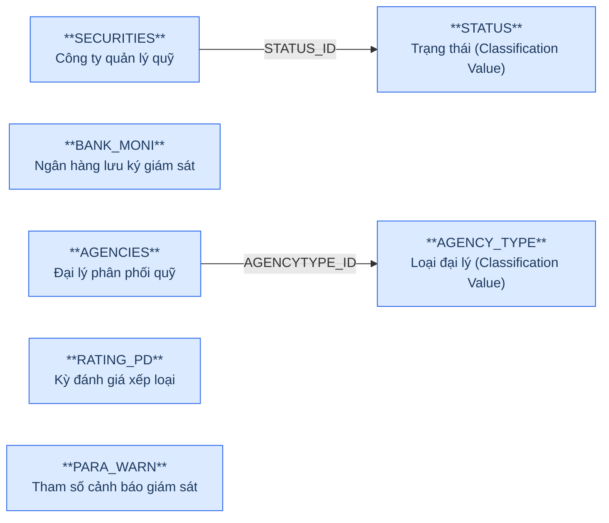
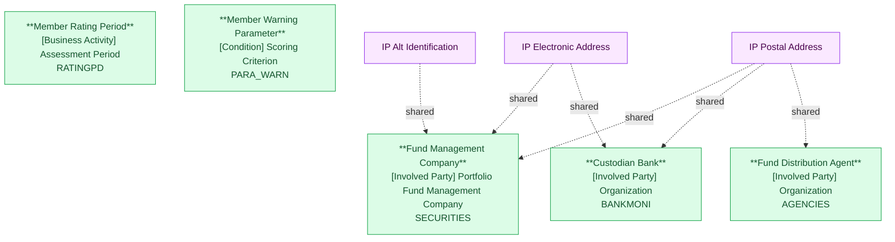

# FMS — HLD Tier 1: Independent Entities (Reference Data)

> **Phụ thuộc:** Không phụ thuộc Tier nào — là nền tảng cho tất cả Tier sau.
>
> **Thiết kế theo:** [FMS_HLD_Overview.md](FMS_HLD_Overview.md)

> **Cập nhật (2026-07-10):** NATIONAL đã loại khỏi scope Atomic — dữ liệu địa giới hành
> chính (quốc gia/quốc tịch) chuyển sang chuẩn hóa tại nguồn **ECAT** (xem
> `ECAT_HLD_Tier1.md`). FMS không tự thiết kế Geographic Area nữa, chỉ tham chiếu qua
> lookup giá trị. Xem mục 7f của `FMS_HLD_Overview.md`.

---

## 6a. Bảng tổng quan BCV Concept

| BCV Core Object | BCV Concept | Category | Source Table | Source Table Change Mode | Mô tả bảng nguồn | Atomic Entity | Table Type | BCV Term |
|---|---|---|---|---|---|---|---|---|
| Involved Party | [Involved Party] Portfolio Fund Management Company | Organization | SECURITIES | Update | Danh sách công ty quản lý quỹ (QLQ) trong nước và nước ngoài tại VN | Fund Management Company | Fundamental | (1) Term candidate: `Portfolio Fund Management Company` — BCV mô tả tổ chức quản lý quỹ đầu tư được UBCK giám sát. (2) Cấu trúc trường: SECURITIES có mã công ty (CODE), tên VN/EN/viết tắt, địa chỉ, phone, fax, email, website, vốn điều lệ (CAPITAL), ngày đăng ký, trạng thái hoạt động (STATUS_ID), mã định danh doanh nghiệp (ID_NO) → entity tổ chức độc lập, lifecycle riêng, có địa chỉ + liên lạc → tách IP Postal Address + IP Electronic Address + IP Alt Identification. (3) Chọn `Portfolio Fund Management Company`. |
| Involved Party | [Involved Party] Organization | Organization | BANK_MONI | Update | Danh sách ngân hàng lưu ký giám sát (LKGS) | Custodian Bank | Fundamental | (1) Term candidate: `Custodian Bank` — BCV mô tả ngân hàng lưu giữ tài sản quỹ và giám sát hoạt động quỹ. (2) Cấu trúc trường: BANK_MONI có tên, địa chỉ, phone, email → entity tổ chức độc lập, FK từ FUNDS (BANK_ID) và FNDSBMN → lifecycle riêng, tách IP Postal Address + IP Electronic Address. (3) Chọn `Custodian Bank`. |
| Involved Party | [Involved Party] Organization | Organization | AGENCIES | Update | Danh sách đại lý quỹ đầu tư | Fund Distribution Agent | Fundamental | (1) Term candidate: `Fund Distribution Agent` — BCV mô tả tổ chức phân phối chứng chỉ quỹ cho nhà đầu tư. (2) Cấu trúc trường: AGENCIES có tên, loại đại lý (AGENCY_TYPE FK), địa chỉ → entity tổ chức độc lập, có AGENCIES_BRA bảng con, FK từ AGEN_FUNDS. (3) Chọn `Fund Distribution Agent`. |
| Business Activity | [Business Activity] Assessment Period | Period | RATING_PD | Update | Danh sách kỳ đánh giá xếp loại công ty QLQ | Member Rating Period | Fundamental | (1) Term candidate: `Assessment Period` — BCV mô tả một chu kỳ đánh giá có ngày bắt đầu/kết thúc, tên kỳ, trạng thái. (2) Cấu trúc trường: RATING_PD có tên kỳ, thời gian kỳ đánh giá, trạng thái → master entity kỳ đánh giá, được FK từ RANK. (3) BCO điều chỉnh theo review: `Business Activity` (kỳ đánh giá là 1 hoạt động nghiệp vụ định kỳ do UBCK tổ chức, không phải Event phát sinh tự nhiên). Term `Assessment Period` giữ nguyên — cần tra lại term BCV chính xác hơn ở lần review sau. |
| Condition | [Condition] Scoring Criterion | Scoring Criterion | PARA_WARN | Update | Danh sách tham số cảnh báo giám sát công ty QLQ (định nghĩa chỉ tiêu theo dõi kèm công thức tính cho từng loại đối tượng) | Member Warning Parameter | Fundamental | (1) Term candidate: `Scoring Criterion` (BCV Condition) — tiêu chí/công thức chấm điểm dùng đánh giá đối tượng theo ngưỡng, không phải instance nghiệp vụ phát sinh theo thời gian. (2) Cấu trúc trường: PARA_WARN có ITEM_NAME, LEGAL_CODE (căn cứ pháp lý), FORMULA_INFO (NCLOB — công thức tính), SYSTEM_OBJECT (loại đối tượng áp dụng: QLQ/Quỹ đầu tư/NH LKGS/ĐLPP/ĐLCN...), RECORD_STATUS → định nghĩa tham số kỹ thuật kèm công thức. (3) Chọn `[Condition] Scoring Criterion`. Cấu trúc gần như trùng khớp FIMS.PARAWARN (Name/LegalCode/FormulaInfo/SystemObject) nhưng theo quyết định review, giữ **entity riêng cho FMS** (không gộp với FIMS) — đặt tên theo domain "Member" đã dùng xuyên suốt FMS (Member Rating, Member Inspection...). Đổi tên Atomic entity theo review: `Member Warning Parameter`. Domain Prefix: `Member Warning`. Trước đây bị đưa nhầm vào 7f nhóm Isolated (lý do cũ "không có FK đến bảng nghiệp vụ trong scope" — sai, vì VIOLT đã FK đến PARA_WARN từ trước). Là nền tảng cho Member Warning Condition (Tier 2). |

---

## 6b. Diagram Source (Mermaid)

---

## 6c. Diagram Atomic (Mermaid)

---

## 6d. Danh mục & Tham chiếu

| Source Table | Mô tả | Scheme Code dự kiến | Ghi chú |
|---|---|---|---|
| BUSINESS | Danh mục ngành nghề kinh doanh của công ty QLQ | `FMS_BUSINESS_TYPE` | source_table — Values load từ BUSINESS.CODE + ITEM_NAME. |
| JOBTYPE | Danh sách loại chức vụ nhân sự | `FMS_JOB_TYPE` | source_table — Values load từ JOBTYPE.CODE + ITEM_NAME. |
| RELATION | Danh mục loại quan hệ cổ đông | `FMS_RELATION_TYPE` | source_table — Values load từ RELATION.CODE + ITEM_NAME. |
| STATUS | Danh sách trạng thái hoạt động | `FMS_OPERATION_STATUS` | source_table — Dùng chung cho SECURITIES, FUNDS, BANK_MONI, AGENCIES... |
| STOCKHOLDER_TYPE | Danh sách loại hình NĐT/cổ đông | `FMS_STOCKHOLDER_TYPE` | source_table — Values load từ STOCKHOLDER_TYPE.CODE + ITEM_NAME. |
| AGENCY_TYPE | Danh sách loại đại lý quỹ | `FMS_AGENCY_TYPE` | source_table — Values load từ AGENCY_TYPE.CODE + ITEM_NAME. |
| SECURITIES.BORF_FLAG | Loại tổ chức theo địa giới: 1=Trong nước, 0=Nước ngoài | `FMS_ORG_TERRITORY_TYPE` | etl_derived — ETL derived: DOMESTIC / FOREIGN. |
| RANK.RANK_TYPE | Loại xếp hạng: 1=Cuối năm, 2=Giữa năm | `FMS_RATING_PERIOD_TYPE` | etl_derived — ETL derived: YEAR_END / MID_YEAR. |
| PARA_WARN.SYSTEM_OBJECT | Loại đối tượng áp dụng tham số cảnh báo: 1=QLQ, 2=Quỹ đầu tư, 3=NH LKGS, 4=ĐLPP, 5=ĐLCN... | `FMS_WARNING_SYSTEM_OBJECT_TYPE` | etl_derived — mô tả nguồn liệt kê "..." (chưa đầy đủ); chỉ có 5 giá trị đầu được xác nhận, cần profile dữ liệu thực tế để bổ sung. |
| PARA_WARN.RECORD_STATUS | Trạng thái tham số cảnh báo: 1=Đang hoạt động, 0=Ngừng hoạt động | `FMS_WARNING_RECORD_STATUS` | etl_derived — dùng chung cho Member Warning Parameter + Member Warning Condition (CDT_WARN.RECORD_STATUS cùng domain giá trị, xem Tier2). |

---

## 6e. Bảng chờ thiết kế

Không có bảng nào trong Tier 1 chưa đủ thông tin cột.

---

## 6f. Điểm cần xác nhận

| # | Câu hỏi | Ảnh hưởng |
|---|---|---|
| T1-01 | SECURITIES dùng chung 1 bảng cho cả công ty QLQ trong nước (BORF_FLAG=1) và VPĐD/CN nước ngoài (BORF_FLAG=0) — xác nhận grain của entity Fund Management Company có bao gồm cả 2 loại không, hay chỉ bao gồm loại trong nước? | **Chờ xác nhận.** BRD notes ghi FOR_BRCH là entity riêng cho VPĐD/CN QLQ nước ngoài — SECURITIES chỉ cho công ty QLQ trong nước. Cần kiểm tra BORF_FLAG thực tế. |
| T1-02 | RATING_PD — BCO đã chốt `Business Activity` theo review. Term `Assessment Period` vẫn cần tra lại BCV chính xác hơn ở lần review sau. | **Đã chốt BCO, term chờ tra lại.** |
| T1-03 | VIOLT có FK đến SECURITIES, FUNDS, BANK_MONI, FOR_BRCH, AGENCIES (đa hướng) — xác nhận grain: 1 vi phạm = 1 thành viên hay có thể 1 vi phạm liên quan nhiều thành viên? | **Chờ xác nhận** (grain). **[CHUYỂN 2026-07-05]** Entity `Fund Management Conduct Violation` đã chuyển sang Tier 6 — xem FMS_HLD_Tier6.md, câu hỏi grain vẫn còn mở ở đó. |
| T1-04 | NATIONAL — quyết định (2026-07-10): Geographic Area chỉ còn 1 nguồn duy nhất là **ECAT**. NHNCK/FMS/SCMS không tự thiết kế Geographic Area nữa. | **Đã chốt.** NATIONAL loại khỏi scope (xem mục 7f FMS_HLD_Overview.md). Entity FMS đang FK đến NATIONAL (INSIDER, INVES, MB_FUND, REPRESENT, FOR_BRCH, STF_FG_BRCH) chuyển sang resolve bằng lookup giá trị đối chiếu Geographic Area nguồn ECAT thay vì hash_id('FMS.NATIONAL', ...). |
| T1-05 | **[SỬA LỖI 2026-07-02]** Member Rating Criterion đã bị gán nhầm source FMS.RNK_FACTOR. Đọc lại cấu trúc cột thực tế: RNK_FACTOR chỉ có FK RK_ID (→RANK) + FCTR_ID (→FACTOR) + các cột điểm số (SCORE_VALUE, MINUS_SCORE, ITEM_VALUE) — đây là bảng kết quả chấm điểm (fact), KHÔNG có PARENT_ID self-ref. Cấu trúc cây cha/con + WEIGHT + GRADING_METHOD thực tế nằm ở bảng FMS.FACTOR (phát hiện khi thiết kế nhóm Member Rating Criterion Group ở Tier 6). | **Đã sửa.** Member Rating Criterion chuyển sang Tier 6, nguồn đúng là `FMS.FACTOR` (FK đến Member Rating Criterion Group mới). RNK_FACTOR được model lại thành entity mới `Member Rating Ranking Criterion` ở Tier 7. Xem FMS_HLD_Tier6.md, FMS_HLD_Tier7.md. |
| T1-06 | **[CẬP NHẬT 2026-07-05, ĐÃ CHUYỂN TIER]** Đọc đủ cột VIOLT khi thiết kế CDT_WARN: ngoài SECURITIES/FUNDS/BANK_MONI/FOR_BRCH/AGENCIES (đã ghi ở T1-03), VIOLT còn FK đến PR_WID (→Member Warning Parameter, Tier 1), CDT_WID (→Member Warning Condition, Tier 2) và DISTRIBUTOR_ID/TRANSFER_AGENT_ID/PENSION_AGENT_ID/PENSION_PROVIDER_ID/OTHER_AGENT_ID/PENSION_FUND_ID (đều Tier 5). **Đã retier: VIOLT (Fund Management Conduct Violation) chuyển từ Tier 1 → Tier 6** — xem FMS_HLD_Tier6.md. Câu hỏi Table Type (`Fundamental` vs `Fact Append`, so sánh FIMS.VIOLT) và trùng nghiệp vụ với FIMS vẫn còn mở — xem Tier6 6f. | **Đã xử lý phần tier.** Xem Overview 7e#17 (cập nhật) và FMS_HLD_Tier6.md 6f cho các điểm còn lại. |
