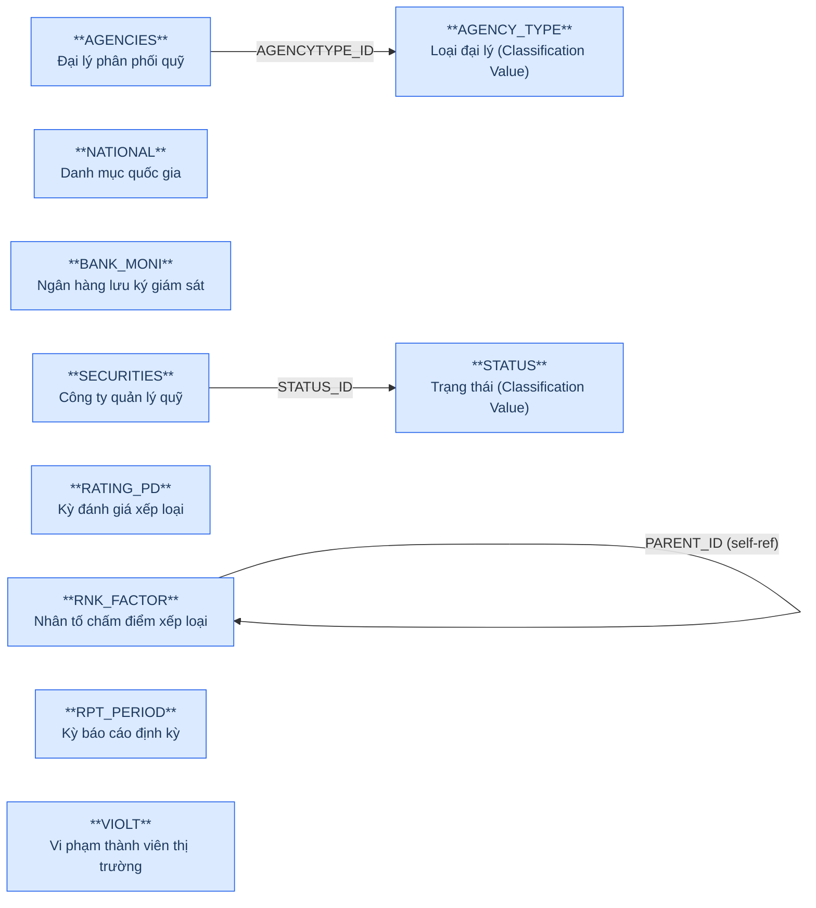
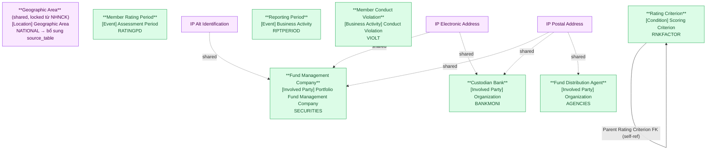

# FMS — HLD Tier 1: Independent Entities (Reference Data)

> **Phụ thuộc:** Không phụ thuộc Tier nào — là nền tảng cho tất cả Tier sau.
>
> **Thiết kế theo:** [FMS_HLD_Overview.md](FMS_HLD_Overview.md)

---

## 6a. Bảng tổng quan BCV Concept

| BCV Core Object | BCV Concept | Category | Source Table | Source Table Change Mode | Mô tả bảng nguồn | Atomic Entity | Table Type | BCV Term |
|---|---|---|---|---|---|---|---|---|
| Involved Party | [Involved Party] Portfolio Fund Management Company | Organization | SECURITIES | Update | Danh sách công ty quản lý quỹ (QLQ) trong nước và nước ngoài tại VN | Fund Management Company | Fundamental | (1) Term candidate: `Portfolio Fund Management Company` — BCV mô tả tổ chức quản lý quỹ đầu tư được UBCK giám sát. (2) Cấu trúc trường: SECURITIES có mã công ty (CODE), tên VN/EN/viết tắt, địa chỉ, phone, fax, email, website, vốn điều lệ (CAPITAL), ngày đăng ký, trạng thái hoạt động (STATUS_ID), mã định danh doanh nghiệp (ID_NO) → entity tổ chức độc lập, lifecycle riêng, có địa chỉ + liên lạc → tách IP Postal Address + IP Electronic Address + IP Alt Identification. (3) Chọn `Portfolio Fund Management Company`. |
| Location | [Location] Geographic Area | Geographic Area | NATIONAL | Update | Danh sách quốc gia/quốc tịch | Geographic Area | Fundamental | (1) Term candidate: `Geographic Area` — BCV ngoại lệ: dù chỉ có Code+Name vẫn là Atomic entity Location, không phải Classification Value. (2) Cấu trúc trường: NATIONAL lưu mã quốc gia và tên quốc gia → phục vụ FK từ các entity nghiệp vụ (SECURITIES, INVES...). Đây là nguồn bổ sung thêm `source_table` vào entity Geographic Area đã có từ NHNCK (locked). (3) Shared entity `Geographic Area` — bổ sung source FMS.NATIONAL, không tạo entity mới. |
| Involved Party | [Involved Party] Organization | Organization | BANK_MONI | Update | Danh sách ngân hàng lưu ký giám sát (LKGS) | Custodian Bank | Fundamental | (1) Term candidate: `Custodian Bank` — BCV mô tả ngân hàng lưu giữ tài sản quỹ và giám sát hoạt động quỹ. (2) Cấu trúc trường: BANK_MONI có tên, địa chỉ, phone, email → entity tổ chức độc lập, FK từ FUNDS (BANK_ID) và FNDSBMN → lifecycle riêng, tách IP Postal Address + IP Electronic Address. (3) Chọn `Custodian Bank`. |
| Involved Party | [Involved Party] Organization | Organization | AGENCIES | Update | Danh sách đại lý quỹ đầu tư | Fund Distribution Agent | Fundamental | (1) Term candidate: `Fund Distribution Agent` — BCV mô tả tổ chức phân phối chứng chỉ quỹ cho nhà đầu tư. (2) Cấu trúc trường: AGENCIES có tên, loại đại lý (AGENCY_TYPE FK), địa chỉ → entity tổ chức độc lập, có AGENCIES_BRA bảng con, FK từ AGEN_FUNDS. (3) Chọn `Fund Distribution Agent`. |
| Event | [Event] Assessment Period | Period | RATING_PD | Update | Danh sách kỳ đánh giá xếp loại công ty QLQ | Member Rating Period | Fundamental | (1) Term candidate: `Assessment Period` — BCV mô tả một chu kỳ đánh giá có ngày bắt đầu/kết thúc, tên kỳ, trạng thái. (2) Cấu trúc trường: RATING_PD có tên kỳ, thời gian kỳ đánh giá, trạng thái → master entity kỳ đánh giá, được FK từ RANK. (3) Chọn `Assessment Period` — xác nhận cần tra thêm. |
| Condition | [Condition] Scoring Criterion | Scoring Criterion | RNK_FACTOR | Update | Bảng nhân tố chấm điểm đánh giá xếp loại (self-ref cha/con) | Rating Criterion | Fundamental | (1) Term candidate: `Scoring Criterion` — BCV mô tả nhân tố/tiêu chí dùng để tính điểm đánh giá. (2) Cấu trúc trường: RNK_FACTOR self-ref ParentId (cấu trúc cây nhân tố cha/con), trọng số điểm → cấu hình tiêu chí chấm điểm, không phải kết quả → Condition. (3) Chọn `Scoring Criterion`. |
| Event | [Event] Business Activity | Period | RPT_PERIOD | Update | Kỳ báo cáo định kỳ của thành viên | Reporting Period | Fundamental | (1) Term candidate: `Business Activity` — BCV mô tả kỳ thời gian được định nghĩa để thu thập báo cáo. (2) Cấu trúc trường: RPT_PERIOD có tên kỳ, ngày bắt đầu/kết thúc, trạng thái → master entity kỳ báo cáo, FK từ RPT_MEMBER. (3) Chọn `Business Activity` — đây là kỳ thời gian nghiệp vụ. |
| Business Activity | [Business Activity] Conduct Violation | Conduct Violation | VIOLT | Update | Danh sách vi phạm của thành viên thị trường | Member Conduct Violation | Fundamental | (1) Term candidate: `Conduct Violation` — BCV mô tả sự kiện vi phạm quy định của thành viên thị trường. (2) Cấu trúc trường: VIOLT lưu thông tin vi phạm của các thành viên (SECURITIES, FUNDS...), loại vi phạm, quyết định xử lý → entity vi phạm của thành viên, có FK đến nhiều entity Tier 1. (3) Chọn `Conduct Violation`. |

---

## 6b. Diagram Source (Mermaid)

---

## 6c. Diagram Atomic (Mermaid)

---

## 6d. Danh mục & Tham chiếu

| Source Table | Mô tả | Scheme Code dự kiến | Ghi chú |
|---|---|---|---|
| BUSINESS | Danh mục ngành nghề kinh doanh của công ty QLQ | `FMS_BUSINESS_TYPE` | source_table — Values load từ BUSINESS.CODE + ITEM_NAME. |
| JOBTYPE | Danh sách loại chức vụ nhân sự | `FMS_JOB_TYPE` | source_table — Values load từ JOBTYPE.CODE + ITEM_NAME. |
| RELATION | Danh mục loại quan hệ cổ đông | `FMS_RELATION_TYPE` | source_table — Values load từ RELATION.CODE + ITEM_NAME. |
| STATUS | Danh sách trạng thái hoạt động | `FMS_OPERATION_STATUS` | source_table — Dùng chung cho SECURITIES, FUNDS, BANK_MONI, AGENCIES... |
| STOCKHOLDER_TYPE | Danh sách loại hình NĐT/cổ đông | `FMS_STOCKHOLDER_TYPE` | source_table — Values load từ STOCKHOLDER_TYPE.CODE + ITEM_NAME. |
| AGENCY_TYPE | Danh sách loại đại lý quỹ | `FMS_AGENCY_TYPE` | source_table — Values load từ AGENCY_TYPE.CODE + ITEM_NAME. |
| SECURITIES.BORF_FLAG | Loại tổ chức theo địa giới: 1=Trong nước, 0=Nước ngoài | `FMS_ORG_TERRITORY_TYPE` | etl_derived — ETL derived: DOMESTIC / FOREIGN. |
| RANK.RANK_TYPE | Loại xếp hạng: 1=Cuối năm, 2=Giữa năm | `FMS_RATING_PERIOD_TYPE` | etl_derived — ETL derived: YEAR_END / MID_YEAR. |

---

## 6e. Bảng chờ thiết kế

| Source Table | Mô tả bảng nguồn | Lý do chưa thiết kế |
|---|---|---|
| VIOLT | Danh sách vi phạm thành viên | BCV Concept cần xác nhận thêm — VIOLT có FK đến SECURITIES, FUNDS, BANK_MONI, FOR_BRCH → cần đọc cấu trúc cột đầy đủ trước khi xác định tier chính xác. Tạm đưa vào Tier 1 chờ xác nhận. |

---

## 6f. Điểm cần xác nhận

| # | Câu hỏi | Ảnh hưởng |
|---|---|---|
| T1-01 | SECURITIES dùng chung 1 bảng cho cả công ty QLQ trong nước (BORF_FLAG=1) và VPĐD/CN nước ngoài (BORF_FLAG=0) — xác nhận grain của entity Fund Management Company có bao gồm cả 2 loại không, hay chỉ bao gồm loại trong nước? | **Chờ xác nhận.** BRD notes ghi FOR_BRCH là entity riêng cho VPĐD/CN QLQ nước ngoài — SECURITIES chỉ cho công ty QLQ trong nước. Cần kiểm tra BORF_FLAG thực tế. |
| T1-02 | RATING_PD — BCV Concept `Assessment Period` cần tra lại nếu BCV dự án dùng term khác. | **Chờ xác nhận.** Tạm dùng `Assessment Period` — sẽ cập nhật nếu BCV Term chính xác hơn. |
| T1-03 | VIOLT có FK đến SECURITIES, FUNDS, BANK_MONI, FOR_BRCH, AGENCIES (đa hướng) — xác nhận grain: 1 vi phạm = 1 thành viên hay có thể 1 vi phạm liên quan nhiều thành viên? | **Chờ xác nhận.** Tạm giữ ở Tier 1. Nếu VIOLT FK đến entity Tier 2 → phải chuyển lên Tier 2 hoặc 3. |
| T1-04 | NATIONAL — xác nhận shared entity `Geographic Area` đã approved từ NHNCK. Chỉ bổ sung `source_table: FMS.NATIONAL`, không tạo entity mới. | **Xác nhận: đúng.** Geographic Area đã locked từ NHNCK. |
| T1-05 | RPT_PERIOD — BCV Concept cần xác nhận xem là `Business Activity` (period) hay có term cụ thể hơn như `Reporting Period`. | **Chờ xác nhận.** Tạm dùng `Business Activity`. |
