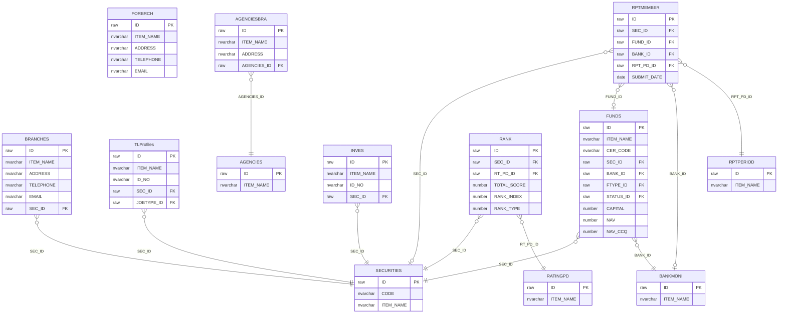

# FMS HLD — Tier 2

**Source system:** FMS (Hệ thống quản lý giám sát công ty chứng khoán và quỹ đầu tư chứng khoán)
**Tier 2:** FK đến Tier 1 — các entity phụ thuộc trực tiếp vào Fund Management Company (SECURITIES), Custodian Bank (BANKMONI), Fund Distribution Agent (AGENCIES), hoặc Member Rating Period (RATINGPD). Bao gồm: CN/VPĐD trong nước, VPĐD QLQ nước ngoài, Nhân sự QLQ, Quỹ đầu tư, Nhà đầu tư ủy thác, Chi nhánh đại lý, Kết quả xếp hạng, Báo cáo định kỳ thành viên.

---

## 6a. Bảng tổng quan BCV Concept

| BCV Core Object | BCV Concept | Category | Source Table | Source Table Change Mode | Mô tả bảng nguồn | Atomic Entity | table_type | BCV Term |
|---|---|---|---|---|---|---|---|---|
| Involved Party | [Involved Party] Organization | Organization | BRANCHES | Update | Danh sách CN/VPĐD của công ty QLQ trong nước | Fund Management Company Organization Unit | Fundamental | (1) Term candidate: `Organization` — BCV mô tả đơn vị thuộc tổ chức, FK đến entity cha là Fund Management Company. (2) Cấu trúc trường: BRANCHES có tên, địa chỉ, phone, email, FK đến SECURITIES (SEC_ID) → entity con của Fund Management Company. Grain = 1 CN/VPĐD. (3) Chọn `Organization` — đơn vị địa lý trực thuộc CTQLQ trong nước. |
| Involved Party | [Involved Party] Organization | Organization | FORBRCH | Update | Danh sách VPĐD/CN công ty QLQ nước ngoài tại VN | Foreign Fund Management Organization Unit | Fundamental | (1) Term candidate: `Organization` — BCV mô tả đơn vị tổ chức nước ngoài có pháp nhân tại VN. (2) Cấu trúc trường: FORBRCH có tên, địa chỉ, phone, FK tự quản, không FK đến SECURITIES → entity độc lập tuy nhiên có STFFGBRCH (nhân sự) và FGBUSINESS (ngành nghề) phụ thuộc. (3) Chọn `Organization` — tổ chức QLQ nước ngoài có hiện diện tại VN. Lưu ý: FORBRCH không có FK đến SECURITIES → ở Tier 1 xét về độc lập; tuy nhiên vì nhóm nghiệp vụ thành viên QLQ → đặt Tier 2 cùng BRANCHES để gộp phân tích. |
| Involved Party | [Involved Party] Individual Employment Status | Employment Status | TLProfiles | Update | Danh sách nhân sự chủ chốt công ty QLQ | Fund Management Company Key Person | Fundamental | (1) Term candidate: `Individual Employment Status` — BCV mô tả cá nhân đang giữ vị trí trong tổ chức. (2) Cấu trúc trường: TLProfiles có họ tên, ngày sinh, giới tính, CCCD, chức vụ (JOB_TYPE FK), ngày bổ nhiệm, ngày thôi → entity nhân sự với lifecycle bổ nhiệm/thôi chức. IP Alt Identification từ CCCD/Hộ chiếu. (3) Chọn `Individual Employment Status`. |
| Arrangement | [Arrangement] Investment Fund | Investment Fund | FUNDS | Update | Danh sách quỹ đầu tư chứng khoán | Investment Fund | Fundamental | (1) Term candidate: `Investment Fund` — BCV mô tả quỹ đầu tư được thành lập và quản lý bởi công ty QLQ. (2) Cấu trúc trường: FUNDS có tên quỹ, mã CCQ (CER_CODE), loại quỹ (FTYPE_ID), vốn điều lệ, NAV, NAV/CCQ, ngày niêm yết, FK đến SECURITIES (công ty QLQ) + BANKMONI (NH LKGS) → arrangement giữa CTQLQ và NĐT. (3) Chọn `Investment Fund`. |
| Involved Party | [Involved Party] Individual | Individual | INVES | Update | Danh sách nhà đầu tư ủy thác | Discretionary Investment Investor | Fundamental | (1) Term candidate: `Individual` — BCV mô tả cá nhân/tổ chức là nhà đầu tư ủy thác. (2) Cấu trúc trường: INVES có họ tên, CCCD, địa chỉ, FK đến SECURITIES (công ty QLQ nhận ủy thác) → entity NĐT ủy thác với thông tin cá nhân đầy đủ; tách IP Alt Identification. (3) Chọn `Individual`. |
| Involved Party | [Involved Party] Organization | Organization | AGENCIESBRA | Update | Danh sách CN/PGD của đại lý quỹ đầu tư | Fund Distribution Agent Organization Unit | Fundamental | (1) Term candidate: `Organization` — đơn vị trực thuộc Fund Distribution Agent. (2) Cấu trúc trường: AGENCIESBRA có tên, địa chỉ, FK đến AGENCIES (đại lý cha) → entity con của Fund Distribution Agent. Có trường địa chỉ → tách IP Postal Address. (3) Chọn `Organization`. |
| Business Activity | [Business Activity] Conduct Violation | Conduct Violation | RANK | Append | Bảng xếp hạng theo kỳ đánh giá (1 dòng = 1 kết quả xếp hạng/kỳ) | Member Rating | Fact Append | (1) Term candidate: `Conduct Violation` không phù hợp. Tra lại: kết quả xếp hạng = outcome của một đợt đánh giá — gần `Assessment Result` hơn. (2) Cấu trúc trường: RANK có SEC_ID (FK SECURITIES), RT_PD_ID (FK kỳ đánh giá), TOTAL_SCORE, RANK_INDEX, RANK_TYPE → mỗi dòng = 1 kết quả xếp hạng của 1 CTQLQ trong 1 kỳ, append theo kỳ. (3) Chọn `Business Activity` → Table Type `Fact Append`. |
| Documentation | [Documentation] Gov. Registration Document | Government Registration Document | RPTMEMBER | Append | Báo cáo định kỳ của thành viên thị trường nộp lên UBCK | Member Periodic Report | Fact Append | (1) Term candidate: `Gov. Registration Document` — báo cáo thành viên nộp theo quy định là tài liệu pháp lý bắt buộc. (2) Cấu trúc trường: RPTMEMBER có FK đến SECURITIES/FUNDS/BANKMONI/FORBRCH (thành viên nộp), FK RPTPERIOD (kỳ báo cáo), trạng thái, ngày nộp → mỗi lần nộp là 1 event insert-only. (3) Chọn `Gov. Registration Document` → Fact Append. |

---

## 6b. Diagram Source (Mermaid)

---

## 6c. Diagram Atomic (Mermaid)

```mermaid
erDiagram
    Fund_Management_Company {
        bigint ds_fund_management_company_id PK
        string fund_management_company_code
    }

    Custodian_Bank {
        bigint ds_custodian_bank_id PK
        string custodian_bank_code
    }

    Fund_Distribution_Agent {
        bigint ds_fund_distribution_agent_id PK
        string fund_distribution_agent_code
    }

    Member_Rating_Period {
        bigint ds_member_rating_period_id PK
        string member_rating_period_code
    }

    Reporting_Period {
        bigint ds_reporting_period_id PK
        string reporting_period_code
    }

    Fund_Management_Company_Organization_Unit {
        bigint ds_fund_management_company_organization_unit_id PK
        string organization_unit_code
        bigint fund_management_company_id FK
        string fund_management_company_code
    }

    Foreign_Fund_Management_Organization_Unit {
        bigint ds_foreign_fund_management_organization_unit_id PK
        string organization_unit_code
        string organization_unit_name
    }

    Fund_Management_Company_Key_Person {
        bigint ds_fund_management_company_key_person_id PK
        string key_person_code
        bigint fund_management_company_id FK
        string fund_management_company_code
        string job_type_code
    }

    Investment_Fund {
        bigint ds_investment_fund_id PK
        string investment_fund_code
        string investment_fund_certificate_code
        bigint fund_management_company_id FK
        string fund_management_company_code
        bigint custodian_bank_id FK
        string custodian_bank_code
        string fund_type_code
        string operation_status_code
        number net_asset_value
        number net_asset_value_per_certificate
    }

    Discretionary_Investment_Investor {
        bigint ds_discretionary_investment_investor_id PK
        string investor_code
        bigint fund_management_company_id FK
        string fund_management_company_code
    }

    Fund_Distribution_Agent_Organization_Unit {
        bigint ds_fund_distribution_agent_organization_unit_id PK
        string organization_unit_code
        bigint fund_distribution_agent_id FK
        string fund_distribution_agent_code
    }

    Member_Rating {
        bigint ds_member_rating_id PK
        bigint fund_management_company_id FK
        string fund_management_company_code
        bigint member_rating_period_id FK
        string member_rating_period_code
        number total_score
        number rank_index
        string rating_period_type_code
    }

    Member_Periodic_Report {
        bigint ds_member_periodic_report_id PK
        bigint fund_management_company_id FK
        bigint investment_fund_id FK
        bigint custodian_bank_id FK
        bigint reporting_period_id FK
        string reporting_period_code
        date submission_date
    }

    Fund_Management_Company_Organization_Unit }o--|| Fund_Management_Company : "fund_management_company_id"
    Fund_Management_Company_Key_Person }o--|| Fund_Management_Company : "fund_management_company_id"
    Investment_Fund }o--|| Fund_Management_Company : "fund_management_company_id"
    Investment_Fund }o--|| Custodian_Bank : "custodian_bank_id"
    Discretionary_Investment_Investor }o--|| Fund_Management_Company : "fund_management_company_id"
    Fund_Distribution_Agent_Organization_Unit }o--|| Fund_Distribution_Agent : "fund_distribution_agent_id"
    Member_Rating }o--|| Fund_Management_Company : "fund_management_company_id"
    Member_Rating }o--|| Member_Rating_Period : "member_rating_period_id"
    Member_Periodic_Report }o--o| Fund_Management_Company : "fund_management_company_id"
    Member_Periodic_Report }o--o| Investment_Fund : "investment_fund_id"
    Member_Periodic_Report }o--o| Custodian_Bank : "custodian_bank_id"
    Member_Periodic_Report }o--|| Reporting_Period : "reporting_period_id"
```

---

## 6d. Mục Danh mục & Tham chiếu (Reference Data)

| Source Field / Bảng | Mô tả | Scheme Code | source_type | Ghi chú |
|---|---|---|---|---|
| FUNDS.FTYPE_ID → FUND_TYPE | Loại quỹ đầu tư | `FMS_FUND_TYPE` | source_table | Values load từ FUND_TYPE.CODE + ITEM_NAME; bảng FUND_TYPE status=pending |
| RANK.RANK_TYPE | Loại xếp hạng: 1=Cuối năm, 2=Giữa năm | `FMS_RATING_PERIOD_TYPE` | etl_derived | Đã đăng ký Tier 1; tham chiếu lại |
| RPTMEMBER.STATUS_ID | Trạng thái báo cáo thành viên | `FMS_REPORT_STATUS` | source_table | FK đến STATUS; dùng chung scheme FMS_OPERATION_STATUS hoặc tạo riêng FMS_REPORT_STATUS |

---

## 6e. Bảng chờ thiết kế

| Source Table | Mô tả bảng nguồn | Lý do chưa thiết kế |
|---|---|---|
| FORBRCH | Danh sách VPĐD/CN công ty QLQ NN tại VN | Tạm đặt Tier 2 — thực tế không FK đến SECURITIES. Cần xác nhận: FORBRCH có FK nghiệp vụ nào đến entity Tier 1 không? Nếu không → chuyển về Tier 1. |

---

## 6f. Điểm cần xác nhận

| # | Câu hỏi | Kết quả |
|---|---|---|
| T2-01 | FORBRCH — thực tế không có FK đến SECURITIES trong BRD per-table. FORBRCH là entity độc lập (VPĐD/CN QLQ nước ngoài tại VN, không có quan hệ pháp lý FK với SECURITIES trong nước). Xác nhận có nên chuyển lên Tier 1 không? | **Chờ xác nhận.** Nếu FORBRCH hoàn toàn không FK đến SECURITIES → chuyển Tier 1. Thiết kế hiện tại giữ Tier 2 để gộp phân tích nhóm thành viên QLQ. |
| T2-02 | RPTMEMBER FK đến SECURITIES (CTQLQ), FUNDS (quỹ), BANKMONI (NH LKGS), FORBRCH (VPĐD NN) — xác nhận chỉ 1 trong 4 FK này not-null tại 1 thời điểm hay có thể nhiều not-null? | **Chờ xác nhận.** Thiết kế hiện tại cho phép nullable FK để linh hoạt — cần xác nhận nghiệp vụ. |
| T2-03 | MEMBER_PERIODIC_REPORT — BCV Concept `Gov. Registration Document` (báo cáo pháp lý) vs `Business Activity` (hoạt động gửi báo cáo). Cần xác nhận concept phù hợp hơn. | **Chờ xác nhận.** Tạm dùng `Gov. Registration Document` — báo cáo định kỳ theo quy định pháp luật là tài liệu pháp lý. |
| T2-04 | MEMBER_RATING — BCV Concept tạm dùng `Business Activity`. Cần tra lại BCV term chính xác cho kết quả xếp hạng tổ chức giám sát. | **Chờ xác nhận.** Xem xét `Assessment Result` hay `Business Activity`. |
| T2-05 | FGBUSINESS (ngành nghề FORBRCH) và SECBUSINES (ngành nghề SECURITIES) — đều là junction denormalize vào entity cha. Xác nhận: chỉ lưu mảng BUSINESS_TYPE_CODE hay cần thêm ngày hiệu lực? | **Chờ xác nhận.** Nếu chỉ Code → denormalize thành `ARRAY<string>` trên entity cha. Nếu có ngày hiệu lực → cần entity Relative riêng. |
