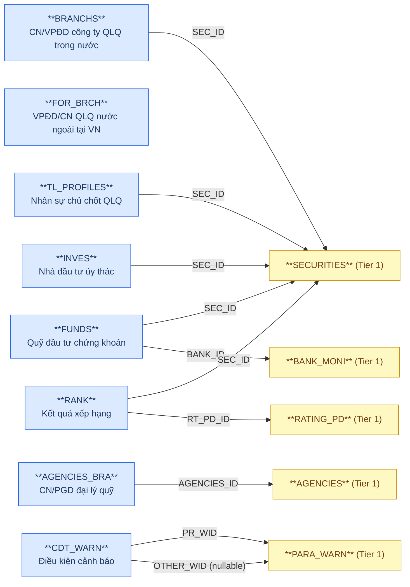
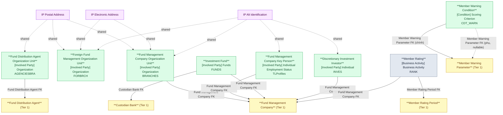

# FMS — HLD Tier 2: Phụ thuộc Tier 1

> **Phụ thuộc Tier 1:** Fund Management Company, Custodian Bank, Fund Distribution Agent, Member Rating Period, Member Warning Parameter
>
> **Thiết kế theo:** [FMS_HLD_Overview.md](FMS_HLD_Overview.md)

---

## 6a. Bảng tổng quan BCV Concept

| BCV Core Object | BCV Concept | Category | Source Table | Source Table Change Mode | Mô tả bảng nguồn | Atomic Entity | Table Type | BCV Term |
|---|---|---|---|---|---|---|---|---|
| Involved Party | [Involved Party] Organization | Organization | BRANCHS | Update | Danh sách CN/VPĐD của công ty QLQ trong nước | Fund Management Company Organization Unit | Fundamental | (1) Term candidate: `Organization` — BCV mô tả đơn vị thuộc tổ chức, FK đến entity cha là Fund Management Company. (2) Cấu trúc trường: BRANCHS có tên, địa chỉ, phone, email, FK đến SECURITIES (SEC_ID) → entity con của Fund Management Company. Grain = 1 CN/VPĐD. (3) Chọn `Organization` — đơn vị địa lý trực thuộc CTQLQ trong nước. |
| Involved Party | [Involved Party] Organization | Organization | FOR_BRCH | Update | Danh sách VPĐD/CN công ty QLQ nước ngoài tại VN | Foreign Fund Management Organization Unit | Fundamental | (1) Term candidate: `Organization` — BCV mô tả đơn vị tổ chức nước ngoài có pháp nhân tại VN. (2) Cấu trúc trường: FOR_BRCH có tên, địa chỉ, phone, FK tự quản, không FK đến SECURITIES → entity độc lập tuy nhiên có STF_FG_BRCH (nhân sự) và FG_BUSINESS (ngành nghề) phụ thuộc. (3) Chọn `Organization` — tổ chức QLQ nước ngoài có hiện diện tại VN. Lưu ý: FOR_BRCH không có FK đến SECURITIES → ở Tier 1 xét về độc lập; tuy nhiên vì nhóm nghiệp vụ thành viên QLQ → đặt Tier 2 cùng BRANCHS để gộp phân tích. |
| Involved Party | [Involved Party] Individual Employment Status | Employment Status | TL_PROFILES | Update | Danh sách nhân sự chủ chốt công ty QLQ | Fund Management Company Key Person | Fundamental | (1) Term candidate: `Individual Employment Status` — BCV mô tả cá nhân đang giữ vị trí trong tổ chức. (2) Cấu trúc trường: TL_PROFILES có họ tên, ngày sinh, giới tính, CCCD, chức vụ (JOB_TYPE FK), ngày bổ nhiệm, ngày thôi → entity nhân sự với lifecycle bổ nhiệm/thôi chức. IP Alt Identification từ CCCD/Hộ chiếu. (3) Chọn `Individual Employment Status`. |
| Involved Party | [Involved Party] Funds | Investment Fund | FUNDS | Update | Danh sách quỹ đầu tư chứng khoán | Investment Fund | Fundamental | (1) Term candidate ban đầu: `Investment Fund` (Arrangement). (2) Cấu trúc trường: FUNDS có tên quỹ, mã CCQ (CER_CODE), loại quỹ (FTYPE_ID), vốn điều lệ, NAV, NAV/CCQ, ngày niêm yết, FK đến SECURITIES (công ty QLQ) + BANK_MONI (NH LKGS). (3) BCO điều chỉnh theo review: `Involved Party` — tra BCV term `Funds` (Involved Party, id 10821): "Identifies an Involved Party that represents any managed pool of investment assets. Fund representatives play a role as institutional investors or investing entities...". Quỹ đầu tư đóng vai trò một Involved Party (định chế đầu tư), không phải Arrangement. Chọn `[Involved Party] Funds`. |
| Involved Party | [Involved Party] Individual | Individual | INVES | Update | Danh sách nhà đầu tư ủy thác | Discretionary Investment Investor | Fundamental | (1) Term candidate: `Individual` — BCV mô tả cá nhân/tổ chức là nhà đầu tư ủy thác. (2) Cấu trúc trường: INVES có họ tên, CCCD, địa chỉ, FK đến SECURITIES (công ty QLQ nhận ủy thác) → entity NĐT ủy thác với thông tin cá nhân đầy đủ; tách IP Alt Identification. (3) Chọn `Individual`. |
| Involved Party | [Involved Party] Organization | Organization | AGENCIES_BRA | Update | Danh sách CN/PGD của đại lý quỹ đầu tư | Fund Distribution Agent Organization Unit | Fundamental | (1) Term candidate: `Organization` — đơn vị trực thuộc Fund Distribution Agent. (2) Cấu trúc trường: AGENCIES_BRA có tên, địa chỉ, FK đến AGENCIES (đại lý cha) → entity con của Fund Distribution Agent. Có trường địa chỉ → tách IP Postal Address. (3) Chọn `Organization`. |
| Business Activity | [Business Activity] Business Activity | Business Activity | RANK | Append | Bảng xếp hạng theo kỳ đánh giá (1 dòng = 1 kết quả xếp hạng/kỳ) | Member Rating | Fact Append | (1) Term candidate: `Conduct Violation` không phù hợp. Tra lại: kết quả xếp hạng = outcome của một đợt đánh giá — gần `Assessment Result` hơn. (2) Cấu trúc trường: RANK có SEC_ID (FK SECURITIES), RT_PD_ID (FK kỳ đánh giá), TOTAL_SCORE, RANK_INDEX, RANK_TYPE → mỗi dòng = 1 kết quả xếp hạng của 1 CTQLQ trong 1 kỳ, append theo kỳ. (3) Chọn `Business Activity` → Table Type `Fact Append`. |
| Condition | [Condition] Scoring Criterion | Scoring Criterion | CDT_WARN | Update | Danh sách điều kiện cảnh báo cụ thể (ngưỡng min/max, so sánh kép giữa 2 tham số cảnh báo) | Member Warning Condition | Fundamental | (1) Term candidate: `Scoring Criterion` (BCV Condition) — cùng nhóm với Member Warning Parameter (Tier 1), mô tả ngưỡng/tiêu chí đánh giá cụ thể áp dụng cho 1 tham số. (2) Cấu trúc trường: CDT_WARN có PR_WID (FK→PARA_WARN, tham số chính), OTHER_WID (FK→PARA_WARN, tham số so sánh phụ, tùy chọn), COMPARE_TYPE, FROM_VALUE/FROM_VALUE_CONDITION, TO_VALUE/TO_VALUE_CONDITION, WARNING_TYPE, PR_WPERIOD_TYPE/VALUE, OTHER_WPERIOD_TYPE/VALUE, NUMBER_DAY_RUN, RECORD_STATUS → là điều kiện cụ thể hóa 1-2 Member Warning Parameter thành ngưỡng cảnh báo. (3) Chọn `[Condition] Scoring Criterion`. Cấu trúc trùng khớp FIMS.CDTWARN (PrWId/OtherWId FK→PARAWARN, FromValue/ToValue, PrWPeriodType...) nhưng theo quyết định review, giữ **entity riêng cho FMS** (không gộp với FIMS) — đặt tên theo domain "Member" đã dùng xuyên suốt FMS. Đổi tên Atomic entity theo review: `Member Warning Condition`. Domain Prefix: `Member Warning`. FK đến Member Warning Parameter (Tier 1) — 2 lần (PR_WID chính, OTHER_WID phụ tùy chọn). Trước đây bị đưa nhầm vào 7f nhóm Operational/System. **[SỬA 2026-07-05]** Source Table Change Mode đính chính lại thành `Update` (đọc nhầm BRD trước đó thành `Append`) — khớp với Table Type `Fundamental`. |

---

## 6b. Diagram Source (Mermaid)

---

## 6c. Diagram Atomic (Mermaid)

---

## 6d. Danh mục & Tham chiếu

| Source Table | Mô tả | Scheme Code dự kiến | Ghi chú |
|---|---|---|---|
| FUNDS.FTYPE_ID → FUND_TYPE | Loại quỹ đầu tư | `FMS_FUND_TYPE` | source_table — Values load từ FUND_TYPE.CODE + ITEM_NAME; bảng FUND_TYPE status=pending. |
| RANK.RANK_TYPE | Loại xếp hạng: 1=Cuối năm, 2=Giữa năm | `FMS_RATING_PERIOD_TYPE` | etl_derived — Đã đăng ký Tier 1; tham chiếu lại. |
| CDT_WARN.COMPARE_TYPE | Kiểu so sánh điều kiện cảnh báo: 1=Lớn hơn, 2=Nhỏ hơn, 3=Bằng | `FMS_WARNING_COMPARE_TYPE` | etl_derived — Values load từ mô tả cột (chưa profile dữ liệu thực tế để xác nhận đủ 3 giá trị). |
| CDT_WARN.FROM_VALUE_CONDITION | Toán tử so sánh ngưỡng dưới: 1=>=, 2=> | `FMS_WARNING_FROM_VALUE_OPERATOR` | etl_derived — Values load từ mô tả cột BRD. |
| CDT_WARN.TO_VALUE_CONDITION | Toán tử so sánh ngưỡng trên: 1=<=, 2=< | `FMS_WARNING_TO_VALUE_OPERATOR` | etl_derived — Values load từ mô tả cột BRD. |
| CDT_WARN.OTHER_WID_CONDITION | Điều kiện kết hợp với tham số cảnh báo thứ hai (nghi ngờ AND/OR, cùng pattern FIMS.CDTWARN.OtherWIdCondition) | `FMS_WARNING_COMBINATION_TYPE` | modeler_defined — mô tả BRD không có giá trị cụ thể, cần xác nhận ở LLD. Xem 6f T2-07 (đã cập nhật, chỉ còn nội dung này). |
| CDT_WARN.WARNING_TYPE | Loại cảnh báo: 0=Cảnh báo so sánh số liệu, 1=Cảnh báo nội dung bất thường | `FMS_WARNING_TYPE` | etl_derived — Values load từ mô tả cột BRD. |
| CDT_WARN.PR_WPERIOD_TYPE / OTHER_WPERIOD_TYPE | Loại kỳ tương đối của tham số cảnh báo: 1=Kỳ hiện tại, 2=Kỳ liền trước... | `FMS_WARNING_PERIOD_TYPE` | etl_derived — Dùng chung cho 2 cột; mô tả nguồn liệt kê "..." (chưa đầy đủ), cần profile dữ liệu thực tế. |
| CDT_WARN.RECORD_STATUS | Trạng thái điều kiện cảnh báo: 1=Đang hoạt động, 0=Ngừng hoạt động | `FMS_WARNING_RECORD_STATUS` | etl_derived — Dùng chung với Member Warning Parameter (đã đăng ký Tier 1). |

---

## 6e. Bảng chờ thiết kế

| Source Table | Mô tả bảng nguồn | Lý do chưa thiết kế |
|---|---|---|
| FOR_BRCH | Danh sách VPĐD/CN công ty QLQ NN tại VN | Tạm đặt Tier 2 — thực tế không FK đến SECURITIES. Cần xác nhận: FOR_BRCH có FK nghiệp vụ nào đến entity Tier 1 không? Nếu không → chuyển về Tier 1. |

---

## 6f. Điểm cần xác nhận

| # | Câu hỏi | Ảnh hưởng |
|---|---|---|
| T2-01 | FOR_BRCH — thực tế không có FK đến SECURITIES trong BRD per-table. FOR_BRCH là entity độc lập (VPĐD/CN QLQ nước ngoài tại VN, không có quan hệ pháp lý FK với SECURITIES trong nước). Xác nhận có nên chuyển lên Tier 1 không? | **Chờ xác nhận.** Nếu FOR_BRCH hoàn toàn không FK đến SECURITIES → chuyển Tier 1. Thiết kế hiện tại giữ Tier 2 để gộp phân tích nhóm thành viên QLQ. |
| T2-04 | MEMBER_RATING — BCV Concept tạm dùng `Business Activity`. Cần tra lại BCV term chính xác cho kết quả xếp hạng tổ chức giám sát. | **Chờ xác nhận.** Xem xét `Assessment Result` hay `Business Activity`. |
| T2-05 | FG_BUSINESS (ngành nghề FOR_BRCH) và SEC_BUSINESS (ngành nghề SECURITIES) — đều là junction denormalize vào entity cha. Xác nhận: chỉ lưu mảng BUSINESS_TYPE_CODE hay cần thêm ngày hiệu lực? | **Chờ xác nhận.** Nếu chỉ Code → denormalize thành `ARRAY<string>` trên entity cha. Nếu có ngày hiệu lực → cần entity Relative riêng. |
| T2-06 | FUNDS — BCO đã chốt `Involved Party` (term `Funds`, id 10821) theo review, thay cho `Arrangement`. | **Đã chốt.** |
| T2-07 | **[MỚI 2026-07-05, CẬP NHẬT]** ~~CDT_WARN khai báo Change Mode Append khác Table Type Fundamental~~ — **đã đính chính**: Source Table Change Mode thực tế của CDT_WARN là `Update` (đọc nhầm BRD ở lần thiết kế trước), khớp bình thường với Table Type `Fundamental`, không còn là điểm cần xác nhận. Vấn đề còn lại: OTHER_WID_CONDITION chưa có giá trị cụ thể trong mô tả BRD (nghi ngờ AND/OR, cùng pattern FIMS.CDTWARN.OtherWIdCondition) — cần xác nhận ở LLD. | **Chờ xác nhận (thu hẹp).** Chỉ còn ảnh hưởng giá trị scheme `FMS_WARNING_COMBINATION_TYPE` cho Member Warning Condition. |
