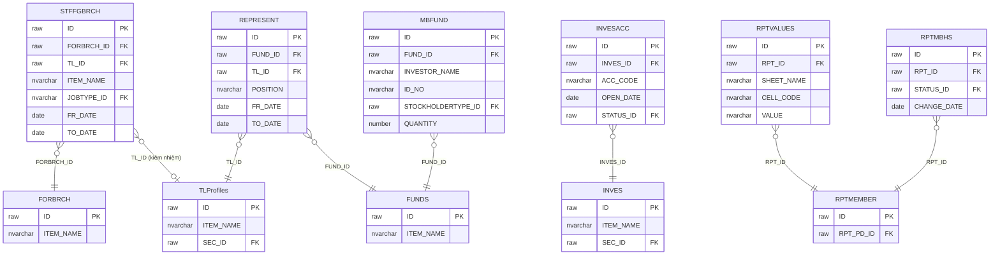

# FMS HLD — Tier 3

**Source system:** FMS (Hệ thống quản lý giám sát công ty chứng khoán và quỹ đầu tư chứng khoán)
**Tier 3:** FK đến Tier 2 — các entity phụ thuộc vào Investment Fund, Fund Management Company Key Person, Discretionary Investment Investor, Member Periodic Report. Bao gồm: Nhân sự VPĐD QLQ NN, Ban đại diện quỹ, Nhà đầu tư quỹ, Tài khoản NĐT ủy thác, Dữ liệu import báo cáo, Lịch sử trạng thái báo cáo.

---

## 6a. Bảng tổng quan BCV Concept

| BCV Core Object | BCV Concept | Category | Source Table | Source Table Change Mode | Mô tả bảng nguồn | Atomic Entity | table_type | BCV Term |
|---|---|---|---|---|---|---|---|---|
| Involved Party | [Involved Party] Individual Employment Status | Employment Status | STFFGBRCH | Update | Danh sách nhân sự của VPĐD/CN công ty QLQ nước ngoài tại VN | Foreign Fund Management Organization Unit Staff | Fundamental | (1) Term candidate: `Individual Employment Status` — cá nhân giữ vị trí trong tổ chức. (2) Cấu trúc trường: STFFGBRCH có FK đến FORBRCH (tổ chức) + FK đến TLProfiles (nhân sự kiêm nhiệm), họ tên, chức vụ, ngày bổ nhiệm → entity vai trò nhân sự trong tổ chức VPĐD NN. (3) Chọn `Individual Employment Status`. |
| Involved Party | [Involved Party] Individual Employment Status | Employment Status | REPRESENT | Update | Danh sách ban đại diện/HĐQT quỹ đầu tư | Investment Fund Representative Board Member | Fundamental | (1) Term candidate: `Individual Employment Status` — thành viên ban đại diện là cá nhân đang giữ vị trí trong cơ cấu quản trị quỹ. (2) Cấu trúc trường: REPRESENT có FK đến FUNDS (quỹ) + FK đến TLProfiles (nhân sự QLQ), chức vụ trong BĐD, ngày bổ nhiệm/thôi chức → giao giữa nhân sự và quỹ. (3) Chọn `Individual Employment Status`. |
| Arrangement | [Arrangement] Investment Fund | Investment Fund | MBFUND | Update | Danh sách nhà đầu tư nắm giữ chứng chỉ quỹ | Investment Fund Investor Membership | Relative | (1) Term candidate: `Investment Fund` — quan hệ thành viên/NĐT trong quỹ (bên nhiều của Arrangement). (2) Cấu trúc trường: MBFUND có FK đến FUNDS (quỹ), thông tin NĐT (tên, CCCD, loại NĐT STOCKHOLDERTYPE FK), số lượng CCQ nắm giữ → quan hệ NĐT–quỹ với trạng thái, SCD2 theo thay đổi. (3) Chọn `Investment Fund` Relative. |
| Arrangement | [Arrangement] Investment Account | Investment Account | INVESACC | Update | Danh sách tài khoản của nhà đầu tư ủy thác | Discretionary Investment Account | Relative | (1) Term candidate: `Investment Account` — tài khoản được mở cho NĐT ủy thác. (2) Cấu trúc trường: INVESACC có FK đến INVES (NĐT ủy thác), mã tài khoản, ngày mở, trạng thái → entity tài khoản phụ thuộc NĐT ủy thác (Tier 2). (3) Chọn `Investment Account`. |
| Documentation | [Documentation] Gov. Registration Document | Government Registration Document | RPTVALUES | Append | Dữ liệu import báo cáo theo ô dữ liệu (cell) | Report Import Value | Fact Append | (1) Term candidate: `Gov. Registration Document` — dữ liệu import là một phần không tách rời của báo cáo pháp lý. (2) Cấu trúc trường: RPTVALUES có FK đến RPTMEMBER (báo cáo cha), sheet, ô, giá trị → chi tiết từng cell trong báo cáo, insert-only cùng báo cáo cha. (3) Chọn `Gov. Registration Document` → Fact Append. |
| Business Activity | [Business Activity] Status Log | Status Log | RPTMBHS | Append | Lịch sử trạng thái báo cáo thành viên | Member Periodic Report Status Log | Fact Append | (1) Term candidate: `Status Log` — BCV pattern ghi nhận sự kiện thay đổi trạng thái. (2) Cấu trúc trường: RPTMBHS có FK đến RPTMEMBER (báo cáo cha), trạng thái, timestamp, người thay đổi → mỗi dòng = 1 sự kiện thay đổi trạng thái, insert-only. (3) Chọn `Business Activity` → Fact Append (ETL Pattern Status Log). |

---

## 6b. Diagram Source (Mermaid)

---

## 6c. Diagram Atomic (Mermaid)

```mermaid
erDiagram
    Foreign_Fund_Management_Organization_Unit {
        bigint ds_foreign_fund_management_organization_unit_id PK
        string organization_unit_code
    }

    Fund_Management_Company_Key_Person {
        bigint ds_fund_management_company_key_person_id PK
        string key_person_code
    }

    Investment_Fund {
        bigint ds_investment_fund_id PK
        string investment_fund_code
    }

    Discretionary_Investment_Investor {
        bigint ds_discretionary_investment_investor_id PK
        string investor_code
    }

    Member_Periodic_Report {
        bigint ds_member_periodic_report_id PK
    }

    Foreign_Fund_Management_Organization_Unit_Staff {
        bigint ds_foreign_fund_management_organization_unit_staff_id PK
        bigint foreign_fund_management_organization_unit_id FK
        string foreign_fund_management_organization_unit_code
        bigint fund_management_company_key_person_id FK
        string key_person_code
        string job_type_code
        date appointment_date
        date resignation_date
    }

    Investment_Fund_Representative_Board_Member {
        bigint ds_investment_fund_representative_board_member_id PK
        bigint investment_fund_id FK
        string investment_fund_code
        bigint fund_management_company_key_person_id FK
        string key_person_code
        string board_position_code
        date appointment_date
        date resignation_date
    }

    Investment_Fund_Investor_Membership {
        bigint ds_investment_fund_investor_membership_id PK
        bigint investment_fund_id FK
        string investment_fund_code
        string investor_name
        string investor_id_number
        string stockholder_type_code
        number certificate_quantity
    }

    Discretionary_Investment_Account {
        bigint ds_discretionary_investment_account_id PK
        bigint discretionary_investment_investor_id FK
        string discretionary_investment_investor_code
        string account_code
        date account_open_date
        string operation_status_code
    }

    Report_Import_Value {
        bigint ds_report_import_value_id PK
        bigint member_periodic_report_id FK
        string sheet_name
        string cell_code
        string cell_value
    }

    Member_Periodic_Report_Status_Log {
        bigint ds_member_periodic_report_status_log_id PK
        bigint member_periodic_report_id FK
        string operation_status_code
        timestamp status_change_timestamp
    }

    Foreign_Fund_Management_Organization_Unit_Staff }o--|| Foreign_Fund_Management_Organization_Unit : "foreign_fund_management_organization_unit_id"
    Foreign_Fund_Management_Organization_Unit_Staff }o--o| Fund_Management_Company_Key_Person : "fund_management_company_key_person_id"
    Investment_Fund_Representative_Board_Member }o--|| Investment_Fund : "investment_fund_id"
    Investment_Fund_Representative_Board_Member }o--|| Fund_Management_Company_Key_Person : "fund_management_company_key_person_id"
    Investment_Fund_Investor_Membership }o--|| Investment_Fund : "investment_fund_id"
    Discretionary_Investment_Account }o--|| Discretionary_Investment_Investor : "discretionary_investment_investor_id"
    Report_Import_Value }o--|| Member_Periodic_Report : "member_periodic_report_id"
    Member_Periodic_Report_Status_Log }o--|| Member_Periodic_Report : "member_periodic_report_id"
```

---

## 6d. Mục Danh mục & Tham chiếu (Reference Data)

| Source Field / Bảng | Mô tả | Scheme Code | source_type | Ghi chú |
|---|---|---|---|---|
| MBFUND.STOCKHOLDERTYPE_ID | Loại hình NĐT/cổ đông nắm giữ CCQ | `FMS_STOCKHOLDER_TYPE` | source_table | Đã đăng ký Tier 1; tham chiếu lại |
| STFFGBRCH.JOBTYPE_ID | Loại chức vụ nhân sự VPĐD NN | `FMS_JOB_TYPE` | source_table | Đã đăng ký Tier 1; tham chiếu lại |
| RPTMBHS.STATUS_ID | Trạng thái báo cáo tại thời điểm thay đổi | `FMS_REPORT_STATUS` | source_table | Dùng chung FMS_OPERATION_STATUS hoặc tạo riêng |

---

## 6e. Bảng chờ thiết kế

*(Không có)*

---

## 6f. Điểm cần xác nhận

| # | Câu hỏi | Kết quả |
|---|---|---|
| T3-01 | STFFGBRCH.TL_ID (FK đến TLProfiles) nullable — nhân sự VPĐD NN có thể không phải nhân sự QLQ trong nước. Xác nhận: TL_ID là nullable OK? | **Chờ xác nhận.** Thiết kế hiện tại TL_ID nullable. |
| T3-02 | MBFUND — 1 NĐT có thể nắm giữ CCQ của nhiều quỹ → grain là (FUND_ID, INVESTOR_ID) hay chỉ FUND_ID? | **Chờ xác nhận.** Tạm thiết kế grain = 1 dòng NĐT per quỹ (FUND_ID + investor_id_number). |
| T3-03 | RPTVALUES — cấu trúc EAV (Entity-Attribute-Value) per cell. Xác nhận: mỗi cell là 1 dòng hay có thể gộp theo sheet? | **Chờ xác nhận.** Tạm thiết kế 1 dòng = 1 cell (SHEET_NAME + CELL_CODE). |
| T3-04 | REPRESENT — 1 nhân sự có thể là thành viên BĐD của nhiều quỹ cùng lúc. Grain = (FUND_ID, TL_ID, FR_DATE) → xác nhận. | **Chờ xác nhận.** |
