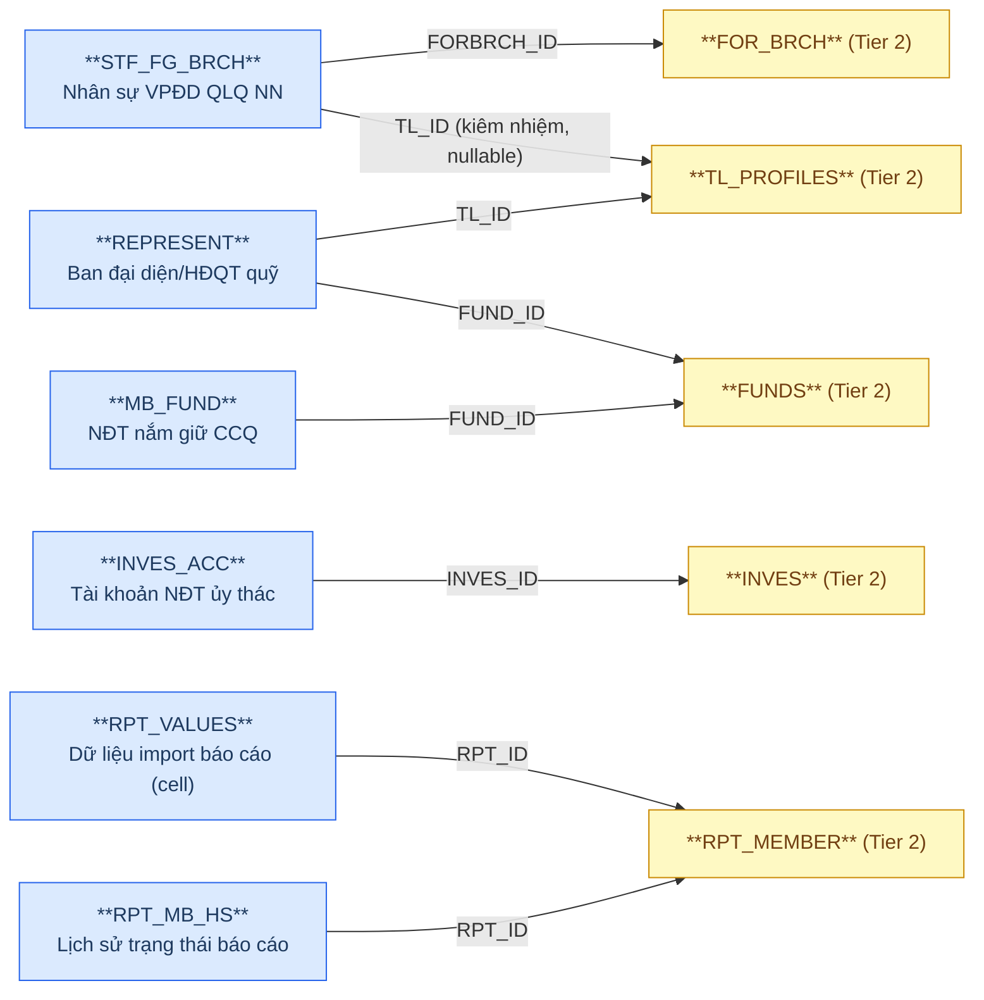
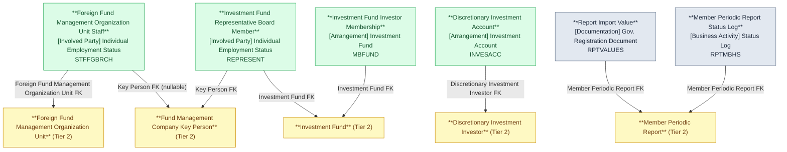

# FMS — HLD Tier 3: Phụ thuộc Tier 2

> **Phụ thuộc Tier 1:** Fund Management Company, Custodian Bank, Fund Distribution Agent, Reporting Period
> **Phụ thuộc Tier 2:** Foreign Fund Management Organization Unit, Fund Management Company Key Person, Investment Fund, Discretionary Investment Investor, Member Periodic Report
>
> **Thiết kế theo:** [FMS_HLD_Overview.md](FMS_HLD_Overview.md)

---

## 6a. Bảng tổng quan BCV Concept

| BCV Core Object | BCV Concept | Category | Source Table | Source Table Change Mode | Mô tả bảng nguồn | Atomic Entity | Table Type | BCV Term |
|---|---|---|---|---|---|---|---|---|
| Involved Party | [Involved Party] Individual Employment Status | Employment Status | STF_FG_BRCH | Update | Danh sách nhân sự của VPĐD/CN công ty QLQ nước ngoài tại VN | Foreign Fund Management Organization Unit Staff | Fundamental | (1) Term candidate: `Individual Employment Status` — cá nhân giữ vị trí trong tổ chức. (2) Cấu trúc trường: STF_FG_BRCH có FK đến FOR_BRCH (tổ chức) + FK đến TL_PROFILES (nhân sự kiêm nhiệm), họ tên, chức vụ, ngày bổ nhiệm → entity vai trò nhân sự trong tổ chức VPĐD NN. (3) Chọn `Individual Employment Status`. |
| Involved Party | [Involved Party] Individual Employment Status | Employment Status | REPRESENT | Update | Danh sách ban đại diện/HĐQT quỹ đầu tư | Investment Fund Representative Board Member | Fundamental | (1) Term candidate: `Individual Employment Status` — thành viên ban đại diện là cá nhân đang giữ vị trí trong cơ cấu quản trị quỹ. (2) Cấu trúc trường: REPRESENT có FK đến FUNDS (quỹ) + FK đến TL_PROFILES (nhân sự QLQ), chức vụ trong BĐD, ngày bổ nhiệm/thôi chức → giao giữa nhân sự và quỹ. (3) Chọn `Individual Employment Status`. |
| Arrangement | [Arrangement] Investment Fund | Investment Fund | MB_FUND | Update | Danh sách nhà đầu tư nắm giữ chứng chỉ quỹ | Investment Fund Investor Membership | Relative | (1) Term candidate: `Investment Fund` — quan hệ thành viên/NĐT trong quỹ (bên nhiều của Arrangement). (2) Cấu trúc trường: MB_FUND có FK đến FUNDS (quỹ), thông tin NĐT (tên, CCCD, loại NĐT STOCKHOLDER_TYPE FK), số lượng CCQ nắm giữ → quan hệ NĐT–quỹ với trạng thái, SCD2 theo thay đổi. (3) Chọn `Investment Fund` Relative. |
| Arrangement | [Arrangement] Investment Account | Investment Account | INVES_ACC | Update | Danh sách tài khoản của nhà đầu tư ủy thác | Discretionary Investment Account | Relative | (1) Term candidate: `Investment Account` — tài khoản được mở cho NĐT ủy thác. (2) Cấu trúc trường: INVES_ACC có FK đến INVES (NĐT ủy thác), mã tài khoản, ngày mở, trạng thái → entity tài khoản phụ thuộc NĐT ủy thác (Tier 2). (3) Chọn `Investment Account`. |
| Documentation | [Documentation] Gov. Registration Document | Government Registration Document | RPT_VALUES | Append | Dữ liệu import báo cáo theo ô dữ liệu (cell) | Report Import Value | Fact Append | (1) Term candidate: `Gov. Registration Document` — dữ liệu import là một phần không tách rời của báo cáo pháp lý. (2) Cấu trúc trường: RPT_VALUES có FK đến RPT_MEMBER (báo cáo cha), sheet, ô, giá trị → chi tiết từng cell trong báo cáo, insert-only cùng báo cáo cha. (3) Chọn `Gov. Registration Document` → Fact Append. |
| Business Activity | [Business Activity] Status Log | Status Log | RPT_MB_HS | Append | Lịch sử trạng thái báo cáo thành viên | Member Periodic Report Status Log | Fact Append | (1) Term candidate: `Status Log` — BCV pattern ghi nhận sự kiện thay đổi trạng thái. (2) Cấu trúc trường: RPT_MB_HS có FK đến RPT_MEMBER (báo cáo cha), trạng thái, timestamp, người thay đổi → mỗi dòng = 1 sự kiện thay đổi trạng thái, insert-only. (3) Chọn `Business Activity` → Fact Append (ETL Pattern Status Log). |

---

## 6b. Diagram Source (Mermaid)

---

## 6c. Diagram Atomic (Mermaid)

---

## 6d. Danh mục & Tham chiếu

| Source Table | Mô tả | Scheme Code dự kiến | Ghi chú |
|---|---|---|---|
| MB_FUND.STOCKHOLDERTYPE_ID | Loại hình NĐT/cổ đông nắm giữ CCQ | `FMS_STOCKHOLDER_TYPE` | source_table — Đã đăng ký Tier 1; tham chiếu lại. |
| STF_FG_BRCH.JOBTYPE_ID | Loại chức vụ nhân sự VPĐD NN | `FMS_JOB_TYPE` | source_table — Đã đăng ký Tier 1; tham chiếu lại. |
| RPT_MB_HS.STATUS_ID | Trạng thái báo cáo tại thời điểm thay đổi | `FMS_REPORT_STATUS` | source_table — Dùng chung FMS_OPERATION_STATUS hoặc tạo riêng. |

---

## 6e. Bảng chờ thiết kế

Không có bảng nào trong Tier 3 chưa đủ thông tin cột.

---

## 6f. Điểm cần xác nhận

| # | Câu hỏi | Ảnh hưởng |
|---|---|---|
| T3-01 | STF_FG_BRCH.TL_ID (FK đến TL_PROFILES) nullable — nhân sự VPĐD NN có thể không phải nhân sự QLQ trong nước. Xác nhận: TL_ID là nullable OK? | **Chờ xác nhận.** Thiết kế hiện tại TL_ID nullable. |
| T3-02 | MB_FUND — 1 NĐT có thể nắm giữ CCQ của nhiều quỹ → grain là (FUND_ID, INVESTOR_ID) hay chỉ FUND_ID? | **Chờ xác nhận.** Tạm thiết kế grain = 1 dòng NĐT per quỹ (FUND_ID + investor_id_number). |
| T3-03 | RPT_VALUES — cấu trúc EAV (Entity-Attribute-Value) per cell. Xác nhận: mỗi cell là 1 dòng hay có thể gộp theo sheet? | **Chờ xác nhận.** Tạm thiết kế 1 dòng = 1 cell (SHEET_NAME + CELL_CODE). |
| T3-04 | REPRESENT — 1 nhân sự có thể là thành viên BĐD của nhiều quỹ cùng lúc. Grain = (FUND_ID, TL_ID, FR_DATE) → xác nhận. | **Chờ xác nhận.** |
