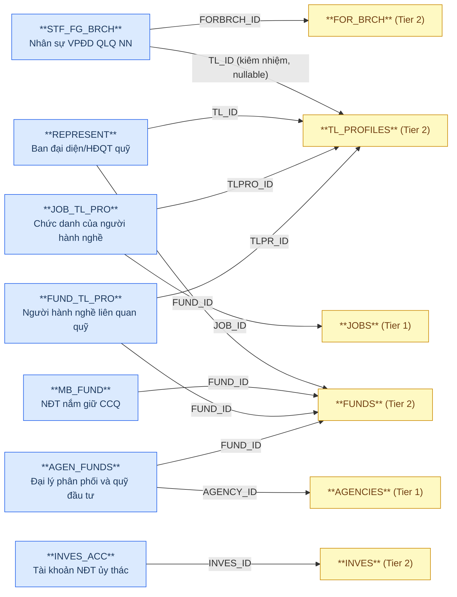

# FMS — HLD Tier 3: Phụ thuộc Tier 2

> **Phụ thuộc Tier 1:** Fund Management Company, Custodian Bank, Fund Distribution Agent, Classification FMS Position
> **Phụ thuộc Tier 2:** Foreign Fund Management Organization Unit, Fund Management Company Employee, Investment Fund, Discretionary Investment Investor
>
> **Thiết kế theo:** [FMS_HLD_Overview.md](FMS_HLD_Overview.md)

---

## 6a. Bảng tổng quan BCV Concept

| BCV Core Object | BCV Concept | Category | Source Table | Source Table Change Mode | Mô tả bảng nguồn | Atomic Entity | Table Type | BCV Term |
|---|---|---|---|---|---|---|---|---|
| Involved Party | [Involved Party] Individual Employment Status | Employment Status | STF_FG_BRCH | Update | Danh sách nhân sự của VPĐD/CN công ty QLQ nước ngoài tại VN | Foreign Fund Management Organization Unit Staff | Fundamental | (1) Term candidate: `Individual Employment Status` — cá nhân giữ vị trí trong tổ chức. (2) Cấu trúc trường: STF_FG_BRCH có FK đến FOR_BRCH (tổ chức) + FK đến TL_PROFILES (nhân sự kiêm nhiệm), họ tên, chức vụ, ngày bổ nhiệm → entity vai trò nhân sự trong tổ chức VPĐD NN. (3) Chọn `Individual Employment Status`. |
| Involved Party | [Involved Party] Individual Employment Status | Employment Status | REPRESENT | Update | Danh sách ban đại diện/HĐQT quỹ đầu tư | Investment Fund Representative Board Member | Fundamental | (1) Term candidate: `Individual Employment Status` — thành viên ban đại diện là cá nhân đang giữ vị trí trong cơ cấu quản trị quỹ. (2) Cấu trúc trường: REPRESENT có FK đến FUNDS (quỹ) + FK đến TL_PROFILES (nhân sự QLQ), chức vụ trong BĐD, ngày bổ nhiệm/thôi chức → giao giữa nhân sự và quỹ. (3) Chọn `Individual Employment Status`. |
| Arrangement | [Arrangement] Investment Fund | Investment Fund | MB_FUND | Update | Danh sách nhà đầu tư nắm giữ chứng chỉ quỹ | Investment Fund Investor Membership | Fundamental | (1) Term candidate: `Investment Fund` — quan hệ thành viên/NĐT trong quỹ (bên nhiều của Arrangement). (2) Cấu trúc trường: MB_FUND có FK đến FUNDS (quỹ), thông tin NĐT (tên, CCCD, loại NĐT STOCKHOLDER_TYPE FK), số lượng CCQ nắm giữ → quan hệ NĐT–quỹ với trạng thái. (3) Chọn `Investment Fund`. Table Type điều chỉnh theo review: `Fundamental` (thay cho `Relative`) — grain NĐT-per-quỹ có lifecycle riêng (SCD4A), tương tự cách BRANCHS/TL_PROFILES vẫn Fundamental dù có FK đến entity Tier trước. |
| Arrangement | [Arrangement] Investment Account | Investment Account | INVES_ACC | Update | Danh sách tài khoản của nhà đầu tư ủy thác | Discretionary Investment Account | Relative | (1) Term candidate: `Investment Account` — tài khoản được mở cho NĐT ủy thác. (2) Cấu trúc trường: INVES_ACC có FK đến INVES (NĐT ủy thác), mã tài khoản, ngày mở, trạng thái → entity tài khoản phụ thuộc NĐT ủy thác (Tier 2). (3) Chọn `Investment Account`. |
| Involved Party | [Involved Party] Individual Employment Status | Employment Status | JOB_TL_PRO | Update | Chức danh công việc của người hành nghề (junction) | Fund Management Company Employee X Classification FMS Position Relationship | Relative | **[MỚI 2026-07-19]** Junction thuần (JOB_ID + TLPRO_ID) — trước đây ở Overview 7f. Theo quyết định Data Modeler, chuyển vào scope thành entity Relative riêng (không denormalize ARRAY). FK đến Fund Management Company Employee (Tier 2) + Classification FMS Position (Tier 1). BCV Concept tạm dùng — cần tra lại (Overview 7e#20). |
| Involved Party | [Involved Party] Individual Employment Status | Investment Fund | FUND_TL_PRO | Update | Người hành nghề liên quan đến quỹ đầu tư (junction) | Fund Management Company Employee X Investment Fund Relationship | Relative | **[MỚI 2026-07-19]** Junction thuần (FUND_ID + TLPR_ID) — trước đây ở Overview 7f. FK đến Fund Management Company Employee (Tier 2) + Investment Fund (Tier 2). **[SỬA 2026-08-15]** BCO đổi Arrangement→Involved Party, tái dùng concept từ phía Employee — khớp với chính Investment Fund (đã BCO Involved Party). Đã tra BCV chính thức — xem Overview 7e#20. |
| Involved Party | [Involved Party] Organization | Investment Fund | AGEN_FUNDS | Update | Bảng trung gian đại lý và quỹ đầu tư (junction) | Fund Distribution Agent X Investment Fund Relationship | Relative | **[MỚI 2026-07-19]** Junction (AGENCY_ID + FUND_ID + DATA_MIGRATION) — **đảo ngược quyết định denormalize ARRAY cũ** (Overview 7d cũ: `distribution_agent_ids` trên Investment Fund). FK đến Fund Distribution Agent (Tier 1) + Investment Fund (Tier 2). `DATA_MIGRATION` (cờ migration kỹ thuật) không map. FUD_AG_AGT (mở rộng 4-FK) cần rà soát gộp/tách — xem Overview 7e#19. **[SỬA 2026-08-15]** BCO đổi Arrangement→Involved Party, tái dùng concept từ phía Agent — khớp với chính Investment Fund (đã BCO Involved Party). Đã tra BCV chính thức — xem Overview 7e#20. |

---

## 6b. Diagram Source (Mermaid)

---

## 6c. Diagram Atomic (Mermaid)

```mermaid
graph TD
    classDef atomic fill:#dcfce7,stroke:#16a34a,color:#14532d
    classDef pattern fill:#e2e8f0,stroke:#64748b,color:#1e293b
    classDef outscope fill:#fef9c3,stroke:#ca8a04,color:#713f12

    FFMS["**Foreign Fund Management Organization Unit Staff**\n[Involved Party] Individual Employment Status\nSTFFGBRCH"]:::atomic
    RBM["**Investment Fund Representative Board Member**\n[Involved Party] Individual Employment Status\nREPRESENT"]:::atomic
    IFIM["**Investment Fund Investor Membership**\n[Arrangement] Investment Fund\nMBFUND"]:::atomic
    DIA["**Discretionary Investment Account**\n[Arrangement] Investment Account\nINVESACC"]:::atomic
    JOBREL["**FMC Employee X Position Relationship**\n[Involved Party] Individual Employment Status\nJOB_TL_PRO"]:::atomic
    FUNDPREL["**FMC Employee X Investment Fund Relationship**\n[Involved Party] Individual Employment Status\nFUND_TL_PRO"]:::atomic
    AGENREL["**Fund Distribution Agent X Investment Fund Relationship**\n[Involved Party] Organization\nAGEN_FUNDS"]:::atomic

    FFMOU["**Foreign Fund Management Organization Unit** (Tier 2)"]:::outscope
    KP["**Fund Management Company Employee** (Tier 2)"]:::outscope
    IF["**Investment Fund** (Tier 2)"]:::outscope
    DII["**Discretionary Investment Investor** (Tier 2)"]:::outscope
    CPOS["**Classification FMS Position** (Tier 1)"]:::outscope
    FDA["**Fund Distribution Agent** (Tier 1)"]:::outscope

    FFMS -->|"Foreign Fund Management Organization Unit FK"| FFMOU
    FFMS -->|"Key Person FK (nullable)"| KP
    RBM -->|"Investment Fund FK"| IF
    RBM -->|"Key Person FK"| KP
    IFIM -->|"Investment Fund FK"| IF
    DIA -->|"Discretionary Investment Investor FK"| DII
    JOBREL -->|"Fund Management Company Employee FK"| KP
    JOBREL -->|"Classification FMS Position FK"| CPOS
    FUNDPREL -->|"Investment Fund FK"| IF
    FUNDPREL -->|"Fund Management Company Employee FK"| KP
    AGENREL -->|"Investment Fund FK"| IF
    AGENREL -->|"Fund Distribution Agent FK"| FDA
```

---

## 6d. Danh mục & Tham chiếu

| Source Table | Mô tả | Scheme Code dự kiến | Ghi chú |
|---|---|---|---|
| MB_FUND.STOCKHOLDERTYPE_ID | Loại hình NĐT/cổ đông nắm giữ CCQ | `FMS_STOCKHOLDER_TYPE` | source_table — Đã đăng ký Tier 1; tham chiếu lại. |
| STF_FG_BRCH.JOBTYPE_ID | Loại chức vụ nhân sự VPĐD NN | `FMS_JOB_TYPE` | source_table — Đã đăng ký Tier 1; tham chiếu lại. |

---

## 6e. Bảng chờ thiết kế

Không có bảng nào trong Tier 3 chưa đủ thông tin cột.

---

## 6f. Điểm cần xác nhận

| # | Câu hỏi | Ảnh hưởng |
|---|---|---|
| T3-01 | STF_FG_BRCH.TL_ID (FK đến TL_PROFILES) nullable — nhân sự VPĐD NN có thể không phải nhân sự QLQ trong nước. Xác nhận: TL_ID là nullable OK? | **Chờ xác nhận.** Thiết kế hiện tại TL_ID nullable. |
| T3-02 | MB_FUND — 1 NĐT có thể nắm giữ CCQ của nhiều quỹ → grain là (FUND_ID, INVESTOR_ID) hay chỉ FUND_ID? Table Type đã chốt `Fundamental` theo review. | **Chờ xác nhận grain.** Tạm thiết kế grain = 1 dòng NĐT per quỹ (FUND_ID + investor_id_number). |
| T3-04 | REPRESENT — 1 nhân sự có thể là thành viên BĐD của nhiều quỹ cùng lúc. Grain = (FUND_ID, TL_ID, FR_DATE) → xác nhận. | **Chờ xác nhận.** |
| T3-05 | **[MỚI 2026-07-19, MỘT PHẦN GIẢI QUYẾT 2026-08-15]** 3 entity Relationship mới (JOB_TL_PRO, FUND_TL_PRO, AGEN_FUNDS) đang dùng BCV Concept tạm. **Đã giải quyết:** FUND_TL_PRO và AGEN_FUNDS — BCO đổi sang Involved Party, tái dùng concept từ phía Employee/Agent tương ứng (xem Overview 7e#20). **Còn tồn:** JOB_TL_PRO vẫn tạm dùng, và FUD_AG_AGT gộp/tách vẫn chưa quyết — xem Overview 7e#19. | Cần xử lý JOB_TL_PRO + FUD_AG_AGT trước khi thiết kế LLD Tier 3 đầy đủ cho nhóm này. |
