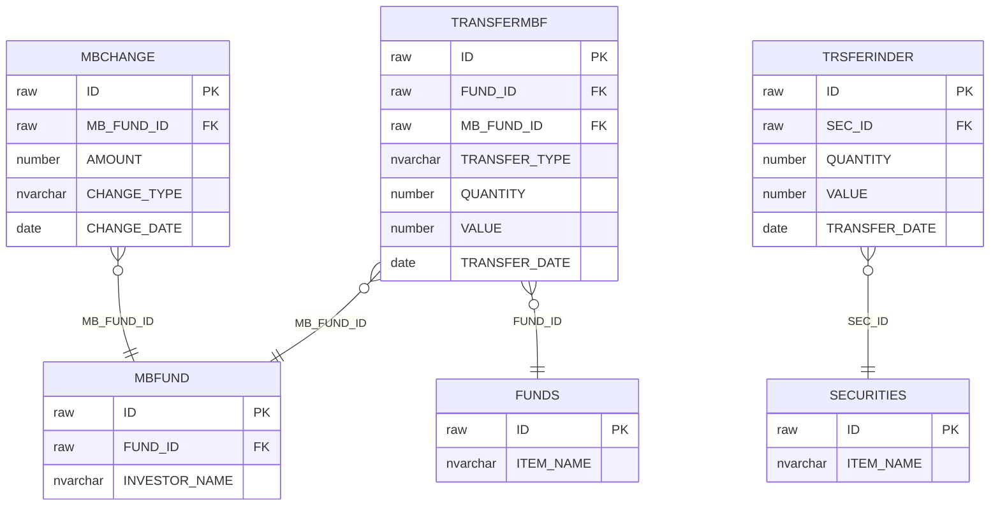
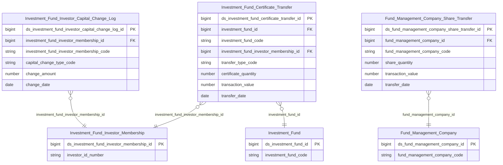

# FMS HLD — Tier 4

**Source system:** FMS (Hệ thống quản lý giám sát công ty chứng khoán và quỹ đầu tư chứng khoán)
**Tier 4:** FK đến Tier 3 — các entity phụ thuộc vào Investment Fund Investor Membership (MBFUND), hoặc Investment Fund (Tier 2) + Investor Membership (Tier 3) cùng lúc. Bao gồm: lịch sử thay đổi vốn góp NĐT quỹ, giao dịch CCQ, giao dịch chuyển nhượng cổ phần QLQ.

---

## 6a. Bảng tổng quan BCV Concept

| BCV Core Object | BCV Concept | Category | Source Table | Source Table Change Mode | Mô tả bảng nguồn | Atomic Entity | table_type | BCV Term |
|---|---|---|---|---|---|---|---|---|
| Transaction | [Event] Transaction | Transaction | MBCHANGE | Append | Lịch sử thay đổi vốn góp của nhà đầu tư trong quỹ | Investment Fund Investor Capital Change Log | Fact Append | (1) Term candidate: `Transaction` — BCV mô tả sự kiện tài chính thực tế phát sinh (thay đổi vốn góp). (2) Cấu trúc trường: MBCHANGE có FK đến MBFUND (NĐT trong quỹ), số tiền thay đổi, loại thay đổi (góp thêm/rút bớt), ngày phát sinh → append theo ngày, mỗi dòng = 1 sự kiện thay đổi vốn. (3) Chọn `Transaction` → Fact Append. |
| Transaction | [Event] Transaction | Transaction | TRANSFERMBF | Append | Giao dịch mua/bán chứng chỉ quỹ | Investment Fund Certificate Transfer | Fact Append | (1) Term candidate: `Transaction` — BCV mô tả giao dịch chuyển nhượng CCQ. (2) Cấu trúc trường: TRANSFERMBF có FK đến FUNDS (quỹ), FK đến MBFUND (NĐT), loại giao dịch, số lượng CCQ, ngày giao dịch, giá trị giao dịch → mỗi dòng = 1 giao dịch CCQ, insert-only. (3) Chọn `Transaction` → Fact Append. |
| Transaction | [Event] Transaction | Transaction | TRSFERINDER | Append | Giao dịch chuyển nhượng cổ phần nội bộ công ty QLQ | Fund Management Company Share Transfer | Fact Append | (1) Term candidate: `Transaction` — giao dịch chuyển nhượng cổ phần. (2) Cấu trúc trường: TRSFERINDER có FK đến SECURITIES (CTQLQ), ngày giao dịch, số lượng, giá trị → mỗi dòng = 1 giao dịch chuyển nhượng cổ phần, insert-only. Lưu ý BRD note: mất FK InFrmId/InToId (INSIDER bị bỏ). (3) Chọn `Transaction` → Fact Append. |

---

## 6b. Diagram Source (Mermaid)

---

## 6c. Diagram Atomic (Mermaid)

---

## 6d. Mục Danh mục & Tham chiếu (Reference Data)

| Source Field / Bảng | Mô tả | Scheme Code | source_type | Ghi chú |
|---|---|---|---|---|
| MBCHANGE.CHANGE_TYPE | Loại thay đổi vốn góp: góp thêm / rút bớt | `FMS_CAPITAL_CHANGE_TYPE` | etl_derived | ETL derived: SUBSCRIPTION / REDEMPTION / TRANSFER_IN / TRANSFER_OUT |
| TRANSFERMBF.TRANSFER_TYPE | Loại giao dịch CCQ: mua / bán / chuyển nhượng | `FMS_CERTIFICATE_TRANSFER_TYPE` | etl_derived | ETL derived: BUY / SELL / TRANSFER |

---

## 6e. Bảng chờ thiết kế

*(Không có)*

---

## 6f. Điểm cần xác nhận

| # | Câu hỏi | Kết quả |
|---|---|---|
| T4-01 | TRSFERINDER mất FK InFrmId/InToId (INSIDER table bị bỏ khỏi scope) — entity Share Transfer sẽ không biết bên mua và bên bán là ai. Xác nhận: có thể load dữ liệu thiếu FK này không, hay cần xem xét scope lại? | **Chờ xác nhận.** GAP đã ghi nhận trong BRD notes. Tạm thiết kế entity không có FK bên mua/bán — ghi nhận trong pending_design.yaml ở bước LLD. |
| T4-02 | TRANSFERMBF FK đến MBFUND — nếu NĐT chưa có record trong MBFUND thì giao dịch đầu tiên có thể bị orphan. Xác nhận: MBFUND luôn tồn tại trước TRANSFERMBF? | **Chờ xác nhận.** |
| T4-03 | MBCHANGE vs TRANSFERMBF — hai bảng cùng ghi về vốn góp NĐT. Xác nhận phân biệt: MBCHANGE = thay đổi vốn góp (tài chính); TRANSFERMBF = giao dịch CCQ (thị trường). Đây là 2 entity khác nhau? | **Chờ xác nhận.** Tạm thiết kế 2 entity riêng. |
