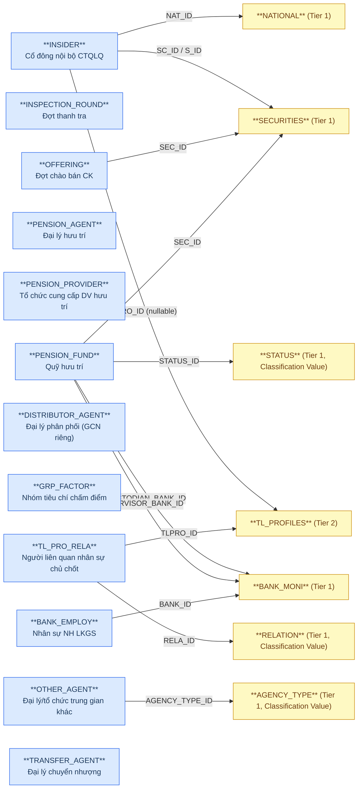

# FMS — HLD Tier 5: Independent Entities (Nhóm nghiệp vụ mới phát hiện)

> **Phụ thuộc:** Không phụ thuộc Tier nào (một số FK đến entity Tier 1/2 đã có: Fund Management Company, Custodian Bank, Fund Management Company Key Person).
>
> **Bối cảnh:** Tier 5-7 thiết kế cho các bảng nguồn phát hiện sau khi BRD/Source/FMS mở rộng khảo sát (172 bảng, so với 77 bảng ban đầu). Nhóm nghiệp vụ: Fund Management Company Insider, Member Inspection, Fund Management Company Securities Offering, Pension, Securities Distribution Agent, Member Rating Criterion Group. **[CẬP NHẬT REVIEW 2026-07-03]** Nhóm Audit Firm bỏ khỏi scope thiết kế Atomic — thông tin kiểm toán lấy từ phân hệ IDS.
>
> **Thiết kế theo:** [FMS_HLD_Overview.md](FMS_HLD_Overview.md)

---

## 6a. Bảng tổng quan BCV Concept

| BCV Core Object | BCV Concept | Category | Source Table | Source Table Change Mode | Mô tả bảng nguồn | Atomic Entity | Table Type | BCV Term |
|---|---|---|---|---|---|---|---|---|
| Involved Party | [Involved Party] Individual | Individual | INSIDER | Update | Cổ đông nội bộ/người có liên quan của công ty QLQ | Fund Management Company Insider | Fundamental | (1) Term candidate: `Individual` — không tìm được BCV term riêng "Insider"/"Related Party" khớp cấu trúc; INSIDER nghiêng cá nhân (BIRTH, EMPLOY_STATUS, ID_NO) nhưng ID_NO cũng nhận "Mã số doanh nghiệp" (bao gồm tổ chức). (2) Cấu trúc trường: FK SC_ID/S_ID (SECURITIES), TLPRO_ID (TL_PROFILES, kiêm nhiệm), NAT_ID (NATIONAL), CAPITAL/QTTY (vốn góp/CCQ nắm giữ), INSIDER_TYPE (cổ đông lớn/BĐH/HĐQT), ADDRESS/TELEPHONE/FAX/EMAIL, ID_NO/ID_DATE/ID_ADD. Tách IP Postal Address + IP Electronic Address + IP Alt Identification. (3) Chọn `Individual`, đặt tên `Fund Management Company Insider` vì FK cha là Fund Management Company (SECURITIES). |
| Business Activity | [Business Activity] Audit Investigation | Audit Investigation | INSPECTION_ROUND | Update | Đợt thanh tra/kiểm tra định kỳ hoặc đột xuất do UBCKNN tổ chức | Member Inspection Round | Fundamental | (1) Term candidate: `Audit Investigation` (id 7768) — "Business Activity in which the operation of an Organization Unit is examined for its integrity and adherence to company standards and policy" khớp chính xác nội dung thanh tra. (2) Cấu trúc trường: OBJECT_TYPE (QLQ/QĐT/BKGS/ĐLPP/Khác — polymorphic), INSPECTION_YEAR, START/END_DATE, DECISION_NO/DATE, PERIOD_FROM/TO, INSPECTION_KIND (định kỳ/đột xuất/kiểm tra) → master entity đợt thanh tra, không FK cố định đến 1 bảng nghiệp vụ (OBJECT_TYPE polymorphic xác định đối tượng ở INSPECTION_TARGET con). (3) Chọn `Audit Investigation`. |
| Business Activity | [Business Activity] Corporate Action | Corporate Action | OFFERING | Update | Đợt chào bán cổ phần/trái phiếu của công ty QLQ (ra công chúng hoặc riêng lẻ) | Fund Management Company Securities Offering | Fundamental | (1) Term candidate: `Corporate Action` (id 7694) — "Product Activity which is related to the debt and equity of business entities" là concept cha bao trùm mọi loại phát hành CP/TP; các term con cụ thể hơn (`Initial Public Offering` id 7964, `Rights Issue Corporate Action` id 7679) chỉ khớp 1 loại chào bán, không bao quát cả PUBLIC/PRIVATE + CP/TP như OFFERING. (2) Cấu trúc trường: FK SEC_ID (SECURITIES), OFFERING_TYPE (PUBLIC/PRIVATE), SECURITIES_TYPE (CP/TP), kế hoạch (QUANTITY_OFFERED, OFFERING_PRICE, EXPECTED_START/END_DATE) + thực tế (QUANTITY_SOLD, ACTUAL_PRICE, OFFERING_START/END_DATE) + văn bản chấp thuận UBCKNN → 1 dòng/đợt chào bán, cập nhật xuyên suốt lifecycle (kế hoạch→thực hiện→kết quả), không phải insert-only. (3) Chọn `Corporate Action`, Table Type `Fundamental` (Update mode, 1 record theo dõi suốt vòng đời). |
| Involved Party | [Involved Party] Organization | Organization | PENSION_AGENT, PENSION_PROVIDER | Update | Đại lý phân phối sản phẩm hưu trí / Tổ chức cung cấp dịch vụ hưu trí | Pension Service Organization | Fundamental | (1) Term candidate: `Organization` — generic, giống Fund Distribution Agent. (2) Cấu trúc trường: PENSION_AGENT và PENSION_PROVIDER giống nhau ~100% (COMPANY_TYPE, ITEM_NAME, ENG_NAME, SHORT_NAME, BUSINESS_LICENSE_NO, ADDRESS, PHONE, FAX...), chỉ khác cột AGENT_TYPE (giá trị cố định "Đại lý hưu trí" vs "Tổ chức cung cấp dịch vụ hưu trí"). Áp dụng quy tắc 10 CLAUDE.md "Gộp entity khi hợp lý — cấu trúc tương tự + ít trường → gộp, dùng Classification Value phân biệt". (3) Gộp 2 bảng thành 1 entity `Pension Service Organization`, phân biệt vai trò bằng Classification Value `pension_role_type_code` (AGENT / PROVIDER). Tách IP Postal Address + IP Electronic Address. |
| Involved Party | [Involved Party] Pension Fund | Pension Fund | PENSION_FUND | Update | Quỹ hưu trí bổ sung tự nguyện do công ty QLQ quản lý | Pension Fund | Fundamental | (1) Term candidate: `Pension Fund` (id 10492, category gốc Group nhưng nội dung mô tả "a pool of assets forming an independent legal entity" — 1 pháp nhân độc lập). (2) Cấu trúc trường: FK SEC_ID (SECURITIES — công ty QLQ quản lý), CUSTODIAN_BANK_ID + SUPERVISOR_BANK_ID (2 vai trò BANK_MONI), STATUS_ID, BUSINESS_CERT_NO (số GPKD) → entity độc lập với lifecycle riêng (thành lập/GPKD), FK về Fund Management Company + Custodian Bank. (3) **[CẬP NHẬT REVIEW 2026-07-03]** Chọn BCO = `Involved Party` (đổi từ `Group`) theo quyết định review — nhất quán với Investment Fund (`[Involved Party] Funds`), giải quyết T5-01. |
| Involved Party | [Involved Party] Organization | Organization | DISTRIBUTOR_AGENT | Update | Đại lý phân phối chứng chỉ quỹ có GCN đăng ký hoạt động riêng | Securities Distribution Agent | Fundamental | (1) Term candidate: `Organization` — generic, cấu trúc gần như trùng Fund Distribution Agent (AGENCIES) đã thiết kế Tier 1. (2) Cấu trúc trường: ITEM_NAME, NAME_EN, SHORT_NAME, BUSINESS_LICENSE_NO, TAX_CODE, **DISTRIBUTION_CERT_NO/DATE/ISSUED_BY** (GCN đăng ký hoạt động phân phối CCQ — cột KHÔNG có ở AGENCIES), ADDRESS, PHONE, FAX. (3) Chọn `Organization`, đặt tên riêng `Securities Distribution Agent` (không trùng `Fund Distribution Agent`) do có GCN phân phối riêng biệt — **nghi ngờ trùng lặp nghiệp vụ với Fund Distribution Agent (AGENCIES), xem 6f.** Tách IP Postal Address + IP Electronic Address. |
| Condition | [Condition] Scoring Criterion | Scoring Criterion | GRP_FACTOR | Update | Nhóm tiêu chí chấm điểm xếp hạng công ty QLQ (VD: nhóm Quản trị, nhóm Tài chính) | Member Rating Criterion Group | Fundamental | (1) Term candidate: `Scoring Criterion` — tái sử dụng term đã dùng cho Member Rating Criterion (RNK_FACTOR cũ/FACTOR mới), vì GRP_FACTOR là cấp nhóm cha của Member Rating Criterion. (2) Cấu trúc trường: ITEM_NAME, CODE, WEIGHT, COLOR (hiển thị) → danh mục nhóm tiêu chí, không phụ thuộc entity nào khác, được FK từ FACTOR (Member Rating Criterion) và RNK_GR_FTOR. (3) Chọn `Scoring Criterion`, đặt tên `Member Rating Criterion Group` để phân biệt cấp nhóm với `Member Rating Criterion` (cấp tiêu chí chi tiết, Tier 6). |
| Involved Party | [Involved Party] Individual Employment Status | Employment Status | BANK_EMPLOY | Update | Nhân sự của ngân hàng lưu ký giám sát | Custodian Bank Employee | Fundamental | (1) Term candidate: `Individual Employment Status` — giống pattern Fund Management Company Key Person. (2) Cấu trúc trường: FK BANK_ID (Custodian Bank), ITEM_NAME, ID_NO/ID_DATE (định danh), CERT_NO/CERT_LAW/CERT_AUDIT/CERT_DATE (chứng chỉ hành nghề/pháp lý/kiểm toán), POSITION → nhân sự giữ vị trí tại NH LKGS. Tách IP Alt Identification (CCCD/Hộ chiếu), tương tự Fund Management Company Key Person. (3) Chọn `Individual Employment Status`. |
| Involved Party | [Involved Party] Related Family Individual | Individual | TL_PRO_RELA | Update | Người có quan hệ gia đình/liên quan với người hành nghề (nhân sự chủ chốt CTQLQ) | Fund Management Company Key Person Related Person | Fundamental | (1) Term candidate: `Related Family Individual` (id 11308) — tái sử dụng term đã dùng cho Fund Management Company Insider Related Person (INSDER_RELA, cùng cấu trúc). (2) Cấu trúc trường: FK TLPRO_ID (Fund Management Company Key Person), RELA_ID (RELATION — loại quan hệ), ID_NO/ID_DATE/ID_PLACE, ADDRESS, DESCRIPTION → quan hệ có attribute riêng (không phải pure junction). Tách IP Postal Address + IP Alt Identification. (3) Chọn `Related Family Individual`, Table Type `Fundamental` (nhất quán với INSDER_RELA sau review). |
| Involved Party | [Involved Party] Organization | Organization | OTHER_AGENT | Update | Đại lý/tổ chức trung gian khác tham gia thị trường quỹ (không phải phân phối/chuyển nhượng/hưu trí cụ thể) | Other Intermediary Organization Unit | Fundamental | (1) Term candidate: `Organization` — generic, cấu trúc gần như trùng Transfer Agent/Pension Service Organization (cùng nhóm "Intermediary Organization"). (2) Cấu trúc trường: FK AGENCY_TYPE_ID (loại đại lý, dùng chung scheme với Fund Distribution Agent), COMPANY_TYPE, ITEM_NAME, ENG_NAME, SHORT_NAME, BUSINESS_LICENSE_NO, ADDRESS, PHONE, FAX → tổ chức trung gian độc lập, không FK đến SECURITIES/FUNDS. Tách IP Postal Address + IP Electronic Address. (3) Chọn `Organization`. |
| Involved Party | [Involved Party] Transfer Agent | Organization | TRANSFER_AGENT | Update | Đại lý chuyển nhượng quyền sở hữu chứng chỉ quỹ (VSDC, NHTM hoặc tổ chức khác) | Transfer Agent | Fundamental | (1) Term candidate: `Transfer Agent` (id 11347) — "Identifies an Agent of a corporation that effects the transfer of financial instruments such as stock or bonds from one owner to another" khớp chính xác tên và nội dung. (2) Cấu trúc trường: AGENT_TYPE (cố định "Đại lý chuyển nhượng"), COMPANY_TYPE (1=VSDC/2=NHTM/3=Khác), ITEM_NAME, BUSINESS_LICENSE_NO, ADDRESS, PHONE, FAX → tổ chức độc lập, không FK đến SECURITIES/FUNDS. Tách IP Postal Address + IP Electronic Address. (3) Chọn `[Involved Party] Transfer Agent`. |

**[CẬP NHẬT REVIEW 2026-07-03] AUDIT_FIRM bỏ không thiết kế:** Thông tin kiểm toán (công ty kiểm toán, kiểm toán viên, nhắc nhở kiểm toán) lấy từ phân hệ IDS — không thiết kế Atomic entity `Audit Firm` tại FMS. Cascade: AUDITOR (Tier 6) và AUDIT_FIRM_REMINDER (Tier 7) cũng bỏ theo. Xem mục 7f Overview (nhóm `Xử lý luồng khác`).

**[MỚI 2026-07-03] FUD_AG_AGT không tạo Atomic entity riêng:** Bảng chỉ có 4 cột FK (FUD_ID → Investment Fund, AG_TY_ID → AGENCY_TYPE, AGEN_ID + AGEN_ID_PARENT → Fund Distribution Agent) — không có attribute nghiệp vụ nào khác. Đây là bản mở rộng của junction AGEN_FUNDS đã denormalize thành `distribution_agents ARRAY<STRUCT<agent_id, agent_code>>` trên Investment Fund (xem Overview 7d) — bổ sung thêm 2 trường vào STRUCT: `agent_type_code` (từ AG_TY_ID) và `parent_agent_id` (từ AGEN_ID_PARENT, self-ref trong Fund Distribution Agent). Không tạo entity `Investment Fund Distribution Agent Assignment` riêng để tránh trùng lặp mô hình hóa quan hệ Fund↔Agent đã có ở AGEN_FUNDS.

---

## 6b. Diagram Source (Mermaid)

---

## 6c. Diagram Atomic (Mermaid)

```mermaid
graph TD
    classDef atomic fill:#dcfce7,stroke:#16a34a,color:#14532d
    classDef shared fill:#fae8ff,stroke:#9333ea,color:#4a044e
    classDef outscope fill:#fef9c3,stroke:#ca8a04,color:#713f12

    FMCI["**Fund Management Company Insider**\n[Involved Party] Individual\nINSIDER"]:::atomic
    MIR["**Member Inspection Round**\n[Business Activity] Audit Investigation\nINSPECTION_ROUND"]:::atomic
    FMCSO["**Fund Management Company Securities Offering**\n[Business Activity] Corporate Action\nOFFERING"]:::atomic
    PSO["**Pension Service Organization**\n[Involved Party] Organization\nPENSION_AGENT + PENSION_PROVIDER"]:::atomic
    PF["**Pension Fund**\n[Involved Party] Pension Fund\nPENSION_FUND"]:::atomic
    SDA["**Securities Distribution Agent**\n[Involved Party] Organization\nDISTRIBUTOR_AGENT"]:::atomic
    RFG["**Member Rating Criterion Group**\n[Condition] Scoring Criterion\nGRP_FACTOR"]:::atomic
    CBE["**Custodian Bank Employee**\n[Involved Party] Individual Employment Status\nBANK_EMPLOY"]:::atomic
    KPRP["**FMC Key Person Related Person**\n[Involved Party] Related Family Individual\nTL_PRO_RELA"]:::atomic
    OIO["**Other Intermediary Organization Unit**\n[Involved Party] Organization\nOTHER_AGENT"]:::atomic
    TA["**Transfer Agent**\n[Involved Party] Transfer Agent\nTRANSFER_AGENT"]:::atomic

    FMC["**Fund Management Company** (Tier 1)"]:::outscope
    CB["**Custodian Bank** (Tier 1)"]:::outscope
    GEO["**Geographic Area** (Tier 1, shared)"]:::outscope
    KP["**Fund Management Company Key Person** (Tier 2)"]:::outscope

    ADDR["IP Postal Address"]:::shared
    EADDR["IP Electronic Address"]:::shared
    ALTID["IP Alt Identification"]:::shared

    CBE -->|"Custodian Bank FK"| CB
    ALTID -.->|"shared"| CBE
    KPRP -->|"Fund Management Company Key Person FK"| KP
    ADDR -.->|"shared"| KPRP
    ALTID -.->|"shared"| KPRP
    ADDR -.->|"shared"| OIO
    EADDR -.->|"shared"| OIO
    ADDR -.->|"shared"| TA
    EADDR -.->|"shared"| TA

    FMCI -->|"Fund Management Company FK (x2: liên quan + thuộc về)"| FMC
    FMCI -->|"Geographic Area FK"| GEO
    FMCI -->|"Key Person FK (nullable, kiêm nhiệm)"| KP
    ADDR -.->|"shared"| FMCI
    EADDR -.->|"shared"| FMCI
    ALTID -.->|"shared"| FMCI
    FMCSO -->|"Fund Management Company FK"| FMC
    PF -->|"Fund Management Company FK"| FMC
    PF -->|"Custodian Bank FK (x2: lưu ký + giám sát)"| CB
    ADDR -.->|"shared"| PSO
    EADDR -.->|"shared"| PSO
    ADDR -.->|"shared"| SDA
    EADDR -.->|"shared"| SDA
```

---

## 6d. Danh mục & Tham chiếu

| Source Table | Mô tả | Scheme Code dự kiến | Ghi chú |
|---|---|---|---|
| INSIDER.INSIDER_TYPE | Loại cổ đông nội bộ: 1=Cổ đông lớn, 2=Ban điều hành, 3=HĐQT | `FMS_INSIDER_TYPE` | etl_derived — ETL derived: MAJOR_SHAREHOLDER / EXECUTIVE / BOARD_MEMBER. |
| INSPECTION_ROUND.OBJECT_TYPE | Loại đối tượng thanh tra: 1=QLQ, 2=QĐT, 3=BKGS, 4=ĐLPP, 5=Khác | `FMS_INSPECTION_OBJECT_TYPE` | etl_derived — polymorphic type dùng chung cho Member Inspection Target. |
| INSPECTION_ROUND.INSPECTION_KIND | Hình thức thanh tra: 1=Định kỳ, 2=Đột xuất, 3=Kiểm tra | `FMS_INSPECTION_KIND` | etl_derived. |
| OFFERING.OFFERING_TYPE | Loại chào bán: PUBLIC/PRIVATE | `FMS_OFFERING_TYPE` | source_type: source_table — values từ OFFERING.OFFERING_TYPE. |
| OFFERING.SECURITIES_TYPE | Loại chứng khoán chào bán: CP/TP | `FMS_OFFERING_SECURITIES_TYPE` | source_table. |
| OFFERING.DATA_SOURCE | Nguồn dữ liệu: MANUAL/TTHC | `FMS_OFFERING_DATA_SOURCE` | etl_derived. |
| PENSION_AGENT/PENSION_PROVIDER.AGENT_TYPE (giá trị cố định) | Vai trò tổ chức hưu trí: đại lý phân phối / tổ chức cung cấp dịch vụ | `FMS_PENSION_ROLE_TYPE` | etl_derived — AGENT / PROVIDER, dùng để phân biệt sau khi gộp entity. |
| PENSION_AGENT/PENSION_PROVIDER/DISTRIBUTOR_AGENT.COMPANY_TYPE | Loại hình công ty: 1=CK, 2=NHTM, 3=Bảo hiểm, 4=Khác | `FMS_AGENT_COMPANY_TYPE` | etl_derived — dùng chung cho các entity dạng "Organization đại lý/trung gian". |
| GRP_FACTOR.WEIGHT | Trọng số nhóm tiêu chí (%) | — | Không cần scheme — Percentage domain, không phải Classification Value. |

---

## 6e. Bảng chờ thiết kế

Không có bảng nào trong Tier 5 chưa đủ thông tin cột.

---

## 6f. Điểm cần xác nhận

| # | Câu hỏi | Ảnh hưởng |
|---|---|---|
| T5-01 | **[ĐÃ GIẢI QUYẾT 2026-07-03]** Pension Fund BCO trước đây = `Group` (term `Pension Fund` id 10492), khác Investment Fund (FUNDS) BCO = `Involved Party`. Theo quyết định review, đổi Pension Fund BCO → `Involved Party` để nhất quán nhóm "Fund". | Đã cập nhật atomic_entity `Pension Fund` — BCO = `Involved Party`. |
| T5-02 | **Securities Distribution Agent** (DISTRIBUTOR_AGENT) có cấu trúc cột gần như trùng **Fund Distribution Agent** (AGENCIES, Tier 1) — cùng là tổ chức phân phối CCQ, chỉ khác DISTRIBUTOR_AGENT có thêm GCN đăng ký hoạt động phân phối riêng. Xác nhận nghiệp vụ: đây là 2 mạng lưới đại lý song song, hay DISTRIBUTOR_AGENT là phiên bản mới/thay thế AGENCIES? | Nếu là 1 nghiệp vụ → cần gộp lại thành 1 entity trước khi LLD, tránh trùng lặp dữ liệu. |
| T5-03 | **Pension Fund** không thấy FK trực tiếp đến **Pension Service Organization** trong cấu trúc cột hiện có (PENSION_FUND chỉ FK SECURITIES + BANK_MONI). Xác nhận: quan hệ Pension Fund ↔ Pension Service Organization được quản lý qua bảng nào khác (ngoài scope hiện tại) hay thực sự không có quan hệ trực tiếp? | Ảnh hưởng thiết kế FK — hiện để 2 entity độc lập không liên kết. |
| T5-04 | **Fund Management Company Insider** có 2 FK đến SECURITIES (SC_ID = công ty liên quan đến giao dịch, S_ID = công ty mà người nội bộ thuộc về) — xác nhận ý nghĩa khác biệt giữa 2 FK này, và có luôn bằng nhau không hay có thể khác nhau (VD: insider của công ty A giao dịch cổ phần công ty B)? | Ảnh hưởng thiết kế 2 cột FK riêng biệt hay gộp 1. |
| T5-05 | **Member Rating Criterion Group** (GRP_FACTOR) không thấy self-ref hoặc phân cấp — xác nhận đây chỉ là 1 cấp nhóm phẳng (flat), không phải cây nhiều cấp như Member Rating Criterion (FACTOR, Tier 6)? | Ảnh hưởng thiết kế — nếu cần phân cấp, bổ sung self-ref PARENT_ID tương tự FACTOR. |

---

## Shared Entity — bổ sung source_table

Các entity Tier 5 sau bổ sung `source_table` vào shared entity đã có (không tạo entity mới):

| Shared Entity | Entity tham chiếu | Trường nguồn |
|---|---|---|
| IP Postal Address | Fund Management Company Insider, Pension Service Organization, Securities Distribution Agent, Fund Management Company Key Person Related Person, Other Intermediary Organization Unit, Transfer Agent | ADDRESS |
| IP Electronic Address | Fund Management Company Insider (TELEPHONE/FAX/EMAIL), Pension Service Organization (PHONE/FAX), Securities Distribution Agent (PHONE/FAX), Other Intermediary Organization Unit (PHONE/FAX), Transfer Agent (PHONE/FAX) | EMAIL, PHONE, FAX, WEBSITE |
| IP Alt Identification | Fund Management Company Insider, Custodian Bank Employee, Fund Management Company Key Person Related Person | ID_NO, ID_DATE, ID_ADD / ID_PLACE |
