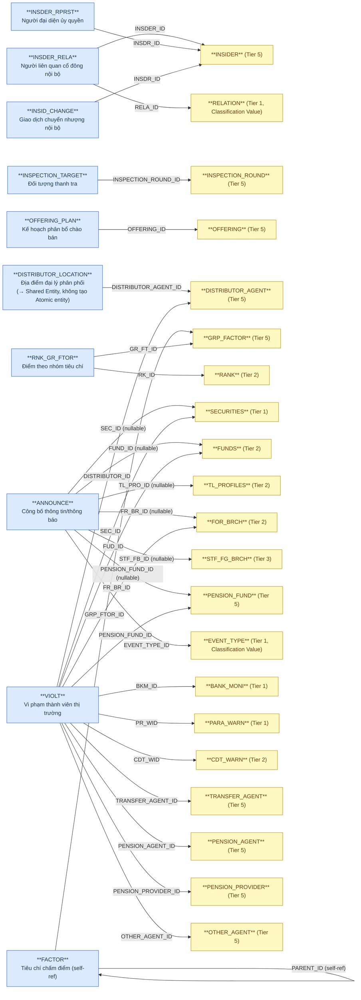

# FMS — HLD Tier 6: Phụ thuộc Tier 5 (và Tier 1/2 đã có)

> **Phụ thuộc Tier 1/2/3:** Fund Management Company, Investment Fund, Foreign Fund Management Organization Unit, Fund Management Company Key Person, Member Rating, Foreign Fund Management Organization Unit Staff, Custodian Bank, Member Warning Parameter, Member Warning Condition
> **Phụ thuộc Tier 5:** Fund Management Company Insider, Member Inspection Round, Fund Management Company Securities Offering, Securities Distribution Agent, Member Rating Criterion Group, Pension Fund, Transfer Agent, Pension Service Organization, Other Intermediary Organization Unit
>
> **Thiết kế theo:** [FMS_HLD_Overview.md](FMS_HLD_Overview.md)

---

## 6a. Bảng tổng quan BCV Concept

| BCV Core Object | BCV Concept | Category | Source Table | Source Table Change Mode | Mô tả bảng nguồn | Atomic Entity | Table Type | BCV Term |
|---|---|---|---|---|---|---|---|---|
| Involved Party | [Involved Party] Related Family Individual | Individual | INSDER_RELA | Update | Người có quan hệ gia đình/liên quan với cổ đông nội bộ (vợ/chồng, con...) | Fund Management Company Insider Related Person | Fundamental | (1) Term candidate: `Related Family Individual` (id 11308) — "Identifies an Individual who has a family connection... with the subject Individual" khớp nội dung. (2) Cấu trúc trường: FK INSDER_ID (Fund Management Company Insider), RELA_ID (RELATION — loại quan hệ), ID_NO/ID_DATE/ID_PLACE, ADDRESS, GP_QD_NO/APPROVAL_DATE → quan hệ có attribute riêng (không phải pure junction). Tách IP Postal Address + IP Alt Identification. (3) Chọn `Related Family Individual`. **[CẬP NHẬT REVIEW 2026-07-03]** Table Type = `Fundamental` (đổi từ `Relative` theo quyết định review). |
| Involved Party | [Involved Party] Designated Representative | Individual | INSDER_RPRST | Update | Người đại diện theo ủy quyền của cổ đông nội bộ | Fund Management Company Insider Representative | Fundamental | (1) Term candidate: `Designated Representative` (id 10842) — "Identifies an Involved Party that represents another Involved Party in their role and responsibilities" khớp nội dung ủy quyền đại diện. (2) Cấu trúc trường: FK INSDR_ID, ID_NO/ID_DATE/ID_PLACE, JOB, FR_DATE/TO_DATE (thời hạn ủy quyền), PER_REP (tỷ lệ đại diện %) → quan hệ đại diện có thời hạn, thuộc tính riêng. Tách IP Alt Identification. (3) Chọn `Designated Representative`. **[CẬP NHẬT REVIEW 2026-07-03]** Table Type = `Fundamental` (đổi từ `Relative` theo quyết định review). |
| Business Activity | [Business Activity] Business Activity | Transaction | INSID_CHANGE | Update | Giao dịch chuyển nhượng cổ phần/CCQ của cổ đông nội bộ (mua/bán/đăng ký) | Fund Management Company Insider Shareholding Change Log | Fact Append | (1) Term candidate ban đầu: `Transaction`. (2) Cấu trúc trường: FK INSDR_ID, TX_DATE/TX_NUM (giao dịch), AOORP (mua/bán/đăng ký), tỷ lệ + số lượng + vốn góp trước/sau (PREPERCENT/AFT_PERCENT, PRE_QTTY/AFT_QTTY, PRECAPITAL/AFT_CAPITAL) → mỗi dòng = 1 giao dịch, insert-only theo TX_DATE. Cấu trúc tương tự MB_CHANGE (Investment Fund Investor Capital Change Log) đã điều chỉnh BCO. (3) Áp dụng nhất quán: `Business Activity` (giống quyết định review cho MB_CHANGE), Fact Append. |
| Business Activity | [Business Activity] Business Activity Target Involved Party | Business Activity | INSPECTION_TARGET | Update | Đối tượng cụ thể chịu thanh tra trong 1 đợt (snapshot tên tại thời điểm tạo) | Member Inspection Target | Relative | (1) Term candidate: `Business Activity Target Involved Party` (id 7973) — "Identifies the Involved Party that is the intended target of the Business Activity" khớp chính xác. (2) Cấu trúc trường: FK INSPECTION_ROUND_ID, OBJECT_TYPE + TARGET_ID (polymorphic — tương tự VIOLT đa hướng), TARGET_NAME (snapshot tên). Table Type `Relative` — mô tả quan hệ đợt thanh tra ↔ đối tượng, không có lifecycle độc lập ngoài đợt thanh tra cha. (3) Chọn `Business Activity Target Involved Party`. |
| Business Activity | [Business Activity] Corporate Action | Business Activity | OFFERING_PLAN | Update | Kế hoạch phân bổ chào bán theo từng nhóm đối tượng/phương thức | Fund Management Company Securities Offering Plan | Fundamental | (1) Term candidate: `Corporate Action` (kế thừa từ entity cha Fund Management Company Securities Offering). (2) Cấu trúc trường: FK OFFERING_ID, SORT_ORDER, TARGET_AUDIENCE, METHOD_CODE, kế hoạch (QUANTITY_CB/PRICE_CB/VALUE_CB) + thực tế (ACTUAL_QUANTITY_CB...) → chi tiết phân bổ của 1 đợt chào bán, nhiều dòng/đợt. (3) Chọn `Corporate Action`. **[CẬP NHẬT REVIEW 2026-07-03]** Table Type = `Fundamental` (đổi từ `Relative` theo quyết định review). |
| Condition | [Condition] Scoring Criterion | Scoring Criterion | FACTOR | Update | Tiêu chí chấm điểm xếp hạng chi tiết (self-ref cha/con, thuộc 1 nhóm tiêu chí) | Member Rating Criterion | Fundamental | **[SỬA LỖI — xem T1-05 ở FMS_HLD_Tier1.md]** (1) Term candidate: `Scoring Criterion` — giữ nguyên term đã dùng trước đây cho "Member Rating Criterion", nhưng nguồn đúng là FMS.FACTOR chứ không phải FMS.RNK_FACTOR (RNK_FACTOR không có self-ref, xem Tier 7). (2) Cấu trúc trường: FK GRP_FTOR_ID (Member Rating Criterion Group), self-ref PARENT_ID (cây tiêu chí cha/con), WEIGHT, GRADING_METHOD (thang điểm/cộng/trừ), BASED_GRADING, RANKING_ORDER, E4_FACTOR (cờ nhóm quản lý rủi ro), FORMULA_INFO (JSON công thức) → định nghĩa tiêu chí chấm điểm, KHÔNG phải kết quả. (3) Chọn `Scoring Criterion`. Table Type `Fundamental` (self-ref tree, lifecycle riêng, giống Member Rating Criterion Group). |
| Business Activity | [Business Activity] Business Activity | Business Activity | RNK_GR_FTOR | Update | Điểm số của 1 kết quả xếp hạng (Member Rating) theo từng nhóm tiêu chí (Member Rating Criterion Group) | Member Rating Ranking Criterion Group | Fundamental | (1) Term candidate: `Business Activity` — tái sử dụng concept đã áp dụng cho Member Rating (RANK), vì đây là breakdown điểm của cùng 1 sự kiện xếp hạng theo nhóm tiêu chí. (2) Cấu trúc trường: FK RK_ID (RANK — Member Rating, Tier 2), GR_FT_ID (Member Rating Criterion Group, Tier 5), ITEM_VALUE, CODE, ITEM_NAME, WEIGHT (trọng số áp dụng thực tế cho kỳ đó) → có attribute nghiệp vụ (không phải pure junction). (3) Chọn `Business Activity`. **[CẬP NHẬT REVIEW 2026-07-03]** Table Type = `Fundamental` (đổi từ `Fact Append` theo quyết định review). |
| Communication | [Communication] Announcement | Communication | ANNOUNCE | Update | Công bố thông tin (CBTT)/thông báo của thành viên thị trường — định kỳ, bất thường, theo yêu cầu | Member Disclosure Announcement | Fact Append | (1) Term candidate: `Announcement` (id 8801) — "Identifies a Communication whose purpose is to make some information public or widely known" khớp chính xác nội dung CBTT. (2) Cấu trúc trường: FK đa hướng nullable — SEC_ID (Fund Management Company), FUND_ID (Investment Fund), TL_PRO_ID (Fund Management Company Key Person), FR_BR_ID (Foreign Fund Management Organization Unit), STF_FB_ID (Foreign Fund Management Organization Unit Staff, Tier 3), PENSION_FUND_ID (Pension Fund, Tier 5), EVENT_TYPE_ID (loại sự vụ, Classification Value); ANNOUNCE_TYPE/REPORT_TYPE/PERIOD_TYPE (phân loại CBTT), TITLE/BODY (song ngữ VN/EN), ANNOUNCE_DATE/SEND_DATE/DEADLINE_SEND → mỗi dòng = 1 lần công bố thông tin, insert theo ANNOUNCE_DATE. (3) Chọn `Announcement`, Fact Append (giống pattern sự kiện công bố, không phải master data). FK cao nhất đến Pension Fund (Tier 5) → đặt Tier 6. |
| Business Activity | [Business Activity] Conduct Violation | Conduct Violation | VIOLT | Update | Danh sách vi phạm của thành viên thị trường (đa hướng — nhiều loại thành viên tham gia thị trường quỹ) | Fund Management Conduct Violation | Fundamental | (1) Term candidate: `Conduct Violation` — BCV mô tả sự kiện vi phạm quy định của thành viên thị trường. (2) Cấu trúc trường đầy đủ (đọc lại khi thiết kế Member Warning Condition): FK đa hướng đến SECURITIES (Fund Management Company, Tier 1), FUNDS (Investment Fund, Tier 2), BANK_MONI (Custodian Bank, Tier 1), FOR_BRCH (Foreign Fund Management Organization Unit, Tier 2), PR_WID (Member Warning Parameter, Tier 1), CDT_WID (Member Warning Condition, Tier 2), DISTRIBUTOR_ID (Securities Distribution Agent, Tier 5), TRANSFER_AGENT_ID (Transfer Agent, Tier 5), PENSION_AGENT_ID/PENSION_PROVIDER_ID (Pension Service Organization, Tier 5), OTHER_AGENT_ID (Other Intermediary Organization Unit, Tier 5), PENSION_FUND_ID (Pension Fund, Tier 5); ngoài ra SYSTEM_OBJECT, REPORT_YEAR, ITEM_VALUE, PERIOD_TYPE/PERIOD_VALUE (+ bản `_OTHER`), RECORD_STATUS, RECOVERY_STATUS, RUN_BATCH_ID. (3) Chọn `Conduct Violation`, giữ tên `Fund Management Conduct Violation` theo review trước đây. **[RETIER 2026-07-05]** FK cao nhất là Tier 5 (DISTRIBUTOR_ID/TRANSFER_AGENT_ID/PENSION_AGENT_ID/PENSION_PROVIDER_ID/OTHER_AGENT_ID/PENSION_FUND_ID) → chuyển từ Tier 1 lên Tier 6 (xem FMS_HLD_Tier1.md T1-06). Table Type giữ nguyên `Fundamental` — RECOVERY_STATUS gợi ý trạng thái vi phạm có thể được cập nhật (chưa khắc phục → đã khắc phục), không hoàn toàn insert-only; câu hỏi so sánh với FIMS.VIOLT (`Fact Append`) vẫn để mở, xem 6f T6-07. |

**[CẬP NHẬT REVIEW 2026-07-03] AUDITOR bỏ không thiết kế:** Thông tin kiểm toán viên hành nghề lấy từ phân hệ IDS — không thiết kế Atomic entity `Audit Firm Auditor` tại FMS. Xem mục 7f Overview (nhóm `Xử lý luồng khác`).

**[CẬP NHẬT REVIEW 2026-07-03] DISTRIBUTOR_LOCATION không thiết kế Atomic entity riêng:** Theo quyết định review, ADDRESS/PHONE của địa điểm giao dịch denormalize trực tiếp vào IP Postal Address + IP Electronic Address gắn với **Securities Distribution Agent** (cha, Tier 5) — không tạo entity `Securities Distribution Agent Location`. ITEM_NAME (tên chi nhánh) chưa có cột chuẩn tương ứng trên shared entity — xem T6-04 ở mục 6f. Xem mục 7f Overview (nhóm `Shared Entity`).

---

## 6b. Diagram Source (Mermaid)

---

## 6c. Diagram Atomic (Mermaid)

```mermaid
graph TD
    classDef atomic fill:#dcfce7,stroke:#16a34a,color:#14532d
    classDef pattern fill:#e2e8f0,stroke:#64748b,color:#1e293b
    classDef shared fill:#fae8ff,stroke:#9333ea,color:#4a044e
    classDef outscope fill:#fef9c3,stroke:#ca8a04,color:#713f12

    FMCIRP["**FMC Insider Related Person**\n[Involved Party] Related Family Individual\nINSDER_RELA"]:::atomic
    FMCIR["**FMC Insider Representative**\n[Involved Party] Designated Representative\nINSDER_RPRST"]:::atomic
    FMCISCL["**FMC Insider Shareholding Change Log**\n[Business Activity] Business Activity\nINSID_CHANGE"]:::pattern
    MIT["**Member Inspection Target**\n[Business Activity] Business Activity Target Involved Party\nINSPECTION_TARGET"]:::atomic
    FMCSOP["**FMC Securities Offering Plan**\n[Business Activity] Corporate Action\nOFFERING_PLAN"]:::atomic
    RC["**Member Rating Criterion**\n[Condition] Scoring Criterion\nFACTOR"]:::atomic
    MRFGS["**Member Rating Ranking Criterion Group**\n[Business Activity] Business Activity\nRNK_GR_FTOR"]:::atomic
    MDA["**Member Disclosure Announcement**\n[Communication] Announcement\nANNOUNCE"]:::pattern
    MCV["**Fund Management Conduct Violation**\n[Business Activity] Conduct Violation\nVIOLT"]:::atomic

    FMCI["**Fund Management Company Insider** (Tier 5)"]:::outscope
    MIR["**Member Inspection Round** (Tier 5)"]:::outscope
    FMCSO["**FMC Securities Offering** (Tier 5)"]:::outscope
    SDA["**Securities Distribution Agent** (Tier 5)"]:::outscope
    RFG["**Member Rating Criterion Group** (Tier 5)"]:::outscope
    MR["**Member Rating** (Tier 2)"]:::outscope
    FMC["**Fund Management Company** (Tier 1)"]:::outscope
    IF["**Investment Fund** (Tier 2)"]:::outscope
    KP["**Fund Management Company Key Person** (Tier 2)"]:::outscope
    FFMOU["**Foreign Fund Management Organization Unit** (Tier 2)"]:::outscope
    FFMS["**Foreign Fund Management Organization Unit Staff** (Tier 3)"]:::outscope
    PF["**Pension Fund** (Tier 5)"]:::outscope
    CB["**Custodian Bank** (Tier 1)"]:::outscope
    WP["**Member Warning Parameter** (Tier 1)"]:::outscope
    WC["**Member Warning Condition** (Tier 2)"]:::outscope
    TA["**Transfer Agent** (Tier 5)"]:::outscope
    PSO["**Pension Service Organization** (Tier 5)"]:::outscope
    OIO["**Other Intermediary Organization Unit** (Tier 5)"]:::outscope

    ADDR["IP Postal Address"]:::shared
    EADDR["IP Electronic Address"]:::shared
    ALTID["IP Alt Identification"]:::shared

    FMCIRP -->|"FMC Insider FK"| FMCI
    ADDR -.->|"shared"| FMCIRP
    ALTID -.->|"shared"| FMCIRP
    FMCIR -->|"FMC Insider FK"| FMCI
    ALTID -.->|"shared"| FMCIR
    FMCISCL -->|"FMC Insider FK"| FMCI
    MIT -->|"Member Inspection Round FK"| MIR
    FMCSOP -->|"FMC Securities Offering FK"| FMCSO
    RC -->|"Member Rating Criterion Group FK"| RFG
    RC -->|"Parent Member Rating Criterion FK (self-ref)"| RC
    MRFGS -->|"Member Rating FK"| MR
    MRFGS -->|"Member Rating Criterion Group FK"| RFG

    ADDR -.->|"shared (bổ sung DISTRIBUTOR_LOCATION.ADDRESS)"| SDA
    EADDR -.->|"shared (bổ sung DISTRIBUTOR_LOCATION.PHONE)"| SDA

    MDA -->|"Fund Management Company FK (nullable)"| FMC
    MDA -->|"Investment Fund FK (nullable)"| IF
    MDA -->|"Fund Management Company Key Person FK (nullable)"| KP
    MDA -->|"Foreign Fund Management Organization Unit FK (nullable)"| FFMOU
    MDA -->|"Foreign FM Org Unit Staff FK (nullable)"| FFMS
    MDA -->|"Pension Fund FK (nullable)"| PF

    MCV -->|"Fund Management Company FK"| FMC
    MCV -->|"Investment Fund FK"| IF
    MCV -->|"Custodian Bank FK"| CB
    MCV -->|"Foreign Fund Management Organization Unit FK"| FFMOU
    MCV -->|"Member Warning Parameter FK"| WP
    MCV -->|"Member Warning Condition FK"| WC
    MCV -->|"Securities Distribution Agent FK"| SDA
    MCV -->|"Transfer Agent FK"| TA
    MCV -->|"Pension Service Organization FK (x2: agent/provider)"| PSO
    MCV -->|"Other Intermediary Organization Unit FK"| OIO
    MCV -->|"Pension Fund FK"| PF
```

---

## 6d. Danh mục & Tham chiếu

| Source Table | Mô tả | Scheme Code dự kiến | Ghi chú |
|---|---|---|---|
| INSID_CHANGE.AOORP | Loại giao dịch: A=Mua vào, O=Bán ra, R/P=Đăng ký | `FMS_INSIDER_TX_TYPE` | etl_derived — ETL derived: BUY / SELL / REGISTER. |
| FACTOR.GRADING_METHOD | Phương pháp chấm điểm: 1=Thang điểm, 2=Điểm cộng, 3=Điểm trừ | `FMS_GRADING_METHOD` | etl_derived — dùng chung cho Member Rating Criterion + Member Rating Criterion Scale (Tier 7). |
| FACTOR.BASED_GRADING | Cơ sở chấm điểm: 1=Giá trị thực tế, 2=Xếp hạng | `FMS_BASED_GRADING` | etl_derived. |
| OFFERING_PLAN.METHOD_CODE | Hình thức chào bán trong kế hoạch (enum StockOfferingPlanMethodEnum) | `FMS_OFFERING_PLAN_METHOD` | source_type: modeler_defined — chưa profile hết giá trị enum, chờ LLD. |
| ANNOUNCE.ANNOUNCE_TYPE | Loại hình CBTT: định kỳ/bất thường/theo yêu cầu/khác | `FMS_ANNOUNCE_TYPE` | etl_derived. |
| ANNOUNCE.REPORT_TYPE | Loại báo cáo đính kèm CBTT: định kỳ/bất thường/theo yêu cầu/khác | `FMS_ANNOUNCE_REPORT_TYPE` | etl_derived. |
| ANNOUNCE.PERIOD_TYPE | Loại kỳ báo cáo: ngày/tuần/tháng/quý/bán niên/năm/nửa tháng | `FMS_PERIOD_TYPE` | etl_derived — dùng chung cho các entity có kỳ báo cáo dạng enum số. |
| EVENT_TYPE (bảng danh mục) | Danh mục loại sự vụ báo cáo/CBTT | `FMS_EVENT_TYPE` | source_table — FK từ Member Disclosure Announcement (ANNOUNCE.EVENT_TYPE_ID) và Member Inspection Round (nhóm liên quan). Đăng ký scheme mới, bổ sung 7c Overview. |

---

## 6e. Bảng chờ thiết kế

Không có bảng nào trong Tier 6 chưa đủ thông tin cột.

---

## 6f. Điểm cần xác nhận

| # | Câu hỏi | Ảnh hưởng |
|---|---|---|
| T6-01 | INSPECTION_TARGET.TARGET_ID là FK đa hình (polymorphic theo OBJECT_TYPE) — cùng pattern với VIOLT. Xác nhận: có tra cứu được sang entity cụ thể (Fund Management Company/Investment Fund/Custodian Bank/Fund Distribution Agent) ở tầng LLD không, hay giữ dạng UUID tham chiếu mềm? | Ảnh hưởng thiết kế FK ở LLD — cần ETL resolve OBJECT_TYPE → entity tương ứng. |
| T6-02 | **Member Rating Criterion (FACTOR) không có FK trực tiếp đến RANK** — điểm số theo tiêu chí cụ thể nằm ở RNK_FACTOR (Tier 7, "Member Rating Ranking Criterion"), còn RNK_GR_FTOR (Tier 6) là điểm theo NHÓM tiêu chí. Xác nhận: 2 bảng điểm số này (theo tiêu chí chi tiết vs theo nhóm) có phải cùng tồn tại song song, hay 1 trong 2 nên tổng hợp/dẫn xuất (derived) từ bảng kia? | Ảnh hưởng thiết kế đo lường điểm số — tránh trùng lặp lưu trữ điểm số. |
| T6-03 | INSID_CHANGE (Fund Management Company Insider Shareholding Change Log) có ý nghĩa tương tự TRS_FER_INDER (Fund Management Company Share Transfer, Tier 4) — cả 2 đều ghi nhận chuyển nhượng cổ phần CTQLQ. TRS_FER_INDER đã ghi GAP mất FK bên mua/bán do INSIDER ngoài scope (mục 7e#5 Overview). Nay INSIDER đã thiết kế (Tier 5) — xác nhận: TRS_FER_INDER có thể bổ sung FK đến Fund Management Company Insider để lấp GAP, và INSID_CHANGE có phải bản ghi trùng/chi tiết hơn của cùng nghiệp vụ không? | **Quan trọng** — cần đối chiếu 2 bảng trước khi LLD để tránh double-model 1 giao dịch. |
| T6-04 | **[MỚI 2026-07-03]** DISTRIBUTOR_LOCATION.ITEM_NAME (tên chi nhánh/địa điểm giao dịch) không có cột tương ứng trên IP Postal Address / IP Electronic Address chuẩn (chỉ có địa chỉ/liên lạc, không có nhãn tên địa điểm). Xác nhận: bổ sung cột nhãn (address_label) vào shared entity ở LLD, hay bỏ qua ITEM_NAME? | Ảnh hưởng thiết kế attribute shared entity ở LLD. |
| T6-05 | **[MỚI]** Member Disclosure Announcement (ANNOUNCE) có 6 FK nullable (SEC_ID/FUND_ID/TL_PRO_ID/FR_BR_ID/STF_FB_ID/PENSION_FUND_ID) — cùng pattern với VIOLT/RPT_MEMBER (đã loại). Xác nhận: tại 1 thời điểm chỉ 1 FK not-null (CBTT của 1 loại thành viên) hay có thể nhiều FK cùng có giá trị (CBTT liên quan nhiều đối tượng)? | Ảnh hưởng thiết kế ràng buộc FK nullable vs union ở LLD. |
| T6-06 | **[MỚI]** EVENT_TYPE (bảng danh mục loại sự vụ) có nhiều cột cấu hình nghiệp vụ hơn danh mục thuần (CATEGORY, OBLIGATION_TYPE, DEADLINE_CALC_METHOD, METADATA JSON) — không chỉ Code+Name. Xác nhận: xử lý Classification Value mở rộng (scheme FMS_EVENT_TYPE, các cột cấu hình để LLD lưu thêm ngoài Code+Name) có đủ hay cần entity Fundamental riêng? | Ảnh hưởng thiết kế LLD cho EVENT_TYPE. |
| T6-07 | **[MỚI 2026-07-05, chuyển từ Tier1 T1-06]** Fund Management Conduct Violation (VIOLT) — 2 câu hỏi còn mở sau khi retier lên Tier 6: (1) Table Type hiện `Fundamental` — RECOVERY_STATUS gợi ý vi phạm có thể chuyển trạng thái chưa khắc phục → đã khắc phục (update), nhưng FIMS.VIOLT (cùng nghiệp vụ, Market Participant Conduct Violation) lại dùng `Fact Append`. Xác nhận pattern đúng cho FMS trước khi LLD. (2) FMS.VIOLT và FIMS.VIOLT có phải cùng 1 nghiệp vụ giám sát vi phạm bị model 2 lần ở 2 source khác nhau, hay là 2 phạm vi giám sát độc lập (FMS = QLQ/Quỹ/NH LKGS/đại lý; FIMS = phạm vi khác)? Liên quan item 14 Overview 7e (Member Inspection Penalty Decision vs VIOLT). | **Chờ xác nhận.** Ảnh hưởng ETL pattern (SCD4A vs Insert-only) và khả năng hợp nhất/tham chiếu chéo với FIMS trước LLD. |

---

## Shared Entity — bổ sung source_table

Các entity Tier 6 sau bổ sung `source_table` vào shared entity đã có (không tạo entity mới):

| Shared Entity | Entity tham chiếu | Trường nguồn |
|---|---|---|
| IP Postal Address | Fund Management Company Insider Related Person, Securities Distribution Agent (bổ sung từ DISTRIBUTOR_LOCATION) | ADDRESS |
| IP Electronic Address | Securities Distribution Agent (bổ sung từ DISTRIBUTOR_LOCATION.PHONE) | PHONE |
| IP Alt Identification | Fund Management Company Insider Related Person, Fund Management Company Insider Representative | ID_NO, ID_DATE, ID_PLACE |
