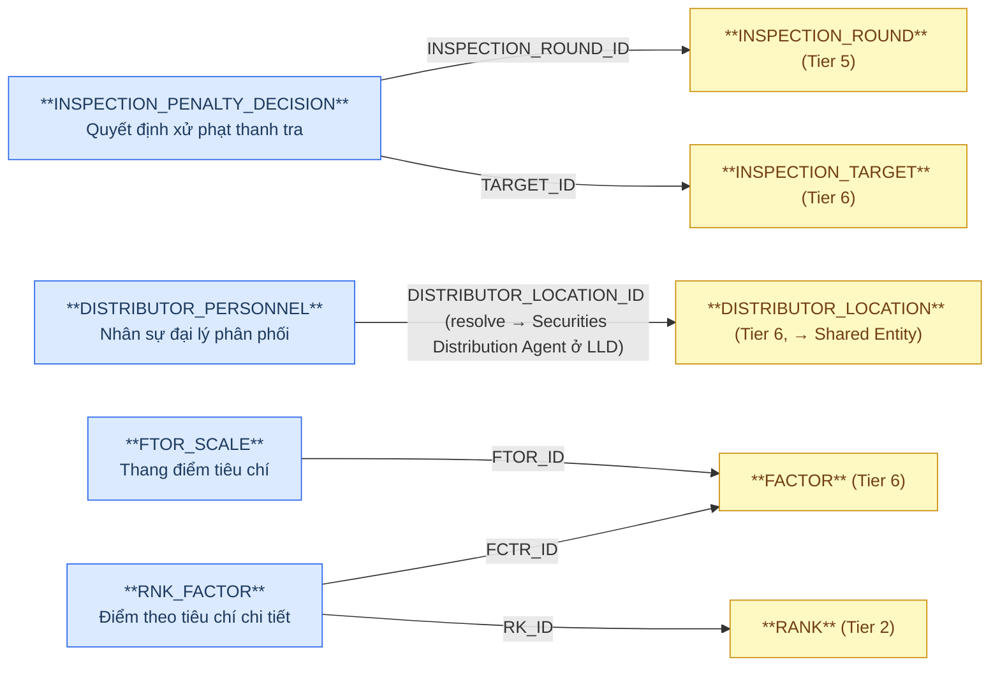
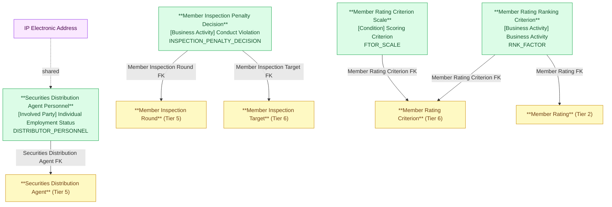

# FMS — HLD Tier 7: Phụ thuộc Tier 6 (và Tier 2/5 đã có)

> **Phụ thuộc Tier 2:** Member Rating
> **Phụ thuộc Tier 5:** Securities Distribution Agent
> **Phụ thuộc Tier 6:** Member Inspection Target, Member Rating Criterion
>
> **Thiết kế theo:** [FMS_HLD_Overview.md](FMS_HLD_Overview.md)

---

## 6a. Bảng tổng quan BCV Concept

| BCV Core Object | BCV Concept | Category | Source Table | Source Table Change Mode | Mô tả bảng nguồn | Atomic Entity | Table Type | BCV Term |
|---|---|---|---|---|---|---|---|---|
| Business Activity | [Business Activity] Conduct Violation | Conduct Violation | INSPECTION_PENALTY_DECISION | Update | Quyết định xử phạt vi phạm hành chính phát sinh từ đợt thanh tra | Member Inspection Penalty Decision | Fundamental | (1) Term candidate: tái sử dụng `Conduct Violation` (đã dùng cho Fund Management Conduct Violation, VIOLT) — nội dung tương đồng (quyết định xử phạt vi phạm). (2) Cấu trúc trường: FK INSPECTION_ROUND_ID + TARGET_ID (Member Inspection Target), PENALTY_DECISION_NO/DATE, VIOLATION_BEHAVIOR, PENALTY_FORM/AMOUNT, ADDITIONAL_PENALTY_FORM, REMEDY_MEASURE, EXECUTION_STATUS/REMEDY_STATUS → mỗi dòng = 1 quyết định xử phạt. (3) Chọn `Conduct Violation`. **[CẬP NHẬT REVIEW 2026-07-03]** Table Type = `Fundamental` (đổi từ `Fact Append` theo quyết định review). **Lưu ý: cần đối chiếu với Fund Management Conduct Violation (VIOLT, Tier 1) — xem 6f.** |
| Involved Party | [Involved Party] Individual Employment Status | Employment Status | DISTRIBUTOR_PERSONNEL | Update | Nhân sự tại địa điểm giao dịch của Securities Distribution Agent | Securities Distribution Agent Personnel | Fundamental | (1) Term candidate: `Individual Employment Status` — giống pattern Fund Management Company Key Person / Foreign FM Org Unit Staff. (2) Cấu trúc trường: FK DISTRIBUTOR_LOCATION_ID, FULL_NAME, CERT_NO (CCHN), POSITION, PHONE → nhân sự giữ vị trí tại địa điểm giao dịch. Tách IP Electronic Address. (3) Chọn `Individual Employment Status`. **[CẬP NHẬT REVIEW 2026-07-03]** DISTRIBUTOR_LOCATION không còn là Atomic entity riêng (xem Tier 6) — FK của Securities Distribution Agent Personnel trỏ trực tiếp đến **Securities Distribution Agent** (Tier 5); DISTRIBUTOR_LOCATION_ID resolve qua bảng nguồn ở LLD. |
| Condition | [Condition] Scoring Criterion | Scoring Criterion | FTOR_SCALE | Update | Thang điểm/khoảng giá trị áp dụng cho từng tiêu chí chấm điểm | Member Rating Criterion Scale | Fundamental | (1) Term candidate: `Scoring Criterion` — kế thừa từ Member Rating Criterion (entity cha), đây là chi tiết ngưỡng quy đổi điểm. (2) Cấu trúc trường: FK FTOR_ID (Member Rating Criterion), FROM_VALUE/FROM_VALUE_CONDITION, TO_VALUE/TO_VALUE_CONDITION (ngưỡng dưới/trên + toán tử so sánh), RANKING_VALUE (điểm ứng với khoảng), MAX_MINUS_POINT → mỗi dòng = 1 khoảng giá trị per tiêu chí. (3) Chọn `Scoring Criterion`. **[CẬP NHẬT REVIEW 2026-07-03]** Table Type = `Fundamental` (đổi từ `Relative` theo quyết định review). |
| Business Activity | [Business Activity] Business Activity | Business Activity | RNK_FACTOR | Update | Điểm số thực tế của 1 kết quả xếp hạng (Member Rating) theo từng tiêu chí chi tiết (Member Rating Criterion) | Member Rating Ranking Criterion | Fundamental | **[SỬA LỖI — xem T1-05 ở FMS_HLD_Tier1.md]** (1) Term candidate: `Business Activity` — tái sử dụng concept Member Rating, vì đây là breakdown điểm theo tiêu chí chi tiết của cùng 1 sự kiện xếp hạng. (2) Cấu trúc trường thực tế: FK RK_ID (RANK — Member Rating, Tier 2), FCTR_ID (Member Rating Criterion, Tier 6) — KHÔNG có PARENT_ID self-ref như thiết kế cũ từng gán nhầm; có SCORE_VALUE (điểm đạt được), MINUS_SCORE (điểm trừ), ITEM_VALUE, RANKING_VALUE, WEIGHT, CODE/ITEM_NAME → mỗi dòng = 1 điểm breakdown theo tiêu chí. (3) Chọn `Business Activity`. Đổi tên entity từ `Member Rating Criterion` (sai) → `Member Rating Ranking Criterion`. **[CẬP NHẬT REVIEW 2026-07-03]** Table Type = `Fundamental` (đổi từ `Fact Append` theo quyết định review). |

**[CẬP NHẬT REVIEW 2026-07-03] AUDIT_FIRM_REMINDER bỏ không thiết kế:** Thông tin kiểm toán (bao gồm nhắc nhở kiểm toán viên/công ty kiểm toán) lấy từ phân hệ IDS — không thiết kế Atomic entity `Audit Firm Reminder` tại FMS. Xem mục 7f Overview (nhóm `Xử lý luồng khác`).

---

## 6b. Diagram Source (Mermaid)

---

## 6c. Diagram Atomic (Mermaid)

---

## 6d. Danh mục & Tham chiếu

| Source Table | Mô tả | Scheme Code dự kiến | Ghi chú |
|---|---|---|---|
| INSPECTION_PENALTY_DECISION.EXECUTION_STATUS | Trạng thái thi hành quyết định: PENDING/EXECUTING/DONE | `FMS_INSPECTION_EXECUTION_STATUS` | source_table. |
| INSPECTION_PENALTY_DECISION.REMEDY_STATUS | Trạng thái khắc phục: PENDING/DONE/OVERDUE | `FMS_INSPECTION_REMEDY_STATUS` | source_table. |
| FTOR_SCALE.FROM_VALUE_CONDITION / TO_VALUE_CONDITION | Toán tử so sánh ngưỡng: >=, >, <=, < | `FMS_SCALE_COMPARISON_OPERATOR` | etl_derived. |

---

## 6e. Bảng chờ thiết kế

Không có bảng nào trong Tier 7 chưa đủ thông tin cột.

---

## 6f. Điểm cần xác nhận

| # | Câu hỏi | Ảnh hưởng |
|---|---|---|
| T7-01 | **Member Inspection Penalty Decision** (INSPECTION_PENALTY_DECISION) và **Fund Management Conduct Violation** (VIOLT, Tier 1) đều ghi nhận vi phạm/xử phạt của thành viên thị trường. Xác nhận: đây là 2 nguồn dữ liệu độc lập (VIOLT = vi phạm ghi nhận trực tiếp; Inspection Penalty Decision = vi phạm phát hiện qua thanh tra) hay cùng 1 nghiệp vụ ghi 2 nơi? | **Quan trọng** — nếu trùng, cần hợp nhất hoặc thiết lập quan hệ tham chiếu giữa 2 entity trước LLD. |
| T7-03 | Member Rating Ranking Criterion (RNK_FACTOR, đã sửa) và Member Rating Ranking Criterion Group (RNK_GR_FTOR, Tier 6) — xác nhận WEIGHT ở RNK_FACTOR (theo tiêu chí) và WEIGHT ở RNK_GR_FTOR (theo nhóm) độc lập nhau, tổng điểm Member Rating (RANK.TOTAL_SCORE) được tính từ tổng hợp 2 tầng này đúng không? | Ảnh hưởng logic tính điểm — cần xác nhận công thức nghiệp vụ trước khi thiết kế LLD measure. |

---

## Shared Entity — bổ sung source_table

| Shared Entity | Entity tham chiếu | Trường nguồn |
|---|---|---|
| IP Electronic Address | Securities Distribution Agent Personnel | PHONE |
