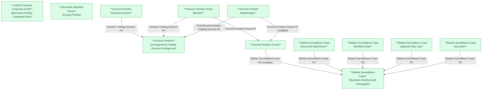

# GSGD — HLD Overview: Toàn cảnh thiết kế Atomic Layer

> **Nguồn:** Hệ thống GSGD — Phần hệ giám sát giao dịch chứng khoán (Oracle)
>
> **Phạm vi task này:** Chỉ 15 bảng theo yêu cầu — INVESTOR_ACCOUNT, INVESTOR_ACCOUNT_EXTEND_INFO, ACCOUNT_AUTHORIZATION (gộp vào 1 Atomic entity **Account Investor**); ACCOUNT_FINANCIAL_SERVICE, ACCOUNT_GROUP, ACCOUNT_GROUP_MEMBER, ACCOUNT_RELATIONSHIP, COMPANY_EVENT, SECURITIES_GROUP, SECURITIES_GROUP_MEMBER, CASE_FILE, CASE_FILE_SECURITIES_CODE, CASE_ATTACH_FILE, CASE_FILE_WORKFLOW, CASE_APPROVAL_STEP (thiết kế tham khảo sát theo `DataModel/working/Atomic_LinhLV/`). Các bảng GSGD khác (ANALYSIS_*, SUSPICIOUS_ACCOUNT*, REPORT_TEMPLATE*, ANALYSIS_WORKFLOW*, ABNORMAL_REPORT*, COMPLIANCE_REPORT*, CATEGORY_ITEM, TRANSACTION_REVIEW*, hệ thống/cấu hình...) **ngoài phạm vi task này** — chưa đánh giá scope, để dành cho lần thiết kế Tier tiếp theo.
>
> **File chi tiết theo tầng:**
> - [GSGD_HLD_Tier1.md](GSGD_HLD_Tier1.md) — Account Investor, Listed Company Corporate Event, Securities Watchlist Group, Market Surveillance Case
> - [GSGD_HLD_Tier2.md](GSGD_HLD_Tier2.md) — Account Investor Financial Service, Account Investor Group, Market Surveillance Case Document Attachment, Market Surveillance Case Workflow Step, Market Surveillance Case Approval Step Log, Market Surveillance Case Securities
> - [GSGD_HLD_Tier3.md](GSGD_HLD_Tier3.md) — Account Investor Group Member, Account Investor Relationship

---

#### 7a. Bảng tổng quan Atomic entities

| Tier | BCV Core Object | BCV Concept | Category | Source Table | Source Table Change Mode | Mô tả bảng nguồn | Atomic Entity | Table Type | BCV Term |
|---|---|---|---|---|---|---|---|---|---|
| 1 | Arrangement | [Arrangement] Trading Account Arrangement | Trading Account Arrangement | INVESTOR_ACCOUNT | Update | Thông tin tài khoản nhà đầu tư (từ VSDC) | Account Investor | Fundamental | Trading Account Arrangement — khớp 1 tài khoản giao dịch chứng khoán NĐT. |
| 1 | Arrangement | [Arrangement] Trading Account Arrangement | Trading Account Arrangement | INVESTOR_ACCOUNT_EXTEND_INFO | Update | Thông tin mở rộng tài khoản (liên hệ/ngân hàng) | Account Investor | Fundamental | Cùng Atomic entity Account Investor — join 1-1 qua ACCOUNT_CODE, denormalized (grain không phải Involved Party). |
| 1 | Arrangement | [Arrangement] Trading Account Arrangement | Trading Account Arrangement | ACCOUNT_AUTHORIZATION | Update | Thông tin ủy quyền giao dịch trên tài khoản | Account Investor | Fundamental | Term riêng là [Communication] Authorization nhưng gộp theo yêu cầu thiết kế — denormalize ARRAY<STRUCT> "Authorized Persons". |
| 1 | Business Activity | [Business Activity] Corporate Action | Corporate Action | COMPANY_EVENT | Append | Sự kiện tổ chức niêm yết ảnh hưởng giá tham chiếu | Listed Company Corporate Event | Fact Append | Corporate Action — sửa so với thiết kế tham khảo (trước đây dùng `[Event]` rỗng). |
| 1 | Group | [Group] Portfolio | Portfolio | SECURITIES_GROUP | Update | Nhóm chứng khoán do Ban GSTT tự quản lý | Securities Watchlist Group | Fundamental | Portfolio — giữ nguyên theo thiết kế tham khảo. |
| 1 | Business Activity | [Business Activity] Audit Investigation | Audit Investigation | CASE_FILE | Append | Vụ việc giám sát giao dịch chứng khoán bất thường | Market Surveillance Case | Fundamental | Audit Investigation — giữ nguyên theo thiết kế tham khảo. |
| 2 | Arrangement | [Arrangement] Account Facility Arrangement | Account Facility Arrangement | ACCOUNT_FINANCIAL_SERVICE | Update | Dịch vụ tài chính đăng ký trên tài khoản | Account Investor Financial Service | Fundamental | Account Facility Arrangement — sửa so với thiết kế tham khảo (`[Arrangement] Financial Market` sai khớp — Term đó thuộc category Group). |
| 2 | Group | [Group] Involved Party Group | Involved Party Group | ACCOUNT_GROUP | Update | Nhóm tài khoản do nghiệp vụ giám sát xác định | Account Investor Group | Fundamental | Involved Party Group — sửa category/tên Term so với thiết kế tham khảo. |
| 2 | Documentation | [Documentation] Supporting Documentation | Supporting Documentation | CASE_ATTACH_FILE | Append | File đính kèm vụ việc | Market Surveillance Case Document Attachment | Fundamental | Supporting Documentation — có FILE_GROUP phân loại nghiệp vụ nên giữ Atomic entity, không rơi vào rule File Attachment ngoài scope. |
| 2 | Business Activity | ETL Pattern -- Activity Log | Activity Log | CASE_FILE_WORKFLOW | Append | Từng bước quy trình xử lý vụ việc | Market Surveillance Case Workflow Step | Fact Append | Quy ước dự án — log bước quy trình append-only. |
| 2 | Business Activity | ETL Pattern -- Activity Log | Activity Log | CASE_APPROVAL_STEP | Append | Nhật ký duyệt từng bước xử lý vụ việc | Market Surveillance Case Approval Step Log | Fact Append | Quy ước dự án — log duyệt append-only. |
| 2 | Business Activity | [Business Activity] Audit Investigation | Audit Investigation | CASE_FILE_SECURITIES_CODE | Update | Mã chứng khoán liên quan tới vụ việc (N-N) | Market Surveillance Case Securities | Relative | Tái dùng Term entity cha — thuộc tính multi-value của Market Surveillance Case, giữ Atomic entity riêng theo ghi chú BRD (khác xử lý ARRAY của SECURITIES_GROUP_MEMBER). |
| 3 | Group | [Group] Group Involved Party Member | Group Involved Party Member | ACCOUNT_GROUP_MEMBER | Update | Quan hệ thành viên giữa tài khoản và nhóm giám sát | Account Investor Group Member | Fundamental | Group Involved Party Member — sửa tên Term so với thiết kế tham khảo. |
| 3 | Business Activity | [Business Activity] Audit Investigation | Audit Investigation | ACCOUNT_RELATIONSHIP | Update | Mối quan hệ giữa 2 tài khoản NĐT trong giám sát | Account Investor Relationship | Relative | Audit Investigation — sửa Core Object (Arrangement → Business Activity) và đổi tên entity để nhất quán Domain Prefix "Account Investor". |

**Tổng: 12 Atomic entities** (4 Tier 1, 6 Tier 2, 2 Tier 3), từ 14/15 bảng nguồn phạm vi task (1 bảng — SECURITIES_GROUP_MEMBER — denormalize thành ARRAY, xem 7d, không tạo entity riêng).
*(0 shared entity extend source_table trong phạm vi task này.)*

---

#### 7b. Diagram Atomic tổng (Mermaid)

---

#### 7c. Bảng Classification Value

| Source Table | Mô tả | BCV Term | Xử lý Atomic |
|---|---|---|---|
| INVESTOR_ACCOUNT.APPROVAL_STATUS / COMPANY_EVENT.APPROVAL_STATUS / ACCOUNT_GROUP.APPROVAL_STATUS | Trạng thái phê duyệt | Classification Value | Scheme: `GSGD_APPROVAL_STATUS` (dùng chung 3 bảng, cần profile riêng nếu value set khác nhau). |
| INVESTOR_ACCOUNT.DATA_SOURCE | Nguồn dữ liệu chính (VSDC/CTCK) | Classification Value | Scheme: `GSGD_DATA_SOURCE`. |
| INVESTOR_ACCOUNT.MARGIN_SERVICE_ENABLED / ADVANCE_PAYMENT_SERVICE_ENABLED / ACCOUNT_AUTHORIZATION_ENABLED | Cờ dịch vụ tài chính đăng ký | Classification Value | Scheme: `GSGD_SERVICE_ENABLED_FLAG`. Cần profile kiểu dữ liệu thực tế (VARCHAR2(200) — chưa rõ Y/N hay text). |
| COMPANY_EVENT.EVENT_TYPE | Loại sự kiện tổ chức niêm yết | Classification Value | Scheme: `GSGD_COMPANY_EVENT_TYPE`. |
| SECURITIES_GROUP.GROUP_TYPE | Loại nhóm chứng khoán | Classification Value | Scheme: `GSGD_SECURITIES_GROUP_TYPE`. |
| SECURITIES_GROUP.STATUS | Trạng thái nhóm chứng khoán | Classification Value | Scheme: `GSGD_GROUP_STATUS`. Cần profile giá trị thực tế. |
| CASE_FILE.CASE_FILE_TYPE / CASE_FILE_WORKFLOW.WORKFLOW_TYPE | Loại vụ việc / loại quy trình | Classification Value | Scheme: `GSGD_CASE_TYPE` (dùng chung — cùng bộ giá trị Sơ bộ/Thao túng/Nội gián/Liên thị trường). |
| CASE_FILE.INFORMATION_SOURCE | Nguồn thông tin vụ việc | Classification Value | Scheme: `GSGD_INFORMATION_SOURCE`. |
| CASE_FILE.CASE_FILE_STATUS | Trạng thái vụ việc | Classification Value | Scheme: `GSGD_CASE_STATUS`. |
| ACCOUNT_FINANCIAL_SERVICE.SERVICE_TYPE | Loại dịch vụ tài chính | Classification Value | Scheme: `GSGD_FINANCIAL_SERVICE_TYPE`. |
| ACCOUNT_GROUP.GROUP_TYPE | Loại nhóm tài khoản | Classification Value | Scheme: `GSGD_ACCOUNT_GROUP_TYPE`. |
| ACCOUNT_GROUP.RELATION_TYPE_ID / ACCOUNT_RELATIONSHIP.CATEGORY_ITEM_ID | Loại quan hệ (Danh tính/IP/MAC/Tiền) | Classification Value | Scheme: `GSGD_ACCOUNT_RELATION_TYPE` (dùng chung 2 bảng). FK suy luận → CATEGORY_ITEM, ngoài phạm vi task. |
| CASE_ATTACH_FILE.FILE_TYPE | Loại file đính kèm | Classification Value | Scheme: `GSGD_FILE_TYPE`. |
| CASE_ATTACH_FILE.FILE_GROUP | Nhóm file đính kèm | Classification Value | Scheme: `GSGD_FILE_GROUP`. |
| CASE_APPROVAL_STEP.STEP_CODE / NEXT_STEP_CODE | Mã bước duyệt | Classification Value | Scheme: `GSGD_APPROVAL_STEP_CODE`. |
| CASE_APPROVAL_STEP.STATUS / CASE_FILE_WORKFLOW.STATUS | Trạng thái bước duyệt/quy trình | Classification Value | Scheme: `GSGD_APPROVAL_STEP_STATUS` (dùng chung — value set có thể khác nhau, cần profile riêng). |
| ACCOUNT_GROUP_MEMBER.STATUS | Trạng thái tài khoản trong nhóm | Classification Value | Scheme: `GSGD_ACCOUNT_STATUS`. |

---

#### 7d. Junction Tables

| Source Table | Mô tả | Entity chính | Xử lý trên Atomic |
|---|---|---|---|
| SECURITIES_GROUP_MEMBER | Thành viên nhóm chứng khoán (GROUP_ID + SECURITIES_CODE) | Securities Watchlist Group | Pure junction — không tạo Atomic entity. Denormalize thành `Securities Codes ARRAY<Text>` trên Securities Watchlist Group. |

---

#### 7e. Điểm cần xác nhận

| # | Tier | Câu hỏi | Ảnh hưởng |
|---|---|---|---|
| 1 | 1 | Cấu trúc `INVESTOR_ACCOUNT` hiện tại không còn các cột INVESTOR_TYPE, ACCOUNT_STATUS, DOMESTIC_FOREIGN_FLAG, NATIONALITY, IDENTITY_NUMBER, IDENTITY_ISSUE_DATE/PLACE từng có trong thiết kế tham khảo Atomic_LinhLV. | Account Investor thiết kế lại đúng theo cấu trúc BRD hiện tại — không giữ thuộc tính đã bị loại khỏi nguồn. Cần BA xác nhận đây là thay đổi schema thật. |
| 2 | 1 | `MARGIN_SERVICE_ENABLED`/`ADVANCE_PAYMENT_SERVICE_ENABLED`/`ACCOUNT_AUTHORIZATION_ENABLED` đổi kiểu dữ liệu nguồn sang VARCHAR2(200 CHAR) thay vì NUMBER/Boolean như thiết kế tham khảo. | Cần profile giá trị thực tế trước khi chốt Data Domain ở LLD. |
| 3 | 1 | `ACCOUNT_AUTHORIZATION` không có unique constraint rõ ràng trên ACCOUNT_ID — 1 tài khoản có thể có nhiều bản ghi ủy quyền không? | Nếu 1-N: giữ ARRAY<STRUCT> "Authorized Persons". Nếu 1-1: có thể rút gọn thành field phẳng. |
| 4 | 1 | Cross-check Change Mode ↔ Table Type: `CASE_FILE` = Append nhưng Table Type = Fundamental/SCD4A. | Cần xác nhận business rule ETL (drop&reload hay update thật tại nguồn) trước khi LLD. |
| 5 | 2 | `ACCOUNT_GROUP` có thêm SECURITIES_CODE_ID/STOCK_CODE/CASE_FILE_ID/RELATION_TYPE_ID/CHARACTERISTIC/CONTACT_PERSON_ACCOUNT/APPROVAL_STATUS so với thiết kế tham khảo — ý nghĩa nghiệp vụ của mã CK gắn trên 1 nhóm tài khoản là gì? | Tạm denormalize SECURITIES_CODE_ID/STOCK_CODE thành field Text pending dependency. Cần BA xác nhận. |
| 6 | 2 | Cross-check Change Mode ↔ Table Type: `CASE_ATTACH_FILE` = Append nhưng Table Type = Fundamental/SCD4A. | Cần xác nhận file đính kèm có bị sửa/xóa hay chỉ thêm mới — nếu chỉ thêm mới nên đổi Fact Append ở LLD. |
| 7 | 2 | `CASE_FILE_WORKFLOW.ANALYSIS_WORKFLOW_ID`/`REPORT_TEMPLATE_ID` trỏ 2 bảng `scope_status: out_of_scope` (ANALYSIS_WORKFLOW, REPORT_TEMPLATE). | Giữ denormalized Text (pending dependency), không tạo FK entity. Đánh giá lại khi 2 bảng vào scope. |
| 8 | 2 | `CASE_FILE_SECURITIES_CODE` (BRD note: "Atomic entity", N-N) vs `SECURITIES_GROUP_MEMBER` (BRD note: "Denormalize ARRAY") — cấu trúc bảng tương tự nhau nhưng xử lý khác nhau. | Giữ quyết định theo đúng ghi chú BRD của từng bảng. Cần BA xác nhận đây là chủ đích (N-N cần truy vấn 2 chiều), không phải thiếu nhất quán khi viết BRD. |
| 9 | 2 | `CASE_FILE.SECURITIES_CODE_ID`/`SECURITIES_CODE` (đơn, trên header) có thể trùng ý nghĩa với Market Surveillance Case Securities (N-N). | Cần BA xác nhận: là mã CK chính/đầu tiên hay dữ liệu legacy trước khi có bảng N-N. |
| 10 | 3 | `ACCOUNT_GROUP_MEMBER.STATUS` — giá trị thực tế là gì? Không còn cơ sở đối chiếu với account_status cũ (đã bị loại khỏi INVESTOR_ACCOUNT, xem #1). | Đăng ký scheme `GSGD_ACCOUNT_STATUS` với `values: []`, profile khi LLD. |
| 11 | 3 | `ACCOUNT_RELATIONSHIP.TRANSACTION_REVIEW_ID` trỏ bảng `TRANSACTION_REVIEW` — ngoài phạm vi 15 bảng của task này. | Denormalize thành field Text pending dependency, không tạo FK entity. |
| 12 | 2, 3 | Table Type `Fundamental`/SCD4A cho entity chỉ FK 1 cha rõ ràng (Account Investor Financial Service, Account Investor Group Member) — theo cây quyết định chuẩn thường là `Relative`/SCD2. | Giữ nguyên theo thiết kế tham khảo đã approved (mỗi entity có surrogate key + business code riêng, được xem là đối tượng độc lập). Đề xuất xác nhận lại khi LLD nếu cần thống nhất. |

---

#### 7f. Bảng ngoài scope

Không có bảng nào trong 15 bảng phạm vi task này rơi vào nhóm ngoài scope — toàn bộ đều trở thành Atomic entity (12 entity) hoặc denormalize vào entity khác (SECURITIES_GROUP_MEMBER, xem 7d).

*(Các bảng GSGD khác ngoài 15 bảng phạm vi task — ANALYSIS_*, SUSPICIOUS_ACCOUNT*, REPORT_TEMPLATE*, ANALYSIS_WORKFLOW*, ABNORMAL_REPORT*, COMPLIANCE_REPORT*, CATEGORY_ITEM, TRANSACTION_REVIEW*, hệ thống/cấu hình... — chưa được đánh giá scope trong lần thiết kế này.)*

---

## Entities

> Single source of truth cho metadata entity. `aggregate_atomic.py` parse section này để sinh `atomic_entities.yaml`.
> Format bắt buộc: heading `### N.` + dòng `**Description:**` trong 500 ký tự đầu tiên sau heading.

### 1. Account Investor
**Tier:** 1 | **Source:** `INVESTOR_ACCOUNT, INVESTOR_ACCOUNT_EXTEND_INFO, ACCOUNT_AUTHORIZATION` | **BCV Concept:** [Arrangement] Trading Account Arrangement | **BCO:** Arrangement | **Table Type:** Fundamental
**Domain Prefix:** Account Investor
**Description:** Tài khoản giao dịch chứng khoán của nhà đầu tư trong hệ thống GSGD (nguồn gốc VSDC). Gộp thông tin cơ bản, thông tin mở rộng liên hệ/ngân hàng và danh sách người được ủy quyền giao dịch (denormalize ARRAY) vào 1 entity duy nhất theo yêu cầu thiết kế.

### 2. Account Investor Financial Service
**Tier:** 2 | **Source:** `ACCOUNT_FINANCIAL_SERVICE` | **BCV Concept:** [Arrangement] Account Facility Arrangement | **BCO:** Arrangement | **Table Type:** Fundamental
**Domain Prefix:** Account Investor
**Description:** Dịch vụ tài chính đăng ký thêm trên tài khoản giao dịch — ký quỹ, ứng trước tiền bán hoặc hợp đồng tài chính khác. FK Account Investor.

### 3. Account Investor Group
**Tier:** 2 | **Source:** `ACCOUNT_GROUP` | **BCV Concept:** [Group] Involved Party Group | **BCO:** Group | **Table Type:** Fundamental
**Domain Prefix:** Account Investor
**Description:** Nhóm tài khoản nhà đầu tư do nghiệp vụ giám sát xác định theo tiêu chí quan hệ (Danh tính/IP/MAC/Tiền), có thể gắn với 1 vụ việc giám sát cụ thể (FK nullable Market Surveillance Case).

### 4. Account Investor Group Member
**Tier:** 3 | **Source:** `ACCOUNT_GROUP_MEMBER` | **BCV Concept:** [Group] Group Involved Party Member | **BCO:** Group | **Table Type:** Fundamental
**Domain Prefix:** Account Investor Group
**Description:** Quan hệ thành viên giữa 1 tài khoản nhà đầu tư và 1 nhóm giám sát — ghi nhận loại quan hệ và trạng thái thành viên. FK Account Investor Group + Account Investor.

### 5. Account Investor Relationship
**Tier:** 3 | **Source:** `ACCOUNT_RELATIONSHIP` | **BCV Concept:** [Business Activity] Audit Investigation | **BCO:** Business Activity | **Table Type:** Relative
**Domain Prefix:** Account Investor
**Description:** Mối quan hệ nghi vấn giữa 2 tài khoản nhà đầu tư phát hiện qua giám sát (trùng IP, MAC, dòng tiền...). Ghi nhận loại quan hệ, giá trị quan hệ và độ mạnh. FK Account Investor (×2) + Account Investor Group (nullable).

### 6. Listed Company Corporate Event
**Tier:** 1 | **Source:** `COMPANY_EVENT` | **BCV Concept:** [Business Activity] Corporate Action | **BCO:** Business Activity | **Table Type:** Fact Append
**Domain Prefix:** (none)
**Description:** Sự kiện của tổ chức niêm yết ảnh hưởng đến giá tham chiếu chứng khoán (chia cổ tức, tách/gộp cổ phiếu...), quản lý cục bộ bởi Ban GSTT. Mỗi dòng là 1 sự kiện — insert-only.

### 7. Securities Watchlist Group
**Tier:** 1 | **Source:** `SECURITIES_GROUP` | **BCV Concept:** [Group] Portfolio | **BCO:** Group | **Table Type:** Fundamental
**Domain Prefix:** (none)
**Description:** Nhóm mã chứng khoán do Ban GSTT tự quản lý phục vụ theo dõi giám sát (watchlist thường/theo ngành). Danh sách mã CK denormalize thành ARRAY<Text> từ bảng junction SECURITIES_GROUP_MEMBER.

### 8. Market Surveillance Case
**Tier:** 1 | **Source:** `CASE_FILE` | **BCV Concept:** [Business Activity] Audit Investigation | **BCO:** Business Activity | **Table Type:** Fundamental
**Domain Prefix:** Market Surveillance
**Description:** Vụ việc giám sát giao dịch chứng khoán bất thường. Ghi nhận loại vụ việc, mã CK liên quan, nguồn thông tin, thời gian xử lý và trạng thái xử lý.

### 9. Market Surveillance Case Document Attachment
**Tier:** 2 | **Source:** `CASE_ATTACH_FILE` | **BCV Concept:** [Documentation] Supporting Documentation | **BCO:** Documentation | **Table Type:** Fundamental
**Domain Prefix:** Market Surveillance Case
**Description:** File đính kèm vụ việc giám sát (hồ sơ của Sở, danh sách tài khoản nghi vấn...), phân loại theo FILE_GROUP. FK Market Surveillance Case.

### 10. Market Surveillance Case Workflow Step
**Tier:** 2 | **Source:** `CASE_FILE_WORKFLOW` | **BCV Concept:** ETL Pattern -- Activity Log | **BCO:** Business Activity | **Table Type:** Fact Append
**Domain Prefix:** Market Surveillance Case
**Description:** Từng bước trong quy trình xử lý vụ việc giám sát — append-only theo mỗi lần cập nhật trạng thái. FK Market Surveillance Case.

### 11. Market Surveillance Case Approval Step Log
**Tier:** 2 | **Source:** `CASE_APPROVAL_STEP` | **BCV Concept:** ETL Pattern -- Activity Log | **BCO:** Business Activity | **Table Type:** Fact Append
**Domain Prefix:** Market Surveillance Case
**Description:** Nhật ký duyệt từng bước xử lý vụ việc giám sát — ghi nhận người duyệt, vai trò, trạng thái và thời điểm duyệt. FK Market Surveillance Case.

### 12. Market Surveillance Case Securities
**Tier:** 2 | **Source:** `CASE_FILE_SECURITIES_CODE` | **BCV Concept:** [Business Activity] Audit Investigation | **BCO:** Business Activity | **Table Type:** Relative
**Domain Prefix:** Market Surveillance Case
**Description:** Danh sách mã chứng khoán liên quan đến 1 vụ việc giám sát (quan hệ N-N). FK Market Surveillance Case.
