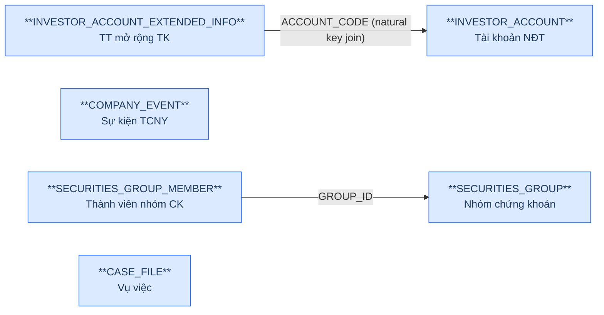
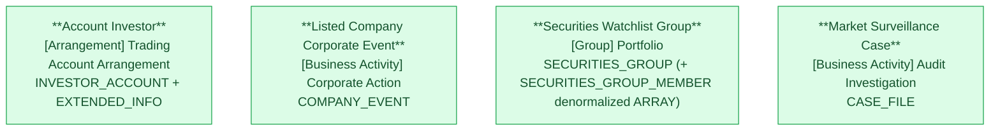

# GSGD — HLD Tier 1: Main Entities

> **Phụ thuộc:** Không phụ thuộc Tier nào — là nền tảng cho Tier 2, Tier 3.
>
> **Thiết kế theo:** [GSGD_HLD_Overview.md](GSGD_HLD_Overview.md)
>
> **Phạm vi task:** Chỉ thiết kế 15 bảng theo yêu cầu (INVESTOR_ACCOUNT, INVESTOR_ACCOUNT_EXTENDED_INFO, ACCOUNT_AUTHORIZATION, ACCOUNT_FINANCIAL_SERVICE, ACCOUNT_GROUP, ACCOUNT_GROUP_MEMBER, ACCOUNT_RELATIONSHIP, COMPANY_EVENT, SECURITIES_GROUP, SECURITIES_GROUP_MEMBER, CASE_FILE, CASE_FILE_SECURITIES_CODE, CASE_ATTACH_FILE, CASE_FILE_WORKFLOW, CASE_APPROVAL_STEP). Các bảng GSGD khác (ANALYSIS_*, SUSPICIOUS_ACCOUNT*, REPORT_TEMPLATE*, ABNORMAL_REPORT*, COMPLIANCE_REPORT*, hệ thống/cấu hình...) ngoài phạm vi task này — không đưa vào 6a/7a, để dành cho lần thiết kế sau.
>
> **Cập nhật (2026-07-23):** Reconcile lại `INVESTOR_ACCOUNT`/`INVESTOR_ACCOUNT_EXTENDED_INFO` theo DDL UAT thật (`Source/DDL UAT/TMS_UAT_schema.txt`) — bổ sung nhiều cột bị thiếu sót khảo sát (IDENTITY_NUMBER, INVESTOR_TYPE, ACCOUNT_STATUS, DOMESTIC_FOREIGN_FLAG, NATIONALITY...). `ACCOUNT_AUTHORIZATION` xác nhận **không tồn tại** trong CSDL thật — đã chuyển `out_of_scope`, loại khỏi danh sách 15 bảng. Xem 6f T1-01/T1-03/T1-06/T1-07.

---

## 6a. Bảng tổng quan BCV Concept

| BCV Core Object | BCV Concept | Category | Source Table | Source Table Change Mode | Mô tả bảng nguồn | Atomic Entity | Table Type | BCV Term |
|---|---|---|---|---|---|---|---|---|
| Arrangement | [Arrangement] Trading Account Arrangement | Trading Account Arrangement | INVESTOR_ACCOUNT | Update | Thông tin tài khoản nhà đầu tư (từ VSDC) | Account Investor | Fundamental | Trading Account Arrangement — *"Identifies an Account Arrangement storing information on a group of securities... purchased with the express intent of selling them prior to their maturity."* Cấu trúc trường (đã reconcile theo DDL UAT thật, `Source/DDL UAT/TMS_UAT_schema.txt`): mã TK, tên, địa chỉ, ngày sinh, quốc tịch, loại hình NĐT, số CCCD (IDENTITY_NUMBER — dùng làm FK sang Individual, xem 6f), trạng thái TK, trong nước/nước ngoài, cờ dịch vụ TC (ký quỹ/ứng trước/ủy quyền), người/ngày nhận ủy quyền (phẳng — không phải bảng riêng, xem 6f), trạng thái phê duyệt — khớp đúng 1 tài khoản giao dịch chứng khoán NĐT. Term giữ nguyên theo thiết kế tham khảo Atomic_LinhLV. |
| Arrangement | [Arrangement] Trading Account Arrangement | Trading Account Arrangement | INVESTOR_ACCOUNT_EXTENDED_INFO | Update | Thông tin mở rộng tài khoản nhà đầu tư (liên hệ/ngân hàng) | Account Investor | Fundamental | Cùng Atomic entity Account Investor — bảng mở rộng LEGAL_REPRESENTATIVE/PHONE_NUMBER/EMAIL/BANK_ACCOUNT_*, join 1-1 với INVESTOR_ACCOUNT qua ACCOUNT_CODE. Grain không phải Involved Party (là 1 tài khoản) → giữ denormalized, không tách IP Electronic Address (Bước 5 SKILL_HLD). DDL UAT thật cho thấy INVESTOR_ACCOUNT cũng có sẵn bản sao các cột này — dùng EXTEND_INFO làm nguồn chính (đúng mục đích thiết kế bảng), cột trùng trên INVESTOR_ACCOUNT ghi nhận là dữ liệu denormalize/data-quality cần xác nhận, không map 2 lần. Xem 6f. |
| Business Activity | [Business Activity] Corporate Action | Corporate Action | COMPANY_EVENT | Append | Sự kiện tổ chức niêm yết ảnh hưởng giá tham chiếu | Listed Company Corporate Event | Fact Append | Corporate Action — *"Identifies a Product Activity which is related to the debt and equity of business entities"* (category gốc BCV: **Business Activity**, không phải Event). Cấu trúc trường: EVENT_TYPE, EVENT (nội dung), EVENT_DATE, REFERENCE_PRICE — đúng bản chất sự kiện ảnh hưởng giá tham chiếu (chia cổ tức, tách/gộp CP...). **Sửa so với thiết kế tham khảo** (Atomic_LinhLV dùng `[Event]` — placeholder rỗng, chưa tra Term cụ thể). |
| Group | [Group] Portfolio | Portfolio | SECURITIES_GROUP | Update | Nhóm chứng khoán do Ban GSTT tự quản lý (watchlist) | Securities Watchlist Group | Fundamental | Portfolio — *"Identifies a Management Group that groups all segments relating to information reporting categories."* Khớp nhóm mã CK theo dõi giám sát (thường/theo ngành). Term giữ nguyên theo thiết kế tham khảo Atomic_LinhLV (đã approved, cấu trúc bảng không đổi). |
| Business Activity | [Business Activity] Audit Investigation | Audit Investigation | CASE_FILE | Append | Vụ việc giám sát giao dịch chứng khoán bất thường | Market Surveillance Case | Fundamental | Audit Investigation — *"Identifies a Business Activity in which the operation of an Organization Unit is examined for its integrity and adherence to company standards and policy."* Khớp đúng vụ việc giám sát. Core Object + Term giữ nguyên theo thiết kế tham khảo (đã đúng ngay từ đầu). **Cross-check Change Mode ↔ Table Type: xem 6f-4.** |

---

## 6b. Diagram Source (Mermaid)

> `COMPANY_EVENT` và `CASE_FILE` không có FK inbound/outbound tới bảng nghiệp vụ nào khác trong Tier 1.
> `ACCOUNT_AUTHORIZATION` đã loại khỏi diagram — bảng không tồn tại trong DDL UAT thực tế (xem 6f). `AUTHORIZED_PERSON_NAME`/`AUTHORIZATION_DATE` nằm sẵn trên `INVESTOR_ACCOUNT`.

---

## 6c. Diagram Atomic (Mermaid)

> 4 entity Tier 1 độc lập với nhau — không có FK chéo trong Tier này.

---

## 6d. Danh mục & Tham chiếu

| Source Table | Mô tả | Scheme Code dự kiến | Ghi chú |
|---|---|---|---|
| INVESTOR_ACCOUNT.APPROVAL_STATUS | Trạng thái phê duyệt tài khoản | `GSGD_APPROVAL_STATUS` | source_type: source_table. Dùng chung cho Account Investor, Listed Company Corporate Event (APPROVAL_STATUS), Account Investor Group (Tier 2) — cần profile giá trị thực tế từng bảng, có thể tách scheme riêng nếu value set khác nhau. |
| INVESTOR_ACCOUNT.DATA_SOURCE | Nguồn dữ liệu chính (VSDC/CTCK) | — | **Quyết định (2026-07-23):** Data Modeler chốt map 1:1 (Data Domain Text), không dùng Classification Value — bỏ scheme `GSGD_DATA_SOURCE`. |
| INVESTOR_ACCOUNT.MARGIN_SERVICE_ENABLED / ADVANCE_PAYMENT_SERVICE_ENABLED / ACCOUNT_AUTHORIZATION_ENABLED | Cờ dịch vụ tài chính đăng ký | — | **Quyết định (2026-07-23):** Data Modeler chốt map 1:1 (Data Domain Text), không dùng Classification Value — bỏ scheme `GSGD_SERVICE_ENABLED_FLAG`. |
| INVESTOR_ACCOUNT.INVESTOR_TYPE | Loại hình nhà đầu tư (1=Cá nhân, 2=Tổ chức) | `GSGD_INVESTOR_TYPE` | source_type: source_table. Xác nhận qua DDL UAT 2026-07-23 (trước đây tưởng không còn tồn tại — xem 6f-T1-01). |
| INVESTOR_ACCOUNT.ACCOUNT_STATUS | Trạng thái tài khoản (0=Đóng, 1=Mở) | `GSGD_INVESTOR_ACCOUNT_STATUS` | source_type: source_table. Đặt tên khác `GSGD_ACCOUNT_STATUS` (đã dùng cho ACCOUNT_GROUP_MEMBER.STATUS — trạng thái thành viên trong nhóm, khác ý nghĩa) để tránh trùng Scheme Code. |
| INVESTOR_ACCOUNT.DOMESTIC_FOREIGN_FLAG | Trong nước/Nước ngoài (0=Trong nước, 1=Nước ngoài) | `GSGD_DOMESTIC_FOREIGN_FLAG` | source_type: source_table. Cân nhắc Data Domain Indicator thay vì Classification Value do chỉ 2 giá trị cố định — quyết định tại LLD. |
| INVESTOR_ACCOUNT.NATIONALITY | Quốc tịch (text tự do, VARCHAR2(100 CHAR)) | — | **Quyết định (2026-07-23):** Data Modeler chốt FK sang `Geographic Area` (nguồn ECAT.COUNTRY, `Geographic Area Type Code = COUNTRY`) thay vì Classification Value — bỏ scheme `GSGD_NATIONALITY`. Cặp `Nationality Id`/`Nationality Code`, cần ETL crosswalk text→`ECAT.COUNTRY.CODE` trước khi `hash_id('ECAT.COUNTRY', CODE)` (nguồn là tên quốc gia tự do, không phải mã sẵn có). |
| COMPANY_EVENT.EVENT_TYPE | Loại sự kiện tổ chức niêm yết | `GSGD_COMPANY_EVENT_TYPE` | source_type: source_table (free text, không còn là FK id như thiết kế tham khảo). |
| COMPANY_EVENT.APPROVAL_STATUS | Trạng thái phê duyệt sự kiện | `GSGD_APPROVAL_STATUS` | Reuse scheme trên. |
| SECURITIES_GROUP.GROUP_TYPE | Loại nhóm chứng khoán (Thường/Theo ngành) | `GSGD_SECURITIES_GROUP_TYPE` | source_type: source_table. |
| SECURITIES_GROUP.STATUS | Trạng thái nhóm chứng khoán | `GSGD_GROUP_STATUS` | Cần profile giá trị thực tế (Chờ duyệt/Phê duyệt/Từ chối). |
| CASE_FILE.CASE_FILE_TYPE | Loại vụ việc | `GSGD_CASE_TYPE` | Dùng chung với Market Surveillance Case Workflow Step.WORKFLOW_TYPE (Tier 2) — cùng bộ giá trị (Sơ bộ/Thao túng/Nội gián/Liên thị trường). |
| CASE_FILE.INFORMATION_SOURCE | Nguồn thông tin vụ việc | `GSGD_INFORMATION_SOURCE` | source_type: source_table. |
| CASE_FILE.CASE_FILE_STATUS | Trạng thái vụ việc | `GSGD_CASE_STATUS` | source_type: source_table, 7 giá trị (0–6). |

---

## 6e. Bảng chờ thiết kế

Không có bảng nào trong Tier 1 chưa đủ thông tin cột.

---

## 6f. Điểm cần xác nhận

| # | Câu hỏi | Ảnh hưởng |
|---|---|---|
| T1-01 | ~~Cấu trúc `INVESTOR_ACCOUNT` hiện tại (BRD mới nhất) không còn các cột INVESTOR_TYPE, ACCOUNT_STATUS, DOMESTIC_FOREIGN_FLAG, NATIONALITY, IDENTITY_NUMBER, IDENTITY_ISSUE_DATE/PLACE từng có trong thiết kế tham khảo Atomic_LinhLV.~~ | **RESOLVED (2026-07-23):** Đối chiếu `Source/DDL UAT/TMS_UAT_schema.txt` (DDL UAT thật, schema `UAT_TMS`) xác nhận các cột này **có tồn tại** — BRD khảo sát trước đó (`Source/GSGD_Columns.csv`) bị thiếu sót, đã reconcile lại. Account Investor thiết kế đầy đủ các cột này. Phát sinh thêm: `ACCOUNT_NAME`, `OPEN_DATE`, `CLOSE_DATE`, `LAST_MODIFIED_DATE`, `VERSION` cũng thiếu trong BRD cũ — đã bổ sung. |
| T1-02 | `MARGIN_SERVICE_ENABLED` / `ADVANCE_PAYMENT_SERVICE_ENABLED` / `ACCOUNT_AUTHORIZATION_ENABLED` đổi kiểu dữ liệu nguồn từ NUMBER/Boolean (thiết kế tham khảo) sang VARCHAR2(200 CHAR). | Cần profile giá trị thực tế trước khi chốt Data Domain Boolean vs Indicator/Text ở LLD. |
| T1-03 | ~~`ACCOUNT_AUTHORIZATION` không có unique constraint rõ ràng trên ACCOUNT_ID — xác nhận 1 tài khoản có thể có nhiều bản ghi ủy quyền (lịch sử/đồng thời), không chỉ 1 ủy quyền hiện hành.~~ | **RESOLVED (2026-07-23):** Đối chiếu DDL UAT xác nhận bảng `ACCOUNT_AUTHORIZATION` **không tồn tại** trong CSDL thật — dữ liệu khảo sát cũ sai. `AUTHORIZED_PERSON_NAME`/`AUTHORIZATION_DATE` đã nằm sẵn là 2 cột phẳng trên chính `INVESTOR_ACCOUNT` (quan hệ 1-1, không phải 1-N). Loại bỏ thiết kế denormalize `Authorized Persons ARRAY<STRUCT>` — dùng 2 field phẳng trực tiếp trên Account Investor. `ACCOUNT_AUTHORIZATION` chuyển `scope_status: out_of_scope` trong `brd_GSGD.yaml`. |
| T1-04 | Cross-check Change Mode ↔ Table Type: `CASE_FILE` có Source Table Change Mode = Append nhưng Table Type = Fundamental/SCD4A (theo thiết kế tham khảo). | Theo quy tắc SKILL_HLD, cặp (Append, Fundamental) cần review: ETL có drop & reload dù BRD ghi Append, hay business rule cho phép update CASE_FILE (sửa CASE_FILE_STATUS, ASSIGNED_TO_ID...) nên thực chất phải là Update? Đề xuất xác nhận lại `data_change_mode` với team ETL trước khi LLD. |
| T1-05 | `SECURITIES_GROUP_MEMBER` (junction thuần, không có attribute nghiệp vụ ngoài SECURITIES_CODE) — giữ quyết định denormalize thành `Securities Codes ARRAY<Text>` trên Securities Watchlist Group, theo đúng ghi chú tại `brd_GSGD.yaml` ("Denormalize vào Securities Watchlist Group entity — Array<Text>") và thiết kế tham khảo Atomic_LinhLV. | Không tạo Atomic entity riêng cho SECURITIES_GROUP_MEMBER. Xem mục 7d Overview. |
| T1-06 | `INVESTOR_ACCOUNT.LEGAL_REPRESENTATIVE`/`PHONE_NUMBER`/`EMAIL`/`BANK_ACCOUNT_HOLDER_NAME`/`BANK_ACCOUNT_NUMBER`/`BANK_ACCOUNT_NAME` — DDL UAT thật cho thấy các cột này tồn tại **trùng lặp** trên cả `INVESTOR_ACCOUNT` lẫn `INVESTOR_ACCOUNT_EXTENDED_INFO` (có thể do materialize/cache 2 chiều giữa 2 bảng). | **Quyết định thiết kế:** dùng `INVESTOR_ACCOUNT_EXTENDED_INFO` làm nguồn map chính cho các attribute này (đúng mục đích thiết kế bảng theo tên gọi + có audit fields riêng). Bản sao trên `INVESTOR_ACCOUNT` không map — ghi nhận là quan sát data quality, cần BA/DBA xác nhận bảng nào là nguồn ghi (write-of-record) trước khi ETL production. |
| T1-07 | **Quyết định thiết kế mới:** `INVESTOR_ACCOUNT.IDENTITY_NUMBER` (số CCCD/định danh NĐT cá nhân) được thiết kế làm FK **liên source-system** sang Atomic entity `Individual` (BCV `[Involved Party] Individual`, nguồn `NHNCK.IDENTITY_INFO_C06S`) — theo yêu cầu Data Modeler, dùng pattern Id+Code chuẩn: `Individual Id` hash `hash_id('NHNCK.IDENTITY_INFO_C06S', IDENTITY_NUMBER)` + `Individual Code` = IDENTITY_NUMBER. | Đây là **forward reference** — entity `Individual` hiện mới có quyết định HLD (NHNCK, 2026-07-23), **chưa có LLD**, chưa vào `manifest.yaml`. Khi NHNCK thiết kế LLD cho Individual, bắt buộc chọn `IDENTITY_NUMBER` làm `Individual Code` (business key) để khớp hash pattern đã chốt tại đây. `IDENTITY_ISSUE_DATE`/`IDENTITY_ISSUE_PLACE` giữ là attribute phẳng của Account Investor (thông tin giấy tờ tại thời điểm mở TK, có thể khác thời điểm xác thực C06 trên Individual). |
| T1-08 | **Quyết định thiết kế (2026-07-23):** `INVESTOR_ACCOUNT.NATIONALITY` đổi từ Classification Value sang FK **liên source-system** sang `Geographic Area` (nguồn `ECAT.COUNTRY`, `Geographic Area Type Code = COUNTRY`) — theo yêu cầu Data Modeler. Cặp `Nationality Id` (hash `hash_id('ECAT.COUNTRY', CODE)`) + `Nationality Code`. | Nguồn `NATIONALITY` là text tự do (VARCHAR2(100 CHAR), có thể là tên quốc gia tiếng Việt), không phải mã `ECAT.COUNTRY.CODE` sẵn có — ETL cần bước crosswalk (map tên→code) trước khi hash. Cần profile dữ liệu thực tế xác nhận value set khớp danh mục ECAT trước go-live. |
| T1-09 | **Quyết định thiết kế (2026-07-23):** `MARGIN_SERVICE_ENABLED`, `ADVANCE_PAYMENT_SERVICE_ENABLED`, `ACCOUNT_AUTHORIZATION_ENABLED`, `DATA_SOURCE` đổi từ Classification Value sang map 1:1 (Data Domain Text) theo yêu cầu Data Modeler — bỏ scheme `GSGD_SERVICE_ENABLED_FLAG`/`GSGD_DATA_SOURCE`. | Giá trị lưu nguyên văn từ nguồn, không qua chuẩn hóa danh mục. Nếu sau này cần chuẩn hóa lại thành Classification Value, phải tạo lại scheme và đổi Data Domain. |
| T1-10 | **Quyết định thiết kế (2026-07-23):** Bỏ `Created Timestamp`/`Updated Timestamp` (CREATED_AT/UPDATED_AT) khỏi Account Investor theo yêu cầu Data Modeler — coi là trường kỹ thuật ở nguồn. | Không còn audit timestamp chuẩn trên entity này. Mốc thời gian thay đổi nghiệp vụ dùng `Last Modified Timestamp` (LAST_MODIFIED_DATE) đã có sẵn. |
