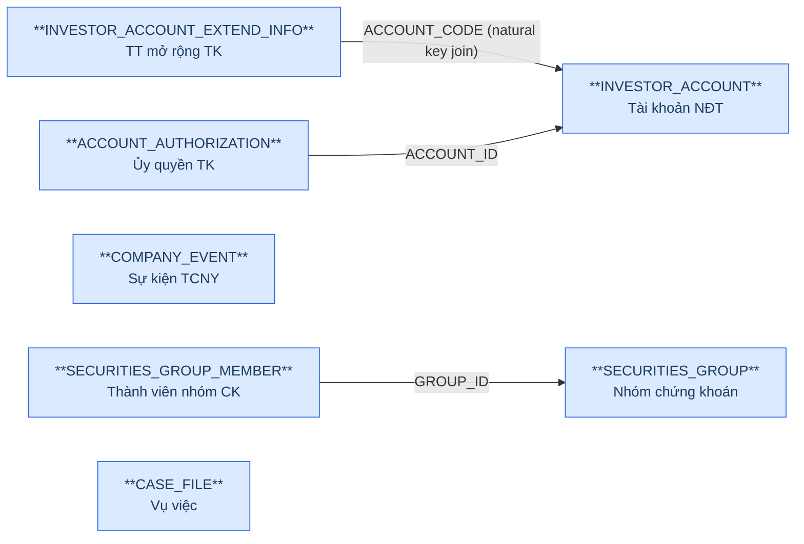
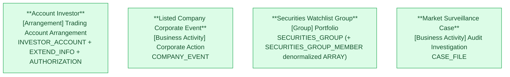

# GSGD — HLD Tier 1: Main Entities

> **Phụ thuộc:** Không phụ thuộc Tier nào — là nền tảng cho Tier 2, Tier 3.
>
> **Thiết kế theo:** [GSGD_HLD_Overview.md](GSGD_HLD_Overview.md)
>
> **Phạm vi task:** Chỉ thiết kế 15 bảng theo yêu cầu (INVESTOR_ACCOUNT, INVESTOR_ACCOUNT_EXTEND_INFO, ACCOUNT_AUTHORIZATION, ACCOUNT_FINANCIAL_SERVICE, ACCOUNT_GROUP, ACCOUNT_GROUP_MEMBER, ACCOUNT_RELATIONSHIP, COMPANY_EVENT, SECURITIES_GROUP, SECURITIES_GROUP_MEMBER, CASE_FILE, CASE_FILE_SECURITIES_CODE, CASE_ATTACH_FILE, CASE_FILE_WORKFLOW, CASE_APPROVAL_STEP). Các bảng GSGD khác (ANALYSIS_*, SUSPICIOUS_ACCOUNT*, REPORT_TEMPLATE*, ABNORMAL_REPORT*, COMPLIANCE_REPORT*, hệ thống/cấu hình...) ngoài phạm vi task này — không đưa vào 6a/7a, để dành cho lần thiết kế sau.

---

## 6a. Bảng tổng quan BCV Concept

| BCV Core Object | BCV Concept | Category | Source Table | Source Table Change Mode | Mô tả bảng nguồn | Atomic Entity | Table Type | BCV Term |
|---|---|---|---|---|---|---|---|---|
| Arrangement | [Arrangement] Trading Account Arrangement | Trading Account Arrangement | INVESTOR_ACCOUNT | Update | Thông tin tài khoản nhà đầu tư (từ VSDC) | Account Investor | Fundamental | Trading Account Arrangement — *"Identifies an Account Arrangement storing information on a group of securities... purchased with the express intent of selling them prior to their maturity."* Cấu trúc trường: mã TK (ACCOUNT_CODE), địa chỉ, ngày sinh, cờ dịch vụ TC (ký quỹ/ứng trước/ủy quyền), trạng thái phê duyệt — khớp đúng 1 tài khoản giao dịch chứng khoán NĐT. Term giữ nguyên theo thiết kế tham khảo Atomic_LinhLV. |
| Arrangement | [Arrangement] Trading Account Arrangement | Trading Account Arrangement | INVESTOR_ACCOUNT_EXTEND_INFO | Update | Thông tin mở rộng tài khoản nhà đầu tư (liên hệ/ngân hàng) | Account Investor | Fundamental | Cùng Atomic entity Account Investor — bảng mở rộng LEGAL_REPRESENTATIVE/PHONE_NUMBER/EMAIL/BANK_ACCOUNT_*, join 1-1 với INVESTOR_ACCOUNT qua ACCOUNT_CODE. Grain không phải Involved Party (là 1 tài khoản) → giữ denormalized, không tách IP Electronic Address (Bước 5 SKILL_HLD). |
| Arrangement | [Arrangement] Trading Account Arrangement | Trading Account Arrangement | ACCOUNT_AUTHORIZATION | Update | Thông tin ủy quyền giao dịch trên tài khoản | Account Investor | Fundamental | Term riêng của bảng là **[Communication] Authorization** — *"Identifies a Communication whose objective is to document the delegation of authority from one Involved Party to another"* — khớp đúng bản chất ủy quyền. Tuy nhiên theo yêu cầu thiết kế, gộp bảng này vào Account Investor: chỉ có ACCOUNT_ID + AUTHORIZED_PERSON_NAME + AUTHORIZATION_DATE (không đủ thuộc tính để làm entity Communication độc lập) → denormalize thành `Authorized Persons ARRAY<STRUCT<...>>` trên Account Investor thay vì tạo entity Communication riêng. Xem 6f-3. |
| Business Activity | [Business Activity] Corporate Action | Corporate Action | COMPANY_EVENT | Append | Sự kiện tổ chức niêm yết ảnh hưởng giá tham chiếu | Listed Company Corporate Event | Fact Append | Corporate Action — *"Identifies a Product Activity which is related to the debt and equity of business entities"* (category gốc BCV: **Business Activity**, không phải Event). Cấu trúc trường: EVENT_TYPE, EVENT (nội dung), EVENT_DATE, REFERENCE_PRICE — đúng bản chất sự kiện ảnh hưởng giá tham chiếu (chia cổ tức, tách/gộp CP...). **Sửa so với thiết kế tham khảo** (Atomic_LinhLV dùng `[Event]` — placeholder rỗng, chưa tra Term cụ thể). |
| Group | [Group] Portfolio | Portfolio | SECURITIES_GROUP | Update | Nhóm chứng khoán do Ban GSTT tự quản lý (watchlist) | Securities Watchlist Group | Fundamental | Portfolio — *"Identifies a Management Group that groups all segments relating to information reporting categories."* Khớp nhóm mã CK theo dõi giám sát (thường/theo ngành). Term giữ nguyên theo thiết kế tham khảo Atomic_LinhLV (đã approved, cấu trúc bảng không đổi). |
| Business Activity | [Business Activity] Audit Investigation | Audit Investigation | CASE_FILE | Append | Vụ việc giám sát giao dịch chứng khoán bất thường | Market Surveillance Case | Fundamental | Audit Investigation — *"Identifies a Business Activity in which the operation of an Organization Unit is examined for its integrity and adherence to company standards and policy."* Khớp đúng vụ việc giám sát. Core Object + Term giữ nguyên theo thiết kế tham khảo (đã đúng ngay từ đầu). **Cross-check Change Mode ↔ Table Type: xem 6f-4.** |

---

## 6b. Diagram Source (Mermaid)

> `COMPANY_EVENT` và `CASE_FILE` không có FK inbound/outbound tới bảng nghiệp vụ nào khác trong Tier 1.

---

## 6c. Diagram Atomic (Mermaid)

> 4 entity Tier 1 độc lập với nhau — không có FK chéo trong Tier này.

---

## 6d. Danh mục & Tham chiếu

| Source Table | Mô tả | Scheme Code dự kiến | Ghi chú |
|---|---|---|---|
| INVESTOR_ACCOUNT.APPROVAL_STATUS | Trạng thái phê duyệt tài khoản | `GSGD_APPROVAL_STATUS` | source_type: source_table. Dùng chung cho Account Investor, Listed Company Corporate Event (APPROVAL_STATUS), Account Investor Group (Tier 2) — cần profile giá trị thực tế từng bảng, có thể tách scheme riêng nếu value set khác nhau. |
| INVESTOR_ACCOUNT.DATA_SOURCE | Nguồn dữ liệu chính (VSDC/CTCK) | `GSGD_DATA_SOURCE` | source_type: source_table. |
| INVESTOR_ACCOUNT.MARGIN_SERVICE_ENABLED / ADVANCE_PAYMENT_SERVICE_ENABLED / ACCOUNT_AUTHORIZATION_ENABLED | Cờ dịch vụ tài chính đăng ký | `GSGD_SERVICE_ENABLED_FLAG` | Data type nguồn hiện là VARCHAR2(200 CHAR) — chưa rõ giá trị Y/N hay text mô tả. Cần profile trước khi chốt Data Domain Boolean vs Indicator (xem 6f-2). |
| COMPANY_EVENT.EVENT_TYPE | Loại sự kiện tổ chức niêm yết | `GSGD_COMPANY_EVENT_TYPE` | source_type: source_table (free text, không còn là FK id như thiết kế tham khảo). |
| COMPANY_EVENT.APPROVAL_STATUS | Trạng thái phê duyệt sự kiện | `GSGD_APPROVAL_STATUS` | Reuse scheme trên. |
| SECURITIES_GROUP.GROUP_TYPE | Loại nhóm chứng khoán (Thường/Theo ngành) | `GSGD_SECURITIES_GROUP_TYPE` | source_type: source_table. |
| SECURITIES_GROUP.STATUS | Trạng thái nhóm chứng khoán | `GSGD_GROUP_STATUS` | Cần profile giá trị thực tế (Chờ duyệt/Phê duyệt/Từ chối). |
| CASE_FILE.CASE_FILE_TYPE | Loại vụ việc | `GSGD_CASE_TYPE` | Dùng chung với Market Surveillance Case Workflow Step.WORKFLOW_TYPE (Tier 2) — cùng bộ giá trị (Sơ bộ/Thao túng/Nội gián/Liên thị trường). |
| CASE_FILE.INFORMATION_SOURCE | Nguồn thông tin vụ việc | `GSGD_INFORMATION_SOURCE` | source_type: source_table. |
| CASE_FILE.CASE_FILE_STATUS | Trạng thái vụ việc | `GSGD_CASE_STATUS` | source_type: source_table, 7 giá trị (0–6). |

---

## 6e. Bảng chờ thiết kế

Không có bảng nào trong Tier 1 chưa đủ thông tin cột.

---

## 6f. Điểm cần xác nhận

| # | Câu hỏi | Ảnh hưởng |
|---|---|---|
| T1-01 | Cấu trúc `INVESTOR_ACCOUNT` hiện tại (BRD mới nhất) không còn các cột INVESTOR_TYPE, ACCOUNT_STATUS, DOMESTIC_FOREIGN_FLAG, NATIONALITY, IDENTITY_NUMBER, IDENTITY_ISSUE_DATE/PLACE từng có trong thiết kế tham khảo Atomic_LinhLV. | **Quyết định thiết kế:** Account Investor thiết kế lại đúng theo cấu trúc BRD hiện tại — không giữ thuộc tính đã bị loại khỏi nguồn. Cần BA xác nhận đây là thay đổi schema thật (không phải thiếu sót khảo sát). |
| T1-02 | `MARGIN_SERVICE_ENABLED` / `ADVANCE_PAYMENT_SERVICE_ENABLED` / `ACCOUNT_AUTHORIZATION_ENABLED` đổi kiểu dữ liệu nguồn từ NUMBER/Boolean (thiết kế tham khảo) sang VARCHAR2(200 CHAR). | Cần profile giá trị thực tế trước khi chốt Data Domain Boolean vs Indicator/Text ở LLD. |
| T1-03 | `ACCOUNT_AUTHORIZATION` không có unique constraint rõ ràng trên ACCOUNT_ID — xác nhận 1 tài khoản có thể có nhiều bản ghi ủy quyền (lịch sử/đồng thời), không chỉ 1 ủy quyền hiện hành. | Nếu đúng 1-N: giữ thiết kế denormalize `Authorized Persons ARRAY<STRUCT>` trên Account Investor. Nếu chỉ 1-1: có thể rút gọn thành 2 field phẳng thay vì ARRAY. |
| T1-04 | Cross-check Change Mode ↔ Table Type: `CASE_FILE` có Source Table Change Mode = Append nhưng Table Type = Fundamental/SCD4A (theo thiết kế tham khảo). | Theo quy tắc SKILL_HLD, cặp (Append, Fundamental) cần review: ETL có drop & reload dù BRD ghi Append, hay business rule cho phép update CASE_FILE (sửa CASE_FILE_STATUS, ASSIGNED_TO_ID...) nên thực chất phải là Update? Đề xuất xác nhận lại `data_change_mode` với team ETL trước khi LLD. |
| T1-05 | `SECURITIES_GROUP_MEMBER` (junction thuần, không có attribute nghiệp vụ ngoài SECURITIES_CODE) — giữ quyết định denormalize thành `Securities Codes ARRAY<Text>` trên Securities Watchlist Group, theo đúng ghi chú tại `brd_GSGD.yaml` ("Denormalize vào Securities Watchlist Group entity — Array<Text>") và thiết kế tham khảo Atomic_LinhLV. | Không tạo Atomic entity riêng cho SECURITIES_GROUP_MEMBER. Xem mục 7d Overview. |
