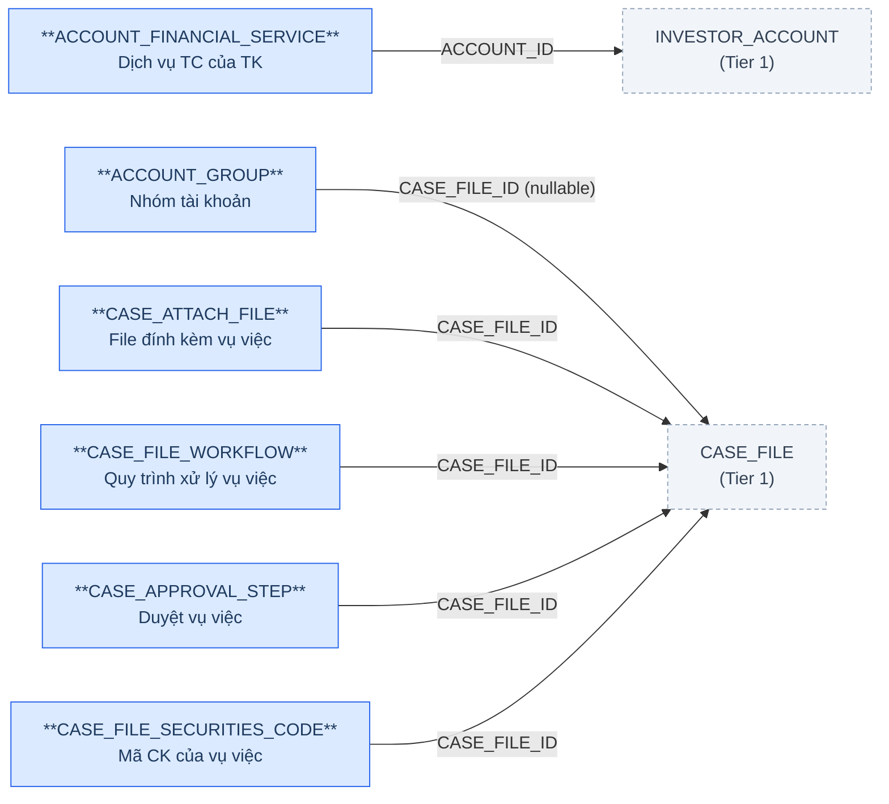
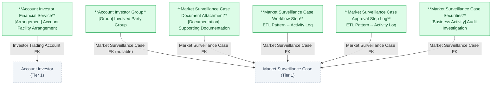

# GSGD — HLD Tier 2: FK to Tier 1

> **Phụ thuộc:** FK đến Account Investor, Market Surveillance Case (Tier 1).
>
> **Thiết kế theo:** [GSGD_HLD_Overview.md](GSGD_HLD_Overview.md)

---

## 6a. Bảng tổng quan BCV Concept

| BCV Core Object | BCV Concept | Category | Source Table | Source Table Change Mode | Mô tả bảng nguồn | Atomic Entity | Table Type | BCV Term |
|---|---|---|---|---|---|---|---|---|
| Arrangement | [Arrangement] Account Facility Arrangement | Account Facility Arrangement | ACCOUNT_FINANCIAL_SERVICE | Update | Dịch vụ tài chính đăng ký trên tài khoản (ký quỹ/ứng trước/HĐ khác) | Account Investor Financial Service | Fundamental | Account Facility Arrangement — *"Identifies a Product Arrangement that applies to a separate Account Arrangement... an additional aspect to the Account Arrangement which... may apply to many instances of an Account Arrangement."* Khớp đúng dịch vụ tài chính đăng ký thêm trên Account Investor (FK ACCOUNT_ID, SERVICE_TYPE, CONTRACT_NUMBER/DATE). **Sửa so với thiết kế tham khảo** (Atomic_LinhLV dùng `[Arrangement] Financial Market` — Term "Financial Market" thực tế thuộc category BCV **Group**, mô tả nhóm quốc gia/địa điểm, không liên quan dịch vụ tài chính tài khoản → sai khớp). |
| Group | [Group] Involved Party Group | Involved Party Group | ACCOUNT_GROUP | Update | Nhóm tài khoản do nghiệp vụ giám sát xác định | Account Investor Group | Fundamental | Involved Party Group — *"Identifies a Group that groups Involved Parties in whom the Financial Institution is interested."* Khớp nhóm tài khoản NĐT gom theo tiêu chí quan hệ (Danh tính/IP/MAC/Tiền). **Sửa so với thiết kế tham khảo** (Atomic_LinhLV ghi `[Involved Party] Group` — đảo ngược category/term; Term BCV thật tên "Involved Party Group" thuộc category **Group**, không phải category Involved Party). Cấu trúc hiện có thêm SECURITIES_CODE_ID/STOCK_CODE/CASE_FILE_ID/RELATION_TYPE_ID/CHARACTERISTIC/CONTACT_PERSON_ACCOUNT/APPROVAL_STATUS so với thiết kế tham khảo — xem 6f-1. |
| Documentation | [Documentation] Supporting Documentation | Supporting Documentation | CASE_ATTACH_FILE | Append | File đính kèm vụ việc (hồ sơ của Sở / DS TK nghi vấn) | Market Surveillance Case Document Attachment | Fundamental | Supporting Documentation — *"Identifies Documentation which provides substance for or backs up the subject Documentation."* Có FILE_GROUP phân loại nghiệp vụ (1=Hồ sơ của Sở, 2=DS TK nghi vấn) — không phải file attachment thuần túy (khác pattern "File Attachment ngoài scope" vì có business classification riêng) → giữ là Atomic entity. Term giữ nguyên theo thiết kế tham khảo. **Cross-check Change Mode ↔ Table Type: xem 6f-2.** |
| Business Activity | ETL Pattern -- Activity Log | Activity Log | CASE_FILE_WORKFLOW | Append | Từng bước quy trình xử lý vụ việc | Market Surveillance Case Workflow Step | Fact Append | Quy ước dự án cho log bước quy trình (không phải BCV term thật). STEP_ORDER + STEP_NAME + STATUS gắn theo vụ việc, mỗi dòng = 1 bước — append-only, khớp Fact Append. FK ANALYSIS_WORKFLOW_ID/REPORT_TEMPLATE_ID trỏ bảng ngoài phạm vi thiết kế — xem 6f-3. |
| Business Activity | ETL Pattern -- Activity Log | Activity Log | CASE_APPROVAL_STEP | Append | Nhật ký duyệt từng bước xử lý vụ việc | Market Surveillance Case Approval Step Log | Fact Append | Quy ước dự án cho log duyệt (không phải BCV term thật). Mỗi dòng = 1 hành động duyệt/từ chối — append-only. Term giữ nguyên theo thiết kế tham khảo. |
| Business Activity | [Business Activity] Audit Investigation | Audit Investigation | CASE_FILE_SECURITIES_CODE | Update | Mã chứng khoán liên quan tới vụ việc (N-N) | Market Surveillance Case Securities | Relative | Cấu trúc chỉ có CASE_FILE_ID + SECURITIES_CODE_ID + SECURITIES_CODE (không attribute nghiệp vụ riêng) → về bản chất là thuộc tính multi-value của Market Surveillance Case, tái dùng Term entity cha `[Business Activity] Audit Investigation` thay vì tra Term riêng. **Không denormalize thành ARRAY** (khác SECURITIES_GROUP_MEMBER ở Tier 1) — giữ Atomic entity riêng theo đúng ghi chú `brd_GSGD.yaml` ("Atomic entity: Market Surveillance Case Securities — N-N"), phục vụ truy vấn 2 chiều theo vụ việc và theo mã CK. Xem 6f-4, 6f-5. |

---

## 6b. Diagram Source (Mermaid)

---

## 6c. Diagram Atomic (Mermaid)

---

## 6d. Danh mục & Tham chiếu

| Source Table | Mô tả | Scheme Code dự kiến | Ghi chú |
|---|---|---|---|
| ACCOUNT_FINANCIAL_SERVICE.SERVICE_TYPE | Loại dịch vụ (Ký quỹ/Ứng trước/HĐ khác) | `GSGD_FINANCIAL_SERVICE_TYPE` | source_type: source_table. |
| ACCOUNT_GROUP.GROUP_TYPE | Loại nhóm tài khoản (Thường/Nghi vấn) | `GSGD_ACCOUNT_GROUP_TYPE` | source_type: source_table. |
| ACCOUNT_GROUP.APPROVAL_STATUS | Trạng thái phê duyệt nhóm | `GSGD_APPROVAL_STATUS` | Reuse scheme Tier 1. |
| ACCOUNT_GROUP.RELATION_TYPE_ID | Loại quan hệ nhóm (Danh tính/IP/MAC/Tiền) | `GSGD_ACCOUNT_RELATION_TYPE` | FK suy luận → CATEGORY_ITEM (ngoài phạm vi task). Reuse cho Account Investor Relationship (Tier 3). |
| CASE_ATTACH_FILE.FILE_TYPE | Loại file (CSV/XLSX/PDF) | `GSGD_FILE_TYPE` | source_type: source_table. |
| CASE_ATTACH_FILE.FILE_GROUP | Nhóm file (Hồ sơ Sở/DS TK nghi vấn) | `GSGD_FILE_GROUP` | source_type: source_table. |
| CASE_FILE_WORKFLOW.WORKFLOW_TYPE | Loại quy trình | `GSGD_CASE_TYPE` | Reuse scheme Tier 1 (CASE_FILE.CASE_FILE_TYPE) — cùng bộ giá trị. |
| CASE_FILE_WORKFLOW.STATUS | Trạng thái bước quy trình | `GSGD_APPROVAL_STEP_STATUS` | Reuse — nhưng value set khác CASE_APPROVAL_STEP.STATUS (3 giá trị 0-2 so với 4 giá trị 0-3). Cần profile riêng, có thể phải tách scheme khi LLD. |
| CASE_APPROVAL_STEP.STEP_CODE / NEXT_STEP_CODE | Mã bước duyệt (1-4) | `GSGD_APPROVAL_STEP_CODE` | source_type: source_table. |
| CASE_APPROVAL_STEP.STATUS | Trạng thái bước duyệt | `GSGD_APPROVAL_STEP_STATUS` | source_type: source_table. |

---

## 6e. Bảng chờ thiết kế

Không có bảng nào trong Tier 2 chưa đủ thông tin cột.

---

## 6f. Điểm cần xác nhận

| # | Câu hỏi | Ảnh hưởng |
|---|---|---|
| T2-01 | `ACCOUNT_GROUP` hiện có thêm SECURITIES_CODE_ID/STOCK_CODE/CASE_FILE_ID/RELATION_TYPE_ID/CHARACTERISTIC/CONTACT_PERSON_ACCOUNT/APPROVAL_STATUS so với thiết kế tham khảo Atomic_LinhLV (chỉ có group_code/name/type). Ý nghĩa nghiệp vụ của SECURITIES_CODE_ID/STOCK_CODE trên 1 *nhóm tài khoản* là gì (nhóm gắn với 1 mã CK cụ thể đang bị giám sát)? | Thiết kế tạm: denormalize SECURITIES_CODE_ID/STOCK_CODE thành 2 field Text (pending dependency — bảng securities_code ngoài phạm vi task), tương tự cách xử lý trên Market Surveillance Case. Cần BA xác nhận ý nghĩa để LLD map đúng. |
| T2-02 | Cross-check Change Mode ↔ Table Type: `CASE_ATTACH_FILE` có Source Table Change Mode = Append nhưng Table Type = Fundamental/SCD4A (theo thiết kế tham khảo). | Cần xác nhận: file đính kèm có bị sửa/xóa (có cột DELETED) hay chỉ thêm mới thuần túy. Nếu chỉ thêm mới → nên đổi Table Type thành Fact Append ở LLD. |
| T2-03 | `CASE_FILE_WORKFLOW.ANALYSIS_WORKFLOW_ID` và `REPORT_TEMPLATE_ID` trỏ đến `ANALYSIS_WORKFLOW` và `REPORT_TEMPLATE` — cả 2 đều `scope_status: out_of_scope` trong `brd_GSGD.yaml`. | Giữ 2 cột này ở dạng denormalized Text (ID thô, pending dependency), không tạo FK entity. Đánh giá lại khi 2 bảng này được đưa vào scope thiết kế. |
| T2-04 | `CASE_FILE_SECURITIES_CODE`: `brd_GSGD.yaml` ghi chú "Atomic entity: Market Surveillance Case Securities — N-N", trong khi `SECURITIES_GROUP_MEMBER` (cấu trúc tương tự: FK cha + mã CK, không attribute khác) lại được đánh dấu "Denormalize... Array<Text>" (Tier 1). | Quyết định tại HLD này: giữ đúng theo ghi chú BRD — tạo Atomic entity riêng cho `CASE_FILE_SECURITIES_CODE`, khác xử lý với `SECURITIES_GROUP_MEMBER`. Cần BA xác nhận đây là chủ đích (N-N cần truy vấn 2 chiều: theo vụ việc và theo mã CK phục vụ điều tra chéo) chứ không phải thiếu nhất quán khi viết BRD note. |
| T2-05 | `CASE_FILE.SECURITIES_CODE_ID`/`SECURITIES_CODE` (đơn, trên header vụ việc) và Market Surveillance Case Securities (N-N, junction riêng) có khả năng trùng lặp ý nghĩa nghiệp vụ. | Cần xác nhận với BA: SECURITIES_CODE trên CASE_FILE là "mã CK chính/đầu tiên" hay dữ liệu legacy trước khi có bảng N-N CASE_FILE_SECURITIES_CODE. |
