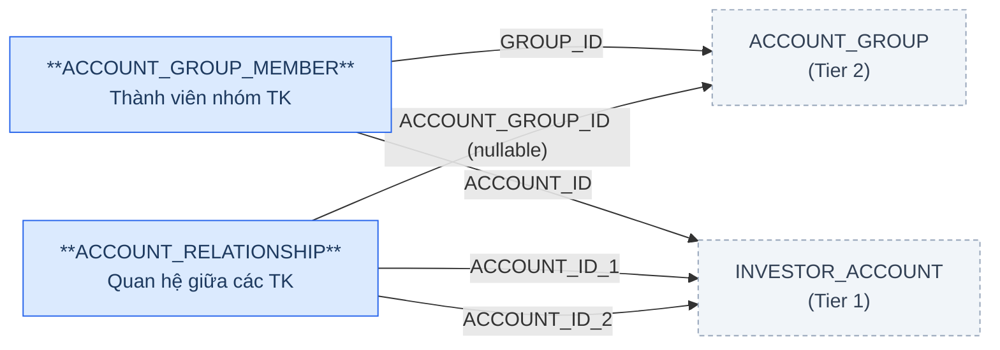
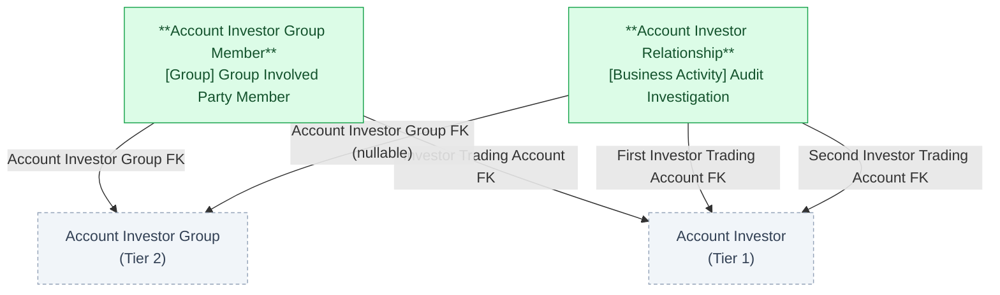

# GSGD — HLD Tier 3: FK to Tier 2

> **Phụ thuộc:** FK đến Account Investor Group (Tier 2) + Account Investor (Tier 1).
>
> **Thiết kế theo:** [GSGD_HLD_Overview.md](GSGD_HLD_Overview.md)

---

## 6a. Bảng tổng quan BCV Concept

| BCV Core Object | BCV Concept | Category | Source Table | Source Table Change Mode | Mô tả bảng nguồn | Atomic Entity | Table Type | BCV Term |
|---|---|---|---|---|---|---|---|---|
| Group | [Group] Group Involved Party Member | Group Involved Party Member | ACCOUNT_GROUP_MEMBER | Update | Quan hệ thành viên giữa tài khoản NĐT và nhóm giám sát | Account Investor Group Member | Fundamental | Group Involved Party Member — *"Identifies a relationship where an Involved Party belongs to a Group."* Khớp đúng quan hệ thành viên giữa Account Investor và Account Investor Group. **Sửa so với thiết kế tham khảo** (Atomic_LinhLV ghi `[Involved Party] Involved Party Group Membership` — tên Term không khớp BCV thật; Term thật thuộc category **Group**, tên "Group Involved Party Member"). |
| Business Activity | [Business Activity] Audit Investigation | Audit Investigation | ACCOUNT_RELATIONSHIP | Update | Mối quan hệ giữa 2 tài khoản NĐT trong giám sát (IP/MAC/tiền) | Account Investor Relationship | Relative | Audit Investigation — Term giữ nguyên theo thiết kế tham khảo (khớp bản chất theo dõi quan hệ nghi vấn giữa 2 tài khoản phục vụ giám sát, cùng Term với Market Surveillance Case). **Sửa BCV Core Object** từ `Arrangement` (thiết kế tham khảo ghi sai — không khớp category thật của Term "Audit Investigation" là **Business Activity**) sang **Business Activity**, nhất quán với Market Surveillance Case. **Đổi tên entity** từ "Investor Account Relationship" (thiết kế tham khảo) sang **Account Investor Relationship** để cùng Domain Prefix "Account Investor" với Account Investor / Account Investor Group / Account Investor Group Member / Account Investor Financial Service (Quy tắc 7 SKILL_HLD — prefix nhất quán trong nhóm nghiệp vụ). |

---

## 6b. Diagram Source (Mermaid)

> `ACCOUNT_RELATIONSHIP.CATEGORY_ITEM_ID` → Classification Value (không phải FK entity). `ACCOUNT_RELATIONSHIP.TRANSACTION_REVIEW_ID` → bảng ngoài phạm vi task (xem 6f-2).

---

## 6c. Diagram Atomic (Mermaid)

---

## 6d. Danh mục & Tham chiếu

| Source Table | Mô tả | Scheme Code dự kiến | Ghi chú |
|---|---|---|---|
| ACCOUNT_GROUP_MEMBER.STATUS | Trạng thái tài khoản trong nhóm | `GSGD_ACCOUNT_STATUS` | source_type: source_table. Lưu ý: scheme trùng tên với thiết kế tham khảo dùng cho INVESTOR_ACCOUNT.ACCOUNT_STATUS trước đây — nhưng cột đó không còn tồn tại trên INVESTOR_ACCOUNT hiện tại (xem T1-01), nên scheme này giờ chỉ áp dụng cho ACCOUNT_GROUP_MEMBER.STATUS. Cần profile lại giá trị thực tế, không giả định 0=Đóng/1=Mở như thiết kế cũ. |
| ACCOUNT_RELATIONSHIP.CATEGORY_ITEM_ID | Loại quan hệ (Danh tính/IP/MAC/Tiền) | `GSGD_ACCOUNT_RELATION_TYPE` | Reuse scheme Tier 2 (ACCOUNT_GROUP.RELATION_TYPE_ID) — cùng bộ giá trị phân loại quan hệ. FK suy luận → CATEGORY_ITEM (ngoài phạm vi task). |

---

## 6e. Bảng chờ thiết kế

Không có bảng nào trong Tier 3 chưa đủ thông tin cột.

---

## 6f. Điểm cần xác nhận

| # | Câu hỏi | Ảnh hưởng |
|---|---|---|
| T3-01 | `ACCOUNT_GROUP_MEMBER.STATUS` — giá trị thực tế là gì? Thiết kế tham khảo giả định dùng chung scheme với account_status cũ (0=Đóng/1=Mở) nhưng cột đó nay đã bị loại khỏi INVESTOR_ACCOUNT (T1-01), nên không còn cơ sở đối chiếu. | Đăng ký `GSGD_ACCOUNT_STATUS` với `values: []`, cần profile dữ liệu thực tế khi LLD trước khi gán label. |
| T3-02 | `ACCOUNT_RELATIONSHIP.TRANSACTION_REVIEW_ID` trỏ đến bảng `TRANSACTION_REVIEW` — không nằm trong 15 bảng phạm vi task này và chưa xác nhận scope_status trong `brd_GSGD.yaml`. | Denormalize thành field Text (ID thô, pending dependency) trên Account Investor Relationship, không tạo FK entity. Đánh giá lại khi TRANSACTION_REVIEW được đưa vào phạm vi thiết kế. |
| T3-03 | Table Type `Fundamental` (SCD4A) cho các entity FK trực tiếp 1 cha rõ ràng — Account Investor Financial Service (Tier 2), Account Investor Group Member (Tier 3) — theo cây quyết định SKILL_HLD, entity chỉ có FK đến 1 Fundamental và không có lifecycle riêng thường nên là `Relative` (SCD2) thay vì `Fundamental`. | Giữ nguyên `Fundamental`/SCD4A theo thiết kế tham khảo Atomic_LinhLV (đã approved) vì mỗi entity có surrogate key + business code riêng, được xem là đối tượng nghiệp vụ độc lập (không chỉ là bản ghi lịch sử của cha). Đề xuất BA/Data Modeler xác nhận lại lựa chọn này khi LLD nếu muốn thống nhất theo cây quyết định chuẩn. |
