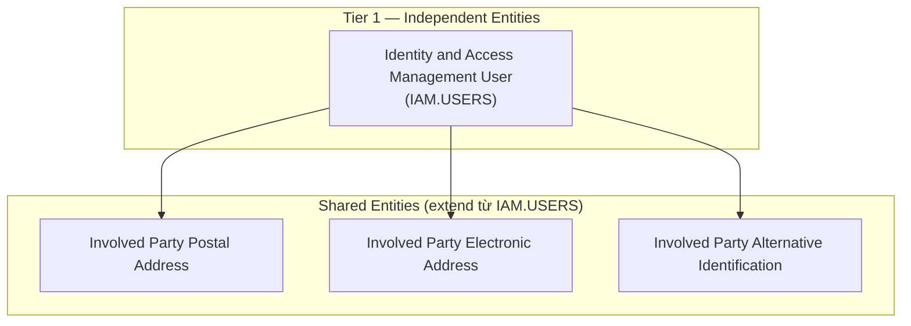
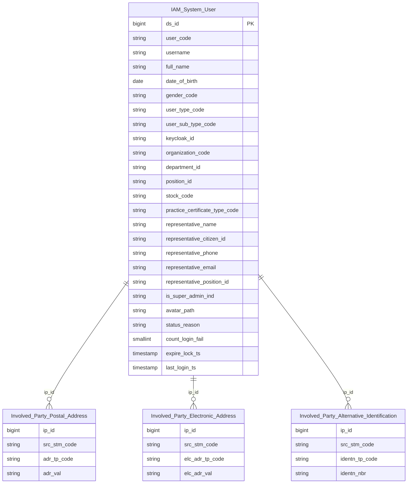

# IAM HLD — Overview

**Source system:** IAM (Identity and Access Management — Quản lý danh tính và phân quyền người dùng hệ thống UBCK)
**Mô tả:** Hệ thống IAM quản lý tài khoản người dùng đăng nhập vào hệ thống nghiệp vụ UBCK, tích hợp Keycloak. Người dùng bao gồm cán bộ UBCK, cán bộ CTCK/quỹ, và chuyên gia bên ngoài. Hệ thống lưu thông tin cá nhân, tổ chức, liên lạc, chứng chỉ hành nghề, và người đại diện pháp lý.

---

## Tổng quan Atomic Entities

| Tier | Atomic Entity | BCV Core Object | BCV Concept | Table Type | Source Table(s) | Ghi chú |
|---|---|---|---|---|---|---|
| T1 | Identity and Access Management User | Involved Party | [Involved Party] Individual | Fundamental | IAM.USERS | Entity chính — người dùng hệ thống |
| T1 | Involved Party Postal Address | Involved Party | Shared Entity | Fundamental | IAM.USERS | Shared entity — extend source_table |
| T1 | Involved Party Electronic Address | Involved Party | Shared Entity | Fundamental | IAM.USERS | Shared entity — extend source_table |
| T1 | Involved Party Alternative Identification | Involved Party | Shared Entity | Fundamental | IAM.USERS | Shared entity — extend source_table |

**Tổng: 1 Atomic entity mới** (1 Tier 1)
*(Trong đó: 3 shared entities extend source_table IAM.USERS — không tạo mới, bổ sung source vào entity đã có)*

---

## Diagram Phân tầng Dependencies (Mermaid)

---

## Quyết định thiết kế chính

| # | Quyết định | Lý do |
|---|---|---|
| D-01 | Loại trừ 9 trường hệ thống: STATUS, DELETED, CREATED_AT, UPDATED_AT, CREATED_BY_ID, CREATED_BY_NAME, UPDATED_BY_ID, UPDATED_BY_NAME, VERSION | Theo yêu cầu người thiết kế — đây là operational/audit fields của ứng dụng, không có giá trị nghiệp vụ Atomic |
| D-02 | Tách 3 shared entities từ IAM.USERS | Grain USERS = 1 người dùng → bắt buộc tách theo quy tắc shared entity; EMAIL/PHONE/ADDRESS/CITIZEN_ID đủ điều kiện |
| D-03 | `REPRESENTATIVE_*` giữ denormalized trên Identity and Access Management User | Chưa xác nhận được người đại diện có phải Involved Party độc lập trong hệ thống không — xem T1-03 |
| D-04 | BCV Term = `[Involved Party] Individual` (không phải Employee) | Người dùng IAM là cán bộ/chuyên gia đăng nhập hệ thống UBCK — không nhất thiết là nhân viên của UBCK (có thể là cán bộ CTCK). BCV Employee đặc trưng cho người lao động của chính tổ chức tài chính. |

---

#### 7a. Bảng tổng quan Atomic entities

| Tier | BCV Core Object | BCV Concept | Category | Source Table | Source Table Change Mode | Mô tả bảng nguồn | Atomic Entity | Table Type | BCV Term |
|---|---|---|---|---|---|---|---|---|---|
| T1 | Involved Party | [Involved Party] Individual | Personal Information | USERS | Update | Người dùng hệ thống IAM — cán bộ UBCK, cán bộ CTCK, chuyên gia | Identity and Access Management User | Fundamental | (1) Individual (BCV 10902): thể nhân là Involved Party. (2) Cấu trúc USERS: FULL_NAME, DATE_OF_BIRTH, GENDER, CITIZEN_ID, tổ chức — đây là thể nhân có danh tính đầy đủ. (3) Chọn Individual vì người dùng IAM là cá nhân thực tế, không phải Organization. |

#### 7b. Diagram Atomic tổng (Mermaid)

#### 7c. Bảng Classification Value

| Source Table | Mô tả | BCV Term | Xử lý Atomic |
|---|---|---|---|
| USERS.GENDER | Giới tính người dùng (1/2/3) | [Common] Gender | Classification Value scheme `IAM_GENDER` — ETL map NUMBER → MALE/FEMALE/OTHER |
| USERS.USER_TYPE | Loại người dùng (NUMBER) | [Common] Involved Party Type | Classification Value scheme `IAM_USER_TYPE` — cần profile values từ team IAM |
| USERS.USER_SUB_TYPE | Phân loại người dùng (VARCHAR) | [Common] Involved Party Sub Type | Classification Value scheme `IAM_USER_SUB_TYPE` — lấy distinct values từ nguồn |
| USERS.PRACTICE_CERTIFICATE_TYPE_ID | Loại chứng chỉ hành nghề | [Common] Certificate Type | Classification Value scheme `IAM_PRACTICE_CERT_TYPE` — cần xác nhận bảng ref |

#### 7d. Junction Tables

*(Không có junction table trong IAM)*

#### 7e. Điểm cần xác nhận

| # | Tier | Câu hỏi | Ảnh hưởng |
|---|---|---|---|
| 1 | T1 | `DEPARTMENT_ID` và `POSTION_ID` (có typo "POSTION") — FK đến bảng nào? Nếu có bảng DEPARTMENTS/POSITIONS riêng trong IAM → cần bổ sung source và tạo Tier 2. | Phát sinh Tier 2 nếu có bảng phụ thuộc |
| 2 | T1 | `PRACTICE_CERTIFICATE_TYPE_ID` — trỏ về source nào? Nếu là bảng từ NHNCK (chứng chỉ hành nghề) → cần cross-source FK mapping trong LLD. | Ảnh hưởng FK cross-source trong LLD |
| 3 | T1 | `REPRESENTATIVE_*` — người đại diện pháp lý khi USER_TYPE là tổ chức, hay là người giám sát nội bộ? Nếu là Involved Party thực sự → cần tách entity Tier 2 `Identity and Access Management User Representative`. | Phát sinh entity Tier 2 mới |
| 4 | T1 | `ORGANIZATION_CODE` — có FK đến bảng tổ chức nào (SCMS, NHNCK) không, hay chỉ là text denormalized? | Ảnh hưởng FK cross-source, không phát sinh entity IAM mới |
| 5 | T1 | `KEY_CLOAK_ID` — có cần lưu trên Atomic không, hay chỉ là technical key của ứng dụng IAM? | Ảnh hưởng attribute LLD — có thể loại nếu chỉ là app key |

#### 7f. Bảng ngoài scope

*(Không có bảng ngoài scope — IAM chỉ có 1 bảng USERS, toàn bộ đã được thiết kế)*

<!--
GRAIN: 1 dòng = 1 bảng nguồn. KHÔNG gộp `table1, table2`.
GROUP: dùng từ danh sách chuẩn (xem reference/group_classification.md).
-->

---

## Entities

> Single source of truth cho metadata entity. `aggregate_atomic.py` parse section này để sinh `atomic_entities.yaml`.
> Format bắt buộc: heading `### N.` + dòng `**Description:**` trong 500 ký tự đầu tiên sau heading.

### 1. Identity and Access Management User
**Tier:** 1 | **Source:** `IAM.USERS` | **BCV Concept:** [Involved Party] Individual | **BCO:** Involved Party | **Table Type:** Fundamental
**Description:** Người dùng hệ thống IAM — thể nhân (cán bộ UBCK, cán bộ CTCK, chuyên gia) có tài khoản đăng nhập hệ thống nghiệp vụ, tích hợp Keycloak. Lưu thông tin danh tính, tổ chức, chứng chỉ hành nghề và người đại diện.

**Grain:** 1 dòng = 1 người dùng hệ thống (1 tài khoản IAM).

**Attributes chính:** user_code (CODE), username, full_name, date_of_birth, gender_code (ETL-derived từ GENDER), user_type_code (ETL-derived từ USER_TYPE), user_sub_type_code, keycloak_id (KEY_CLOAK_ID), organization_code, department_id, position_id (POSTION_ID), stock_code, practice_certificate_type_code, representative_name, representative_citizen_id, is_super_admin_ind (IS_SUPER_ADMIN), status_reason, count_login_fail, expire_lock_ts, last_login_ts.
