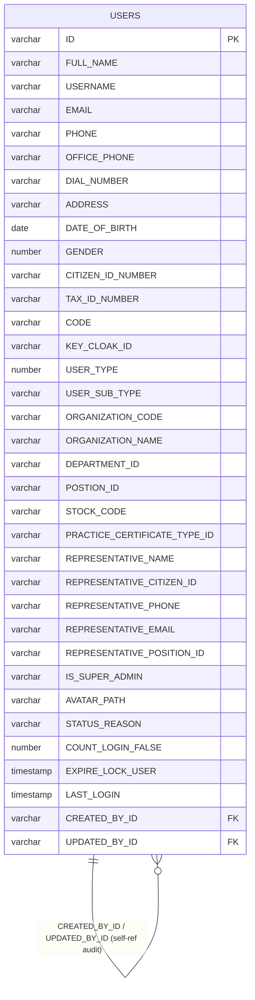
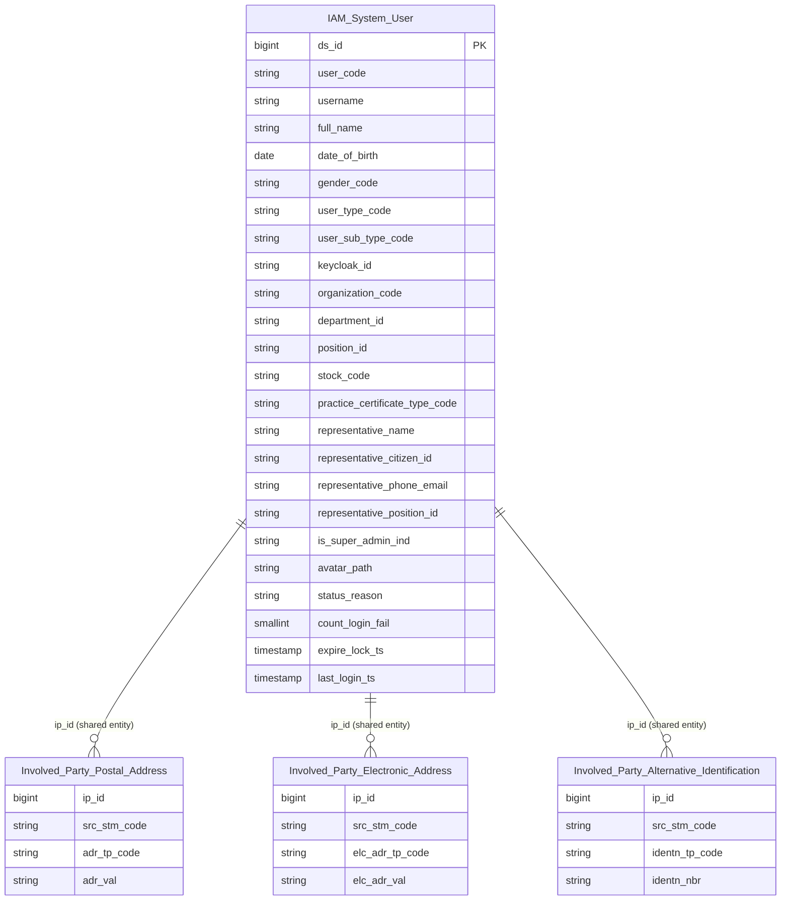

# IAM HLD — Tier 1

**Source system:** IAM (Identity and Access Management — Quản lý danh tính và phân quyền người dùng hệ thống UBCK)
**Tier 1:** Main entities không FK đến bảng nghiệp vụ khác. IAM chỉ có 1 bảng nguồn duy nhất: `USERS`.

---

## 6a. Bảng tổng quan BCV Concept

| BCV Core Object | BCV Concept | Category | Source Table | Source Table Change Mode | Mô tả bảng nguồn | Atomic Entity | Table Type | BCV Term |
|---|---|---|---|---|---|---|---|---|
| Involved Party | [Involved Party] Individual | Personal Information | USERS | Update | Người dùng hệ thống IAM — cán bộ UBCK, cán bộ CTCK, chuyên gia đăng nhập hệ thống | Identity and Access Management User | Fundamental | (1) **Individual** (BCV 10902): "Identifies an Involved Party who is a natural person" — BCV mô tả thể nhân. (2) Cấu trúc trường USERS có FULL_NAME, DATE_OF_BIRTH, GENDER, CITIZEN_ID_NUMBER, TAX_ID_NUMBER, ORGANIZATION_CODE, DEPARTMENT_ID — đây là thể nhân có danh tính, tổ chức, chức vụ. (3) Chọn [Involved Party] Individual: người dùng IAM là cá nhân thực tế (cán bộ), không phải Organization. |
| Involved Party | Shared Entity | — | USERS | Update | Thông tin địa chỉ của người dùng | Involved Party Postal Address | Fundamental | Shared entity đã có — extend source_table IAM.USERS. Grain = 1 người dùng → bắt buộc tách. Trường nguồn: ADDRESS. |
| Involved Party | Shared Entity | — | USERS | Update | Thông tin liên lạc điện tử của người dùng | Involved Party Electronic Address | Fundamental | Shared entity đã có — extend source_table IAM.USERS. Grain = 1 người dùng → bắt buộc tách. Trường nguồn: EMAIL, PHONE, DIAL_NUMBER, OFFICE_PHONE. |
| Involved Party | Shared Entity | — | USERS | Update | Giấy tờ định danh của người dùng | Involved Party Alternative Identification | Fundamental | Shared entity đã có — extend source_table IAM.USERS. Grain = 1 người dùng → bắt buộc tách. Trường nguồn: CITIZEN_ID_NUMBER, TAX_ID_NUMBER. |

---

## 6b. Diagram Source (Mermaid)

> Trường hệ thống đã loại: STATUS, DELETED, CREATED_AT, UPDATED_AT, CREATED_BY_ID, CREATED_BY_NAME, UPDATED_BY_ID, UPDATED_BY_NAME, VERSION (không thiết kế Atomic).

---

## 6c. Diagram Atomic (Mermaid)

---

## 6d. Mục Danh mục & Tham chiếu (Reference Data)

| Source Field / Bảng | Mô tả | Scheme Code | source_type | Ghi chú |
|---|---|---|---|---|
| `USERS.GENDER` | Giới tính (1: Nam, 2: Nữ, 3: Khác) | `IAM_GENDER` | etl_derived | ETL map NUMBER → MALE/FEMALE/OTHER |
| `USERS.USER_TYPE` | Loại người dùng (NUMBER) | `IAM_USER_TYPE` | modeler_defined | Cần profile values từ team IAM |
| `USERS.USER_SUB_TYPE` | Phân loại người dùng (VARCHAR) | `IAM_USER_SUB_TYPE` | source_table | Lấy distinct values từ USERS.USER_SUB_TYPE |
| `USERS.PRACTICE_CERTIFICATE_TYPE_ID` | Loại chứng chỉ hành nghề | `IAM_PRACTICE_CERT_TYPE` | modeler_defined | Cần xác nhận bảng ref gốc (hiện chỉ là VARCHAR2(36) không có FK rõ) |

---

## 6e. Bảng chờ thiết kế

*(Để trống — IAM chỉ có 1 bảng USERS, đã thiết kế đủ)*

---

## 6f. Điểm cần xác nhận

| # | Câu hỏi | Kết quả |
|---|---|---|
| T1-01 | `DEPARTMENT_ID` và `POSTION_ID` (typo?) có FK đến bảng nào? Hiện không có FK constraint rõ trong schema IAM. Nếu có bảng DEPARTMENTS/POSITIONS riêng → cần bổ sung source. | Chờ xác nhận với team IAM |
| T1-02 | `PRACTICE_CERTIFICATE_TYPE_ID` trỏ về bảng nào? Có phải bảng từ source NHNCK không? Nếu có → cần review FK cross-source. | Chờ xác nhận |
| T1-03 | `REPRESENTATIVE_*` fields (tên, CCCD, SĐT, email, chức vụ người đại diện) — đây là người đại diện pháp lý của tổ chức (khi USER_TYPE = tổ chức) hay là người giám sát nội bộ? Có cần tách thành entity riêng không? | Tạm giữ denormalized trên `Identity and Access Management User`. Nếu xác nhận là Involved Party thực sự → cần tách Tier 2. |
| T1-04 | `ORGANIZATION_CODE` + `ORGANIZATION_NAME` — có FK đến bảng tổ chức nào trong hệ thống (SCMS, NHNCK)? Hay chỉ là text denormalized? | Chờ xác nhận — ảnh hưởng đến cross-source FK |
| T1-05 | `USERS.UPDATE` mode ↔ `Identity and Access Management User` Fundamental (SCD4A): cơ chế ETL cần xác nhận — SCD4A track lịch sử, phù hợp với Update mode. Không có issue. | OK — ghi nhận để review ETL. |
