# IDS HLD — Overview

**Source system:** IDS (Information Disclosure System — Hệ thống Công bố Thông tin)
**Mô tả:** IDS là hệ thống quản lý và giám sát công bố thông tin chứng khoán của UBCKNN. Bao gồm 2 phân hệ: (1) Quản lý, giám sát công ty đại chúng (CTĐC) — hồ sơ, corporate actions, cổ đông giao dịch, BCTC, thanh tra/xử phạt, công bố thông tin; (2) Quản lý tổ chức kiểm toán được chấp thuận và kiểm toán viên.

**File chi tiết theo tầng:**
- [IDS_HLD_Tier1.md](IDS_HLD_Tier1.md) — Public Company, Legal Entity, Audit Firm, Disclosure Form Definition, Financial Report Catalog, Periodic Report Form, Public Company Evaluation Group, Public Company Evaluation Period
- [IDS_HLD_Tier2.md](IDS_HLD_Tier2.md) — Con của Public Company (Legal Representative, State Capital, FOL, Inspection, Penalty, Capital actions, Share Statistics, Listing History, Registration, Report Extension, Report Submission, Evaluation, Bond Evaluation), con của Legal Entity (Alt ID, Position, Trading Account, Relationship, Stock Control), Company Shareholding, Company Entity Role, Securities Offering, con của Audit Firm (Approval, Legal Rep, Auditor Profile, Status History, Inspection, Sanction), con của Form templates (RROW/RCOL/REP_ROW/REP_COLUMN), Violation Template, Evaluation Criterion, Disclosure Notification; Shared Entities (IP Postal/Electronic Address, IP Alt Identification)
- [IDS_HLD_Tier3.md](IDS_HLD_Tier3.md) — Audit Firm enforcement (Warning, Suspension, Technical Audit), Auditor Status History, Violation Reports, Disclosure Notification Recipient, Violation Penalty Config
- [IDS_HLD_Tier4.md](IDS_HLD_Tier4.md) — Securities Offering Plan, Securities Offering Result, Public Company Evaluation Detail

---

**Tổng: 60 Atomic entities** (8 Tier 1, 32 Tier 2, 17 Tier 3, 3 Tier 4)
*(Trong đó: 3 shared entities (Involved Party Postal Address, Involved Party Electronic Address, Involved Party Alternative Identification) extend source_table IDS — không tạo mới; Involved Party Alternative Identification mở rộng thêm nguồn IDENTITY sau khi gộp entity Legal Entity Alternative Identification)*

---

#### 7a. Bảng tổng quan Atomic entities

| Tier | BCV Core Object | BCV Concept | Category | Source Table | Source Table Change Mode | Mô tả bảng nguồn | Atomic Entity | Table Type | BCV Term |
|---|---|---|---|---|---|---|---|---|---|
| T1 | Involved Party | [Involved Party] Organization | Organization | `COMPANY_PROFILES` | Update | Thông tin cơ bản của công ty đại chúng: tên VI/EN, mã CK, sàn niêm yết, trạng thái, vốn điều lệ, loại hình doanh nghiệp, loại BCTC, ngày kết thúc năm tài chính. | Public Company | Fundamental | (1) [Involved Party] Organization — tổ chức có pháp nhân, được quản lý bởi UBCKNN. (2) Cấu trúc trường: ID, COMPANY_NAME_VN/EN, EQUITY_TICKER, BUSINESS_REG_NO, STATUS_IDS_CD, PROVINCE_ID (FK), CATEGORY_L1/L2_ID (FK), EQUITY_LISTING_EXCH, ENTERPRISE_TYPE_CD, FINANCIAL_STMT_TYPE_CD, FY_END_DATE. (3) Chọn [Involved Party] Organization. |
| T1 | Involved Party | [Involved Party] Individual | Involved Party | `LEGAL_ENTITIES` | Update | Cổ đông giao dịch, người nội bộ, người liên quan của CTĐC (cá nhân hoặc tổ chức). Độc lập, không FK đến COMPANY_PROFILES. | Legal Entity | Fundamental | (1) [Involved Party] Individual — BCV mô tả người/tổ chức tham gia vào hoạt động CK. (2) Cấu trúc trường: ENTITY_NAME, ENTITY_TYPE_CD (cá nhân/tổ chức), IDENTITY_TYPE_CD, BUSINESS_REG_NO, BIRTH_DATE, NATIONALITY, ADDRESS. Không FK đến COMPANY_PROFILES. (3) Chọn [Involved Party] Individual (dùng chung cho cả cá nhân và tổ chức tư nhân không phải CTĐC). |
| T1 | Involved Party | [Involved Party] Organization | Organization | `AF_PROFILES` | Update | Hồ sơ công ty kiểm toán được BTC/UBCKNN chấp thuận: tên VI/EN, vốn thực góp, thành viên hãng kiểm toán quốc tế. | Audit Firm | Fundamental | (1) [Involved Party] Organization — tổ chức kiểm toán có pháp nhân, được quản lý bởi UBCKNN. (2) Cấu trúc trường: AF_NAME_VN/EN, CHARTER_CAPITAL_PAID, INTERNATIONAL_AFFILIATE_ID, STATUS_CD. (3) Chọn [Involved Party] Organization. |
| T1 | Condition | [Condition] Form Definition | Condition | `FORMS` | Update | Định nghĩa template form CBTT — tên form, phiên bản, self-ref qua parent_form_id. | Disclosure Form Definition | Fundamental | (1) [Condition] Form Definition — template/form là điều kiện/quy định về cách thức CBTT. (2) Cấu trúc trường: FORM_CODE, FORM_NAME, FORM_VERSION, PARENT_FORM_ID (self-ref), STATUS_CD. (3) Chọn [Condition] Form Definition. |
| T1 | Condition | [Condition] Form Definition | Condition | `REPORT_CATALOG` | Update | Danh mục báo cáo tài chính: định nghĩa loại báo cáo và tập hàng/cột. | Financial Report Catalog | Fundamental | (1) [Condition] Form Definition — catalog định nghĩa cấu trúc BCTC. (2) Cấu trúc trường: CATALOG_CODE, CATALOG_NAME, FINANCIAL_STMT_TYPE_CD, STATUS_CD. (3) Chọn [Condition] Form Definition. |
| T1 | Condition | [Condition] Form Definition | Condition | `REP_FORMS` | Update | Template báo cáo định kỳ (tháng/quý/năm/bán niên): tên form, kỳ báo cáo, loại. | Periodic Report Form | Fundamental | (1) [Condition] Form Definition — template báo cáo định kỳ là quy định về cấu trúc báo cáo. (2) Cấu trúc trường: FORM_CODE, FORM_NAME, PERIOD_TYPE_CD, STATUS_CD. (3) Chọn [Condition] Form Definition. |
| T1 | Group | [Group] Group | Group | `EVALUATION_GROUPS` | Update | Nhóm chỉ tiêu đánh giá xếp hạng CTĐC: tên nhóm, thứ tự, tổng điểm tối đa nhóm. | Public Company Evaluation Group | Fundamental | (1) [Group] Group — nhóm phân loại chỉ tiêu đánh giá. (2) Cấu trúc trường: GROUP_NAME, ORDER_NO, MAX_SCORE. Không có instance data → Classification. (3) Chọn [Group] Group. |
| T1 | Event | [Event] Period | Event | `EVALUATION_PERIODS` | Update | Kỳ đánh giá xếp hạng CTĐC: năm đánh giá, tháng, trạng thái kỳ. | Public Company Evaluation Period | Fundamental | (1) [Event] Period — kỳ thời gian có lifecycle riêng (open/close). (2) Cấu trúc trường: PERIOD_YEAR, PERIOD_MONTH, STATUS_CD, OPEN_DATE, CLOSE_DATE. (3) Chọn [Event] Period. |
| T2 | Involved Party | [Involved Party] Individual Employment Status | Involved Party | `LEGAL_REPRESENTATIVE` | Update | Người đại diện pháp luật và người CBTT của CTĐC: chức vụ, thời gian đảm nhiệm. | Public Company Legal Representative | Fundamental | (1) [Involved Party] Individual Employment Status — vai trò/chức vụ của cá nhân tại CTĐC. (2) FK → COMPANY_PROFILES. Cấu trúc: PERSON_NAME, POSITION_CD, EFFECTIVE_FROM/TO_DATE. (3) Chọn [Involved Party] Individual Employment Status. |
| T2 | Arrangement | [Arrangement] Ownership | Arrangement | `STATE_CAPITAL` | Update | Tỷ lệ và cơ quan đại diện phần vốn nhà nước tại CTĐC. | Public Company State Capital | Fundamental | (1) [Arrangement] Ownership — sở hữu vốn nhà nước. (2) FK → COMPANY_PROFILES. Cấu trúc: AGENCY_NAME, OWNERSHIP_RATIO, EFFECTIVE_DATE. (3) Chọn [Arrangement] Ownership. |
| T2 | Condition | [Condition] Ownership Constraint | Condition | `FOREIGN_OWNER_LIMIT` | Update | Lịch sử quyết định quy định tỷ lệ giới hạn sở hữu nước ngoài tại CTĐC. | Public Company Foreign Ownership Limit | Fundamental | (1) [Condition] Ownership Constraint — quy định ràng buộc tỷ lệ sở hữu. (2) FK → COMPANY_PROFILES. Cấu trúc: LIMIT_RATIO, DECISION_NO/DATE, EFFECTIVE_FROM/TO_DATE. (3) Chọn [Condition] Ownership Constraint. |
| T2 | Involved Party | [Involved Party] Involved Party Relationship | Involved Party | `COMPANY_RELATIONSHIP` | Update | Quan hệ mẹ/con/liên doanh/liên kết giữa CTĐC và pháp nhân liên quan. | Public Company Related Entity | Fundamental | (1) [Involved Party] Involved Party Relationship — quan hệ giữa 2 Involved Party. (2) FK → COMPANY_PROFILES + LEGAL_ENTITIES (nullable). Cấu trúc: RELATIONSHIP_TYPE_CD, PARTNER_NAME. (3) Chọn [Involved Party] Involved Party Relationship. |
| T2 | Business Activity | [Business Activity] Inspection | Business Activity | `COMPANY_INSPECTION` | Append | Đợt thanh tra/kiểm tra CTĐC do UBCKNN thực hiện: số quyết định, phạm vi, kết quả. | Public Company Inspection | Fact Append | (1) [Business Activity] Inspection — đợt thanh tra là sự kiện nghiệp vụ. (2) FK → COMPANY_PROFILES. Cấu trúc: INSPECTION_TYPE_CD, DECISION_NO/DATE, SCOPE, LEAD_UNIT. (3) Chọn [Business Activity] Inspection. |
| T2 | Business Activity | [Business Activity] Enforcement Action | Business Activity | `COMPANY_PENALTIES` | Append | Quyết định xử phạt hành chính đối với CTĐC hoặc cá nhân liên quan. | Public Company Penalty | Fact Append | (1) [Business Activity] Enforcement Action — quyết định chế tài. (2) FK → COMPANY_PROFILES. Cấu trúc: PENALIZED_SUBJECT_TYPE_CD, PENALTY_DECISION_NO/DATE, PENALTY_AMOUNT. (3) Chọn [Business Activity] Enforcement Action. |
| T2 | Business Activity | [Business Activity] Business Activity | Business Activity | `CAPITAL_MOBILIZATION` | Update | Lịch sử huy động vốn trước khi trở thành CTĐC (theo năm). | Public Company Capital Mobilization | Fundamental | (1) [Business Activity] Business Activity — hoạt động huy động vốn. (2) FK → COMPANY_PROFILES. (3) Chọn [Business Activity] Business Activity. |
| T2 | Business Activity | [Business Activity] Business Activity | Business Activity | `COMPANY_ADD_CAPITAL` | Update | Quá trình tăng vốn sau khi là CTĐC: phương thức, quyết định, lần tăng vốn. | Public Company Capital Increase | Fundamental | (1) [Business Activity] Business Activity — hoạt động tăng vốn điều lệ. (2) FK → COMPANY_PROFILES. (3) Chọn [Business Activity] Business Activity. |
| T2 | Business Activity | [Business Activity] Business Activity | Business Activity | `COMPANY_TENDER_OFFER` | Update | Phương án chào mua công khai của CTĐC. | Public Company Tender Offer | Fundamental | (1) [Business Activity] Business Activity — hoạt động chào mua công khai. (2) FK → COMPANY_PROFILES. (3) Chọn [Business Activity] Business Activity. |
| T2 | Business Activity | [Business Activity] Business Activity | Business Activity | `COMPANY_TREASURY_STOCKS` | Update | Mua bán cổ phiếu quỹ theo năm của CTĐC. | Public Company Treasury Stock Activity | Fundamental | (1) [Business Activity] Business Activity — hoạt động mua/bán cổ phiếu quỹ. (2) FK → COMPANY_PROFILES. (3) Chọn [Business Activity] Business Activity. |
| T2 | Arrangement | [Arrangement] Ownership | Arrangement | `COMPANY_SHARE_STATISTICS` | Update | Thống kê cấu trúc vốn/cổ phần sau mỗi đợt mua/bán. | Public Company Share Statistics | Fundamental | (1) [Arrangement] Ownership — cấu trúc sở hữu cổ phần theo từng thời điểm. (2) FK → COMPANY_PROFILES. (3) Chọn [Arrangement] Ownership. |
| T2 | Business Activity | [Business Activity] Business Activity | Business Activity | `STOCK_LISTING_HISTORY` | Append | Lịch sử niêm yết/đăng ký giao dịch cổ phiếu của CTĐC. | Public Company Stock Listing History | Fact Append | (1) [Business Activity] Business Activity — sự kiện niêm yết/hủy niêm yết. (2) FK → COMPANY_PROFILES. (3) Chọn [Business Activity] Business Activity. |
| T2 | Business Activity | [Business Activity] Business Activity | Business Activity | `BOND_LISTING_HISTORY` | Append | Lịch sử phát hành/niêm yết trái phiếu của CTĐC. | Public Company Bond Listing History | Fact Append | (1) [Business Activity] Business Activity — sự kiện phát hành/niêm yết TPDN. (2) FK → COMPANY_PROFILES. (3) Chọn [Business Activity] Business Activity. |
| T2 | Documentation | [Documentation] Gov. Registration Document | Documentation | `PUB_COMPANY_REGISTRATION` | Append | Lịch sử đăng ký trở thành công ty đại chúng. | Public Company Registration | Fact Append | (1) [Documentation] Gov. Registration Document — hồ sơ đăng ký với cơ quan nhà nước. (2) FK → COMPANY_PROFILES. (3) Chọn [Documentation] Gov. Registration Document. |
| T2 | Documentation | [Documentation] Gov. Registration Document | Documentation | `PUB_COMPANY_CANCELLATION` | Append | Lịch sử hủy đăng ký tư cách công ty đại chúng. | Public Company Cancellation | Fact Append | (1) [Documentation] Gov. Registration Document — quyết định hủy đăng ký. (2) FK → COMPANY_PROFILES. (3) Chọn [Documentation] Gov. Registration Document. |
| T2 | Documentation | [Documentation] Filing | Documentation | `REPORT_EXTENSIONS` | Update | Gia hạn nộp báo cáo định kỳ của CTĐC: lý do, ngày gia hạn đến, trạng thái phê duyệt. | Public Company Report Extension | Fundamental | (1) [Documentation] Filing — hồ sơ xin gia hạn nộp báo cáo. (2) FK → COMPANY_PROFILES. (3) Chọn [Documentation] Filing. |
| T2 | Condition | [Condition] Form Definition | Condition | `RROW` | Update | Định nghĩa hàng của template báo cáo tài chính: mã hàng, tên, cấp, công thức tổng hợp. | Financial Report Form Row Template | Fundamental | (1) [Condition] Form Definition — định nghĩa cấu trúc template BCTC. (2) FK → REPORT_CATALOG. (3) Chọn [Condition] Form Definition. |
| T2 | Condition | [Condition] Form Definition | Condition | `RCOL` | Update | Định nghĩa cột của template báo cáo tài chính: mã cột, tên, kỳ tham chiếu. | Financial Report Form Column Template | Fundamental | (1) [Condition] Form Definition — định nghĩa cấu trúc template BCTC. (2) FK → REPORT_CATALOG. (3) Chọn [Condition] Form Definition. |
| T2 | Condition | [Condition] Form Definition | Condition | `REP_ROW` | Update | Định nghĩa hàng của template báo cáo định kỳ. | Periodic Report Form Row Template | Fundamental | (1) [Condition] Form Definition — định nghĩa cấu trúc template báo cáo định kỳ. (2) FK → REP_FORMS. (3) Chọn [Condition] Form Definition. |
| T2 | Condition | [Condition] Form Definition | Condition | `REP_COLUMN` | Update | Định nghĩa cột của template báo cáo định kỳ. | Periodic Report Form Column Template | Fundamental | (1) [Condition] Form Definition — định nghĩa cấu trúc template báo cáo định kỳ. (2) FK → REP_FORMS. (3) Chọn [Condition] Form Definition. |
| T2 | Documentation | [Documentation] Gov. Registration Document | Documentation | `AF_APPROVAL` | Update | Quyết định chấp thuận/đình chỉ cho công ty KT hoặc KTV (TARGET_TYPE_CD phân biệt loại, SOURCE_TYPE_CD phân biệt cơ quan ban hành). | Audit Firm Approval | Relative | (1) [Documentation] Gov. Registration Document — quyết định chấp thuận từ cơ quan nhà nước. (2) FK → AF_PROFILES (bắt buộc) + AF_AUDITOR_PROFILES (nullable). Cấu trúc: TARGET_TYPE_CD, APPROVAL_DOC_NO, APPROVAL_ISSUE/START/END_DATE. (3) Chọn [Documentation] Gov. Registration Document. |
| T2 | Involved Party | [Involved Party] Individual Employment Status | Involved Party | `AF_LEGAL_REPRESENTATIVE` | Update | Người đại diện pháp luật của công ty kiểm toán. | Audit Firm Legal Representative | Fundamental | (1) [Involved Party] Individual Employment Status — vai trò người đại diện pháp luật. (2) FK → AF_PROFILES. (3) Chọn [Involved Party] Individual Employment Status. |
| T2 | Involved Party | [Involved Party] Individual | Involved Party | `AF_AUDITOR_PROFILES` | Update | Hồ sơ kiểm toán viên thuộc công ty kiểm toán: CCCD, chứng chỉ hành nghề, chứng chỉ kiểm toán. | Audit Firm Auditor | Fundamental | (1) [Involved Party] Individual — cá nhân kiểm toán viên. (2) FK → AF_PROFILES. Cấu trúc: FULL_NAME, IDENTITY_NO, PRACTICE_CERT_NO/ISSUE_DATE, AUDIT_CERT_NO. (3) Chọn [Involved Party] Individual. |
| T2 | Business Activity | [Business Activity] Status History | Business Activity | `AF_STATUS_HISTORY` | Append | Lịch sử thay đổi trạng thái hoạt động của công ty kiểm toán: loại trạng thái, quyết định, thời gian hiệu lực. | Audit Firm Status History | Fact Append | (1) [Business Activity] Status History — chuỗi sự kiện thay đổi trạng thái. (2) FK → AF_PROFILES. Cấu trúc: STATUS_TYPE, SUSPENSION_STATUS_TYPE, DECISION_NO/DATE, EFFECTIVE_FROM/TO_DATE. (3) Chọn [Business Activity] Status History. |
| T2 | Condition | [Condition] Compliance Rule | Condition | `VIOLATION_TEMPLATES` | Update | Cấu hình mẫu vi phạm báo cáo CBTT: loại báo cáo, thời hạn nộp mặc định, điều khoản xử phạt. | Disclosure Form Definition Violation Template | Fundamental | (1) [Condition] Compliance Rule — quy tắc tuân thủ về thời hạn nộp báo cáo. (2) FK → FORMS. (3) Chọn [Condition] Compliance Rule. |
| T2 | Condition | [Condition] Evaluation Criteria | Condition | `EVALUATION_CRITERIA` | Update | Chỉ tiêu đánh giá xếp hạng CTĐC: mã chỉ tiêu, tên, điểm tối đa, trọng số. | Public Company Evaluation Criterion | Fundamental | (1) [Condition] Evaluation Criteria — tiêu chí/thang đo đánh giá. (2) FK → EVALUATION_GROUPS. Classification (danh mục chỉ tiêu). (3) Chọn [Condition] Evaluation Criteria. |
| T2 | Business Activity | [Business Activity] Inspection | Business Activity | `AF_INSPECTION` | Append | Đợt kiểm tra công ty kiểm toán: số quyết định, ngày, kết quả kiểm tra hệ thống kiểm toán, hành động xử lý. | Audit Firm Inspection | Fact Append | (1) [Business Activity] Inspection — đợt kiểm tra là sự kiện nghiệp vụ. (2) FK → AF_PROFILES (T1). Cấu trúc: INSPECTION_DECISION_NO, INSPECTION_START/END_DATE, AUDIT_SYSTEM_RESULT_CD, OVERALL_RESULT_CD. (3) Chọn [Business Activity] Inspection. |
| T2 | Communication | [Communication] Notification | Communication | `NOTIFICATIONS` | Append | Instance thông báo CBTT đã phát sinh: trạng thái, loại tin, ngày gửi. | Disclosure Notification | Fact Append | (1) [Communication] Notification — thông báo được gửi tới đối tượng nhận. (2) FK → FORMS (T1). (3) Chọn [Communication] Notification. |
| T2 | Involved Party | Shared Entity | Shared Entity | `COMPANY_PROFILES`, `LEGAL_ENTITIES`, `AF_PROFILES`, `AF_LEGAL_REPRESENTATIVE` | Update | Địa chỉ bưu chính của Involved Party từ nhiều bảng nguồn IDS. | Involved Party Postal Address | Fundamental | Shared Entity — extend source_table IDS. |
| T2 | Involved Party | Shared Entity | Shared Entity | `COMPANY_PROFILES`, `LEGAL_ENTITIES`, `AF_PROFILES`, `LEGAL_REPRESENTATIVE`, `AF_LEGAL_REPRESENTATIVE` | Update | Địa chỉ điện tử (điện thoại/email/fax/website) của Involved Party. | Involved Party Electronic Address | Fundamental | Shared Entity — extend source_table IDS. |
| T2 | Involved Party | Shared Entity | Shared Entity | `LEGAL_ENTITIES`, `AF_LEGAL_REPRESENTATIVE`, `LEGAL_REPRESENTATIVE`, `IDENTITY`, `AF_PROFILES` | Update | Giấy tờ định danh của thực thể pháp lý và người đại diện. Bao gồm giấy tờ định danh của cổ đông/người nội bộ/người liên quan (nguồn IDENTITY). Bao gồm giấy chứng nhận ĐKKD/đủ điều kiện kinh doanh của công ty kiểm toán (nguồn AF_PROFILES). | Involved Party Alternative Identification | Fundamental | Shared Entity — extend source_table IDS. |
| T2 | Business Activity | [Business Activity] Evaluation | Business Activity | `EVALUATION_CBONDS` | Update | Chỉ số trái phiếu của CTĐC theo kỳ (năm/tháng): xếp hạng, tỷ lệ TP đảm bảo/giá trị TP, tỷ lệ TP lưu hành/vốn CSH. | Public Company Bond Evaluation | Fundamental | (1) [Business Activity] Evaluation — đánh giá chỉ số trái phiếu theo kỳ. (2) FK → COMPANY_PROFILES. Không FK đến EVALUATIONS. Grain: 1 CTĐC × 1 kỳ (YEAR + MONTH). (3) Chọn [Business Activity] Evaluation. Fact Snapshot — chụp chỉ số theo kỳ. |
| T3 | Involved Party | [Involved Party] Individual Employment Status | Involved Party | `POSITIONS` | Update | Chức vụ của người nội bộ/cổ đông tại công ty: mã chức vụ, ngày bổ nhiệm, ngày miễn nhiệm. | Legal Entity Position | Fundamental | (1) [Involved Party] Individual Employment Status — vai trò chức vụ của cá nhân. (2) FK → LEGAL_ENTITIES. Cấu trúc: POSITION_CD, APPOINTMENT_DATE, DISMISSAL_DATE. (3) Chọn [Involved Party] Individual Employment Status. |
| T3 | Arrangement | [Arrangement] Account | Arrangement | `ACCOUNT_NUMBERS` | Update | Tài khoản giao dịch chứng khoán của cổ đông tại CTCK: số tài khoản, mã CTCK, cờ tài khoản chính. | Stock Holder Trading Account | Fundamental | (1) [Arrangement] Account — thỏa thuận tài khoản giao dịch. (2) FK → LEGAL_ENTITIES. Cấu trúc: ACCOUNT_NO, CTCK_CODE, PRIMARY_ACCOUNT_FLG, OPEN_DATE. (3) Chọn [Arrangement] Account. |
| T3 | Involved Party | [Involved Party] Involved Party Relationship | Involved Party | `HOLDER_RELATIONSHIP` | Update | Quan hệ giữa các cổ đông: vợ-chồng, cha-con, ủy quyền, sở hữu chéo. | Stock Holder Relationship | Fundamental | (1) [Involved Party] Involved Party Relationship — quan hệ giữa 2 Legal Entity. (2) FK × 2 → LEGAL_ENTITIES (self-referencing). Cấu trúc: LEGAL_ENTITY_ID, RELATED_LEGAL_ENTITY_ID, RELATIONSHIP_TYPE_CD. (3) Chọn [Involved Party] Involved Party Relationship. |
| T3 | Arrangement | [Arrangement] Ownership | Arrangement | `STOCK_CONTROLS` | Update | Chứng khoán của cổ đông bị đưa vào diện kiểm soát/hạn chế chuyển nhượng: loại hạn chế, thời gian hiệu lực. | Stock Control | Fundamental | (1) [Arrangement] Ownership — sở hữu có ràng buộc kiểm soát. (2) FK → LEGAL_ENTITIES. Cấu trúc: TICKER, RESTRICTION_TYPE_CD, START_DATE, END_DATE. (3) Chọn [Arrangement] Ownership. |
| T3 | Arrangement | [Arrangement] Ownership | Arrangement | `COMPANY_SHAREHOLDING` | Update | Thông tin cổ đông của CTĐC: số lượng, tỷ lệ sở hữu, phân loại cổ đông (sáng lập/lớn/chiến lược/nội bộ/nhà nước/liên quan). | Public Company Shareholding | Fundamental | (1) [Arrangement] Ownership — quan hệ sở hữu giữa cổ đông và công ty. (2) FK → COMPANY_PROFILES + LEGAL_ENTITIES. Cấu trúc: SHAREHOLDER_TYPE, OWNERSHIP_QTY/RATIO/DATE, 7 cờ phân loại. (3) Chọn [Arrangement] Ownership. |
| T3 | Involved Party | [Involved Party] Individual Employment Status | Involved Party | `COMPANY_ENTITY_ROLE` | Update | Vai trò của người nội bộ/cổ đông tại CTĐC: loại vai trò, trạng thái hoạt động, thời gian hiệu lực. | Public Company Entity Role | Fundamental | (1) [Involved Party] Individual Employment Status — vai trò theo thời gian tại tổ chức. (2) FK → COMPANY_PROFILES + LEGAL_ENTITIES. Cấu trúc: ROLE_TYPE_CD, ACTIVE_FLG, EFFECTIVE_FROM/TO_DATE. (3) Chọn [Involved Party] Individual Employment Status. |
| T3 | Business Activity | [Business Activity] Warning Notice | Business Activity | `AF_WARNING` | Append | Văn bản nhắc nhở đối với công ty kiểm toán hoặc kiểm toán viên (TARGET_TYPE_CD phân biệt). | Audit Firm Warning | Fact Append | (1) [Business Activity] Warning Notice — hoạt động cảnh báo/nhắc nhở nghiệp vụ. (2) FK → AF_PROFILES + AF_AUDITOR_PROFILES (nullable) + AF_INSPECTION (nullable). (3) Chọn [Business Activity] Warning Notice. |
| T3 | Business Activity | [Business Activity] Enforcement Action | Business Activity | `AF_SANCTIONS` | Append | Quyết định xử phạt hành chính đối với công ty kiểm toán. | Audit Firm Sanction | Fact Append | (1) [Business Activity] Enforcement Action — hành động chế tài/xử phạt. (2) FK → AF_PROFILES. Cấu trúc: SANCTION_AUTHORITY_CD, DECISION_NO/DATE, SANCTION_CONTENT. (3) Chọn [Business Activity] Enforcement Action. |
| T3 | Business Activity | [Business Activity] Enforcement Action | Business Activity | `AF_SUSPENSION` | Append | Đình chỉ hoạt động của công ty kiểm toán hoặc kiểm toán viên (TARGET_TYPE_CD phân biệt). | Audit Firm Suspension | Fact Append | (1) [Business Activity] Enforcement Action — đình chỉ là hành động chế tài. (2) FK → AF_PROFILES + AF_AUDITOR_PROFILES (nullable) + AF_INSPECTION (nullable). (3) Chọn [Business Activity] Enforcement Action. |
| T3 | Business Activity | [Business Activity] Inspection | Business Activity | `AF_TECHNICAL_AUDIT` | Append | Kết quả kiểm tra hồ sơ kiểm toán trong một đợt kiểm tra: kết quả, hành động xử lý, nội dung vi phạm. | Audit Firm Technical Audit | Fact Append | (1) [Business Activity] Inspection — kiểm tra hồ sơ kiểm toán là sub-activity của đợt kiểm tra. (2) FK → AF_PROFILES + AF_INSPECTION. (3) Chọn [Business Activity] Inspection. |
| T3 | Business Activity | [Business Activity] Status History | Business Activity | `AF_AUDITOR_STATUS_HISTORY` | Append | Lịch sử thay đổi trạng thái của kiểm toán viên: loại sự kiện, ngày hiệu lực, lý do. | Audit Firm Auditor Status History | Fact Append | (1) [Business Activity] Status History — chuỗi sự kiện thay đổi trạng thái. (2) FK → AF_AUDITOR_PROFILES. (3) Chọn [Business Activity] Status History. |
| T3 | Documentation | [Documentation] Filing | Documentation | `COMPANY_DATA` | Append | Lần nộp báo cáo/tin CBTT của CTĐC đã phê duyệt (filter NEWS_STATUS_CD = APPROVED). | Public Company Report Submission | Fact Append | (1) [Documentation] Filing — hồ sơ/báo cáo nộp chính thức. (2) FK → COMPANY_PROFILES + FORMS. Filter APPROVED only. (3) Chọn [Documentation] Filing. |
| T3 | Business Activity | [Business Activity] Business Activity | Business Activity | `SECURITIES_OFFERING` | Update | Hồ sơ đăng ký chào bán/phát hành chứng khoán của CTĐC hoặc cá nhân (APPLICANT_TYPE_FLG phân biệt). | Public Company Securities Offering | Fundamental | (1) [Business Activity] Business Activity — phát hành CK là hoạt động kinh doanh quan trọng. (2) FK → COMPANY_PROFILES (nullable) hoặc LEGAL_ENTITIES (nullable), loại trừ nhau theo APPLICANT_TYPE_FLG. (3) Chọn [Business Activity] Business Activity. |
| T3 | Business Activity | [Business Activity] Evaluation | Business Activity | `EVALUATIONS` | Update | Đánh giá/xếp hạng CTĐC theo kỳ: tổng điểm, ngày đánh giá, loại đánh giá (A/B/C), trạng thái. | Public Company Evaluation | Fundamental | (1) [Business Activity] Evaluation — hoạt động đánh giá xếp hạng. (2) FK → COMPANY_PROFILES + EVALUATION_PERIODS. (3) Chọn [Business Activity] Evaluation. |
| T3 | Business Activity | [Business Activity] Business Activity | Business Activity | `VIOLATION_REPORT`, `HTE_VIOLATION_REPORT` | Update | Theo dõi vi phạm nộp báo cáo định kỳ của CTĐC: hạn nộp, ngày nộp thực tế, trạng thái. Bao gồm cả theo dõi vi phạm nộp báo cáo qua module HTE (nguồn HTE_VIOLATION_REPORT). | Public Company Violation Report | Fundamental | (1) [Business Activity] Business Activity — theo dõi tuân thủ báo cáo. (2) FK → COMPANY_PROFILES + FORMS + VIOLATION_TEMPLATES. (3) Chọn [Business Activity] Business Activity. |
| T3 | Condition | [Condition] Compliance Rule | Condition | `VIOLATION_PENALTY_CONFIG` | Update | Cấu hình ngưỡng xử phạt cho từng mẫu vi phạm: số ngày quá hạn (cố định/tối thiểu/tối đa), mã khoản quy định, hình thức xử phạt, thời gian hiệu lực. | Public Company Violation Penalty Config | Fundamental | (1) [Condition] Compliance Rule — quy định ngưỡng phạt theo khoảng ngày quá hạn là điều kiện tuân thủ. (2) FK → VIOLATION_TEMPLATES (T2). Attribute riêng: OVERDUE_DAYS, MIN/MAX_OVERDUE_DAYS, PARA_CD, ACTION_TYPE_CD, DESCRIPTION, EFFECTIVE_START/END_DATE, ACTIVE_FLG. (3) Chọn [Condition] Compliance Rule. Relative (SCD4A — quy định có hiệu lực theo thời gian). |
| T3 | Communication | [Communication] Notification | Communication | `NOTIFICATIONS_DTL` | Append | Danh sách người nhận của một thông báo CBTT: login, loại đối tượng, email, điện thoại. | Disclosure Form Definition Notification Recipient | Fact Append | (1) [Communication] Notification — chi tiết người nhận thông báo. (2) FK → NOTIFICATIONS + COMPANY_PROFILES (nullable). (3) Chọn [Communication] Notification. |
| T4 | Business Activity | [Business Activity] Business Activity | Business Activity | `SECURITIES_OFFERING_PLAN` | Update | Kế hoạch chi tiết chào bán CK: phương thức, loại CK, số lượng, giá, thời gian, điều kiện đặc thù theo loại. | Public Company Securities Offering Plan | Fundamental | (1) [Business Activity] Business Activity — kế hoạch chào bán là activity con của hồ sơ phát hành. (2) FK → SECURITIES_OFFERING. 57 cột chi tiết kế hoạch. (3) Chọn [Business Activity] Business Activity. |
| T4 | Business Activity | [Business Activity] Business Activity | Business Activity | `SECURITIES_OFFERING_RESULT` | Update | Kết quả thực tế chào bán CK: số lượng thành công, giá, tổng huy động, phân chia trong nước/nước ngoài, chi phí phát hành. | Public Company Securities Offering Result | Fundamental | (1) [Business Activity] Business Activity — kết quả chào bán là outcome của phát hành CK. (2) FK → SECURITIES_OFFERING. 65 cột kết quả. (3) Chọn [Business Activity] Business Activity. |
| T4 | Business Activity | [Business Activity] Evaluation | Business Activity | `EVALUATION_DETAILS` | Update | Chi tiết từng chỉ tiêu trong kết quả đánh giá CTĐC: kết quả, điểm, cờ đánh giá. | Public Company Evaluation Detail | Fundamental | (1) [Business Activity] Evaluation — chi tiết chỉ tiêu là thành phần đánh giá tổng thể. (2) FK → EVALUATIONS + EVALUATION_CRITERIA. Grain: 1 chỉ tiêu × 1 lần đánh giá. (3) Chọn [Business Activity] Evaluation. |

#### 7b. Diagram Atomic tổng (Mermaid)

```mermaid
erDiagram
    Public_Company { string pblc_co_id PK }
    Legal_Entity { string lgl_enty_id PK }
    Audit_Firm { string audt_firm_id PK }
    Disclosure_Form_Definition { string dscl_form_defn_id PK }
    Financial_Report_Catalog { string fin_rpt_ctlg_id PK }
    Periodic_Report_Form { string prd_rpt_form_id PK }
    Public_Company_Evaluation_Group { string pblc_co_eval_grp_id PK }
    Public_Company_Evaluation_Period { string pblc_co_eval_prd_id PK }
    Classification_IDS_Business_Line { string cl_ids_business_line_id PK }

    Public_Company_Legal_Representative { string pblc_co_lgl_rep_id PK }
    Public_Company_State_Capital { string pblc_co_st_cap_id PK }
    Public_Company_Foreign_Ownership_Limit { string pblc_co_fo_lmt_id PK }
    Public_Company_Related_Entity { string pblc_co_rltd_enty_id PK }
    Public_Company_Inspection { string pblc_co_inspc_id PK }
    Public_Company_Penalty { string pblc_co_pnlt_id PK }
    Public_Company_Capital_Mobilization { string pblc_co_cap_mob_id PK }
    Public_Company_Capital_Increase { string pblc_co_cap_inc_id PK }
    Public_Company_Tender_Offer { string pblc_co_tndr_ofr_id PK }
    Public_Company_Treasury_Stock_Activity { string pblc_co_trs_stk_id PK }
    Public_Company_Share_Statistics { string pblc_co_shr_stat_id PK }
    Public_Company_Stock_Listing_History { string pblc_co_stk_lst_id PK }
    Public_Company_Bond_Listing_History { string pblc_co_bnd_lst_id PK }
    Public_Company_Registration { string pblc_co_reg_id PK }
    Public_Company_Cancellation { string pblc_co_dereg_id PK }
    Public_Company_Report_Extension { string pblc_co_rpt_ext_id PK }
    Financial_Report_Row_Template { string fin_rpt_row_tpl_id PK }
    Financial_Report_Column_Template { string fin_rpt_col_tpl_id PK }
    Periodic_Report_Form_Row_Template { string prd_rpt_row_tpl_id PK }
    Periodic_Report_Form_Column_Template { string prd_rpt_col_tpl_id PK }
    Audit_Firm_Approval { string audt_firm_aprvl_id PK }
    Audit_Firm_Legal_Representative { string audt_firm_lgl_rep_id PK }
    Audit_Firm_Auditor { string audtr_prfl_id PK }
    Audit_Firm_Status_History { string audt_firm_st_his_id PK }
    Disclosure_Form_Definition_Violation_Template { string viol_tpl_id PK }
    Public_Company_Evaluation_Criterion { string pblc_co_eval_crt_id PK }
    Audit_Firm_Inspection { string audt_firm_inspc_id PK }
    Disclosure_Notification { string dscl_notf_id PK }
    Public_Company_Financial_Report_Value { string fin_rpt_dat_id PK }

    Legal_Entity_Position { string lgl_enty_pos_id PK }
    Stock_Holder_Trading_Account { string lgl_enty_tdg_ac_id PK }
    Stock_Holder_Relationship { string lgl_enty_rltnp_id PK }
    Stock_Control { string lgl_enty_stk_cntl_id PK }
    Public_Company_Shareholding { string co_shldhg_id PK }
    Public_Company_Entity_Role { string co_enty_role_id PK }
    Audit_Firm_Warning { string audt_firm_wrn_id PK }
    Audit_Firm_Sanction { string audt_firm_snct_id PK }
    Audit_Firm_Suspension { string audt_firm_susp_id PK }
    Audit_Firm_Technical_Audit { string audt_firm_tec_aud_id PK }
    Audit_Firm_Auditor_Status_History { string audtr_st_his_id PK }
    Public_Company_Report_Submission { string pblc_co_rpt_subm_id PK }
    Public_Company_Securities_Offering { string scrt_ofr_id PK }
    Public_Company_Evaluation { string pblc_co_eval_id PK }
    Public_Company_Bond_Evaluation { string pblc_co_bnd_eval_id PK }
    Public_Company_Violation_Report { string pblc_co_viol_rpt_id PK }
    Public_Company_Violation_Penalty_Config { string viol_pnlt_cfg_id PK }
    Disclosure_Form_Definition_Notification_Recipient { string dscl_notf_rcpt_id PK }

    Public_Company_Securities_Offering_Plan { string scrt_ofr_pln_id PK }
    Public_Company_Securities_Offering_Result { string scrt_ofr_rslt_id PK }
    Public_Company_Evaluation_Detail { string pblc_co_eval_dtl_id PK }

    Public_Company ||--o{ Public_Company_Legal_Representative : ""
    Public_Company ||--o{ Public_Company_State_Capital : ""
    Public_Company ||--o{ Public_Company_Foreign_Ownership_Limit : ""
    Public_Company ||--o{ Public_Company_Related_Entity : ""
    Public_Company ||--o{ Public_Company_Inspection : ""
    Public_Company ||--o{ Public_Company_Penalty : ""
    Public_Company ||--o{ Public_Company_Capital_Mobilization : ""
    Public_Company ||--o{ Public_Company_Capital_Increase : ""
    Public_Company ||--o{ Public_Company_Tender_Offer : ""
    Public_Company ||--o{ Public_Company_Treasury_Stock_Activity : ""
    Public_Company ||--o{ Public_Company_Share_Statistics : ""
    Public_Company ||--o{ Public_Company_Stock_Listing_History : ""
    Public_Company ||--o{ Public_Company_Bond_Listing_History : ""
    Public_Company ||--o{ Public_Company_Registration : ""
    Public_Company ||--o{ Public_Company_Cancellation : ""
    Public_Company ||--o{ Public_Company_Report_Extension : ""
    Public_Company ||--o{ Public_Company_Financial_Report_Value : ""
    Classification_IDS_Business_Line ||--o{ Classification_IDS_Business_Line : "parent_cl_ids_business_line_id"
    Public_Company }o--|| Classification_IDS_Business_Line : ""
    Financial_Report_Catalog ||--o{ Financial_Report_Row_Template : ""
    Financial_Report_Catalog ||--o{ Financial_Report_Column_Template : ""
    Financial_Report_Catalog ||--o{ Public_Company_Financial_Report_Value : ""
    Periodic_Report_Form ||--o{ Periodic_Report_Form_Row_Template : ""
    Periodic_Report_Form ||--o{ Periodic_Report_Form_Column_Template : ""
    Audit_Firm ||--o{ Audit_Firm_Approval : ""
    Audit_Firm ||--o{ Audit_Firm_Legal_Representative : ""
    Audit_Firm ||--o{ Audit_Firm_Auditor : ""
    Audit_Firm ||--o{ Audit_Firm_Status_History : ""
    Audit_Firm ||--o{ Audit_Firm_Inspection : ""
    Audit_Firm ||--o{ Audit_Firm_Warning : ""
    Audit_Firm ||--o{ Audit_Firm_Sanction : ""
    Audit_Firm ||--o{ Audit_Firm_Suspension : ""
    Audit_Firm_Auditor ||--o| Audit_Firm_Approval : ""
    Audit_Firm_Auditor ||--o{ Audit_Firm_Auditor_Status_History : ""
    Audit_Firm_Auditor ||--o| Audit_Firm_Warning : ""
    Audit_Firm_Auditor ||--o| Audit_Firm_Suspension : ""
    Audit_Firm_Inspection ||--o{ Audit_Firm_Technical_Audit : ""
    Disclosure_Form_Definition ||--o{ Disclosure_Notification : ""
    Disclosure_Form_Definition ||--o{ Disclosure_Form_Definition_Violation_Template : ""
    Disclosure_Form_Definition ||--o{ Public_Company_Report_Submission : ""
    Disclosure_Form_Definition ||--o{ Public_Company_Violation_Report : ""
    Public_Company_Evaluation_Group ||--o{ Public_Company_Evaluation_Criterion : ""
    Legal_Entity ||--o{ Legal_Entity_Position : ""
    Legal_Entity ||--o{ Stock_Holder_Trading_Account : ""
    Legal_Entity ||--o{ Stock_Holder_Relationship : ""
    Legal_Entity ||--o{ Stock_Control : ""
    Public_Company ||--o{ Public_Company_Shareholding : ""
    Legal_Entity ||--o{ Public_Company_Shareholding : ""
    Public_Company ||--o{ Public_Company_Entity_Role : ""
    Legal_Entity ||--o{ Public_Company_Entity_Role : ""
    Public_Company ||--o| Public_Company_Securities_Offering : ""
    Legal_Entity ||--o| Public_Company_Securities_Offering : ""
    Public_Company ||--o{ Public_Company_Evaluation : ""
    Public_Company_Evaluation_Period ||--o{ Public_Company_Evaluation : ""
    Public_Company ||--o{ Public_Company_Bond_Evaluation : ""
    Public_Company ||--o{ Public_Company_Report_Submission : ""
    Public_Company ||--o{ Public_Company_Violation_Report : ""
    Disclosure_Form_Definition_Violation_Template ||--o{ Public_Company_Violation_Report : ""
    Disclosure_Form_Definition_Violation_Template ||--o{ Public_Company_Violation_Penalty_Config : ""
    Disclosure_Notification ||--o{ Disclosure_Form_Definition_Notification_Recipient : ""
    Public_Company ||--o| Disclosure_Form_Definition_Notification_Recipient : ""
    Public_Company_Securities_Offering ||--o{ Public_Company_Securities_Offering_Plan : ""
    Public_Company_Securities_Offering ||--o{ Public_Company_Securities_Offering_Result : ""
    Public_Company_Evaluation ||--o{ Public_Company_Evaluation_Detail : ""
    Public_Company_Evaluation_Criterion ||--o{ Public_Company_Evaluation_Detail : ""
```

#### 7c. Bảng Classification Value

| Source Table | Mô tả | BCV Term | Xử lý Atomic |
|---|---|---|---|
| `LOOKUP_VALUES` | Master bảng reference data của toàn hệ thống IDS: mọi Classification Value đều load từ đây theo LOOKUP_GROUP | [Classification] Reference Data | Master source cho tất cả Classification Value schemes IDS. Không tạo Atomic entity — mỗi LOOKUP_GROUP đăng ký thành 1 scheme riêng trong `classification_schemes.yaml`. |
| `CATEGORIES` | Danh mục ngành nghề kinh doanh 2 cấp của CTĐC, self-referencing qua `PARENT_ID` — dùng cho `COMPANY_PROFILES.CATEGORY_L1_ID`/`CATEGORY_L2_ID` | [Common] Industry Classification | Không tạo Atomic entity (đảo ngược quyết định promote trước đó, xem 7e #11 / IDS_HLD_Tier1.md T1-11) — giữ Classification Value scheme `IDS_INDUSTRY_CATEGORY`. |

#### 7d. Junction Tables

| Source Table | Mô tả | Entity chính | Xử lý trên Atomic |
|---|---|---|---|

#### 7e. Điểm cần xác nhận

| # | Tier | Câu hỏi | Ảnh hưởng |
|---|---|---|---|
| 1 | T2 | `AF_INSPECTION` đã điều chỉnh từ T3 → T2 (FK trực tiếp → AF_PROFILES T1). ✅ Đã cập nhật Tier3.md (TC-04). | Đã xử lý. |
| 2 | T2 | `NOTIFICATIONS` đã điều chỉnh từ T3 → T2 (FK → FORMS T1). `NOTIFICATIONS_DTL` → T3. ✅ Đã cập nhật Tier2.md + Tier3.md (TC-04). | Đã xử lý. |
| 3 | T2 | `Financial Report Data` (DATA) đã điều chỉnh từ T4 → T2 (FK → REPORT_CATALOG T1 + COMPANY_PROFILES T1). Tier4.md ghi nhận điều chỉnh này. | Tier4.md đã xử lý đúng. |
| 4 | T4 | `SECURITIES_OFFERING_RESULT` Source Change Mode = Update nhưng trước đó đặt Table Type Fact Append. ✅ Data Modeler đã review (file `IDS_7a_Atomic_Entities.xlsx`) và xác nhận Table Type = Fundamental. | Đã xử lý. |
| 5 | T2 | `LOOKUP_VALUES` xuất hiện đồng thời ở 7c (Classification Value) và 7f (Reference Data). 7c là xử lý đúng — 7f là duplicate sai. Cần xóa dòng `LOOKUP_VALUES` khỏi 7f sau khi người thiết kế xác nhận. | Chờ xác nhận từ người thiết kế. |
| 6 | T3 | Gộp `VIOLATION_REPORT` và `HTE_VIOLATION_REPORT` hay giữ riêng? ✅ Data Modeler đã review và xác nhận **gộp 2 nguồn vào 1 entity** `Public Company Violation Report` (source_table = `VIOLATION_REPORT, HTE_VIOLATION_REPORT`), đảo ngược quyết định "giữ riêng" trước đó. | Đã xử lý — đã gộp trong mục 7a. |
| 7 | Nhiều Tier | Data Modeler đã review mục 7a qua file `IDS_7a_Atomic_Entities.xlsx` và xác nhận chủ đích đổi Table Type từ `Relative`/`Classification` → `Fundamental` cho ~30 entity Tier 2/3/4 dù các entity này vẫn còn FK đến entity Tier trước (lệch quy tắc chuẩn "FK đến Fundamental ⇒ Relative"). Đây là quyết định có chủ đích của Data Modeler, không phải lỗi thao tác. | Đã áp dụng trong mục 7a — không cần review lại ở các lần sau. |
| 8 | T2 | `IDENTITY` đã được gộp vào shared entity `Involved Party Alternative Identification` (thêm `IDENTITY` vào source_table), thay vì giữ là entity riêng `Legal Entity Alternative Identification` như trước đây. | Đã xử lý — đã gộp trong mục 7a. |
| 9 | T2/T3 | `AF_APPROVAL` đổi Tier T3→T2; `POSITIONS`, `ACCOUNT_NUMBERS`, `HOLDER_RELATIONSHIP`, `STOCK_CONTROLS`, `COMPANY_SHAREHOLDING`, `COMPANY_ENTITY_ROLE`, `AF_SANCTIONS`, `COMPANY_DATA`, `SECURITIES_OFFERING`, `EVALUATIONS` đổi Tier T2→T3 — khớp với Tier đã có sẵn trong section Entities (source of truth) và với file review `IDS_7a_Atomic_Entities.xlsx`, 2 nguồn độc lập đồng thuận. | Đã xử lý — mục 7a đã cập nhật khớp Entities section. |
| 10 | T1 | `CATEGORIES` đảo ngược quyết định T1-06 cũ (Classification Value `IDS_INDUSTRY_CATEGORY`) → promote thành Atomic entity `Classification IDS Business Line`, Table Type = Relative, theo yêu cầu tường minh của Data Modeler — tương tự pattern `Classification ECAT Business Line` (self-referencing 2 cấp qua `PARENT_ID`, Common→Relative thay vì Common→Classification mặc định). Đã xóa dòng `CATEGORIES` khỏi mục 7c. | **Superseded bởi #11 (2026-07-14)** — xem #11. |
| 11 | T1 | Đảo ngược quyết định #10: `CATEGORIES` KHÔNG thiết kế thành Atomic entity nữa, theo quyết định tường minh của Data Modeler (2026-07-14). IDS không dùng chung entity `Classification Business Line` (ECAT) vì khác nguồn dữ liệu, cũng không giữ entity riêng. `IDS.CATEGORIES` quay lại là Classification Value scheme `IDS_INDUSTRY_CATEGORY` (un-deprecated) — thêm lại dòng vào mục 7c. `COMPANY_PROFILES.CATEGORY_L1_ID`/`CATEGORY_L2_ID` quay lại 1 trường Code mỗi cấp, không còn cặp FK Id+Code. | Đã xử lý — xem IDS_HLD_Tier1.md T1-11, `lld_IDS_CATEGORIES.yaml` đã xóa, `lld_IDS_COMPANY_PROFILES.yaml` đã cập nhật. |

#### 7f. Bảng ngoài scope

| Nhóm | Source Table | Mô tả bảng nguồn | Lý do ngoài scope |
|---|---|---|---|
| Audit Log nguồn | `HISTORY_CHANGE_LOG` | Bảng lịch sử thay đổi dữ liệu toàn hệ thống IDS theo cơ chế generic (change_mode = Append). | Audit Log nguồn — cơ chế ghi lịch sử đặc thù source system, không phải sự kiện nghiệp vụ |
| Operational / System | `USER_AUDIT_LOG` | Log hành động người dùng trong hệ thống IDS (change_mode = Append). | Operational/system data — không có giá trị nghiệp vụ |
| Operational / System | `MIGRATION_EXECUTIONS` | Metadata quản lý tiến trình migration dữ liệu vào IDS. | Operational/system data — không có giá trị nghiệp vụ |
| Operational / System | `MIGRATION_LOGS` | Log chi tiết từng bước migration (change_mode = Append). | Operational/system data — không có giá trị nghiệp vụ |
| Operational / System | `UBCK_SYNC_ITEM_LOG` | Log đồng bộ item với hệ thống UBCK khác (change_mode = Append). | Operational/system data — không có giá trị nghiệp vụ |
| Operational / System | `INTEGRATION_JOB_DEFINITION` | Định nghĩa các job tích hợp hệ thống. | Operational/system data — không có giá trị nghiệp vụ |
| Operational / System | `INTEGRATION_SYNC_LOG` | Log đồng bộ tích hợp giữa các hệ thống. | Operational/system data — không có giá trị nghiệp vụ |
| Operational / System | `INTG_FINANCIAL_STATEMENT` | Staging bảng BCTC từ hệ thống tích hợp. | Operational/system data — không có giá trị nghiệp vụ |
| Operational / System | `INTG_FORM_MAPPING` | Mapping form giữa các hệ thống tích hợp. | Operational/system data — không có giá trị nghiệp vụ |
| Operational / System | `INTG_IMPORT_DATA_LOG` | Log import dữ liệu từ hệ thống ngoài. | Operational/system data — không có giá trị nghiệp vụ |
| Operational / System | `INTG_REPORT_CONFIG` | Cấu hình báo cáo cho tích hợp. | Operational/system data — không có giá trị nghiệp vụ |
| Operational / System | `INTG_REPORT_FIELD` | Mapping field báo cáo cho tích hợp. | Operational/system data — không có giá trị nghiệp vụ |
| Operational / System | `INTG_SIGNATURE_CONFIG` | Cấu hình chữ ký điện tử cho tích hợp. | Operational/system data — không có giá trị nghiệp vụ |
| Hệ thống / Phân quyền | `LOGINS` | Tài khoản đăng nhập của người dùng IDS (CTĐC và cán bộ UBCKNN). | Operational/system data — không có giá trị nghiệp vụ |
| Hệ thống / Phân quyền | `LOGIN_PERMISSION_BY_CODE` | Phân quyền theo mã permission cho tài khoản đăng nhập. | Operational/system data — không có giá trị nghiệp vụ |
| Hệ thống / Phân quyền | `DEPARTMENTS` | Phòng ban nội bộ của IDS (không phải đơn vị nghiệp vụ). | Operational/system data — không có giá trị nghiệp vụ |
| Hệ thống / Phân quyền | `SYS_PARAMETERS` | Tham số cấu hình hệ thống IDS. | Operational/system data — không có giá trị nghiệp vụ |
| Audit Log nguồn | `COMPANY_CHANGE_ROLE_HIS` | Lịch sử thay đổi vai trò tại CTĐC — cơ chế audit log nguồn. | Audit Log nguồn — cơ chế ghi lịch sử đặc thù source system, không phải sự kiện nghiệp vụ |
| Reference Data | `LOOKUP_VALUES` | Master bảng danh mục của toàn hệ thống IDS. | Không có FK inbound từ bảng nghiệp vụ — xử lý thành Classification Value |
| Reference Data | `COUNTRIES` | Danh mục quốc gia. | Dùng shared entity Geographic Area từ NHNCK — thu thập tại source gốc, không qua IDS |
| Reference Data | `PROVINCES` | Danh mục tỉnh/thành phố. | Dùng shared entity Geographic Area từ NHNCK — thu thập tại source gốc, không qua IDS |
| Reference Data | `WARDS` | Danh mục phường/xã — cấp địa lý chi tiết hơn PROVINCES. | Dùng shared entity Geographic Area từ NHNCK — thu thập tại source gốc, không qua IDS |
| Reference Data | `DATA_TYPES` | Danh mục kiểu dữ liệu của trường trong form BCTC. | Không có FK inbound từ bảng nghiệp vụ — xử lý thành Classification Value |
| Reference Data | `HOLIDAY_CALENDAR` | Danh mục ngày lễ/nghỉ. | Không có FK inbound từ bảng nghiệp vụ — xử lý thành Classification Value |
| Fact Data | `DATA` | Giá trị số liệu từng ô trong báo cáo tài chính của CTĐC theo kỳ. | Loại khỏi scope theo quyết định tường minh của Data Modeler (2026-07-14) — trước đây thiết kế thành entity `Public Company Financial Report Value` (T2), nay bỏ hoàn toàn HLD + LLD. Xem `pending_design.yaml`. |
| Form Metadata | `FIELDS` | Định nghĩa field trong form CBTT. | Form Metadata — cấu hình kỹ thuật form, không phải entity nghiệp vụ Atomic |
| Form Metadata | `FORM_FIELDS` | Mapping field vào form CBTT. | Form Metadata — cấu hình kỹ thuật form, không phải entity nghiệp vụ Atomic |
| Form Metadata | `FORM_FIELD_HISTORY` | Lịch sử thay đổi field trong form. | Form Metadata — cấu hình kỹ thuật form, không phải entity nghiệp vụ Atomic |
| Form Metadata | `FIELDS_MGR` | Quản lý field metadata trong hệ thống. | Form Metadata — cấu hình kỹ thuật form, không phải entity nghiệp vụ Atomic |
| Form Metadata | `DATA_VALUES` | Bảng giá trị tham chiếu cho field trong form. | Form Metadata — cấu hình kỹ thuật form, không phải entity nghiệp vụ Atomic |
| Operational / System | `SMS_LOG` | Log tin nhắn SMS được gửi từ hệ thống IDS. | Operational/system data — không có giá trị nghiệp vụ |
| Operational / System | `MANUAL_DOCUMENT` | Tài liệu hướng dẫn sử dụng được lưu trong IDS. | Operational/system data — không có giá trị nghiệp vụ |
| Operational / System | `FILES` | Bảng quản lý file đính kèm (tên file, đường dẫn, loại file). | Operational/system data — không có giá trị nghiệp vụ |
| Operational / System | `COMPANY_DIGITAL_CERTIFICATES` | Chứng chỉ số của CTĐC dùng để ký điện tử trong IDS. | Operational/system data — không có giá trị nghiệp vụ |

---

## Entities

### 1. Audit Firm
**Tier:** 1 | **Source:** `AF_PROFILES` | **BCV Concept:** [Involved Party] Organization | **BCO:** Involved Party | **Table Type:** Fundamental
**Domain Prefix:** Audit Firm
**Description:** Công ty kiểm toán được BTC hoặc UBCKNN chấp thuận kiểm toán báo cáo tài chính của CTĐC và tổ chức phát hành.

### 3. Disclosure Form Definition
**Tier:** 1 | **Source:** `FORMS` | **BCV Concept:** [Condition] Form Definition | **BCO:** Condition | **Table Type:** Fundamental
**Domain Prefix:** Disclosure Form Definition
**Description:** Template/form dùng để công bố thông tin (CBTT): xác định cấu trúc, phiên bản, và hệ thống phân cấp form qua self-reference.

### 4. Financial Report Catalog
**Tier:** 1 | **Source:** `REPORT_CATALOG` | **BCV Concept:** [Condition] Form Definition | **BCO:** Condition | **Table Type:** Fundamental
**Domain Prefix:** Financial Report Catalog
**Description:** Danh mục báo cáo tài chính: định nghĩa loại BCTC và tập hàng/cột dùng cho template số liệu.

### 5. Legal Entity
**Tier:** 1 | **Source:** `LEGAL_ENTITIES` | **BCV Concept:** [Involved Party] Individual | **BCO:** Involved Party | **Table Type:** Fundamental
**Domain Prefix:** Legal Entity
**Description:** Thực thể pháp lý tham gia giao dịch chứng khoán: cổ đông, người nội bộ, người liên quan của CTĐC (cả cá nhân lẫn tổ chức không phải CTĐC). Độc lập với COMPANY_PROFILES.

### 6. Periodic Report Form
**Tier:** 1 | **Source:** `REP_FORMS` | **BCV Concept:** [Condition] Form Definition | **BCO:** Condition | **Table Type:** Fundamental
**Domain Prefix:** Periodic Report Form
**Description:** Template báo cáo định kỳ (tháng/quý/năm/bán niên) của CTĐC: xác định cấu trúc form cho từng loại kỳ báo cáo.

### 7. Public Company
**Tier:** 1 | **Source:** `COMPANY_PROFILES` | **BCV Concept:** [Involved Party] Organization | **BCO:** Involved Party | **Table Type:** Fundamental
**Domain Prefix:** Public Company
**Description:** Hồ sơ công ty đại chúng (CTĐC) được quản lý bởi UBCKNN: tên, mã CK, sàn niêm yết, trạng thái hoạt động, vốn điều lệ, loại hình doanh nghiệp, nhóm ngành, loại BCTC.

### 8. Public Company Evaluation Group
**Tier:** 1 | **Source:** `EVALUATION_GROUPS` | **BCV Concept:** [Group] Group | **BCO:** Group | **Table Type:** Classification
**Domain Prefix:** Public Company Evaluation
**Description:** Nhóm phân loại chỉ tiêu dùng trong hệ thống đánh giá/xếp hạng công ty đại chúng: tên nhóm, thứ tự, tổng điểm tối đa. Table Type = Classification theo xác nhận Tier1 6f (T1-03).

### 9. Public Company Evaluation Period
**Tier:** 1 | **Source:** `EVALUATION_PERIODS` | **BCV Concept:** [Event] Period | **BCO:** Event | **Table Type:** Fundamental
**Domain Prefix:** Public Company Evaluation
**Description:** Kỳ đánh giá/xếp hạng công ty đại chúng: xác định năm, tháng và trạng thái mở/đóng của từng kỳ đánh giá.
**Description:** Kỳ đánh giá/xếp hạng công ty đại chúng: xác định năm, tháng và trạng thái mở/đóng của từng kỳ đánh giá.

### 10. Audit Firm Approval
**Tier:** 2 | **Source:** `AF_APPROVAL` | **BCV Concept:** [Documentation] Gov. Registration Document | **BCO:** Documentation | **Table Type:** Relative
**Domain Prefix:** Audit Firm
**Description:** Quyết định chấp thuận hoặc đình chỉ của BTC/UBCKNN đối với công ty kiểm toán hoặc kiểm toán viên (TARGET_TYPE_CD phân biệt đối tượng, SOURCE_TYPE_CD phân biệt cơ quan ban hành).

### 11. Audit Firm Auditor
**Tier:** 2 | **Source:** `AF_AUDITOR_PROFILES` | **BCV Concept:** [Involved Party] Individual | **BCO:** Involved Party | **Table Type:** Fundamental
**Domain Prefix:** Audit Firm
**Description:** Hồ sơ kiểm toán viên thuộc công ty kiểm toán: giấy tờ định danh, chứng chỉ hành nghề kiểm toán, chứng chỉ kiểm toán viên hành nghề.

### 12. Audit Firm Inspection
**Tier:** 2 | **Source:** `AF_INSPECTION` | **BCV Concept:** [Business Activity] Inspection | **BCO:** Business Activity | **Table Type:** Fact Append
**Domain Prefix:** Audit Firm
**Description:** Đợt kiểm tra tổng thể công ty kiểm toán: số quyết định kiểm tra, thời gian, kết quả kiểm tra hệ thống kiểm toán, kết quả tổng thể, hành động xử lý.

### 13. Audit Firm Legal Representative
**Tier:** 2 | **Source:** `AF_LEGAL_REPRESENTATIVE` | **BCV Concept:** [Involved Party] Individual Employment Status | **BCO:** Involved Party | **Table Type:** Fundamental
**Domain Prefix:** Audit Firm
**Description:** Người đại diện pháp luật của công ty kiểm toán được đăng ký với UBCKNN.

### 14. Audit Firm Status History
**Tier:** 2 | **Source:** `AF_STATUS_HISTORY` | **BCV Concept:** [Business Activity] Status History | **BCO:** Business Activity | **Table Type:** Fact Append
**Domain Prefix:** Audit Firm
**Description:** Lịch sử thay đổi trạng thái hoạt động của công ty kiểm toán: đình chỉ, tạm ngừng, chấm dứt, thu hồi chứng nhận.

### 15. Disclosure Form Definition Violation Template
**Tier:** 2 | **Source:** `VIOLATION_TEMPLATES` | **BCV Concept:** [Condition] Compliance Rule | **BCO:** Condition | **Table Type:** Fundamental
**Domain Prefix:** Disclosure Form Definition
**Description:** Mẫu cấu hình quy tắc vi phạm CBTT: loại báo cáo, thời hạn nộp mặc định, điều khoản xử phạt tương ứng.

### 16. Disclosure Notification
**Tier:** 2 | **Source:** `NOTIFICATIONS` | **BCV Concept:** [Communication] Notification | **BCO:** Communication | **Table Type:** Fact Append
**Domain Prefix:** (none)
**Description:** Instance thông báo công bố thông tin đã được tạo ra trong hệ thống: gắn với form CBTT, trạng thái gửi, thời gian gửi.

### 17. Financial Report Form Column Template
**Tier:** 2 | **Source:** `RCOL` | **BCV Concept:** [Condition] Form Definition | **BCO:** Condition | **Table Type:** Fundamental
**Domain Prefix:** Financial Report
**Description:** Định nghĩa từng cột trong template báo cáo tài chính: mã cột, tên, kỳ tham chiếu (hiện tại/kỳ trước).

### 18. Financial Report Form Row Template
**Tier:** 2 | **Source:** `RROW` | **BCV Concept:** [Condition] Form Definition | **BCO:** Condition | **Table Type:** Fundamental
**Domain Prefix:** Financial Report
**Description:** Định nghĩa từng hàng trong template báo cáo tài chính: mã hàng, tên, cấp phân cấp, công thức tổng hợp.

### 19. Involved Party Alternative Identification
**Tier:** 2 | **Source:** `LEGAL_ENTITIES`, `AF_LEGAL_REPRESENTATIVE`, `LEGAL_REPRESENTATIVE`, `IDENTITY`, `AF_PROFILES` | **BCV Concept:** Shared Entity | **BCO:** Involved Party | **Table Type:** Fundamental
**Domain Prefix:** Involved Party
**Description:** Giấy tờ định danh (CMND/CCCD/hộ chiếu) của thực thể pháp lý và người đại diện trong hệ thống IDS. Shared entity — extend source_table IDS. Bao gồm giấy tờ định danh của cổ đông/người nội bộ/người liên quan (nguồn IDENTITY). Bao gồm giấy chứng nhận ĐKKD/đủ điều kiện kinh doanh của công ty kiểm toán (nguồn AF_PROFILES, hardcode type BUSINESS_LICENSE/BUSINESS_ELIGIBILITY_LICENSE).

### 20. Involved Party Electronic Address
**Tier:** 2 | **Source:** `COMPANY_PROFILES`, `LEGAL_ENTITIES`, `AF_PROFILES`, `LEGAL_REPRESENTATIVE`, `AF_LEGAL_REPRESENTATIVE` | **BCV Concept:** Shared Entity | **BCO:** Involved Party | **Table Type:** Fundamental
**Domain Prefix:** Involved Party
**Description:** Địa chỉ điện tử (điện thoại, email, fax, website) của các Involved Party trong hệ thống IDS. Shared entity — extend source_table IDS.

### 21. Involved Party Postal Address
**Tier:** 2 | **Source:** `COMPANY_PROFILES`, `LEGAL_ENTITIES`, `AF_PROFILES`, `AF_LEGAL_REPRESENTATIVE` | **BCV Concept:** Shared Entity | **BCO:** Involved Party | **Table Type:** Fundamental
**Domain Prefix:** Involved Party
**Description:** Địa chỉ bưu chính của các Involved Party trong hệ thống IDS. Shared entity — extend source_table IDS vào entity đã được phê duyệt từ NHNCK.

### 22. Periodic Report Form Column Template
**Tier:** 2 | **Source:** `REP_COLUMN` | **BCV Concept:** [Condition] Form Definition | **BCO:** Condition | **Table Type:** Fundamental
**Domain Prefix:** Periodic Report Form
**Description:** Định nghĩa từng cột trong template báo cáo định kỳ.

### 23. Periodic Report Form Row Template
**Tier:** 2 | **Source:** `REP_ROW` | **BCV Concept:** [Condition] Form Definition | **BCO:** Condition | **Table Type:** Fundamental
**Domain Prefix:** Periodic Report Form
**Description:** Định nghĩa từng hàng trong template báo cáo định kỳ.

### 24. Public Company Bond Evaluation
**Tier:** 2 | **Source:** `EVALUATION_CBONDS` | **BCV Concept:** [Business Activity] Evaluation | **BCO:** Business Activity | **Table Type:** Fundamental
**Domain Prefix:** Public Company
**Description:** Chỉ số trái phiếu của công ty đại chúng theo kỳ (năm/tháng): xếp hạng, tỷ lệ trái phiếu đảm bảo/giá trị trái phiếu, tỷ lệ trái phiếu lưu hành/vốn chủ sở hữu. Không FK đến Public Company Evaluation — grain 1 CTĐC × 1 kỳ.

### 25. Public Company Bond Listing History
**Tier:** 2 | **Source:** `BOND_LISTING_HISTORY` | **BCV Concept:** [Business Activity] Business Activity | **BCO:** Business Activity | **Table Type:** Fact Append
**Domain Prefix:** Public Company
**Description:** Lịch sử phát hành và niêm yết trái phiếu doanh nghiệp của CTĐC.

### 26. Public Company Cancellation
**Tier:** 2 | **Source:** `PUB_COMPANY_CANCELLATION` | **BCV Concept:** [Documentation] Gov. Registration Document | **BCO:** Documentation | **Table Type:** Fact Append
**Domain Prefix:** Public Company
**Description:** Hồ sơ và lịch sử hủy đăng ký tư cách công ty đại chúng với UBCKNN.

### 27. Public Company Capital Increase
**Tier:** 2 | **Source:** `COMPANY_ADD_CAPITAL` | **BCV Concept:** [Business Activity] Business Activity | **BCO:** Business Activity | **Table Type:** Fundamental
**Domain Prefix:** Public Company
**Description:** Từng đợt tăng vốn điều lệ của CTĐC sau khi niêm yết: phương thức tăng vốn, quyết định, giá trị vốn sau tăng.

### 28. Public Company Capital Mobilization
**Tier:** 2 | **Source:** `CAPITAL_MOBILIZATION` | **BCV Concept:** [Business Activity] Business Activity | **BCO:** Business Activity | **Table Type:** Fundamental
**Domain Prefix:** Public Company
**Description:** Lịch sử huy động vốn trước khi trở thành CTĐC: số lần huy động, tổng giá trị huy động theo năm.

### 29. Public Company Evaluation Criterion
**Tier:** 2 | **Source:** `EVALUATION_CRITERIA` | **BCV Concept:** [Condition] Evaluation Criteria | **BCO:** Condition | **Table Type:** Fundamental
**Domain Prefix:** Public Company Evaluation
**Description:** Chỉ tiêu đánh giá/xếp hạng công ty đại chúng thuộc một nhóm chỉ tiêu: mã chỉ tiêu, tên, điểm tối đa, thứ tự.

### 30. Public Company Foreign Ownership Limit
**Tier:** 2 | **Source:** `FOREIGN_OWNER_LIMIT` | **BCV Concept:** [Condition] Ownership Constraint | **BCO:** Condition | **Table Type:** Fundamental
**Domain Prefix:** Public Company
**Description:** Quyết định quy định tỷ lệ tối đa sở hữu nước ngoài tại CTĐC: số quyết định, tỷ lệ giới hạn, thời gian hiệu lực.

### 31. Public Company Inspection
**Tier:** 2 | **Source:** `COMPANY_INSPECTION` | **BCV Concept:** [Business Activity] Inspection | **BCO:** Business Activity | **Table Type:** Fact Append
**Domain Prefix:** Public Company
**Description:** Đợt thanh tra/kiểm tra CTĐC do UBCKNN thực hiện: số quyết định, loại thanh tra, phạm vi, đơn vị chủ trì, kết quả.

### 32. Public Company Legal Representative
**Tier:** 2 | **Source:** `LEGAL_REPRESENTATIVE` | **BCV Concept:** [Involved Party] Individual Employment Status | **BCO:** Involved Party | **Table Type:** Fundamental
**Domain Prefix:** Public Company
**Description:** Người đại diện pháp luật và người phụ trách CBTT của CTĐC: chức danh, thời gian đảm nhiệm.

### 33. Public Company Penalty
**Tier:** 2 | **Source:** `COMPANY_PENALTIES` | **BCV Concept:** [Business Activity] Enforcement Action | **BCO:** Business Activity | **Table Type:** Fact Append
**Domain Prefix:** Public Company
**Description:** Quyết định xử phạt hành chính đối với CTĐC hoặc cá nhân liên quan: đối tượng bị xử phạt, số quyết định, hình thức, mức phạt.

### 34. Public Company Registration
**Tier:** 2 | **Source:** `PUB_COMPANY_REGISTRATION` | **BCV Concept:** [Documentation] Gov. Registration Document | **BCO:** Documentation | **Table Type:** Fact Append
**Domain Prefix:** Public Company
**Description:** Hồ sơ và lịch sử đăng ký tư cách công ty đại chúng với UBCKNN.

### 35. Public Company Related Entity
**Tier:** 2 | **Source:** `COMPANY_RELATIONSHIP` | **BCV Concept:** [Involved Party] Involved Party Relationship | **BCO:** Involved Party | **Table Type:** Fundamental
**Domain Prefix:** Public Company
**Description:** Quan hệ sở hữu/liên kết giữa CTĐC và các pháp nhân liên quan: mối quan hệ mẹ/con/liên doanh/liên kết.

### 36. Public Company Report Extension
**Tier:** 2 | **Source:** `REPORT_EXTENSIONS` | **BCV Concept:** [Documentation] Filing | **BCO:** Documentation | **Table Type:** Fundamental
**Domain Prefix:** Public Company
**Description:** Hồ sơ xin gia hạn nộp báo cáo định kỳ của CTĐC: lý do xin gia hạn, thời gian gia hạn được chấp thuận.

### 37. Public Company Share Statistics
**Tier:** 2 | **Source:** `COMPANY_SHARE_STATISTICS` | **BCV Concept:** [Arrangement] Ownership | **BCO:** Arrangement | **Table Type:** Fundamental
**Domain Prefix:** Public Company
**Description:** Thống kê cấu trúc vốn/cổ phần của CTĐC tại từng thời điểm: tổng số cổ phần, cổ phần lưu hành, cổ phần nước ngoài.

### 38. Public Company State Capital
**Tier:** 2 | **Source:** `STATE_CAPITAL` | **BCV Concept:** [Arrangement] Ownership | **BCO:** Arrangement | **Table Type:** Fundamental
**Domain Prefix:** Public Company
**Description:** Tỷ lệ vốn nhà nước tại CTĐC và cơ quan đại diện phần vốn nhà nước: tỷ lệ sở hữu, ngày hiệu lực.

### 39. Public Company Stock Listing History
**Tier:** 2 | **Source:** `STOCK_LISTING_HISTORY` | **BCV Concept:** [Business Activity] Business Activity | **BCO:** Business Activity | **Table Type:** Fact Append
**Domain Prefix:** Public Company
**Description:** Lịch sử các sự kiện niêm yết và hủy niêm yết cổ phiếu của CTĐC trên sàn giao dịch.

### 40. Public Company Tender Offer
**Tier:** 2 | **Source:** `COMPANY_TENDER_OFFER` | **BCV Concept:** [Business Activity] Business Activity | **BCO:** Business Activity | **Table Type:** Fundamental
**Domain Prefix:** Public Company
**Description:** Phương án chào mua công khai cổ phiếu của CTĐC: bên chào mua, mức giá, số lượng, thời gian chào mua.

### 41. Public Company Treasury Stock Activity
**Tier:** 2 | **Source:** `COMPANY_TREASURY_STOCKS` | **BCV Concept:** [Business Activity] Business Activity | **BCO:** Business Activity | **Table Type:** Fundamental
**Domain Prefix:** Public Company
**Description:** Hoạt động mua/bán cổ phiếu quỹ của CTĐC theo năm: số lượng đăng ký mua/bán, giá, thời gian.

### 42. Audit Firm Auditor Status History
**Tier:** 3 | **Source:** `AF_AUDITOR_STATUS_HISTORY` | **BCV Concept:** [Business Activity] Status History | **BCO:** Business Activity | **Table Type:** Fact Append
**Domain Prefix:** Audit Firm Auditor
**Description:** Lịch sử thay đổi trạng thái hành nghề của kiểm toán viên: loại sự kiện (cấp/thu hồi/đình chỉ chứng chỉ), ngày hiệu lực, lý do.

### 43. Audit Firm Sanction
**Tier:** 3 | **Source:** `AF_SANCTIONS` | **BCV Concept:** [Business Activity] Enforcement Action | **BCO:** Business Activity | **Table Type:** Fact Append
**Domain Prefix:** Audit Firm
**Description:** Quyết định xử phạt hành chính của UBCKNN đối với công ty kiểm toán: số quyết định, ngày ban hành, nội dung xử phạt.

### 44. Audit Firm Suspension
**Tier:** 3 | **Source:** `AF_SUSPENSION` | **BCV Concept:** [Business Activity] Enforcement Action | **BCO:** Business Activity | **Table Type:** Fact Append
**Domain Prefix:** Audit Firm
**Description:** Quyết định đình chỉ hoạt động của UBCKNN đối với công ty kiểm toán hoặc kiểm toán viên (TARGET_TYPE_CD phân biệt đối tượng).

### 45. Audit Firm Technical Audit
**Tier:** 3 | **Source:** `AF_TECHNICAL_AUDIT` | **BCV Concept:** [Business Activity] Inspection | **BCO:** Business Activity | **Table Type:** Fact Append
**Domain Prefix:** Audit Firm
**Description:** Kết quả kiểm tra hồ sơ kiểm toán cụ thể trong một đợt kiểm tra tổng thể: hồ sơ được kiểm tra, kết quả, hành động xử lý, nội dung vi phạm.

### 46. Audit Firm Warning
**Tier:** 3 | **Source:** `AF_WARNING` | **BCV Concept:** [Business Activity] Warning Notice | **BCO:** Business Activity | **Table Type:** Fact Append
**Domain Prefix:** Audit Firm
**Description:** Văn bản nhắc nhở của BTC/UBCKNN đối với công ty kiểm toán hoặc kiểm toán viên (TARGET_TYPE_CD phân biệt đối tượng).

### 47. Disclosure Form Definition Notification Recipient
**Tier:** 3 | **Source:** `NOTIFICATIONS_DTL` | **BCV Concept:** [Communication] Notification | **BCO:** Communication | **Table Type:** Fact Append
**Domain Prefix:** Disclosure Form Definition
**Description:** Chi tiết người nhận của một thông báo CBTT: tài khoản nhận, loại đối tượng, công ty liên quan, địa chỉ email và điện thoại.

### 48. Legal Entity Position
**Tier:** 3 | **Source:** `POSITIONS` | **BCV Concept:** [Involved Party] Individual Employment Status | **BCO:** Involved Party | **Table Type:** Fundamental
**Domain Prefix:** Legal Entity
**Description:** Chức vụ của người nội bộ/cổ đông tại công ty: mã chức vụ, ngày bổ nhiệm, ngày miễn nhiệm, trạng thái.

### 49. Public Company Entity Role
**Tier:** 3 | **Source:** `COMPANY_ENTITY_ROLE` | **BCV Concept:** [Involved Party] Individual Employment Status | **BCO:** Involved Party | **Table Type:** Fundamental
**Domain Prefix:** Public Company
**Description:** Vai trò của người nội bộ/cổ đông tại CTĐC trong một khoảng thời gian: loại vai trò, trạng thái hoạt động, thời gian hiệu lực.

### 50. Public Company Evaluation
**Tier:** 3 | **Source:** `EVALUATIONS` | **BCV Concept:** [Business Activity] Evaluation | **BCO:** Business Activity | **Table Type:** Fundamental
**Domain Prefix:** Public Company Evaluation
**Description:** Kết quả đánh giá/xếp hạng tổng thể của một CTĐC trong một kỳ đánh giá: tổng điểm, loại xếp hạng (A/B/C), trạng thái phê duyệt.

### 51. Public Company Report Submission
**Tier:** 3 | **Source:** `COMPANY_DATA` | **BCV Concept:** [Documentation] Filing | **BCO:** Documentation | **Table Type:** Fact Append
**Domain Prefix:** Public Company
**Description:** Lần nộp báo cáo/tin CBTT chính thức của CTĐC đã được phê duyệt (filter NEWS_STATUS_CD = APPROVED): liên kết CTĐC với form CBTT và ngày nộp.

### 52. Public Company Securities Offering
**Tier:** 3 | **Source:** `SECURITIES_OFFERING` | **BCV Concept:** [Business Activity] Business Activity | **BCO:** Business Activity | **Table Type:** Fundamental
**Domain Prefix:** Public Company
**Description:** Hồ sơ đăng ký chào bán/phát hành chứng khoán của CTĐC hoặc cá nhân: số đăng ký, chứng nhận, tổng số lượng đăng ký. APPLICANT_TYPE_FLG phân biệt tổ chức và cá nhân.

### 53. Public Company Shareholding
**Tier:** 3 | **Source:** `COMPANY_SHAREHOLDING` | **BCV Concept:** [Arrangement] Ownership | **BCO:** Arrangement | **Table Type:** Fundamental
**Domain Prefix:** Public Company
**Description:** Cổ đông của CTĐC và thông tin sở hữu: số lượng cổ phần, tỷ lệ sở hữu, phân loại cổ đông (sáng lập/lớn/chiến lược/nội bộ/nhà nước/liên quan).

### 54. Public Company Violation Penalty Config
**Tier:** 3 | **Source:** `VIOLATION_PENALTY_CONFIG` | **BCV Concept:** [Condition] Compliance Rule | **BCO:** Condition | **Table Type:** Fundamental
**Domain Prefix:** Public Company
**Description:** Cấu hình ngưỡng xử phạt cho từng mẫu vi phạm nộp báo cáo: số ngày quá hạn (cố định/tối thiểu/tối đa), mã khoản quy định, hình thức xử phạt, thời gian hiệu lực.

### 55. Public Company Violation Report
**Tier:** 3 | **Source:** `VIOLATION_REPORT`, `HTE_VIOLATION_REPORT` | **BCV Concept:** [Business Activity] Business Activity | **BCO:** Business Activity | **Table Type:** Fundamental
**Domain Prefix:** Public Company
**Description:** Theo dõi vi phạm nộp báo cáo CBTT định kỳ của CTĐC: hạn nộp, ngày nộp thực tế, trạng thái tuân thủ theo mẫu vi phạm. Bao gồm cả theo dõi vi phạm nộp báo cáo qua module HTE (nguồn HTE_VIOLATION_REPORT).

### 56. Stock Control
**Tier:** 3 | **Source:** `STOCK_CONTROLS` | **BCV Concept:** [Arrangement] Ownership | **BCO:** Arrangement | **Table Type:** Fundamental
**Domain Prefix:** (none)
**Description:** Chứng khoán của cổ đông bị đưa vào diện kiểm soát/hạn chế chuyển nhượng: mã CK, loại hạn chế, thời gian hiệu lực.

### 57. Stock Holder Relationship
**Tier:** 3 | **Source:** `HOLDER_RELATIONSHIP` | **BCV Concept:** [Involved Party] Involved Party Relationship | **BCO:** Involved Party | **Table Type:** Fundamental
**Domain Prefix:** Stock Holder
**Description:** Quan hệ giữa các cổ đông/người liên quan: vợ-chồng, cha-con, ủy quyền, sở hữu chéo — 2 FK tự tham chiếu đến Legal Entity.

### 58. Stock Holder Trading Account
**Tier:** 3 | **Source:** `ACCOUNT_NUMBERS` | **BCV Concept:** [Arrangement] Account | **BCO:** Arrangement | **Table Type:** Fundamental
**Domain Prefix:** Stock Holder
**Description:** Tài khoản giao dịch chứng khoán của cổ đông mở tại công ty chứng khoán: số tài khoản, mã CTCK, cờ tài khoản chính.

### 59. Public Company Evaluation Detail
**Tier:** 4 | **Source:** `EVALUATION_DETAILS` | **BCV Concept:** [Business Activity] Evaluation | **BCO:** Business Activity | **Table Type:** Fundamental
**Domain Prefix:** Public Company
**Description:** Chi tiết điểm từng chỉ tiêu trong kết quả đánh giá CTĐC: kết quả định tính, điểm số, cờ đánh giá — grain 1 chỉ tiêu × 1 kỳ đánh giá × 1 công ty.

### 60. Public Company Securities Offering Plan
**Tier:** 4 | **Source:** `SECURITIES_OFFERING_PLAN` | **BCV Concept:** [Business Activity] Business Activity | **BCO:** Business Activity | **Table Type:** Fundamental
**Domain Prefix:** Public Company
**Description:** Kế hoạch chi tiết chào bán chứng khoán: phương thức phân phối, loại CK, số lượng, giá chào bán, thời gian chào bán, điều kiện đặc thù theo loại CK.

### 61. Public Company Securities Offering Result
**Tier:** 4 | **Source:** `SECURITIES_OFFERING_RESULT` | **BCV Concept:** [Business Activity] Business Activity | **BCO:** Business Activity | **Table Type:** Fundamental
**Domain Prefix:** Public Company
**Description:** Kết quả thực tế chào bán chứng khoán: số lượng thành công, giá thực tế, tổng giá trị huy động, phân chia trong nước/nước ngoài, chi phí phát hành.
