# IDS HLD — Overview

**Source system:** IDS (Information Disclosure System — Hệ thống Công bố Thông tin)
**Mô tả:** IDS là hệ thống quản lý và giám sát công bố thông tin chứng khoán của UBCKNN. Bao gồm 2 phân hệ: (1) Quản lý, giám sát công ty đại chúng (CTĐC) — hồ sơ, corporate actions, cổ đông giao dịch, BCTC, thanh tra/xử phạt, công bố thông tin; (2) Quản lý tổ chức kiểm toán được chấp thuận và kiểm toán viên.

---

## Tổng quan Atomic Entities

| Tier | Atomic Entity | BCV Core Object | BCV Concept | Table Type | Source Table(s) | Ghi chú |
|---|---|---|---|---|---|---|
| T1 | Public Company | Involved Party | [Involved Party] Organization | Fundamental | IDS.company_profiles, IDS.company_detail | Merge 1-1; shared entity với SCMS.DM_CONG_TY_DC |
| T1 | Audit Firm | Involved Party | [Involved Party] Organization | Fundamental | IDS.af_profiles | Shared entity với SCMS.CT_KIEM_TOAN |
| T1 | Disclosure Form Definition | Condition | [Condition] Form Definition | Fundamental | IDS.forms | Self-ref qua parent_form_id |
| T1 | Financial Report Catalog | Condition | [Condition] Form Definition | Fundamental | IDS.report_catalog | |
| T1 | Periodic Report Form | Condition | [Condition] Form Definition | Fundamental | IDS.rep_forms | |
| T1 | Disclosure Notification Config | Condition | [Condition] Notification Configuration | Fundamental | IDS.noti_config | |
| T2 | Public Company Legal Representative | Involved Party | [Involved Party] Individual Employment Status | Relative | IDS.legal_representative | FK → Public Company |
| T2 | Public Company State Capital | Arrangement | [Arrangement] Ownership | Relative | IDS.state_capital | FK → Public Company |
| T2 | Public Company Foreign Ownership Limit | Condition | [Condition] Ownership Constraint | Relative | IDS.foreign_owner_limit | FK → Public Company |
| T2 | Public Company Related Entity | Involved Party | [Involved Party] Involved Party Relationship | Relative | IDS.company_relationship | FK → Public Company |
| T2 | Stock Holder | Involved Party | [Involved Party] Individual | Fundamental | IDS.stock_holders | Grain = cổ đông × công ty; FK → Public Company |
| T2 | Audit Firm Approval | Documentation | [Documentation] Gov. Registration Document | Relative | IDS.af_approval | Gộp BTC + SSC; FK → Audit Firm |
| T2 | Audit Firm Legal Representative | Involved Party | [Involved Party] Individual Employment Status | Relative | IDS.af_legal_representative | FK → Audit Firm |
| T2 | Financial Report Row Template | Condition | [Condition] Form Definition | Relative | IDS.rrow | FK → Financial Report Catalog |
| T2 | Financial Report Column Template | Condition | [Condition] Form Definition | Relative | IDS.rcol | FK → Financial Report Catalog |
| T2 | Periodic Report Form Row Template | Condition | [Condition] Form Definition | Relative | IDS.rep_row | FK → Periodic Report Form |
| T2 | Periodic Report Form Column Template | Condition | [Condition] Form Definition | Relative | IDS.rep_column | FK → Periodic Report Form |
| T2 | Disclosure Notification | Communication | [Communication] Notification | Fact Append | IDS.notifications | FK → Disclosure Notification Config |
| T2 | Involved Party Postal Address | Involved Party | Shared Entity | Fundamental | IDS.company_detail, IDS.stock_holders, IDS.af_profiles | Shared — bổ sung source |
| T2 | Involved Party Electronic Address | Involved Party | Shared Entity | Fundamental | IDS.company_detail, IDS.stock_holders, IDS.af_profiles, IDS.legal_representative, IDS.af_legal_representative | Shared — bổ sung source |
| T2 | Involved Party Alternative Identification | Involved Party | Shared Entity | Fundamental | IDS.identity, IDS.af_legal_representative | Shared — bổ sung source |
| T3 | Stock Holder Trading Account | Arrangement | [Arrangement] Account | Relative | IDS.account_numbers | FK → Stock Holder |
| T3 | Stock Holder Relationship | Involved Party | [Involved Party] Involved Party Relationship | Relative | IDS.holder_relationship | FK → Stock Holder × 2 (self-ref) |
| T3 | Stock Control | Arrangement | [Arrangement] Ownership | Relative | IDS.stock_controls | FK → Stock Holder |
| T3 | Auditor Approval | Documentation | [Documentation] Gov. Registration Document | Relative | IDS.af_auditor_approval | FK → Audit Firm (qua af_profiles) |
| T3 | Audit Firm Warning | Business Activity | [Business Activity] Warning Notice | Fact Append | IDS.af_warning | FK loại trừ nhau → Audit Firm Approval hoặc Auditor Approval |
| T3 | Audit Firm Sanction | Business Activity | [Business Activity] Enforcement Action | Fact Append | IDS.af_sanctions | FK loại trừ nhau → Audit Firm Approval hoặc Auditor Approval |
| T3 | Public Company Report Submission | Documentation | [Documentation] Filing | Relative | IDS.company_data | FK → Public Company + Disclosure Form Definition; filter APPROVED |
| T4 | Public Company Financial Report Value | Documentation | [Documentation] Financial Statement | Fact Append | IDS.data | FK → Public Company Report Submission + Row/Column Template |

**Tổng: 29 Atomic entities** (6 Tier 1, 15 Tier 2, 7 Tier 3, 1 Tier 4)
*(Trong đó: 3 shared entities extend source_table — không tạo mới)*

---

## Diagram Phân tầng Dependencies (Mermaid)

```mermaid
graph TD
    subgraph T1["Tier 1 — Independent Entities"]
        PC["Public Company"]
        AF["Audit Firm"]
        DFD["Disclosure Form Definition"]
        FRC["Financial Report Catalog"]
        PRF["Periodic Report Form"]
        DNC["Disclosure Notification Config"]
    end

    subgraph T2["Tier 2 — FK to Tier 1"]
        PCLR["Public Company Legal Representative"]
        PCSC["Public Company State Capital"]
        PCFOL["Public Company Foreign Ownership Limit"]
        PCRE["Public Company Related Entity"]
        SH["Stock Holder"]
        AFA["Audit Firm Approval"]
        AFLR["Audit Firm Legal Representative"]
        FRRT["Financial Report Row Template"]
        FRCT["Financial Report Column Template"]
        PRFRT["Periodic Report Form Row Template"]
        PRFCT["Periodic Report Form Column Template"]
        DN["Disclosure Notification"]
        IPPA["Involved Party Postal Address"]
        IPEA["Involved Party Electronic Address"]
        IPAI["Involved Party Alternative Identification"]
    end

    subgraph T3["Tier 3 — FK to Tier 2"]
        SHTA["Stock Holder Trading Account"]
        SHR["Stock Holder Relationship"]
        SC["Stock Control"]
        AA["Auditor Approval"]
        AFW["Audit Firm Warning"]
        AFS["Audit Firm Sanction"]
        PCRS["Public Company Report Submission"]
    end

    subgraph T4["Tier 4 — FK to Tier 3"]
        PCFRV["Public Company Financial Report Value"]
    end

    PC --> PCLR
    PC --> PCSC
    PC --> PCFOL
    PC --> PCRE
    PC --> SH
    PC --> IPPA
    PC --> PCRS
    AF --> AFA
    AF --> AFLR
    AF --> IPPA
    AF --> IPEA
    DFD --> PCRS
    FRC --> FRRT
    FRC --> FRCT
    PRF --> PRFRT
    PRF --> PRFCT
    DNC --> DN
    SH --> SHTA
    SH --> SHR
    SH --> SC
    SH --> IPPA
    SH --> IPEA
    SH --> IPAI
    AFA --> AA
    AFA --> AFW
    AFA --> AFS
    AA --> AFW
    AA --> AFS
    AFLR --> IPEA
    AFLR --> IPAI
    PCRS --> PCFRV
    FRRT --> PCFRV
    FRCT --> PCFRV
```

---

## Quyết định thiết kế chính

| # | Quyết định | Lý do |
|---|---|---|
| D-01 | `company_profiles` và `company_detail` (quan hệ 1-1) merge vào entity `Public Company` | Hai bảng không có grain riêng biệt; company_profiles là primary source cho trường trùng nhau |
| D-02 | `categories` (ngành nghề 2 cấp, self-ref) → Classification Value `IDS_INDUSTRY_CATEGORY`, không tạo Atomic entity | Bảng chỉ có Code + Name, không có instance data nghiệp vụ |
| D-03 | `countries` và `provinces` → sử dụng shared Geographic Area đã có từ NHNCK, không tạo entity mới | Dữ liệu gốc đã được chuẩn hóa tại NHNCK |
| D-04 | `af_approval` gộp BTC (`mof_*`) và UBCKNN (`ssc_*`) vào 1 entity `Audit Firm Approval` | Mỗi bản ghi nguồn đã chứa đủ thông tin của cả 2 cơ quan; không cần tách |
| D-05 | `company_data` filter `news_status_cd = 'APPROVED'` — bản ghi PENDING/REJECTED không lên Atomic | Chỉ BCTC/tin CBTT đã được phê duyệt có giá trị nghiệp vụ |
| D-06 | `data` (Public Company Financial Report Value) đưa vào scope do Gold có requirement cần giá trị ô BCTC | Quyết định đảo chiều từ out-of-scope — Gold cần số liệu tài chính thực tế |
| D-07 | `noti_config_apply` (junction noti_config × company_profile, không có attribute) → out-of-scope | Pure junction table không có business attribute |
| D-08 | `fields`, `form_fields`, `data_values`, `report_approval`, `report_extensions` → out-of-scope | Field-level metadata động hoặc quy trình nội bộ hệ thống, chưa có Gold requirement |
| D-09 | Bảng `*_his` (lịch sử kỹ thuật) → out-of-scope | Atomic tự triển khai SCD2/SCD4A — không cần map lại bảng lịch sử nguồn |
| D-10 | `positions` (chức vụ cổ đông) → pending thiết kế do thiếu thông tin cột | Cần xác nhận cấu trúc bảng trước khi thiết kế Atomic |
| D-11 | `Stock Holder` xếp là Fundamental (không phải Relative) dù FK đến `company_profiles` | Cổ đông có lifecycle riêng là Involved Party độc lập; grain = cổ đông × công ty không làm mất tính độc lập |
| D-12 | `Audit Firm Warning` và `Audit Firm Sanction` có FK loại trừ nhau (đến AF Approval hoặc Auditor Approval) | Giữ nguyên pattern nguồn — 1 trong 2 FK luôn NULL; ETL dùng warning_target_type_cd để phân biệt |

---

#### 7a. Bảng tổng quan Atomic entities

| Tier | BCV Core Object | BCV Concept | Category | Source Table | Source Table Change Mode | Mô tả bảng nguồn | Atomic Entity | Table Type | BCV Term |
|---|---|---|---|---|---|---|---|---|---|
| T1 | Involved Party | [Involved Party] Organization | Organization | `company_profiles` | Update | Thông tin cơ bản của công ty đại chúng (tên, mã CK, sàn niêm yết, trạng thái, vốn điều lệ). Hạt nhân IDS. | Public Company | Fundamental | [Involved Party] Organization — pháp nhân tổ chức được UBCKNN quản lý |
| T1 | Involved Party | [Involved Party] Organization | Organization | `af_profiles` | Update | Hồ sơ công ty kiểm toán được BTC/UBCKNN chấp thuận (tên, vốn, thành viên hãng nước ngoài). | Audit Firm | Fundamental | [Involved Party] Organization — tổ chức kiểm toán độc lập |
| T1 | Condition | [Condition] Form Definition | Condition | `forms` | Update | Định nghĩa template form CBTT; self-ref qua parent_form_id tạo cấu trúc cha-con. | Disclosure Form Definition | Fundamental | [Condition] Form Definition — template/tiêu chuẩn cho từng loại hồ sơ/tin CBTT |
| T1 | Condition | [Condition] Form Definition | Condition | `report_catalog` | Update | Danh mục template báo cáo tài chính với tập hàng/cột tương ứng. | Financial Report Catalog | Fundamental | [Condition] Form Definition — mẫu danh mục BCTC |
| T1 | Condition | [Condition] Form Definition | Condition | `rep_forms` | Update | Template báo cáo định kỳ (tháng/quý/năm/bán niên) độc lập với BCTC. | Periodic Report Form | Fundamental | [Condition] Form Definition — mẫu báo cáo định kỳ |
| T1 | Condition | [Condition] Notification Configuration | Condition | `noti_config` | Update | Cấu hình thông báo CBTT: kênh gửi, hệ thống đích, lịch gửi. | Disclosure Notification Config | Fundamental | [Condition] Notification Configuration — điều kiện kích hoạt và định tuyến thông báo |
| T2 | Involved Party | [Involved Party] Individual Employment Status | Involved Party | `legal_representative` | Update | Người đại diện pháp luật và người CBTT của CTĐC; phân biệt vai trò qua representative_role. | Public Company Legal Representative | Relative | [Involved Party] Individual Employment Status — vai trò đại diện tại CTĐC |
| T2 | Arrangement | [Arrangement] Ownership | Arrangement | `state_capital` | Update | Tỷ lệ và cơ quan đại diện phần vốn nhà nước tại CTĐC. | Public Company State Capital | Relative | [Arrangement] Ownership — quan hệ sở hữu vốn nhà nước |
| T2 | Condition | [Condition] Ownership Constraint | Condition | `foreign_owner_limit` | Update | Lịch sử quyết định quy định tỷ lệ giới hạn sở hữu nước ngoài tại CTĐC theo thời gian. | Public Company Foreign Ownership Limit | Relative | [Condition] Ownership Constraint — ràng buộc sở hữu theo quy định |
| T2 | Involved Party | [Involved Party] Involved Party Relationship | Involved Party | `company_relationship` | Update | Quan hệ mẹ/con/liên doanh/liên kết giữa CTĐC và pháp nhân liên quan kèm tỷ lệ sở hữu. | Public Company Related Entity | Relative | [Involved Party] Involved Party Relationship — quan hệ giữa các pháp nhân |
| T2 | Involved Party | [Involved Party] Individual | Involved Party | `stock_holders` | Update | Cổ đông giao dịch của CTĐC (cá nhân hoặc tổ chức); grain = cổ đông × công ty. | Stock Holder | Fundamental | [Involved Party] Individual — cổ đông là Involved Party với lifecycle riêng |
| T2 | Documentation | [Documentation] Gov. Registration Document | Documentation | `af_approval` | Update | Quyết định chấp thuận/đình chỉ công ty kiểm toán do BTC và UBCKNN phát hành (gộp mof_* + ssc_*). | Audit Firm Approval | Relative | [Documentation] Gov. Registration Document — văn bản hành chính chấp thuận tổ chức kiểm toán |
| T2 | Involved Party | [Involved Party] Individual Employment Status | Involved Party | `af_legal_representative` | Update | Người đại diện pháp luật của công ty kiểm toán (chức vụ, CMND/hộ chiếu, email, SĐT). | Audit Firm Legal Representative | Relative | [Involved Party] Individual Employment Status — vai trò đại diện tại công ty kiểm toán |
| T2 | Condition | [Condition] Form Definition | Condition | `rrow` | Update | Hàng của template báo cáo tài chính (loại hàng: value/formula/description). | Financial Report Row Template | Relative | [Condition] Form Definition — thành phần hàng của template BCTC |
| T2 | Condition | [Condition] Form Definition | Condition | `rcol` | Update | Cột của template báo cáo tài chính (thường là kỳ báo cáo). | Financial Report Column Template | Relative | [Condition] Form Definition — thành phần cột của template BCTC |
| T2 | Condition | [Condition] Form Definition | Condition | `rep_row` | Update | Hàng của template báo cáo định kỳ với data_type_cd. | Periodic Report Form Row Template | Relative | [Condition] Form Definition — thành phần hàng của template báo cáo định kỳ |
| T2 | Condition | [Condition] Form Definition | Condition | `rep_column` | Update | Cột của template báo cáo định kỳ với data_type_cd. | Periodic Report Form Column Template | Relative | [Condition] Form Definition — thành phần cột của template báo cáo định kỳ |
| T2 | Communication | [Communication] Notification | Communication | `notifications` | Append | Instance thông báo CBTT đã phát sinh: kênh gửi, trạng thái, ngày gửi. | Disclosure Notification | Fact Append | [Communication] Notification — thông báo thực tế được gửi |
| T2 | Involved Party | Shared Entity | Shared Entity | `company_detail`, `stock_holders`, `af_profiles` | Update | Địa chỉ bưu chính từ nhiều bảng IDS (CTĐC, cổ đông, công ty KT). | Involved Party Postal Address | Fundamental | Shared Entity — bổ sung source_table |
| T2 | Involved Party | Shared Entity | Shared Entity | `company_detail`, `stock_holders`, `af_profiles`, `legal_representative`, `af_legal_representative` | Update | Địa chỉ điện tử từ nhiều bảng IDS (điện thoại/email/fax/website). | Involved Party Electronic Address | Fundamental | Shared Entity — bổ sung source_table |
| T2 | Involved Party | Shared Entity | Shared Entity | `identity`, `af_legal_representative` | Update | Giấy tờ định danh của cổ đông và người đại diện pháp luật công ty KT. | Involved Party Alternative Identification | Fundamental | Shared Entity — bổ sung source_table |
| T3 | Arrangement | [Arrangement] Account | Arrangement | `account_numbers` | Update | Tài khoản giao dịch chứng khoán của cổ đông tại các CTCK; có đánh dấu tài khoản chính. | Stock Holder Trading Account | Relative | [Arrangement] Account — tài khoản giao dịch là Arrangement giữa cổ đông và CTCK |
| T3 | Involved Party | [Involved Party] Involved Party Relationship | Involved Party | `holder_relationship` | Update | Quan hệ giữa các cổ đông (vợ-chồng, cha-con, ủy quyền, sở hữu chéo). | Stock Holder Relationship | Relative | [Involved Party] Involved Party Relationship — quan hệ giữa cổ đông |
| T3 | Arrangement | [Arrangement] Ownership | Arrangement | `stock_controls` | Update | Chứng khoán của cổ đông bị đưa vào diện kiểm soát/hạn chế chuyển nhượng. | Stock Control | Relative | [Arrangement] Ownership — sở hữu có ràng buộc kiểm soát |
| T3 | Documentation | [Documentation] Gov. Registration Document | Documentation | `af_auditor_approval` | Update | Kiểm toán viên được chấp thuận; kèm quyết định BTC + SSC cấp cá nhân; có ngày rời công ty. | Auditor Approval | Relative | [Documentation] Gov. Registration Document — văn bản chấp thuận kiểm toán viên cấp cá nhân |
| T3 | Business Activity | [Business Activity] Warning Notice | Business Activity | `af_warning` | Append | Văn bản nhắc nhở do BTC/UBCKNN đối với công ty KT hoặc kiểm toán viên; FK loại trừ nhau. | Audit Firm Warning | Fact Append | [Business Activity] Warning Notice — sự kiện giám sát/cảnh báo nghiệp vụ |
| T3 | Business Activity | [Business Activity] Enforcement Action | Business Activity | `af_sanctions` | Append | Quyết định xử phạt hành chính đối với công ty KT hoặc kiểm toán viên; FK loại trừ nhau. | Audit Firm Sanction | Fact Append | [Business Activity] Enforcement Action — sự kiện chế tài/xử phạt |
| T3 | Documentation | [Documentation] Filing | Documentation | `company_data` | Update | Lần nộp báo cáo/tin CBTT của CTĐC đã được phê duyệt; liên kết CTĐC với form CBTT. | Public Company Report Submission | Relative | [Documentation] Filing — hồ sơ/báo cáo nộp chính thức lên UBCKNN |
| T4 | Documentation | [Documentation] Financial Statement | Documentation | `data` | Append | Giá trị ô BCTC thực tế — mỗi bản ghi là 1 ô (rrow × rcol) của 1 lần nộp BCTC. | Public Company Financial Report Value | Fact Append | [Documentation] Financial Statement — số liệu tài chính thực tế đã được duyệt |

#### 7b. Diagram Atomic tổng (Mermaid)

```mermaid
erDiagram
    Public_Company {
        string pblc_co_id PK
        string pblc_co_code
        string src_stm_code
    }
    Audit_Firm {
        string audt_firm_id PK
        string audt_firm_code
    }
    Disclosure_Form_Definition {
        string dscl_form_defn_id PK
        string prnt_dscl_form_defn_id FK
    }
    Financial_Report_Catalog {
        string fnc_rpt_ctlg_id PK
    }
    Periodic_Report_Form {
        string prd_rpt_form_id PK
    }
    Disclosure_Notification_Config {
        string dscl_notf_config_id PK
    }
    Public_Company_Legal_Representative {
        string pblc_co_lgl_rprs_id PK
        string pblc_co_id FK
    }
    Public_Company_State_Capital {
        string pblc_co_ste_cptl_id PK
        string pblc_co_id FK
    }
    Public_Company_Foreign_Ownership_Limit {
        string pblc_co_frgn_own_lmt_id PK
        string pblc_co_id FK
    }
    Public_Company_Related_Entity {
        string pblc_co_rel_ent_id PK
        string pblc_co_id FK
    }
    Stock_Holder {
        string stk_hldr_id PK
        string pblc_co_id FK
    }
    Audit_Firm_Approval {
        string audt_firm_aprv_id PK
        string audt_firm_id FK
    }
    Audit_Firm_Legal_Representative {
        string audt_firm_lgl_rprs_id PK
        string audt_firm_id FK
    }
    Financial_Report_Row_Template {
        string fnc_rpt_row_tpl_id PK
        string fnc_rpt_ctlg_id FK
    }
    Financial_Report_Column_Template {
        string fnc_rpt_clmn_tpl_id PK
        string fnc_rpt_ctlg_id FK
    }
    Periodic_Report_Form_Row_Template {
        string prd_rpt_form_row_tpl_id PK
        string prd_rpt_form_id FK
    }
    Periodic_Report_Form_Column_Template {
        string prd_rpt_form_clmn_tpl_id PK
        string prd_rpt_form_id FK
    }
    Disclosure_Notification {
        string dscl_notf_id PK
        string dscl_notf_config_id FK
    }
    Involved_Party_Postal_Address {
        string ip_pst_adr_id PK
    }
    Involved_Party_Electronic_Address {
        string ip_elc_adr_id PK
    }
    Involved_Party_Alt_Identification {
        string ip_alt_identn_id PK
    }
    Stock_Holder_Trading_Account {
        string stk_hldr_tdg_ac_id PK
        string stk_hldr_id FK
    }
    Stock_Holder_Relationship {
        string stk_hldr_rltnp_id PK
        string stk_hldr_id FK
        string rltd_stk_hldr_id FK
    }
    Stock_Control {
        string stk_cntl_id PK
        string stk_hldr_id FK
    }
    Auditor_Approval {
        string audtr_aprv_id PK
        string audt_firm_id FK
    }
    Audit_Firm_Warning {
        string audt_firm_wrn_id PK
        string audt_firm_aprv_id FK
        string audtr_aprv_id FK
    }
    Audit_Firm_Sanction {
        string audt_firm_snct_id PK
        string audt_firm_aprv_id FK
        string audtr_aprv_id FK
    }
    Public_Company_Report_Submission {
        string pblc_co_rpt_subm_id PK
        string pblc_co_id FK
        string dscl_form_defn_id FK
    }
    Public_Company_Financial_Report_Value {
        string pblc_co_fnc_rpt_val_id PK
        string pblc_co_rpt_subm_id FK
        string fnc_rpt_row_tpl_id FK
        string fnc_rpt_clmn_tpl_id FK
    }

    Public_Company ||--o{ Public_Company_Legal_Representative : "pblc_co_id"
    Public_Company ||--o{ Public_Company_State_Capital : "pblc_co_id"
    Public_Company ||--o{ Public_Company_Foreign_Ownership_Limit : "pblc_co_id"
    Public_Company ||--o{ Public_Company_Related_Entity : "pblc_co_id"
    Public_Company ||--o{ Stock_Holder : "pblc_co_id"
    Public_Company ||--o{ Public_Company_Report_Submission : "pblc_co_id"
    Audit_Firm ||--o{ Audit_Firm_Approval : "audt_firm_id"
    Audit_Firm ||--o{ Audit_Firm_Legal_Representative : "audt_firm_id"
    Audit_Firm ||--o{ Auditor_Approval : "audt_firm_id"
    Disclosure_Form_Definition ||--o{ Disclosure_Form_Definition : "parent"
    Disclosure_Form_Definition ||--o{ Public_Company_Report_Submission : "dscl_form_defn_id"
    Financial_Report_Catalog ||--o{ Financial_Report_Row_Template : "fnc_rpt_ctlg_id"
    Financial_Report_Catalog ||--o{ Financial_Report_Column_Template : "fnc_rpt_ctlg_id"
    Periodic_Report_Form ||--o{ Periodic_Report_Form_Row_Template : "prd_rpt_form_id"
    Periodic_Report_Form ||--o{ Periodic_Report_Form_Column_Template : "prd_rpt_form_id"
    Disclosure_Notification_Config ||--o{ Disclosure_Notification : "dscl_notf_config_id"
    Stock_Holder ||--o{ Stock_Holder_Trading_Account : "stk_hldr_id"
    Stock_Holder ||--o{ Stock_Holder_Relationship : "stk_hldr_id"
    Stock_Holder ||--o{ Stock_Control : "stk_hldr_id"
    Audit_Firm_Approval ||--o{ Audit_Firm_Warning : "audt_firm_aprv_id"
    Auditor_Approval ||--o{ Audit_Firm_Warning : "audtr_aprv_id"
    Audit_Firm_Approval ||--o{ Audit_Firm_Sanction : "audt_firm_aprv_id"
    Auditor_Approval ||--o{ Audit_Firm_Sanction : "audtr_aprv_id"
    Public_Company_Report_Submission ||--o{ Public_Company_Financial_Report_Value : "pblc_co_rpt_subm_id"
    Financial_Report_Row_Template ||--o{ Public_Company_Financial_Report_Value : "fnc_rpt_row_tpl_id"
    Financial_Report_Column_Template ||--o{ Public_Company_Financial_Report_Value : "fnc_rpt_clmn_tpl_id"
```

#### 7c. Bảng Classification Value

| Source Table | Mô tả | BCV Term | Xử lý Atomic |
|---|---|---|---|
| `lookup_values` (group IDS_COMPANY_STATUS) | Trạng thái niêm yết IDS | [Classification] Classification Value | Classification Value scheme `IDS_COMPANY_STATUS` |
| `lookup_values` (group IDS_EQUITY_LISTING_EXCH) | Sàn niêm yết cổ phiếu (HNX/HOSE/UPCoM) | [Classification] Classification Value | Classification Value scheme `IDS_EQUITY_LISTING_EXCH` |
| `lookup_values` (group IDS_SECURITIES_TYPE) | Loại chứng khoán phát hành | [Classification] Classification Value | Classification Value scheme `IDS_SECURITIES_TYPE` |
| `lookup_values` (group IDS_PUBLIC_COMPANY_FORM) | Hình thức trở thành CTĐC | [Classification] Classification Value | Classification Value scheme `IDS_PUBLIC_COMPANY_FORM` |
| `lookup_values` (group IDS_ENTERPRISE_TYPE) | Loại hình doanh nghiệp | [Classification] Classification Value | Classification Value scheme `IDS_ENTERPRISE_TYPE` |
| `lookup_values` (group IDS_FINANCIAL_STMT_TYPE) | Loại báo cáo tài chính (IFRS/VAS) | [Classification] Classification Value | Classification Value scheme `IDS_FINANCIAL_STMT_TYPE` |
| `lookup_values` (group IDS_FORM_TYPE) | Loại hồ sơ/tin CBTT | [Classification] Classification Value | Classification Value scheme `IDS_FORM_TYPE` |
| `lookup_values` (group IDS_NEWS_TYPE) | Loại tin gốc | [Classification] Classification Value | Classification Value scheme `IDS_NEWS_TYPE` |
| `lookup_values` (group IDS_SUB_NEWS_TYPE) | Loại tin con | [Classification] Classification Value | Classification Value scheme `IDS_SUB_NEWS_TYPE` |
| `lookup_values` (group IDS_NOTIFICATION_SEND_CHANNEL) | Hình thức gửi thông báo | [Classification] Classification Value | Classification Value scheme `IDS_NOTIFICATION_SEND_CHANNEL` |
| `lookup_values` (group IDS_NOTIFICATION_TARGET_SYSTEM) | Hệ thống nhận thông báo | [Classification] Classification Value | Classification Value scheme `IDS_NOTIFICATION_TARGET_SYSTEM` |
| `lookup_values` (group IDS_NOTIFICATION_SEND_SCHEDULE) | Lịch gửi thông báo | [Classification] Classification Value | Classification Value scheme `IDS_NOTIFICATION_SEND_SCHEDULE` |
| `lookup_values` (group IDS_REPRESENTATIVE_ROLE) | Vai trò người đại diện (PL / CBTT) | [Classification] Classification Value | Classification Value scheme `IDS_REPRESENTATIVE_ROLE` |
| `lookup_values` (group IDS_COMPANY_RELATIONSHIP_TYPE) | Loại quan hệ công ty | [Classification] Classification Value | Classification Value scheme `IDS_COMPANY_RELATIONSHIP_TYPE` |
| `lookup_values` (group IDS_ENTITY_TYPE) | Loại hình cổ đông (cá nhân/tổ chức) | [Classification] Classification Value | Classification Value scheme `IDS_ENTITY_TYPE` |
| `lookup_values` (group IDS_GENDER) | Giới tính | [Classification] Classification Value | Classification Value scheme `IDS_GENDER` |
| `lookup_values` (group IDS_EDUCATION_LEVEL) | Trình độ học vấn | [Classification] Classification Value | Classification Value scheme `IDS_EDUCATION_LEVEL` |
| `lookup_values` (group IDS_IDENTITY_TYPE) | Loại giấy tờ định danh | [Classification] Classification Value | Classification Value scheme `IDS_IDENTITY_TYPE` (ETL map sang IP_ALT_ID_TYPE) |
| `lookup_values` (group IDS_AF_POSITION_TITLE) | Chức vụ người đại diện/KTV | [Classification] Classification Value | Classification Value scheme `IDS_AF_POSITION_TITLE` |
| `lookup_values` (group IDS_NEWS_STATUS) | Trạng thái tin thông báo | [Classification] Classification Value | Classification Value scheme `IDS_NEWS_STATUS` |
| `lookup_values` (group IDS_HOLDER_RELATIONSHIP_TYPE) | Loại quan hệ cổ đông | [Classification] Classification Value | Classification Value scheme `IDS_HOLDER_RELATIONSHIP_TYPE` |
| `lookup_values` (group IDS_STOCK_RESTRICTION_TYPE) | Loại hạn chế chuyển nhượng CK | [Classification] Classification Value | Classification Value scheme `IDS_STOCK_RESTRICTION_TYPE` |
| `lookup_values` (group IDS_WARNING_TARGET_TYPE) | Đối tượng nhắc nhở | [Classification] Classification Value | Classification Value scheme `IDS_WARNING_TARGET_TYPE` |
| `lookup_values` (group IDS_WARNING_SOURCE_TYPE) | Cơ quan nhắc nhở | [Classification] Classification Value | Classification Value scheme `IDS_WARNING_SOURCE_TYPE` |
| `lookup_values` (group IDS_SANCTION_AUTHORITY) | Cơ quan xử phạt | [Classification] Classification Value | Classification Value scheme `IDS_SANCTION_AUTHORITY` |
| `lookup_values` (group IDS_SANCTION_TARGET_TYPE) | Đối tượng xử phạt | [Classification] Classification Value | Classification Value scheme `IDS_SANCTION_TARGET_TYPE` |
| `lookup_values` (group IDS_INSPECTION_TYPE) | Loại thanh tra/kiểm tra | [Classification] Classification Value | Classification Value scheme `IDS_INSPECTION_TYPE` |
| `lookup_values` (group IDS_INSPECTION_MODE) | Thanh tra định kỳ/bất thường | [Classification] Classification Value | Classification Value scheme `IDS_INSPECTION_MODE` |
| `lookup_values` (group IDS_PENALIZED_SUBJECT_TYPE) | Đối tượng xử phạt CTĐC | [Classification] Classification Value | Classification Value scheme `IDS_PENALIZED_SUBJECT_TYPE` |
| `lookup_values` (group IDS_ISSUANCE_SECURITY_TYPE) | Loại chứng khoán phát hành | [Classification] Classification Value | Classification Value scheme `IDS_ISSUANCE_SECURITY_TYPE` |
| `categories` | Ngành nghề 2 cấp (self-ref) | [Classification] Classification Value | Classification Value scheme `IDS_INDUSTRY_CATEGORY` |
| `report_catalog.rc_type_cd` | Loại catalog BCTC | [Classification] Classification Value | Classification Value scheme `IDS_REPORT_CATALOG_TYPE` (etl_derived) |
| `report_catalog.rc_scope_cd` | Phạm vi báo cáo (hợp nhất/mẹ) | [Classification] Classification Value | Classification Value scheme `IDS_REPORT_SCOPE` |
| `rep_forms.rf_report_type_cd` | Tần suất báo cáo định kỳ | [Classification] Classification Value | Classification Value scheme `IDS_PERIODIC_REPORT_FREQUENCY` (etl_derived) |
| `rrow.row_type_cd` | Loại hàng BCTC | [Classification] Classification Value | Classification Value scheme `IDS_REPORT_ROW_TYPE` (etl_derived) |
| `rep_row.data_type_cd` | Kiểu dữ liệu hàng báo cáo định kỳ | [Classification] Classification Value | Classification Value scheme `IDS_PERIODIC_FORM_ROW_DATA_TYPE` (etl_derived) |
| `rep_column.data_type_cd` | Kiểu dữ liệu cột báo cáo định kỳ | [Classification] Classification Value | Classification Value scheme `IDS_PERIODIC_FORM_COLUMN_DATA_TYPE` (etl_derived) |

#### 7d. Junction Tables

| Source Table | Mô tả | Entity chính | Xử lý trên Atomic |
|---|---|---|---|
| `noti_config_apply` | Junction: áp dụng cấu hình thông báo cho công ty đại chúng cụ thể | Disclosure Notification Config | Out-of-scope — pure junction không có business attribute (xem D-07) |
| `form_fields` | Junction: danh sách fields trong một form | Disclosure Form Definition | Out-of-scope — field definition metadata (xem D-08) |

#### 7e. Điểm cần xác nhận

| # | Tier | Câu hỏi | Ảnh hưởng |
|---|---|---|---|
| 1 | T2 | `Stock Holder` grain = cổ đông × công ty. Cùng một cá nhân là cổ đông 2 CTĐC → 2 bản ghi `Stock Holder` riêng. Nếu sau này cần xác định cùng 1 người → cần identity matching logic ở Gold. | Scope Atomic: giữ nguyên grain. Scope Gold: cần logic golden record. |
| 2 | T2–T3 | `Audit Firm Warning` và `Audit Firm Sanction` có FK loại trừ nhau (audt_firm_aprv_id HOẶC audtr_aprv_id). ETL cần dùng warning_target_type_cd / sanction_target_type_cd để populate đúng FK. | ETL complexity tăng nhưng model giữ đơn giản 1 entity chung. |
| 3 | T3 | `Public Company Report Submission` filter `news_status_cd = 'APPROVED'` — cần verify ETL không bỏ sót bản ghi hợp lệ do logic filter. | Ảnh hưởng completeness của Public Company Financial Report Value (Tier 4). |
| 4 | T2 | `positions` (chức vụ cổ đông, UID-04.6) chưa thiết kế do thiếu thông tin cột. Nếu sau review thấy cần thiết → cần thêm Tier 2 entity và cập nhật HLD. | Scope Atomic: pending. Ảnh hưởng Stock Holder. |
| 5 | T1–T2 | `Audit Firm` là shared entity với SCMS.CT_KIEM_TOAN. Khi SCMS HLD được duyệt, cần verify entity name + table_type không bị lock conflict. | Cần coordination với thiết kế SCMS nếu chưa approved. |

#### 7f. Bảng ngoài scope

| Nhóm | Source Table | Mô tả bảng nguồn | Lý do ngoài scope |
|---|---|---|---|
| `Form Metadata` | `fields` | Định nghĩa trường của form CBTT (tên field, kiểu dữ liệu, bắt buộc/không) | Cascade drop từ form_fields — metadata định nghĩa form, chưa có Gold requirement trực tiếp |
| `Form Metadata` | `form_fields` | Bảng nối: danh sách fields trong một form | Pure junction table không có business attribute — denormalized vào data_values |
| `Audit Log nguồn` | `fields_history` | Lịch sử thay đổi định nghĩa fields | Audit Log nguồn — cơ chế ghi lịch sử đặc thù source system, không phải sự kiện nghiệp vụ |
| `Audit Log nguồn` | `form_fields_history` | Lịch sử thay đổi form_fields | Audit Log nguồn — cơ chế ghi lịch sử đặc thù source system, không phải sự kiện nghiệp vụ |
| `Intermediate` | `data_values` | Giá trị nhập theo từng field của form CBTT | Dữ liệu field-level động cần map cả field_id + form_field_id, chưa có Gold requirement; xử lý cùng anchor fields đã drop |
| `Operational / System` | `report_approval` | Phê duyệt tin công bố (quy trình nội bộ hệ thống) | Operational/system data — không có giá trị nghiệp vụ; quy trình nội bộ IDS |
| `Operational / System` | `report_extensions` | Gia hạn nộp báo cáo (quy trình nội bộ hệ thống) | Operational/system data — không có giá trị nghiệp vụ; quy trình nội bộ IDS |
| `Operational / System` | `data_types` | Kiểu dữ liệu cho fields của form | Operational/system data — không có giá trị nghiệp vụ |
| `Operational / System` | `logins` | Tài khoản đăng nhập vào IDS (nội bộ + công ty) | Operational/system data — không có giá trị nghiệp vụ |
| `Operational / System` | `users` | Tài khoản sử dụng hệ thống phân hệ kiểm toán | Operational/system data — không có giá trị nghiệp vụ |
| `Operational / System` | `data_access_rules` | Phân quyền dữ liệu theo user | Operational/system data — không có giá trị nghiệp vụ |
| `Operational / System` | `sys_parameters` | Tham số cấu hình hệ thống IDS | Operational/system data — không có giá trị nghiệp vụ |
| `Operational / System` | `user_audit_log` | Log thao tác của user trong hệ thống | Operational/system data — không có giá trị nghiệp vụ |
| `Operational / System` | `sms_log` | Log gửi SMS liên kết với company_profiles | Operational/system data — không có giá trị nghiệp vụ |
| `Audit Log nguồn` | `company_profiles_his` | Lịch sử thay đổi hồ sơ công ty đại chúng | Audit Log nguồn — Atomic tự track SCD4A/SCD2 trên Public Company |
| `Audit Log nguồn` | `company_detail_his` | Lịch sử thay đổi chi tiết công ty đại chúng | Audit Log nguồn — Atomic tự track SCD4A/SCD2 trên Public Company |
| `Audit Log nguồn` | `company_change_role_his` | Lịch sử thay đổi vai trò user theo công ty | Audit Log nguồn — không phải sự kiện nghiệp vụ |
| `Audit Log nguồn` | `stockholder_history` | Lịch sử thay đổi hồ sơ cổ đông | Audit Log nguồn — Atomic tự track SCD2 trên Stock Holder |
| `Reference Data` | `countries` | Danh mục quốc gia (Code + Name) | Không có FK inbound từ bảng nghiệp vụ — xử lý thành FK đến shared Geographic Area (COUNTRY) |
| `Reference Data` | `provinces` | Danh mục tỉnh thành (Code + Name) | Không có FK inbound từ bảng nghiệp vụ — xử lý thành FK đến shared Geographic Area (PROVINCE) |
| `Reference Data` | `categories` | Danh mục ngành nghề 2 cấp (self-ref) | Không có FK inbound từ bảng nghiệp vụ — xử lý thành Classification Value scheme IDS_INDUSTRY_CATEGORY |
| `Operational / System` | `departments` | Phòng ban của UBCKNN | Dùng shared Regulatory Authority Organization Unit khi cần FK — không tạo entity mới |
| `Junction` | `noti_config_apply` | Áp dụng cấu hình thông báo cho công ty cụ thể | Pure junction table không có business attribute — Cascade drop do không có value riêng |
| `Chưa có cột` | `positions` | Chức vụ của cổ đông giao dịch (Chủ tịch HĐQT, Thành viên BGĐ...) | Chưa có thông tin cột đầy đủ trong tài liệu thiết kế — xếp pending thiết kế |

<!--
GRAIN: 1 dòng = 1 bảng nguồn. KHÔNG gộp `table1, table2`.
GROUP: dùng từ danh sách chuẩn (xem reference/group_classification.md).
-->

---

## Entities

> Single source of truth cho metadata entity. `aggregate_atomic.py` parse section này để sinh `atomic_entities.yaml`.
> Format bắt buộc: heading `### N.` + dòng `**Description:**` trong 500 ký tự đầu tiên sau heading.

### 1. Public Company
**Tier:** 1 | **Source:** `IDS.company_profiles, IDS.company_detail` | **BCV Concept:** [Involved Party] Organization | **BCO:** Involved Party | **Table Type:** Fundamental
**Description:** Công ty đại chúng được UBCKNN quản lý. Hạt nhân của hệ thống IDS — ghi nhận thông tin pháp lý, trạng thái niêm yết, mã chứng khoán, vốn điều lệ và đặc điểm tài chính. Merge 1-1 từ company_profiles và company_detail; shared entity với SCMS.DM_CONG_TY_DC.

### 2. Audit Firm
**Tier:** 1 | **Source:** `IDS.af_profiles` | **BCV Concept:** [Involved Party] Organization | **BCO:** Involved Party | **Table Type:** Fundamental
**Description:** Công ty kiểm toán được Bộ Tài chính và UBCKNN chấp thuận. Ghi nhận tên VI/EN, vốn điều lệ thực góp, trạng thái, ngày chấp thuận và thông tin thành viên hãng kiểm toán quốc tế. Shared entity với SCMS.CT_KIEM_TOAN.

### 3. Disclosure Form Definition
**Tier:** 1 | **Source:** `IDS.forms` | **BCV Concept:** [Condition] Form Definition | **BCO:** Condition | **Table Type:** Fundamental
**Description:** Template định nghĩa form Công bố Thông tin — mỗi form là một loại hồ sơ hoặc loại tin CBTT. Cấu trúc self-referencing qua parent_form_id tạo phân cấp form cha-con. Là Condition chuẩn hóa quy trình nộp hồ sơ CBTT.

### 4. Financial Report Catalog
**Tier:** 1 | **Source:** `IDS.report_catalog` | **BCV Concept:** [Condition] Form Definition | **BCO:** Condition | **Table Type:** Fundamental
**Description:** Danh mục template báo cáo tài chính (BCTC IFRS/VAS). Định nghĩa loại báo cáo, phạm vi (hợp nhất/mẹ), loại doanh nghiệp và tập hàng/cột tương ứng. Là anchor cho Financial Report Row/Column Template.

### 5. Periodic Report Form
**Tier:** 1 | **Source:** `IDS.rep_forms` | **BCV Concept:** [Condition] Form Definition | **BCO:** Condition | **Table Type:** Fundamental
**Description:** Template báo cáo định kỳ thống kê độc lập với BCTC — bao gồm các loại báo cáo tháng/quý/năm/bán niên. Định nghĩa tần suất và cấu trúc hàng/cột. Là anchor cho Periodic Report Form Row/Column Template.

### 6. Disclosure Notification Config
**Tier:** 1 | **Source:** `IDS.noti_config` | **BCV Concept:** [Condition] Notification Configuration | **BCO:** Condition | **Table Type:** Fundamental
**Description:** Cấu hình điều kiện gửi thông báo CBTT — định nghĩa kênh gửi (email/SMS/push), hệ thống đích và lịch gửi định kỳ. Là Condition điều phối việc tạo instance thông báo Disclosure Notification.

### 7. Public Company Legal Representative
**Tier:** 2 | **Source:** `IDS.legal_representative` | **BCV Concept:** [Involved Party] Individual Employment Status | **BCO:** Involved Party | **Table Type:** Relative
**Description:** Người đại diện pháp luật và người Công bố Thông tin của công ty đại chúng. Phân biệt vai trò qua representative_role_code. Một công ty có thể có nhiều bản ghi qua thời gian. FK đến Public Company.

### 8. Public Company State Capital
**Tier:** 2 | **Source:** `IDS.state_capital` | **BCV Concept:** [Arrangement] Ownership | **BCO:** Arrangement | **Table Type:** Relative
**Description:** Thông tin tỷ lệ sở hữu và cơ quan đại diện phần vốn nhà nước tại công ty đại chúng. Mô tả quan hệ sở hữu vốn nhà nước dạng Arrangement. FK đến Public Company.

### 9. Public Company Foreign Ownership Limit
**Tier:** 2 | **Source:** `IDS.foreign_owner_limit` | **BCV Concept:** [Condition] Ownership Constraint | **BCO:** Condition | **Table Type:** Relative
**Description:** Lịch sử các quyết định quy định tỷ lệ giới hạn sở hữu nước ngoài tại công ty đại chúng. Mỗi bản ghi là một lần ban hành quy định kèm số văn bản và ngày hiệu lực. FK đến Public Company.

### 10. Public Company Related Entity
**Tier:** 2 | **Source:** `IDS.company_relationship` | **BCV Concept:** [Involved Party] Involved Party Relationship | **BCO:** Involved Party | **Table Type:** Relative
**Description:** Quan hệ giữa công ty đại chúng và pháp nhân liên quan (mẹ, con, liên doanh, liên kết) kèm tỷ lệ sở hữu và loại quan hệ. Ghi nhận các mối liên kết pháp nhân phục vụ giám sát tập đoàn. FK đến Public Company.

### 11. Stock Holder
**Tier:** 2 | **Source:** `IDS.stock_holders` | **BCV Concept:** [Involved Party] Individual | **BCO:** Involved Party | **Table Type:** Fundamental
**Description:** Cổ đông giao dịch của công ty đại chúng — cá nhân hoặc tổ chức. Grain = một cổ đông tại một công ty; ghi nhận thông tin nhân thân, địa chỉ và quốc tịch. Nguồn cho IP Postal Address và IP Electronic Address. FK đến Public Company.

### 12. Audit Firm Approval
**Tier:** 2 | **Source:** `IDS.af_approval` | **BCV Concept:** [Documentation] Gov. Registration Document | **BCO:** Documentation | **Table Type:** Relative
**Description:** Quyết định chấp thuận và đình chỉ đối với công ty kiểm toán do Bộ Tài chính (mof_*) và UBCKNN (ssc_*) phát hành. Một bản ghi gộp thông tin từ cả 2 cơ quan. FK đến Audit Firm.

### 13. Audit Firm Legal Representative
**Tier:** 2 | **Source:** `IDS.af_legal_representative` | **BCV Concept:** [Involved Party] Individual Employment Status | **BCO:** Involved Party | **Table Type:** Relative
**Description:** Người đại diện pháp luật của công ty kiểm toán. Ghi nhận chức vụ, số CMND/hộ chiếu, email và điện thoại. Nguồn cho IP Electronic Address và IP Alternative Identification. FK đến Audit Firm.

### 14. Financial Report Row Template
**Tier:** 2 | **Source:** `IDS.rrow` | **BCV Concept:** [Condition] Form Definition | **BCO:** Condition | **Table Type:** Relative
**Description:** Định nghĩa hàng trong template báo cáo tài chính — loại hàng (value/formula/description), mã hàng, tên hiển thị và công thức nếu có. Là thành phần cấu trúc của Financial Report Catalog. FK đến Financial Report Catalog.

### 15. Financial Report Column Template
**Tier:** 2 | **Source:** `IDS.rcol` | **BCV Concept:** [Condition] Form Definition | **BCO:** Condition | **Table Type:** Relative
**Description:** Định nghĩa cột trong template báo cáo tài chính — thường là kỳ báo cáo (năm hiện tại, năm trước). Là thành phần cấu trúc của Financial Report Catalog. FK đến Financial Report Catalog.

### 16. Periodic Report Form Row Template
**Tier:** 2 | **Source:** `IDS.rep_row` | **BCV Concept:** [Condition] Form Definition | **BCO:** Condition | **Table Type:** Relative
**Description:** Định nghĩa hàng trong template báo cáo định kỳ với data_type_cd phân biệt loại dữ liệu (số/text/công thức). Là thành phần cấu trúc của Periodic Report Form. FK đến Periodic Report Form.

### 17. Periodic Report Form Column Template
**Tier:** 2 | **Source:** `IDS.rep_column` | **BCV Concept:** [Condition] Form Definition | **BCO:** Condition | **Table Type:** Relative
**Description:** Định nghĩa cột trong template báo cáo định kỳ với data_type_cd. Là thành phần cấu trúc của Periodic Report Form. FK đến Periodic Report Form.

### 18. Disclosure Notification
**Tier:** 2 | **Source:** `IDS.notifications` | **BCV Concept:** [Communication] Notification | **BCO:** Communication | **Table Type:** Fact Append
**Description:** Instance thông báo CBTT đã được phát sinh — mỗi bản ghi là một lần gửi thông báo với kênh gửi, trạng thái, loại tin và ngày gửi. Insert-only. FK đến Disclosure Notification Config.

### 19. Involved Party Postal Address
**Tier:** 2 | **Source:** `IDS.company_detail, IDS.stock_holders, IDS.af_profiles` | **BCV Concept:** Shared Entity | **BCO:** Involved Party | **Table Type:** Fundamental
**Description:** Địa chỉ bưu chính của Involved Party. Lưu trữ địa chỉ trụ sở/kinh doanh/thường trú từ các bảng IDS (công ty đại chúng, cổ đông, công ty kiểm toán). Shared entity — bổ sung source_table IDS vào dòng đã có.

### 20. Involved Party Electronic Address
**Tier:** 2 | **Source:** `IDS.company_detail, IDS.stock_holders, IDS.af_profiles, IDS.legal_representative, IDS.af_legal_representative` | **BCV Concept:** Shared Entity | **BCO:** Involved Party | **Table Type:** Fundamental
**Description:** Địa chỉ liên lạc điện tử của Involved Party (điện thoại/email/fax/website) từ nhiều bảng IDS. Shared entity — bổ sung source_table IDS vào dòng đã có.

### 21. Involved Party Alternative Identification
**Tier:** 2 | **Source:** `IDS.identity, IDS.af_legal_representative` | **BCV Concept:** Shared Entity | **BCO:** Involved Party | **Table Type:** Fundamental
**Description:** Giấy tờ định danh thay thế của Involved Party (CMND/CCCD/Hộ chiếu/ĐKKD). Bổ sung từ cổ đông giao dịch (identity) và người đại diện pháp luật công ty kiểm toán. Shared entity — bổ sung source_table IDS.

### 22. Stock Holder Trading Account
**Tier:** 3 | **Source:** `IDS.account_numbers` | **BCV Concept:** [Arrangement] Account | **BCO:** Arrangement | **Table Type:** Relative
**Description:** Tài khoản giao dịch chứng khoán của cổ đông tại CTCK. Ghi nhận số tài khoản, mã CTCK, ngày mở và cờ tài khoản chính. Một cổ đông có thể có nhiều tài khoản. FK đến Stock Holder.

### 23. Stock Holder Relationship
**Tier:** 3 | **Source:** `IDS.holder_relationship` | **BCV Concept:** [Involved Party] Involved Party Relationship | **BCO:** Involved Party | **Table Type:** Relative
**Description:** Quan hệ giữa các cổ đông giao dịch (vợ-chồng, cha-con, người ủy quyền, sở hữu chéo). Mỗi bản ghi là một cặp quan hệ song phương. FK đến Stock Holder × 2.

### 24. Stock Control
**Tier:** 3 | **Source:** `IDS.stock_controls` | **BCV Concept:** [Arrangement] Ownership | **BCO:** Arrangement | **Table Type:** Relative
**Description:** Chứng khoán của cổ đông bị đưa vào diện kiểm soát hoặc hạn chế chuyển nhượng. Ghi nhận mã CK, loại hạn chế và thời gian hiệu lực. Phục vụ giám sát tuân thủ. FK đến Stock Holder.

### 25. Auditor Approval
**Tier:** 3 | **Source:** `IDS.af_auditor_approval` | **BCV Concept:** [Documentation] Gov. Registration Document | **BCO:** Documentation | **Table Type:** Relative
**Description:** Kiểm toán viên được chấp thuận thuộc công ty kiểm toán — ghi nhận quyết định chấp thuận/đình chỉ của BTC và UBCKNN ở cấp cá nhân, kèm ngày rời công ty. Cấu trúc tương tự Audit Firm Approval nhưng cho cá nhân. FK đến Audit Firm.

### 26. Audit Firm Warning
**Tier:** 3 | **Source:** `IDS.af_warning` | **BCV Concept:** [Business Activity] Warning Notice | **BCO:** Business Activity | **Table Type:** Fact Append
**Description:** Văn bản nhắc nhở do BTC hoặc UBCKNN phát hành đối với công ty kiểm toán hoặc kiểm toán viên. Một entity chung cho cả 2 loại đối tượng; phân biệt qua warning_target_type_code. FK loại trừ nhau đến Audit Firm Approval hoặc Auditor Approval.

### 27. Audit Firm Sanction
**Tier:** 3 | **Source:** `IDS.af_sanctions` | **BCV Concept:** [Business Activity] Enforcement Action | **BCO:** Business Activity | **Table Type:** Fact Append
**Description:** Quyết định xử phạt hành chính do BTC hoặc UBCKNN phát hành đối với công ty kiểm toán hoặc kiểm toán viên. Ghi nhận số quyết định, ngày, cơ quan xử phạt và đối tượng. FK loại trừ nhau đến Audit Firm Approval hoặc Auditor Approval.

### 28. Public Company Report Submission
**Tier:** 3 | **Source:** `IDS.company_data` | **BCV Concept:** [Documentation] Filing | **BCO:** Documentation | **Table Type:** Relative
**Description:** Lần nộp báo cáo hoặc tin Công bố Thông tin của công ty đại chúng đã được phê duyệt (filter news_status_cd = APPROVED). Liên kết công ty với form CBTT đã định nghĩa và ghi nhận ngày nộp, ngày duyệt. FK đến Public Company và Disclosure Form Definition.

### 29. Public Company Financial Report Value
**Tier:** 4 | **Source:** `IDS.data` | **BCV Concept:** [Documentation] Financial Statement | **BCO:** Documentation | **Table Type:** Fact Append
**Description:** Giá trị ô báo cáo tài chính thực tế của công ty đại chúng. Mỗi bản ghi = 1 ô (giao giữa hàng và cột) của 1 lần nộp BCTC đã duyệt. Insert-only. FK đến Public Company Report Submission, Financial Report Row Template và Financial Report Column Template.
