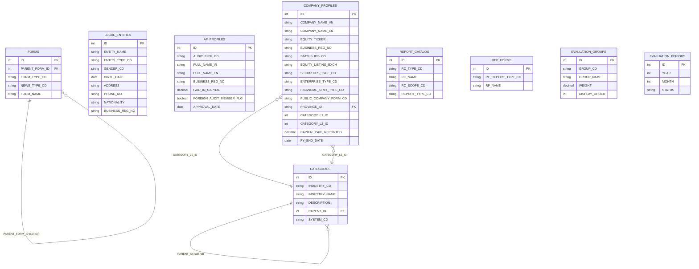
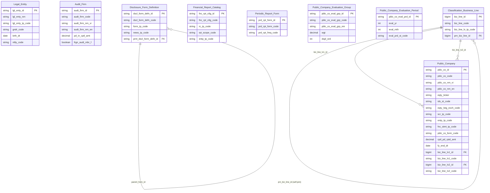

# IDS HLD — Tier 1

**Source system:** IDS (Information Disclosure System — Hệ thống Công bố Thông tin)
**Tier 1:** Các entity độc lập — không FK đến entity nghiệp vụ khác trong scope IDS. Gồm 3 nhánh: (A) Công ty đại chúng (`COMPANY_PROFILES`), (B) Thực thể pháp lý (`LEGAL_ENTITIES`), (C) Công ty kiểm toán (`AF_PROFILES`), và các entity template/danh mục độc lập (FORMS, REPORT_CATALOG, REP_FORMS, EVALUATION_GROUPS, EVALUATION_PERIODS). `CATEGORIES` (danh mục ngành nghề 2 cấp) promote thành Atomic entity **shared** `Classification Business Line` (đã có từ ECAT) — xem 6f T1-13; đảo ngược quyết định T1-11.

---

## 6a. Bảng tổng quan BCV Concept

| BCV Core Object | BCV Concept | Category | Source Table | Source Table Change Mode | Mô tả bảng nguồn | Atomic Entity | Table Type | BCV Term |
|---|---|---|---|---|---|---|---|---|
| Involved Party | [Involved Party] Organization | Organization | `COMPANY_PROFILES` | Update | Thông tin cơ bản của công ty đại chúng: tên VI/EN, mã CK, sàn niêm yết, trạng thái, vốn điều lệ, loại hình doanh nghiệp. Hạt nhân của toàn bộ IDS — hầu hết bảng nghiệp vụ FK về đây. | Public Company | Fundamental | (1) Term candidate: `[Involved Party] Organization` — BCV mô tả tổ chức/pháp nhân có lifecycle riêng, được UBCKNN quản lý. (2) Cấu trúc trường: tên VI/EN/viết tắt, mã CK, sàn niêm yết (EQUITY_LISTING_EXCH), trạng thái (STATUS_IDS_CD), vốn điều lệ (CAPITAL_PAID_REPORTED), loại doanh nghiệp (ENTERPRISE_TYPE_CD), loại BCTC (FINANCIAL_STMT_TYPE_CD) — rõ ràng là profile của pháp nhân tổ chức; không có bảng `company_detail` riêng trong BRD thực tế. (3) Chọn `[Involved Party] Organization` — công ty đại chúng là pháp nhân tổ chức; shared entity với SCMS.DM_CONG_TY_DC. |
| Involved Party | [Involved Party] Individual | Involved Party | `LEGAL_ENTITIES` | Update | Cổ đông giao dịch, người nội bộ, người liên quan của công ty đại chúng (cá nhân hoặc tổ chức). Grain = 1 thực thể pháp lý độc lập — không FK đến COMPANY_PROFILES ở bảng này; quan hệ với công ty thể hiện qua COMPANY_ENTITY_ROLE và COMPANY_SHAREHOLDING (Tier 3). | Legal Entity | Fundamental | (1) Term candidate: `[Involved Party] Individual` — BCV mô tả cá nhân hoặc tổ chức là Involved Party có lifecycle riêng. (2) Cấu trúc trường: ENTITY_NAME, ENTITY_TYPE_CD (cá nhân/tổ chức), GENDER_CD, BIRTH_DATE, ADDRESS, PHONE_NO, FAX_NO, NATIONALITY, EDUCATION_LEVEL_CD, BUSINESS_REG_NO (nếu là tổ chức), PAID_UP_CHARTER_CAPITAL, WEBSITE — đây là profile đầy đủ của một thực thể pháp lý độc lập không gắn với công ty cụ thể. (3) Chọn `[Involved Party] Individual` — LEGAL_ENTITIES là Involved Party với lifecycle riêng; grain = 1 thực thể, không phải 1 giao dịch. Fundamental vì không FK đến bảng nghiệp vụ ở T1. |
| Involved Party | [Involved Party] Organization | Organization | `AF_PROFILES` | Update | Hồ sơ công ty kiểm toán được BTC/UBCKNN chấp thuận: tên VI/EN, vốn điều lệ thực góp, thành viên hãng kiểm toán quốc tế. | Audit Firm | Fundamental | (1) Term candidate: `[Involved Party] Organization` — BCV mô tả pháp nhân tổ chức. (2) Cấu trúc trường: tên VI/EN/viết tắt, số ĐKKD, vốn điều lệ, trạng thái, ngày chấp thuận, thành viên hãng nước ngoài — đây là profile của một tổ chức kiểm toán độc lập. (3) Chọn `[Involved Party] Organization` — công ty kiểm toán là pháp nhân tổ chức; shared entity với SCMS.CT_KIEM_TOAN. |
| Condition | [Condition] Form Definition | Condition | `FORMS` | Update | Định nghĩa template form CBTT — mỗi form là một loại hồ sơ/tin công bố; self-ref qua `parent_form_id` tạo cấu trúc cha-con. | Disclosure Form Definition | Fundamental | (1) Term candidate: `[Condition] Form Definition` — BCV mô tả quy định/template chuẩn hóa được áp dụng cho từng loại hoạt động CBTT. (2) Cấu trúc trường: form_type_cd, news_type_cd, parent_form_id (self-ref), tên biểu mẫu — đây là định nghĩa template dùng làm tiêu chuẩn cho việc nộp hồ sơ CBTT. (3) Chọn `[Condition] Form Definition` — FORMS là điều kiện/quy định nghiệp vụ, không phải sự kiện thực tế. |
| Condition | [Condition] Form Definition | Condition | `REPORT_CATALOG` | Update | Danh mục báo cáo tài chính: định nghĩa loại báo cáo (BCTC, KQKD...) với tập hàng/cột tương ứng. | Financial Report Catalog | Fundamental | (1) Term candidate: `[Condition] Form Definition` — BCV mô tả mẫu biểu/danh mục được định nghĩa sẵn. (2) Cấu trúc trường: rc_type_cd, tên catalog, phạm vi (rc_scope_cd), loại doanh nghiệp (report_type_cd), kỳ báo cáo — đây là định nghĩa danh mục mẫu báo cáo BCTC, không phải dữ liệu thực. (3) Chọn `[Condition] Form Definition` — REPORT_CATALOG là template mẫu được duy trì làm quy chuẩn. |
| Condition | [Condition] Form Definition | Condition | `REP_FORMS` | Update | Template báo cáo định kỳ (tháng/quý/năm/bán niên) — bộ mẫu độc lập với báo cáo tài chính. | Periodic Report Form | Fundamental | (1) Term candidate: `[Condition] Form Definition` — BCV mô tả mẫu biểu quy chuẩn. (2) Cấu trúc trường: rf_report_type_cd (tần suất), tên form, mô tả — đây là mẫu template độc lập cho báo cáo định kỳ thống kê. (3) Chọn `[Condition] Form Definition` — REP_FORMS là template định nghĩa cấu trúc báo cáo định kỳ, không phải dữ liệu thực tế. |
| Group | [Group] Group | Group | `EVALUATION_GROUPS` | Update | Nhóm chỉ tiêu đánh giá xếp hạng công ty đại chúng (không có FK đến bảng nghiệp vụ khác). | Public Company Evaluation Group | Classification | (1) Term candidate: `[Group] Group` — BCV mô tả nhóm phân loại. (2) Cấu trúc trường: GROUP_NAME, GROUP_CD, WEIGHT, DISPLAY_ORDER — đây là danh mục nhóm chỉ tiêu phục vụ đánh giá, có CODE + NAME + metadata. Tuy nhiên có WEIGHT (trọng số) là attribute nghiệp vụ quan trọng. (3) Chọn `[Group] Group` — EVALUATION_GROUPS là bảng phân nhóm chỉ tiêu đánh giá; TABLE_TYPE = Classification vì đây là reference data được duy trì để phân loại chỉ tiêu. |
| Event | [Event] Period | Event | `EVALUATION_PERIODS` | Update | Kỳ đánh giá xếp hạng công ty đại chúng (năm + tháng + trạng thái đã duyệt). | Public Company Evaluation Period | Fundamental | (1) Term candidate: `[Event] Period` — BCV mô tả khoảng thời gian nghiệp vụ có lifecycle riêng (draft → approved). (2) Cấu trúc trường: YEAR, MONTH, STATUS (approved/draft) — đây là kỳ đánh giá có lifecycle riêng, không chỉ là reference data Code + Name. (3) Chọn `[Event] Period` — EVALUATION_PERIODS là kỳ nghiệp vụ độc lập phục vụ đánh giá. Fundamental vì không FK đến entity nghiệp vụ khác. |
| Common | [Common] Industry Classification | Common | `CATEGORIES` | Update | Danh mục ngành nghề kinh doanh 2 cấp của CTĐC, self-referencing qua `PARENT_ID` — dùng cho `COMPANY_PROFILES.CATEGORY_L1_ID`/`CATEGORY_L2_ID`. | **Classification Business Line** (shared với ECAT) | Relative | (1) Term candidate: `[Common] Industry Classification` (BCV id 8291, category `Common`) — "phân loại tổ chức dựa trên những gì tổ chức sản xuất, kinh doanh hoặc chế tạo". (2) Cấu trúc trường: `INDUSTRY_CD`/`INDUSTRY_NAME`/`DESCRIPTION` là nội dung nghiệp vụ; `PARENT_ID` (self-ref) tạo cấu trúc cha-con 2 cấp — cấu trúc gần như đồng nhất với `ECAT.BUSINESS_LINE_LEVEL_1`/`BUSINESS_LINE_LEVEL_2` (đã gộp thành entity `Classification Business Line`, self-referencing, cùng BCV Concept `[Common] Industry Classification`, `ECAT_HLD_Tier1.md` T1-07). (3) Theo yêu cầu tường minh của Data Modeler (2026-07-17), coi `IDS.CATEGORIES` và `ECAT.BUSINESS_LINE_LEVEL_1/2` là **cùng một concept nghiệp vụ** (danh mục ngành nghề 2 cấp) → gộp thành **shared entity** `Classification Business Line` thay vì tạo entity riêng — đảo ngược lý do "khác nguồn dữ liệu" của quyết định T1-11. Table Type = `Relative` (giữ nguyên theo entity gốc từ ECAT, không theo rule mặc định Common→Classification). Xem 6f T1-13. |

---

## 6b. Diagram Source (Mermaid)

---

## 6c. Diagram Atomic (Mermaid)

> `Classification_Business_Line` là entity **đã có** (nguồn ECAT: `BUSINESS_LINE_LEVEL_1`/`BUSINESS_LINE_LEVEL_2`, xem `ECAT_HLD_Tier1.md` T1-07) — Tier này chỉ bổ sung `IDS.CATEGORIES` làm nguồn thứ 2 (shared entity), không đổi cấu trúc. Xem 6f T1-13.

---

## 6d. Mục Danh mục & Tham chiếu (Reference Data)

| Source Field / Bảng | Mô tả | Scheme Code | source_type | Ghi chú |
|---|---|---|---|---|
| `COMPANY_PROFILES.STATUS_IDS_CD` | Trạng thái niêm yết IDS | `IDS_COMPANY_STATUS` | source_table | Values load từ `LOOKUP_VALUES` (LOOKUP_GROUP = 'IDS_COMPANY_STATUS') |
| `COMPANY_PROFILES.EQUITY_LISTING_EXCH` | Sàn niêm yết cổ phiếu (HNX/HOSE/UPCoM) | `IDS_EQUITY_LISTING_EXCH` | source_table | Values load từ `LOOKUP_VALUES` |
| `COMPANY_PROFILES.SECURITIES_TYPE_CD` | Loại chứng khoán phát hành | `IDS_SECURITIES_TYPE` | source_table | Values load từ `LOOKUP_VALUES` |
| `COMPANY_PROFILES.PUBLIC_COMPANY_FORM_CD` | Hình thức trở thành CTĐC (IPO / nộp hồ sơ) | `IDS_PUBLIC_COMPANY_FORM` | source_table | Values load từ `LOOKUP_VALUES` |
| `COMPANY_PROFILES.ENTERPRISE_TYPE_CD` | Loại hình doanh nghiệp | `IDS_ENTERPRISE_TYPE` | source_table | Values load từ `LOOKUP_VALUES`. Dùng chung với Financial Report Catalog |
| `COMPANY_PROFILES.FINANCIAL_STMT_TYPE_CD` | Loại báo cáo tài chính (IFRS/VAS) | `IDS_FINANCIAL_STMT_TYPE` | source_table | Values load từ `LOOKUP_VALUES` |
| `LEGAL_ENTITIES.ENTITY_TYPE_CD` | Loại hình thực thể (cá nhân/tổ chức) | `IDS_ENTITY_TYPE` | source_table | Values load từ `LOOKUP_VALUES` (LOOKUP_GROUP = 'ENTITY_TYPE') |
| `LEGAL_ENTITIES.GENDER_CD` | Giới tính | `IDS_GENDER` | source_table | Values load từ `LOOKUP_VALUES` (LOOKUP_GROUP = 'GENDER') |
| `LEGAL_ENTITIES.EDUCATION_LEVEL_CD` | Trình độ học vấn | `IDS_EDUCATION_LEVEL` | source_table | Values load từ `LOOKUP_VALUES` (LOOKUP_GROUP = 'EDUCATION_LEVEL') |
| `FORMS.FORM_TYPE_CD` | Loại hồ sơ/tin CBTT | `IDS_FORM_TYPE` | source_table | Values load từ `LOOKUP_VALUES` |
| `FORMS.NEWS_TYPE_CD` | Loại tin gốc | `IDS_NEWS_TYPE` | source_table | Values load từ `LOOKUP_VALUES` |
| `REPORT_CATALOG.RC_TYPE_CD` | Loại catalog báo cáo tài chính | `IDS_REPORT_CATALOG_TYPE` | etl_derived | Values lấy trực tiếp từ cột nguồn |
| `REPORT_CATALOG.RC_SCOPE_CD` | Phạm vi báo cáo (hợp nhất, mẹ...) | `IDS_REPORT_SCOPE` | source_table | Values load từ `LOOKUP_VALUES` |
| `REP_FORMS.RF_REPORT_TYPE_CD` | Tần suất báo cáo định kỳ (tháng/quý/năm...) | `IDS_PERIODIC_REPORT_FREQUENCY` | etl_derived | Values lấy trực tiếp từ cột nguồn |
| `EVALUATION_PERIODS.STATUS` | Trạng thái kỳ đánh giá (approved/draft) | `IDS_EVAL_PERIOD_STATUS` | etl_derived | Values lấy trực tiếp từ cột nguồn |
| ETL derive từ `CATEGORIES.PARENT_ID IS NULL`/`NOT NULL` | Phân biệt cấp ngành nghề (1/2) trên entity `Classification Business Line` — giá trị dùng chung scheme `ECAT_BUSINESS_LINE_LEVEL` đã có (bổ sung nguồn `IDS.CATEGORIES` cho 2 code `LEVEL_1`/`LEVEL_2`) | `ECAT_BUSINESS_LINE_LEVEL` | etl_derived | `CATEGORIES` không tách 2 bảng như ECAT — level suy ra từ `PARENT_ID` (NULL = cấp 1, NOT NULL = cấp 2), khác cơ chế derive-từ-tên-bảng của ECAT. Cơ chế derive cụ thể để LLD xác nhận (xem 6f T1-13). `IDS_INDUSTRY_CATEGORY` (scheme cũ) deprecated — xem 6f T1-13. |

---

## 6e. Bảng chờ thiết kế

*(Để trống — tất cả bảng Tier 1 đã có thông tin cột)*

---

## 6f. Điểm cần xác nhận

| # | Câu hỏi | Kết quả |
|---|---|---|
| T1-01 | `COMPANY_PROFILES` trong BRD thực tế đã bao gồm cả các cột mà HLD cũ gán cho `company_detail` (FINANCIAL_STMT_TYPE_CD, FY_END_DATE, EQUITY_LISTING_EXCH...) — xác nhận không có bảng `company_detail` riêng. | Xác nhận — BRD per-table `brd_IDS_COMPANY_PROFILES.yaml` đã có đầy đủ các cột trên. Merge 1 entity từ 1 bảng. |
| T1-02 | `LEGAL_ENTITIES` là Tier 1 Fundamental (không FK đến COMPANY_PROFILES tại bảng này). Quan hệ cổ đông × công ty = Tier 3 qua `COMPANY_SHAREHOLDING` và `COMPANY_ENTITY_ROLE`. Xác nhận phân tầng đúng. | Xác nhận — LEGAL_ENTITIES.yaml không có cột FK → COMPANY_PROFILES. Quan hệ chỉ thể hiện qua bảng junction Tier 3. |
| T1-03 | `EVALUATION_GROUPS` có WEIGHT là attribute nghiệp vụ, không chỉ Code + Name → cần entity riêng thay vì Classification Value. Tuy nhiên đây là reference data dùng để phân nhóm chỉ tiêu, không phải instance nghiệp vụ → TABLE_TYPE = Classification. Xác nhận. | Xác nhận — EVALUATION_GROUPS là nhóm chỉ tiêu cố định, table_type = Classification phù hợp. |
| T1-04 | `EVALUATION_PERIODS` có STATUS lifecycle riêng (draft → approved) → Fundamental, không phải Classification. Xác nhận. | Xác nhận — có lifecycle status, grain = 1 kỳ đánh giá. |
| T1-05 | `Audit Firm` là shared entity với SCMS.CT_KIEM_TOAN. Chưa có trong `atomic_entities.yaml` — thiết kế mới từ IDS, SCMS sẽ bổ sung source_table sau. | Chưa approved — thiết kế mới, cần coordinate với SCMS HLD. |
| T1-06 | ~~`CATEGORIES` (ngành nghề 2 cấp, self-ref) → Classification Value `IDS_INDUSTRY_CATEGORY`, không tạo Atomic entity riêng.~~ | **Đã đảo ngược tại T1-09, rồi đảo ngược lại tại T1-11** — kết quả cuối cùng trùng với quyết định gốc ở dòng này (Classification Value, không tạo Atomic entity). |
| T1-07 | `CATEGORIES` tra BCV ra `[Common] Industry Classification` (BCV id 8291, category `Common`) — theo rule mặc định của skill (Common → Table Type `Classification`, tức Classification Value, không tạo Atomic entity riêng), khác với quyết định thực tế áp dụng ở tier này. Data Modeler chỉ định tường minh Table Type = `Relative` (self-referencing qua `PARENT_ID`, có surrogate key riêng), không dùng ngoại lệ Geographic Area (ngoại lệ đó chỉ áp dụng cho `[Location]`). Ghi nhận đây là quyết định thiết kế tường minh, không phải suy luận theo rule mặc định. Tương tự pattern `Classification ECAT Business Line` (ECAT_HLD_Tier1.md T1-07). | **Superseded bởi T1-11** — CATEGORIES không còn là Atomic entity nên Table Type không còn áp dụng. |
| T1-08 | `CATEGORIES.SYSTEM_CD` — mô tả trống trong BRD (`brd_IDS_CATEGORIES.yaml`). Tên gợi ý phân biệt hệ thống dùng chung bảng CATEGORIES (nếu bảng này được shared bởi nhiều module IDS), nhưng chưa rõ ý nghĩa cụ thể / giá trị domain. Cần đối chiếu dữ liệu thực tế trước khi thiết kế LLD. | **Không còn áp dụng** — xem T1-11. CATEGORIES không thiết kế thành Atomic entity nên không cần map attribute SYSTEM_CD. |
| T1-09 | Đảo ngược quyết định T1-06: `CATEGORIES` promote thành Atomic entity `Classification IDS Business Line`, Table Type = `Relative`, theo yêu cầu tường minh của Data Modeler. `COMPANY_PROFILES.CATEGORY_L1_ID`/`CATEGORY_L2_ID` sẽ xử lý thành cặp Id + Code (FK đến entity mới) ở LLD, thay vì Classification Value scheme `IDS_INDUSTRY_CATEGORY` như quyết định cũ. | **Superseded bởi T1-11 (2026-07-14)** — xem T1-11. |
| T1-10 | `CATEGORIES.ACTIVE_FLG` và `CATEGORIES.STATUS_FLG` — tên cột và mô tả nguồn không khớp nhau: `ACTIVE_FLG` (tên gợi ý cờ hiệu lực) có mô tả BRD chỉ ghi "Chọn" (gợi ý cờ UI checked/selected); `STATUS_FLG` (tên gợi ý trạng thái chung) có mô tả rõ "1: Active (Hiệu lực); 0: Inactive (Hết hiệu lực)". LLD map 1:1 thành 2 Boolean riêng (`Selected Indicator` ← ACTIVE_FLG, `Active Indicator` ← STATUS_FLG) theo mô tả gốc, không coi là trùng lặp — theo nguyên tắc "map 1:1, không tự loại trừ vì nghi trùng lặp" đã áp dụng cho CAT_SC_FIRM_STATUS. | **Không còn áp dụng** — xem T1-11. CATEGORIES không thiết kế thành Atomic entity nên không cần map attribute ACTIVE_FLG/STATUS_FLG. |
| T1-11 | Đảo ngược quyết định T1-09: `CATEGORIES` KHÔNG thiết kế thành Atomic entity nữa — theo quyết định tường minh của Data Modeler (2026-07-14). IDS không dùng chung entity `Classification Business Line` (ECAT, đổi tên từ `Classification ECAT Business Line` theo rule mới bỏ tiền tố nguồn) vì khác nguồn dữ liệu, và cũng không giữ entity riêng `Classification IDS Business Line`. `IDS.CATEGORIES` chuyển hẳn ra ngoài scope Atomic — xem Overview mục 7f. `COMPANY_PROFILES.CATEGORY_L1_ID`/`CATEGORY_L2_ID` quay lại dùng Classification Value scheme `IDS_INDUSTRY_CATEGORY` (un-deprecated trong classification_schemes.yaml) thay vì cặp FK Id+Code. | Đã xử lý — mục 6a/6b/6c/6d đã cập nhật (bỏ entity, thêm lại Reference Data row). `lld_IDS_CATEGORIES.yaml` đã xóa. `lld_IDS_COMPANY_PROFILES.yaml` quay lại 2 attribute Classification Value (`Business Line Level 1/2 Code`). |
| T1-12 | `AF_PROFILES.BUSINESS_REG_NO` (Giấy chứng nhận ĐKKD) và `ELIGIBILITY_CERT_NO` (Giấy chứng nhận đủ điều kiện kinh doanh) — theo yêu cầu Data Modeler (2026-07-14), tách ra shared entity `Involved Party Alternative Identification` thay vì giữ denormalized Text tại `Audit Firm`. Hardcode type `BUSINESS_LICENSE` (BUSINESS_REG_NO) và `BUSINESS_ELIGIBILITY_LICENSE` (ELIGIBILITY_CERT_NO — giá trị mới, bổ sung vào scheme `IP_ALT_ID_TYPE`). | Đã xử lý — tạo `lld_IDS_AF_PROFILES_IP_Alt_Identification.yaml` (2 block theo type), xóa 2 attribute denormalized khỏi `lld_IDS_AF_PROFILES.yaml`, cập nhật `manifest.yaml` + `classification_schemes.yaml` + `pending_design.yaml`. |
| T1-13 | Đảo ngược quyết định T1-11: `CATEGORIES` promote lại thành Atomic entity, nhưng lần này là **shared entity** với `Classification Business Line` đã có từ ECAT (`ECAT_HLD_Tier1.md` T1-07) — theo yêu cầu tường minh của Data Modeler (2026-07-17). Khác T1-09 (từng tạo entity riêng `Classification IDS Business Line`), lần này `IDS.CATEGORIES` và `ECAT.BUSINESS_LINE_LEVEL_1/2` được xác nhận là **cùng 1 concept nghiệp vụ** (danh mục ngành nghề 2 cấp, self-referencing) → gộp vào cùng 1 dòng `atomic_entities.yaml` (`Classification Business Line`, bổ sung `source_table: IDS.CATEGORIES`), không tạo entity trùng tên. `COMPANY_PROFILES.CATEGORY_L1_ID`/`CATEGORY_L2_ID` chuyển từ Classification Value 1-field-Code sang cặp FK Id+Code đến `Classification Business Line` (rule CLAUDE.md #3) — thực hiện ở LLD. Scheme `IDS_INDUSTRY_CATEGORY` deprecated; scheme `ECAT_BUSINESS_LINE_LEVEL` bổ sung nguồn `IDS.CATEGORIES` (derive qua `PARENT_ID IS NULL`/`NOT NULL` thay vì tên bảng — cơ chế cụ thể để LLD xác nhận). | Đã xử lý ở mục 6a/6b/6c/6d Tier1 này + `atomic_entities.yaml` (bổ sung source_table) + `classification_schemes.yaml` (deprecate `IDS_INDUSTRY_CATEGORY`). LLD (`lld_IDS_CATEGORIES.yaml`, cập nhật `lld_IDS_COMPANY_PROFILES.yaml` FK Id+Code, `manifest.yaml`) — chưa thực hiện, thuộc phạm vi `atomic-lld-design`. |
