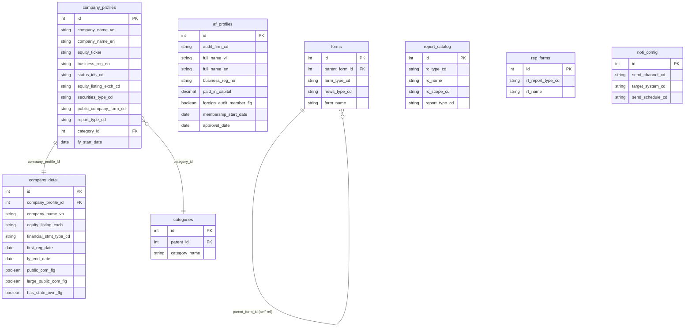
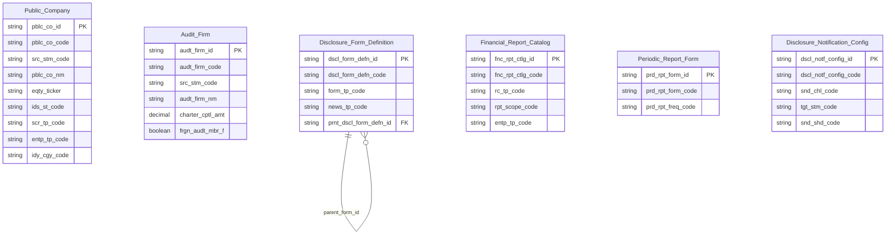

# IDS HLD — Tier 1

**Source system:** IDS (Information Disclosure System — Hệ thống Công bố Thông tin)
**Tier 1:** Các entity độc lập — không FK đến entity nghiệp vụ khác trong scope IDS. Gồm 2 nhánh: (A) Công ty đại chúng và (B) Công ty kiểm toán, cùng các template báo cáo và form CBTT.

---

## 6a. Bảng tổng quan BCV Concept

| BCV Core Object | BCV Concept | Category | Source Table | Source Table Change Mode | Mô tả bảng nguồn | Atomic Entity | Table Type | BCV Term |
|---|---|---|---|---|---|---|---|---|
| Involved Party | [Involved Party] Organization | Organization | `company_profiles` | Update | Thông tin cơ bản của công ty đại chúng: tên VI/EN, mã chứng khoán, sàn niêm yết, trạng thái, vốn điều lệ. Hạt nhân của toàn bộ IDS — hầu hết bảng nghiệp vụ FK về đây. | Public Company | Fundamental | (1) Term candidate: `[Involved Party] Organization` — BCV mô tả tổ chức/pháp nhân có lifecycle riêng, được UBCKNN quản lý. (2) Cấu trúc trường: tên VI/EN/viết tắt, mã chứng khoán, sàn niêm yết, trạng thái, vốn điều lệ, ngày tài chính — rõ ràng là thông tin profile của một pháp nhân tổ chức. `company_detail` có quan hệ 1-1, merge vào cùng entity. (3) Chọn `[Involved Party] Organization` — công ty đại chúng là pháp nhân tổ chức; đây cũng là điểm merge với SCMS.DM_CONG_TY_DC. |
| Involved Party | [Involved Party] Organization | Organization | `af_profiles` | Update | Hồ sơ công ty kiểm toán được BTC/UBCKNN chấp thuận: tên VI/EN, vốn điều lệ thực góp, thành viên hãng kiểm toán quốc tế. | Audit Firm | Fundamental | (1) Term candidate: `[Involved Party] Organization` — BCV mô tả pháp nhân tổ chức. (2) Cấu trúc trường: tên VI/EN/viết tắt, số ĐKKD, vốn điều lệ, trạng thái, ngày chấp thuận, thành viên hãng nước ngoài — đây là profile của một tổ chức kiểm toán độc lập. (3) Chọn `[Involved Party] Organization` — công ty kiểm toán là pháp nhân tổ chức; shared entity với SCMS.CT_KIEM_TOAN. |
| Condition | [Condition] Form Definition | Condition | `forms` | Update | Định nghĩa template form CBTT — mỗi form là một loại hồ sơ/tin công bố; self-ref qua `parent_form_id` tạo cấu trúc cha-con. | Disclosure Form Definition | Fundamental | (1) Term candidate: `[Condition] Form Definition` — BCV mô tả quy định/template chuẩn hóa được áp dụng cho từng loại hoạt động CBTT. (2) Cấu trúc trường: form_type_cd, news_type_cd, parent_form_id (self-ref), tên biểu mẫu — đây là định nghĩa template dùng làm tiêu chuẩn cho việc nộp hồ sơ CBTT. (3) Chọn `[Condition] Form Definition` — form CBTT là điều kiện/quy định nghiệp vụ, không phải sự kiện thực tế. |
| Condition | [Condition] Form Definition | Condition | `report_catalog` | Update | Danh mục báo cáo tài chính: định nghĩa loại báo cáo (BCTC, KQKD...) với tập hàng/cột tương ứng. | Financial Report Catalog | Fundamental | (1) Term candidate: `[Condition] Form Definition` — BCV mô tả mẫu biểu/danh mục được định nghĩa sẵn. (2) Cấu trúc trường: rc_type_cd, tên catalog, phạm vi (rc_scope_cd), loại doanh nghiệp (report_type_cd), kỳ báo cáo — đây là định nghĩa danh mục mẫu báo cáo BCTC, không phải dữ liệu thực. (3) Chọn `[Condition] Form Definition` — catalog là template/mẫu được duy trì làm quy chuẩn, khớp với [Condition]. |
| Condition | [Condition] Form Definition | Condition | `rep_forms` | Update | Template báo cáo định kỳ (tháng/quý/năm/bán niên) — bộ mẫu độc lập với báo cáo tài chính. | Periodic Report Form | Fundamental | (1) Term candidate: `[Condition] Form Definition` — BCV mô tả mẫu biểu quy chuẩn. (2) Cấu trúc trường: rf_report_type_cd (tần suất), tên form, mô tả — đây là mẫu template độc lập cho báo cáo định kỳ thống kê. (3) Chọn `[Condition] Form Definition` — rep_forms là template định nghĩa cấu trúc báo cáo định kỳ, không phải dữ liệu thực tế. |
| Condition | [Condition] Notification Configuration | Condition | `noti_config` | Update | Cấu hình thông báo CBTT: kênh gửi (email/SMS/push), hệ thống đích, lịch gửi định kỳ. | Disclosure Notification Config | Fundamental | (1) Term candidate: `[Condition] Notification Configuration` — BCV mô tả cấu hình/quy tắc điều phối việc gửi thông báo. (2) Cấu trúc trường: send_channel_cd, target_system_cd, send_schedule_cd — đây là cấu hình điều kiện kích hoạt và định tuyến thông báo, không phải instance gửi. (3) Chọn `[Condition] Notification Configuration` — noti_config là Condition điều kiện nghiệp vụ áp dụng cho hệ thống thông báo. |

---

## 6b. Diagram Source (Mermaid)

---

## 6c. Diagram Atomic (Mermaid)

---

## 6d. Mục Danh mục & Tham chiếu (Reference Data)

| Source Field / Bảng | Mô tả | Scheme Code | source_type | Ghi chú |
|---|---|---|---|---|
| `company_profiles.status_ids_cd` | Trạng thái niêm yết IDS | `IDS_COMPANY_STATUS` | source_table | Values load từ `lookup_values` (lookup_group = 'IDS_COMPANY_STATUS') |
| `company_profiles.equity_listing_exch_cd` | Sàn niêm yết cổ phiếu (HNX/HOSE/UPCoM) | `IDS_EQUITY_LISTING_EXCH` | source_table | Values load từ `lookup_values` |
| `company_profiles.securities_type_cd` | Loại chứng khoán phát hành | `IDS_SECURITIES_TYPE` | source_table | Values load từ `lookup_values` |
| `company_profiles.public_company_form_cd` | Hình thức trở thành CTĐC (IPO / nộp hồ sơ) | `IDS_PUBLIC_COMPANY_FORM` | source_table | Values load từ `lookup_values` |
| `company_profiles.report_type_cd` | Loại hình doanh nghiệp (bh/td/ck/dn) | `IDS_ENTERPRISE_TYPE` | source_table | Values load từ `lookup_values`. Dùng chung với Financial Report Catalog |
| `company_detail.financial_stmt_type_cd` | Loại báo cáo tài chính (IFRS/VAS…) | `IDS_FINANCIAL_STMT_TYPE` | source_table | Values load từ `lookup_values` |
| `categories` (bảng danh mục self-ref) | Ngành nghề 2 cấp của công ty đại chúng | `IDS_INDUSTRY_CATEGORY` | source_table | Bảng danh mục thuần — Classification Value, không phải entity |
| `forms.form_type_cd` | Loại hồ sơ/tin CBTT (hồ sơ, cbtt) | `IDS_FORM_TYPE` | source_table | Values load từ `lookup_values` |
| `forms.news_type_cd` | Loại tin gốc | `IDS_NEWS_TYPE` | source_table | Values load từ `lookup_values`. Dùng chung với Notifications |
| `forms.sub_news_type_cd` | Loại tin con | `IDS_SUB_NEWS_TYPE` | source_table | Values load từ `lookup_values` |
| `report_catalog.rc_type_cd` | Loại catalog báo cáo tài chính | `IDS_REPORT_CATALOG_TYPE` | etl_derived | Values lấy trực tiếp từ cột nguồn |
| `report_catalog.rc_scope_cd` | Phạm vi báo cáo (hợp nhất, mẹ...) | `IDS_REPORT_SCOPE` | source_table | Values load từ `lookup_values` |
| `rep_forms.rf_report_type_cd` | Tần suất báo cáo định kỳ (tháng/quý/năm...) | `IDS_PERIODIC_REPORT_FREQUENCY` | etl_derived | Values lấy trực tiếp từ cột nguồn |
| `noti_config.send_channel_cd` | Hình thức gửi thông báo (email/SMS/push) | `IDS_NOTIFICATION_SEND_CHANNEL` | source_table | Values load từ `lookup_values` |
| `noti_config.target_system_cd` | Hệ thống nhận thông báo | `IDS_NOTIFICATION_TARGET_SYSTEM` | source_table | Values load từ `lookup_values` |
| `noti_config.send_schedule_cd` | Lịch gửi thông báo định kỳ | `IDS_NOTIFICATION_SEND_SCHEDULE` | source_table | Values load từ `lookup_values` |

---

## 6e. Bảng chờ thiết kế

*(Để trống — tất cả bảng Tier 1 đã có thông tin cột)*

---

## 6f. Điểm cần xác nhận

| # | Câu hỏi | Kết quả |
|---|---|---|
| T1-01 | `company_profiles` và `company_detail` có quan hệ 1-1 — merge vào entity `Public Company`. Cột trùng nhau (company_name_vn, equity_ticker, business_reg_no) ưu tiên lấy từ `company_profiles`. Xác nhận? | Theo IDS_Source_Analysis.md mục 1.1: đã xác nhận — `company_profiles` là primary source. |
| T1-02 | `Audit Firm` là shared entity với SCMS.CT_KIEM_TOAN — IDS source sẽ bổ sung `source_table` vào entry đã có (nếu entity đã approved từ SCMS). Cần kiểm tra `atomic_entities.yaml` khi có SCMS HLD. | Audit Firm chưa có trong `atomic_entities.yaml` — thiết kế mới từ IDS, SCMS sẽ bổ sung sau. |
| T1-03 | `categories` (ngành nghề 2 cấp, self-ref) → Classification Value `IDS_INDUSTRY_CATEGORY`, không tạo Atomic entity. Cột `category_id` (cấp 2) và `category_l1_id` (cấp 1) trên `Public Company` đều dùng scheme này. Xác nhận không tạo `Industry Category` entity riêng. | Xác nhận — categories chỉ có Code + Name, không có instance data nghiệp vụ. → Classification Value. |
| T1-04 | `noti_config_apply` là pure junction table (noti_config_id + company_profile_id, không có attribute riêng) → denormalize thành `ARRAY<company_id>` trên `Disclosure Notification Config`? Hay để cho Tier 2 xử lý khi thiết kế entity `Public Company` side? | Xác nhận out-of-scope theo IDS_Source_Analysis.md mục 5.3 — pure junction không có business attribute. |
| T1-05 | `Disclosure Notification Config` không FK đến entity nghiệp vụ nào (noti_config_apply là junction out-of-scope) → xếp Tier 1. Nếu sau này `notifications` (Tier 2) FK đến noti_config thì quan hệ đúng. Xác nhận Tier 1 là hợp lý. | Xác nhận — noti_config không có FK inbound từ entity nghiệp vụ nào ngoài junction đã drop. |
