# IDS HLD — Tier 2

**Source system:** IDS (Information Disclosure System — Hệ thống Công bố Thông tin)
**Tier 2:** Các entity FK đến entity Tier 1. Gồm:
- Con của **Public Company**: Legal Representative, State Capital, Foreign Ownership Limit, Company Relationship, Company Inspection, Company Penalties, Capital Mobilization, Company Add Capital, Company Tender Offer, Company Treasury Stocks, Company Share Statistics, Stock Listing History, Bond Listing History, Pub Company Registration/Cancellation, Report Extensions, Evaluation, Bond Evaluation
- Con của **Legal Entity** (T1): Alt Identification, Position, Trading Account, Relationship, Stock Control
- Con của **Legal Entity × Public Company** (T1×T1): Company Shareholding, Company Entity Role
- Con của **Legal Entity × Public Company** (T1): Securities Offering
- Con của **Audit Firm** (T1): AF Legal Representative, Auditor Profile, AF Status History, Audit Firm Inspection, AF Sanction
- Con của **Disclosure Form Definition** (T1): Violation Template, Disclosure Notification
- Con của **Financial Report Catalog** (T1): Financial Report Row/Column Template
- Con của **Periodic Report Form** (T1): Periodic Report Form Row/Column Template
- Con của **Evaluation Group** (T1): Evaluation Criterion
- Shared entities: IP Postal Address, IP Electronic Address, IP Alternative Identification

---

## 6a. Bảng tổng quan BCV Concept

| BCV Core Object | BCV Concept | Category | Source Table | Source Table Change Mode | Mô tả bảng nguồn | Atomic Entity | Table Type | BCV Term |
|---|---|---|---|---|---|---|---|---|
| Involved Party | [Involved Party] Individual Employment Status | Involved Party | `LEGAL_REPRESENTATIVE` | Update | Người đại diện pháp luật và người CBTT của CTĐC; phân biệt vai trò qua REPRESENTATIVE_ROLE (0=đại diện PL, 1=người CBTT); 1 công ty có thể có nhiều bản ghi. | Public Company Legal Representative | Relative | (1) Term candidate: `[Involved Party] Individual Employment Status` — BCV mô tả quan hệ vai trò của cá nhân tại tổ chức theo thời gian. (2) Cấu trúc trường: NAME, POSITION_CD, APPOINTMENT_DATE, PHONE_NO, EMAIL, IDENTITY_NO, REPRESENTATIVE_ROLE — đây là vai trò đại diện của cá nhân tại CTĐC, không phải profile cá nhân độc lập. (3) Chọn `[Involved Party] Individual Employment Status`. Relative (FK → Public Company). |
| Arrangement | [Arrangement] Ownership | Arrangement | `STATE_CAPITAL` | Update | Thông tin tỷ lệ và cơ quan đại diện phần vốn nhà nước tại CTĐC. | Public Company State Capital | Relative | (1) Term candidate: `[Arrangement] Ownership` — BCV mô tả quan hệ sở hữu giữa 2 pháp nhân. (2) Cấu trúc trường: STATE_REP_NAME_VI/EN, OWNED_SHARE_QTY, OWNERSHIP_RATIO, STATE_OWNER_ORG_VI/EN — đây là thỏa thuận/sắp xếp về quyền sở hữu vốn nhà nước. (3) Chọn `[Arrangement] Ownership`. Relative (FK → Public Company). |
| Condition | [Condition] Ownership Constraint | Condition | `FOREIGN_OWNER_LIMIT` | Update | Lịch sử quyết định quy định tỷ lệ giới hạn sở hữu nước ngoài tại CTĐC theo thời gian. | Public Company Foreign Ownership Limit | Relative | (1) Term candidate: `[Condition] Ownership Constraint` — BCV mô tả ràng buộc/điều kiện về quyền sở hữu do cơ quan quản lý ban hành. (2) Cấu trúc trường: MAX_OWNER_RATE (%), FROM_DATE, TO_DATE — đây là quy định hành chính ràng buộc tỷ lệ sở hữu nước ngoài. (3) Chọn `[Condition] Ownership Constraint`. Relative (FK → Public Company). |
| Involved Party | [Involved Party] Involved Party Relationship | Involved Party | `COMPANY_RELATIONSHIP` | Update | Quan hệ mẹ/con/liên doanh/liên kết giữa CTĐC và pháp nhân liên quan kèm tỷ lệ sở hữu và ngày hiệu lực. | Public Company Related Entity | Relative | (1) Term candidate: `[Involved Party] Involved Party Relationship` — BCV mô tả quan hệ giữa các Involved Party. (2) Cấu trúc trường: RELATIONSHIP_TYPE_CD, FULL_NAME_VI/EN, BUSINESS_REG_NO, OWNED_SHARE_QTY, OWNERSHIP_RATIO, EFFECTIVE_FROM/TO_DATE — đây là quan hệ giữa 2 pháp nhân với loại quan hệ và tỷ lệ sở hữu. (3) Chọn `[Involved Party] Involved Party Relationship`. Relative (FK → Public Company). |
| Business Activity | [Business Activity] Inspection | Business Activity | `COMPANY_INSPECTION` | Update | Đợt thanh tra/kiểm tra công ty đại chúng do UBCKNN thực hiện: số quyết định, ngày, hình thức, phạm vi, đơn vị chủ trì. | Public Company Inspection | Fact Append | (1) Term candidate: `[Business Activity] Inspection` — BCV mô tả hoạt động kiểm tra/thanh tra do cơ quan quản lý thực hiện. (2) Cấu trúc trường: INSPECTION_TYPE_CD, DECISION_NO, DECISION_DATE, INSPECTION_MODE_CD (định kỳ/bất thường), INSPECTION_SCOPE, LEAD_INSPECTION_UNIT_VI/EN, SANCTION_DECISION_NO — đây là sự kiện thanh tra/kiểm tra nghiệp vụ, mỗi đợt là 1 occurrence. (3) Chọn `[Business Activity] Inspection`. Source Change Mode = Update nhưng mỗi bản ghi là 1 đợt thanh tra riêng biệt — Table Type = Fact Append phù hợp với ngữ nghĩa insert per inspection event. |
| Business Activity | [Business Activity] Enforcement Action | Business Activity | `COMPANY_PENALTIES` | Update | Quyết định xử phạt hành chính đối với CTĐC hoặc cá nhân liên quan: số quyết định, ngày, hình thức xử phạt, số tiền. | Public Company Penalty | Fact Append | (1) Term candidate: `[Business Activity] Enforcement Action` — BCV mô tả hành động chế tài/xử phạt do cơ quan quản lý thực hiện. (2) Cấu trúc trường: PENALIZED_SUBJECT_TYPE_CD, INVESTOR_NAME/ID_NO, POSITION_CD, PENALTY_DECISION_NO/DATE, VIOLATION_DESC, PENALTY_FORM, PENALTY_AMOUNT — đây là quyết định xử phạt hành chính, mỗi quyết định là 1 occurrence. (3) Chọn `[Business Activity] Enforcement Action`. Table Type = Fact Append — mỗi bản ghi là 1 quyết định xử phạt. |
| Business Activity | [Business Activity] Business Activity | Business Activity | `CAPITAL_MOBILIZATION` | Update | Thông tin về quá trình huy động vốn trước khi trở thành công ty đại chúng (lịch sử tăng vốn theo năm). | Public Company Capital Mobilization | Relative | (1) Term candidate: `[Business Activity] Business Activity` — BCV mô tả hoạt động kinh doanh tổng quát. (2) Cấu trúc trường: REPORT_YEAR, PAID_IN_CAPITAL_EOY, CAPITAL_INCREASE_COUNT, CAPITAL_INCREASE_METHOD, AUDIT_FIRM_NAME_VI/EN — đây là lịch sử tăng vốn hàng năm gắn với CTĐC. (3) Chọn `[Business Activity] Business Activity` — ghi nhận hoạt động vốn định kỳ. Relative (FK → Public Company). |
| Business Activity | [Business Activity] Business Activity | Business Activity | `COMPANY_ADD_CAPITAL` | Update | Thông tin về quá trình tăng vốn sau khi là công ty đại chúng: vốn cuối năm, số đợt tăng, mục đích tăng vốn, số công văn. | Public Company Capital Increase | Relative | (1) Term candidate: `[Business Activity] Business Activity` — hoạt động tăng vốn định kỳ của CTĐC. (2) Cấu trúc trường: REPORT_YEAR, PAID_IN_CAPITAL_EOFY, CAPITAL_INCREASE_AM, CAPITAL_INCREASE_COUNT, CAPITAL_INCREASE_PURPOSE, OFFICIAL_LETTER_NO/DATE, LICENSING_AUTHORITY_VI/EN. (3) Chọn `[Business Activity] Business Activity`. Relative (FK → Public Company). |
| Business Activity | [Business Activity] Business Activity | Business Activity | `COMPANY_TENDER_OFFER` | Update | Thông tin phương án chào mua công khai: tên bên chào mua, đại lý chứng khoán, số lượng CP dự kiến mua, giá chào mua. | Public Company Tender Offer | Relative | (1) Term candidate: `[Business Activity] Business Activity` — hoạt động chào mua công khai là sự kiện nghiệp vụ của CTĐC. (2) Cấu trúc trường: TENDER_OFFEROR_NAME_VI/EN, SECURITIES_AGENT_NAME_VI/EN, PLANNED_OFFER_FROM/TO_DATE, PRE/POST_OFFER_SHARE_QTY, PLANNED_OFFER_PRICE — đây là thông tin một đợt chào mua công khai. (3) Chọn `[Business Activity] Business Activity`. Relative (FK → Public Company). |
| Business Activity | [Business Activity] Business Activity | Business Activity | `COMPANY_TREASURY_STOCKS` | Update | Thông tin mua bán cổ phiếu quỹ theo năm: số lượng mua, giá bình quân, số lượng bán. | Public Company Treasury Stock Activity | Relative | (1) Term candidate: `[Business Activity] Business Activity` — hoạt động mua bán cổ phiếu quỹ là hoạt động kinh doanh của CTĐC. (2) Cấu trúc trường: TRANSACTION_YEAR, TREASURY_BUY_QTY, TREASURY_BUY_RC, TREASURY_SELL_QTY, TREASURY_SELL_RC. (3) Chọn `[Business Activity] Business Activity`. Relative (FK → Public Company). |
| Arrangement | [Arrangement] Ownership | Arrangement | `COMPANY_SHARE_STATISTICS` | Update | Thống kê số lượng cổ phần sau mỗi đợt mua/bán: tổng CP phát hành, đang lưu hành, quỹ, giá trị CP ưu đãi. | Public Company Share Statistics | Relative | (1) Term candidate: `[Arrangement] Ownership` — BCV mô tả cấu trúc sở hữu tổng thể của doanh nghiệp. (2) Cấu trúc trường: TOTAL_ISSUED_SHARE, TOTAL_OUTSTANDING_SHARE, TOTAL_OUTSTANDING_VALUE, TOTAL_TREASURY_SHARE, TOTAL_PREFERRED_SHARE/VALUE — đây là bức tranh cấu trúc vốn tại thời điểm nhất định. (3) Chọn `[Arrangement] Ownership`. Relative (FK → Public Company). |
| Business Activity | [Business Activity] Business Activity | Business Activity | `STOCK_LISTING_HISTORY` | Update | Lịch sử niêm yết/đăng ký giao dịch cổ phiếu: loại action, sàn, số quyết định, ngày giao dịch đầu tiên, số lượng CP. | Public Company Stock Listing History | Fact Append | (1) Term candidate: `[Business Activity] Business Activity` — sự kiện thay đổi niêm yết là hoạt động nghiệp vụ insert-only. (2) Cấu trúc trường: ACTION_TYPE_CD, EXCHANGE_CD, EQUITY_TICKER, DECISION_NO/DATE, FIRST_TRADING_DATE, LISTED/CHANGE/TOTAL_SHARE_QTY_AFTER_CHANGE. (3) Chọn `[Business Activity] Business Activity`. Fact Append — mỗi sự kiện niêm yết là occurrence không xóa. |
| Business Activity | [Business Activity] Business Activity | Business Activity | `BOND_LISTING_HISTORY` | Update | Lịch sử phát hành/niêm yết trái phiếu: mã TP, loại TP, số quyết định, ngày phát hành, lãi suất, ngày đáo hạn. | Public Company Bond Listing History | Fact Append | (1) Term candidate: `[Business Activity] Business Activity` — sự kiện phát hành/niêm yết trái phiếu là occurrence không sửa. (2) Cấu trúc trường: BOND_TICKER, BOND_TYPE_CD, DECISION_NO/DATE, ISSUANCE_QTY, PAR_VALUE, COUPON_RATE, ISSUANCE_START/END_DATE, MATURITY_DATE. (3) Chọn `[Business Activity] Business Activity`. Fact Append. |
| Documentation | [Documentation] Gov. Registration Document | Documentation | `PUB_COMPANY_REGISTRATION` | Update | Lịch sử đăng ký trở thành công ty đại chúng: số thứ tự đăng ký, ngày đủ điều kiện, số/ngày quyết định, trạng thái phê duyệt. | Public Company Registration | Fact Append | (1) Term candidate: `[Documentation] Gov. Registration Document` — BCV mô tả văn bản pháp lý/hành chính đăng ký với cơ quan nhà nước. (2) Cấu trúc trường: REG_SEQUENCE, ELIGIBILITY_DATE, APPLICATION_SUBMISSION_DATE, APPROVAL_STATUS_CD, DECISION_NO/DATE, OFFICIAL_LETTER_NO/DATE. (3) Chọn `[Documentation] Gov. Registration Document`. Fact Append — mỗi lần đăng ký là sự kiện riêng. |
| Documentation | [Documentation] Gov. Registration Document | Documentation | `PUB_COMPANY_CANCELLATION` | Update | Lịch sử hủy đăng ký tư cách công ty đại chúng: loại hủy, ngày hủy, số/ngày quyết định. | Public Company Deregistration | Fact Append | (1) Term candidate: `[Documentation] Gov. Registration Document` — văn bản hành chính hủy đăng ký. (2) Cấu trúc trường: CANCEL_TYPE_CD, CANCELLATION_DATE, ELIGIBILITY_DATE_AFTER_CANCELLATION, DECISION_NO/DATE. (3) Chọn `[Documentation] Gov. Registration Document`. Fact Append. |
| Documentation | [Documentation] Filing | Documentation | `REPORT_EXTENSIONS` | Update | Dữ liệu gia hạn nộp báo cáo định kỳ của CTĐC: mã form, kỳ báo cáo, số ngày gia hạn, số/ngày công văn. | Public Company Report Extension | Relative | (1) Term candidate: `[Documentation] Filing` — BCV mô tả hồ sơ/yêu cầu nộp lên cơ quan quản lý. (2) Cấu trúc trường: FORM_CD, REPORT_PERIOD, EXTENSION_DAYS, DOC_NO/DATE, REPORT_YEAR, REPORT_QUARTER — đây là văn bản xin gia hạn có giá trị nghiệp vụ. (3) Chọn `[Documentation] Filing`. Relative (FK → Public Company). |
| Condition | [Condition] Form Definition | Condition | `RROW` | Update | Hàng của template báo cáo tài chính: loại hàng (value/formula/description), mã hàng, tên, công thức. | Financial Report Form Row Template | Relative | (1) Term candidate: `[Condition] Form Definition` — thành phần cấu trúc của template BCTC. (2) Cấu trúc trường: ROW_CODE, ROW_NAME, ROW_TYPE_CD, formula, display_order. (3) Chọn `[Condition] Form Definition`. Relative (FK → Financial Report Catalog). |
| Condition | [Condition] Form Definition | Condition | `RCOL` | Update | Cột của template báo cáo tài chính: thường là kỳ báo cáo (năm hiện tại, năm trước). | Financial Report Form Column Template | Relative | (1) Term candidate: `[Condition] Form Definition` — thành phần cấu trúc của template BCTC. (2) Cấu trúc trường: COL_CODE, COL_NAME, COL_TYPE_CD, display_order. (3) Chọn `[Condition] Form Definition`. Relative (FK → Financial Report Catalog). |
| Condition | [Condition] Form Definition | Condition | `REP_ROW` | Update | Hàng của template báo cáo định kỳ với DATA_TYPE_CD phân biệt loại dữ liệu. | Periodic Report Form Row Template | Relative | (1) Term candidate: `[Condition] Form Definition` — thành phần cấu trúc của template báo cáo định kỳ. (2) Cấu trúc trường: ROW_CODE, ROW_NAME, DATA_TYPE_CD, display_order. (3) Chọn `[Condition] Form Definition`. Relative (FK → Periodic Report Form). |
| Condition | [Condition] Form Definition | Condition | `REP_COLUMN` | Update | Cột của template báo cáo định kỳ với DATA_TYPE_CD phân biệt loại dữ liệu. | Periodic Report Form Column Template | Relative | (1) Term candidate: `[Condition] Form Definition` — thành phần cấu trúc của template báo cáo định kỳ. (2) Cấu trúc trường: COL_CODE, COL_NAME, DATA_TYPE_CD, display_order. (3) Chọn `[Condition] Form Definition`. Relative (FK → Periodic Report Form). |
| Documentation | [Documentation] Gov. Registration Document | Documentation | `AF_APPROVAL` | Update | Quyết định chấp thuận/đình chỉ cho công ty kiểm toán hoặc kiểm toán viên — TARGET_TYPE_CD phân biệt đối tượng; SOURCE_TYPE_CD phân biệt cơ quan (BTC/UBCKNN). | Audit Firm Approval | Relative | (1) Term candidate: `[Documentation] Gov. Registration Document` — văn bản pháp lý/hành chính cấp cho tổ chức/cá nhân. (2) Cấu trúc trường: AF_PROFILE_ID, AF_AUDITOR_PROFILE_ID (nullable — nếu cho KTV), TARGET_TYPE_CD (COMPANY/AUDITOR), SOURCE_TYPE_CD (BTC/UBCKNN), APPROVAL_DOC_NO, APPROVAL_ISSUE_DATE, APPROVAL_START/END_DATE, APPROVAL_CONTENT — 1 bảng xử lý cả 2 loại đối tượng qua TARGET_TYPE_CD. (3) Chọn `[Documentation] Gov. Registration Document`. Relative (FK → Audit Firm; nullable FK → Auditor Profile). |
| Involved Party | [Involved Party] Individual Employment Status | Involved Party | `AF_LEGAL_REPRESENTATIVE` | Update | Người đại diện pháp luật của công ty kiểm toán: chức vụ, số CMND/hộ chiếu, email, SĐT. | Audit Firm Legal Representative | Relative | (1) Term candidate: `[Involved Party] Individual Employment Status` — quan hệ vai trò của cá nhân tại tổ chức. (2) Cấu trúc trường: FULL_NAME, POSITION_TITLE_CD, ID_NO, EMAIL, PHONE, start/end date. (3) Chọn `[Involved Party] Individual Employment Status`. Relative (FK → Audit Firm). |
| Involved Party | [Involved Party] Individual | Involved Party | `AF_AUDITOR_PROFILES` | Update | Hồ sơ kiểm toán viên thuộc công ty kiểm toán: số CCCD, chứng chỉ KTV, GCN đăng ký hành nghề, ngày bắt đầu/kết thúc hành nghề. | Auditor Profile | Relative | (1) Term candidate: `[Involved Party] Individual` — kiểm toán viên là cá nhân có profile riêng và lifecycle trong ngành KT. (2) Cấu trúc trường: FULL_NAME, IDENTITY_NO, POSITION_TITLE_CD, PRACTICE_CERT_NO/ISSUE_DATE, PRACTICE_START/END_DATE, AUDIT_CERT_NO/ISSUE_DATE, STATUS_CD, AFFILIATION_END_DATE — đây là profile đầy đủ của kiểm toán viên, không chỉ là vai trò tại công ty. (3) Chọn `[Involved Party] Individual` — KTV là Involved Party Individual với lifecycle hành nghề riêng. Relative (FK → Audit Firm). |
| Business Activity | [Business Activity] Status History | Business Activity | `AF_STATUS_HISTORY` | Update | Lịch sử trạng thái hoạt động của công ty kiểm toán: loại trạng thái (đình chỉ/tạm ngừng/thu hồi), số/ngày quyết định, thời gian hiệu lực. | Audit Firm Status History | Fact Append | (1) Term candidate: `[Business Activity] Status History` — BCV mô tả lịch sử trạng thái là chuỗi sự kiện thay đổi trạng thái. (2) Cấu trúc trường: STATUS_TYPE, SUSPENSION_STATUS_TYPE, DECISION_NO/DATE, EFFECTIVE_FROM/TO_DATE, TERMINATED_DECISION_DATE, REASON — đây là chuỗi sự kiện thay đổi trạng thái của công ty KT, mỗi bản ghi là 1 lần thay đổi. (3) Chọn `[Business Activity] Status History`. Fact Append — mỗi lần thay đổi trạng thái là occurrence. |
| Business Activity | [Business Activity] Inspection | Business Activity | `AF_INSPECTION` | Update | Đợt kiểm tra công ty kiểm toán: số quyết định, ngày kiểm tra, kết quả kiểm tra hệ thống kiểm toán, hành động xử lý. | Audit Firm Inspection | Fact Append | (1) Term candidate: `[Business Activity] Inspection` — đợt kiểm tra là sự kiện nghiệp vụ. (2) Cấu trúc trường: INSPECTION_DECISION_NO, INSPECTION_START/END_DATE, AUDIT_SYSTEM_RESULT_CD, OVERALL_RESULT_CD. (3) Chọn `[Business Activity] Inspection`. Fact Append. FK → AF_PROFILES (T1) → Tier 2. |
| Condition | [Condition] Compliance Rule | Condition | `VIOLATION_TEMPLATES` | Update | Cấu hình mẫu vi phạm báo cáo CBTT: loại vi phạm, mã form liên quan, loại kỳ, ngày trigger, số ngày offset, hiệu lực. | Violation Template | Relative | (1) Term candidate: `[Condition] Compliance Rule` — BCV mô tả quy tắc/tiêu chuẩn tuân thủ được định nghĩa sẵn. (2) Cấu trúc trường: VIOLATION_CD, VIOLATION_NAME_VI/EN, VIOLATION_TYPE_CD, VIOLATION_SUBTYPE_CD, REPORT_TYPE_CD, PERIOD_TYPE_CD, OFFSET_DAYS, EFFECTIVE_START/END_DATE, ACTIVE_FLG — đây là cấu hình quy tắc xác định khi nào xảy ra vi phạm báo cáo. (3) Chọn `[Condition] Compliance Rule`. Relative (FK → Disclosure Form Definition). |
| Condition | [Condition] Evaluation Criteria | Condition | `EVALUATION_CRITERIA` | Update | Chỉ tiêu đánh giá xếp hạng CTĐC: tên, mã chỉ tiêu, nhóm chỉ tiêu, trọng số, thứ tự hiển thị. | Public Company Evaluation Criterion | Relative | (1) Term candidate: `[Condition] Evaluation Criteria` — BCV mô tả tiêu chí/điều kiện đánh giá được định nghĩa trước. (2) Cấu trúc trường: CRITERION_NAME, CRITERION_CD, SUBGROUP_NAME, GROUP_CD, BASIC_FLG, DISPLAY_ORDER_GROUP/SUBGROUP — đây là tiêu chí đánh giá phụ thuộc nhóm. (3) Chọn `[Condition] Evaluation Criteria` gần nhất. Relative (FK → Public Company Evaluation Group). |
| Involved Party | [Involved Party] Alternative Identification | Involved Party | `IDENTITY` | Update | Giấy tờ định danh của cổ đông/người nội bộ/người liên quan: loại giấy tờ, số, ngày cấp, nơi cấp. | Legal Entity Alternative Identification | Relative | (1) Shared Entity IP Alt Identification đã xử lý. Tuy nhiên IDENTITY lưu chi tiết từng giấy tờ cho Legal Entity theo đúng grain 1 dòng = 1 giấy tờ. (2) Cấu trúc trường: LEGAL_ENTITY_ID, IDENTITY_TYPE_CD, IDENTITY_NO, IDENTITY_ISSUED_DATE, IDENTITY_ISSUED_PLACE — rõ ràng là chi tiết giấy tờ định danh của Legal Entity. (3) Chọn mapping thành IP Alternative Identification — đây là nguồn chính cho shared entity với grain đúng chuẩn. Relative (FK → Legal Entity). |
| Involved Party | [Involved Party] Individual Employment Status | Involved Party | `POSITIONS` | Update | Chức vụ của người nội bộ/cổ đông tại công ty đại chúng: mã chức vụ, ngày bổ nhiệm, ngày miễn nhiệm, trạng thái. | Legal Entity Position | Relative | (1) Term candidate: `[Involved Party] Individual Employment Status` — BCV mô tả vai trò/chức vụ của cá nhân tại tổ chức. (2) Cấu trúc trường: POSITION_CD, APPOINTMENT_DATE, DISMISSAL_DATE, ACTIVE_FLG — đây là chức vụ của Legal Entity. (3) Chọn `[Involved Party] Individual Employment Status`. Relative (FK → Legal Entity). |
| Arrangement | [Arrangement] Account | Arrangement | `ACCOUNT_NUMBERS` | Update | Tài khoản giao dịch chứng khoán của cổ đông tại CTCK: số tài khoản, mã CTCK, cờ tài khoản chính, ngày mở. | Legal Entity Trading Account | Relative | (1) Term candidate: `[Arrangement] Account` — BCV mô tả tài khoản là thỏa thuận giữa cổ đông và CTCK. (2) Cấu trúc trường: ACCOUNT_NO, CTCK_CODE, PRIMARY_ACCOUNT_FLG, OPEN_DATE. (3) Chọn `[Arrangement] Account`. Relative (FK → Legal Entity). |
| Involved Party | [Involved Party] Involved Party Relationship | Involved Party | `HOLDER_RELATIONSHIP` | Update | Quan hệ giữa các cổ đông (vợ-chồng, cha-con, ủy quyền, sở hữu chéo): 2 FK đến Legal Entity. | Legal Entity Relationship | Relative | (1) Term candidate: `[Involved Party] Involved Party Relationship` — quan hệ giữa 2 Involved Party. (2) Cấu trúc trường: LEGAL_ENTITY_ID, RELATED_LEGAL_ENTITY_ID (self-ref trong Legal Entity), RELATIONSHIP_TYPE_CD. (3) Chọn `[Involved Party] Involved Party Relationship`. Relative (FK → Legal Entity × 2). |
| Arrangement | [Arrangement] Ownership | Arrangement | `STOCK_CONTROLS` | Update | Chứng khoán của cổ đông bị đưa vào diện kiểm soát/hạn chế chuyển nhượng: mã CK, loại hạn chế, thời gian hiệu lực. | Legal Entity Stock Control | Relative | (1) Term candidate: `[Arrangement] Ownership` — sở hữu có ràng buộc kiểm soát. (2) Cấu trúc trường: LEGAL_ENTITY_ID, TICKER, RESTRICTION_TYPE_CD, START_DATE, END_DATE. (3) Chọn `[Arrangement] Ownership`. Relative (FK → Legal Entity). |
| Arrangement | [Arrangement] Ownership | Arrangement | `COMPANY_SHAREHOLDING` | Update | Thông tin cổ đông của CTĐC: số lượng cổ phần, tỷ lệ sở hữu, phân loại cổ đông (sáng lập, lớn, chiến lược, nội bộ, nhà nước, liên quan). | Company Shareholding | Relative | (1) Term candidate: `[Arrangement] Ownership` — quan hệ sở hữu giữa cổ đông và công ty với tỷ lệ và phân loại. (2) Cấu trúc trường: COMPANY_PROFILE_ID, LEGAL_ENTITY_ID, SHAREHOLDER_TYPE, OWNERSHIP_QTY, OWNERSHIP_RATIO, OWNERSHIP_DATE, 7 cờ phân loại (FOUNDER/MAJOR/STRATEGIC/INSIDER/GOVERNMENT/RELATED/OTHER_HLD_FLG). (3) Chọn `[Arrangement] Ownership`. Relative (FK → Public Company + Legal Entity). |
| Involved Party | [Involved Party] Individual Employment Status | Involved Party | `COMPANY_ENTITY_ROLE` | Update | Vai trò của người nội bộ/cổ đông tại CTĐC: loại vai trò (người nội bộ/cổ đông), trạng thái hoạt động, thời gian hiệu lực. | Company Entity Role | Relative | (1) Term candidate: `[Involved Party] Individual Employment Status` — vai trò/chức vụ của Involved Party tại tổ chức theo thời gian. (2) Cấu trúc trường: COMPANY_PROFILE_ID, LEGAL_ENTITY_ID, ROLE_TYPE_CD, ACTIVE_FLG, EFFECTIVE_FROM/TO_DATE. (3) Chọn `[Involved Party] Individual Employment Status`. Relative (FK → Public Company + Legal Entity). |
| Business Activity | [Business Activity] Enforcement Action | Business Activity | `AF_SANCTIONS` | Update | Quyết định xử phạt hành chính đối với công ty kiểm toán: số quyết định, ngày, nội dung xử phạt, URL file đính kèm. | Audit Firm Sanction | Fact Append | (1) Term candidate: `[Business Activity] Enforcement Action` — hành động chế tài/xử phạt. (2) Cấu trúc trường: AF_PROFILE_ID, SANCTION_AUTHORITY_CD, DECISION_NO, DECISION_DATE, SANCTION_CONTENT, ATTACHMENT_FILE_URL. (3) Chọn `[Business Activity] Enforcement Action`. Fact Append. FK → AF_PROFILES (T1) → Tier 2. |
| Business Activity | [Business Activity] Business Activity | Business Activity | `SECURITIES_OFFERING` | Update | Hồ sơ đăng ký chào bán/phát hành chứng khoán của CTĐC hoặc cá nhân: APPLICANT_TYPE_FLG phân biệt tổ chức/cá nhân, FK → COMPANY_PROFILES hoặc LEGAL_ENTITIES. | Securities Offering | Relative | (1) Term candidate: `[Business Activity] Business Activity` — phát hành CK là hoạt động kinh doanh quan trọng. (2) Cấu trúc trường: APPLICANT_TYPE_FLG, COMPANY_PROFILE_ID (nullable), LEGAL_ENTITY_ID (nullable), APPLICATION_CD, ADMINISTRATIVE_PROC_CD, CERTIFICATE_NO/DATE, TOTAL_REGISTERED_QTY, TOTAL_EXPECTED_AM. (3) Chọn `[Business Activity] Business Activity` — SECURITIES_OFFERING là sự kiện phát hành CK. Relative (FK → Public Company hoặc Legal Entity — loại trừ nhau). |
| Business Activity | [Business Activity] Evaluation | Business Activity | `EVALUATIONS` | Update | Đánh giá/xếp hạng công ty đại chúng theo kỳ: tổng điểm, ngày đánh giá, loại đánh giá (A/B/C), trạng thái. | Public Company Evaluation | Relative | (1) Term candidate: `[Business Activity] Evaluation` — BCV mô tả hoạt động đánh giá/xếp hạng. (2) Cấu trúc trường: COMPANY_ID (FK → COMPANY_PROFILES), PERIOD_ID (FK → EVALUATION_PERIODS), TOTAL_SCORE, EVALUATION_DATE, TYPE (A/B/C), STATUS, APPROVED_BY/DATE. (3) Chọn `[Business Activity] Evaluation`. Relative (FK → Public Company T1 + Evaluation Period T1). |
| Business Activity | [Business Activity] Evaluation | Business Activity | `EVALUATION_CBONDS` | Update | Chỉ số trái phiếu của CTĐC theo kỳ (năm/tháng): xếp hạng, tỷ lệ TP đảm bảo/giá trị TP, tỷ lệ TP lưu hành/vốn CSH. Grain: 1 CTĐC × 1 kỳ (YEAR + MONTH). | Public Company Bond Evaluation | Fact Snapshot | (1) Term candidate: `[Business Activity] Evaluation` — đánh giá/chỉ số tài chính theo kỳ. (2) Cấu trúc trường: COMPANY_ID (FK → COMPANY_PROFILES), YEAR, MONTH, RANKING (A/B/C/E), PER_TP_DB (tỷ lệ TP đảm bảo/giá trị TP), PRICE_TP_LH (TP lưu hành/vốn CSH). Không FK đến EVALUATIONS. (3) Chọn `[Business Activity] Evaluation`. Fact Snapshot — chụp chỉ số theo kỳ (YEAR + MONTH). FK → Public Company T1 → Tier 2. |
| Communication | [Communication] Notification | Communication | `NOTIFICATIONS` | Update | Instance thông báo CBTT đã phát sinh: gắn với FORM_ID, trạng thái, loại tin. | Disclosure Notification | Fact Append | (1) Term candidate: `[Communication] Notification` — thông báo được gửi. (2) Cấu trúc trường: FORM_ID (FK → FORMS), NEWS_STATUS_CD, NEWS_TYPE_CD, SENT_DATE, SEND_SCHEDULE_CD. (3) Chọn `[Communication] Notification`. Fact Append (insert-only). FK → Disclosure Form Definition (T1) → Tier 2. |
| Involved Party | Shared Entity | Shared Entity | `COMPANY_PROFILES`, `LEGAL_ENTITIES`, `AF_PROFILES`, `AF_LEGAL_REPRESENTATIVE` | Update | Địa chỉ bưu chính của Involved Party từ nhiều bảng nguồn IDS (CTĐC, thực thể pháp lý, công ty KT, người đại diện KT). | Involved Party Postal Address | Fundamental | Shared entity đã approved từ NHNCK — bổ sung source_table IDS. Địa chỉ bưu chính: HEAD_OFFICE_ADDR, PROVINCE_ID trên COMPANY_PROFILES; ADDRESS trên LEGAL_ENTITIES; địa chỉ trụ sở trên AF_PROFILES. |
| Involved Party | Shared Entity | Shared Entity | `COMPANY_PROFILES`, `LEGAL_ENTITIES`, `AF_PROFILES`, `LEGAL_REPRESENTATIVE`, `AF_LEGAL_REPRESENTATIVE` | Update | Địa chỉ điện tử của Involved Party (điện thoại/email/fax/website) từ nhiều bảng nguồn IDS. | Involved Party Electronic Address | Fundamental | Shared entity đã approved từ NHNCK — bổ sung source_table IDS. Điện thoại/email/fax: PHONE_NO, FAX_NO, WEBSITE trên COMPANY_PROFILES; PHONE_NO, FAX_NO, WEBSITE trên LEGAL_ENTITIES; email/phone trên AF_LEGAL_REPRESENTATIVE và LEGAL_REPRESENTATIVE. |
| Involved Party | Shared Entity | Shared Entity | `LEGAL_ENTITIES`, `AF_LEGAL_REPRESENTATIVE`, `LEGAL_REPRESENTATIVE` | Update | Giấy tờ định danh của thực thể pháp lý và người đại diện (CMND/CCCD/Hộ chiếu/ĐKKD). | Involved Party Alternative Identification | Fundamental | Shared entity đã approved từ NHNCK — bổ sung source_table IDS. Giấy tờ: IDENTITY_TYPE_CD trên LEGAL_ENTITIES; ID_NO trên AF_LEGAL_REPRESENTATIVE; IDENTITY_NO trên LEGAL_REPRESENTATIVE. Chi tiết giấy tờ từ bảng IDENTITY (Tier 3). |

---

## 6b. Diagram Source (Mermaid)

```mermaid
erDiagram
    COMPANY_PROFILES {
        int ID PK
    }

    LEGAL_REPRESENTATIVE {
        int ID PK
        int COMPANY_PROFILE_ID FK
        string NAME
        string REPRESENTATIVE_ROLE
        string POSITION_CD
        date APPOINTMENT_DATE
    }

    STATE_CAPITAL {
        int ID PK
        int COMPANY_PROFILE_ID FK
        decimal OWNERSHIP_RATIO
        string STATE_OWNER_ORG_VI
    }

    FOREIGN_OWNER_LIMIT {
        int ID PK
        int COMPANY_PROFILE_ID FK
        decimal MAX_OWNER_RATE
        date FROM_DATE
        date TO_DATE
    }

    COMPANY_RELATIONSHIP {
        int ID PK
        int COMPANY_PROFILE_ID FK
        string RELATIONSHIP_TYPE_CD
        string FULL_NAME_VI
        decimal OWNERSHIP_RATIO
        date EFFECTIVE_FROM_DATE
    }

    COMPANY_INSPECTION {
        int ID PK
        int COMPANY_PROFILE_ID FK
        string INSPECTION_TYPE_CD
        string DECISION_NO
        date DECISION_DATE
        string INSPECTION_MODE_CD
    }

    COMPANY_PENALTIES {
        int ID PK
        int COMPANY_PROFILE_ID FK
        string PENALIZED_SUBJECT_TYPE_CD
        string PENALTY_DECISION_NO
        date PENALTY_DECISION_DATE
        decimal PENALTY_AMOUNT
    }

    CAPITAL_MOBILIZATION {
        int ID PK
        int COMPANY_PROFILE_ID FK
        int REPORT_YEAR
        decimal PAID_IN_CAPITAL_EOY
        int CAPITAL_INCREASE_COUNT
    }

    COMPANY_ADD_CAPITAL {
        int ID PK
        int COMPANY_PROFILE_ID FK
        int REPORT_YEAR
        decimal PAID_IN_CAPITAL_EOFY
        decimal CAPITAL_INCREASE_AM
    }

    COMPANY_TENDER_OFFER {
        int ID PK
        int COMPANY_PROFILE_ID FK
        string TENDER_OFFEROR_NAME_VI
        date PLANNED_OFFER_FROM_DATE
        decimal PLANNED_OFFER_PRICE
    }

    COMPANY_TREASURY_STOCKS {
        int ID PK
        int COMPANY_PROFILE_ID FK
        int TRANSACTION_YEAR
        int TREASURY_BUY_QTY
        int TREASURY_SELL_QTY
    }

    COMPANY_SHARE_STATISTICS {
        int ID PK
        int COMPANY_PROFILE_ID FK
        int TOTAL_ISSUED_SHARE
        int TOTAL_OUTSTANDING_SHARE
        int TOTAL_TREASURY_SHARE
    }

    STOCK_LISTING_HISTORY {
        int ID PK
        int COMPANY_PROFILE_ID FK
        string ACTION_TYPE_CD
        string EXCHANGE_CD
        string EQUITY_TICKER
        date FIRST_TRADING_DATE
    }

    BOND_LISTING_HISTORY {
        int ID PK
        int COMPANY_PROFILE_ID FK
        string BOND_TICKER
        string BOND_TYPE_CD
        date ISSUANCE_START_DATE
        date MATURITY_DATE
    }

    PUB_COMPANY_REGISTRATION {
        int ID PK
        int COMPANY_PROFILE_ID FK
        string APPROVAL_STATUS_CD
        string DECISION_NO
        date DECISION_DATE
    }

    PUB_COMPANY_CANCELLATION {
        int ID PK
        int COMPANY_PROFILE_ID FK
        string CANCEL_TYPE_CD
        date CANCELLATION_DATE
        string DECISION_NO
    }

    REPORT_EXTENSIONS {
        int ID PK
        int COMPANY_PROFILE_ID FK
        string FORM_CD
        int EXTENSION_DAYS
        string DOC_NO
    }

    REPORT_CATALOG {
        int ID PK
    }

    RROW {
        int ID PK
        int REPORT_CATALOG_ID FK
        string ROW_CODE
        string ROW_TYPE_CD
    }

    RCOL {
        int ID PK
        int REPORT_CATALOG_ID FK
        string COL_CODE
    }

    REP_FORMS {
        int ID PK
    }

    REP_ROW {
        int ID PK
        int REP_FORM_ID FK
        string ROW_CODE
        string DATA_TYPE_CD
    }

    REP_COLUMN {
        int ID PK
        int REP_FORM_ID FK
        string COL_CODE
        string DATA_TYPE_CD
    }

    AF_PROFILES {
        int ID PK
    }

    AF_APPROVAL {
        int ID PK
        int AF_PROFILE_ID FK
        int AF_AUDITOR_PROFILE_ID FK
        string TARGET_TYPE_CD
        string SOURCE_TYPE_CD
        string APPROVAL_DOC_NO
        date APPROVAL_ISSUE_DATE
    }

    AF_LEGAL_REPRESENTATIVE {
        int ID PK
        int AF_PROFILE_ID FK
        string FULL_NAME
        string POSITION_TITLE_CD
        string ID_NO
    }

    AF_AUDITOR_PROFILES {
        int ID PK
        int AF_PROFILE_ID FK
        string FULL_NAME
        string IDENTITY_NO
        string PRACTICE_CERT_NO
        date PRACTICE_START_DATE
        date AFFILIATION_END_DATE
    }

    AF_STATUS_HISTORY {
        int ID PK
        int AF_PROFILE_ID FK
        string STATUS_TYPE
        string DECISION_NO
        date EFFECTIVE_FROM_DATE
        date EFFECTIVE_TO_DATE
    }

    FORMS {
        int ID PK
    }

    VIOLATION_TEMPLATES {
        int ID PK
        int FORM_ID FK
        string VIOLATION_CD
        string VIOLATION_TYPE_CD
        date EFFECTIVE_START_DATE
    }

    EVALUATION_GROUPS {
        int ID PK
    }

    EVALUATION_CRITERIA {
        int ID PK
        int GROUP_ID FK
        string CRITERION_CD
        string CRITERION_NAME
        boolean BASIC_FLG
    }

    COMPANY_PROFILES ||--o{ LEGAL_REPRESENTATIVE : "COMPANY_PROFILE_ID"
    COMPANY_PROFILES ||--o{ STATE_CAPITAL : "COMPANY_PROFILE_ID"
    COMPANY_PROFILES ||--o{ FOREIGN_OWNER_LIMIT : "COMPANY_PROFILE_ID"
    COMPANY_PROFILES ||--o{ COMPANY_RELATIONSHIP : "COMPANY_PROFILE_ID"
    COMPANY_PROFILES ||--o{ COMPANY_INSPECTION : "COMPANY_PROFILE_ID"
    COMPANY_PROFILES ||--o{ COMPANY_PENALTIES : "COMPANY_PROFILE_ID"
    COMPANY_PROFILES ||--o{ CAPITAL_MOBILIZATION : "COMPANY_PROFILE_ID"
    COMPANY_PROFILES ||--o{ COMPANY_ADD_CAPITAL : "COMPANY_PROFILE_ID"
    COMPANY_PROFILES ||--o{ COMPANY_TENDER_OFFER : "COMPANY_PROFILE_ID"
    COMPANY_PROFILES ||--o{ COMPANY_TREASURY_STOCKS : "COMPANY_PROFILE_ID"
    COMPANY_PROFILES ||--o{ COMPANY_SHARE_STATISTICS : "COMPANY_PROFILE_ID"
    COMPANY_PROFILES ||--o{ STOCK_LISTING_HISTORY : "COMPANY_PROFILE_ID"
    COMPANY_PROFILES ||--o{ BOND_LISTING_HISTORY : "COMPANY_PROFILE_ID"
    COMPANY_PROFILES ||--o{ PUB_COMPANY_REGISTRATION : "COMPANY_PROFILE_ID"
    COMPANY_PROFILES ||--o{ PUB_COMPANY_CANCELLATION : "COMPANY_PROFILE_ID"
    COMPANY_PROFILES ||--o{ REPORT_EXTENSIONS : "COMPANY_PROFILE_ID"
    REPORT_CATALOG ||--o{ RROW : "REPORT_CATALOG_ID"
    REPORT_CATALOG ||--o{ RCOL : "REPORT_CATALOG_ID"
    REP_FORMS ||--o{ REP_ROW : "REP_FORM_ID"
    REP_FORMS ||--o{ REP_COLUMN : "REP_FORM_ID"
    AF_PROFILES ||--o{ AF_APPROVAL : "AF_PROFILE_ID"
    AF_PROFILES ||--o{ AF_LEGAL_REPRESENTATIVE : "AF_PROFILE_ID"
    AF_PROFILES ||--o{ AF_AUDITOR_PROFILES : "AF_PROFILE_ID"
    AF_PROFILES ||--o{ AF_STATUS_HISTORY : "AF_PROFILE_ID"
    AF_AUDITOR_PROFILES ||--o| AF_APPROVAL : "AF_AUDITOR_PROFILE_ID (nullable)"
    FORMS ||--o{ VIOLATION_TEMPLATES : "FORM_ID"
    EVALUATION_GROUPS ||--o{ EVALUATION_CRITERIA : "GROUP_ID"
```

---

## 6c. Diagram Atomic (Mermaid)

```mermaid
erDiagram
    Public_Company {
        string pblc_co_id PK
    }

    Legal_Entity {
        string lgl_enty_id PK
    }

    Audit_Firm {
        string audt_firm_id PK
    }

    Financial_Report_Catalog {
        string fnc_rpt_ctlg_id PK
    }

    Periodic_Report_Form {
        string prd_rpt_form_id PK
    }

    Disclosure_Form_Definition {
        string dscl_form_defn_id PK
    }

    Public_Company_Evaluation_Group {
        string pblc_co_eval_grp_id PK
    }

    Public_Company_Legal_Representative {
        string pblc_co_lgl_rprs_id PK
        string pblc_co_id FK
        string rprs_role_code
    }

    Public_Company_State_Capital {
        string pblc_co_ste_cptl_id PK
        string pblc_co_id FK
        decimal ste_own_ratio
    }

    Public_Company_Foreign_Ownership_Limit {
        string pblc_co_frgn_own_lmt_id PK
        string pblc_co_id FK
        decimal max_own_rate
        date from_dt
        date to_dt
    }

    Public_Company_Related_Entity {
        string pblc_co_rel_ent_id PK
        string pblc_co_id FK
        string rltnp_tp_code
        decimal own_ratio
    }

    Public_Company_Inspection {
        string pblc_co_inspc_id PK
        string pblc_co_id FK
        string inspc_tp_code
        string dcsn_nbr
        date dcsn_dt
        string inspc_mode_code
    }

    Public_Company_Penalty {
        string pblc_co_pnlty_id PK
        string pblc_co_id FK
        string pnlzd_sbj_tp_code
        string pnlty_dcsn_nbr
        date pnlty_dcsn_dt
        decimal pnlty_amt
    }

    Public_Company_Capital_Mobilization {
        string pblc_co_cptl_mob_id PK
        string pblc_co_id FK
        int rpt_yr
        decimal pd_in_cptl_eoy_amt
    }

    Public_Company_Capital_Increase {
        string pblc_co_cptl_inc_id PK
        string pblc_co_id FK
        int rpt_yr
        decimal cptl_inc_amt
    }

    Public_Company_Tender_Offer {
        string pblc_co_tndr_ofr_id PK
        string pblc_co_id FK
        string tndr_ofr_nm_vi
        date plnd_ofr_from_dt
    }

    Public_Company_Treasury_Stock_Activity {
        string pblc_co_trsry_stk_id PK
        string pblc_co_id FK
        int trsn_yr
        int trsry_buy_qty
        int trsry_sell_qty
    }

    Public_Company_Share_Statistics {
        string pblc_co_shr_stat_id PK
        string pblc_co_id FK
        int tot_isd_shr
        int tot_outst_shr
        int tot_trsry_shr
    }

    Public_Company_Stock_Listing_History {
        string pblc_co_stk_lstg_his_id PK
        string pblc_co_id FK
        string actn_tp_code
        string exch_code
        date frst_tdg_dt
    }

    Public_Company_Bond_Listing_History {
        string pblc_co_bnd_lstg_his_id PK
        string pblc_co_id FK
        string bnd_ticker
        string bnd_tp_code
        date mtrty_dt
    }

    Public_Company_Registration {
        string pblc_co_reg_id PK
        string pblc_co_id FK
        string aprv_st_code
        string dcsn_nbr
        date dcsn_dt
    }

    Public_Company_Deregistration {
        string pblc_co_dereg_id PK
        string pblc_co_id FK
        string cncl_tp_code
        date cncl_dt
    }

    Public_Company_Report_Extension {
        string pblc_co_rpt_ext_id PK
        string pblc_co_id FK
        string form_code
        int ext_days
    }

    Financial_Report_Row_Template {
        string fnc_rpt_row_tpl_id PK
        string fnc_rpt_ctlg_id FK
        string row_code
        string row_tp_code
    }

    Financial_Report_Column_Template {
        string fnc_rpt_clmn_tpl_id PK
        string fnc_rpt_ctlg_id FK
        string col_code
    }

    Periodic_Report_Form_Row_Template {
        string prd_rpt_form_row_tpl_id PK
        string prd_rpt_form_id FK
        string row_code
        string data_tp_code
    }

    Periodic_Report_Form_Column_Template {
        string prd_rpt_form_clmn_tpl_id PK
        string prd_rpt_form_id FK
        string col_code
        string data_tp_code
    }

    Audit_Firm_Approval {
        string audt_firm_aprv_id PK
        string audt_firm_id FK
        string audtr_prfl_id FK
        string tgt_tp_code
        string src_tp_code
        string aprv_doc_nbr
        date aprv_iss_dt
    }

    Audit_Firm_Legal_Representative {
        string audt_firm_lgl_rprs_id PK
        string audt_firm_id FK
        string pos_title_code
    }

    Auditor_Profile {
        string audtr_prfl_id PK
        string audt_firm_id FK
        string full_nm
        string prac_cert_nbr
        date prac_strt_dt
        date affln_end_dt
    }

    Audit_Firm_Status_History {
        string audt_firm_st_his_id PK
        string audt_firm_id FK
        string st_tp_code
        string dcsn_nbr
        date eff_from_dt
    }

    Violation_Template {
        string viol_tpl_id PK
        string dscl_form_defn_id FK
        string viol_code
        string viol_tp_code
        date eff_strt_dt
    }

    Public_Company_Evaluation_Criterion {
        string pblc_co_eval_crt_id PK
        string pblc_co_eval_grp_id FK
        string crt_code
        string crt_nm
        boolean basic_f
    }

    Public_Company_Bond_Evaluation {
        string pblc_co_bnd_eval_id PK
        string pblc_co_id FK
        int eval_yr
        int eval_mo
        string ranking_code
        decimal per_tp_db
        decimal price_tp_lh
    }

    Involved_Party_Postal_Address {
        string ip_pst_adr_id PK
        string ip_id FK
    }

    Involved_Party_Electronic_Address {
        string ip_elc_adr_id PK
        string ip_id FK
    }

    Involved_Party_Alt_Identification {
        string ip_alt_identn_id PK
        string ip_id FK
    }

    Public_Company ||--o{ Public_Company_Legal_Representative : "pblc_co_id"
    Public_Company ||--o{ Public_Company_State_Capital : "pblc_co_id"
    Public_Company ||--o{ Public_Company_Foreign_Ownership_Limit : "pblc_co_id"
    Public_Company ||--o{ Public_Company_Related_Entity : "pblc_co_id"
    Public_Company ||--o{ Public_Company_Inspection : "pblc_co_id"
    Public_Company ||--o{ Public_Company_Penalty : "pblc_co_id"
    Public_Company ||--o{ Public_Company_Capital_Mobilization : "pblc_co_id"
    Public_Company ||--o{ Public_Company_Capital_Increase : "pblc_co_id"
    Public_Company ||--o{ Public_Company_Tender_Offer : "pblc_co_id"
    Public_Company ||--o{ Public_Company_Treasury_Stock_Activity : "pblc_co_id"
    Public_Company ||--o{ Public_Company_Share_Statistics : "pblc_co_id"
    Public_Company ||--o{ Public_Company_Stock_Listing_History : "pblc_co_id"
    Public_Company ||--o{ Public_Company_Bond_Listing_History : "pblc_co_id"
    Public_Company ||--o{ Public_Company_Registration : "pblc_co_id"
    Public_Company ||--o{ Public_Company_Deregistration : "pblc_co_id"
    Public_Company ||--o{ Public_Company_Report_Extension : "pblc_co_id"
    Financial_Report_Catalog ||--o{ Financial_Report_Row_Template : "fnc_rpt_ctlg_id"
    Financial_Report_Catalog ||--o{ Financial_Report_Column_Template : "fnc_rpt_ctlg_id"
    Periodic_Report_Form ||--o{ Periodic_Report_Form_Row_Template : "prd_rpt_form_id"
    Periodic_Report_Form ||--o{ Periodic_Report_Form_Column_Template : "prd_rpt_form_id"
    Audit_Firm ||--o{ Audit_Firm_Approval : "audt_firm_id"
    Audit_Firm ||--o{ Audit_Firm_Legal_Representative : "audt_firm_id"
    Audit_Firm ||--o{ Auditor_Profile : "audt_firm_id"
    Audit_Firm ||--o{ Audit_Firm_Status_History : "audt_firm_id"
    Auditor_Profile ||--o| Audit_Firm_Approval : "audtr_prfl_id (nullable)"
    Disclosure_Form_Definition ||--o{ Violation_Template : "dscl_form_defn_id"
    Public_Company_Evaluation_Group ||--o{ Public_Company_Evaluation_Criterion : "pblc_co_eval_grp_id"
    Public_Company ||--o{ Public_Company_Bond_Evaluation : "pblc_co_id"
```

---

## 6d. Mục Danh mục & Tham chiếu (Reference Data)

| Source Field / Bảng | Mô tả | Scheme Code | source_type | Ghi chú |
|---|---|---|---|---|
| `LEGAL_REPRESENTATIVE.REPRESENTATIVE_ROLE` | Vai trò đại diện (0=Đại diện pháp luật, 1=Người CBTT) | `IDS_REPRESENTATIVE_ROLE` | etl_derived | Giá trị số 0/1 → ETL map sang text code |
| `COMPANY_RELATIONSHIP.RELATIONSHIP_TYPE_CD` | Loại quan hệ công ty | `IDS_COMPANY_RELATIONSHIP_TYPE` | source_table | Values load từ `LOOKUP_VALUES` |
| `COMPANY_INSPECTION.INSPECTION_TYPE_CD` | Thanh tra/Kiểm tra | `IDS_INSPECTION_TYPE` | source_table | Values load từ `LOOKUP_VALUES` (GROUP = INSPECTION_TYPE) |
| `COMPANY_INSPECTION.INSPECTION_MODE_CD` | Hình thức thanh tra (định kỳ/bất thường) | `IDS_INSPECTION_MODE` | source_table | Values load từ `LOOKUP_VALUES` (GROUP = INSPECTION_MODE) |
| `COMPANY_PENALTIES.PENALIZED_SUBJECT_TYPE_CD` | Đối tượng xử phạt CTĐC | `IDS_PENALIZED_SUBJECT_TYPE` | source_table | Values load từ `LOOKUP_VALUES` |
| `STOCK_LISTING_HISTORY.ACTION_TYPE_CD` | Loại action niêm yết (niêm yết mới, hủy niêm yết...) | `IDS_STOCK_LISTING_ACTION_TYPE` | etl_derived | Values lấy trực tiếp từ cột nguồn |
| `PUB_COMPANY_CANCELLATION.CANCEL_TYPE_CD` | Loại hủy đăng ký CTĐC | `IDS_PUB_CO_CANCEL_TYPE` | source_table | Values load từ `LOOKUP_VALUES` |
| `RROW.ROW_TYPE_CD` | Loại hàng BCTC (value/formula/description) | `IDS_REPORT_ROW_TYPE` | etl_derived | Values lấy trực tiếp từ cột nguồn |
| `REP_ROW.DATA_TYPE_CD` | Kiểu dữ liệu hàng báo cáo định kỳ | `IDS_PERIODIC_FORM_ROW_DATA_TYPE` | etl_derived | Values lấy trực tiếp từ cột nguồn |
| `REP_COLUMN.DATA_TYPE_CD` | Kiểu dữ liệu cột báo cáo định kỳ | `IDS_PERIODIC_FORM_COLUMN_DATA_TYPE` | etl_derived | Values lấy trực tiếp từ cột nguồn |
| `AF_APPROVAL.TARGET_TYPE_CD` | Đối tượng chấp thuận (công ty KT / KTV) | `IDS_APPROVAL_TARGET_TYPE` | source_table | Values load từ `LOOKUP_VALUES` |
| `AF_APPROVAL.SOURCE_TYPE_CD` | Cơ quan chấp thuận (BTC / UBCKNN) | `IDS_APPROVAL_SOURCE_TYPE` | source_table | Values load từ `LOOKUP_VALUES` |
| `AF_AUDITOR_PROFILES.POSITION_TITLE_CD` | Chức vụ KTV | `IDS_AF_POSITION_TITLE` | source_table | Values load từ `LOOKUP_VALUES` |
| `AF_STATUS_HISTORY.STATUS_TYPE` | Loại trạng thái công ty KT | `IDS_AF_STATUS_TYPE` | etl_derived | Values lấy trực tiếp từ cột nguồn |
| `VIOLATION_TEMPLATES.VIOLATION_TYPE_CD` | Loại vi phạm | `IDS_VIOLATION_TYPE` | source_table | Values load từ `LOOKUP_VALUES` |

---

## 6e. Bảng chờ thiết kế

*(Để trống — tất cả bảng Tier 2 đã có thông tin cột)*

---

## 6f. Điểm cần xác nhận

| # | Câu hỏi | Kết quả |
|---|---|---|
| T2-01 | `AF_APPROVAL` trong BRD thực tế có cả 2 FK: AF_PROFILE_ID và AF_AUDITOR_PROFILE_ID (nullable) + TARGET_TYPE_CD — 1 bảng xử lý cả chấp thuận công ty KT và KTV. Khác với HLD cũ tách thành 2 entity riêng. Xác nhận gộp vào 1 entity `Audit Firm Approval` với TARGET_TYPE_CD phân biệt. | Xác nhận — BRD thực tế là 1 bảng duy nhất với TARGET_TYPE_CD. Gộp vào 1 entity đơn giản hơn, ETL dùng TARGET_TYPE_CD để populate FK đúng. |
| T2-02 | `AF_AUDITOR_PROFILES` trong BRD là bảng profile riêng của KTV (FULL_NAME, IDENTITY_NO, PRACTICE_CERT_NO, v.v.) — khác với HLD cũ dùng bảng không tồn tại `af_auditor_approval`. Đây là Tier 2 vì FK → AF_PROFILES. Xác nhận. | Xác nhận — `AF_AUDITOR_PROFILES` là Tier 2 Relative với tên entity = `Auditor Profile`. |
| T2-03 | `VIOLATION_TEMPLATES` FK → `FORMS` (Tier 1 Disclosure Form Definition) → xếp Tier 2. Template vi phạm là Condition định nghĩa khi nào xảy ra vi phạm báo cáo. Xác nhận. | Xác nhận — Tier 2 Relative của Disclosure Form Definition. Table Type = Relative (config/template có lifecycle). |
| T2-04 | `EVALUATION_CRITERIA` FK → `EVALUATION_GROUPS` (Tier 1) → Tier 2. Là danh mục chỉ tiêu đánh giá — TABLE_TYPE = Classification? Hay Fundamental? | Xác nhận TABLE_TYPE = Classification — đây là bộ chỉ tiêu cố định dùng tham chiếu, không có lifecycle instance riêng. |
| T2-05 | `Shared entities` (IP Postal Address, IP Electronic Address, IP Alt Identification) đã approved từ NHNCK — chỉ bổ sung source_table IDS, không tạo mới. Source cho IP Postal Address từ IDS: COMPANY_PROFILES (HEAD_OFFICE_ADDR + PROVINCE_ID), LEGAL_ENTITIES (ADDRESS), AF_PROFILES (địa chỉ trụ sở). | Xác nhận — bổ sung source khi chạy aggregate_atomic.py sau khi xuất Overview. |
| T2-06 | `COMPANY_INSPECTION` và `COMPANY_PENALTIES` có Source Change Mode = Update nhưng Table Type = Fact Append. Cần review ETL — mỗi bản ghi là 1 đợt thanh tra/quyết định xử phạt riêng biệt nên Insert-only về mặt nghiệp vụ. Nếu nguồn Update → ETL cần drop & reload theo partition? | Ghi vào điểm cần xác nhận — cần xác định ETL pattern cho các bảng Fact Append có source Change Mode = Update. |
| T2-07 | Mục 6a dòng Involved Party Postal Address liệt kê `AF_LEGAL_REPRESENTATIVE` là nguồn — nhưng BRD thực tế (`brd_IDS_AF_LEGAL_REPRESENTATIVE.yaml`) không có cột địa chỉ nào (chỉ có FULL_NAME/IDENTITY_NO/PHONE_NO/POSITION_TITLE_CD/APPOINTMENT dates). Không tạo file Postal Address cho nguồn này ở LLD. | Cần Data Modeler xác nhận — có thể mục 6a liệt kê nhầm, hoặc cột địa chỉ đã bị loại khỏi BRD survey. Giữ nguyên hiện trạng cho đến khi xác nhận. |
| T2-08 | `LEGAL_REPRESENTATIVE.IDENTITY_NO` và `AF_LEGAL_REPRESENTATIVE.IDENTITY_NO` không có cột phân biệt loại giấy tờ (CMND/CCCD/Hộ chiếu) — LLD tạm dùng default `NATIONAL_ID` theo quy tắc trường hợp đặc biệt (`reference/shared_entity_schemas.md`), status = pending trên attribute `Identification Type Code`. | Cần Data Modeler xác nhận loại giấy tờ thực tế hoặc bổ sung logic profiling dữ liệu trước khi ETL. |
| T2-09 | `EVALUATION_CRITERIA.GROUP_ID` không có `fk_note` tường minh trong BRD dù mô tả cột là "Id của nhóm đánh giá" và rõ ràng tham chiếu `EVALUATION_GROUPS` theo ngữ cảnh nghiệp vụ. LLD vẫn map thành FK pair (Public Company Evaluation Group Id/Code) nhưng để `nullable: true` thay vì `false`. | Đã xử lý (2026-07-15) — GROUP_ID không map. FK pair Public Company Evaluation Group Id/Code hash trực tiếp từ `GROUP_CD` (đã có sẵn trên cùng dòng nguồn, không cần join qua `EVALUATION_GROUPS.ID` kỹ thuật). `nullable: true` giữ nguyên, cần profile dữ liệu nguồn xác nhận NOT NULL trước go-live. |
