# IDS HLD — Tier 2

**Source system:** IDS (Information Disclosure System — Hệ thống Công bố Thông tin)
**Tier 2:** Các entity FK đến entity Tier 1. Gồm: entity con của Public Company (người đại diện, sở hữu nhà nước, giới hạn nước ngoài, quan hệ công ty, cổ đông giao dịch), entity con của Audit Firm (chấp thuận, người đại diện), template con báo cáo (hàng/cột BCTC và báo cáo định kỳ), thông báo CBTT, và các shared entity (IP Postal Address, IP Electronic Address, IP Alternative Identification).

---

## 6a. Bảng tổng quan BCV Concept

| BCV Core Object | BCV Concept | Category | Source Table | Source Table Change Mode | Mô tả bảng nguồn | Atomic Entity | Table Type | BCV Term |
|---|---|---|---|---|---|---|---|---|
| Involved Party | [Involved Party] Individual Employment Status | Involved Party | `legal_representative` | Update | Người đại diện pháp luật và người CBTT của công ty đại chúng; phân biệt vai trò qua `representative_role`; 1 công ty có thể có nhiều bản ghi. | Public Company Legal Representative | Relative | (1) Term candidate: `[Involved Party] Individual Employment Status` — BCV mô tả quan hệ giữa cá nhân và tổ chức (vai trò, chức vụ, thời gian). (2) Cấu trúc trường: họ tên, vai trò đại diện, ngày bắt đầu/kết thúc, thông tin liên hệ — đây là thông tin vai trò đại diện của cá nhân tại công ty, không phải profile cá nhân độc lập. (3) Chọn `[Involved Party] Individual Employment Status` — legal_representative mô tả trạng thái/vai trò của người đại diện tại công ty theo thời gian. Relative (FK đến Public Company). |
| Arrangement | [Arrangement] Ownership | Arrangement | `state_capital` | Update | Thông tin tỷ lệ và cơ quan đại diện phần vốn nhà nước tại công ty đại chúng. | Public Company State Capital | Relative | (1) Term candidate: `[Arrangement] Ownership` — BCV mô tả quan hệ sở hữu/đầu tư giữa 2 pháp nhân. (2) Cấu trúc trường: tỷ lệ sở hữu nhà nước, cơ quan đại diện vốn, số quyết định, ngày hiệu lực — đây là thỏa thuận/sắp xếp về quyền sở hữu vốn nhà nước. (3) Chọn `[Arrangement] Ownership` — state_capital biểu diễn quan hệ sở hữu cổ phần của Nhà nước tại CTĐC. Relative (FK đến Public Company). |
| Condition | [Condition] Ownership Constraint | Condition | `foreign_owner_limit` | Update | Lịch sử quyết định quy định tỷ lệ giới hạn sở hữu nước ngoài tại công ty đại chúng theo thời gian. | Public Company Foreign Ownership Limit | Relative | (1) Term candidate: `[Condition] Ownership Constraint` — BCV mô tả ràng buộc/điều kiện về quyền sở hữu được ban hành bởi cơ quan quản lý. (2) Cấu trúc trường: tỷ lệ giới hạn (%), số văn bản/quyết định, ngày hiệu lực — đây là quy định hành chính ràng buộc tỷ lệ sở hữu nước ngoài, không phải giao dịch thực tế. (3) Chọn `[Condition] Ownership Constraint` — foreign_owner_limit là Condition quy định điều kiện sở hữu. Relative (FK đến Public Company). |
| Involved Party | [Involved Party] Involved Party Relationship | Involved Party | `company_relationship` | Update | Quan hệ giữa công ty đại chúng và pháp nhân liên quan (mẹ, con, liên doanh, liên kết) kèm tỷ lệ sở hữu. | Public Company Related Entity | Relative | (1) Term candidate: `[Involved Party] Involved Party Relationship` — BCV mô tả quan hệ giữa các Involved Party. (2) Cấu trúc trường: company_profile_id (FK đến CTĐC), related entity name/code, relationship_type_cd, tỷ lệ sở hữu — đây là quan hệ giữa 2 pháp nhân với loại quan hệ và tỷ lệ sở hữu. (3) Chọn `[Involved Party] Involved Party Relationship` — company_relationship mô tả quan hệ mẹ/con/liên kết giữa pháp nhân. Relative (FK đến Public Company). |
| Involved Party | [Involved Party] Individual | Involved Party | `stock_holders` | Update | Cổ đông giao dịch của công ty đại chúng (cá nhân hoặc tổ chức); grain = cổ đông × công ty; có địa chỉ và thông tin liên hệ. | Stock Holder | Fundamental | (1) Term candidate: `[Involved Party] Individual` — BCV mô tả cá nhân hoặc tổ chức là Involved Party. (2) Cấu trúc trường: họ tên, loại hình (cá nhân/tổ chức), giới tính, học vấn, quốc tịch, địa chỉ, liên hệ — đây là profile của cổ đông, có lifecycle độc lập. Gắn với một công ty qua company_profile_id nhưng bản thân là Involved Party. (3) Chọn `[Involved Party] Individual` — stock_holder là pháp nhân/thể nhân. Mặc dù gắn với CTĐC qua FK, đây là Fundamental vì cổ đông có lifecycle riêng và là Involved Party độc lập. |
| Documentation | [Documentation] Gov. Registration Document | Documentation | `af_approval` | Update | Các quyết định chấp thuận và đình chỉ đối với công ty kiểm toán do BTC và UBCKNN phát hành (gộp mof_* và ssc_* vào 1 entity). | Audit Firm Approval | Relative | (1) Term candidate: `[Documentation] Gov. Registration Document` — BCV mô tả văn bản pháp lý/chính phủ cấp cho tổ chức. (2) Cấu trúc trường: mof_decision_no, mof_approval_date, mof_suspension_date, ssc_decision_no, ssc_approval_date — đây là văn bản quyết định hành chính chấp thuận từ cơ quan quản lý. (3) Chọn `[Documentation] Gov. Registration Document` — af_approval là quyết định hành chính pháp lý. Relative (FK đến Audit Firm). |
| Involved Party | [Involved Party] Individual Employment Status | Involved Party | `af_legal_representative` | Update | Người đại diện pháp luật của công ty kiểm toán; có số CMND/hộ chiếu, chức vụ, email, SĐT. | Audit Firm Legal Representative | Relative | (1) Term candidate: `[Involved Party] Individual Employment Status` — BCV mô tả quan hệ vai trò của cá nhân tại tổ chức. (2) Cấu trúc trường: họ tên, chức vụ (position_title_cd), số CMND/hộ chiếu, email, điện thoại, ngày bắt đầu/kết thúc — đây là vai trò đại diện pháp luật của cá nhân tại công ty kiểm toán. (3) Chọn `[Involved Party] Individual Employment Status` — af_legal_representative mô tả trạng thái vai trò đại diện. Relative (FK đến Audit Firm). |
| Condition | [Condition] Form Definition | Condition | `rrow` | Update | Hàng của báo cáo tài chính: loại hàng (value/formula/description), code/name hàng, công thức nếu có. | Financial Report Row Template | Relative | (1) Term candidate: `[Condition] Form Definition` — BCV mô tả template/mẫu biểu chuẩn hóa. (2) Cấu trúc trường: row_code, row_name, row_type_cd, formula, display_order — đây là định nghĩa hàng trong template báo cáo BCTC; phụ thuộc report_catalog. (3) Chọn `[Condition] Form Definition` — rrow là thành phần của template [Condition] Financial Report Catalog. Relative (FK đến Financial Report Catalog). |
| Condition | [Condition] Form Definition | Condition | `rcol` | Update | Cột của báo cáo tài chính: thường là kỳ báo cáo (năm hiện tại, năm trước...). | Financial Report Column Template | Relative | (1) Term candidate: `[Condition] Form Definition` — BCV mô tả template/mẫu biểu chuẩn hóa. (2) Cấu trúc trường: col_code, col_name, col_type_cd, display_order — đây là định nghĩa cột trong template báo cáo BCTC; phụ thuộc report_catalog. (3) Chọn `[Condition] Form Definition` — rcol là thành phần của template [Condition] Financial Report Catalog. Relative (FK đến Financial Report Catalog). |
| Condition | [Condition] Form Definition | Condition | `rep_row` | Update | Hàng của báo cáo định kỳ; có data_type_cd phân biệt loại dữ liệu (số/text/công thức). | Periodic Report Form Row Template | Relative | (1) Term candidate: `[Condition] Form Definition` — BCV mô tả template/mẫu biểu chuẩn hóa. (2) Cấu trúc trường: row_code, row_name, data_type_cd, display_order — đây là định nghĩa hàng trong template báo cáo định kỳ; phụ thuộc rep_forms. (3) Chọn `[Condition] Form Definition` — rep_row là thành phần của template [Condition] Periodic Report Form. Relative (FK đến Periodic Report Form). |
| Condition | [Condition] Form Definition | Condition | `rep_column` | Update | Cột của báo cáo định kỳ; có data_type_cd phân biệt loại dữ liệu. | Periodic Report Form Column Template | Relative | (1) Term candidate: `[Condition] Form Definition` — BCV mô tả template/mẫu biểu chuẩn hóa. (2) Cấu trúc trường: col_code, col_name, data_type_cd, display_order — đây là định nghĩa cột trong template báo cáo định kỳ; phụ thuộc rep_forms. (3) Chọn `[Condition] Form Definition` — rep_column là thành phần của template [Condition] Periodic Report Form. Relative (FK đến Periodic Report Form). |
| Communication | [Communication] Notification | Communication | `notifications` | Append | Instance thông báo CBTT đã phát sinh: kênh gửi, trạng thái, ngày gửi; gắn với tin CBTT và noti_config. | Disclosure Notification | Fact Append | (1) Term candidate: `[Communication] Notification` — BCV mô tả thông điệp/thông báo được gửi từ một hệ thống đến đối tượng nhận. (2) Cấu trúc trường: sent_date, news_status_cd, news_type_cd, send_schedule_cd, noti_config_id — đây là mỗi lần thông báo thực sự được phát, mỗi bản ghi = 1 sự kiện gửi thông báo. (3) Chọn `[Communication] Notification` — notifications là instance giao tiếp (Communication). Fact Append vì mỗi thông báo là sự kiện một chiều không sửa lại. |
| Involved Party | Shared Entity | Shared Entity | `company_detail`, `stock_holders`, `af_profiles` | Update | Địa chỉ bưu chính của Involved Party từ nhiều bảng nguồn IDS (công ty đại chúng, cổ đông, công ty kiểm toán). | Involved Party Postal Address | Fundamental | (1) Shared entity đã tồn tại trong `atomic_entities.yaml` — không tạo mới, chỉ bổ sung source_table IDS. (2) Cấu trúc trường: địa chỉ, phường/xã, quận/huyện, tỉnh/thành, quốc gia — rõ ràng là địa chỉ bưu chính. (3) Shared entity pattern — bổ sung source vào entity đã approved. |
| Involved Party | Shared Entity | Shared Entity | `company_detail`, `stock_holders`, `af_profiles`, `legal_representative`, `af_legal_representative` | Update | Địa chỉ điện tử của Involved Party từ nhiều bảng nguồn IDS (điện thoại/email/fax/website). | Involved Party Electronic Address | Fundamental | (1) Shared entity đã tồn tại trong `atomic_entities.yaml` — không tạo mới, chỉ bổ sung source_table IDS. (2) Cấu trúc trường: điện thoại, email, fax, website — rõ ràng là địa chỉ liên lạc điện tử. (3) Shared entity pattern — bổ sung source vào entity đã approved. |
| Involved Party | Shared Entity | Shared Entity | `stock_holders`, `af_legal_representative` | Update | Giấy tờ định danh của cổ đông (CMND/CCCD/Hộ chiếu/ĐKKD) và người đại diện pháp luật công ty kiểm toán. | Involved Party Alternative Identification | Fundamental | (1) Shared entity đã tồn tại trong `atomic_entities.yaml` — không tạo mới, chỉ bổ sung source_table IDS. (2) Cấu trúc trường: loại giấy tờ, số giấy tờ, ngày cấp, nơi cấp — rõ ràng là thông tin định danh thay thế. (3) Shared entity pattern — bổ sung source từ `identity` (cổ đông) và `af_legal_representative` (KTV). |

---

## 6b. Diagram Source (Mermaid)

```mermaid
erDiagram
    company_profiles {
        int id PK
    }

    legal_representative {
        int id PK
        int company_profile_id FK
        string representative_role
        string full_name
        string email
        string phone
    }

    state_capital {
        int id PK
        int company_profile_id FK
        decimal state_ownership_ratio
        string state_agency_name
    }

    foreign_owner_limit {
        int id PK
        int company_profile_id FK
        decimal fol_ratio
        string decision_no
        date effective_date
    }

    company_relationship {
        int id PK
        int company_profile_id FK
        string related_entity_name
        string relationship_type_cd
        decimal ownership_ratio
    }

    stock_holders {
        int id PK
        int company_profile_id FK
        string full_name
        string entity_type_cd
        string phone
        string email
        string address
    }

    identity {
        int id PK
        int stock_holder_id FK
        string identity_type_cd
        string identity_no
        date issue_date
    }

    af_profiles {
        int id PK
    }

    af_approval {
        int id PK
        int af_profile_id FK
        string mof_decision_no
        date mof_approval_date
        string ssc_decision_no
        date ssc_approval_date
    }

    af_legal_representative {
        int id PK
        int af_profile_id FK
        string full_name
        string position_title_cd
        string id_no
        string email
        string phone
    }

    report_catalog {
        int id PK
    }

    rrow {
        int id PK
        int report_catalog_id FK
        string row_code
        string row_type_cd
    }

    rcol {
        int id PK
        int report_catalog_id FK
        string col_code
    }

    rep_forms {
        int id PK
    }

    rep_row {
        int id PK
        int rep_form_id FK
        string row_code
        string data_type_cd
    }

    rep_column {
        int id PK
        int rep_form_id FK
        string col_code
        string data_type_cd
    }

    noti_config {
        int id PK
    }

    notifications {
        int id PK
        int noti_config_id FK
        date sent_date
        string news_status_cd
        string news_type_cd
    }

    company_profiles ||--o{ legal_representative : "company_profile_id"
    company_profiles ||--o{ state_capital : "company_profile_id"
    company_profiles ||--o{ foreign_owner_limit : "company_profile_id"
    company_profiles ||--o{ company_relationship : "company_profile_id"
    company_profiles ||--o{ stock_holders : "company_profile_id"
    stock_holders ||--o{ identity : "stock_holder_id"
    af_profiles ||--o{ af_approval : "af_profile_id"
    af_profiles ||--o{ af_legal_representative : "af_profile_id"
    report_catalog ||--o{ rrow : "report_catalog_id"
    report_catalog ||--o{ rcol : "report_catalog_id"
    rep_forms ||--o{ rep_row : "rep_form_id"
    rep_forms ||--o{ rep_column : "rep_form_id"
    noti_config ||--o{ notifications : "noti_config_id"
```

---

## 6c. Diagram Atomic (Mermaid)

```mermaid
erDiagram
    Public_Company {
        string pblc_co_id PK
    }

    Audit_Firm {
        string audt_firm_id PK
    }

    Financial_Report_Catalog {
        string fnc_rpt_ctlg_id PK
    }

    Periodic_Report_Form {
        string prd_rpt_form_id PK
    }

    Disclosure_Notification_Config {
        string dscl_notf_config_id PK
    }

    Public_Company_Legal_Representative {
        string pblc_co_lgl_rprs_id PK
        string pblc_co_id FK
        string rprs_role_code
        string full_nm
    }

    Public_Company_State_Capital {
        string pblc_co_ste_cptl_id PK
        string pblc_co_id FK
        decimal ste_own_ratio
    }

    Public_Company_Foreign_Ownership_Limit {
        string pblc_co_frgn_own_lmt_id PK
        string pblc_co_id FK
        decimal frgn_own_lmt_ratio
        date eff_dt
    }

    Public_Company_Related_Entity {
        string pblc_co_rel_ent_id PK
        string pblc_co_id FK
        string rltnp_tp_code
        decimal own_ratio
    }

    Stock_Holder {
        string stk_hldr_id PK
        string pblc_co_id FK
        string enty_tp_code
        string full_nm
    }

    Audit_Firm_Approval {
        string audt_firm_aprv_id PK
        string audt_firm_id FK
        string mof_dcsn_nbr
        string ssc_dcsn_nbr
    }

    Audit_Firm_Legal_Representative {
        string audt_firm_lgl_rprs_id PK
        string audt_firm_id FK
        string pos_title_code
        string full_nm
    }

    Financial_Report_Row_Template {
        string fnc_rpt_row_tpl_id PK
        string fnc_rpt_ctlg_id FK
        string row_code
        string row_tp_code
    }

    Financial_Report_Column_Template {
        string fnc_rpt_clmn_tpl_id PK
        string fnc_rpt_ctlg_id FK
        string col_code
    }

    Periodic_Report_Form_Row_Template {
        string prd_rpt_form_row_tpl_id PK
        string prd_rpt_form_id FK
        string row_code
        string data_tp_code
    }

    Periodic_Report_Form_Column_Template {
        string prd_rpt_form_clmn_tpl_id PK
        string prd_rpt_form_id FK
        string col_code
        string data_tp_code
    }

    Disclosure_Notification {
        string dscl_notf_id PK
        string dscl_notf_config_id FK
        date sent_dt
        string news_st_code
    }

    Involved_Party_Postal_Address {
        string ip_pst_adr_id PK
        string ip_id FK
    }

    Involved_Party_Electronic_Address {
        string ip_elc_adr_id PK
        string ip_id FK
    }

    Involved_Party_Alt_Identification {
        string ip_alt_identn_id PK
        string ip_id FK
        string alt_id_tp_code
        string alt_id_nbr
    }

    Public_Company ||--o{ Public_Company_Legal_Representative : "pblc_co_id"
    Public_Company ||--o{ Public_Company_State_Capital : "pblc_co_id"
    Public_Company ||--o{ Public_Company_Foreign_Ownership_Limit : "pblc_co_id"
    Public_Company ||--o{ Public_Company_Related_Entity : "pblc_co_id"
    Public_Company ||--o{ Stock_Holder : "pblc_co_id"
    Audit_Firm ||--o{ Audit_Firm_Approval : "audt_firm_id"
    Audit_Firm ||--o{ Audit_Firm_Legal_Representative : "audt_firm_id"
    Financial_Report_Catalog ||--o{ Financial_Report_Row_Template : "fnc_rpt_ctlg_id"
    Financial_Report_Catalog ||--o{ Financial_Report_Column_Template : "fnc_rpt_ctlg_id"
    Periodic_Report_Form ||--o{ Periodic_Report_Form_Row_Template : "prd_rpt_form_id"
    Periodic_Report_Form ||--o{ Periodic_Report_Form_Column_Template : "prd_rpt_form_id"
    Disclosure_Notification_Config ||--o{ Disclosure_Notification : "dscl_notf_config_id"
    Stock_Holder ||--o{ Involved_Party_Alt_Identification : "shared ip_id"
    Audit_Firm_Legal_Representative ||--o{ Involved_Party_Alt_Identification : "shared ip_id"
    Public_Company ||--o{ Involved_Party_Postal_Address : "shared ip_id"
    Stock_Holder ||--o{ Involved_Party_Postal_Address : "shared ip_id"
    Audit_Firm ||--o{ Involved_Party_Postal_Address : "shared ip_id"
```

---

## 6d. Mục Danh mục & Tham chiếu (Reference Data)

| Source Field / Bảng | Mô tả | Scheme Code | source_type | Ghi chú |
|---|---|---|---|---|
| `legal_representative.representative_role` | Vai trò đại diện (0=Đại diện pháp luật, 1=Người CBTT) | `IDS_REPRESENTATIVE_ROLE` | etl_derived | Values lấy trực tiếp từ cột nguồn (0/1) → ETL map sang text code |
| `company_relationship.relationship_type_cd` | Loại quan hệ công ty (mẹ, con, liên doanh, liên kết) | `IDS_COMPANY_RELATIONSHIP_TYPE` | source_table | Values load từ `lookup_values` |
| `stock_holders.entity_type_cd` | Loại hình cổ đông (cá nhân, tổ chức) | `IDS_ENTITY_TYPE` | source_table | Values load từ `lookup_values` |
| `stock_holders.gender_cd` | Giới tính | `IDS_GENDER` | source_table | Values load từ `lookup_values` |
| `stock_holders.education_level_cd` | Trình độ học vấn | `IDS_EDUCATION_LEVEL` | source_table | Values load từ `lookup_values` |
| `identity.identity_type_cd` | Loại giấy tờ định danh (CMND/CCCD/Hộ chiếu/ĐKKD) | `IDS_IDENTITY_TYPE` | source_table | ETL map sang `IP_ALT_ID_TYPE` — dùng scheme IDS cho staging, scheme dự án cho Atomic |
| `af_legal_representative.position_title_cd` | Chức vụ người đại diện/kiểm toán viên | `IDS_AF_POSITION_TITLE` | source_table | Values load từ `lookup_values`. Dùng chung với Auditor Approval |
| `notifications.news_status_cd` | Trạng thái tin thông báo | `IDS_NEWS_STATUS` | source_table | Values load từ `lookup_values` |
| `notifications.news_type_cd` | Loại tin gốc | `IDS_NEWS_TYPE` | source_table | Scheme dùng chung với Disclosure Form Definition |
| `notifications.send_schedule_cd` | Lịch gửi thông báo | `IDS_NOTIFICATION_SEND_SCHEDULE` | source_table | Values load từ `lookup_values` |
| `rrow.row_type_cd` | Loại hàng BCTC (value/formula/description) | `IDS_REPORT_ROW_TYPE` | etl_derived | Values lấy trực tiếp từ cột nguồn |
| `rep_row.data_type_cd` | Kiểu dữ liệu hàng báo cáo định kỳ | `IDS_PERIODIC_FORM_ROW_DATA_TYPE` | etl_derived | Values lấy trực tiếp từ cột nguồn |
| `rep_column.data_type_cd` | Kiểu dữ liệu cột báo cáo định kỳ | `IDS_PERIODIC_FORM_COLUMN_DATA_TYPE` | etl_derived | Values lấy trực tiếp từ cột nguồn |

---

## 6e. Bảng chờ thiết kế

| Source Table | Mô tả bảng nguồn | Lý do chưa thiết kế |
|---|---|---|
| `positions` | Chức vụ của cổ đông giao dịch (Chủ tịch HĐQT, Thành viên BGĐ, Cổ đông lớn…) | Bảng này không được đề cập trong IDS_Source_Analysis.md HLD — thiếu thông tin cột. Xếp vào chờ thiết kế theo UID-04.6. |

---

## 6f. Điểm cần xác nhận

| # | Câu hỏi | Kết quả |
|---|---|---|
| T2-01 | `Stock Holder` có grain = cổ đông × công ty (cùng cá nhân có thể là cổ đông của nhiều công ty → nhiều bản ghi). Khi cổ đông là cùng 1 người ở 2 công ty khác nhau, họ có được coi là cùng 1 Involved Party trên Atomic không? Hay 2 bản ghi `Stock Holder` riêng? | Theo phân tích: mỗi bản ghi `stock_holders` nguồn = 1 cổ đông × 1 công ty. Giữ nguyên grain — 2 bản ghi Stock Holder riêng. Nếu cần hợp nhất IP sau này, scope Gold/Datamart. |
| T2-02 | `Stock Holder` có địa chỉ và email/SĐT → phải tách shared entities. Grain = 1 cổ đông (không phải 1 giao dịch/báo cáo) → **bắt buộc tách** IP Postal Address và IP Electronic Address. Xác nhận. | Xác nhận — Stock Holder grain là 1 Involved Party. IP Postal Address và IP Electronic Address được tách ra. |
| T2-03 | `Audit Firm Approval` gộp BTC (`mof_*`) + SSC (`ssc_*`) vào 1 entity — 1 bản ghi = 1 hồ sơ chấp thuận kép. Có entity `Auditor Approval` (kiểm toán viên cá nhân) sẽ ở Tier 3 vì FK đến `af_approval`. `af_warning` và `af_sanctions` FK đến CẢ 2 (`af_approval_id` hoặc `af_auditor_approval_id` loại trừ nhau) → 1 entity dùng chung cho cả 2 loại đối tượng. | Xác nhận gộp BTC+SSC vào Audit Firm Approval. `Audit Firm Warning` và `Audit Firm Sanction` sẽ thiết kế ở Tier 3 sau khi có cả Audit Firm Approval và Auditor Approval. |
| T2-04 | `Disclosure Notification` (notifications) — Source Change Mode = Append, Table Type = Fact Append. Phù hợp. | Phù hợp — không cần ghi vào điểm cần xác nhận. |
| T2-05 | Shared entities (IP Postal Address, IP Electronic Address, IP Alt Identification) đã `approved` trong `atomic_entities.yaml` từ NHNCK — chỉ bổ sung `source_table` IDS vào dòng hiện có, không tạo entity mới. Source Table Change Mode = Update phù hợp với Fundamental SCD4A. | Xác nhận — bổ sung source khi chạy aggregate_atomic.py sau khi xuất Overview. |
