# IDS HLD — Tier 3

**Source system:** IDS (Information Disclosure System — Hệ thống Công bố Thông tin)
**Tier 3:** Các entity FK đến entity Tier 2. Gồm:
- Con của **Audit Firm Approval** (T2): AF Warning, AF Suspension, AF Technical Audit
- Con của **Auditor Profile** (T2): Auditor Status History
- Con của **Public Company** + **Violation Template** (T1×T2): Violation Report, HTE Violation Report
- Con của **Violation Template** (T2): Violation Penalty Config
- Con của **Disclosure Notification** (T2): Disclosure Notification Recipient
- Con của **Securities Offering** (T2): Securities Offering Plan, Securities Offering Result *(T4)*
- Con của **Public Company Evaluation** (T2): Public Company Evaluation Detail *(T4)*

---

## 6a. Bảng tổng quan BCV Concept

| BCV Core Object | BCV Concept | Category | Source Table | Source Table Change Mode | Mô tả bảng nguồn | Atomic Entity | Table Type | BCV Term |
|---|---|---|---|---|---|---|---|---|
| Business Activity | [Business Activity] Warning Notice | Business Activity | `AF_WARNING` | Update | Văn bản nhắc nhở đối với công ty kiểm toán hoặc kiểm toán viên: FK → AF_PROFILES (công ty KT) hoặc AF_AUDITOR_PROFILES (KTV), thêm FK tùy chọn → AF_INSPECTION. | Audit Firm Warning | Fact Append | (1) Term candidate: `[Business Activity] Warning Notice` — BCV mô tả hoạt động cảnh báo/nhắc nhở nghiệp vụ. (2) Cấu trúc trường: AF_PROFILE_ID, AF_AUDITOR_PROFILE_ID (nullable), AF_INSPECTION_ID (nullable), TARGET_TYPE_CD, SOURCE_TYPE_CD, WARNING_DOC_NO, WARNING_ISSUE_DATE, WARNING_TYPE_CD. (3) Chọn `[Business Activity] Warning Notice`. Fact Append (sự kiện cảnh báo insert-only về nghiệp vụ). Phụ thuộc AF_PROFILES (T1) + AF_AUDITOR_PROFILES (T2) → Tier 3. |
| Business Activity | [Business Activity] Enforcement Action | Business Activity | `AF_SUSPENSION` | Update | Đình chỉ hoạt động của công ty kiểm toán hoặc kiểm toán viên: TARGET_TYPE_CD phân biệt, FK → AF_INSPECTION tùy chọn. | Audit Firm Suspension | Fact Append | (1) Term candidate: `[Business Activity] Enforcement Action` — đình chỉ là hành động chế tài. (2) Cấu trúc trường: AF_PROFILE_ID, AF_AUDITOR_PROFILE_ID (nullable), AF_INSPECTION_ID (nullable), TARGET_TYPE_CD, SOURCE_TYPE_CD, SUSPENSION_DOC_NO, SUSPENSION_ISSUE_DATE, SUSPENSION_START/END_DATE. (3) Chọn `[Business Activity] Enforcement Action`. Fact Append. |
| Business Activity | [Business Activity] Inspection | Business Activity | `AF_TECHNICAL_AUDIT` | Update | Kiểm tra hồ sơ kiểm toán (technical audit) trong một đợt kiểm tra: kết quả kiểm tra, số văn bản xử lý, nội dung vi phạm. | Audit Firm Technical Audit | Fact Append | (1) Term candidate: `[Business Activity] Inspection` — kiểm tra hồ sơ là sub-activity của đợt kiểm tra. (2) Cấu trúc trường: AF_PROFILE_ID, AF_INSPECTION_ID, INSPECTION_ENTITY_FILES, INSPECTION_YEAR, SIGNING_AUDITOR_NAME, INSPECTION_RESULT_CD, AUDIT_ACTION_CD, VIOLATION_CONTENT. (3) Chọn `[Business Activity] Inspection`. Fact Append. FK → AF_PROFILES (T1) + AF_INSPECTION (T3) → Tier 4. **Ghi vào điểm cần xác nhận.** |
| Business Activity | [Business Activity] Status History | Business Activity | `AF_AUDITOR_STATUS_HISTORY` | Update | Lịch sử thay đổi trạng thái của kiểm toán viên: loại sự kiện, ngày hiệu lực, lý do. | Auditor Status History | Fact Append | (1) Term candidate: `[Business Activity] Status History` — chuỗi sự kiện thay đổi trạng thái. (2) Cấu trúc trường: AF_AUDITOR_PROFILE_ID, EVENT_TYPE, EFFECTIVE_DATE, REASON, ADDITIONAL_DESC. (3) Chọn `[Business Activity] Status History`. Fact Append. FK → AF_AUDITOR_PROFILES (T2) → Tier 3. |
| Business Activity | [Business Activity] Warning Notice | Business Activity | `VIOLATION_REPORT` | Update | Hạn nộp báo cáo định kỳ và trạng thái vi phạm của CTĐC: kỳ báo cáo, ngày hạn nộp, ngày nộp thực tế, trạng thái. | Public Company Violation Report | Relative | (1) Term candidate: `[Business Activity] Warning Notice` không hoàn toàn phù hợp. Đây là theo dõi vi phạm nộp báo cáo. Gần nhất: `[Business Activity] Business Activity` hoặc `[Business Activity] Compliance Monitoring`. (2) Cấu trúc trường: COMPANY_PROFILE_ID, FORM_ID, VIOLATION_TEMPLATE_ID (FK → VIOLATION_TEMPLATES), PERIOD_NAME, BASE_DATE, DEADLINE_DATE, ACTUAL_SUBMIT_DATE, STATUS. (3) Chọn `[Business Activity] Business Activity` — đây là sự kiện nghiệp vụ theo dõi tuân thủ báo cáo. Relative (FK → Public Company T1 + Disclosure Form Definition T1 + Violation Template T2). |
| Business Activity | [Business Activity] Business Activity | Business Activity | `HTE_VIOLATION_REPORT` | Update | Vi phạm nộp báo cáo (tương tự VIOLATION_REPORT nhưng cho module HTE): ngày hạn, ngày nộp, kỳ, trạng thái. | Public Company HTE Violation Report | Relative | (1) Cấu trúc giống VIOLATION_REPORT: COMPANY_PROFILE_ID, FORM_ID, VIOLATION_TEMPLATE_ID, PERIOD_QUARTER/YEAR, BASE_DATE, DEADLINE_DATE, ACTUAL_SUBMIT_DATE, STATUS. (2) Có thể gộp với VIOLATION_REPORT hoặc giữ entity riêng — xem điểm cần xác nhận. (3) Tạm giữ entity riêng: `Public Company HTE Violation Report`. Relative (FK → Public Company T1 + Disclosure Form Definition T1 + Violation Template T2). |
| Condition | [Condition] Compliance Rule | Condition | `VIOLATION_PENALTY_CONFIG` | Update | Cấu hình ngưỡng xử phạt cho từng mẫu vi phạm: số ngày quá hạn (cố định/tối thiểu/tối đa), mã khoản quy định, hình thức xử phạt, thời gian hiệu lực. | Violation Penalty Config | Relative | (1) Term candidate: `[Condition] Compliance Rule` — quy định ngưỡng phạt là điều kiện tuân thủ bổ sung cho mẫu vi phạm. (2) FK → VIOLATION_TEMPLATES (T2). Attribute: OVERDUE_DAYS, MIN/MAX_OVERDUE_DAYS, PARA_CD, ACTION_TYPE_CD, DESCRIPTION, EFFECTIVE_START/END_DATE, ACTIVE_FLG. (3) Chọn `[Condition] Compliance Rule`. Relative (SCD4A). FK → Violation Template T2 → Tier 3. |
| Communication | [Communication] Notification | Communication | `NOTIFICATIONS_DTL` | Update | Danh sách người nhận của một thông báo CBTT: login, loại đối tượng nhận, email, điện thoại. | Disclosure Notification Recipient | Relative | (1) Term candidate: `[Communication] Notification` — chi tiết người nhận thông báo là thành phần của Notification. (2) FK → NOTIFICATIONS (T2) + COMPANY_PROFILES (nullable T1). Cấu trúc: LOGIN_ID, RECIPIENT_TYPE_CD, EMAIL, PHONE. (3) Chọn `[Communication] Notification`. Relative (FK → Disclosure Notification T2 → Tier 3). |

---

## 6b. Diagram Source (Mermaid)

```mermaid
erDiagram
    LEGAL_ENTITIES {
        int ID PK
    }

    IDENTITY {
        int ID PK
        int LEGAL_ENTITY_ID FK
        string IDENTITY_TYPE_CD
        string IDENTITY_NO
        date IDENTITY_ISSUED_DATE
    }

    POSITIONS {
        int ID PK
        int LEGAL_ENTITY_ID FK
        string POSITION_CD
        date APPOINTMENT_DATE
        date DISMISSAL_DATE
    }

    ACCOUNT_NUMBERS {
        int ID PK
        int LEGAL_ENTITY_ID FK
        string ACCOUNT_NO
        string CTCK_CODE
        boolean PRIMARY_ACCOUNT_FLG
    }

    HOLDER_RELATIONSHIP {
        int ID PK
        int LEGAL_ENTITY_ID FK
        int RELATED_LEGAL_ENTITY_ID FK
        string RELATIONSHIP_TYPE_CD
    }

    STOCK_CONTROLS {
        int ID PK
        int LEGAL_ENTITY_ID FK
        string TICKER
        string RESTRICTION_TYPE_CD
        date START_DATE
        date END_DATE
    }

    COMPANY_PROFILES {
        int ID PK
    }

    COMPANY_SHAREHOLDING {
        int ID PK
        int COMPANY_PROFILE_ID FK
        int LEGAL_ENTITY_ID FK
        string SHAREHOLDER_TYPE
        int OWNERSHIP_QTY
        decimal OWNERSHIP_RATIO
        date OWNERSHIP_DATE
    }

    COMPANY_ENTITY_ROLE {
        int ID PK
        int COMPANY_PROFILE_ID FK
        int LEGAL_ENTITY_ID FK
        string ROLE_TYPE_CD
        boolean ACTIVE_FLG
        date EFFECTIVE_FROM_DATE
    }

    AF_PROFILES {
        int ID PK
    }

    AF_AUDITOR_PROFILES {
        int ID PK
        int AF_PROFILE_ID FK
    }

    AF_INSPECTION {
        int ID PK
        int AF_PROFILE_ID FK
        string INSPECTION_DECISION_NO
        date INSPECTION_START_DATE
        date INSPECTION_END_DATE
        string OVERALL_RESULT_CD
    }

    AF_WARNING {
        int ID PK
        int AF_PROFILE_ID FK
        int AF_AUDITOR_PROFILE_ID FK
        int AF_INSPECTION_ID FK
        string TARGET_TYPE_CD
        string WARNING_DOC_NO
        date WARNING_ISSUE_DATE
    }

    AF_SANCTIONS {
        int ID PK
        int AF_PROFILE_ID FK
        string SANCTION_AUTHORITY_CD
        string DECISION_NO
        date DECISION_DATE
    }

    AF_SUSPENSION {
        int ID PK
        int AF_PROFILE_ID FK
        int AF_AUDITOR_PROFILE_ID FK
        int AF_INSPECTION_ID FK
        string TARGET_TYPE_CD
        string SUSPENSION_DOC_NO
        date SUSPENSION_START_DATE
    }

    AF_AUDITOR_STATUS_HISTORY {
        int ID PK
        int AF_AUDITOR_PROFILE_ID FK
        string EVENT_TYPE
        date EFFECTIVE_DATE
        string REASON
    }

    FORMS {
        int ID PK
    }

    SECURITIES_OFFERING {
        int ID PK
        int COMPANY_PROFILE_ID FK
        int LEGAL_ENTITY_ID FK
        string APPLICANT_TYPE_FLG
        string APPLICATION_CD
        string CERTIFICATE_NO
    }

    EVALUATION_PERIODS {
        int ID PK
    }

    EVALUATIONS {
        int ID PK
        int COMPANY_ID FK
        int PERIOD_ID FK
        decimal TOTAL_SCORE
        date EVALUATION_DATE
        string TYPE
    }

    VIOLATION_TEMPLATES {
        int ID PK
    }

    VIOLATION_REPORT {
        int ID PK
        int COMPANY_PROFILE_ID FK
        int FORM_ID FK
        int VIOLATION_TEMPLATE_ID FK
        date DEADLINE_DATE
        date ACTUAL_SUBMIT_DATE
        string STATUS
    }

    HTE_VIOLATION_REPORT {
        int ID PK
        int COMPANY_PROFILE_ID FK
        int FORM_ID FK
        int VIOLATION_TEMPLATE_ID FK
        date DEADLINE_DATE
        date ACTUAL_SUBMIT_DATE
        string STATUS
    }

    NOTIFICATIONS {
        int ID PK
        int FORM_ID FK
        string NEWS_STATUS_CD
        date SENT_DATE
    }

    LEGAL_ENTITIES ||--o{ IDENTITY : "LEGAL_ENTITY_ID"
    LEGAL_ENTITIES ||--o{ POSITIONS : "LEGAL_ENTITY_ID"
    LEGAL_ENTITIES ||--o{ ACCOUNT_NUMBERS : "LEGAL_ENTITY_ID"
    LEGAL_ENTITIES ||--o{ HOLDER_RELATIONSHIP : "LEGAL_ENTITY_ID"
    LEGAL_ENTITIES ||--o{ HOLDER_RELATIONSHIP : "RELATED_LEGAL_ENTITY_ID"
    LEGAL_ENTITIES ||--o{ STOCK_CONTROLS : "LEGAL_ENTITY_ID"
    COMPANY_PROFILES ||--o{ COMPANY_SHAREHOLDING : "COMPANY_PROFILE_ID"
    LEGAL_ENTITIES ||--o{ COMPANY_SHAREHOLDING : "LEGAL_ENTITY_ID"
    COMPANY_PROFILES ||--o{ COMPANY_ENTITY_ROLE : "COMPANY_PROFILE_ID"
    LEGAL_ENTITIES ||--o{ COMPANY_ENTITY_ROLE : "LEGAL_ENTITY_ID"
    AF_PROFILES ||--o{ AF_INSPECTION : "AF_PROFILE_ID"
    AF_PROFILES ||--o{ AF_WARNING : "AF_PROFILE_ID"
    AF_AUDITOR_PROFILES ||--o| AF_WARNING : "AF_AUDITOR_PROFILE_ID (nullable)"
    AF_INSPECTION ||--o| AF_WARNING : "AF_INSPECTION_ID (nullable)"
    AF_PROFILES ||--o{ AF_SANCTIONS : "AF_PROFILE_ID"
    AF_PROFILES ||--o{ AF_SUSPENSION : "AF_PROFILE_ID"
    AF_AUDITOR_PROFILES ||--o| AF_SUSPENSION : "AF_AUDITOR_PROFILE_ID (nullable)"
    AF_INSPECTION ||--o| AF_SUSPENSION : "AF_INSPECTION_ID (nullable)"
    AF_AUDITOR_PROFILES ||--o{ AF_AUDITOR_STATUS_HISTORY : "AF_AUDITOR_PROFILE_ID"
    COMPANY_PROFILES ||--o| SECURITIES_OFFERING : "COMPANY_PROFILE_ID (nullable)"
    LEGAL_ENTITIES ||--o| SECURITIES_OFFERING : "LEGAL_ENTITY_ID (nullable)"
    COMPANY_PROFILES ||--o{ EVALUATIONS : "COMPANY_ID"
    EVALUATION_PERIODS ||--o{ EVALUATIONS : "PERIOD_ID"
    COMPANY_PROFILES ||--o{ VIOLATION_REPORT : "COMPANY_PROFILE_ID"
    FORMS ||--o{ VIOLATION_REPORT : "FORM_ID"
    VIOLATION_TEMPLATES ||--o{ VIOLATION_REPORT : "VIOLATION_TEMPLATE_ID"
    COMPANY_PROFILES ||--o{ HTE_VIOLATION_REPORT : "COMPANY_PROFILE_ID"
    FORMS ||--o{ HTE_VIOLATION_REPORT : "FORM_ID"
    VIOLATION_TEMPLATES ||--o{ HTE_VIOLATION_REPORT : "VIOLATION_TEMPLATE_ID"
    FORMS ||--o{ NOTIFICATIONS : "FORM_ID"
```

---

## 6c. Diagram Atomic (Mermaid)

```mermaid
erDiagram
    Legal_Entity {
        string lgl_enty_id PK
    }

    Auditor_Profile {
        string audtr_prfl_id PK
    }

    Audit_Firm {
        string audt_firm_id PK
    }

    Public_Company {
        string pblc_co_id PK
    }

    Disclosure_Form_Definition {
        string dscl_form_defn_id PK
    }

    Public_Company_Evaluation_Period {
        string pblc_co_eval_prd_id PK
    }

    Violation_Template {
        string viol_tpl_id PK
    }

    Legal_Entity_Alternative_Identification {
        string lgl_enty_alt_identn_id PK
        string lgl_enty_id FK
        string id_tp_code
        string id_nbr
        date id_iss_dt
    }

    Legal_Entity_Position {
        string lgl_enty_pos_id PK
        string lgl_enty_id FK
        string pos_code
        date appnt_dt
        date dsmsl_dt
    }

    Legal_Entity_Trading_Account {
        string lgl_enty_tdg_ac_id PK
        string lgl_enty_id FK
        string ac_nbr
        string ctck_code
        boolean prm_ac_f
    }

    Legal_Entity_Relationship {
        string lgl_enty_rltnp_id PK
        string lgl_enty_id FK
        string rltd_lgl_enty_id FK
        string rltnp_tp_code
    }

    Legal_Entity_Stock_Control {
        string lgl_enty_stk_cntl_id PK
        string lgl_enty_id FK
        string ticker
        string rst_tp_code
        date strt_dt
        date end_dt
    }

    Company_Shareholding {
        string co_shldhg_id PK
        string pblc_co_id FK
        string lgl_enty_id FK
        string shhldr_tp_code
        int own_qty
        decimal own_ratio
        date own_dt
    }

    Company_Entity_Role {
        string co_enty_role_id PK
        string pblc_co_id FK
        string lgl_enty_id FK
        string role_tp_code
        boolean actv_f
        date eff_from_dt
    }

    Audit_Firm_Inspection {
        string audt_firm_inspc_id PK
        string audt_firm_id FK
        string inspc_dcsn_nbr
        date inspc_strt_dt
        date inspc_end_dt
        string ovrl_rslt_code
    }

    Audit_Firm_Warning {
        string audt_firm_wrn_id PK
        string audt_firm_id FK
        string audtr_prfl_id FK
        string wrn_doc_nbr
        date wrn_iss_dt
        string tgt_tp_code
    }

    Audit_Firm_Sanction {
        string audt_firm_snct_id PK
        string audt_firm_id FK
        string snct_auth_code
        string dcsn_nbr
        date dcsn_dt
    }

    Audit_Firm_Suspension {
        string audt_firm_susp_id PK
        string audt_firm_id FK
        string audtr_prfl_id FK
        string susp_doc_nbr
        date susp_strt_dt
        string tgt_tp_code
    }

    Auditor_Status_History {
        string audtr_st_his_id PK
        string audtr_prfl_id FK
        string evnt_tp_code
        date eff_dt
        string rsn
    }


    Securities_Offering {
        string scrt_ofr_id PK
        string pblc_co_id FK
        string lgl_enty_id FK
        string appl_tp_f
        string appl_code
        string cert_nbr
        date cert_dt
    }

    Public_Company_Evaluation {
        string pblc_co_eval_id PK
        string pblc_co_id FK
        string pblc_co_eval_prd_id FK
        decimal tot_scr
        date eval_dt
        string eval_tp_code
    }

    Public_Company_Violation_Report {
        string pblc_co_viol_rpt_id PK
        string pblc_co_id FK
        string dscl_form_defn_id FK
        string viol_tpl_id FK
        date ddln_dt
        date actl_subm_dt
        string st_code
    }

    Public_Company_HTE_Violation_Report {
        string pblc_co_hte_viol_rpt_id PK
        string pblc_co_id FK
        string dscl_form_defn_id FK
        string viol_tpl_id FK
        date ddln_dt
        date actl_subm_dt
    }

    Disclosure_Notification {
        string dscl_notf_id PK
        string dscl_form_defn_id FK
        date sent_dt
        string news_st_code
    }

    Violation_Penalty_Config {
        string viol_pnlt_cfg_id PK
        string viol_tpl_id FK
        int ovrd_days
        int min_ovrd_days
        int max_ovrd_days
        string para_code
        string actn_tp_code
        date eff_strt_dt
        date eff_end_dt
    }

    Legal_Entity ||--o{ Legal_Entity_Alternative_Identification : "lgl_enty_id"
    Legal_Entity ||--o{ Legal_Entity_Position : "lgl_enty_id"
    Legal_Entity ||--o{ Legal_Entity_Trading_Account : "lgl_enty_id"
    Legal_Entity ||--o{ Legal_Entity_Relationship : "lgl_enty_id"
    Legal_Entity ||--o{ Legal_Entity_Relationship : "rltd_lgl_enty_id"
    Legal_Entity ||--o{ Legal_Entity_Stock_Control : "lgl_enty_id"
    Public_Company ||--o{ Company_Shareholding : "pblc_co_id"
    Legal_Entity ||--o{ Company_Shareholding : "lgl_enty_id"
    Public_Company ||--o{ Company_Entity_Role : "pblc_co_id"
    Legal_Entity ||--o{ Company_Entity_Role : "lgl_enty_id"
    Audit_Firm ||--o{ Audit_Firm_Inspection : "audt_firm_id"
    Audit_Firm ||--o{ Audit_Firm_Warning : "audt_firm_id"
    Auditor_Profile ||--o| Audit_Firm_Warning : "audtr_prfl_id (nullable)"
    Audit_Firm ||--o{ Audit_Firm_Sanction : "audt_firm_id"
    Audit_Firm ||--o{ Audit_Firm_Suspension : "audt_firm_id"
    Auditor_Profile ||--o| Audit_Firm_Suspension : "audtr_prfl_id (nullable)"
    Auditor_Profile ||--o{ Auditor_Status_History : "audtr_prfl_id"
    Public_Company ||--o| Securities_Offering : "pblc_co_id (nullable)"
    Legal_Entity ||--o| Securities_Offering : "lgl_enty_id (nullable)"
    Public_Company ||--o{ Public_Company_Evaluation : "pblc_co_id"
    Public_Company_Evaluation_Period ||--o{ Public_Company_Evaluation : "pblc_co_eval_prd_id"
    Public_Company ||--o{ Public_Company_Violation_Report : "pblc_co_id"
    Disclosure_Form_Definition ||--o{ Public_Company_Violation_Report : "dscl_form_defn_id"
    Violation_Template ||--o{ Public_Company_Violation_Report : "viol_tpl_id"
    Public_Company ||--o{ Public_Company_HTE_Violation_Report : "pblc_co_id"
    Disclosure_Form_Definition ||--o{ Public_Company_HTE_Violation_Report : "dscl_form_defn_id"
    Violation_Template ||--o{ Public_Company_HTE_Violation_Report : "viol_tpl_id"
    Disclosure_Form_Definition ||--o{ Disclosure_Notification : "dscl_form_defn_id"
    Violation_Template ||--o{ Violation_Penalty_Config : "viol_tpl_id"
```

---

## 6d. Mục Danh mục & Tham chiếu (Reference Data)

| Source Field / Bảng | Mô tả | Scheme Code | source_type | Ghi chú |
|---|---|---|---|---|
| `IDENTITY.IDENTITY_TYPE_CD` | Loại giấy tờ định danh (CMND/CCCD/Hộ chiếu/ĐKKD) | `IDS_IDENTITY_TYPE` | source_table | ETL map sang `IP_ALT_ID_TYPE` — dùng scheme IDS cho staging |
| `POSITIONS.POSITION_CD` | Chức vụ (Chủ tịch HĐQT, Thành viên BGĐ...) | `IDS_POSITION_CD` | source_table | Values load từ `LOOKUP_VALUES` |
| `ACCOUNT_NUMBERS.CTCK_CODE` | Mã CTCK (nơi mở tài khoản) | `IDS_CTCK_CODE` | etl_derived | Values từ thực tế thị trường |
| `HOLDER_RELATIONSHIP.RELATIONSHIP_TYPE_CD` | Loại quan hệ giữa cổ đông | `IDS_HOLDER_RELATIONSHIP_TYPE` | source_table | Values load từ `LOOKUP_VALUES` |
| `STOCK_CONTROLS.RESTRICTION_TYPE_CD` | Loại hạn chế chuyển nhượng CK | `IDS_STOCK_RESTRICTION_TYPE` | source_table | Values load từ `LOOKUP_VALUES` |
| `COMPANY_ENTITY_ROLE.ROLE_TYPE_CD` | Vai trò (Người nội bộ / Cổ đông) | `IDS_ENTITY_ROLE_TYPE` | source_table | Values load từ `LOOKUP_VALUES` |
| `AF_WARNING.TARGET_TYPE_CD` | Đối tượng nhắc nhở (công ty KT / KTV) | `IDS_WARNING_TARGET_TYPE` | source_table | Values load từ `LOOKUP_VALUES` |
| `AF_WARNING.SOURCE_TYPE_CD` | Cơ quan nhắc nhở (BTC / UBCKNN) | `IDS_WARNING_SOURCE_TYPE` | source_table | Values load từ `LOOKUP_VALUES` |
| `AF_SANCTIONS.SANCTION_AUTHORITY_CD` | Cơ quan xử phạt | `IDS_SANCTION_AUTHORITY` | source_table | Values load từ `LOOKUP_VALUES` |
| `EVALUATIONS.TYPE` | Loại đánh giá xếp hạng (A/B/C) | `IDS_EVALUATION_TYPE` | etl_derived | Values lấy trực tiếp từ cột nguồn |
| `SECURITIES_OFFERING.ADMINISTRATIVE_PROC_CD` | Thủ tục hành chính chào bán | `IDS_SO_ADMINISTRATIVE_PROC` | source_table | Values từ LOOKUP_VALUES (LOOKUP_GROUP = 'SO_ADMINISTRATIVE_PROCEDURE') |

---

## 6e. Bảng chờ thiết kế

*(Để trống — tất cả bảng Tier 3 đã có thông tin cột)*

---

## 6f. Điểm cần xác nhận

| # | Câu hỏi | Kết quả |
|---|---|---|
| T3-01 | `AF_INSPECTION` FK → AF_PROFILES (T1), không FK đến AF_APPROVAL (T2) → thực ra nên xếp Tier 2 cùng với các entity con của AF_PROFILES. Hiện để Tier 3 để nhóm về chủ đề AF enforcement. Cần điều chỉnh? | Cần xác nhận — nếu không có entity nào ở Tier 3 phụ thuộc AF_INSPECTION thì có thể nâng lên Tier 2. AF_WARNING và AF_SUSPENSION có FK → AF_INSPECTION → AF_INSPECTION ở Tier 2, AF_WARNING/SUSPENSION ở Tier 3 là hợp lý. Điều chỉnh: **AF_INSPECTION → Tier 2**. |
| T3-02 | `AF_TECHNICAL_AUDIT` FK → AF_PROFILES (T1) + AF_INSPECTION (sẽ là T2 sau điều chỉnh T3-01) → AF_TECHNICAL_AUDIT sẽ là Tier 3. Giữ nguyên. | Xác nhận sau khi điều chỉnh T3-01. |
| T3-03 | `NOTIFICATIONS` FK → FORMS (T1) → thực ra là Tier 2. Hiện đặt Tier 3 nhầm. Điều chỉnh về Tier 2? | Cần điều chỉnh — NOTIFICATIONS.FORM_ID → FORMS (T1) nên NOTIFICATIONS là Tier 2 Fact Append. Cũng cần xem `NOTIFICATIONS_DTL` (FK → NOTIFICATIONS) sẽ là Tier 3. |
| T3-04 | `SECURITIES_OFFERING` FK loại trừ nhau: COMPANY_PROFILE_ID (cho tổ chức) hoặc LEGAL_ENTITY_ID (cho cá nhân). Pattern này tương tự AF_APPROVAL. ETL cần dùng APPLICANT_TYPE_FLG để xác định. | Xác nhận — giữ 2 FK nullable trên Atomic entity `Securities Offering`. ETL dùng APPLICANT_TYPE_FLG. |
| T3-05 | `VIOLATION_REPORT` và `HTE_VIOLATION_REPORT` có cấu trúc gần như giống nhau — xem xét gộp thành 1 entity `Public Company Violation Report` với classification phân biệt module. | Cần xác nhận với người thiết kế — nếu dữ liệu không overlap và không cần join chéo → giữ 2 entity riêng đơn giản hơn. Nếu cần aggregate → gộp với MODULE_TYPE_CD. |
| T3-06 | `COMPANY_DATA` (`Public Company Report Submission`) — Data Modeler quyết định (2026-07-24) bỏ hoàn toàn thiết kế Atomic cho bảng này. | **Superseded — không còn áp dụng.** Xem `IDS_HLD_Overview.md` 7e #14. |
