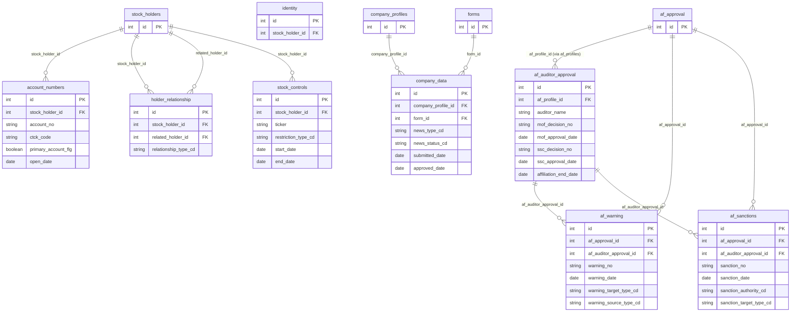
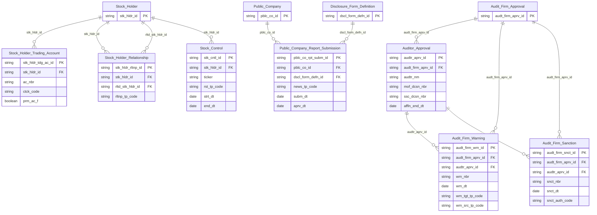

# IDS HLD — Tier 3

**Source system:** IDS (Information Disclosure System — Hệ thống Công bố Thông tin)
**Tier 3:** Các entity FK đến entity Tier 2. Gồm: entity con của Stock Holder (tài khoản giao dịch, quan hệ cổ đông, chứng khoán kiểm soát), entity con của Audit Firm Approval (kiểm toán viên, cảnh báo, xử phạt), entity Audit Firm Warning và Audit Firm Sanction (FK lưu song song đến Audit Firm Approval hoặc Auditor Approval), và Public Company Report Submission (FK đến Public Company + Disclosure Form Definition).

---

## 6a. Bảng tổng quan BCV Concept

| BCV Core Object | BCV Concept | Category | Source Table | Source Table Change Mode | Mô tả bảng nguồn | Atomic Entity | Table Type | BCV Term |
|---|---|---|---|---|---|---|---|---|
| Arrangement | [Arrangement] Account | Arrangement | `account_numbers` | Update | Tài khoản giao dịch chứng khoán của cổ đông tại các CTCK; một cổ đông có thể có nhiều tài khoản; có đánh dấu tài khoản chính. | Stock Holder Trading Account | Relative | (1) Term candidate: `[Arrangement] Account` — BCV mô tả tài khoản giao dịch là thỏa thuận/hợp đồng giữa cổ đông và CTCK. (2) Cấu trúc trường: account_no, ctck_code, primary_account_flg, open_date — đây là tài khoản giao dịch, là Arrangement giữa cổ đông và CTCK. (3) Chọn `[Arrangement] Account` — tài khoản chứng khoán là quan hệ hợp đồng dạng Account. Relative (FK đến Stock Holder). |
| Involved Party | [Involved Party] Involved Party Relationship | Involved Party | `holder_relationship` | Update | Mối quan hệ giữa các cổ đông giao dịch (vợ-chồng, cha-con, ủy quyền, sở hữu chéo); liên kết `stock_holder_id` và `related_holder_id`. | Stock Holder Relationship | Relative | (1) Term candidate: `[Involved Party] Involved Party Relationship` — BCV mô tả quan hệ giữa 2 Involved Party. (2) Cấu trúc trường: stock_holder_id, related_holder_id (self-ref trong bảng Stock Holder), relationship_type_cd — đây là quan hệ song phương giữa 2 cổ đông. (3) Chọn `[Involved Party] Involved Party Relationship` — holder_relationship mô tả quan hệ giữa các cổ đông. Relative (FK đến Stock Holder × 2). |
| Arrangement | [Arrangement] Ownership | Arrangement | `stock_controls` | Update | Chứng khoán của cổ đông bị đưa vào diện kiểm soát/hạn chế chuyển nhượng; phục vụ quản lý rủi ro và tuân thủ. | Stock Control | Relative | (1) Term candidate: `[Arrangement] Ownership` — BCV mô tả quan hệ sở hữu với ràng buộc hành chính. (2) Cấu trúc trường: stock_holder_id, ticker, restriction_type_cd, start_date, end_date — đây là trạng thái kiểm soát/hạn chế của từng mã CK gắn với cổ đông; có vòng đời riêng. (3) Chọn `[Arrangement] Ownership` — stock_controls là trạng thái sở hữu có ràng buộc. Relative (FK đến Stock Holder). |
| Documentation | [Documentation] Gov. Registration Document | Documentation | `af_auditor_approval` | Update | Kiểm toán viên được chấp thuận thuộc công ty kiểm toán; kèm quyết định chấp thuận/đình chỉ BTC + SSC ở cấp cá nhân; có ngày rời công ty. | Auditor Approval | Relative | (1) Term candidate: `[Documentation] Gov. Registration Document` — BCV mô tả văn bản pháp lý/hành chính do cơ quan nhà nước cấp cho cá nhân. (2) Cấu trúc trường: af_profile_id, auditor_name, mof_decision_no, mof_approval_date, ssc_decision_no, ssc_approval_date, affiliation_end_date — đây là quyết định chấp thuận hành chính ở cấp kiểm toán viên. (3) Chọn `[Documentation] Gov. Registration Document` — af_auditor_approval là văn bản hành chính tương tự Audit Firm Approval nhưng cấp cá nhân. Relative (FK đến Audit Firm Approval). |
| Business Activity | [Business Activity] Warning Notice | Business Activity | `af_warning` | Append | Văn bản nhắc nhở do BTC hoặc UBCKNN phát hành đối với công ty kiểm toán hoặc kiểm toán viên; FK loại trừ nhau (`af_approval_id` HOẶC `af_auditor_approval_id`). | Audit Firm Warning | Fact Append | (1) Term candidate: `[Business Activity] Warning Notice` — BCV mô tả hoạt động giám sát/cảnh báo phát sinh từ cơ quan quản lý. (2) Cấu trúc trường: warning_no, warning_date, warning_target_type_cd (công ty/KTV), warning_source_type_cd (BTC/UBCKNN), nội dung — đây là sự kiện nghiệp vụ giám sát insert-only. (3) Chọn `[Business Activity] Warning Notice` — af_warning là sự kiện giám sát/cảnh báo nghiệp vụ. Fact Append vì nguồn Append và mỗi văn bản nhắc nhở là 1 sự kiện độc lập. |
| Business Activity | [Business Activity] Enforcement Action | Business Activity | `af_sanctions` | Append | Quyết định xử phạt hành chính do BTC hoặc UBCKNN phát hành đối với công ty kiểm toán hoặc kiểm toán viên; FK loại trừ nhau. | Audit Firm Sanction | Fact Append | (1) Term candidate: `[Business Activity] Enforcement Action` — BCV mô tả hành động chế tài/xử phạt do cơ quan quản lý thực hiện. (2) Cấu trúc trường: sanction_no, sanction_date, sanction_target_type_cd, sanction_authority_cd, hình thức xử phạt, số tiền — đây là quyết định xử phạt nghiệp vụ, mỗi quyết định là 1 sự kiện độc lập. (3) Chọn `[Business Activity] Enforcement Action` — af_sanctions là hành động chế tài. Fact Append vì mỗi quyết định xử phạt là 1 occurrence insert-only. |
| Documentation | [Documentation] Filing | Documentation | `company_data` | Update | Lần nộp báo cáo/tin CBTT của công ty đại chúng; chỉ lấy bản ghi news_status_cd = 'APPROVED'; liên kết company_profile_id với form_id. | Public Company Report Submission | Relative | (1) Term candidate: `[Documentation] Filing` — BCV mô tả hồ sơ/báo cáo nộp chính thức lên cơ quan quản lý. (2) Cấu trúc trường: company_profile_id, form_id, news_type_cd, news_status_cd, submitted_date, approved_date — đây là hồ sơ nộp chính thức của CTĐC, liên kết CTĐC với form CBTT đã định nghĩa. (3) Chọn `[Documentation] Filing` — company_data là lần nộp tài liệu. Relative (FK đến Public Company và Disclosure Form Definition Tier 1). Filter: news_status_cd = 'APPROVED'. |

---

## 6b. Diagram Source (Mermaid)

---

## 6c. Diagram Atomic (Mermaid)

---

## 6d. Mục Danh mục & Tham chiếu (Reference Data)

| Source Field / Bảng | Mô tả | Scheme Code | source_type | Ghi chú |
|---|---|---|---|---|
| `holder_relationship.relationship_type_cd` | Loại quan hệ giữa cổ đông (vợ-chồng, cha-con, ủy quyền) | `IDS_HOLDER_RELATIONSHIP_TYPE` | source_table | Values load từ `lookup_values` |
| `stock_controls.restriction_type_cd` | Loại hạn chế chuyển nhượng chứng khoán | `IDS_STOCK_RESTRICTION_TYPE` | source_table | Values load từ `lookup_values` |
| `af_warning.warning_target_type_cd` | Đối tượng nhắc nhở (công ty KT / kiểm toán viên) | `IDS_WARNING_TARGET_TYPE` | source_table | Values load từ `lookup_values` |
| `af_warning.warning_source_type_cd` | Cơ quan nhắc nhở (BTC / UBCKNN) | `IDS_WARNING_SOURCE_TYPE` | source_table | Values load từ `lookup_values` |
| `af_sanctions.sanction_authority_cd` | Cơ quan xử phạt (BTC / UBCKNN) | `IDS_SANCTION_AUTHORITY` | source_table | Values load từ `lookup_values` |
| `af_sanctions.sanction_target_type_cd` | Đối tượng xử phạt (công ty KT / kiểm toán viên) | `IDS_SANCTION_TARGET_TYPE` | source_table | Values load từ `lookup_values` |
| `company_data.news_type_cd` | Loại tin CBTT | `IDS_NEWS_TYPE` | source_table | Scheme dùng chung với Disclosure Form Definition và Notifications |

---

## 6e. Bảng chờ thiết kế

*(Để trống — tất cả bảng Tier 3 đã có thông tin cột)*

---

## 6f. Điểm cần xác nhận

| # | Câu hỏi | Kết quả |
|---|---|---|
| T3-01 | `Audit Firm Warning` và `Audit Firm Sanction` có FK loại trừ nhau: một bản ghi chỉ thuộc về Audit Firm Approval (công ty) HOẶC Auditor Approval (KTV) — 1 trong 2 FK luôn NULL. Pattern này có phù hợp với Atomic model không? | Xác nhận chấp nhận — pattern này đã được ghi nhận trong IDS_Source_Analysis.md (mục 7.5, 7.6). Cả 2 FK giữ nguyên trên Atomic; ETL nhận diện target_type để populate đúng FK. |
| T3-02 | `Auditor Approval` FK đến `Audit Firm Approval` (chứ không phải trực tiếp đến `Audit Firm`/`af_profiles`) — vì af_auditor_approval.af_profile_id → qua af_approval. Cần verify dependency đúng là Tier 3. | Xác nhận — af_auditor_approval.af_profile_id → af_profiles (Tier 1), không FK đến af_approval trực tiếp ở nguồn. Tuy nhiên về logic nghiệp vụ, `Auditor Approval` cần biết `Audit Firm Approval` để xác định hồ sơ chấp thuận. Giữ ở Tier 3 (phụ thuộc Audit Firm qua af_profiles), `Audit Firm Warning/Sanction` ở cùng Tier 3. |
| T3-03 | `Public Company Report Submission` (company_data) filter `news_status_cd = 'APPROVED'` — các bản ghi PENDING/REJECTED không lên Atomic. Xác nhận scope filter này. | Xác nhận theo quyết định D-05 trong IDS_Source_Analysis.md mục 5.2. Chỉ APPROVED lên Atomic. |
| T3-04 | `company_data` FK đến `forms` (Disclosure Form Definition, Tier 1) → Public Company Report Submission là Relative của cả Public Company (Tier 1) VÀ Disclosure Form Definition (Tier 1). Dependency 2 Tier 1 → xếp Tier 3 là phù hợp (sau khi cả 2 anchor sẵn sàng). Xác nhận. | Xác nhận — Relative của 2 Tier 1. Tier 3 là hợp lý. |
| T3-05 | Source Change Mode của `company_data` = Update (hồ sơ CBTT có thể bị chỉnh sửa và phê duyệt lại). Table Type = Relative. Phù hợp (Update ↔ Relative). | Phù hợp. |
