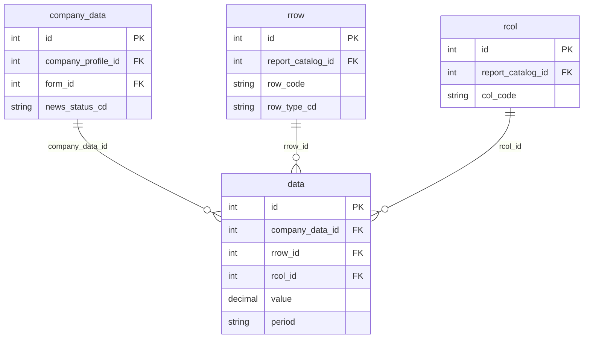
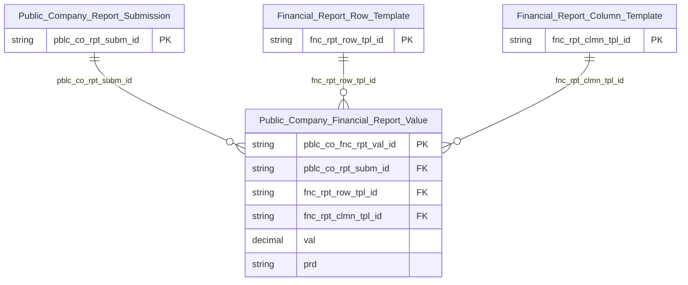

# IDS HLD — Tier 4

**Source system:** IDS (Information Disclosure System — Hệ thống Công bố Thông tin)
**Tier 4:** Entity FK đến entity Tier 3. Chỉ có 1 entity: `Public Company Financial Report Value` — FK đến `Public Company Report Submission` (Tier 3) và đến `Financial Report Row Template` + `Financial Report Column Template` (Tier 2). Entity này chứa dữ liệu giá trị ô BCTC thực tế.

---

## 6a. Bảng tổng quan BCV Concept

| BCV Core Object | BCV Concept | Category | Source Table | Source Table Change Mode | Mô tả bảng nguồn | Atomic Entity | Table Type | BCV Term |
|---|---|---|---|---|---|---|---|---|
| Documentation | [Documentation] Financial Statement | Documentation | `data` | Append | Dữ liệu giá trị hàng/cột báo cáo tài chính thực tế — mỗi bản ghi là 1 ô giao giữa (rrow, rcol) của 1 lần nộp BCTC; liên kết ngược qua `company_data`. | Public Company Financial Report Value | Fact Append | (1) Term candidate: `[Documentation] Financial Statement` — BCV mô tả báo cáo tài chính là tài liệu định kỳ ghi nhận giá trị tài chính. (2) Cấu trúc trường: company_data_id, rrow_id, rcol_id, value (số liệu ô tài chính), kỳ báo cáo — đây là dữ liệu giá trị thực tế của từng ô trong BCTC đã nộp chính thức; mỗi bản ghi = 1 ô. (3) Chọn `[Documentation] Financial Statement` — bảng `data` lưu nội dung số liệu BCTC thực tế đã được duyệt, là dữ liệu tài chính quan trọng cho Gold. Source Change Mode = Append + Table Type = Fact Append — phù hợp vì mỗi lần nộp BCTC tạo tập bản ghi mới, không sửa bản ghi cũ. |

---

## 6b. Diagram Source (Mermaid)

---

## 6c. Diagram Atomic (Mermaid)

---

## 6d. Mục Danh mục & Tham chiếu (Reference Data)

*(Không có scheme mới ở Tier 4 — bảng `data` chỉ có FK và trường giá trị số)*

---

## 6e. Bảng chờ thiết kế

*(Để trống)*

---

## 6f. Điểm cần xác nhận

| # | Câu hỏi | Kết quả |
|---|---|---|
| T4-01 | `data` (Public Company Financial Report Value) — Source Change Mode = Append và Table Type = Fact Append. Phù hợp — nguồn chỉ append khi nộp BCTC mới, Atomic insert-only. Xác nhận. | Xác nhận — phù hợp. |
| T4-02 | Grain của `Public Company Financial Report Value`: 1 dòng = 1 ô (rrow × rcol) của 1 lần nộp BCTC (`company_data`). Mỗi kỳ nộp tạo N×M bản ghi mới. PK bao gồm (company_data_id, rrow_id, rcol_id). Xác nhận grain. | Xác nhận grain. PK composite (pblc_co_rpt_subm_id, fnc_rpt_row_tpl_id, fnc_rpt_clmn_tpl_id) + surrogate key. |
| T4-03 | `data` FK đến cả Tier 2 (rrow, rcol) và Tier 3 (company_data) → đặt Tier 4 để đảm bảo dependency chain đúng. Xác nhận Tier 4 hợp lý. | Xác nhận — Tier 4 là đúng vì phụ thuộc Tier 3 (Public Company Report Submission). |
| T4-04 | Đây là entity duy nhất ở Tier 4. Sau Tier 4 không còn entity nào phụ thuộc thêm trong scope IDS. Xác nhận đây là Tier cuối cùng. | Xác nhận — IDS có 4 Tier. |
