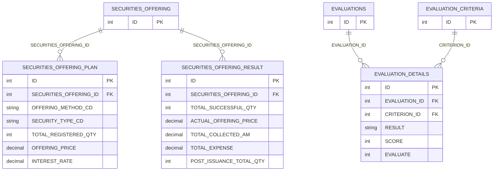
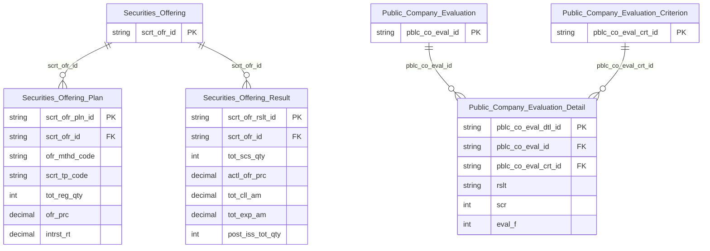

# IDS HLD — Tier 4

**Source system:** IDS (Information Disclosure System — Hệ thống Công bố Thông tin)
**Tier 4:** Các entity FK đến entity Tier 3. Gồm:
- Con của **Securities Offering** (T3): Securities Offering Plan, Securities Offering Result
- Con của **Public Company Evaluation** (T3) + **Public Company Evaluation Criterion** (T2): Public Company Evaluation Detail

Lưu ý: Một số entity ban đầu dự kiến ở Tier 4 được điều chỉnh về Tier thấp hơn sau khi phân tích FK:
- `Financial Report Data` (DATA): FK → REPORT_CATALOG (T1) + COMPANY_PROFILES (T1) → Tier 2
- `Disclosure Notification Recipient` (NOTIFICATIONS_DTL): FK → NOTIFICATIONS (T2) → Tier 3
- `Audit Firm Technical Audit` (AF_TECHNICAL_AUDIT): FK → AF_INSPECTION (T2) + AF_PROFILES (T1) → Tier 3

---

## 6a. Bảng tổng quan BCV Concept

| BCV Core Object | BCV Concept | Category | Source Table | Source Table Change Mode | Mô tả bảng nguồn | Atomic Entity | Table Type | BCV Term |
|---|---|---|---|---|---|---|---|---|
| Business Activity | [Business Activity] Business Activity | Business Activity | `SECURITIES_OFFERING_PLAN` | Update | Kế hoạch chi tiết chào bán chứng khoán: phương thức phân phối, loại CK, số lượng, giá, thời gian, điều kiện đặc thù theo loại CK (cổ phiếu/trái phiếu/quyền mua). | Securities Offering Plan | Relative | (1) Term candidate: gần nhất là `[Business Activity] Business Activity` — kế hoạch chào bán là activity con của hồ sơ phát hành CK. (2) Cấu trúc trường: 57 cột chi tiết kế hoạch (OFFERING_METHOD_CD, SECURITY_TYPE_CD, PAR_VALUE, TOTAL_REGISTERED_QTY, OFFERING_PRICE, thông tin trái phiếu INTEREST_RATE/BOND_TERM_VALUE, thông tin quyền mua EXERCISE_RATIO/EXERCISE_PERIOD). Grain = 1 kế hoạch chào bán của 1 hồ sơ. (3) Chọn `[Business Activity] Business Activity`. Relative (FK → Securities Offering T3). |
| Business Activity | [Business Activity] Business Activity | Business Activity | `SECURITIES_OFFERING_RESULT` | Update | Kết quả thực tế chào bán chứng khoán: số lượng thành công, giá thực tế, tổng giá trị huy động, phân chia trong nước/nước ngoài, chi phí phát hành (tư vấn, bảo lãnh, kiểm toán), số CK lưu hành sau phát hành. | Securities Offering Result | Fact Append | (1) Term candidate: `[Business Activity] Business Activity` — kết quả chào bán là outcome của hoạt động phát hành CK. (2) Cấu trúc trường: 65 cột kết quả (TOTAL_SUCCESSFUL_QTY, ACTUAL_OFFERING_PRICE, TOTAL_COLLECTED_AM, phân chia DOMESTIC/FOREIGN số lượng và giá trị, chi phí TOTAL_EXPENSE/UNDERWRITING_FEE/DISTRIBUTION_FEE/AUDIT_FEE, POST_ISSUANCE_TOTAL_QTY). Source Change Mode = Update nhưng về nghiệp vụ kết quả là event có thể chốt → xem điểm cần xác nhận T4-01. (3) Chọn `[Business Activity] Business Activity`. Fact Append tạm thời. |
| Business Activity | [Business Activity] Evaluation | Business Activity | `EVALUATION_DETAILS` | Update | Chi tiết từng chỉ tiêu trong kết quả đánh giá xếp hạng CTĐC: kết quả (RESULT), điểm (SCORE), cờ đánh giá (EVALUATE). Grain = 1 chỉ tiêu × 1 kỳ đánh giá × 1 công ty. | Public Company Evaluation Detail | Relative | (1) Term candidate: `[Business Activity] Evaluation` — chi tiết từng chỉ tiêu là thành phần của kết quả đánh giá tổng thể. (2) Cấu trúc trường: EVALUATION_ID (FK → EVALUATIONS T3), CRITERION_ID (FK → EVALUATION_CRITERIA T2), RESULT (VARCHAR500), SCORE (NUMBER), EVALUATE (cờ). Junction table với attribute nghiệp vụ (RESULT, SCORE). (3) Chọn `[Business Activity] Evaluation`. Relative (FK → Public Company Evaluation T3 + Public Company Evaluation Criterion T2). |

---

## 6b. Diagram Source (Mermaid)

---

## 6c. Diagram Atomic (Mermaid)

---

## 6d. Mục Danh mục & Tham chiếu (Reference Data)

| Source Field / Bảng | Mô tả | Scheme Code | source_type | Ghi chú |
|---|---|---|---|---|
| `SECURITIES_OFFERING_PLAN.OFFERING_METHOD_CD` | Phương thức chào bán (ra công chúng/riêng lẻ/quyền mua) | `IDS_SO_OFFERING_METHOD` | source_table | Values từ LOOKUP_VALUES (LOOKUP_GROUP = 'SO_OFFERING_METHOD'); dùng chung với SECURITIES_OFFERING_RESULT.OFFERING_METHOD_CD |
| `SECURITIES_OFFERING_PLAN.DISTRIBUTION_METHOD_CD` | Phương thức phân phối CK | `IDS_SO_DISTRIBUTION_METHOD` | source_table | Values từ LOOKUP_VALUES |
| `SECURITIES_OFFERING_PLAN.SECURITY_TYPE_CD` | Loại chứng khoán chào bán | `IDS_SECURITY_TYPE` | source_table | Dùng chung với SECURITIES_OFFERING_RESULT.SECURITY_TYPE_CD |
| `SECURITIES_OFFERING_PLAN.GUARANTEE_TYPE_CD` | Loại bảo lãnh phát hành | `IDS_SO_GUARANTEE_TYPE` | source_table | Values từ LOOKUP_VALUES |
| `SECURITIES_OFFERING_RESULT.APPROVAL_STATUS_CD` | Trạng thái phê duyệt kết quả chào bán | `IDS_SO_RESULT_APPROVAL_STATUS` | source_table | Values từ LOOKUP_VALUES |

---

## 6e. Bảng chờ thiết kế

*(Để trống — tất cả bảng Tier 4 đã có thông tin cột)*

---

## 6f. Điểm cần xác nhận

| # | Câu hỏi | Kết quả |
|---|---|---|
| T4-01 | `SECURITIES_OFFERING_RESULT` Source Change Mode = Update. Về nghiệp vụ, kết quả chào bán có thể được chỉnh sửa trước khi chốt chính thức. Table Type tạm là Fact Append — nếu thực tế cho phép cập nhật → đổi sang Relative (SCD2). | Cần xác nhận với nghiệp vụ/Data Engineer về khả năng sửa đổi kết quả sau khi ghi. |
| T4-02 | `EVALUATION_DETAILS.EVALUATION_ID` là trường FK trong DB nhưng trong BRD per-table YAML không được đánh dấu `key: FK`. Tương tự `CRITERION_ID`. Cần xác nhận FK này luôn khác NULL và join được với EVALUATIONS/EVALUATION_CRITERIA. | Cần xác nhận constraint tại DB nguồn. Nếu nullable → ETL phải xử lý orphan rows. |
| T4-03 | Sau khi điều chỉnh các entity (DATA → T2, NOTIFICATIONS_DTL → T3, AF_TECHNICAL_AUDIT → T3), Tier 4 còn 3 entity: Securities Offering Plan, Securities Offering Result, Public Company Evaluation Detail. Có nên gộp vào Tier 3 không? | Giữ Tier 4 riêng — dependency chain rõ ràng: T1 → T2 → T3(Securities Offering) → T4(Plan/Result). Tách giúp thể hiện độ phức tạp phân tầng. |
