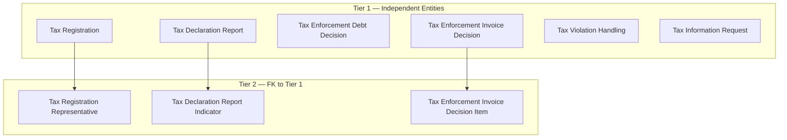

# KNT HLD — Overview

**Source system:** KNT (Dữ liệu trao đổi giữa UBCKNN và Tổng cục Thuế)
**Mô tả:** Hệ thống trao đổi dữ liệu giữa UBCKNN và Tổng cục Thuế (Cục Thuế)/Bộ Tài chính: đăng ký thuế của doanh nghiệp trên TTCK, báo cáo tài chính/tờ khai thuế, cưỡng chế nợ thuế/ngừng sử dụng hóa đơn, xử lý vi phạm pháp luật về thuế, danh sách doanh nghiệp rủi ro cao, trao đổi yêu cầu thông tin với Cục Thuế. Đợt thiết kế này đã xử lý 11/53 bảng nguồn theo yêu cầu (9 bảng đợt 1 + INFO_REQUEST_DETAIL, INVOICE_DETAIL đợt 2) — các bảng còn lại (báo cáo tổng hợp UBCKNN, xử phạt VPHC chứng khoán, thông tin công ty/kiểm toán, danh mục dùng chung, hạ tầng hệ thống...) đang được Data Modeler đánh giá, sẽ thiết kế ở đợt sau.

---

## Tổng quan Atomic Entities

| Tier | Atomic Entity | BCV Core Object | BCV Concept | table_type | Source Table(s) | Ghi chú |
|---|---|---|---|---|---|---|
| T1 | Tax Registration | Involved Party | [Involved Party] Organization | Fundamental | KNT.TAX_REGISTRATION_INFO | Tách IP Postal Address + IP Electronic Address. Denormalize `business_line_codes` ARRAY (từ TAX_REG_BUSINESS_LINE). |
| T1 | Tax Declaration Report | Documentation | [Documentation] Declaration Document | Fact Append | KNT.TAX_REPORT | — |
| T1 | Tax Enforcement Debt Decision | Documentation | [Documentation] Gov. Registration Document | Fact Append | KNT.TAX_ENFORCEMENT_DEBT | Nghi vấn liên kết logic với Tax Enforcement Invoice Decision — xem 7e#1. |
| T1 | Tax Enforcement Invoice Decision | Documentation | [Documentation] Gov. Registration Document | Fact Append | KNT.TAX_ENFORCEMENT_INVOICE | Bảng con INVOICE_DETAIL chưa thiết kế — xem 7e#4. |
| T1 | Tax Violation Handling | Business Activity | [Business Activity] Conduct Violation | Fact Append | KNT.TAX_VIOLATION_HANDLING | — |
| T1 | Tax Information Request | Communication | [Communication] Information Request | Fact Append | KNT.INFO_REQUEST_DETAIL | Liên kết ngầm qua TAX_CODE với Tax Registration. |
| T2 | Tax Registration Representative | Involved Party | [Involved Party] Designated Representative | Relative | KNT.TAX_REG_REPRESENTATIVE | FK Tax Registration. Tách IP Alt Identification + IP Electronic Address. |
| T2 | Tax Declaration Report Indicator | Documentation | [Documentation] Reported Information | Fact Append | KNT.TAX_REPORT_DETAIL | FK Tax Declaration Report. |
| T2 | Tax Enforcement Invoice Decision Item | Documentation | [Documentation] Invoice | Fact Append | KNT.INVOICE_DETAIL | FK Tax Enforcement Invoice Decision. |

**Tổng: 9 Atomic entities** (6 Tier 1, 3 Tier 2)
*(Trong đó: 0 entity mới hoàn toàn dùng shared entity — TAX_REG_ADDRESS_TYPE và TAX_REG_BUSINESS_LINE không tạo entity mới, xem 7d/7f)*

---

## Diagram Phân tầng Dependencies (Mermaid)

> `Tax Enforcement Debt Decision` ↔ `Tax Enforcement Invoice Decision` không có đường nối — chỉ nghi vấn liên kết qua business key (xem 7e#1), chưa xác nhận nên không dựng FK Atomic.

---

## Quyết định thiết kế chính

| # | Quyết định | Lý do |
|---|---|---|
| D-01 | `TAX_REG_ADDRESS_TYPE` không tạo Atomic entity riêng — map thẳng vào shared entity `IP Postal Address` + `IP Electronic Address` gắn với `Tax Registration`. | Bảng chỉ có 2 trường nghiệp vụ (TAX_CODE + loại địa chỉ) + dữ liệu địa chỉ/liên lạc thuần túy — đúng pattern Pure Junction + Shared Entity theo quy tắc dự án. |
| D-02 | `TAX_REG_BUSINESS_LINE` không tạo Atomic entity riêng — denormalize thành `business_line_codes ARRAY<Classification Value Code>` trên `Tax Registration`. | Pure junction giữa Tax Registration và danh mục ngành nghề (BUSINESS_LINE_CODE + NAME), không có attribute nghiệp vụ riêng. |
| D-03 | `TAX_ENFORCEMENT_DEBT` và `TAX_ENFORCEMENT_INVOICE` thiết kế thành 2 entity độc lập ở Tier 1, không dựng FK giữa chúng. | Không có FK vật lý; liên kết qua `BASIS_DECISION_NUMBER` chỉ là nghi vấn logic chưa xác nhận (xem 7e#1). |
| D-04 | `TAX_VIOLATION_HANDLING` phân vào BCO `Business Activity` (concept `Conduct Violation`) thay vì `Documentation`. | Nhất quán với precedent `NHNCK.VIOLATIONS` → `Securities Practitioner Conduct Violation` đã approved trong `atomic_entities.yaml`; trọng tâm dữ liệu là hành vi vi phạm + hậu quả xử lý (phạt/truy thu), không chỉ là văn bản quyết định. |
| D-05 | `TAX_ENFORCEMENT_DEBT`/`TAX_ENFORCEMENT_INVOICE` tái sử dụng BCV term `Gov. Registration Document` (đã dùng cho License Decision Document ở NHNCK) thay vì tạo term mới cho "Enforcement Decision". | BCV vocabulary (BIAN, gốc ngân hàng) không có term cho "tax enforcement/distraint" — đây là khoảng trống vốn có khi áp BCV ngân hàng cho dữ liệu cơ quan thuế. `Gov. Registration Document` là term generic nhất mô tả "văn bản do cơ quan có thẩm quyền ban hành xác định quyền/nghĩa vụ", khớp bản chất quyết định cưỡng chế. |
| D-06 | Đợt 1 chỉ thiết kế 9/53 bảng nguồn KNT; 44 bảng còn lại giữ `scope_status: pending` trong `brd_KNT.yaml`. | Theo yêu cầu — Data Modeler đang tự đánh giá các bảng còn lại, sẽ thiết kế ở đợt sau. |
| D-07 | Đợt 2 bổ sung `INFO_REQUEST_DETAIL` (Tier 1, BCO Communication, concept `Information Request`) và `INVOICE_DETAIL` (Tier 2, con của Tax Enforcement Invoice Decision, concept `Invoice`) — giải quyết điểm mở 7e cũ về INVOICE_DETAIL. | Theo yêu cầu thiết kế thêm — cả 2 bảng đã có đủ cấu trúc cột trong `KNT_Columns.csv` để thiết kế ngay. |

---

#### 7a. Bảng tổng quan Atomic entities

| Tier | BCV Core Object | BCV Concept | Category | Source Table | Source Table Change Mode | Mô tả bảng nguồn | Atomic Entity | Table Type | BCV Term |
|---|---|---|---|---|---|---|---|---|---|
| 1 | Involved Party | [Involved Party] Organization | Organization | TAX_REGISTRATION_INFO | Update | Thông tin đăng ký thuế do Cục Thuế cung cấp: địa chỉ, vốn điều lệ, người đại diện, trạng thái hoạt động, tạm ngừng kinh doanh | Tax Registration | Fundamental | Organization — hồ sơ đăng ký thuế của 1 doanh nghiệp/hộ kinh doanh trên TTCK. Tách IP Postal Address + IP Electronic Address. Denormalize business_line_codes ARRAY. |
| 1 | Documentation | [Documentation] Declaration Document | Declaration Document | TAX_REPORT | Append | Báo cáo tài chính do Cục Thuế cung cấp cho UBCKNN: thông tin tờ khai, kỳ kê khai, MST, thông tin kiểm toán | Tax Declaration Report | Fact Append | Declaration Document — tờ khai/báo cáo tài chính theo kỳ, mỗi lần nộp (kể cả bổ sung) là 1 bản ghi mới. |
| 1 | Documentation | [Documentation] Gov. Registration Document | Gov. Registration Document | TAX_ENFORCEMENT_DEBT | Append | Thông tin quyết định cưỡng chế nợ thuế do Cục Thuế ban hành: phương thức cưỡng chế, số tiền, tài sản kê biên | Tax Enforcement Debt Decision | Fact Append | Gov. Registration Document — quyết định hành chính cưỡng chế nợ thuế (kê biên tài sản/phong tỏa tài khoản). |
| 1 | Documentation | [Documentation] Gov. Registration Document | Gov. Registration Document | TAX_ENFORCEMENT_INVOICE | Append | Thông tin quyết định cưỡng chế ngừng sử dụng hóa đơn do Cục Thuế ban hành: số QĐ, đối tượng bị cưỡng chế, thời gian hiệu lực | Tax Enforcement Invoice Decision | Fact Append | Gov. Registration Document — quyết định hành chính cưỡng chế bằng biện pháp ngừng sử dụng hóa đơn. |
| 1 | Business Activity | [Business Activity] Conduct Violation | Conduct Violation | TAX_VIOLATION_HANDLING | Append | Thông tin xử lý vi phạm pháp luật về thuế do Cục Thuế cung cấp: số QĐ xử lý, tên đối tượng, kỳ thanh tra, tiền phạt | Tax Violation Handling | Fact Append | Conduct Violation — hành vi vi phạm pháp luật thuế và kết quả xử lý (phạt/truy thu). |
| 1 | Communication | [Communication] Information Request | Information Request | INFO_REQUEST_DETAIL | Append | Chi tiết yêu cầu thông tin từ Cục Thuế gửi UBCKNN: tên yêu cầu, MST, trạng thái xử lý | Tax Information Request | Fact Append | Information Request — 1 lần trao đổi yêu cầu thông tin từ Cục Thuế liên quan đến 1 doanh nghiệp. |
| 2 | Involved Party | [Involved Party] Designated Representative | Designated Representative | TAX_REG_REPRESENTATIVE | Update | Thông tin người đại diện/chủ hộ kinh doanh trong đăng ký thuế: họ tên, chức vụ, loại giấy tờ, số giấy tờ | Tax Registration Representative | Relative | Designated Representative — người đại diện pháp luật/chủ hộ kinh doanh của Tax Registration. Tách IP Alt Identification + IP Electronic Address. |
| 2 | Documentation | [Documentation] Reported Information | Reported Information | TAX_REPORT_DETAIL | Append | Chi tiết chỉ tiêu trong báo cáo tài chính từ Cục Thuế: giá trị đầu năm, cuối năm, năm nay, năm trước theo từng sheet | Tax Declaration Report Indicator | Fact Append | Reported Information — dòng chỉ tiêu con của Tax Declaration Report, phân loại theo SHEET_NAME (Classification Value). |
| 2 | Documentation | [Documentation] Invoice | Invoice | INVOICE_DETAIL | Append | Chi tiết hóa đơn trong thông tin cưỡng chế ngừng sử dụng hóa đơn do Cục Thuế cung cấp | Tax Enforcement Invoice Decision Item | Fact Append | Invoice — 1 hóa đơn cụ thể bị áp dụng biện pháp cưỡng chế ngừng sử dụng trong 1 Tax Enforcement Invoice Decision. |

#### 7b. Diagram Atomic tổng (Mermaid)

```mermaid
erDiagram
    Tax_Registration {
        bigint ds_tax_registration_id PK
        string tax_code
        string taxpayer_name
        string operation_status_code
    }
    Tax_Registration_Representative {
        bigint ds_tax_registration_representative_id PK
        bigint tax_registration_id FK
        string representative_name
    }
    Tax_Declaration_Report {
        bigint ds_tax_declaration_report_id PK
        string tax_code
        string declaration_code
    }
    Tax_Declaration_Report_Indicator {
        bigint ds_tax_declaration_report_indicator_id PK
        bigint tax_declaration_report_id FK
        string indicator_code
    }
    Tax_Enforcement_Debt_Decision {
        bigint ds_tax_enforcement_debt_decision_id PK
        string taxpayer_tax_code
        string decision_number
    }
    Tax_Enforcement_Invoice_Decision {
        bigint ds_tax_enforcement_invoice_decision_id PK
        string taxpayer_tax_code
        string decision_number
    }
    Tax_Violation_Handling {
        bigint ds_tax_violation_handling_id PK
        string tax_code
        string handling_decision_number
    }
    Tax_Information_Request {
        bigint ds_tax_information_request_id PK
        string tax_code
        string request_name
    }
    Tax_Enforcement_Invoice_Decision_Item {
        bigint ds_tax_enforcement_invoice_decision_item_id PK
        bigint tax_enforcement_invoice_decision_id FK
        string invoice_number
    }

    Tax_Registration ||--o{ Tax_Registration_Representative : "tax_registration_id"
    Tax_Declaration_Report ||--o{ Tax_Declaration_Report_Indicator : "tax_declaration_report_id"
    Tax_Enforcement_Invoice_Decision ||--o{ Tax_Enforcement_Invoice_Decision_Item : "tax_enforcement_invoice_decision_id"
```

#### 7c. Bảng Classification Value

| Source Table | Mô tả | BCV Term | Xử lý Atomic |
|---|---|---|---|
| TAX_REGISTRATION_INFO.OPERATION_STATUS | Trạng thái hoạt động doanh nghiệp (TrangThaiHoatDongEnum) | Classification Value | Scheme: `KNT_OPERATION_STATUS`. FK từ Tax Registration. |
| TAX_REGISTRATION_INFO.SUSPENSION_TYPE | Lý do ngừng hoạt động (LyDoNgungHoatDongEnum) | Classification Value | Scheme: `KNT_SUSPENSION_TYPE`. FK từ Tax Registration. |
| TAX_REG_BUSINESS_LINE (BUSINESS_LINE_CODE/NAME) | Ngành nghề kinh doanh của doanh nghiệp | Classification Value | Scheme: `KNT_BUSINESS_LINE`. Denormalize ARRAY trên Tax Registration — xem 7d. |
| TAX_REPORT.PERIOD_TYPE | Kiểu kỳ báo cáo (Năm/Bán niên/Quý/Tháng) | Classification Value | Scheme: `KNT_REPORT_PERIOD_TYPE`. FK từ Tax Declaration Report. |
| TAX_ENFORCEMENT_DEBT.ENFORCEMENT_METHOD_CODE/NAME, TAX_ENFORCEMENT_INVOICE.ENFORCEMENT_METHOD_CODE/NAME | Hình thức cưỡng chế | Classification Value | Scheme: `KNT_ENFORCEMENT_METHOD`. Dùng chung cho Tax Enforcement Debt Decision + Tax Enforcement Invoice Decision. |
| TAX_REPORT_DETAIL.SHEET_NAME | Loại sheet báo cáo tài chính (BCDKT/KQKD/LCTT...) | Classification Value | Scheme: `KNT_REPORT_SHEET`. FK từ Tax Declaration Report Indicator. |
| TAX_REG_REPRESENTATIVE.POSITION | Chức vụ/vai trò người đại diện | Classification Value | Scheme: `KNT_REPRESENTATIVE_POSITION`. FK từ Tax Registration Representative — cần profile dữ liệu trước LLD (xem 7e#5). |
| INFO_REQUEST_DETAIL.STATUS | Trạng thái phản hồi WebService (TrangThaiResponseWsEnum) | Classification Value | Scheme: `KNT_INFO_REQUEST_STATUS`. FK từ Tax Information Request. |
| INVOICE_DETAIL.INVOICE_TYPE | Loại hóa đơn bị cưỡng chế ngừng sử dụng | Classification Value | Scheme: `KNT_INVOICE_TYPE`. FK từ Tax Enforcement Invoice Decision Item — cần profile dữ liệu trước LLD. |
| TAX_REG_REPRESENTATIVE.ID_DOCUMENT_TYPE | Loại giấy tờ định danh người đại diện | Classification Value (dùng chung dự án) | Tái sử dụng scheme `IP_ALT_ID_TYPE` đã có — không tạo scheme mới. |
| TAX_REGISTRATION_INFO / TAX_REG_ADDRESS_TYPE / TAX_REG_REPRESENTATIVE (địa chỉ/điện thoại/fax/email) | Loại địa chỉ bưu chính / điện tử | Classification Value (dùng chung dự án) | Tái sử dụng scheme `IP_ADDR_TYPE` / `IP_ELEC_ADDR_TYPE` đã có — không tạo scheme mới. |

#### 7d. Junction Tables

| Source Table | Mô tả | Entity chính | Xử lý trên Atomic |
|---|---|---|---|
| TAX_REG_BUSINESS_LINE | Ngành nghề kinh doanh trong hồ sơ đăng ký thuế | Tax Registration | Pure junction (TAX_CODE + BUSINESS_LINE_CODE, không có attribute nghiệp vụ riêng) — denormalize thành `business_line_codes ARRAY<string>` trên entity Tax Registration. |

#### 7e. Điểm cần xác nhận

| # | Tier | Câu hỏi | Ảnh hưởng |
|---|---|---|---|
| 1 | T1 | `TAX_ENFORCEMENT_INVOICE.BASIS_DECISION_NUMBER` ("Căn cứ: số quyết định gốc") có phải luôn trỏ đến `TAX_ENFORCEMENT_DEBT.DECISION_NUMBER` không? | Nếu có → cần dựng liên kết logic (business key) giữa Tax Enforcement Debt Decision và Tax Enforcement Invoice Decision ở LLD. Hiện để 2 entity độc lập. |
| 2 | T1 | `TAX_REPORT` (báo cáo tài chính do Cục Thuế cung cấp) có trùng lặp nghiệp vụ với `SSC_REPORT` (báo cáo tài chính do UBCKNN tổng hợp gửi Cục Thuế/BTC — đang pending, chưa thiết kế) không? | Ảnh hưởng thiết kế khi SSC_REPORT được đánh giá ở đợt sau — có thể cần entity riêng biệt (2 chiều dữ liệu in/out) hoặc gộp. |
| 3 | T1 | `TAX_REGISTRATION_INFO` có trường địa chỉ/liên lạc inline (HQ_ADDRESS, PHONE, FAX, BUSINESS_*) trùng lặp ý nghĩa với `TAX_REG_ADDRESS_TYPE` (chi tiết theo loại). Nguồn nào authoritative cho IP Postal/Electronic Address? | Tạm nạp cả 2 nguồn (2 Address Type Code khác nhau) — cần Data Modeler xác nhận có dư thừa dữ liệu hay không trước khi LLD. |
| 4 | T2 | **[ĐÃ GIẢI QUYẾT]** `INVOICE_DETAIL` đã thiết kế thành "Tax Enforcement Invoice Decision Item" (Tier 2, FK Tax Enforcement Invoice Decision). | Không còn ảnh hưởng. |
| 5 | T2 | `TAX_REG_REPRESENTATIVE.POSITION` là free text hay có danh mục cố định? `TAX_REG_ADDRESS_TYPE`/`TAX_REG_BUSINESS_LINE` không có PK — grain (TAX_CODE, TYPE)/(TAX_CODE, BUSINESS_LINE_CODE) có đảm bảo unique không? | Cần profile dữ liệu thực tế trước khi thiết kế LLD (ảnh hưởng source_type của `KNT_REPRESENTATIVE_POSITION` và cách sinh khóa dòng shared entity). |

#### 7f. Bảng ngoài scope

| Nhóm | Source Table | Mô tả bảng nguồn | Lý do ngoài scope |
|---|---|---|---|
| Shared Entity | TAX_REG_ADDRESS_TYPE | Loại địa chỉ trong thông tin đăng ký thuế của doanh nghiệp (trụ sở/chi nhánh/địa điểm kinh doanh) | Không thiết kế Atomic entity riêng — ADDRESS/WARD/DISTRICT/PROVINCE/COUNTRY denormalize vào IP Postal Address, EMAIL/PHONE/FAX/WEBSITE denormalize vào IP Electronic Address, gắn với Tax Registration (cha). |
| Operational / System | MSG_PACKET | Gói tin trao đổi dữ liệu giữa UBCKNN và Cục Thuế/Bộ Tài chính (nội dung XML, trạng thái gửi/nhận) | Operational/system data — bảng quản lý lifecycle gói tin truyền nhận, không có giá trị nghiệp vụ. Là FK reference chung của toàn bộ entity Tier 1. |

<!--
GRAIN: 1 dòng = 1 bảng nguồn. KHÔNG gộp `table1, table2`.
GROUP: dùng từ danh sách chuẩn (xem reference/group_classification.md).
Lưu ý: 44 bảng KNT còn lại (scope_status: pending trong brd_KNT.yaml) KHÔNG liệt kê ở đây —
7f chỉ dành cho bảng đã xác nhận ngoài scope. Bảng pending sẽ được đánh giá và bổ sung
vào 7f (nếu ngoài scope) hoặc thiết kế Tier mới (nếu trong scope) ở đợt sau.
-->

---

## Entities

> Single source of truth cho metadata entity. `aggregate_atomic.py` parse section này để sinh `atomic_entities.yaml`.
> Format bắt buộc: heading `### N.` + dòng `**Description:**` trong 500 ký tự đầu tiên sau heading.

### 1. Tax Declaration Report
**Tier:** 1 | **Source:** `TAX_REPORT` | **BCV Concept:** [Documentation] Declaration Document | **BCO:** Documentation | **Table Type:** Fact Append
**Domain Prefix:** Tax Declaration Report
**Description:** Declaration Document — tờ khai/báo cáo tài chính do Cục Thuế cung cấp cho UBCKNN theo từng kỳ kê khai; mỗi lần nộp (kể cả bổ sung, xem attempt_count) là 1 bản ghi mới.

**Grain:** 1 dòng = 1 lần nộp tờ khai/báo cáo tài chính của 1 doanh nghiệp theo 1 kỳ kê khai.

**Attributes chính:** tax_code, declaration_code, declaration_type, period_type_code (Classification Value), declaration_period, attempt_count, audit_firm_tax_code, auditor_code.

### 2. Tax Enforcement Debt Decision
**Tier:** 1 | **Source:** `TAX_ENFORCEMENT_DEBT` | **BCV Concept:** [Documentation] Gov. Registration Document | **BCO:** Documentation | **Table Type:** Fact Append
**Domain Prefix:** Tax Enforcement
**Description:** Gov. Registration Document — quyết định cưỡng chế nợ thuế do Cục Thuế ban hành đối với doanh nghiệp trên thị trường chứng khoán: hình thức cưỡng chế, số tiền, tài sản kê biên.

**Grain:** 1 dòng = 1 quyết định cưỡng chế nợ thuế.

**Attributes chính:** taxpayer_tax_code, decision_number, decision_date, enforcement_method_code (Classification Value), enforced_amount, seized_assets, decision_effective_from/to.

### 3. Tax Enforcement Invoice Decision
**Tier:** 1 | **Source:** `TAX_ENFORCEMENT_INVOICE` | **BCV Concept:** [Documentation] Gov. Registration Document | **BCO:** Documentation | **Table Type:** Fact Append
**Domain Prefix:** Tax Enforcement
**Description:** Gov. Registration Document — quyết định cưỡng chế ngừng sử dụng hóa đơn do Cục Thuế ban hành đối với doanh nghiệp trên thị trường chứng khoán: số quyết định, thời gian hiệu lực.

**Grain:** 1 dòng = 1 quyết định cưỡng chế ngừng sử dụng hóa đơn.

**Attributes chính:** taxpayer_tax_code, decision_number, decision_date, enforcement_method_code (Classification Value), decision_effective_from/to, basis_decision_number.

### 4. Tax Information Request
**Tier:** 1 | **Source:** `INFO_REQUEST_DETAIL` | **BCV Concept:** [Communication] Information Request | **BCO:** Communication | **Table Type:** Fact Append
**Domain Prefix:** (none)
**Description:** Information Request — 1 lần trao đổi yêu cầu thông tin từ Cục Thuế gửi UBCKNN liên quan đến 1 doanh nghiệp, kèm trạng thái phản hồi WebService.

**Grain:** 1 dòng = 1 yêu cầu thông tin từ Cục Thuế.

**Attributes chính:** tax_code, request_name, status_code (Classification Value), status_description.

### 5. Tax Registration
**Tier:** 1 | **Source:** `TAX_REGISTRATION_INFO` | **BCV Concept:** [Involved Party] Organization | **BCO:** Involved Party | **Table Type:** Fundamental
**Domain Prefix:** Tax Registration
**Description:** Organization — hồ sơ đăng ký thuế của 1 doanh nghiệp/hộ kinh doanh trên thị trường chứng khoán do Cục Thuế cung cấp: địa chỉ, vốn điều lệ, người đại diện, trạng thái hoạt động, tạm ngừng kinh doanh.

**Grain:** 1 dòng = 1 doanh nghiệp/hộ kinh doanh đã đăng ký thuế (1 Involved Party).

**Attributes chính:** tax_code, taxpayer_name, charter_capital, operation_status_code (Classification Value), suspension_type_code (Classification Value), business_line_codes (ARRAY, từ TAX_REG_BUSINESS_LINE). Tách IP Postal Address + IP Electronic Address (từ HQ_ADDRESS/BUSINESS_* và TAX_REG_ADDRESS_TYPE).

### 6. Tax Violation Handling
**Tier:** 1 | **Source:** `TAX_VIOLATION_HANDLING` | **BCV Concept:** [Business Activity] Conduct Violation | **BCO:** Business Activity | **Table Type:** Fact Append
**Domain Prefix:** (none)
**Description:** Conduct Violation — thông tin xử lý vi phạm pháp luật về thuế do Cục Thuế cung cấp: số quyết định xử lý, kỳ thanh tra, số tiền phạt và truy thu.

**Grain:** 1 dòng = 1 quyết định xử lý vi phạm pháp luật thuế.

**Attributes chính:** tax_code, handling_decision_number, decision_type, decision_date, violation_fine_amount, admin_violation_fine_amount, tax_recovery_amount, total_fine_amount.

### 7. Tax Declaration Report Indicator
**Tier:** 2 | **Source:** `TAX_REPORT_DETAIL` | **BCV Concept:** [Documentation] Reported Information | **BCO:** Documentation | **Table Type:** Fact Append
**Domain Prefix:** Tax Declaration Report
**Description:** Reported Information — dòng chỉ tiêu chi tiết trong 1 Tax Declaration Report: giá trị đầu năm, cuối năm, năm nay, năm trước theo từng loại sheet báo cáo tài chính.

**Grain:** 1 dòng = 1 chỉ tiêu trong 1 sheet của 1 báo cáo tài chính.

**Attributes chính:** tax_declaration_report_id (FK), indicator_code, indicator_name, sheet_type_code (Classification Value), year_begin_value, year_end_value, current_year_value, prior_year_value.

### 8. Tax Enforcement Invoice Decision Item
**Tier:** 2 | **Source:** `INVOICE_DETAIL` | **BCV Concept:** [Documentation] Invoice | **BCO:** Documentation | **Table Type:** Fact Append
**Domain Prefix:** Tax Enforcement Invoice Decision
**Description:** Invoice — 1 hóa đơn cụ thể bị áp dụng biện pháp cưỡng chế ngừng sử dụng, thuộc 1 Tax Enforcement Invoice Decision.

**Grain:** 1 dòng = 1 hóa đơn trong 1 quyết định cưỡng chế ngừng sử dụng hóa đơn.

**Attributes chính:** tax_enforcement_invoice_decision_id (FK), invoice_template_symbol, invoice_symbol, invoice_number, invoice_type_code (Classification Value).

### 9. Tax Registration Representative
**Tier:** 2 | **Source:** `TAX_REG_REPRESENTATIVE` | **BCV Concept:** [Involved Party] Designated Representative | **BCO:** Involved Party | **Table Type:** Relative
**Domain Prefix:** Tax Registration
**Description:** Designated Representative — người đại diện theo pháp luật/chủ hộ kinh doanh của 1 hồ sơ Tax Registration: họ tên, chức vụ, giấy tờ định danh.

**Grain:** 1 dòng = 1 người đại diện của 1 hồ sơ đăng ký thuế (1 Involved Party).

**Attributes chính:** tax_registration_id (FK), representative_name, position_code (Classification Value). Tách IP Alt Identification (id_document_type/number/issue_date) + IP Electronic Address (phone/fax/email).
