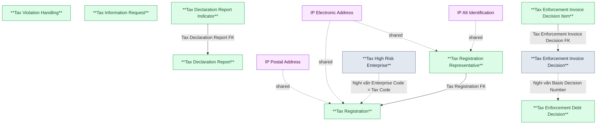

# KNT — HLD Overview: Toàn cảnh thiết kế Atomic Layer

> **Nguồn:** Hệ thống KNT — Dữ liệu trao đổi giữa UBCKNN và Tổng cục Thuế (Cục Thuế)/Bộ Tài chính (Oracle)
>
> **Phạm vi:** Đăng ký thuế doanh nghiệp trên TTCK, báo cáo tài chính/tờ khai thuế, cưỡng chế nợ thuế/ngừng sử dụng hóa đơn, xử lý vi phạm pháp luật về thuế, giám sát doanh nghiệp rủi ro cao, trao đổi yêu cầu thông tin với Cục Thuế. Đã xử lý 12/53 bảng nguồn — các bảng còn lại (báo cáo tổng hợp UBCKNN, xử phạt VPHC chứng khoán, thông tin công ty/kiểm toán, danh mục dùng chung, hạ tầng hệ thống...) đang được Data Modeler đánh giá, sẽ thiết kế ở đợt sau.
>
> **File chi tiết theo tầng:**
> - [KNT_HLD_Tier1.md](KNT_HLD_Tier1.md) — Tax Registration, Tax Declaration Report, Tax Enforcement Debt Decision, Tax Enforcement Invoice Decision, Tax Violation Handling, Tax Information Request, Tax High Risk Enterprise
> - [KNT_HLD_Tier2.md](KNT_HLD_Tier2.md) — Tax Registration Representative, Tax Declaration Report Indicator, Tax Enforcement Invoice Decision Item (TAX_REG_ADDRESS_TYPE, TAX_REG_BUSINESS_LINE denormalize vào shared entity / ARRAY trên Tax Registration — không tạo entity riêng)

---

#### 7a. Bảng tổng quan Atomic entities

| Tier | BCV Core Object | BCV Concept | Category | Source Table | Source Table Change Mode | Mô tả bảng nguồn | Atomic Entity | Table Type | BCV Term |
|---|---|---|---|---|---|---|---|---|---|
| 1 | Involved Party | [Involved Party] Organization | Organization | TAX_REGISTRATION_INFO | Update | Thông tin đăng ký thuế do Cục Thuế cung cấp: địa chỉ, vốn điều lệ, người đại diện, trạng thái hoạt động, tạm ngừng kinh doanh | Tax Registration | Fundamental | Organization — hồ sơ đăng ký thuế của 1 doanh nghiệp/hộ kinh doanh trên TTCK. Tách IP Postal Address + IP Electronic Address. Denormalize business_line_codes ARRAY. |
| 1 | Documentation | [Documentation] Declaration Document | Declaration Document | TAX_REPORT | Append | Báo cáo tài chính do Cục Thuế cung cấp cho UBCKNN: thông tin tờ khai, kỳ kê khai, MST, thông tin kiểm toán | Tax Declaration Report | Fact Append | Declaration Document — tờ khai/báo cáo tài chính theo kỳ, mỗi lần nộp (kể cả bổ sung) là 1 bản ghi mới. |
| 1 | Documentation | [Documentation] Gov. Registration Document | Gov. Registration Document | TAX_ENFORCEMENT_DEBT | Append | Thông tin quyết định cưỡng chế nợ thuế do Cục Thuế ban hành: phương thức cưỡng chế, số tiền, tài sản kê biên | Tax Enforcement Debt Decision | Fact Append | Gov. Registration Document — quyết định hành chính cưỡng chế nợ thuế (kê biên tài sản/phong tỏa tài khoản). |
| 1 | Documentation | [Documentation] Gov. Registration Document | Gov. Registration Document | TAX_ENFORCEMENT_INVOICE | Append | Thông tin quyết định cưỡng chế ngừng sử dụng hóa đơn do Cục Thuế ban hành: số QĐ, đối tượng bị cưỡng chế, thời gian hiệu lực | Tax Enforcement Invoice Decision | Fact Append | Gov. Registration Document — quyết định hành chính cưỡng chế bằng biện pháp ngừng sử dụng hóa đơn. |
| 1 | Business Activity | [Business Activity] Conduct Violation | Conduct Violation | TAX_VIOLATION_HANDLING | Append | Thông tin xử lý vi phạm pháp luật về thuế do Cục Thuế cung cấp: số QĐ xử lý, tên đối tượng, kỳ thanh tra, tiền phạt | Tax Violation Handling | Fact Append | Conduct Violation — hành vi vi phạm pháp luật thuế và kết quả xử lý (phạt/truy thu). |
| 1 | Communication | [Communication] Information Request | Information Request | INFO_REQUEST_DETAIL | Append | Chi tiết yêu cầu thông tin từ Cục Thuế gửi UBCKNN: tên yêu cầu, MST, trạng thái xử lý | Tax Information Request | Fact Append | Information Request — 1 lần trao đổi yêu cầu thông tin từ Cục Thuế liên quan đến 1 doanh nghiệp. |
| 1 | Communication | [Communication] Risk Assessment | Risk Assessment | HIGH_RISK_ENTERPRISE | N/A (chưa định nghĩa) | Danh sách doanh nghiệp rủi ro cao về thuế do Cục Thuế cung cấp: MST, tên, địa chỉ, cơ quan thuế quản lý, năm đánh giá | Tax High Risk Enterprise | Fact Snapshot | Risk Assessment — Cục Thuế công bố/đánh giá 1 DN thuộc diện rủi ro cao theo từng năm đánh giá (RISK_ASSESSMENT_YEAR), giữ lịch sử qua các kỳ. |
| 2 | Involved Party | [Involved Party] Designated Representative | Designated Representative | TAX_REG_REPRESENTATIVE | Update | Thông tin người đại diện/chủ hộ kinh doanh trong đăng ký thuế: họ tên, chức vụ, loại giấy tờ, số giấy tờ | Tax Registration Representative | Relative | Designated Representative — người đại diện pháp luật/chủ hộ kinh doanh của Tax Registration. Tách IP Alt Identification + IP Electronic Address. |
| 2 | Documentation | [Documentation] Reported Information | Reported Information | TAX_REPORT_DETAIL | Append | Chi tiết chỉ tiêu trong báo cáo tài chính từ Cục Thuế: giá trị đầu năm, cuối năm, năm nay, năm trước theo từng sheet | Tax Declaration Report Indicator | Fact Append | Reported Information — dòng chỉ tiêu con của Tax Declaration Report, phân loại theo SHEET_NAME (Classification Value). |
| 2 | Documentation | [Documentation] Invoice | Invoice | INVOICE_DETAIL | Append | Chi tiết hóa đơn trong thông tin cưỡng chế ngừng sử dụng hóa đơn do Cục Thuế cung cấp | Tax Enforcement Invoice Decision Item | Fact Append | Invoice — 1 hóa đơn cụ thể bị áp dụng biện pháp cưỡng chế ngừng sử dụng trong 1 Tax Enforcement Invoice Decision. |

---

#### 7b. Diagram Atomic tổng (Mermaid)

---

#### 7c. Bảng Classification Value

| Source Table | Mô tả | BCV Term | Xử lý Atomic |
|---|---|---|---|
| TAX_REGISTRATION_INFO.OPERATION_STATUS | Trạng thái hoạt động doanh nghiệp (TrangThaiHoatDongEnum) | Classification Value | Scheme: `KNT_OPERATION_STATUS`. FK từ Tax Registration. |
| TAX_REGISTRATION_INFO.SUSPENSION_TYPE | Lý do ngừng hoạt động (LyDoNgungHoatDongEnum) | Classification Value | Scheme: `KNT_SUSPENSION_TYPE`. FK từ Tax Registration. |
| TAX_REG_BUSINESS_LINE (BUSINESS_LINE_CODE/NAME) | Ngành nghề kinh doanh của doanh nghiệp | Classification Value | Scheme: `KNT_BUSINESS_LINE`. Denormalize ARRAY trên Tax Registration — xem 7d. |
| TAX_REPORT.PERIOD_TYPE | Kiểu kỳ báo cáo (Năm/Bán niên/Quý/Tháng) | Classification Value | Scheme: `KNT_REPORT_PERIOD_TYPE`. FK từ Tax Declaration Report. |
| TAX_ENFORCEMENT_DEBT.ENFORCEMENT_METHOD_CODE/NAME, TAX_ENFORCEMENT_INVOICE.ENFORCEMENT_METHOD_CODE/NAME | Hình thức cưỡng chế | Classification Value | Scheme: `KNT_ENFORCEMENT_METHOD`. Dùng chung cho Tax Enforcement Debt Decision + Tax Enforcement Invoice Decision. |
| TAX_REPORT_DETAIL.SHEET_NAME | Loại sheet báo cáo tài chính (BCDKT/KQKD/LCTT...) | Classification Value | Scheme: `KNT_REPORT_SHEET`. FK từ Tax Declaration Report Indicator. |
| TAX_REG_REPRESENTATIVE.POSITION | Chức vụ/vai trò người đại diện | Classification Value | Scheme: `KNT_REPRESENTATIVE_POSITION`. FK từ Tax Registration Representative — cần profile dữ liệu trước LLD (xem 7e#5). |
| INFO_REQUEST_DETAIL.STATUS | Trạng thái phản hồi WebService (TrangThaiResponseWsEnum) | Classification Value | Scheme: `KNT_INFO_REQUEST_STATUS`. FK từ Tax Information Request. |
| INVOICE_DETAIL.INVOICE_TYPE | Loại hóa đơn bị cưỡng chế ngừng sử dụng | Classification Value | Scheme: `KNT_INVOICE_TYPE`. FK từ Tax Enforcement Invoice Decision Item — cần profile dữ liệu trước LLD. |
| TAX_REG_REPRESENTATIVE.ID_DOCUMENT_TYPE | Loại giấy tờ định danh người đại diện | Classification Value (dùng chung dự án) | Tái sử dụng scheme `IP_ALT_ID_TYPE` đã có — không tạo scheme mới. |
| TAX_REGISTRATION_INFO / TAX_REG_ADDRESS_TYPE / TAX_REG_REPRESENTATIVE (địa chỉ/điện thoại/fax/email) | Loại địa chỉ bưu chính / điện tử | Classification Value (dùng chung dự án) | Tái sử dụng scheme `IP_ADDR_TYPE` / `IP_ELEC_ADDR_TYPE` đã có — không tạo scheme mới. |

---

#### 7d. Junction Tables

| Source Table | Mô tả | Entity chính | Xử lý trên Atomic |
|---|---|---|---|
| TAX_REG_BUSINESS_LINE | Ngành nghề kinh doanh trong hồ sơ đăng ký thuế | Tax Registration | Pure junction (TAX_CODE + BUSINESS_LINE_CODE, không có attribute nghiệp vụ riêng) — denormalize thành `business_line_codes ARRAY<string>` trên entity Tax Registration. |

---

#### 7e. Điểm cần xác nhận

| # | Tier | Câu hỏi | Ảnh hưởng |
|---|---|---|---|
| 1 | 1 | `TAX_ENFORCEMENT_INVOICE.BASIS_DECISION_NUMBER` ("Căn cứ: số quyết định gốc") có phải luôn trỏ đến `TAX_ENFORCEMENT_DEBT.DECISION_NUMBER` không? | Nếu có → cần dựng liên kết logic (business key) giữa Tax Enforcement Debt Decision và Tax Enforcement Invoice Decision ở LLD. Hiện để 2 entity độc lập. |
| 2 | 1 | `TAX_REPORT` (báo cáo tài chính do Cục Thuế cung cấp) có trùng lặp nghiệp vụ với `SSC_REPORT` (báo cáo tài chính do UBCKNN tổng hợp gửi Cục Thuế/BTC — đang pending, chưa thiết kế) không? | Ảnh hưởng thiết kế khi SSC_REPORT được đánh giá ở đợt sau — có thể cần entity riêng biệt (2 chiều dữ liệu in/out) hoặc gộp. |
| 3 | 1 | `TAX_REGISTRATION_INFO` có trường địa chỉ/liên lạc inline (HQ_ADDRESS, PHONE, FAX, BUSINESS_*) trùng lặp ý nghĩa với `TAX_REG_ADDRESS_TYPE` (chi tiết theo loại). Nguồn nào authoritative cho IP Postal/Electronic Address? | Tạm nạp cả 2 nguồn (2 Address Type Code khác nhau) — cần Data Modeler xác nhận có dư thừa dữ liệu hay không trước khi LLD. |
| 4 | 2 | **[ĐÃ GIẢI QUYẾT]** `INVOICE_DETAIL` đã thiết kế thành "Tax Enforcement Invoice Decision Item" (Tier 2, FK Tax Enforcement Invoice Decision). | Không còn ảnh hưởng. |
| 5 | 2 | `TAX_REG_REPRESENTATIVE.POSITION` là free text hay có danh mục cố định? `TAX_REG_ADDRESS_TYPE`/`TAX_REG_BUSINESS_LINE` không có PK — grain (TAX_CODE, TYPE)/(TAX_CODE, BUSINESS_LINE_CODE) có đảm bảo unique không? | Cần profile dữ liệu thực tế trước khi thiết kế LLD (ảnh hưởng source_type của `KNT_REPRESENTATIVE_POSITION` và cách sinh khóa dòng shared entity). |
| 6 | 1 | `HIGH_RISK_ENTERPRISE.ENTERPRISE_CODE` ("Mã số doanh nghiệp đăng ký kinh doanh") có cùng giá trị với `TAX_REGISTRATION_INFO.TAX_CODE` không? | Nếu có → dựng liên kết logic (business key) giữa `Tax High Risk Enterprise` và `Tax Registration` ở LLD. Hiện thiết kế 2 entity độc lập, không liên kết. |
| 7 | 1 | `HIGH_RISK_ENTERPRISE` không có `ingestion.data_change_mode` khai báo trong `brd_KNT.yaml` (khác 6 bảng còn lại của Tier 1). `MANAGING_TAX_AUTHORITY` là free text hay trùng danh mục `CAT_ORG_UNIT` (KNT-REF, đang pending)? | Cần bổ sung `ingestion` vào `brd_KNT.yaml` và profile dữ liệu trước LLD. Tạm xếp Table Type = Fact Snapshot theo bản chất "danh mục theo kỳ". |

---

#### 7f. Bảng ngoài scope

| Nhóm | Source Table | Mô tả bảng nguồn | Lý do ngoài scope |
|---|---|---|---|
| Shared Entity | TAX_REG_ADDRESS_TYPE | Loại địa chỉ trong thông tin đăng ký thuế của doanh nghiệp (trụ sở/chi nhánh/địa điểm kinh doanh) | Không thiết kế Atomic entity riêng — ADDRESS/WARD/DISTRICT/PROVINCE/COUNTRY denormalize vào IP Postal Address, EMAIL/PHONE/FAX/WEBSITE denormalize vào IP Electronic Address, gắn với Tax Registration (cha). |
| Operational / System | MSG_PACKET | Gói tin trao đổi dữ liệu giữa UBCKNN và Cục Thuế/Bộ Tài chính (nội dung XML, trạng thái gửi/nhận) | Operational/system data — bảng quản lý lifecycle gói tin truyền nhận, không có giá trị nghiệp vụ. Là FK reference chung của toàn bộ entity Tier 1. |

---

## Entities

> Single source of truth cho metadata entity. `aggregate_atomic.py` parse section này để sinh `atomic_entities.yaml`.

> Format bắt buộc: heading `### N.` + dòng `**Description:**` trong 500 ký tự đầu tiên sau heading.

### 1. Tax Declaration Report
**Tier:** 1 | **Source:** `TAX_REPORT` | **BCV Concept:** [Documentation] Declaration Document | **BCO:** Documentation | **Table Type:** Fact Append
**Description:** Tờ khai/báo cáo tài chính do Cục Thuế cung cấp cho UBCKNN theo từng kỳ kê khai. Ghi nhận mã/loại tờ khai, kỳ kê khai, số lần nộp (kể cả bổ sung — attempt_count) và thông tin kiểm toán liên quan.

### 2. Tax Enforcement Debt Decision
**Tier:** 1 | **Source:** `TAX_ENFORCEMENT_DEBT` | **BCV Concept:** [Documentation] Gov. Registration Document | **BCO:** Documentation | **Table Type:** Fact Append
**Description:** Quyết định cưỡng chế nợ thuế do Cục Thuế ban hành đối với doanh nghiệp trên TTCK. Ghi nhận số quyết định, hình thức cưỡng chế, số tiền cưỡng chế và tài sản kê biên.

### 3. Tax Enforcement Invoice Decision
**Tier:** 1 | **Source:** `TAX_ENFORCEMENT_INVOICE` | **BCV Concept:** [Documentation] Gov. Registration Document | **BCO:** Documentation | **Table Type:** Fact Append
**Description:** Quyết định cưỡng chế ngừng sử dụng hóa đơn do Cục Thuế ban hành đối với doanh nghiệp trên TTCK. Ghi nhận số quyết định và thời gian hiệu lực. Nghi vấn liên kết logic với Tax Enforcement Debt Decision qua Basis Decision Number — xem 7e#1.

### 3b. Tax High Risk Enterprise — MỚI (2026-07-16)
**Tier:** 1 | **Source:** `HIGH_RISK_ENTERPRISE` | **BCV Concept:** [Communication] Risk Assessment | **BCO:** Communication | **Table Type:** Fact Snapshot
**Description:** Danh sách doanh nghiệp bị Cục Thuế đánh giá/công bố thuộc diện rủi ro cao về thuế theo từng năm đánh giá. Ghi nhận mã/tên DN, địa chỉ trụ sở, cơ quan thuế quản lý và năm đánh giá — cùng 1 DN có thể xuất hiện lại ở nhiều năm khác nhau. Xem 7e #6, #7.

### 4. Tax Information Request
**Tier:** 1 | **Source:** `INFO_REQUEST_DETAIL` | **BCV Concept:** [Communication] Information Request | **BCO:** Communication | **Table Type:** Fact Append
**Description:** 1 lần trao đổi yêu cầu thông tin từ Cục Thuế gửi UBCKNN liên quan đến 1 doanh nghiệp, kèm trạng thái phản hồi WebService.

### 5. Tax Registration
**Tier:** 1 | **Source:** `TAX_REGISTRATION_INFO` | **BCV Concept:** [Involved Party] Organization | **BCO:** Involved Party | **Table Type:** Fundamental
**Description:** Hồ sơ đăng ký thuế của 1 doanh nghiệp/hộ kinh doanh trên TTCK do Cục Thuế cung cấp: địa chỉ, vốn điều lệ, người đại diện, trạng thái hoạt động, tạm ngừng kinh doanh. Tách IP Postal Address + IP Electronic Address; denormalize business_line_codes ARRAY.

### 6. Tax Violation Handling
**Tier:** 1 | **Source:** `TAX_VIOLATION_HANDLING` | **BCV Concept:** [Business Activity] Conduct Violation | **BCO:** Business Activity | **Table Type:** Fact Append
**Description:** Thông tin xử lý vi phạm pháp luật về thuế do Cục Thuế cung cấp: số quyết định xử lý, kỳ thanh tra, số tiền phạt và truy thu.

### 7. Tax Declaration Report Indicator
**Tier:** 2 | **Source:** `TAX_REPORT_DETAIL` | **BCV Concept:** [Documentation] Reported Information | **BCO:** Documentation | **Table Type:** Fact Append
**Description:** Dòng chỉ tiêu chi tiết trong 1 Tax Declaration Report: giá trị đầu năm, cuối năm, năm nay, năm trước theo từng loại sheet báo cáo tài chính. FK đến Tax Declaration Report.

### 8. Tax Enforcement Invoice Decision Item
**Tier:** 2 | **Source:** `INVOICE_DETAIL` | **BCV Concept:** [Documentation] Invoice | **BCO:** Documentation | **Table Type:** Fact Append
**Description:** 1 hóa đơn cụ thể bị áp dụng biện pháp cưỡng chế ngừng sử dụng, thuộc 1 Tax Enforcement Invoice Decision.

### 9. Tax Registration Representative
**Tier:** 2 | **Source:** `TAX_REG_REPRESENTATIVE` | **BCV Concept:** [Involved Party] Designated Representative | **BCO:** Involved Party | **Table Type:** Relative
**Description:** Người đại diện theo pháp luật/chủ hộ kinh doanh của 1 hồ sơ Tax Registration: họ tên, chức vụ, giấy tờ định danh. Tách IP Alt Identification + IP Electronic Address. FK đến Tax Registration.
