# KNT HLD — Tier 1

**Source system:** KNT (Dữ liệu trao đổi giữa UBCKNN và Tổng cục Thuế — Cơ quan Thuế)
**Tier 1:** Entity độc lập, không FK vật lý đến bảng nghiệp vụ nào khác trong scope (chỉ FK đến `MSG_PACKET` — bảng kỹ thuật gói tin trao đổi, ngoài scope). Liên kết với nhau (nếu có) chỉ qua business key (TAX_CODE) dạng text, không phải FK vật lý.

---

## 6a. Bảng tổng quan BCV Concept

| BCV Core Object | BCV Concept | Category | Source Table | Mô tả bảng nguồn | Atomic Entity | table_type | BCV Term |
|---|---|---|---|---|---|---|---|
| Involved Party | [Involved Party] Organization | Organization | TAX_REGISTRATION_INFO | Thông tin đăng ký thuế do Cục Thuế cung cấp: địa chỉ, vốn điều lệ, người đại diện, trạng thái hoạt động, tạm ngừng kinh doanh | Tax Registration | Fundamental | (1) Tra `terms.csv` không có term "Taxpayer"/"Tax Registration" trực tiếp — candidate gần nhất "Organization" (Involved Party, term chuẩn cho mọi tổ chức được theo dõi). (2) Cấu trúc trường: TAX_CODE + TAXPAYER_NAME + địa chỉ + vốn điều lệ + trạng thái hoạt động — đúng là hồ sơ 1 tổ chức (grain = 1 Involved Party), không phải 1 document rời rạc. (3) Chọn `[Involved Party] Organization` — nhất quán với thiết kế nháp trước đó của nguồn này (Atomic_LinhLV, bcv_concept "[Involved Party] Organization" cho THONG_TIN_DK_THUE). |
| Documentation | [Documentation] Declaration Document | Declaration Document | TAX_REPORT | Báo cáo tài chính do Cục Thuế cung cấp cho UBCKNN: thông tin tờ khai, kỳ kê khai, MST, thông tin kiểm toán | Tax Declaration Report | Fact Append | (1) Term "Declaration Document" (Documentation, id 9305) — "tờ khai" nộp cho cơ quan quản lý. (2) Cấu trúc trường: DECLARATION_CODE/NAME/TYPE, DECLARATION_PERIOD, ATTEMPT_COUNT (số lần nộp/bổ sung) — đúng bản chất 1 lần nộp tờ khai/báo cáo tài chính theo kỳ. (3) Chọn `[Documentation] Declaration Document` vì khớp cấu trúc; không dùng "Regulatory Report" (9297) vì đó là báo cáo do chính FI lập, còn đây là tờ khai nộp lên cơ quan thuế. |
| Documentation | [Documentation] Gov. Registration Document | Gov. Registration Document | TAX_ENFORCEMENT_DEBT | Thông tin quyết định cưỡng chế nợ thuế do Cục Thuế ban hành: phương thức cưỡng chế, số tiền, tài sản kê biên | Tax Enforcement Debt Decision | Fact Append | (1) BCV không có term "Tax Enforcement"/"Debt Collection Order" (đã tra "enforcement", "distraint", "levy", "garnishment", "seizure" — không có kết quả trong terms.csv, đây là khoảng trống vốn có của BCV ngành ngân hàng khi áp cho dữ liệu cơ quan thuế). (2) Cấu trúc trường: DECISION_NUMBER + DECISION_DATE + hiệu lực từ/đến — là 1 quyết định hành chính do cơ quan có thẩm quyền ban hành, xác định nghĩa vụ/quyền của đối tượng giữ. (3) Tái sử dụng term "Gov. Registration Document" (đã dùng cho các quyết định hành chính khác trong dự án, VD "Securities Practitioner License Decision Document") — mô tả BCV "issued by a principality/sovereignty... define rights or responsibilities" khớp bản chất quyết định cưỡng chế. |
| Documentation | [Documentation] Gov. Registration Document | Gov. Registration Document | TAX_ENFORCEMENT_INVOICE | Thông tin quyết định cưỡng chế ngừng sử dụng hóa đơn do Cục Thuế ban hành: số QĐ, đối tượng bị cưỡng chế, thời gian hiệu lực | Tax Enforcement Invoice Decision | Fact Append | (1)+(2)+(3) giống TAX_ENFORCEMENT_DEBT — cùng là quyết định cưỡng chế do Cục Thuế ban hành, chỉ khác biện pháp (ngừng sử dụng hóa đơn thay vì kê biên tài sản/phong tỏa tài khoản). |
| Business Activity | [Business Activity] Conduct Violation | Conduct Violation | TAX_VIOLATION_HANDLING | Thông tin xử lý vi phạm pháp luật về thuế do Cục Thuế cung cấp: số QĐ xử lý, tên đối tượng, kỳ thanh tra, tiền phạt | Tax Violation Handling | Fact Append | (1) Term "Conduct Violation" (Business Activity, id 7881): "a Business Activity that breaches a business code of conduct" — đã dùng chính xác cho NHNCK.VIOLATIONS (atomic_entities.yaml: "Securities Practitioner Conduct Violation"). (2) Cấu trúc trường: HANDLING_DECISION_NUMBER + DECISION_TYPE + VIOLATION_FINE + TAX_RECOVERY_AMOUNT — ghi nhận hành vi vi phạm pháp luật thuế và kết quả xử lý (phạt/truy thu), đúng bản chất "vi phạm quy tắc" mở rộng sang pháp luật thuế. (3) Chọn `[Business Activity] Conduct Violation` để nhất quán với precedent NHNCK, thay vì phân vào Documentation vì trọng tâm dữ liệu là hành vi + hậu quả xử lý, không chỉ là văn bản quyết định. |
| Communication | [Communication] Information Request | Information Request | INFO_REQUEST_DETAIL | Chi tiết yêu cầu thông tin từ Cục Thuế gửi UBCKNN: tên yêu cầu, MST, trạng thái xử lý | Tax Information Request | Fact Append | (1) Term "Information Request" (Communication, id 8606): "Identifies any request for information" — khớp trực tiếp ý nghĩa REQUEST_NAME (tên loại yêu cầu thông tin từ Cục Thuế). (2) Cấu trúc trường: REQUEST_NAME + STATUS/STATUS_DESCRIPTION (kết quả phản hồi WebService) + TAX_CODE (đối tượng liên quan) — đúng bản chất 1 lần trao đổi yêu cầu thông tin, không phải danh mục hay entity Involved Party. (3) Chọn `[Communication] Information Request` — match chính xác cả tên lẫn cấu trúc, không cần xem xét term khác. |

**Ghi chú Source Table Change Mode** (từ `brd_KNT.yaml → content.ingestion.data_change_mode`):

| Source Table | Source Table Change Mode | Đối chiếu Table Type |
|---|---|---|
| TAX_REGISTRATION_INFO | Update | Update + Fundamental → phù hợp (SCD4A xử lý update tại chỗ). |
| TAX_REPORT | Append | Append + Fact Append → phù hợp. |
| TAX_ENFORCEMENT_DEBT | Append | Append + Fact Append → phù hợp. |
| TAX_ENFORCEMENT_INVOICE | Append | Append + Fact Append → phù hợp. |
| TAX_VIOLATION_HANDLING | Append | Append + Fact Append → phù hợp. |
| INFO_REQUEST_DETAIL | Append | Append + Fact Append → phù hợp. |

---

## 6b. Diagram Source (Mermaid)

```mermaid
erDiagram
    TAX_REGISTRATION_INFO {
        number ID PK
        varchar2 TAX_CODE
        varchar2 TAXPAYER_NAME
        varchar2 OPERATION_STATUS
        varchar2 SUSPENSION_TYPE
    }

    TAX_REPORT {
        number ID PK
        varchar2 TAX_CODE
        varchar2 DECLARATION_CODE
        varchar2 PERIOD_TYPE
        number ATTEMPT_COUNT
    }

    TAX_ENFORCEMENT_DEBT {
        number ID PK
        varchar2 TAXPAYER_TAX_CODE
        varchar2 DECISION_NUMBER
        varchar2 ENFORCEMENT_METHOD_CODE
    }

    TAX_ENFORCEMENT_INVOICE {
        number ID PK
        varchar2 TAXPAYER_TAX_CODE
        varchar2 DECISION_NUMBER
        varchar2 BASIS_DECISION_NUMBER
    }

    TAX_VIOLATION_HANDLING {
        number ID PK
        varchar2 TAX_CODE
        varchar2 HANDLING_DECISION_NUMBER
        varchar2 VIOLATION_FINE
    }

    INFO_REQUEST_DETAIL {
        number ID PK
        varchar2 TAX_CODE
        varchar2 REQUEST_NAME
        number STATUS
    }
```

> Không vẽ FK vật lý giữa 6 bảng — liên kết với nhau (nếu có) chỉ qua `TAX_CODE`/`TAXPAYER_TAX_CODE` dạng business key (text), không phải FK ID. Xem mục 6f về nghi vấn liên kết `TAX_ENFORCEMENT_DEBT` ↔ `TAX_ENFORCEMENT_INVOICE` qua `BASIS_DECISION_NUMBER`. Tất cả 6 bảng đều FK đến `MSG_PACKET` (ngoài scope — bảng kỹ thuật quản lý gói tin truyền nhận), không vẽ trong diagram.

---

## 6c. Diagram Atomic (Mermaid)

```mermaid
erDiagram
    Tax_Registration {
        bigint ds_tax_registration_id PK
        string tax_code
        string taxpayer_name
        string operation_status_code
        string business_line_codes
    }

    Tax_Declaration_Report {
        bigint ds_tax_declaration_report_id PK
        string tax_code
        string declaration_code
        string period_type_code
        int attempt_count
    }

    Tax_Enforcement_Debt_Decision {
        bigint ds_tax_enforcement_debt_decision_id PK
        string taxpayer_tax_code
        string decision_number
        string enforcement_method_code
    }

    Tax_Enforcement_Invoice_Decision {
        bigint ds_tax_enforcement_invoice_decision_id PK
        string taxpayer_tax_code
        string decision_number
    }

    Tax_Violation_Handling {
        bigint ds_tax_violation_handling_id PK
        string tax_code
        string handling_decision_number
        decimal violation_fine_amount
    }

    Tax_Information_Request {
        bigint ds_tax_information_request_id PK
        string tax_code
        string request_name
        string status_code
    }
```

> 6 entity độc lập ở Tier 1 — không có quan hệ FK Atomic nào giữa chúng (liên kết theo `tax_code` chỉ mang tính phân tích/join logic, không dựng thành FK ràng buộc).

---

## 6d. Mục Danh mục & Tham chiếu (Reference Data)

| Source Field / Bảng | Mô tả | Scheme Code | source_type | Ghi chú |
|---|---|---|---|---|
| TAX_REGISTRATION_INFO.OPERATION_STATUS | Trạng thái hoạt động DN (TrangThaiHoatDongEnum) | `KNT_OPERATION_STATUS` | source_table | 0/4=Đang hoạt động, 1=Ngừng HĐ đã hoàn thành thủ tục MST, 3=Ngừng HĐ chưa hoàn thành thủ tục MST, 5=Ngừng KD có thời hạn, 6=Không HĐ tại địa chỉ ĐK |
| TAX_REGISTRATION_INFO.SUSPENSION_TYPE | Lý do ngừng hoạt động (LyDoNgungHoatDongEnum) | `KNT_SUSPENSION_TYPE` | source_table | 1=Giải thể, 2=Phá sản, 3=Chuyển đổi loại hình |
| TAX_REPORT.PERIOD_TYPE | Kiểu kỳ báo cáo | `KNT_REPORT_PERIOD_TYPE` | source_table | Y=Năm, H=Bán niên, Q=Quý, M=Tháng |
| TAX_ENFORCEMENT_DEBT.ENFORCEMENT_METHOD_CODE/NAME, TAX_ENFORCEMENT_INVOICE.ENFORCEMENT_METHOD_CODE/NAME | Hình thức cưỡng chế (dùng chung cho cả 2 loại quyết định cưỡng chế) | `KNT_ENFORCEMENT_METHOD` | source_table | Cần profile giá trị distinct từ 2 bảng để gộp thành 1 scheme dùng chung |
| TAX_REGISTRATION_INFO (HQ_ADDRESS, BUSINESS_*) | Địa chỉ/liên lạc của Tax Registration (grain = 1 Involved Party) | `IP_ADDR_TYPE` / `IP_ELEC_ADDR_TYPE` | etl_derived | Tái sử dụng scheme toàn dự án đã có (HEAD_OFFICE/BUSINESS cho address; PHONE_BUSINESS/EMAIL_BUSINESS/FAX_BUSINESS cho electronic address) — không tạo scheme mới |
| INFO_REQUEST_DETAIL.STATUS | Trạng thái phản hồi WebService (TrangThaiResponseWsEnum) | `KNT_INFO_REQUEST_STATUS` | source_table | 1=Thành công, 2=Không thành công, 3=Lỗi webservice |

---

## 6e. Bảng chờ thiết kế

*(Không có ở Tier 1 — các bảng phụ thuộc Tier 1 nhưng chưa thiết kế được ghi nhận ở mục 6e của KNT_HLD_Tier2.md)*

---

## 6f. Điểm cần xác nhận

| # | Câu hỏi | Kết quả |
|---|---|---|
| T1-01 | `TAX_ENFORCEMENT_INVOICE.BASIS_DECISION_NUMBER` ("Căn cứ: số quyết định gốc") có phải luôn trỏ đến `TAX_ENFORCEMENT_DEBT.DECISION_NUMBER` không, hay có thể trỏ đến quyết định khác (VD: quyết định truy thu thuế gốc không nằm trong scope hiện tại)? | Chưa xác nhận — hiện để 2 entity độc lập không liên kết Atomic, chỉ ghi nhận nghi vấn. |
| T1-02 | `TAX_REPORT` (báo cáo tài chính do Cục Thuế cung cấp) có trùng lặp nghiệp vụ với `SSC_REPORT` (báo cáo tài chính do UBCKNN tổng hợp từ IDS/SCMS/FMS gửi Cục Thuế/BTC — đang pending) không? Đây có phải 2 chiều dữ liệu khác nhau (in/out) của cùng 1 báo cáo? | Chưa xác nhận — `SSC_REPORT` thuộc nhóm bảng người dùng đang tự đánh giá, chưa thiết kế. |
| T1-03 | `TAX_REGISTRATION_INFO` có các trường địa chỉ/liên lạc inline (HQ_ADDRESS, PHONE, FAX, BUSINESS_ADDRESS_DESC, BUSINESS_PHONE...) trùng lặp về ý nghĩa với `TAX_REG_ADDRESS_TYPE` (Tier 2 — chi tiết địa chỉ theo loại, có EMAIL/PHONE/FAX/WEBSITE riêng). Nguồn nào là authoritative để nạp vào shared entity IP Postal Address / IP Electronic Address? | Chưa xác nhận — tạm thời nạp cả 2 nguồn vào shared entity (mỗi nguồn 1 `Address Type Code`/`Electronic Address Type Code` khác nhau: BUSINESS/HEAD_OFFICE từ TAX_REGISTRATION_INFO trực tiếp so với theo TYPE cụ thể từ TAX_REG_ADDRESS_TYPE), cần Data Modeler xác nhận có dư thừa dữ liệu hay không. |
