# KNT HLD — Tier 1

**Source system:** KNT (Dữ liệu trao đổi giữa UBCKNN và Tổng cục Thuế — Cơ quan Thuế)
**Tier 1:** Entity độc lập, không FK vật lý đến bảng nghiệp vụ nào khác trong scope (chỉ FK đến `MSG_PACKET` — bảng kỹ thuật gói tin trao đổi, ngoài scope). Liên kết với nhau (nếu có) chỉ qua business key (TAX_CODE) dạng text, không phải FK vật lý.

---

## 6a. Bảng tổng quan BCV Concept

| BCV Core Object | BCV Concept | Category | Source Table | Mô tả bảng nguồn | Atomic Entity | table_type | BCV Term |
|---|---|---|---|---|---|---|---|
| Involved Party | [Involved Party] Organization | Organization | TAX_REGISTRATION_INFO | Thông tin đăng ký thuế do Cục Thuế cung cấp: địa chỉ, vốn điều lệ, người đại diện, trạng thái hoạt động, tạm ngừng kinh doanh | External Tax Registration | Fundamental | (1) Tra `terms.csv` không có term "Taxpayer"/"Tax Registration" trực tiếp — candidate gần nhất "Organization" (Involved Party, term chuẩn cho mọi tổ chức được theo dõi). (2) Cấu trúc trường: TAX_CODE + TAXPAYER_NAME + địa chỉ + vốn điều lệ + trạng thái hoạt động — đúng là hồ sơ 1 tổ chức (grain = 1 Involved Party), không phải 1 document rời rạc. (3) Chọn `[Involved Party] Organization` — nhất quán với thiết kế nháp trước đó của nguồn này (Atomic_LinhLV, bcv_concept "[Involved Party] Organization" cho THONG_TIN_DK_THUE). Domain Prefix = `External Tax` (áp dụng chung cho toàn nhóm 10 entity nguồn KNT — quyết định Data Modeler 2026-07-19). |
| Documentation | [Documentation] Declaration Document | Declaration Document | TAX_REPORT | Báo cáo tài chính do Cục Thuế cung cấp cho UBCKNN: thông tin tờ khai, kỳ kê khai, MST, thông tin kiểm toán | External Tax Declaration Report | Fact Append | (1) Term "Declaration Document" (Documentation, id 9305) — "tờ khai" nộp cho cơ quan quản lý. (2) Cấu trúc trường: DECLARATION_CODE/NAME/TYPE, DECLARATION_PERIOD, ATTEMPT_COUNT (số lần nộp/bổ sung) — đúng bản chất 1 lần nộp tờ khai/báo cáo tài chính theo kỳ. (3) Chọn `[Documentation] Declaration Document` vì khớp cấu trúc; không dùng "Regulatory Report" (9297) vì đó là báo cáo do chính FI lập, còn đây là tờ khai nộp lên cơ quan thuế. |
| Documentation | [Documentation] Gov. Registration Document | Gov. Registration Document | TAX_ENFORCEMENT_DEBT | Thông tin quyết định cưỡng chế nợ thuế do Cục Thuế ban hành: phương thức cưỡng chế, số tiền, tài sản kê biên | External Tax Enforcement Debt Decision | Fact Append | (1) BCV không có term "Tax Enforcement"/"Debt Collection Order" (đã tra "enforcement", "distraint", "levy", "garnishment", "seizure" — không có kết quả trong terms.csv, đây là khoảng trống vốn có của BCV ngành ngân hàng khi áp cho dữ liệu cơ quan thuế). (2) Cấu trúc trường: DECISION_NUMBER + DECISION_DATE + hiệu lực từ/đến — là 1 quyết định hành chính do cơ quan có thẩm quyền ban hành, xác định nghĩa vụ/quyền của đối tượng giữ. (3) Tái sử dụng term "Gov. Registration Document" (đã dùng cho các quyết định hành chính khác trong dự án, VD "Securities Practitioner License Decision Document") — mô tả BCV "issued by a principality/sovereignty... define rights or responsibilities" khớp bản chất quyết định cưỡng chế. |
| Documentation | [Documentation] Gov. Registration Document | Gov. Registration Document | TAX_ENFORCEMENT_INVOICE | Thông tin quyết định cưỡng chế ngừng sử dụng hóa đơn do Cục Thuế ban hành: số QĐ, đối tượng bị cưỡng chế, thời gian hiệu lực | External Tax Enforcement Invoice Decision | Fact Append | (1)+(2)+(3) giống TAX_ENFORCEMENT_DEBT — cùng là quyết định cưỡng chế do Cục Thuế ban hành, chỉ khác biện pháp (ngừng sử dụng hóa đơn thay vì kê biên tài sản/phong tỏa tài khoản). |
| Documentation | [Documentation] Gov. Registration Document | Gov. Registration Document | TAX_VIOLATION_HANDLING | Thông tin xử lý vi phạm pháp luật về thuế do Cục Thuế cung cấp: số QĐ xử lý, tên đối tượng, kỳ thanh tra, tiền phạt | External Tax Violation Handling | Fact Append | (1) **[ĐÃ ĐIỀU CHỈNH — quyết định Data Modeler 2026-07-19]** BCO đổi từ Business Activity sang Documentation. Term trước "Conduct Violation" (Business Activity, id 7881) bị loại vì trọng tâm dữ liệu là 1 văn bản quyết định hành chính, không phải bản thân hành vi. (2) Cấu trúc trường: HANDLING_DECISION_NUMBER + DECISION_TYPE + VIOLATION_FINE + TAX_RECOVERY_AMOUNT — cùng cấu trúc "quyết định hành chính do cơ quan có thẩm quyền ban hành, xác định nghĩa vụ" như TAX_ENFORCEMENT_DEBT/TAX_ENFORCEMENT_INVOICE (đều có DECISION_NUMBER + DECISION_TYPE). (3) Chọn `[Documentation] Gov. Registration Document` — nhất quán với 2 entity quyết định cưỡng chế cùng nguồn KNT, thay vì `[Business Activity] Conduct Violation` (đã dùng cho NHNCK.VIOLATIONS, ngữ cảnh khác: ghi nhận hành vi vi phạm quy tắc hành nghề, không phải văn bản quyết định xử phạt hành chính về thuế). |
| Communication | [Communication] Information Request | Information Request | INFO_REQUEST_DETAIL | Chi tiết yêu cầu thông tin từ Cục Thuế gửi UBCKNN: tên yêu cầu, MST, trạng thái xử lý | External Tax Information Request | Fact Append | (1) Term "Information Request" (Communication, id 8606): "Identifies any request for information" — khớp trực tiếp ý nghĩa REQUEST_NAME (tên loại yêu cầu thông tin từ Cục Thuế). (2) Cấu trúc trường: REQUEST_NAME + STATUS/STATUS_DESCRIPTION (kết quả phản hồi WebService) + TAX_CODE (đối tượng liên quan) — đúng bản chất 1 lần trao đổi yêu cầu thông tin, không phải danh mục hay entity Involved Party. (3) Chọn `[Communication] Information Request` — match chính xác cả tên lẫn cấu trúc, không cần xem xét term khác. |
| Business Activity | [Business Activity] Involved Party Rating Activity | Rating Activity | HIGH_RISK_ENTERPRISE | Danh sách doanh nghiệp rủi ro cao về thuế do Cục Thuế cung cấp: MST, tên, địa chỉ, cơ quan thuế quản lý, năm đánh giá | External Tax High Risk Enterprise | Fact Append | (1) **[ĐÃ ĐIỀU CHỈNH — quyết định Data Modeler 2026-07-19]** BCO đổi từ Communication sang Business Activity; Table Type đổi từ Fact Snapshot sang Fact Append; Source Table Change Mode xác nhận = Append (bổ sung `ingestion` vào `brd_KNT.yaml`). Term mới "Involved Party Rating Activity" (Business Activity, id 7865): "Identifies a Rating Activity in which a rating is determined for an Involved Party" — khớp trực tiếp việc Cục Thuế xác định/xếp hạng 1 doanh nghiệp (Involved Party) vào diện rủi ro cao. Term cũ "Risk Assessment" (Communication, id 8765) bị loại vì đây không phải 1 lần trao đổi/thông báo (như Information Request) mà là hoạt động đánh giá/xếp hạng có kết quả gắn liền với đối tượng được đánh giá. (2) Cấu trúc trường: ENTERPRISE_CODE + ENTERPRISE_NAME + HQ_ADDRESS (thông tin DN, denormalized) + MANAGING_TAX_AUTHORITY (cơ quan ban hành đánh giá) + RISK_ASSESSMENT_YEAR (kỳ đánh giá) — mỗi dòng là 1 lần Cục Thuế thực hiện hoạt động xếp hạng/đánh giá 1 DN rủi ro cao trong 1 năm. (3) Table Type = Fact Append vì nguồn ghi nhận theo Change Mode Append (mỗi lần đánh giá là 1 bản ghi mới, không update tại chỗ) — khớp với bản chất "occurrence" của 1 Rating Activity, không phải "danh mục theo kỳ" cần giữ nguyên khái niệm Snapshot. |

**Ghi chú Source Table Change Mode** (từ `brd_KNT.yaml → content.ingestion.data_change_mode`):

| Source Table | Source Table Change Mode | Đối chiếu Table Type |
|---|---|---|
| TAX_REGISTRATION_INFO | Update | Update + Fundamental → phù hợp (SCD4A xử lý update tại chỗ). |
| TAX_REPORT | Append | Append + Fact Append → phù hợp. |
| TAX_ENFORCEMENT_DEBT | Append | Append + Fact Append → phù hợp. |
| TAX_ENFORCEMENT_INVOICE | Append | Append + Fact Append → phù hợp. |
| TAX_VIOLATION_HANDLING | Append | Append + Fact Append → phù hợp. |
| INFO_REQUEST_DETAIL | Append | Append + Fact Append → phù hợp. |
| HIGH_RISK_ENTERPRISE | Append | Append + Fact Append → phù hợp. **[ĐÃ GIẢI QUYẾT 2026-07-19]** Đã bổ sung `ingestion.data_change_mode: Append` vào `brd_KNT.yaml`; Table Type đổi từ Fact Snapshot sang Fact Append cho khớp — xem 6f T1-04. |

---

## 6b. Diagram Source (Mermaid)

```mermaid
erDiagram
    TAX_REGISTRATION_INFO {
        number ID PK
        varchar2 TAX_CODE
        varchar2 TAXPAYER_NAME
        varchar2 OPERATION_STATUS
        varchar2 SUSPENSION_TYPE
    }

    TAX_REPORT {
        number ID PK
        varchar2 TAX_CODE
        varchar2 DECLARATION_CODE
        varchar2 PERIOD_TYPE
        number ATTEMPT_COUNT
    }

    TAX_ENFORCEMENT_DEBT {
        number ID PK
        varchar2 TAXPAYER_TAX_CODE
        varchar2 DECISION_NUMBER
        varchar2 ENFORCEMENT_METHOD_CODE
    }

    TAX_ENFORCEMENT_INVOICE {
        number ID PK
        varchar2 TAXPAYER_TAX_CODE
        varchar2 DECISION_NUMBER
        varchar2 BASIS_DECISION_NUMBER
    }

    TAX_VIOLATION_HANDLING {
        number ID PK
        varchar2 TAX_CODE
        varchar2 HANDLING_DECISION_NUMBER
        varchar2 VIOLATION_FINE
    }

    INFO_REQUEST_DETAIL {
        number ID PK
        varchar2 TAX_CODE
        varchar2 REQUEST_NAME
        number STATUS
    }

    HIGH_RISK_ENTERPRISE {
        number ID PK
        varchar2 ENTERPRISE_CODE
        varchar2 ENTERPRISE_NAME
        varchar2 RISK_ASSESSMENT_YEAR
    }
```

> Không vẽ FK vật lý giữa 7 bảng — liên kết với nhau (nếu có) chỉ qua `TAX_CODE`/`TAXPAYER_TAX_CODE`/`ENTERPRISE_CODE` dạng business key (text), không phải FK ID. Xem mục 6f về nghi vấn liên kết `TAX_ENFORCEMENT_DEBT` ↔ `TAX_ENFORCEMENT_INVOICE` qua `BASIS_DECISION_NUMBER`, và `HIGH_RISK_ENTERPRISE.ENTERPRISE_CODE` ↔ `TAX_REGISTRATION_INFO.TAX_CODE` (T1-05). Tất cả 7 bảng đều FK đến `MSG_PACKET` (ngoài scope — bảng kỹ thuật quản lý gói tin truyền nhận), không vẽ trong diagram.

---

## 6c. Diagram Atomic (Mermaid)

```mermaid
erDiagram
    External_Tax_Registration {
        bigint ds_et_registration_id PK
        string tax_code
        string taxpayer_name
        string operation_status_code
        string business_line_codes
    }

    External_Tax_Declaration_Report {
        bigint ds_et_declaration_report_id PK
        string tax_code
        string declaration_code
        string period_type_code
        int attempt_count
    }

    External_Tax_Enforcement_Debt_Decision {
        bigint ds_et_enforcement_debt_decision_id PK
        string taxpayer_tax_code
        string decision_number
        string enforcement_method_code
    }

    External_Tax_Enforcement_Invoice_Decision {
        bigint ds_et_enforcement_invoice_decision_id PK
        string taxpayer_tax_code
        string decision_number
    }

    External_Tax_Violation_Handling {
        bigint ds_et_violation_handling_id PK
        string tax_code
        string handling_decision_number
        decimal violation_fine_amount
    }

    External_Tax_Information_Request {
        bigint ds_et_information_request_id PK
        string tax_code
        string request_name
        string status_code
    }

    External_Tax_High_Risk_Enterprise {
        bigint ds_et_high_risk_enterprise_id PK
        string enterprise_code
        string enterprise_name
        string hq_address
        string managing_tax_authority
        string risk_assessment_year
    }
```

> 7 entity độc lập ở Tier 1 — không có quan hệ FK Atomic nào giữa chúng (liên kết theo `tax_code`/`enterprise_code` chỉ mang tính phân tích/join logic, không dựng thành FK ràng buộc).
>
> **Domain Prefix = `External Tax`** cho toàn bộ 10 entity nguồn KNT (Tier 1 + Tier 2) — quyết định Data Modeler 2026-07-19. Abbreviation `et` đã đăng ký vào `system/rules/rule_domain_prefix_abbreviations.csv`. `entity_physical_name` = `et_` + full_words(BCV Term), ví dụ `External Tax Registration` → `et_registration`.

---

## 6d. Mục Danh mục & Tham chiếu (Reference Data)

| Source Field / Bảng | Mô tả | Scheme Code | source_type | Ghi chú |
|---|---|---|---|---|
| TAX_REGISTRATION_INFO.OPERATION_STATUS | Trạng thái hoạt động DN (TrangThaiHoatDongEnum) | `KNT_OPERATION_STATUS` | source_table | 0/4=Đang hoạt động, 1=Ngừng HĐ đã hoàn thành thủ tục MST, 3=Ngừng HĐ chưa hoàn thành thủ tục MST, 5=Ngừng KD có thời hạn, 6=Không HĐ tại địa chỉ ĐK |
| TAX_REGISTRATION_INFO.SUSPENSION_TYPE | Lý do ngừng hoạt động (LyDoNgungHoatDongEnum) | `KNT_SUSPENSION_TYPE` | source_table | 1=Giải thể, 2=Phá sản, 3=Chuyển đổi loại hình |
| TAX_REPORT.PERIOD_TYPE | Kiểu kỳ báo cáo | `KNT_REPORT_PERIOD_TYPE` | source_table | Y=Năm, H=Bán niên, Q=Quý, M=Tháng |
| TAX_ENFORCEMENT_DEBT.ENFORCEMENT_METHOD_CODE/NAME, TAX_ENFORCEMENT_INVOICE.ENFORCEMENT_METHOD_CODE/NAME | Hình thức cưỡng chế (dùng chung cho cả 2 loại quyết định cưỡng chế) | ~~`KNT_ENFORCEMENT_METHOD`~~ (deprecated) | — | **[ĐÃ ĐIỀU CHỈNH 2026-07-20]** Không phải Classification Value — map 1:1 (Text) cho cả 2 entity. |
| TAX_REGISTRATION_INFO (HQ_ADDRESS, BUSINESS_*) | Địa chỉ/liên lạc của External Tax Registration (grain = 1 Involved Party) | `IP_ADDR_TYPE` / `IP_ELEC_ADDR_TYPE` | etl_derived | Tái sử dụng scheme toàn dự án đã có (HEAD_OFFICE/BUSINESS cho address; PHONE_BUSINESS/EMAIL_BUSINESS/FAX_BUSINESS cho electronic address) — không tạo scheme mới |
| INFO_REQUEST_DETAIL.STATUS | Trạng thái phản hồi WebService (TrangThaiResponseWsEnum) | `KNT_INFO_REQUEST_STATUS` | source_table | 1=Thành công, 2=Không thành công, 3=Lỗi webservice |
| HIGH_RISK_ENTERPRISE.MANAGING_TAX_AUTHORITY | Cơ quan thuế quản lý DN rủi ro cao (tên đầy đủ, không phải mã) | *(chưa xác định — xem 6f T1-04)* | modeler_defined (tạm) | VARCHAR2(200) mô tả "cơ quan thuế quản lý" — cần profile để xác nhận có phải free text hay trùng danh mục `CAT_ORG_UNIT` (KNT-REF, đang pending) không. |

---

## 6e. Bảng chờ thiết kế

*(Không có ở Tier 1 — các bảng phụ thuộc Tier 1 nhưng chưa thiết kế được ghi nhận ở mục 6e của KNT_HLD_Tier2.md)*

---

## 6f. Điểm cần xác nhận

| # | Câu hỏi | Kết quả |
|---|---|---|
| T1-01 | `TAX_ENFORCEMENT_INVOICE.BASIS_DECISION_NUMBER` ("Căn cứ: số quyết định gốc") có phải luôn trỏ đến `TAX_ENFORCEMENT_DEBT.DECISION_NUMBER` không, hay có thể trỏ đến quyết định khác (VD: quyết định truy thu thuế gốc không nằm trong scope hiện tại)? | Chưa xác nhận — hiện để 2 entity độc lập không liên kết Atomic, chỉ ghi nhận nghi vấn. |
| T1-02 | `TAX_REPORT` (báo cáo tài chính do Cục Thuế cung cấp) có trùng lặp nghiệp vụ với `SSC_REPORT` (báo cáo tài chính do UBCKNN tổng hợp từ IDS/SCMS/FMS gửi Cục Thuế/BTC — đang pending) không? Đây có phải 2 chiều dữ liệu khác nhau (in/out) của cùng 1 báo cáo? | Chưa xác nhận — `SSC_REPORT` thuộc nhóm bảng người dùng đang tự đánh giá, chưa thiết kế. |
| T1-03 | `TAX_REGISTRATION_INFO` có các trường địa chỉ/liên lạc inline (HQ_ADDRESS, PHONE, FAX, BUSINESS_ADDRESS_DESC, BUSINESS_PHONE...) trùng lặp về ý nghĩa với `TAX_REG_ADDRESS_TYPE` (Tier 2 — chi tiết địa chỉ theo loại, có EMAIL/PHONE/FAX/WEBSITE riêng). Nguồn nào là authoritative để nạp vào shared entity IP Postal Address / IP Electronic Address? | Chưa xác nhận — tạm thời nạp cả 2 nguồn vào shared entity (mỗi nguồn 1 `Address Type Code`/`Electronic Address Type Code` khác nhau: BUSINESS/HEAD_OFFICE từ TAX_REGISTRATION_INFO trực tiếp so với theo TYPE cụ thể từ TAX_REG_ADDRESS_TYPE), cần Data Modeler xác nhận có dư thừa dữ liệu hay không. |
| T1-04 | `HIGH_RISK_ENTERPRISE` không có `ingestion.data_change_mode` khai báo trong `brd_KNT.yaml` (khác với 6 bảng còn lại của Tier 1). `MANAGING_TAX_AUTHORITY` là free text hay có danh mục cố định (có thể trùng `CAT_ORG_UNIT` — KNT-REF, đang pending)? | **[MỘT PHẦN GIẢI QUYẾT 2026-07-19]** Change Mode xác nhận = Append (đã bổ sung `ingestion` vào `brd_KNT.yaml`) → Table Type đổi từ Fact Snapshot sang Fact Append, BCO đổi sang Business Activity ([Business Activity] Involved Party Rating Activity). Còn lại `MANAGING_TAX_AUTHORITY` free text hay danh mục cố định — chưa xác nhận, cần profile dữ liệu thực tế trước LLD. |
| T1-05 | `HIGH_RISK_ENTERPRISE.ENTERPRISE_CODE` ("Mã số doanh nghiệp đăng ký kinh doanh") có phải cùng giá trị với `TAX_REGISTRATION_INFO.TAX_CODE` không (ở Việt Nam mã số DN thường trùng MST)? Nếu đúng → có thể dựng liên kết logic (business key) với `External Tax Registration`. | Chưa xác nhận — hiện thiết kế `External Tax High Risk Enterprise` là entity độc lập ở Tier 1, không dựng FK/liên kết logic với `External Tax Registration`. |
