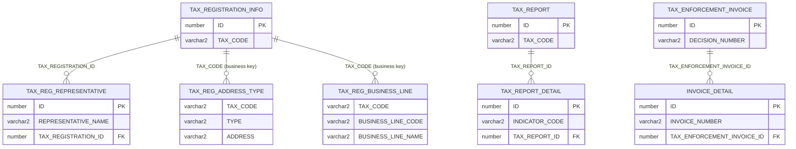
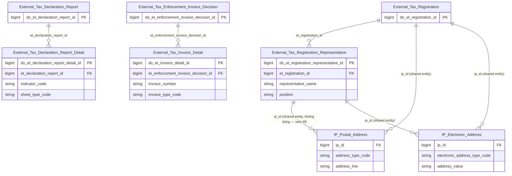

# KNT HLD — Tier 2

**Source system:** KNT (Dữ liệu trao đổi giữa UBCKNN và Tổng cục Thuế — Cơ quan Thuế)
**Tier 2:** Bảng có FK (vật lý hoặc business key) đến entity Tier 1. Gồm 3 Atomic entity mới (FK ID vật lý) và 2 bảng nguồn xử lý thành shared entity / denormalize (không tạo entity mới).

---

## 6a. Bảng tổng quan BCV Concept

| BCV Core Object | BCV Concept | Category | Source Table | Mô tả bảng nguồn | Atomic Entity | table_type | BCV Term |
|---|---|---|---|---|---|---|---|
| Involved Party | [Involved Party] Designated Representative | Designated Representative | TAX_REG_REPRESENTATIVE | Thông tin người đại diện/chủ hộ kinh doanh trong đăng ký thuế: họ tên, chức vụ, loại giấy tờ, số giấy tờ | External Tax Registration Representative | Fundamental | (1) Term "Designated Representative" (Involved Party, id 10842): "an Involved Party that represents another Involved Party in their role and responsibilities" — khớp trực tiếp người đại diện pháp luật/chủ hộ kinh doanh đại diện cho External Tax Registration. (2) Cấu trúc trường: REPRESENTATIVE_NAME + POSITION + ID_DOCUMENT_TYPE/NUMBER + PHONE/FAX/EMAIL + FK TAX_REGISTRATION_ID — đúng là 1 Involved Party (người) gắn với 1 hồ sơ đăng ký thuế. (3) Chọn `[Involved Party] Designated Representative` — khớp cấu trúc và ngữ nghĩa hơn `[Involved Party] Involved Party` (quá chung, dùng ở thiết kế nháp trước). **[ĐÃ ĐIỀU CHỈNH — quyết định Data Modeler 2026-07-19]** Table Type đổi từ Relative sang Fundamental — Designated Representative là 1 Involved Party (con người) có identity và lifecycle riêng biệt, độc lập với vòng đời của hồ sơ đăng ký thuế mà họ đại diện (1 người có thể đại diện nhiều hồ sơ khác nhau qua các thời điểm), phù hợp SCD4A hơn SCD2 dù có FK đến Fundamental khác. |
| Documentation | [Documentation] Reported Information | Reported Information | TAX_REPORT_DETAIL | Chi tiết chỉ tiêu trong báo cáo tài chính từ Cục Thuế: giá trị đầu năm, cuối năm, năm nay, năm trước theo từng sheet | External Tax Declaration Report Detail | Fact Append | (1) Term "Reported Information" (Documentation, id 9248): "identifies information contained within a report" — khớp các dòng chỉ tiêu (INDICATOR_CODE/NAME + giá trị theo kỳ) nằm trong 1 báo cáo/tờ khai. (2) Cấu trúc trường: FK TAX_REPORT_ID + INDICATOR_CODE + SHEET_NAME (loại sheet: BCDKT/KQKD/LCTT...) + các giá trị đầu/cuối kỳ — đúng bản chất dòng chỉ tiêu con của 1 report, không phải bản thân 1 report riêng. (3) Chọn `[Documentation] Reported Information` thay vì các term "Statement" cụ thể (Balance Sheet/P&L/Cash Flow Statement) vì 1 bảng này gộp chung nhiều loại sheet qua cột SHEET_NAME (ETL-derived Classification Value), không tách riêng theo từng loại báo cáo tài chính. Tên entity đổi từ "Tax Declaration Report Indicator" thành "External Tax Declaration Report Detail" (quyết định Data Modeler 2026-07-19) — vẫn chứa đầy đủ tên entity cha `External Tax Declaration Report` theo rule đặt tên entity con. |
| Documentation | [Documentation] Invoice | Invoice | INVOICE_DETAIL | Chi tiết hóa đơn trong thông tin cưỡng chế ngừng sử dụng hóa đơn do Cục Thuế cung cấp | External Tax Invoice Detail | Fact Append | (1) Term "Invoice" (Documentation, id 9254): "Identifies a... record that describes... the cause of the debt" — dùng ở mức khái quát nhất để định danh 1 hóa đơn cụ thể, dù bảng này không có trường số tiền. (2) Cấu trúc trường: FK TAX_ENFORCEMENT_INVOICE_ID + INVOICE_TEMPLATE_SYMBOL/INVOICE_SYMBOL/INVOICE_NUMBER/INVOICE_TYPE — đúng bản chất liệt kê từng hóa đơn cụ thể bị áp dụng biện pháp cưỡng chế, không phải bản thân giao dịch phát sinh hóa đơn. (3) Chọn `[Documentation] Invoice` — term duy nhất trong BCV mô tả khái niệm hóa đơn. **[ĐÃ ĐIỀU CHỈNH — quyết định Data Modeler 2026-07-19]** Tên entity đổi từ "Tax Enforcement Invoice Decision Item" thành "External Tax Invoice Detail" — **lưu ý:** tên mới không còn chứa đầy đủ tên entity cha `External Tax Enforcement Invoice Decision` (vi phạm rule #8 đặt tên entity con), ghi nhận là ngoại lệ theo quyết định tường minh của Data Modeler — xem 6f T2-04. |
| — (không tạo entity) | Shared Entity — extend IP Postal Address / IP Electronic Address | Location | TAX_REG_ADDRESS_TYPE | Loại địa chỉ trong thông tin đăng ký thuế của doanh nghiệp: địa chỉ trụ sở, địa chỉ kinh doanh, địa chỉ khác | *(→ IP Postal Address, IP Electronic Address)* | Fundamental (shared) | (1)+(2) Bảng chỉ có 2 trường nghiệp vụ gắn với Registered Taxpayer (TAX_CODE) + loại địa chỉ (TYPE) + chi tiết ADDRESS/WARD/DISTRICT/PROVINCE/COUNTRY + EMAIL/PHONE/FAX/WEBSITE — không có attribute nghiệp vụ riêng ngoài dữ liệu địa chỉ/liên lạc. (3) Theo rule Pure junction + Shared Entity: map thẳng vào `IP Postal Address` (ADDRESS/WARD/DISTRICT/PROVINCE/COUNTRY, Address Type Code theo TYPE: 1→HEAD_OFFICE, 2→BRANCH, 3→BUSINESS) và `IP Electronic Address` (EMAIL/PHONE/FAX/WEBSITE) — không tạo Atomic entity mới. |
| — (không tạo entity) | Denormalize ARRAY trên External Tax Registration | Common | TAX_REG_BUSINESS_LINE | Ngành nghề kinh doanh trong thông tin đăng ký thuế: mã ngành, tên ngành theo mã gói tin | *(→ ARRAY trên External Tax Registration)* | — | (1) Term "Industry Classification" (Common, id 8291) mô tả đúng bản chất BUSINESS_LINE_CODE/NAME. (2) Cấu trúc trường: chỉ có TAX_CODE (FK ngầm) + BUSINESS_LINE_CODE + BUSINESS_LINE_NAME + PACKET_CODE (kỹ thuật) — pure junction giữa External Tax Registration và danh mục ngành nghề, không có attribute nghiệp vụ riêng. (3) Theo rule Pure junction table giữa entity và Classification Value: denormalize thành `business_line_codes ARRAY<Classification Value Code>` trên entity External Tax Registration, không tạo Atomic entity riêng. |

---

## 6b. Diagram Source (Mermaid)

---

## 6c. Diagram Atomic (Mermaid)

> `External_Tax_Registration`, `External_Tax_Declaration_Report`, `External_Tax_Enforcement_Invoice_Decision` là node tham chiếu từ Tier 1. `IP_Postal_Address`/`IP_Electronic_Address` là shared entity toàn dự án (không tạo mới). `External_Tax_Registration_Representative` không có địa chỉ riêng (không có trường ADDRESS trên TAX_REG_REPRESENTATIVE) — chỉ nối `IP Electronic Address` qua PHONE/FAX/EMAIL, không nối `IP Postal Address`.

---

## 6d. Mục Danh mục & Tham chiếu (Reference Data)

| Source Field / Bảng | Mô tả | Scheme Code | source_type | Ghi chú |
|---|---|---|---|---|
| TAX_REG_REPRESENTATIVE.ID_DOCUMENT_TYPE | Loại giấy tờ định danh người đại diện | `IP_ALT_ID_TYPE` | etl_derived | Tái sử dụng scheme toàn dự án — 1010=CMND → `LEGACY_CMND`/`NATIONAL_ID`, 2080=CCCD → `CITIZEN_ID`, 1020=Hộ chiếu → `PASSPORT` |
| TAX_REG_REPRESENTATIVE.PHONE/FAX/EMAIL | Liên lạc người đại diện | `IP_ELEC_ADDR_TYPE` | etl_derived | Tái sử dụng scheme toàn dự án — PHONE/FAX/EMAIL |
| TAX_REG_REPRESENTATIVE.POSITION | Chức vụ/vai trò của người đại diện (tên hoặc mã) | `KNT_REPRESENTATIVE_POSITION` | source_table | Mô tả nguồn ghi "tên hoặc mã" — cần profile dữ liệu thực tế trước LLD để xác nhận có phải free text hay có danh mục cố định (xem 6f T2-03) |
| TAX_REG_ADDRESS_TYPE.TYPE / ADDRESS_TYPE | Loại địa chỉ trong hồ sơ ĐKT | `IP_ADDR_TYPE` | etl_derived | Tái sử dụng scheme toàn dự án — 1=Trụ sở chính → `HEAD_OFFICE`, 2=Chi nhánh → `BRANCH`, 3=Địa điểm kinh doanh → `BUSINESS` |
| TAX_REG_ADDRESS_TYPE.EMAIL/PHONE/FAX/WEBSITE | Liên lạc theo từng loại địa chỉ | `IP_ELEC_ADDR_TYPE` | etl_derived | Tái sử dụng scheme toàn dự án — EMAIL_BUSINESS/PHONE_BUSINESS/FAX_BUSINESS/WEBSITE |
| TAX_REG_BUSINESS_LINE.BUSINESS_LINE_CODE/NAME | Ngành nghề kinh doanh | `KNT_BUSINESS_LINE` | source_table | Values load từ distinct BUSINESS_LINE_CODE/NAME |
| TAX_REPORT_DETAIL.SHEET_NAME | Loại sheet báo cáo tài chính (LoaiBaoCaoChiTietEnum) | `KNT_REPORT_SHEET` | source_table | 1=BCDKT, 2=KQKD, 3=KQKDHD, 4=LCTT-TT, 5=LCTT-GT, 6=CTTKC, 9=THBDVCSH |
| INVOICE_DETAIL.INVOICE_TYPE | Loại hóa đơn bị cưỡng chế ngừng sử dụng | `KNT_INVOICE_TYPE` | source_table | Cần profile giá trị distinct trước LLD |

---

## 6e. Bảng chờ thiết kế

*(Không còn bảng chờ thiết kế ở Tier 2 — INVOICE_DETAIL đã thiết kế thành entity "External Tax Invoice Detail".)*

---

## 6f. Điểm cần xác nhận

| # | Câu hỏi | Kết quả |
|---|---|---|
| T2-01 | `TAX_REG_ADDRESS_TYPE` không có cột PK/ID tự sinh — grain thực tế là (TAX_CODE, TYPE) hay có thể có nhiều dòng trùng (TAX_CODE, TYPE) khác nhau (VD: nhiều "Chi nhánh")? Ảnh hưởng đến cách sinh khóa dòng khi nạp vào IP Postal Address. | Chưa xác nhận — cần profile dữ liệu thực tế trước LLD. |
| T2-02 | `TAX_REG_BUSINESS_LINE` không có PK — grain (TAX_CODE, BUSINESS_LINE_CODE) có đảm bảo unique không? | Chưa xác nhận — cần profile dữ liệu thực tế trước LLD. |
| T2-03 | `TAX_REG_REPRESENTATIVE.POSITION` mô tả nguồn ghi "Chức vụ (tên hoặc mã)" — đây là free text hay có danh mục cố định? Quyết định `source_type` của `KNT_REPRESENTATIVE_POSITION` (source_table vs modeler_defined). | Chưa xác nhận — cần profile dữ liệu thực tế trước LLD. |
| T2-04 | **[GHI NHẬN 2026-07-19]** `External Tax Invoice Detail` (INVOICE_DETAIL) không chứa đầy đủ tên entity cha `External Tax Enforcement Invoice Decision` — vi phạm rule #8 (entity con phải chứa substring liên tục tên entity cha). Có giữ nguyên ngoại lệ này hay đổi lại tên đầy đủ hơn (VD: `External Tax Enforcement Invoice Decision Detail`)? | Theo quyết định tường minh của Data Modeler (đổi tên hàng loạt 2026-07-19) — giữ nguyên `External Tax Invoice Detail`, ghi nhận là ngoại lệ có chủ đích, không tự động sửa lại. |

---

## Shared Entity — bổ sung source_table

Các entity Tier 2 sau bổ sung `source_table` vào shared entity đã có (không tạo entity mới):

| Shared Entity | Entity tham chiếu | Trường nguồn |
|---|---|---|
| IP Postal Address | External Tax Registration (từ TAX_REGISTRATION_INFO.HQ_ADDRESS/BUSINESS_* và TAX_REG_ADDRESS_TYPE.ADDRESS/WARD/DISTRICT/PROVINCE/COUNTRY) | HQ_ADDRESS, BUSINESS_ADDRESS_DESC, ADDRESS, WARD, DISTRICT, PROVINCE, COUNTRY |
| IP Electronic Address | External Tax Registration (TAX_REGISTRATION_INFO.PHONE/FAX/BUSINESS_PHONE/BUSINESS_EMAIL/BUSINESS_FAX, TAX_REG_ADDRESS_TYPE.EMAIL/PHONE/FAX/WEBSITE), External Tax Registration Representative (TAX_REG_REPRESENTATIVE.PHONE/FAX/EMAIL) | PHONE, FAX, EMAIL, WEBSITE |
| IP Alt Identification | External Tax Registration Representative (TAX_REG_REPRESENTATIVE.ID_DOCUMENT_TYPE/ID_DOCUMENT_NUMBER/ISSUE_DATE) | ID_DOCUMENT_TYPE, ID_DOCUMENT_NUMBER, ISSUE_DATE |
