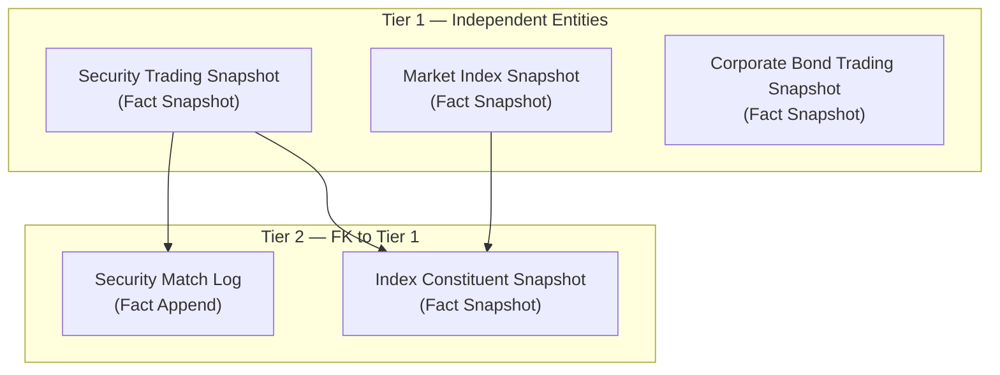
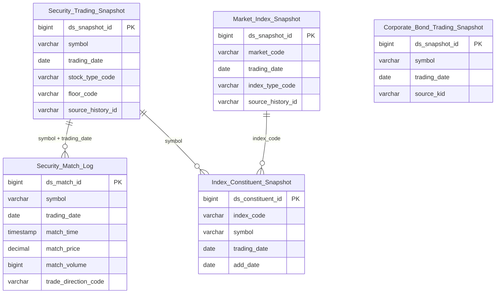

# MDDS HLD — Overview

**Source system:** MDDS (Hệ thống phân phối dữ liệu thị trường — Bảng giá, sổ khớp, chỉ số realtime)
**Mô tả:** MDDS (Market Data Distribution System) phân phối dữ liệu thị trường realtime từ các sở giao dịch (HOSE, HNX, UPCOM). Bao gồm snapshot bảng giá cổ phiếu/trái phiếu/phái sinh/chứng quyền, chỉ số thị trường, thành phần rổ chỉ số, và log tick-by-tick từng lần khớp lệnh.

---

## Tổng quan Atomic Entities

| Tier | Atomic Entity | BCV Core Object | BCV Concept | Table Type | Source Table(s) | Ghi chú |
|---|---|---|---|---|---|---|
| T1 | Security Trading Snapshot | Product | [Product] Financial Market Instrument | Fact Snapshot | MDDS.StockInfor | Snapshot bảng giá đa loại instrument (CP/CW/PS/TP/CCQ) theo historyid |
| T1 | Market Index Snapshot | Group | [Group] Share Index | Fact Snapshot | MDDS.MarketInfor | Snapshot chỉ số thị trường (VNINDEX/HNX/UPCOM) theo historyid |
| T1 | Corporate Bond Trading Snapshot | Product | [Product] Financial Market Instrument | Fact Snapshot | MDDS.CorpBondInfor | Snapshot bảng giá TPDN với attributes bond-specific |
| T2 | Security Match Log | Transaction | [Transaction] Financial Market Transaction | Fact Append | MDDS.TransLog | Log tick-by-tick từng lần khớp lệnh cổ phiếu |
| T2 | Index Constituent Snapshot | Group | [Group] Share Index | Fact Snapshot | MDDS.CSIDXInfor | Thành phần rổ chỉ số theo ngày giao dịch |

**Tổng: 5 Atomic entities** (3 Tier 1, 2 Tier 2)
*(Trong đó: 0 shared entities)*

---

## Diagram Phân tầng Dependencies (Mermaid)

---

## Quyết định thiết kế chính

| # | Quyết định | Lý do |
|---|---|---|
| D-01 | Tách `Corporate Bond Trading Snapshot` thành entity riêng, không gộp với `Security Trading Snapshot` | CorpBondInfor có ~20 trường bond-specific (bond_period, interest_rate, coupon_type, maturitydate, parvalue, issuedate, PT_outright...) không có trong StockInfor → gộp sẽ gây quá nhiều nullable column |
| D-02 | `Security Match Log`: không tạo FK surrogate sang `Security Trading Snapshot` | TransLog là Fact Append với rất nhiều dòng/ngày. Join với snapshot thực hiện tại Gold layer bằng `(symbol, trading_date)`. Tránh tạo phụ thuộc nặng nề ở Atomic |
| D-03 | `Index Constituent Snapshot`: chọn Fact Snapshot, không phải Relative | Bảng có `tradingdate` — mỗi ngày có 1 snapshot thành phần rổ. ETL insert-only theo partition ngày |
| D-04 | Không dùng prefix `MDDS` trong tên entity | Tên entity dùng trực tiếp BCV Term, không cần prefix source system |
| D-05 | Mapping 1-1 từ nguồn lên: không lọc theo instrument type | Atomic lưu toàn bộ instrument (CP/CW/PS/TP/CCQ) trong cùng 1 entity `Security Trading Snapshot`, phân biệt qua `stock_type_code` |

---

#### 7a. Bảng tổng quan Atomic entities

| Tier | BCV Core Object | BCV Concept | Category | Source Table | Source Table Change Mode | Mô tả bảng nguồn | Atomic Entity | Table Type | BCV Term |
|---|---|---|---|---|---|---|---|---|---|
| T1 | Product | [Product] Financial Market Instrument | Financial Markets | MDDS.StockInfor | Update | Snapshot bảng giá đa loại instrument tại một thời điểm | Security Trading Snapshot | Fact Snapshot | Financial Market Instrument — Product bao gồm cổ phiếu, trái phiếu, CW, phái sinh. Snapshot theo historyid. |
| T1 | Group | [Group] Share Index | Financial Markets | MDDS.MarketInfor | Update | Snapshot tổng hợp trạng thái sàn/chỉ số tại một thời điểm | Market Index Snapshot | Fact Snapshot | Share Index — nhóm mã CK phản ánh biến động thị trường (VNINDEX/HNX-Index/UPCOM-Index). Snapshot theo historyid. |
| T1 | Product | [Product] Financial Market Instrument | Financial Markets | MDDS.CorpBondInfor | Update | Snapshot bảng giá TPDN với đặc thù bond | Corporate Bond Trading Snapshot | Fact Snapshot | Financial Market Instrument — chuyên biệt cho trái phiếu doanh nghiệp niêm yết HNX. Snapshot theo kid/tradingdate. |
| T2 | Transaction | [Transaction] Financial Market Transaction | Financial Markets Trading | MDDS.TransLog | Append | Log tick-by-tick từng lần khớp lệnh cổ phiếu | Security Match Log | Fact Append | Financial Market Transaction — mỗi dòng = 1 lần khớp lệnh thực tế (1 tick). BRD Append. |
| T2 | Group | [Group] Share Index | Financial Markets | MDDS.CSIDXInfor | Update | Thành phần rổ chỉ số theo ngày giao dịch | Index Constituent Snapshot | Fact Snapshot | Share Index constituent — quan hệ (index, symbol, tradingdate). BRD Update nhưng thiết kế Fact Snapshot (insert-only per ngày). |

#### 7b. Diagram Atomic tổng (Mermaid)

#### 7c. Bảng Classification Value

| Source Table | Mô tả | BCV Term | Xử lý Atomic |
|---|---|---|---|
| MDDS.StockInfor.stocktype | Loại chứng khoán: ST/BO/MF/FU/OP/EF/W | [Common] Classification Value | Classification Value scheme `MDDS_STOCK_TYPE` |
| MDDS.StockInfor.floorcode | Mã sàn: HNX/UPCOM/HOSE/FDS/corp-bond | [Common] Classification Value | Classification Value scheme `MDDS_FLOOR_CODE` |
| MDDS.StockInfor.tradingsessionid | Trạng thái phiên giao dịch | [Common] Classification Value | Classification Value scheme `MDDS_TRADING_SESSION_STATUS` |
| MDDS.MarketInfor.indextypecode | Loại index theo Sở | [Common] Classification Value | Classification Value scheme `MDDS_INDEX_TYPE` |
| MDDS.MarketInfor.marketstatus | Trạng thái sàn/phiên | [Common] Classification Value | Classification Value scheme `MDDS_MARKET_STATUS` |
| MDDS.CorpBondInfor.period_unit | Đơn vị kỳ hạn TP | [Common] Classification Value | Classification Value scheme `MDDS_PERIOD_UNIT` |
| MDDS.CorpBondInfor.interest_coupon_type | Kiểu trả lãi coupon | [Common] Classification Value | Classification Value scheme `MDDS_COUPON_TYPE` |
| MDDS.CorpBondInfor.interestrate_type | Loại lãi suất | [Common] Classification Value | Classification Value scheme `MDDS_INTEREST_RATE_TYPE` |
| MDDS.CorpBondInfor.securitytradingstatus | Trạng thái giao dịch CK | [Common] Classification Value | Classification Value scheme `MDDS_SECURITY_TRADING_STATUS` |
| MDDS.TransLog.lastColor | Chiều giao dịch chủ động | [Common] Classification Value | Classification Value scheme `MDDS_TRADE_DIRECTION` |

#### 7d. Junction Tables

*(Không có junction table trong scope MDDS)*

#### 7e. Điểm cần xác nhận

| # | Tier | Câu hỏi | Ảnh hưởng |
|---|---|---|---|
| 1 | T1 | StockInfor và CorpBondInfor: giữ tách 2 entity hay gộp thành 1 `Security Trading Snapshot`? | Nếu gộp → 1 entity nhiều nullable; nếu tách → 2 entity riêng biệt. Đề xuất tách vì bond có ~20 trường riêng |
| 2 | T1 | CorpBondInfor: `kid` hay `(symbol, tradingdate)` là business key thực sự? | Ảnh hưởng grain và ETL pattern của Corporate Bond Trading Snapshot |
| 3 | T2 | CSIDXInfor.data_change_mode = Update nhưng thiết kế Fact Snapshot — ETL có insert-only per ngày không? | Nếu ETL cần update in-place → đổi sang Fundamental/Relative |
| 4 | T2 | Security_Match_Log: không tạo FK surrogate sang instrument snapshot — xác nhận join ở Gold layer? | Ảnh hưởng cách xây dựng mart tại Gold |
| 5 | T1 | Bỏ prefix entity `MDDS` — xác nhận? | Tất cả entity không còn prefix MDDS, dùng trực tiếp BCV Term |

#### 7f. Bảng ngoài scope

| Nhóm | Source Table | Mô tả bảng nguồn | Lý do ngoài scope |
|---|---|---|---|

<!--
GRAIN: 1 dòng = 1 bảng nguồn. KHÔNG gộp `table1, table2`.
GROUP: dùng từ danh sách chuẩn (xem reference/group_classification.md).
-->

---

## Entities

> Single source of truth cho metadata entity. `aggregate_atomic.py` parse section này để sinh `atomic_entities.yaml`.
> Format bắt buộc: heading `### N.` + dòng `**Description:**` trong 500 ký tự đầu tiên sau heading.

### 1. Security Trading Snapshot
**Tier:** 1 | **Source:** `MDDS.StockInfor` | **BCV Concept:** [Product] Financial Market Instrument | **BCO:** Product | **Table Type:** Fact Snapshot
**Description:** Snapshot trạng thái giao dịch của một công cụ tài chính (cổ phiếu, chứng quyền, hợp đồng phái sinh, chứng chỉ quỹ) tại một thời điểm trong ngày giao dịch, bao gồm giá, sổ lệnh, NĐTNN và thông tin đặc thù theo loại instrument.

**Grain:** 1 dòng = 1 lần chụp trạng thái của 1 mã chứng khoán (historyid).

**Attributes chính:** ds_snapshot_id (PK), source_history_id, symbol, trading_date, stock_type_code (MDDS_STOCK_TYPE), floor_code (MDDS_FLOOR_CODE), ceiling_price, floor_price, reference_price, close_price, close_volume, open_price, high_price, low_price, bid/offer price & volume (1-3), total_trading_volume, total_trading_value, avg_price, foreign_buy/sell/remain/room, pt_match_price/qty, pt_total_traded_qty/value, trading_session_status_code (MDDS_TRADING_SESSION_STATUS).

### 2. Market Index Snapshot
**Tier:** 1 | **Source:** `MDDS.MarketInfor` | **BCV Concept:** [Group] Share Index | **BCO:** Group | **Table Type:** Fact Snapshot
**Description:** Snapshot trạng thái của một chỉ số thị trường (VNINDEX, HNX-Index, UPCOM-Index) tại một thời điểm trong ngày, bao gồm điểm chỉ số, tổng khối lượng/giá trị, thống kê mã tăng/giảm/trần/sàn, trạng thái phiên giao dịch.

**Grain:** 1 dòng = 1 lần chụp trạng thái của 1 chỉ số thị trường (historyid).

**Attributes chính:** ds_snapshot_id (PK), source_history_id, market_code, trading_date, index_time, market_index_value, index_change, index_percent_change, open_index, high_index, low_index, prev_prior_index, total_volume, total_value, advances, declines, no_change, ceiling_count, floor_count, pt_total_qtty/value/trade, market_status_code (MDDS_MARKET_STATUS), index_type_code (MDDS_INDEX_TYPE), tsc_product_group_id.

### 3. Corporate Bond Trading Snapshot
**Tier:** 1 | **Source:** `MDDS.CorpBondInfor` | **BCV Concept:** [Product] Financial Market Instrument | **BCO:** Product | **Table Type:** Fact Snapshot
**Description:** Snapshot trạng thái giao dịch của trái phiếu doanh nghiệp niêm yết tại sàn HNX tại một thời điểm, bao gồm giá khớp, order book thỏa thuận Outright (PT_*), thông tin đặc thù trái phiếu (kỳ hạn, lãi suất, coupon, mệnh giá, ngày phát hành/đáo hạn).

**Grain:** 1 dòng = 1 lần chụp trạng thái của 1 mã trái phiếu doanh nghiệp (kid/symbol + tradingdate).

**Attributes chính:** ds_snapshot_id (PK), source_kid, symbol, trading_date, floor_code (MDDS_FLOOR_CODE), close_price, open_price, high_price, low_price, reference_price, ceiling_price, floor_price, total_trading, total_trading_value, avg_price, issuer_name, maturity_date, issue_date, par_value, bond_period, period_unit_code (MDDS_PERIOD_UNIT), period_remain_days, interest_rate, interest_rate_type_code (MDDS_INTEREST_RATE_TYPE), coupon_type_code (MDDS_COUPON_TYPE), security_trading_status_code (MDDS_SECURITY_TRADING_STATUS), pt_* outright fields.

### 4. Security Match Log
**Tier:** 2 | **Source:** `MDDS.TransLog` | **BCV Concept:** [Transaction] Financial Market Transaction | **BCO:** Transaction | **Table Type:** Fact Append
**Description:** Log từng lần khớp lệnh (tick-by-tick) của cổ phiếu niêm yết trong ngày giao dịch, bao gồm giá khớp, khối lượng khớp, chiều giao dịch chủ động, và lũy kế khối lượng/giá trị từ đầu ngày.

**Grain:** 1 dòng = 1 lần khớp lệnh (1 tick) của 1 mã chứng khoán (source Id unique).

**Attributes chính:** ds_match_id (PK), source_id, symbol, trading_date, match_time, match_price, match_volume, acc_volume, acc_value, total_buy_volume, total_sell_volume, trade_direction_code (MDDS_TRADE_DIRECTION), board_id.

### 5. Index Constituent Snapshot
**Tier:** 2 | **Source:** `MDDS.CSIDXInfor` | **BCV Concept:** [Group] Share Index | **BCO:** Group | **Table Type:** Fact Snapshot
**Description:** Snapshot thành phần rổ chỉ số thị trường theo ngày giao dịch — mỗi dòng ghi nhận một cặp (mã chỉ số, mã chứng khoán) có mặt trong rổ chỉ số tại ngày giao dịch tương ứng.

**Grain:** 1 dòng = 1 cặp (index_code, symbol, trading_date).

**Attributes chính:** ds_constituent_id (PK), source_id, index_code, index_id, symbol, trading_date, add_date, floor_code (MDDS_FLOOR_CODE), total_match_volume.
