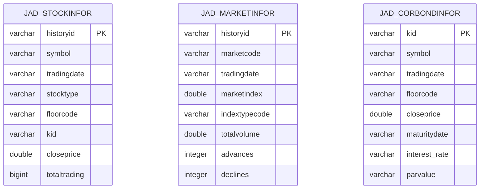
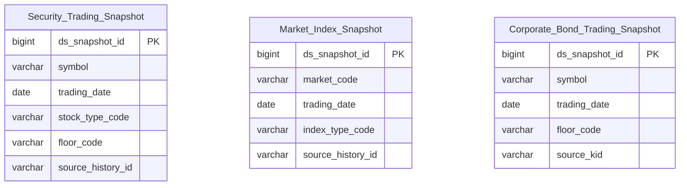

# MDDS HLD — Tier 1

**Source system:** MDDS (Hệ thống phân phối dữ liệu thị trường — Bảng giá, sổ khớp, chỉ số realtime)
**Tier 1:** Main Entities — Snapshot bảng giá và chỉ số thị trường; không FK inbound bắt buộc từ bảng nghiệp vụ khác

---

## 6a. Bảng tổng quan BCV Concept

| BCV Core Object | BCV Concept | Category | Source Table | Source Table Change Mode | Mô tả bảng nguồn | Atomic Entity | Table Type | BCV Term |
|---|---|---|---|---|---|---|---|---|
| Product | [Product] Financial Market Instrument | Financial Markets | StockInfor | Update | Snapshot bảng giá đa loại instrument tại một thời điểm — giá, sổ lệnh, tổng tích lũy, NĐTNN, đặc thù derivative/warrant/bond | Security Trading Snapshot | Fact Snapshot | (1) BCV term: **Financial Market Instrument** (Product) — *"any financial instrument available in the financial marketplace including currencies, stocks, bonds"*. (2) Cấu trúc trường: `symbol`, `stocktype`, `fullname`, `historyid` + bộ giá (ceiling/floor/reference/close/open/high/low) + sổ lệnh (bid1-3/offer1-3) + NĐTNN + đặc thù CW/PS/bond — đây là snapshot trạng thái của 1 instrument tại 1 thời điểm trong ngày, không phải giao dịch. (3) Chọn term này: bảng mô tả trạng thái giao dịch của Financial Market Instrument (cổ phiếu, trái phiếu, CW, phái sinh), được chụp nhiều lần trong ngày qua `historyid`. Table type = Fact Snapshot vì grain = 1 lần chụp trạng thái instrument. |
| Group | [Group] Share Index | Financial Markets | MarketInfor | Update | Snapshot tổng hợp trạng thái sàn/chỉ số tại một thời điểm — điểm chỉ số, tổng KL/GT, số mã tăng/giảm/trần/sàn, trạng thái phiên | Market Index Snapshot | Fact Snapshot | (1) BCV term candidate: **Share Index** (Group) — *"groups shares to reflect movement in the share market to produce a benchmark figure"*; hoặc **Financial Market Group** (Group) — *"grouping of market participants that facilitates trading"*. (2) Cấu trúc trường: `marketcode`, `marketindex`, `indexchange`, `totalvolume`, `advances`/`declines`/`nochange` — đây là snapshot trạng thái của 1 chỉ số thị trường (VNINDEX/HNX/UPCOM/...) tại 1 thời điểm. Không phải giao dịch, không phải thành viên sàn. (3) Chọn **Share Index**: mô tả đúng nhất khái niệm "chỉ số phản ánh biến động thị trường" — VNINDEX/HNX-Index là share index điển hình. Một snapshot của chỉ số tại thời điểm = 1 lần chụp trạng thái index → Fact Snapshot. |
| Product | [Product] Financial Market Instrument | Financial Markets | CorpBondInfor | Update | Snapshot bảng giá TPDN: giá, order book thỏa thuận Outright, đặc thù bond (kỳ hạn, lãi suất, coupon, mệnh giá) | Corporate Bond Trading Snapshot | Fact Snapshot | (1) BCV term: **Financial Market Instrument** (Product) — cùng concept với StockInfor nhưng chuyên biệt cho bond. Cũng có thể xét **Debt Instrument** nhưng BCV không có term riêng — Financial Market Instrument bao gồm bonds. (2) Cấu trúc trường: `symbol`, `fullname`, `tradingdate`, `historyid` + bộ giá (ceiling/floor/reference/open/high/low/close) + PT_* thỏa thuận Outright + bond attributes (bond_period, interest_rate, coupon_type, maturitydate, parvalue, issuedate). (3) Chọn term này: bảng mô tả trạng thái bảng giá của trái phiếu doanh nghiệp tại 1 thời điểm. Tách entity riêng (không gộp với StockInfor) vì có ~20 trường bond-specific không có ở cổ phiếu. Table type = Fact Snapshot. |

---

## 6b. Diagram Source (Mermaid)

> Tier 1: 3 entity độc lập, không FK lẫn nhau.

---

## 6c. Diagram Atomic (Mermaid)

> Tier 1: 3 Fact Snapshot entity độc lập. Surrogate key `ds_snapshot_id` tự sinh.

---

## 6d. Mục Danh mục & Tham chiếu (Reference Data)

| Source Field / Bảng | Mô tả | Scheme Code | source_type | Ghi chú |
|---|---|---|---|---|
| StockInfor.stocktype | Loại chứng khoán: ST/BO/MF/FU/OP/EF/W... | `MDDS_STOCK_TYPE` | source_table | Khác nhau giữa HNX và HOSE — ETL cần chuẩn hóa |
| StockInfor.floorcode | Mã sàn: 02-HNX, 04-UPCOM, 10-HOSE, 03-FDS, 06-corp-bond | `MDDS_FLOOR_CODE` | source_table | FSS quy định |
| StockInfor.tradingsessionid | Trạng thái phiên giao dịch | `MDDS_TRADING_SESSION_STATUS` | source_table | Theo Sở quy định |
| MarketInfor.indextypecode | Loại index — mã Sở quy định | `MDDS_INDEX_TYPE` | source_table | Khác biệt HNX/HOSE |
| MarketInfor.marketstatus | Trạng thái phiên: 1-đang nhận lệnh, 2-tạm dừng, 13-kết thúc... | `MDDS_MARKET_STATUS` | source_table | Giá trị do FSS/Sở quy định |
| CorpBondInfor.period_unit | Đơn vị kỳ hạn: 1-Ngày, 2-Tuần, 3-Tháng, 4-Năm | `MDDS_PERIOD_UNIT` | source_table | |
| CorpBondInfor.interest_coupon_type | Kiểu trả lãi: Standard/Long/Short/Zero Coupon | `MDDS_COUPON_TYPE` | source_table | |
| CorpBondInfor.interestrate_type | Loại lãi suất: Cố định/Thả nổi | `MDDS_INTEREST_RATE_TYPE` | source_table | |
| CorpBondInfor.securitytradingstatus | Trạng thái TPDN: 0-bình thường, 10-tạm ngừng, 11-hạn chế | `MDDS_SECURITY_TRADING_STATUS` | source_table | |
| TransLog.lastColor / StockInfor.lastcolor | Chiều mua/bán chủ động | `MDDS_TRADE_DIRECTION` | etl_derived | Indicator tăng/giảm, cần profile giá trị thực |

---

## 6e. Bảng chờ thiết kế

*(Để trống — tất cả bảng Tier 1 đã thiết kế)*

---

## 6f. Điểm cần xác nhận

| # | Câu hỏi | Kết quả |
|---|---|---|
| T1-01 | **StockInfor vs CorpBondInfor**: Có nên gộp thành 1 entity `Security Trading Snapshot` dùng `stocktype` phân biệt, thay vì tách 2 entity? | Đề xuất **tách**: CorpBondInfor có ~20 trường bond-specific (bond_period, interest_rate, coupon_type, maturitydate, parvalue, issuedate, pt_*outright) không có trên StockInfor → gộp sẽ có quá nhiều nullable. Cần xác nhận với người thiết kế. |
| T1-02 | **Grain của MarketInfor**: 1 dòng = 1 snapshot của 1 chỉ số tại 1 thời điểm (`historyid` + `marketcode` + `indextime`). Confirm rằng `historyid` là PK thực tế và unique? | `historyid` khai báo `nullable: false` và là ID unique lịch sử theo BRD. Cần xác nhận có thể có nhiều dòng cùng `marketcode` trong 1 ngày không. |
| T1-03 | **CorpBondInfor**: Bảng không có `historyid` rõ ràng — `kid` là PK hay `(symbol, tradingdate)` mới là business key? | BRD khai báo `kid` là ID jadapter sinh. Cần xác nhận grain thực sự — nếu update theo ngày thì grain = `(symbol, tradingdate)`, kid chỉ là technical. |
| T1-04 | **Prefix entity MDDS**: Dùng `MDDS` hay prefix ngắn hơn như `MKT`? | Đề xuất `MDDS` để nhất quán với source_system. Cần xác nhận. |
