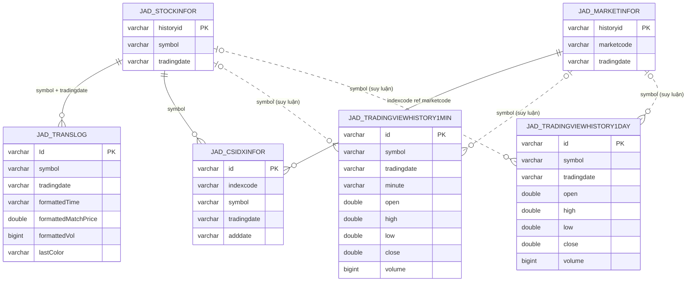
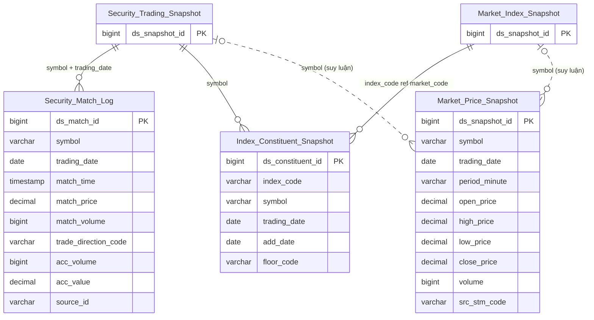

# MDDS HLD — Tier 2

**Source system:** MDDS (Hệ thống phân phối dữ liệu thị trường — Bảng giá, sổ khớp, chỉ số realtime)
**Tier 2:** Phụ thuộc Tier 1 — Log khớp lệnh tick-by-tick, thành phần rổ chỉ số, và lịch sử giá OHLCV

---

## 6a. Bảng tổng quan BCV Concept

| BCV Core Object | BCV Concept | Category | Source Table | Source Table Change Mode | Mô tả bảng nguồn | Atomic Entity | Table Type | BCV Term |
|---|---|---|---|---|---|---|---|---|
| Transaction | [Transaction] Financial Market Transaction | Financial Markets Trading | TransLog | Append | Log tick-by-tick từng lần khớp lệnh cổ phiếu: giá khớp, KL khớp, chiều chủ động, tích lũy KL/GT | Security Match Log | Fact Append | (1) BCV term: **Financial Market Transaction** (Transaction) — *"transaction that represents the adjustment of a holding in a Financial Market Instrument; for example, equity purchase"*. (2) Cấu trúc trường: `Id` (PK unique), `symbol`, `tradingdate`, `formattedTime`, `formattedMatchPrice`, `formattedVol`, `lastColor` (chiều chủ động), `formattedAccVol/Val` (lũy kế). Mỗi dòng = 1 lần khớp lệnh thực tế (1 tick). BRD ghi `Append` — không có update/delete. (3) Chọn term này: mỗi tick khớp lệnh = 1 Financial Market Transaction của instrument. Table type = Fact Append (insert-only, grain = 1 tick khớp). |
| Group | [Group] Share Index | Financial Markets | CSIDXInfor | Update | Thành phần rổ chỉ số: cặp (IndexCode × Symbol) với KL và ngày vào rổ | Index Constituent Snapshot | Fact Snapshot | (1) BCV term candidate: **Share Index** (Group) — đã dùng cho MarketInfor. CSIDXInfor là thành phần (constituent) của 1 share index. BCV có quan hệ "Group Contains Product" phản ánh đúng quan hệ index chứa instrument. (2) Cấu trúc trường: `id` (PK), `indexcode` (FK đến index/MarketInfor), `symbol` (FK đến StockInfor), `adddate` (ngày vào rổ), `tradingdate`. 1 dòng = 1 cặp (index, symbol, tradingdate). Đây là Snapshot thành phần rổ theo ngày — cùng symbol có thể xuất hiện nhiều ngày khác nhau. (3) Chọn **Share Index** với sub-entity "Index Constituent": bảng mô tả quan hệ cặp (index, instrument) trong rổ chỉ số. Table type = Fact Snapshot vì grain = 1 cặp (indexcode, symbol, tradingdate) — chụp thành phần rổ theo ngày. |
| Product | [Product] Financial Market Instrument | Financial Markets | JAD_TRADINGVIEWHISTORY1MIN | Append | Thống kê OHLCV (nến giá) theo resolution phút cho từng mã (CK hoặc index), phục vụ biểu đồ TradingView | Market Price Snapshot | Fact Snapshot | (1) BCV term: tái dùng **Financial Market Instrument** (Product) — đã dùng cho Security Trading Snapshot/Corporate Bond Trading Snapshot; không tìm thấy BCV term chuyên biệt cho time-series OHLCV/candlestick trong knowledge base (`terms.csv`), tra theo pattern "price history"/"OHLC"/"candle"/"resolution" không có kết quả phù hợp. (2) Cấu trúc trường: `id` (PK), `symbol` (dùng chung cho cả mã chứng khoán và mã chỉ số — không có cột phân loại loại instrument, không có FK constraint tường minh), `tradingdate`, `minute`, và bộ OHLCV (`open/high/low/close/volume`) — mỗi dòng là 1 cây nến 1 phút, không phải 1 giao dịch đơn lẻ. (3) Chọn term này: dữ liệu là giá tổng hợp theo kỳ của instrument (bao gồm cả index) — gần nhất với Financial Market Instrument dù về bản chất bao trùm cả index; symbol không tách được loại instrument ở mức bảng nguồn → xem T2-04. Table type = Fact Snapshot vì grain = 1 lần chụp giá tổng hợp trong 1 kỳ (phút), giữ lịch sử nhiều kỳ, insert-only. |
| Product | [Product] Financial Market Instrument | Financial Markets | JAD_TRADINGVIEWHISTORY1DAY | Append | Thống kê OHLCV (nến giá) theo resolution ngày cho từng mã (CK hoặc index), phục vụ biểu đồ TradingView | Market Price Snapshot | Fact Snapshot | (1) BCV term: giống hệt lý do của JAD_TRADINGVIEWHISTORY1MIN — tái dùng **Financial Market Instrument** (Product). (2) Cấu trúc trường: giống hệt JAD_TRADINGVIEWHISTORY1MIN nhưng **không có cột `minute`** — mỗi dòng là 1 cây nến 1 ngày thay vì 1 phút. (3) Chọn gộp chung 1 Atomic entity `Market Price Snapshot` với JAD_TRADINGVIEWHISTORY1MIN theo quy tắc #10 (cấu trúc tương tự + ít trường → gộp): phân biệt nguồn 1MIN/1DAY qua `src_stm_code` và qua `period_minute` (có giá trị ⇔ nguồn 1MIN, null ⇔ nguồn 1DAY) — không cần thêm Classification Value riêng cho resolution. |

---

## 6b. Diagram Source (Mermaid)

---

## 6c. Diagram Atomic (Mermaid)

> Entity Tier 1 hiển thị dạng node tham chiếu.

---

## 6d. Mục Danh mục & Tham chiếu (Reference Data)

| Source Field / Bảng | Mô tả | Scheme Code | source_type | Ghi chú |
|---|---|---|---|---|
| TransLog.lastColor | Chiều mua/bán chủ động: Buy/Sell indicator | `MDDS_TRADE_DIRECTION` | source_table | Cùng scheme với StockInfor.lastcolor — đăng ký 1 lần tại Tier 1 |
| CSIDXInfor.floorcode | Mã sở giao dịch | `MDDS_FLOOR_CODE` | source_table | Cùng scheme với StockInfor.floorcode — đã đăng ký Tier 1 |

---

## 6e. Bảng chờ thiết kế

*(Để trống — tất cả bảng Tier 2 đã thiết kế)*

---

## 6f. Điểm cần xác nhận

| # | Câu hỏi | Kết quả |
|---|---|---|
| T2-01 | **CSIDXInfor table type**: BRD ghi `data_change_mode: Update` nhưng bảng có `tradingdate` — có thể vừa update vừa có lịch sử nhiều ngày. Fact Snapshot (chụp theo ngày) hay Relative (SCD2, phụ thuộc MarketInfor)? | Đề xuất **Fact Snapshot**: grain = (indexcode, symbol, tradingdate) — 1 cặp per ngày. ETL insert-only theo partition ngày. Nếu chỉ cần trạng thái hiện tại → Relative. Cần xác nhận use case. |
| T2-02 | **Security_Match_Log FK**: TransLog join với StockInfor qua `(symbol, tradingdate)` — không có surrogate key FK trực tiếp. Trên Atomic, có tạo FK `ds_instrument_snapshot_id` trỏ về Security Trading Snapshot không? | Đề xuất: lưu `symbol` + `trading_date` dạng denormalized (không tạo FK surrogate sang snapshot) vì TransLog là Fact Append, join sẽ thực hiện tại Gold layer. Cần xác nhận với ETL team. |
| T2-03 | **CSIDXInfor.totalqtty**: Là tổng KL khớp lệnh của symbol trong ngày — trùng với StockInfor.totaltrading. Có cần giữ không? | Giữ nguyên theo nguyên tắc mapping 1-1 từ nguồn. Ghi chú tại LLD. |
| T2-04 | **Market Price Snapshot — symbol dùng chung CK/index**: JAD_TRADINGVIEWHISTORY1MIN/1DAY có `symbol` dùng chung cho cả mã chứng khoán lẫn mã chỉ số, không có cột phân loại loại instrument và không có FK constraint tường minh tới StockInfor hay MarketInfor. Atomic có tách được entity theo loại instrument không? | Đề xuất giữ `Market Price Snapshot` là 1 entity độc lập Tier 2 với dependency suy luận (không phải FK constraint) tới cả `Security Trading Snapshot` và `Market Index Snapshot` qua symbol; downstream (Datamart/BA) tự join để phân loại loại instrument nếu cần. Cần làm rõ với nguồn/BA liệu có bổ sung cột `instrument_type` không. |
