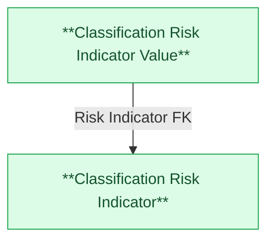

# MRMS — HLD Overview: Toàn cảnh thiết kế Atomic Layer

> **Nguồn:** Hệ thống MRMS — Quản lý rủi ro về thị trường chứng khoán (Dashboard chỉ tiêu tài chính, cảnh báo ngưỡng, báo cáo rủi ro)
>
> **Phạm vi:** HLD này chỉ thiết kế 2 bảng theo yêu cầu: RISK_INDICATOR (danh mục chỉ tiêu) và RISK_INDICATOR_VALUE (số liệu chỉ tiêu theo kỳ). Các bảng còn lại của MRMS (RISK_INDICATOR_CATEGORY, RISK_INDICATOR_CUSTOM, RISK_INDICATOR_SCHEDULE, RISK_INDICATOR_VALUE_HISTORY, RISK_ALERT_CONFIG, RISK_ALERT, RISK_ALERT_RESOLUTION, RISK_ALERT_RESOLUTION_FILE, RISK_ALERT_HISTORY, RISK_NOTIFICATION, RISK_REPORT_TYPE, RISK_REPORT_PLACEHOLDER_CONFIG, RISK_REPORT_UPLOAD_BATCH, RISK_REPORT_FILE, PERMISSION_GROUP, PERMISSION_GROUP_USER, PERMISSION_GROUP_INDICATOR) chưa thuộc phạm vi HLD này.
>
> **File chi tiết theo tầng:**
> - [MRMS_HLD_Tier1.md](MRMS_HLD_Tier1.md) — Classification Risk Indicator
> - [MRMS_HLD_Tier2.md](MRMS_HLD_Tier2.md) — Classification Risk Indicator Value

---

#### 7a. Bảng tổng quan Atomic entities

| Tier | BCV Core Object | BCV Concept | Category | Source Table | Source Table Change Mode | Mô tả bảng nguồn | Atomic Entity | Table Type | BCV Term |
|---|---|---|---|---|---|---|---|---|---|
| 1 | Common | [Common] Classification | — | RISK_INDICATOR | Update | Danh mục chỉ tiêu tài chính (trong nước & quốc tế) dùng cho Dashboard giám sát rủi ro (GDP, CPI, VNIndex, DXY...) | Classification Risk Indicator | Classification | Không có BCV term chuyên biệt cho "chỉ tiêu kinh tế vĩ mô/thị trường giám sát rủi ro"; bảng master định nghĩa chỉ tiêu (business key, tên, nhóm, đơn vị, nguồn mặc định) — không lưu giá trị đo lường. Gán Common/[Common] Classification theo chỉ đạo Data Modeler. |
| 2 | Common | [Common] Classification | — | RISK_INDICATOR_VALUE | Update | Số liệu hiện tại của chỉ tiêu theo từng kỳ (ngày/tháng/quý/năm) | Classification Risk Indicator Value | Classification | Không có BCV term riêng cho giá trị đo lường theo kỳ; nguồn cập nhật tại chỗ (update-in-place) theo kỳ — khớp tự nhiên với Table Type Classification/Upsert. Gán Common/[Common] Classification theo chỉ đạo Data Modeler — khác thiết kế tham khảo LinhLV (Transaction/Fact Append, dựa trên giả định Append cũ). Xem 7e #1. |

---

#### 7b. Diagram Atomic tổng (Mermaid)

---

#### 7c. Bảng Classification Value

| Source Table | Mô tả | BCV Term | Xử lý Atomic |
|---|---|---|---|
| RISK_INDICATOR_CATEGORY | Nhóm chỉ tiêu (Yếu tố vĩ mô, Yếu tố tiền tệ, Thị trường cổ phiếu...) | [Common] Classification | Classification Value. Scheme: MRMS_RISK_INDICATOR_CATEGORY. Có thêm STATUS/SET_CODE ngoài CODE/NAME — ứng viên promote thành entity riêng, xem 7e #2. |
| RISK_INDICATOR.SET_CODE | Bộ chỉ tiêu: 1=Trong nước, 2=Quốc tế | [Common] Classification | Classification Value. Scheme: MRMS_RISK_INDICATOR_SET. |
| RISK_INDICATOR.PERIOD_TYPE / RISK_INDICATOR_VALUE.PERIOD_TYPE | Tần suất/kỳ dữ liệu: 1=Ngày, 2=Tháng, 3=Quý, 4=Năm | [Common] Classification | Classification Value. Scheme: MRMS_RISK_PERIOD_TYPE. |
| RISK_INDICATOR.UNIT_CODE / RISK_INDICATOR_VALUE.UNIT_CODE | Đơn vị: 1=%, 2=Điểm, 3=Tỷ VND, 4=Triệu USD, 5=Hợp đồng, 6=Cổ phiếu, 7=Công ty, 8=VND, 9=Số tài khoản, 10=Đơn vị tính | [Common] Classification | Classification Value. Scheme: MRMS_RISK_UNIT. |
| RISK_INDICATOR.SOURCE_CODE / RISK_INDICATOR_VALUE.SOURCE_CODE | Nguồn dữ liệu: 1=Investing, 2=Tổng cục Thống kê, 3=Ngân hàng Nhà nước, 4=Nội bộ, 5=HNX, 6=VSDC | [Common] Classification | Classification Value. Scheme: MRMS_RISK_DATA_SOURCE. |
| RISK_INDICATOR_VALUE.DATA_ORIGIN | Nguồn gốc giá trị: 1=API CSDL tập trung, 2=User chỉnh sửa | [Common] Classification | Classification Value. Scheme: MRMS_RISK_DATA_ORIGIN. |

---

#### 7d. Junction Tables

*(Không có junction table trong phạm vi 2 bảng thiết kế lần này.)*

---

#### 7e. Điểm cần xác nhận

| # | Tier | Câu hỏi | Ảnh hưởng |
|---|---|---|---|
| 1 | 2 | Nguồn RISK_INDICATOR_VALUE có `data_change_mode = Update` (cập nhật tại chỗ theo kỳ, filter `period_date = {etl_date}`) — khớp tự nhiên với Table Type Classification/Upsert, không còn mismatch như đánh giá ban đầu (trước đó ghi nhầm Append). Vẫn cần xác nhận business key Upsert (VD: `INDICATOR_ID + PERIOD_TYPE + PERIOD_DATE`) khi sang LLD. Thiết kế tham khảo LinhLV trước đây xử lý bảng này là Transaction/Fact Append — dựa trên giả định Append cũ, nay không còn phù hợp với data_change_mode thực tế. | Ảnh hưởng thiết kế LLD (business key/ETL) của Classification Risk Indicator Value. Rủi ro mismatch coi như đã giải quyết. |
| 2 | 1 | RISK_INDICATOR_CATEGORY nên là Classification Value (như lần này) hay promote thành entity riêng "Classification Risk Indicator Category" (theo tiền lệ LinhLV — có STATUS + SET_CODE ngoài CODE/NAME)? | Ảnh hưởng FK field trên Classification Risk Indicator (Id+Code pair vs Classification Value code) nếu đổi quyết định sau. |
| 3 | 1 | RISK_INDICATOR_CUSTOM (chỉ tiêu tự tạo) có nên gộp vào Classification Risk Indicator ở lần thiết kế tiếp theo (theo tiền lệ LinhLV, dùng Indicator Type Code phân biệt) không? | Ảnh hưởng phạm vi entity Classification Risk Indicator nếu mở rộng sau. |
| 4 | 2 | RISK_INDICATOR_VALUE.CUMULATIVE_VALUE — cơ sở tính luỹ kế (từ đầu năm hay từ đầu kỳ) chưa rõ, cần data profiling. | Ảnh hưởng business_meaning/comment của attribute Cumulative Value ở LLD. |

---

#### 7f. Bảng ngoài scope

*(Không có bảng nào bị loại khỏi scope trong lần thiết kế này — các bảng liên quan chưa thiết kế được ghi nhận ở 6e/7e của từng Tier, không phải "ngoài scope".)*

---

## Entities

> Single source of truth cho metadata entity. `aggregate_atomic.py` parse section này để sinh `atomic_entities.yaml`.

> Format bắt buộc: heading `### N.` + dòng `**Description:**` trong 500 ký tự đầu tiên sau heading.

### 1. Classification Risk Indicator
**Tier:** 1 | **Source:** `RISK_INDICATOR` | **BCV Concept:** [Common] Classification | **BCO:** Common | **Table Type:** Classification
**Domain Prefix:** Classification
**Description:** Danh mục chỉ tiêu tài chính rủi ro (vĩ mô, tiền tệ, thị trường cổ phiếu...) dùng cho Dashboard giám sát rủi ro của MRMS — gồm mã, tên, nhóm, đơn vị, nguồn dữ liệu mặc định và tần suất cập nhật. BCV Concept = [Common] Classification theo chỉ đạo Data Modeler.

**Grain:** 1 dòng = 1 chỉ tiêu tài chính rủi ro (VD: GDP_VN, CPI_VN, VNIndex).

**Attributes chính:** Risk Indicator Code (BK = INDICATOR_CODE), Indicator Name, Risk Indicator Category Code (Classification Value, tra cứu RISK_INDICATOR_CATEGORY), Indicator Set Code, Period Type Code, Unit Code, Data Source Code, Display Order, Display Flag, Active Flag, Last Sync Time.

### 2. Classification Risk Indicator Value
**Tier:** 2 | **Source:** `RISK_INDICATOR_VALUE` | **BCV Concept:** [Common] Classification | **BCO:** Common | **Table Type:** Classification
**Domain Prefix:** Classification
**Description:** Giá trị thực tế của từng chỉ tiêu tài chính rủi ro theo kỳ (ngày/tháng/quý/năm), FK đến Classification Risk Indicator. BCV Concept = [Common] Classification theo chỉ đạo Data Modeler — khác thiết kế tham khảo trước đây (Transaction/Fact Append); xem điểm cần xác nhận 7e #1.

**Grain:** 1 dòng = 1 chỉ tiêu × 1 kỳ dữ liệu (PERIOD_TYPE + PERIOD_DATE).

**Attributes chính:** Risk Indicator Value Code (BK), Risk Indicator Id/Code (FK), Period Type Code, Period Value, Period Year, Period Date, Period Label, Value, Cumulative Value, Unit Code, Data Source Code, Data Origin Code.
