# NHNCK — HLD Overview: Toàn cảnh thiết kế Atomic Layer

> **Nguồn:** Hệ thống NHNCK — Phân hệ Quản lý giám sát người hành nghề chứng khoán (Oracle)
>
> **Phạm vi:** Đăng ký, cấp/thu hồi chứng chỉ hành nghề, đào tạo, thi sát hạch, vi phạm, đào tạo sau CCHN.
>
> **File chi tiết theo tầng:**
> - [NHNCK_HLD_Tier1.md](NHNCK_HLD_Tier1.md) — Reference Data: Regulatory Authority Organization Unit, Securities Organization Reference, License Decision Document, Securities Practitioner License Certificate Type (Geographic Area đã chuyển sang nguồn ECAT — xem mục 7f)
> - [NHNCK_HLD_Tier2.md](NHNCK_HLD_Tier2.md) — Securities Practitioner, Securities Practitioner Reason Change History, Professional Training Class, Qualification Examination Assessment
> - [NHNCK_HLD_Tier3.md](NHNCK_HLD_Tier3.md) — License Certificate Document, License Application, Employment Status, Related Party, Conduct Violation, Organization Employment Report, Training Class Enrollment, Examination Assessment Result, Examination Assessment Fee
> - [NHNCK_HLD_Tier4.md](NHNCK_HLD_Tier4.md) — License Application sub-entities (×5), Professional Training History

---

#### 7a. Bảng tổng quan Atomic entities

| Tier | BCV Core Object | BCV Concept | Category | Source Table | Source Table Change Mode | Mô tả bảng nguồn | Atomic Entity | Table Type | BCV Term |
|---|---|---|---|---|---|---|---|---|---|
| 1 | Involved Party | [Involved Party] Organization | Organization | UNITS | Update | Danh mục đơn vị thuộc UBCKNN | Regulatory Authority Organization Unit | Fundamental | Organization — cấu trúc cây self-referencing. Cùng Atomic entity với DEPARTMENTS. Phân biệt bằng Organization Unit Type Code và Source System Code. |
| 1 | Involved Party | [Involved Party] Organization | Organization | DEPARTMENTS | Update | Danh mục phòng ban thuộc UBCKNN | Regulatory Authority Organization Unit | Fundamental | Organization — cùng Atomic entity với UNITS. Organization Unit Type Code = DEPARTMENT, Source System Code = NHNCK.DEPARTMENTS. Tách attr file theo nguồn. |
| 1 | Involved Party | [Involved Party] Organization | Organization | ORGANIZATIONS | Update | Thông tin các tổ chức tham gia TTCK (CTCK, QLQ, Ngân hàng...) | Securities Organization Reference | Fundamental | Organization — entity nghiệp vụ phong phú, FK từ nhiều bảng. |
| 1 | Documentation | [Documentation] Gov. Registration Document | Government Registration Document | DECISIONS | Update | Danh mục các quyết định hành chính do UBCKNN ban hành | Securities Practitioner License Decision Document | Fundamental | Government Registration Document — được FK từ Certificate Document (×3), Certificate Group Document, Conduct Violation, Examination Assessment. |
| 1 | Documentation | [Documentation] Gov. Registration Document | Government Registration Document | CERTIFICATES | Update | Danh mục các loại chứng chỉ hành nghề chứng khoán | Securities Practitioner License Certificate Type | Fundamental | Government Registration Document — danh mục loại CCHN, có processing_days/sort_order/description nên là entity thật (không phải Classification Value). FK target cho Certificate Type Id ở License Application/Certificate Document/Organization Employment Report/Examination Assessment Result/Fee, và cross-source từ IAM User. |
| 1 | Common | [Common] Application Status | — | APPLICATION_STATUSES | Update | Danh mục trạng thái hồ sơ đăng ký CCHN | Classification Application Status | Relative | BCV Core Object gán Common theo quy tắc mặc định. Nâng cấp từ Classification Value (scheme APPLICATION_STATUS/NHNCK_APPLICATION_STATUS, 2026-07-09) lên entity thật vì có đầy đủ audit fields + SORT_ORDER + LABEL. |
| 1 | Common | [Common] Document | — | DOCUMENTS | Update | Danh mục các tài liệu/hồ sơ cần nộp theo thủ tục CCHN | Classification Document | Relative | BCV Core Object gán Common theo quy tắc mặc định. Danh mục các tài liệu (không phải "loại tài liệu"). Nâng cấp từ Classification Value (scheme DOCUMENT_TYPE, 2026-07-09) lên entity thật. |
| 1 | Common | [Common] Specialization | — | SPECIALIZATIONS | Update | Danh mục chuyên môn/lĩnh vực hành nghề chứng khoán | Classification Specialization | Relative | BCV Core Object gán Common theo quy tắc mặc định — term BCV gần nhất ([Involved Party] Employment Position Qualification) khớp yếu, không dùng. Nâng cấp từ Classification Value (scheme SPECIALIZATION, 2026-07-09) lên entity thật. |
| 2 | Involved Party | [Involved Party] Individual | Individual | PROFESSIONALS | Update | Thông tin người hành nghề chứng khoán | Securities Practitioner | Fundamental | Individual — master entity người hành nghề. |
| 2 | Involved Party | [Involved Party] Individual | Individual | PROFESSIONAL_HISTORIES | Update | Lịch sử thay đổi thông tin cá nhân của người hành nghề | Securities Practitioner Reason Change History | Fundamental | Individual — ghi nhận 1 lần thay đổi thông tin (ai/khi nào/lý do). Thiết kế lại 2026-07-07 — bản cũ map nhầm sang PROFESSIONALS. FK đến Securities Practitioner qua PROFESSIONAL_ID. |
| 2 | Event | [Event] Training Course | Training Course | SPECIALIZATION_COURSES | Update | Danh mục khóa học chuyên môn bổ sung kiến thức | Securities Practitioner Professional Training Class | Fundamental | Training Course — master entity khóa học, không gắn với người cụ thể. |
| 2 | Communication | [Communication] Assessment | Assessment | EXAM_SESSIONS | Update | Danh mục các đợt thi sát hạch cấp CCHN | Securities Practitioner Qualification Examination Assessment | Fundamental | Assessment — FK đến Decision + Officer (Tier 1). |
| 3 | Documentation | [Documentation] Gov. Registration Document | Government Registration Document | CERTIFICATE_RECORDS | Update | Chứng chỉ hành nghề được cấp cho người hành nghề | Securities Practitioner License Certificate Document | Fundamental | Government Registration Document — FK đến Practitioner (Tier 2), Decision ×3 (Tier 1), Officer (Tier 1). |
| 3 | Documentation | [Documentation] Gov. Registration Document | Government Registration Document | APPLICATIONS | Update | Hồ sơ đăng ký chứng chỉ hành nghề chứng khoán | Securities Practitioner License Application | Fundamental | Government Registration Document — FK đến Practitioner (Tier 2), Certificate Document (Tier 3), Examination Assessment (Tier 2), Officer ×2 (Tier 1). |
| 3 | Involved Party | [Involved Party] Individual Employment Status | Employment Status | PROFESSIONAL_WORK_HISTORIES | Update | Lịch sử làm việc của người hành nghề tại các tổ chức | Securities Practitioner Employment Status | Fundamental | Individual Employment Status — FK đến Practitioner (Tier 2), Organization (Tier 1). |
| 3 | Involved Party | [Involved Party] Involved Party Relationship | Relationship | PROFESSIONAL_RELATIONSHIPS | Update | Thông tin quan hệ gia đình/xã hội của người hành nghề | Securities Practitioner Related Party | Fundamental | Involved Party Relationship — FK đến Practitioner (Tier 2). |
| 3 | Business Activity | [Business Activity] Conduct Violation | Conduct Violation | VIOLATIONS | Update | Vi phạm của người hành nghề kèm quyết định xử lý | Securities Practitioner Conduct Violation | Fundamental | Conduct Violation — FK đến Practitioner (Tier 2), Decision (Tier 1), Officer (Tier 1). |
| 3 | Documentation | [Documentation] Employer Registration | Employer Registration | ORGANIZATION_REPORTS | Update | Báo cáo của tổ chức về tình trạng làm việc của người hành nghề | Securities Practitioner Organization Employment Report | Fact Append | Employer Registration — FK đến Practitioner (Tier 2), Organization (Tier 1), Certificate Document (Tier 3), self-ref. Mỗi báo cáo là sự kiện nộp — insert-only. |
| 3 | Business Activity | [Business Activity] Business Activity | Business Activity | SPECIALIZATION_COURSE_DETAILS | Update | Chi tiết người tham gia khóa học + kết quả | Securities Practitioner Professional Training Class Enrollment | Fundamental | Business Activity — FK đến Training Class (Tier 2) + Practitioner (Tier 2). |
| 3 | Communication | [Communication] Assessment | Assessment | EXAM_DETAILS | Update | Kết quả thi sát hạch của từng thí sinh | Securities Practitioner Qualification Examination Assessment Result | Fundamental | Assessment — FK đến Examination Assessment (Tier 2), Practitioner (Tier 2), License Application (Tier 3, nullable). |
| 3 | Condition | [Condition] Financial Charge | Financial Charge | EXAM_SESSION_FEES | Update | Biểu phí thi quy định cho từng loại chứng chỉ trong từng đợt thi | Securities Practitioner Qualification Examination Assessment Fee | Fundamental | Financial Charge — biểu phí quy định (Condition), khác với License Application Fee (Transaction). |
| 4 | Documentation | [Documentation] Education Certificate | Education Certificate | APPLICATION_SPECIALIZATIONS | Update | Chứng chỉ/chuyên môn đào tạo đính kèm hồ sơ | Securities Practitioner License Application Education Certificate Document | Fundamental | Education Certificate — FK đến License Application (Tier 3), Officer (Tier 1). |
| 4 | Transaction | [Event] Transaction | Transaction | APPLICATION_FEES | Update | Phí thực tế phát sinh cho hồ sơ | Securities Practitioner License Application Fee | Fundamental | Transaction — phí thực tế từng hồ sơ (thực thu, có lifecycle thanh toán), khác Examination Assessment Fee (Condition). |
| 4 | Involved Party | [Involved Party] Individual Employment Status | Employment Status | APPLICATION_EXPERIENCES | Update | Kinh nghiệm làm việc khai báo trong hồ sơ đăng ký CCHN | Securities Practitioner License Application Employment Experience | Fundamental | Individual Employment Status — khai báo kinh nghiệm gắn với hồ sơ. FK đến License Application (Tier 3), Organization (Tier 1). |
| 4 | Involved Party | [Involved Party] Individual | Individual | APPLICATION_PROFESSIONALS | Update | Snapshot thông tin cá nhân người đăng ký tại thời điểm nộp hồ sơ | Securities Practitioner License Application Snapshot | Fundamental | Individual — snapshot nhân thân tại thời điểm nộp. FK đến License Application (Tier 3), Practitioner (Tier 2), Organization (Tier 1). |
| 4 | Documentation | [Documentation] Gov. Registration Document | Government Registration Document | APPLICATION_RE_EXAMS | Update | Liên kết hồ sơ cũ — kết quả thi — hồ sơ thi lại | Securities Practitioner License Application Re-Exam Request | Fundamental | Government Registration Document — entity theo dõi chu trình thi lại. FK đến License Application (Tier 3, ×2), Examination Assessment Result (Tier 3). |
| 4 | Involved Party | [Involved Party] Individual Employment Status | Employment Status | PROFESSIONAL_TRAININGS | Update | Lịch sử đào tạo, bồi dưỡng của người hành nghề | Securities Practitioner Professional Training History | Fundamental | Individual Employment Status — lịch sử đào tạo gắn với Practitioner (Tier 2), không phụ thuộc Application. |

---

#### 7b. Diagram Atomic tổng (Mermaid)

```mermaid
graph TD
    classDef atomic fill:#dcfce7,stroke:#16a34a,color:#14532d
    classDef shared fill:#fae8ff,stroke:#9333ea,color:#4a044e
    classDef pattern fill:#e2e8f0,stroke:#64748b,color:#1e293b

    %% Tier 1
    ORGUNIT["**Regulatory Authority Organization Unit**"]:::atomic
    SECORG["**Securities Organization Reference**"]:::atomic
    DECISION["**Securities Practitioner License Decision Document**"]:::atomic
    OFFICER["**Identity and Access Management User**\n(pending — xem IAM, thay Regulatory\nAuthority Officer đã loại khỏi scope)"]:::atomic
    APPSTATUS["**Classification Application Status**"]:::atomic
    CLSDOC["**Classification Document**"]:::atomic
    CLSSPEC["**Classification Specialization**"]:::atomic
    %% Shared
    ADDR["IP Postal Address"]:::shared
    EADDR["IP Electronic Address"]:::shared
    ALTID["IP Alt Identification"]:::shared

    %% Tier 2
    PRAC["**Securities Practitioner**"]:::atomic
    TRAINCLASS["**Professional Training Class**"]:::atomic
    EXAM["**Qualification Examination Assessment**"]:::atomic

    %% Tier 3
    CERTDOC["**License Certificate Document**"]:::atomic
    APP["**License Application**"]:::atomic
    EMPST["**Employment Status**"]:::atomic
    RELP["**Related Party**"]:::atomic
    VIO["**Conduct Violation**"]:::pattern
    EMPRPT["**Organization Employment Report**"]:::pattern
    ENROLL["**Training Class Enrollment**"]:::atomic
    EXAMRES["**Examination Assessment Result**"]:::atomic
    EXAMFEE["**Examination Assessment Fee**"]:::atomic

    %% Tier 4
    APPTRAIN["**License Application\nEducation Certificate Document**"]:::atomic
    APPFEE["**License Application Fee**"]:::atomic
    APPEXP["**License Application\nEmployment Experience**"]:::atomic
    APPSNAP["**License Application Snapshot**"]:::atomic
    APPREEX["**License Application\nRe-Exam Request**"]:::atomic
    PROFTRAIN["**Professional Training History**"]:::atomic

    %% Tier 1
    ORGUNIT -->|self-ref| ORGUNIT
    OFFICER -->|Organization Unit FK| ORGUNIT
    OFFICER -->|Department Organization Unit FK| ORGUNIT
    DECISION -->|Created By Officer FK| OFFICER
    SECORG -->|self-ref| SECORG
    SECORG -->|Created By Officer FK| OFFICER
    ADDR -.->|shared| SECORG
    EADDR -.->|shared| SECORG
    ALTID -.->|shared| SECORG

    %% Tier 2
    ADDR -.->|shared| PRAC
    EADDR -.->|shared| PRAC
    ALTID -.->|shared| PRAC
    EXAM -->|Decision FK| DECISION
    EXAM -->|Created By Officer FK| OFFICER
    EXAM -->|Updated By Officer FK| OFFICER

    %% Tier 3
    CERTDOC -->|Practitioner FK| PRAC
    CERTDOC -->|Issuance/Revocation/Cancellation Decision FK| DECISION
    CERTDOC -->|Created By Officer FK| OFFICER
    APP -->|Practitioner FK| PRAC
    APP -->|Certificate Document FK| CERTDOC
    APP -->|Examination Assessment FK| EXAM
    APP -->|Assignee Officer FK| OFFICER
    EMPST -->|Practitioner FK| PRAC
    EMPST -->|Organization FK| SECORG
    RELP -->|Practitioner FK| PRAC
    VIO -.->|Practitioner FK| PRAC
    VIO -.->|Decision FK| DECISION
    VIO -.->|Created By Officer FK| OFFICER
    EMPRPT -.->|Practitioner FK| PRAC
    EMPRPT -.->|Organization FK| SECORG
    EMPRPT -.->|Certificate Document FK| CERTDOC
    EMPRPT -.->|self-ref| EMPRPT
    ENROLL -->|Training Class FK| TRAINCLASS
    ENROLL -->|Practitioner FK| PRAC
    EXAMRES -->|Examination Assessment FK| EXAM
    EXAMRES -->|Practitioner FK| PRAC
    EXAMRES -->|License Application FK| APP
    EXAMFEE -->|Examination Assessment FK| EXAM

    %% Tier 4
    APPTRAIN -->|License Application FK| APP
    APPTRAIN -->|Appraised By Officer FK| OFFICER
    APPFEE -->|License Application FK| APP
    APPEXP -->|License Application FK| APP
    APPEXP -->|Organization FK| SECORG
    APPSNAP -->|License Application FK| APP
    APPSNAP -->|Practitioner FK| PRAC
    APPSNAP -->|Organization FK| SECORG
    APPREEX -->|License Application FK| APP
    APPREEX -->|Examination Assessment Result FK| EXAMRES
    PROFTRAIN -->|Practitioner FK| PRAC
```

---

#### 7c. Bảng Classification Value

| Source Table | Mô tả | BCV Term | Xử lý Atomic |
|---|---|---|---|
| EDUCATION_LEVELS | Danh mục trình độ học vấn | Classification Value | Scheme: EDUCATION_LEVEL. |
| CERTIFICATES | Danh mục loại chứng chỉ hành nghề | Classification Value | Scheme: CERTIFICATE_TYPE. Chỉ có CERTIFICATE_CODE + CERTIFICATE_NAME + metadata vận hành. |
| APPLICATION_SOURCES | Hình thức nộp hồ sơ | Classification Value | Scheme: APPLICATION_SOURCE. |
| POSITIONS | Danh mục chức vụ | Classification Value | Scheme: POSITION. BCV: Employment Position Type — reference data set, không phải entity. |
| BANKS | Danh mục ngân hàng (dùng cho nộp phí thi) | Classification Value | Scheme: BANK. FK từ EXAM_SESSIONS.BANK_ID — chỉ có mã + tên. |

---

#### 7d. Junction Tables

| Source Table | Mô tả | Entity chính | Xử lý trên Atomic |
|---|---|---|---|
| APPLICATION_DECISIONS | Liên kết hồ sơ CCHN với quyết định tương ứng (APPLICATION_ID + DECISION_ID) | Securities Practitioner License Decision Document | Pure junction — không tạo Atomic entity. Xác định bên Many: 1 quyết định bao gồm nhiều hồ sơ CCHN → denormalize thành `ARRAY<STRUCT<application_id BIGINT, application_code STRING>>` trên entity DECISIONS. |

---

#### 7e. Điểm cần xác nhận

| # | Tier | Câu hỏi | Ảnh hưởng |
|---|---|---|---|
| 1 | 2 | `SPECIALIZATION_COURSES.SPECIALIZATION_ID` trỏ đến SPECIALIZATIONS (Classification Value) — xác nhận không có FK đến entity nghiệp vụ Tier 1 nào khác. | **Xác nhận: đúng.** SPECIALIZATION_ID là Classification Value → giữ Professional Training Class ở Tier 2. |
| 2 | 3 | `EXAM_DETAILS.APPLICATION_ID` — xác nhận không có trường hợp thi không có hồ sơ đăng ký (APPLICATION_ID luôn not-null về mặt nghiệp vụ). | **Xác nhận: không có.** Thiết kế giữ APPLICATION_ID nullable về kỹ thuật để tương thích nguồn, nhưng ETL không load dòng thiếu APPLICATION_ID. |
| 3 | 4 | `APPLICATION_RE_EXAMS.RE_APPLICATION_ID` nullable — dòng với RE_APPLICATION_ID = null có hợp lệ không? | **Xác nhận: hợp lệ.** RE_APPLICATION_ID được fill sau khi hồ sơ thi lại được tạo — ETL load incremental theo trạng thái fill. |
| 4 | 4 | `APPLICATION_FEES` — trường hợp nào phí bị cập nhật (cancel, refund)? | **Xác nhận: có khả năng cập nhật phí.** Table Type Fundamental là đúng — SCD4A xử lý lifecycle thanh toán qua cột STATUS + audit. |
| 5 | 1 | `ORGANIZATIONS.ORGANIZATION_TYPE_ID` tự tham chiếu — là loại hình tổ chức (Classification Value) hay FK entity khác? | **Xác nhận: Classification Value.** Xử lý thành ORGANIZATION_TYPE_CODE trên Atomic, không tạo FK entity riêng. |
| 6 | 1 | `USERS` — Data Modeler quyết định (2026-07-07) không thiết kế Atomic entity riêng cho bảng này. | **Loại khỏi scope** (xem 7f). Entity `Regulatory Authority Officer` bị xóa. Định hướng: mọi FK "officer/user" audit trong NHNCK dùng chung entity `Identity and Access Management User` (nguồn IAM.USERS) — tạm `status: pending` trên 12 file phụ thuộc + `lld_NHNCK_CERTIFICATES.yaml` cho đến khi (a) xác nhận join key NHNCK.USERS.ID ↔ IAM.USERS, (b) `lld_IAM_USERS.yaml` lên `approved`. |
| 7 | 2 | `PROFESSIONAL_HISTORIES` — thiết kế cũ map nhầm toàn bộ `source_columns` sang `NHNCK.PROFESSIONALS` thay vì chính bảng `PROFESSIONAL_HISTORIES`. | **Đã thiết kế lại (2026-07-07).** Grain thực tế: 1 dòng = 1 lần ghi nhận thay đổi thông tin cá nhân. Entity mới `Securities Practitioner Reason Change History`, chỉ lưu `ID/PROFESSIONAL_ID/CHANGE_DATE/REASON_UPDATE`; ~43 cột snapshot còn lại loại khỏi thiết kế (xem `pending_design.yaml`). |
| 8 | 1 | `CERTIFICATES` — trước đây chỉ tồn tại dưới dạng Classification Value scheme rỗng, chưa có Atomic entity. | **Đã thiết kế mới (2026-07-07).** Entity `Securities Practitioner License Certificate Type` — là FK target thật cho `Certificate Type Id` (License Application ×2, Certificate Document, Examination Assessment Result, Examination Assessment Fee, Organization Employment Report) và cross-source cho `IAM.USERS.PRACTICE_CERTIFICATE_TYPE_ID` (`Practice Certificate Type Id`, tạm pending — chưa xác nhận join key IAM↔NHNCK). |
| 9 | 1 | `APPLICATION_STATUSES`, `DOCUMENTS`, `SPECIALIZATIONS` — nâng cấp từ Classification Value (scheme) lên Atomic entity thật (`table_type: Classification`), theo yêu cầu Data Modeler (2026-07-09). BCV Concept gán `Common` theo quy tắc mặc định của skill, không map term cụ thể trong `knowledge/terms.csv`. CREATED_AT/UPDATED_AT/CREATED_BY/UPDATED_BY loại khỏi thiết kế theo đúng quy ước NHNCK (không giữ pending — xem `lld_NHNCK_CERTIFICATES.yaml`, `lld_NHNCK_PROFESSIONALS.yaml`). | **Data Modeler review lại nếu tìm được term BCV chuyên biệt hơn.** Không chặn thiết kế. Scheme cũ `SPECIALIZATION`, `DOCUMENT_TYPE`, `NHNCK_APPLICATION_STATUS` trong `classification_schemes.yaml` đã deprecate — 3 entity tiêu thụ (Securities Practitioner License Application, Securities Practitioner License Application Education Certificate Document, Securities Practitioner License Application Employment Experience) đã thêm cặp FK Id + Code đến entity mới. |

---

#### 7f. Bảng ngoài scope

| Nhóm | Source Table | Mô tả bảng nguồn | Lý do ngoài scope |
|---|---|---|---|
| Isolated | COUNTRIES | Danh mục quốc gia/vùng lãnh thổ theo ISO 3166 | Dữ liệu địa giới chuẩn hóa tại ECAT — không tự thiết kế Atomic entity, chỉ tra cứu qua mã tham chiếu (2026-07-10). |
| Isolated | PROVINCES | Danh mục tỉnh/thành phố trực thuộc trung ương | Dữ liệu địa giới chuẩn hóa tại ECAT — không tự thiết kế Atomic entity, chỉ tra cứu qua mã tham chiếu (2026-07-10). |
| Isolated | DISTRICTS | Danh mục quận/huyện/thị xã | Dữ liệu địa giới chuẩn hóa tại ECAT — không tự thiết kế Atomic entity, chỉ tra cứu qua mã tham chiếu (2026-07-10). |
| Involved Party | USERS | Thông tin cán bộ/chuyên viên UBCKNN có tài khoản trong hệ thống NHNCK | Quyết định Data Modeler (2026-07-07) — không thiết kế Atomic entity riêng. Định hướng dùng chung entity Identity and Access Management User (nguồn IAM.USERS) cho mọi FK "officer/user" trong hệ thống. |
| System / Auth | USER_ROLES | Phân quyền người dùng theo vai trò | Operational/system data — không có giá trị nghiệp vụ. |
| System / Auth | ROLES | Danh mục vai trò trong hệ thống | Operational/system data. |
| System / Auth | PERMISSIONS | Danh mục quyền hạn trong hệ thống | Operational/system data. |
| System / Auth | PERMISSION_ROLES | Phân quyền theo nhóm vai trò | Operational/system data. |
| System / Auth | DEPARTMENT_ACCESS | Quản lý quyền khai thác giữa các phòng ban | Operational/system data. |
| System / Log | ACTION_LOGS | Nhật ký hành động của người dùng trên hệ thống | System audit log — không phải nghiệp vụ CCHN. |
| System / Config | SYSTEM_PARAMETERS | Tham số cấu hình hệ thống | Config data. |
| System / Config | AUTO_INCREMENT_CODES | Quản lý số tự tăng cho mã CCHN và mã tài liệu | Sequence/counter table — operational data. |
| System / Config | NOTIFICATION_CONFIGURATIONS | Cấu hình thông báo theo sự kiện nghiệp vụ | Application config data. |
| System / Config | BACKUP_SCHEDULES | Lịch tự động sao lưu cơ sở dữ liệu | Operational/system data. |
| System / Log | BACKUPS | Thông tin file sao lưu cơ sở dữ liệu | Operational/system data. |
| System / Log | EMAIL_LOGS | Nhật ký gửi email trong hệ thống | Operational log — không phải nghiệp vụ CCHN. |
| System / Log | SMS_LOGS | Nhật ký gửi SMS trong hệ thống | Operational log. |
| System / Log | SEND_AND_RECIEVE_LOGS | Nhật ký gửi nhận dữ liệu tích hợp | Operational log. |
| System / Log | DOCUMENT_SIGN_LOGS | Nhật ký ký số tài liệu | Operational log. |
| System / Log | SIGNATURE_LOGS | Nhật ký ký số hồ sơ/CCHN | Operational log. |
| System / Log | NOTIFICATIONS | Thông báo trong hệ thống | Operational/notification data. |
| Digital Cert | DIGITAL_CERTIFICATES | Chứng thư số PKI | Operational/PKI data — không phải CCHN. |
| Digital Cert | DIGITAL_CERTIFICATE_USERS | Người dùng được sử dụng chứng thư số | Operational/PKI data. |
| Application Config | CERTIFICATE_DOCUMENTS | Liên kết loại tài liệu với loại chứng chỉ | Application config — cấu hình quy trình, không phải instance data. |
| Application Config | CERTIFICATE_SPECIALIZATIONS | Liên kết chuyên môn với loại chứng chỉ | Application config. |
| Application Config | CERTIFICATE_DEPARTMENTS | Liên kết phòng ban với loại chứng chỉ | Application config. |
| Application Config | CERTIFICATE_NUMBER_TEMPLATES | Template sinh số chứng chỉ | Config/template data. |
| Application Config | PROCEDURES | Thủ tục hành chính cấp CCHN | Application config — cấu hình quy trình. |
| Application Config | PROCEDURE_DOCUMENTS | Liên kết thủ tục hành chính với tài liệu yêu cầu | Application config. |
| Application Config | PROCEDURE_FORMS | Liên kết thủ tục hành chính với biểu mẫu | Application config. |
| Application Config | FORMS | Biểu mẫu liên quan đến quy trình cấp CCHN | Application config. |
| Application Config | LEGAL_DOCUMENTS | Văn bản pháp lý về hành nghề chứng khoán | Application config — tài liệu tham chiếu pháp lý, không phải instance data. |
| Archive / Physical | APPLICATION_ARCHIVES | Thông tin lưu trữ vật lý hồ sơ CCHN | Physical archive metadata — không có giá trị phân tích. |
| Archive / Physical | CERTIFICATE_ARCHIVES | Thông tin lưu trữ bản CCHN giấy | Physical archive metadata. |
| Operational | CERTIFICATE_CONVERSION_REQUESTS | Yêu cầu chuyển đổi CCHN bản giấy sang bản điện tử | Operational/migration data — nghiệp vụ 1 lần, không có giá trị phân tích liên tục. |
| Operational | ORGANIZATION_REPORT_LOG_SYNCS | Nhật ký đồng bộ dữ liệu báo cáo từ tổ chức | Operational sync log. |
| Operational | ORGANIZATION_REPORT_YEARLYS | Báo cáo hàng năm của tổ chức về người hành nghề | Cần khảo sát thêm cấu trúc cột để xác định có phải entity độc lập không. |
| Isolated | POST_CERT_TRAINING_COURSES | Danh mục khóa học bồi dưỡng kiến thức định kỳ sau cấp CCHN | Isolated entity — không có bảng đăng ký/enrollment liên quan trong scope; chỉ là danh mục tham chiếu không có giá trị phân tích độc lập tại thời điểm thiết kế. |
| Isolated | IDENTITY_INFO_C06S | Lịch sử xác thực danh tính người hành nghề với hệ thống C06 (Bộ Công An) | Isolated entity — không có file per-table đầy đủ, cột PROFESSIONAL_ID chỉ là suy luận từ tên bảng; thiếu thông tin cấu trúc cột để thiết kế entity. Đánh giá lại khi có nhu cầu khai thác. |
| Batch Processing | CERTIFICATE_RECORD_GROUPS | Nhóm quyết định cấp/thu hồi/hủy chứng chỉ (container batch) | Batch processing metadata — container tổ chức xử lý tập thể tại nguồn; thông tin quyết định đã có trên DECISIONS (Tier 1), danh sách CCHN đã có trên CERTIFICATE_RECORDS. |
| Batch Processing | CERTIFICATE_RECORD_GROUP_MEMBERS | Thành viên CCHN trong nhóm quyết định batch | Batch processing metadata — danh sách CCHN trong nhóm; dữ liệu nghiệp vụ (REVOCATION_REASON, REISSUE) thuộc về CERTIFICATE_RECORDS, không phải thuộc quan hệ thành viên. |
| Batch Processing | APPLICATION_GROUPS | Nhóm hồ sơ CCHN xử lý tập thể (container batch) | Batch processing metadata — container tổ chức xử lý tập thể tại nguồn; thông tin quyết định đã có trên DECISIONS (Tier 1), danh sách hồ sơ đã có trên APPLICATIONS. |
| Batch Processing | APPLICATION_GROUP_MEMBERS | Thành viên (hồ sơ) trong nhóm xử lý tập thể | Batch processing metadata — danh sách hồ sơ trong nhóm; không có attribute nghiệp vụ độc lập ngoài FK và ORDER_INDEX vận hành. |
| Source Process Log | APPLICATION_LOGS | Nhật ký thay đổi trạng thái/nội dung hồ sơ | Quy trình internal tác nghiệp ứng dụng nguồn — không phải sự kiện nghiệp vụ độc lập. |
| Source Process Log | VERIFY_APPLICATION_STATUSES | Bước xác minh hồ sơ tại từng cấp phê duyệt | Bước xác minh trung gian trong quy trình nguồn — không có giá trị phân tích độc lập. |
| Source Process Log | CERTIFICATE_RECORD_STATUS_HISTORIES | Lịch sử thay đổi trạng thái chứng chỉ hành nghề | Audit log nguồn — trạng thái lifecycle nằm trên CERTIFICATE_RECORDS; log nguồn không cần thiết trên Atomic. |
| Source Process Log | CERTIFICATE_RECORD_LOGS | Nhật ký hoạt động trên chứng chỉ hành nghề | Audit log nguồn — không phải sự kiện nghiệp vụ tường minh. |
| Sub-process | APPLICATION_DOCUMENTS | Tài liệu vật lý (file attachment) đính kèm hồ sơ đăng ký | Bảng lưu file attachment (tên file, đường dẫn, loại tài liệu) — không có attribute nghiệp vụ độc lập ngoài con trỏ file; thông tin loại tài liệu đã có trên APPLICATION_SPECIALIZATIONS. |
| Sub-process | APPLICATION_DOCUMENT_HISTORIES | Lịch sử thẩm định từng tài liệu trong hồ sơ | Quy trình internal tác nghiệp từ nguồn — không phản ánh sự kiện nghiệp vụ có giá trị phân tích. |
| Sub-process | APPLICATION_SUPPLEMENTS | Thông tin bổ sung hồ sơ CCHN | Sub-process bổ sung hồ sơ theo yêu cầu — cấu trúc internal tác nghiệp tại nguồn. |
| Sub-process | DECISION_DOCUMENTS | Tài liệu đính kèm của quyết định | Sub-process lưu file đính kèm — không có giá trị phân tích nghiệp vụ độc lập. |

---

## Entities

> Single source of truth cho metadata entity. `aggregate_atomic.py` parse section này để sinh `atomic_entities.yaml`.

> Format bắt buộc: heading `### N.` + dòng `**Description:**` trong 500 ký tự đầu tiên sau heading.

### 2. Regulatory Authority Organization Unit
**Tier:** 1 | **Source:** `UNITS, DEPARTMENTS` | **BCV Concept:** [Involved Party] Organization | **BCO:** Involved Party | **Table Type:** Fundamental
**Description:** Đơn vị và phòng ban thuộc UBCKNN — cấu trúc cây self-referencing DEPARTMENT → UNIT. Phân biệt bằng Organization Unit Type Code (ETL-derived). Dùng chung làm FK tổ chức nội bộ.

### 3. Securities Organization Reference
**Tier:** 1 | **Source:** `ORGANIZATIONS` | **BCV Concept:** [Involved Party] Organization | **BCO:** Involved Party | **Table Type:** Fundamental
**Description:** Tổ chức tham gia thị trường chứng khoán được UBCKNN quản lý (CTCK, QLQ, Ngân hàng, v.v.). Ghi nhận mã tổ chức, tên, loại hình, vốn điều lệ và trạng thái hoạt động.

### 4. Securities Practitioner License Decision Document
**Tier:** 1 | **Source:** `DECISIONS` | **BCV Concept:** [Documentation] Gov. Registration Document | **BCO:** Documentation | **Table Type:** Fundamental
**Description:** Quyết định hành chính do UBCKNN ban hành liên quan đến CCHN — cấp, thu hồi, hủy CCHN hoặc công nhận kết quả thi. Ghi nhận số quyết định, loại, ngày ký và người ký.

### 5. Regulatory Authority Officer — ĐÃ LOẠI KHỎI SCOPE (2026-07-07)
**Tier:** 1 | **Source:** `USERS` (out of scope) | **Thay thế:** `Identity and Access Management User` (nguồn IAM.USERS, `status: pending`)
**Ghi chú:** Data Modeler quyết định không thiết kế Atomic entity riêng cho NHNCK.USERS. Xem 7e #6 và 7f.

### 5b. Securities Practitioner License Certificate Type — MỚI (2026-07-07)
**Tier:** 1 | **Source:** `CERTIFICATES` | **BCV Concept:** [Documentation] Gov. Registration Document | **BCO:** Documentation | **Table Type:** Fundamental
**Description:** Danh mục loại chứng chỉ hành nghề chứng khoán — tên CCHN, mô tả, số ngày xử lý, thứ tự hiển thị. FK target cho `Certificate Type Id` (License Application ×2, Certificate Document, Examination Assessment Result, Examination Assessment Fee, Organization Employment Report) và cross-source cho IAM User (`Practice Certificate Type Id`, pending). Xem 7e #8.

### 5c. Classification Application Status — MỚI (2026-07-09)
**Tier:** 1 | **Source:** `APPLICATION_STATUSES` | **BCV Concept:** [Common] Application Status | **BCO:** Common | **Table Type:** Relative
**Domain Prefix:** Classification
**Description:** Danh mục trạng thái hồ sơ đăng ký CCHN — mã, tên, nhãn hiển thị, mô tả, thứ tự sắp xếp. Nâng cấp từ Classification Value (scheme APPLICATION_STATUS/NHNCK_APPLICATION_STATUS) lên entity thật. FK target cho Application Status Id (Securities Practitioner License Application). Xem 7e #9.

### 5d. Classification Document — MỚI (2026-07-09)
**Tier:** 1 | **Source:** `DOCUMENTS` | **BCV Concept:** [Common] Document | **BCO:** Common | **Table Type:** Relative
**Domain Prefix:** Classification
**Description:** Danh mục các tài liệu/hồ sơ cần nộp theo thủ tục cấp CCHN — mã, tên, mô tả tham chiếu. Là danh mục các tài liệu, không phải phân loại "loại tài liệu". Nâng cấp từ Classification Value (scheme DOCUMENT_TYPE) lên entity thật. FK target cho Document Id (Securities Practitioner License Application Employment Experience). Xem 7e #9.

### 5e. Classification Specialization — MỚI (2026-07-09)
**Tier:** 1 | **Source:** `SPECIALIZATIONS` | **BCV Concept:** [Common] Specialization | **BCO:** Common | **Table Type:** Relative
**Domain Prefix:** Classification
**Description:** Danh mục chuyên môn/lĩnh vực hành nghề chứng khoán. Nâng cấp từ Classification Value (scheme SPECIALIZATION) lên entity thật. FK target cho Specialization Id (Securities Practitioner License Application Education Certificate Document). Xem 7e #9.

### 6. Securities Practitioner
**Tier:** 2 | **Source:** `PROFESSIONALS` | **BCV Concept:** [Involved Party] Individual | **BCO:** Involved Party | **Table Type:** Fundamental
**Description:** Người hành nghề chứng khoán được UBCKNN quản lý. Ghi nhận thông tin nhân thân và trạng thái hành nghề.

### 6b. Securities Practitioner Reason Change History — THIẾT KẾ LẠI (2026-07-07)
**Tier:** 2 | **Source:** `PROFESSIONAL_HISTORIES` | **BCV Concept:** [Involved Party] Individual | **BCO:** Involved Party | **Table Type:** Fundamental
**Description:** Ghi nhận 1 lần thay đổi thông tin cá nhân của người hành nghề — ai bị thay đổi, khi nào, lý do gì. Chỉ lưu `ID/PROFESSIONAL_ID/CHANGE_DATE/REASON_UPDATE`. Xem 7e #7.

### 7. Securities Practitioner Professional Training Class
**Tier:** 2 | **Source:** `SPECIALIZATION_COURSES` | **BCV Concept:** [Event] Training Course | **BCO:** Event | **Table Type:** Fundamental
**Description:** Khóa học chuyên môn bổ sung kiến thức cho người hành nghề chứng khoán. Master entity của khóa học — ghi nhận mã, tên, loại chuyên môn, thời gian và địa điểm thi.

### 8. Securities Practitioner Qualification Examination Assessment
**Tier:** 2 | **Source:** `EXAM_SESSIONS` | **BCV Concept:** [Communication] Assessment | **BCO:** Communication | **Table Type:** Fundamental
**Description:** Đợt thi sát hạch cấp CCHN do UBCKNN tổ chức. Ghi nhận thời gian đăng ký và thi, địa điểm, hình thức nộp hồ sơ, quyết định công nhận kết quả và phí thi.

### 9. Securities Practitioner License Certificate Document
**Tier:** 3 | **Source:** `CERTIFICATE_RECORDS` | **BCV Concept:** [Documentation] Gov. Registration Document | **BCO:** Documentation | **Table Type:** Fundamental
**Description:** Chứng chỉ hành nghề chứng khoán được cấp cho người hành nghề. Ghi nhận số CCHN, loại, ngày cấp, trạng thái và 3 quyết định liên quan (cấp/thu hồi/hủy). FK đến Practitioner.

### 10. Securities Practitioner License Application
**Tier:** 3 | **Source:** `APPLICATIONS` | **BCV Concept:** [Documentation] Gov. Registration Document | **BCO:** Documentation | **Table Type:** Fundamental
**Description:** Hồ sơ đăng ký chứng chỉ hành nghề chứng khoán. Ghi nhận loại đăng ký, loại hồ sơ, trạng thái, ngày nộp, CCHN liên quan và kết quả thi. FK đến Practitioner và Officer phụ trách.

### 11. Securities Practitioner Employment Status
**Tier:** 3 | **Source:** `PROFESSIONAL_WORK_HISTORIES` | **BCV Concept:** [Involved Party] Individual Employment Status | **BCO:** Involved Party | **Table Type:** Fundamental
**Description:** Giai đoạn làm việc của người hành nghề tại một tổ chức chứng khoán. Ghi nhận tổ chức, chức vụ, phòng ban, ngày bắt đầu và ngày kết thúc (NULL = đang làm việc).

### 12. Securities Practitioner Related Party
**Tier:** 3 | **Source:** `PROFESSIONAL_RELATIONSHIPS` | **BCV Concept:** [Involved Party] Involved Party Relationship | **BCO:** Involved Party | **Table Type:** Fundamental
**Description:** Quan hệ thân nhân của người hành nghề chứng khoán. Ghi nhận loại quan hệ, họ tên, năm sinh, địa chỉ, nghề nghiệp và số giấy tờ định danh của người thân.

### 13. Securities Practitioner Conduct Violation
**Tier:** 3 | **Source:** `VIOLATIONS` | **BCV Concept:** [Business Activity] Conduct Violation | **BCO:** Business Activity | **Table Type:** Fundamental
**Description:** Vi phạm pháp luật hoặc hành chính của người hành nghề chứng khoán được ghi nhận kèm quyết định xử lý. Mỗi dòng = 1 sự kiện vi phạm insert-only. FK đến Practitioner và Decision.

### 14. Securities Practitioner Organization Employment Report
**Tier:** 3 | **Source:** `ORGANIZATION_REPORTS` | **BCV Concept:** [Documentation] Employer Registration | **BCO:** Documentation | **Table Type:** Fact Append
**Description:** Báo cáo của tổ chức về tình trạng làm việc của người hành nghề. Mỗi dòng = 1 lần nộp báo cáo insert-only. Ghi nhận loại báo cáo, trạng thái làm việc, chức vụ và ngày báo cáo.

### 15. Securities Practitioner Professional Training Class Enrollment
**Tier:** 3 | **Source:** `SPECIALIZATION_COURSE_DETAILS` | **BCV Concept:** [Business Activity] Business Activity | **BCO:** Business Activity | **Table Type:** Fundamental
**Description:** Đăng ký tham gia và kết quả học tập của người hành nghề tại một khóa đào tạo chuyên môn. Ghi nhận điểm thi, kết quả đạt/không đạt và trạng thái ghi danh.

### 16. Securities Practitioner Qualification Examination Assessment Result
**Tier:** 3 | **Source:** `EXAM_DETAILS` | **BCV Concept:** [Communication] Assessment | **BCO:** Communication | **Table Type:** Fundamental
**Description:** Kết quả thi sát hạch của từng thí sinh trong một đợt thi. Ghi nhận điểm thi luật, điểm chuyên môn, kết quả từng phần và kết quả tổng thể. FK đến Exam Assessment và Practitioner.

### 17. Securities Practitioner Qualification Examination Assessment Fee
**Tier:** 3 | **Source:** `EXAM_SESSION_FEES` | **BCV Concept:** [Condition] Financial Charge | **BCO:** Condition | **Table Type:** Fundamental
**Description:** Biểu phí thi sát hạch quy định cho từng loại CCHN trong từng đợt thi (Condition). Phân biệt với License Application Fee là phí thực tế thu từng hồ sơ (Transaction).

### 18. Securities Practitioner License Application Education Certificate Document
**Tier:** 4 | **Source:** `APPLICATION_SPECIALIZATIONS` | **BCV Concept:** [Documentation] Education Certificate | **BCO:** Documentation | **Table Type:** Fundamental
**Description:** Chứng chỉ hoặc bằng chuyên môn đào tạo đính kèm trong hồ sơ đăng ký CCHN. Ghi nhận loại chuyên môn, file đính kèm, trạng thái thẩm định và cán bộ thẩm định.

### 19. Securities Practitioner License Application Fee
**Tier:** 4 | **Source:** `APPLICATION_FEES` | **BCV Concept:** [Event] Transaction | **BCO:** Transaction | **Table Type:** Fundamental
**Description:** Phí thực tế phát sinh cho hồ sơ đăng ký CCHN — phí nộp hồ sơ, phí cấp CCHN (Transaction). Có lifecycle riêng qua trạng thái thanh toán. Phân biệt với Examination Assessment Fee (Condition).

### 20. Securities Practitioner License Application Employment Experience
**Tier:** 4 | **Source:** `APPLICATION_EXPERIENCES` | **BCV Concept:** [Involved Party] Individual Employment Status | **BCO:** Involved Party | **Table Type:** Fundamental
**Description:** Kinh nghiệm làm việc khai báo trong hồ sơ đăng ký CCHN. Ghi nhận tổ chức, thời gian làm việc, chức vụ, phòng ban, số BHXH và thông tin hợp đồng lao động.

### 21. Securities Practitioner License Application Snapshot
**Tier:** 4 | **Source:** `APPLICATION_PROFESSIONALS` | **BCV Concept:** [Involved Party] Individual | **BCO:** Involved Party | **Table Type:** Fundamental
**Description:** Snapshot thông tin nhân thân của người đăng ký tại thời điểm nộp hồ sơ. Denormalize toàn bộ trường định danh, địa chỉ và liên lạc từ Practitioner. Loại bỏ USERNAME/PASSWORD.

### 22. Securities Practitioner License Application Re-Exam Request
**Tier:** 4 | **Source:** `APPLICATION_RE_EXAMS` | **BCV Concept:** [Documentation] Gov. Registration Document | **BCO:** Documentation | **Table Type:** Fundamental
**Description:** Liên kết theo dõi chu trình thi lại — hồ sơ gốc, kết quả thi trượt và hồ sơ đăng ký thi lại mới (nullable nếu chưa nộp). FK đến License Application (×2) và Exam Assessment Result.

### 23. Securities Practitioner Professional Training History
**Tier:** 4 | **Source:** `PROFESSIONAL_TRAININGS` | **BCV Concept:** [Involved Party] Individual Employment Status | **BCO:** Involved Party | **Table Type:** Fundamental
**Description:** Lịch sử đào tạo và bồi dưỡng của người hành nghề chứng khoán. Ghi nhận thời gian, địa điểm đào tạo, chuyên ngành, khen thưởng và kỷ luật. FK đến Practitioner.
