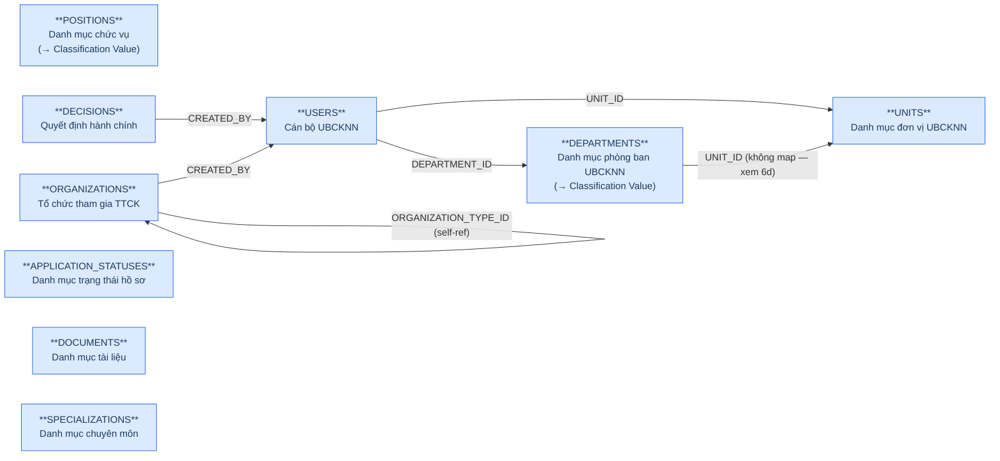
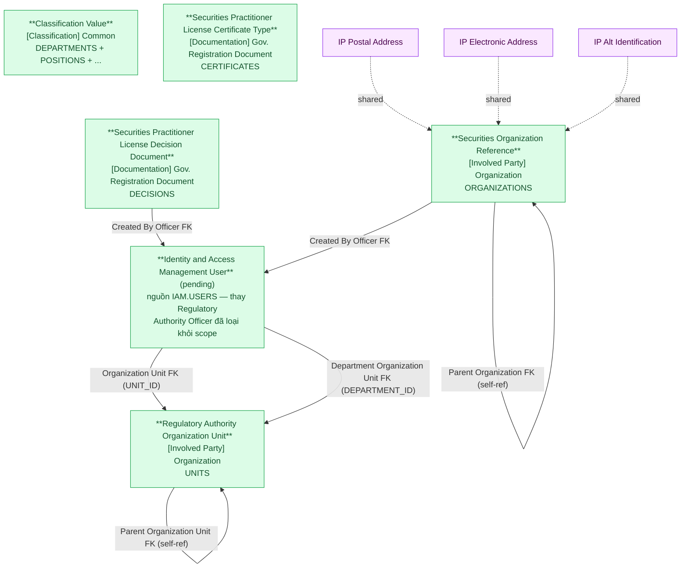

# NHNCK — HLD Tier 1: Reference Data (Main Entities)

> **Phụ thuộc:** Không phụ thuộc Tier nào — là nền tảng cho tất cả Tier sau.
>
> **Thiết kế theo:** [NHNCK_HLD_Overview.md](NHNCK_HLD_Overview.md)

---

## 6a. Bảng tổng quan BCV Concept

> **Cập nhật (2026-07-10):** COUNTRIES/PROVINCES/DISTRICTS đã loại khỏi scope Atomic —
> dữ liệu địa giới hành chính chuyển sang chuẩn hóa tại nguồn **ECAT** (xem
> `ECAT_HLD_Tier1.md`). NHNCK không tự thiết kế Geographic Area nữa, chỉ tham chiếu
> qua lookup giá trị. Xem mục 7f của `NHNCK_HLD_Overview.md`.

| BCV Core Object | BCV Concept | Category | Source Table | Source Table Change Mode | Mô tả bảng nguồn | Atomic Entity | Table Type | BCV Term |
|---|---|---|---|---|---|---|---|---|
| Involved Party | [Involved Party] Organization | Organization | UNITS | Update | Danh mục đơn vị thuộc UBCKNN | Regulatory Authority Organization Unit | Fundamental | Organization — cơ cấu tổ chức UBCKNN dạng cây self-referencing. **[SỬA 2026-09-11]** DEPARTMENTS đã tách khỏi entity này theo yêu cầu Data Modeler — nay UNITS là nguồn duy nhất, không còn phân biệt Organization Unit Type Code UNIT/DEPARTMENT. Xem dòng DEPARTMENTS ở mục 6d (Classification Value). |
| Involved Party | [Involved Party] Organization | Organization | ORGANIZATIONS | Update | Thông tin các tổ chức tham gia TTCK (CTCK, QLQ, Ngân hàng...) | Securities Organization Reference | Fundamental | Organization — *"Identifies an Involved Party that may stand alone in an operational or legal context."* Cấu trúc trường: mã tổ chức, tên, loại hình, vốn điều lệ, trạng thái, self-ref PARENT_ID. Được FK từ Employment Status và Organization Employment Report. |
| Documentation | [Documentation] Gov. Registration Document | Government Registration Document | DECISIONS | Update | Danh mục các quyết định hành chính do UBCKNN ban hành | Securities Practitioner License Decision Document | Fundamental | Government Registration Document — *"Identifies a Documentation Item that is issued by a principality or sovereignty."* Cấu trúc trường: số QĐ, tiêu đề, loại quyết định, ngày ký, người ký, trạng thái, file đính kèm. Được FK từ Certificate Document (×2), Certificate Group Document, Conduct Violation, Examination Assessment. |
| ~~Involved Party~~ | ~~[Involved Party] Individual~~ | ~~Individual~~ | USERS | Update | Thông tin cán bộ/chuyên viên UBCKNN có tài khoản trong hệ thống NHNCK | **LOẠI KHỎI SCOPE (2026-07-07)** — Regulatory Authority Officer đã xóa | — | Quyết định Data Modeler: không thiết kế Atomic entity riêng. Định hướng dùng chung Identity and Access Management User (IAM.USERS) — xem NHNCK_HLD_Overview.md 7e #6. |
| Documentation | [Documentation] Gov. Registration Document | Government Registration Document | CERTIFICATES | Update | Danh mục các loại chứng chỉ hành nghề chứng khoán | Securities Practitioner License Certificate Type | Fundamental | Government Registration Document — danh mục CCHN với processing_days/sort_order/description (entity thật, không phải Classification Value). Mới thiết kế 2026-07-07 — xem NHNCK_HLD_Overview.md 7e #8. |

---

## 6b. Diagram Source (Mermaid)

---

## 6c. Diagram Atomic (Mermaid)

---

## 6d. Danh mục & Tham chiếu

| Source Table | Mô tả | Scheme Code dự kiến | Ghi chú |
|---|---|---|---|
| POSITIONS | Danh mục chức vụ | NHNCK.POSITIONS | Chỉ có Code + Name → Classification Value (cl_value). Không tạo Atomic entity riêng. **Đưa vào scope, thiết kế xong (2026-09-11)** — xem `lld_NHNCK_POSITIONS.yaml`. |
| DEPARTMENTS | Danh mục phòng ban thuộc UBCKNN | NHNCK.DEPARTMENTS | **[SỬA 2026-09-11]** Trước đây gộp chung Atomic entity Regulatory Authority Organization Unit với UNITS — theo yêu cầu Data Modeler, tách ra map trực tiếp vào Classification Value (cl_value), mirror pattern APPLICATION_STATUSES. UNIT_ID (quan hệ cha) không còn map được — xem `pending_design.yaml`. Xem `lld_NHNCK_DEPARTMENTS.yaml`. |
| EDUCATION_LEVELS | Danh mục trình độ học vấn | NHNCK.EDUCATION_LEVELS | Classification Value (cl_value). Không có cột CODE riêng — cl_code = LEVEL_NAME. **Đưa vào scope, thiết kế xong (2026-09-11)** — xem `lld_NHNCK_EDUCATION_LEVELS.yaml`. |
| CERTIFICATES | Danh mục loại chứng chỉ hành nghề | CERTIFICATE_TYPE | Classification Value — chỉ có CERTIFICATE_CODE + CERTIFICATE_NAME + metadata vận hành. |
| APPLICATION_SOURCES | Hình thức nộp hồ sơ | APPLICATION_SOURCE | Classification Value. |
| APPLICATION_STATUSES | Danh mục trạng thái hồ sơ đăng ký CCHN | APPLICATION_STATUS | Classification Value. Từng nâng cấp thành entity thật Classification Application Status (2026-07-09) — revert lại 2026-08-20. Xem Overview.md 5c/7c. |
| DOCUMENTS | Danh mục các tài liệu/hồ sơ cần nộp theo thủ tục CCHN | DOCUMENT_TYPE | Classification Value. Từng nâng cấp thành entity thật Classification Document (2026-07-09) — revert lại 2026-08-20. Xem Overview.md 5d/7c. |
| SPECIALIZATIONS | Danh mục chuyên môn/lĩnh vực hành nghề chứng khoán | SPECIALIZATION | Classification Value. Từng nâng cấp thành entity thật Classification Specialization (2026-07-09) — revert lại 2026-08-20. Xem Overview.md 5e/7c. |

---

## 6e. Bảng chờ thiết kế

Không có bảng nào trong Tier 1 chưa đủ thông tin cột.

---

## 6f. Điểm cần xác nhận

| # | Câu hỏi | Ảnh hưởng |
|---|---|---|
| 1 | `DECISIONS.CREATED_BY` là FK thực đến USERS. | **Xác nhận.** FK thực → thiết kế giữ Created By Officer FK trên entity License Decision Document. |
| 2 | `ORGANIZATIONS` có bao gồm cả UBCKNN không? | **Xác nhận: không bao gồm.** ORGANIZATIONS chỉ chứa tổ chức tham gia TTCK bên ngoài → không có overlap với Regulatory Authority Organization Unit. |
| 3 | `ORGANIZATIONS.ORGANIZATION_TYPE_ID` tự tham chiếu — là loại hình tổ chức (Classification Value) hay FK entity khác? | **Xác nhận: Classification Value.** Xử lý thành ORGANIZATION_TYPE_CODE trên Atomic, không tạo FK entity riêng. |
| 4 | `APPLICATION_STATUSES`, `DOCUMENTS`, `SPECIALIZATIONS` — nâng cấp từ Classification Value (scheme) lên Atomic entity thật (`table_type: Relative`). BCV Concept gán `Common` theo quy tắc mặc định của skill, không map term cụ thể trong `knowledge/terms.csv`. | **Data Modeler review lại nếu tìm được term BCV chuyên biệt hơn.** Không chặn thiết kế — Common là fallback hợp lệ cho `table_type: Relative`. |
| 5 | `IDENTITY_INFO_C06S` — trước đây "Isolated" ngoài scope do thiếu file per-table. Nay có đủ cấu trúc cột: không có FK đến PROFESSIONALS (giả định cũ sai), chỉ có audit FK đến USERS. Mô tả nguồn "Lịch sử kiểm tra xác thực với C06" gợi ý ETL log, nhưng không có cột phân biệt nhiều lần check cho cùng 1 người (không version/sequence). | Đưa vào scope 2026-07-23 (Fundamental, entity `Individual`). **[ĐẢO NGƯỢC 2026-09-12]** Data Modeler quyết định bỏ thiết kế — trả `scope_status` về `out_of_scope` trong `brd_NHNCK.yaml`. LLD (`lld_NHNCK_IDENTITY_INFO_C06S.yaml` + 2 shared entity IP Postal Address/IP Alt Identification)/manifest/atomic_entities đã gỡ bỏ; scheme `NHNCK_C06_COUNTRY`/`NHNCK_C06_PROVINCE`/`NHNCK_C06_DISTRICT` đã xóa. Xem Overview Entities #5f + §7f. |
| 6 | `VERIFY_CERTIFICATE_CONVERSION_STATUSES` — từng thiết kế thử `Securities Practitioner License Certificate Conversion Status Review` (2026-08-13) nhưng FK cha `CONVERSION_REQUEST_ID` trỏ đến `CERTIFICATE_CONVERSION_REQUESTS` vẫn `out_of_scope`, không có Atomic FK cha nào resolve được. | **Đã xử lý (2026-08-14) — Data Modeler quyết định bỏ thiết kế Atomic entity đợt này**, `scope_status` trả về `pending` trong `brd_NHNCK.yaml`. **Chốt lại (2026-09-12) — Data Modeler quyết định `out_of_scope`** (không chờ bảng cha nữa): không có nhu cầu khai thác nghiệp vụ trên báo cáo. |
| 7 | **[MỚI 2026-09-10]** `ORGANIZATIONS.TAX_CODE` mới trong DDL — có tách IP Alt Identification (shared entity) hay giữ denormalized trên entity chính? | **Đã xử lý:** giữ denormalized trên `lld_NHNCK_ORGANIZATIONS.yaml` (attribute "Tax Code"), mirror pattern đã dùng ở `lld_SCMS_SC_FIRM_FOREIGN_BRANCH.yaml` — không tách shared entity. |
| 8 | **[MỚI 2026-09-10]** DDL mới thêm 8 bảng: `CONVERSION_PRACTICE_HISTORY_CONFIRMS`, `MCDT_RESULT_OUTBOX`, và 6 bảng `SIGNING_*` (AUDIT/CERTIFICATE/NOTE/PROFILE/SESSION/SIGNATURE_IMAGE); đồng thời xoá `BACKUPS`, `BACKUP_SCHEDULES`, `SYSTEM_PARAMETERS` và các bảng Data Pump export/import tạm thời. | **Đã xử lý theo quyết định Data Modeler (2026-09-10):** `MCDT_RESULT_OUTBOX` thiết kế mới (xem Tier4 #35). `CONVERSION_PRACTICE_HISTORY_CONFIRMS` + 6 `SIGNING_*` → out-of-scope (xem Overview §7f, nhóm "Conversion Flow"/"Digital Signing Subsystem"). 3 bảng bị xoá → đánh dấu "REMOVED FROM SOURCE" trong Overview §7f + `brd_NHNCK.yaml`, không xoá file lịch sử. |
| 9 | **[MỚI 2026-09-11]** `DEPARTMENTS` trước đây gộp chung Atomic entity `Regulatory Authority Organization Unit` với `UNITS` (self-referencing UNIT_ID). Data Modeler yêu cầu tách `DEPARTMENTS` map trực tiếp vào Classification Value (cl_value), mirror pattern `lld_NHNCK_APPLICATION_STATUSES.yaml`. `POSITIONS` (trước đây out_of_scope, chỉ dự kiến trong 6d) cũng đưa vào scope theo cùng pattern. | **Đã xử lý:** `lld_NHNCK_DEPARTMENTS.yaml` + `lld_NHNCK_POSITIONS.yaml` (mới) map vào cl_value. `UNIT_ID` (quan hệ cha của DEPARTMENTS) không còn map được — cl_value không hỗ trợ quan hệ phân cấp, xem `pending_design.yaml`. Entity con `lld_NHNCK_CERTIFICATE_DEPARTMENTS.yaml` cập nhật FK: cặp `Regulatory Authority Organization Unit Id/Code` → 1 trường `Department Code` (Classification Value), mirror pattern `Bank Code` trên `lld_NHNCK_EXAM_SESSIONS.yaml`. Entity `Regulatory Authority Organization Unit` hạ về `draft`, nay chỉ còn nguồn `UNITS`. |
