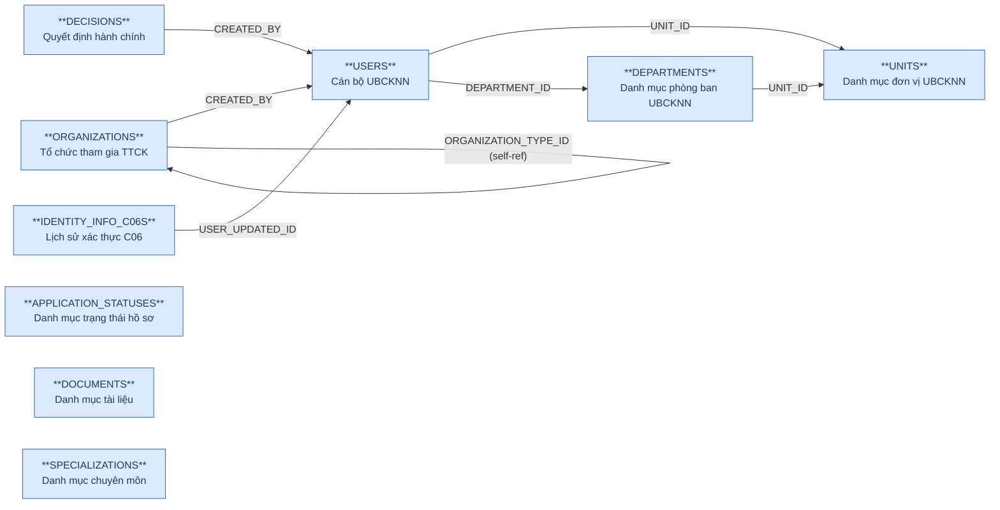
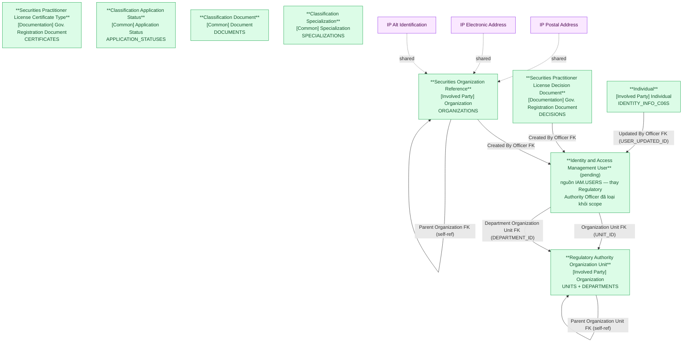

# NHNCK — HLD Tier 1: Reference Data (Main Entities)

> **Phụ thuộc:** Không phụ thuộc Tier nào — là nền tảng cho tất cả Tier sau.
>
> **Thiết kế theo:** [NHNCK_HLD_Overview.md](NHNCK_HLD_Overview.md)

---

## 6a. Bảng tổng quan BCV Concept

> **Cập nhật (2026-07-10):** COUNTRIES/PROVINCES/DISTRICTS đã loại khỏi scope Atomic —
> dữ liệu địa giới hành chính chuyển sang chuẩn hóa tại nguồn **ECAT** (xem
> `ECAT_HLD_Tier1.md`). NHNCK không tự thiết kế Geographic Area nữa, chỉ tham chiếu
> qua lookup giá trị. Xem mục 7f của `NHNCK_HLD_Overview.md`.

| BCV Core Object | BCV Concept | Category | Source Table | Source Table Change Mode | Mô tả bảng nguồn | Atomic Entity | Table Type | BCV Term |
|---|---|---|---|---|---|---|---|---|
| Involved Party | [Involved Party] Organization | Organization | UNITS | Update | Danh mục đơn vị thuộc UBCKNN | Regulatory Authority Organization Unit | Fundamental | Organization — cơ cấu tổ chức UBCKNN dạng cây self-referencing. Cùng Atomic entity với DEPARTMENTS. Phân biệt bằng Organization Unit Type Code (UNIT/DEPARTMENT) và Source System Code. |
| Involved Party | [Involved Party] Organization | Organization | DEPARTMENTS | Update | Danh mục phòng ban thuộc UBCKNN | Regulatory Authority Organization Unit | Fundamental | Organization — cùng Atomic entity với UNITS. Parent của DEPARTMENTS trỏ đến UNITS (UNIT_ID). Phân biệt bằng Organization Unit Type Code = DEPARTMENT và Source System Code. 2 attr file riêng biệt (attr_NHNCK_Units.csv + attr_NHNCK_Departments.csv). |
| Involved Party | [Involved Party] Organization | Organization | ORGANIZATIONS | Update | Thông tin các tổ chức tham gia TTCK (CTCK, QLQ, Ngân hàng...) | Securities Organization Reference | Fundamental | Organization — *"Identifies an Involved Party that may stand alone in an operational or legal context."* Cấu trúc trường: mã tổ chức, tên, loại hình, vốn điều lệ, trạng thái, self-ref PARENT_ID. Được FK từ Employment Status và Organization Employment Report. |
| Involved Party | [Involved Party] Individual | Personal Information | IDENTITY_INFO_C06S | Update | Lịch sử kiểm tra xác thực danh tính với C06 (CSDL quốc gia về dân cư) — thông tin nhân thân đầy đủ: họ tên, ngày sinh, số CCCD, giới tính, dân tộc, tôn giáo, nơi sinh, quê quán, địa chỉ thường trú/tạm trú, thông tin cha/mẹ/vợ chồng | Individual | Fundamental | (1) Term candidate: `[Involved Party] Individual` — *"Identifies an Involved Party who is a natural person."* Category Personal Information. (2) Cấu trúc trường: FULL_NAME, FIRST_NAME, BIRTH_DATE, IDENTITY_NUMBER, GENDER, NATIONAL, RELIGION, địa chỉ thường trú/tạm trú, PLACE_OF_BIRTH, HOMETOWN, thông tin cha/mẹ/vợ/chồng — đúng cấu trúc nhân thân của 1 thể nhân, không có FK đến PROFESSIONALS (khác giả định cũ khi còn ngoài scope). (3) Chọn `[Involved Party] Individual`. Fundamental — master entity thể nhân độc lập theo quyết định Data Modeler (2026-07-23), tách biệt với Securities Practitioner (vai trò hành nghề, nguồn PROFESSIONALS). |
| Documentation | [Documentation] Gov. Registration Document | Government Registration Document | DECISIONS | Update | Danh mục các quyết định hành chính do UBCKNN ban hành | Securities Practitioner License Decision Document | Fundamental | Government Registration Document — *"Identifies a Documentation Item that is issued by a principality or sovereignty."* Cấu trúc trường: số QĐ, tiêu đề, loại quyết định, ngày ký, người ký, trạng thái, file đính kèm. Được FK từ Certificate Document (×2), Certificate Group Document, Conduct Violation, Examination Assessment. |
| ~~Involved Party~~ | ~~[Involved Party] Individual~~ | ~~Individual~~ | USERS | Update | Thông tin cán bộ/chuyên viên UBCKNN có tài khoản trong hệ thống NHNCK | **LOẠI KHỎI SCOPE (2026-07-07)** — Regulatory Authority Officer đã xóa | — | Quyết định Data Modeler: không thiết kế Atomic entity riêng. Định hướng dùng chung Identity and Access Management User (IAM.USERS) — xem NHNCK_HLD_Overview.md 7e #6. |
| Documentation | [Documentation] Gov. Registration Document | Government Registration Document | CERTIFICATES | Update | Danh mục các loại chứng chỉ hành nghề chứng khoán | Securities Practitioner License Certificate Type | Fundamental | Government Registration Document — danh mục CCHN với processing_days/sort_order/description (entity thật, không phải Classification Value). Mới thiết kế 2026-07-07 — xem NHNCK_HLD_Overview.md 7e #8. |
| Common | [Common] Application Status | — | APPLICATION_STATUSES | Update | Danh mục trạng thái hồ sơ đăng ký CCHN | Classification Application Status | Classification | BCV Core Object gán Common theo quy tắc mặc định (table_type Classification). Không có term Common chuyên biệt khớp "Application Status" trong knowledge/terms.csv — ghi nhận, xem 6f. Nâng cấp từ Classification Value (scheme APPLICATION_STATUS/NHNCK_APPLICATION_STATUS) lên entity thật vì có đầy đủ audit fields + SORT_ORDER + LABEL, vượt cấu trúc Code+Name thuần. |
| Common | [Common] Document | — | DOCUMENTS | Update | Danh mục các tài liệu/hồ sơ cần nộp theo thủ tục CCHN | Classification Document | Classification | BCV Core Object gán Common theo quy tắc mặc định. Đây là danh mục các tài liệu (catalog liệt kê từng loại hồ sơ/tài liệu cần nộp), không phải "loại tài liệu" phân loại — đặt tên Classification Document, không phải "...Document Type". Nâng cấp từ Classification Value (scheme DOCUMENT_TYPE) lên entity thật. |
| Common | [Common] Specialization | — | SPECIALIZATIONS | Update | Danh mục chuyên môn/lĩnh vực hành nghề chứng khoán | Classification Specialization | Classification | BCV Core Object gán Common theo quy tắc mặc định. Term BCV gần nhất tìm được là [Involved Party] Employment Position Qualification nhưng khớp yếu (mô tả trình độ học vấn, không phải lĩnh vực hành nghề) — không dùng, giữ Common. Nâng cấp từ Classification Value (scheme SPECIALIZATION) lên entity thật. |

---

## 6b. Diagram Source (Mermaid)

---

## 6c. Diagram Atomic (Mermaid)

---

## 6d. Danh mục & Tham chiếu

| Source Table | Mô tả | Scheme Code dự kiến | Ghi chú |
|---|---|---|---|
| POSITIONS | Danh mục chức vụ | POSITION | Chỉ có Code + Name → Classification Value (Employment Position Type). Không tạo Atomic entity. |
| EDUCATION_LEVELS | Danh mục trình độ học vấn | EDUCATION_LEVEL | Classification Value. |
| CERTIFICATES | Danh mục loại chứng chỉ hành nghề | CERTIFICATE_TYPE | Classification Value — chỉ có CERTIFICATE_CODE + CERTIFICATE_NAME + metadata vận hành. |
| APPLICATION_SOURCES | Hình thức nộp hồ sơ | APPLICATION_SOURCE | Classification Value. |

---

## 6e. Bảng chờ thiết kế

Không có bảng nào trong Tier 1 chưa đủ thông tin cột.

---

## 6f. Điểm cần xác nhận

| # | Câu hỏi | Ảnh hưởng |
|---|---|---|
| 1 | `DECISIONS.CREATED_BY` là FK thực đến USERS. | **Xác nhận.** FK thực → thiết kế giữ Created By Officer FK trên entity License Decision Document. |
| 2 | `ORGANIZATIONS` có bao gồm cả UBCKNN không? | **Xác nhận: không bao gồm.** ORGANIZATIONS chỉ chứa tổ chức tham gia TTCK bên ngoài → không có overlap với Regulatory Authority Organization Unit. |
| 3 | `ORGANIZATIONS.ORGANIZATION_TYPE_ID` tự tham chiếu — là loại hình tổ chức (Classification Value) hay FK entity khác? | **Xác nhận: Classification Value.** Xử lý thành ORGANIZATION_TYPE_CODE trên Atomic, không tạo FK entity riêng. |
| 4 | `APPLICATION_STATUSES`, `DOCUMENTS`, `SPECIALIZATIONS` — nâng cấp từ Classification Value (scheme) lên Atomic entity thật (`table_type: Relative`). BCV Concept gán `Common` theo quy tắc mặc định của skill, không map term cụ thể trong `knowledge/terms.csv`. | **Data Modeler review lại nếu tìm được term BCV chuyên biệt hơn.** Không chặn thiết kế — Common là fallback hợp lệ cho `table_type: Relative`. |
| 5 | `IDENTITY_INFO_C06S` — trước đây "Isolated" ngoài scope do thiếu file per-table. Nay có đủ cấu trúc cột: không có FK đến PROFESSIONALS (giả định cũ sai), chỉ có audit FK đến USERS. Mô tả nguồn "Lịch sử kiểm tra xác thực với C06" gợi ý ETL log, nhưng không có cột phân biệt nhiều lần check cho cùng 1 người (không version/sequence). | **Xác nhận: Fundamental, theo quyết định Data Modeler (2026-07-23).** Entity `Individual` — master thể nhân độc lập, KHÔNG FK đến Securities Practitioner. Grain = 1 dòng/1 thể nhân đã qua xác thực C06. Nếu phát sinh nhu cầu lưu vết nhiều lần check cùng 1 người → thiết kế bổ sung entity Fact Append riêng sau, không đổi entity này. |
