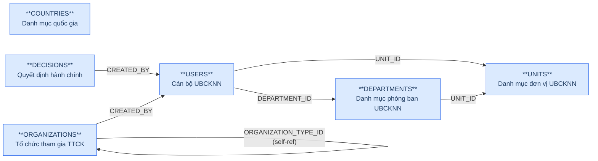
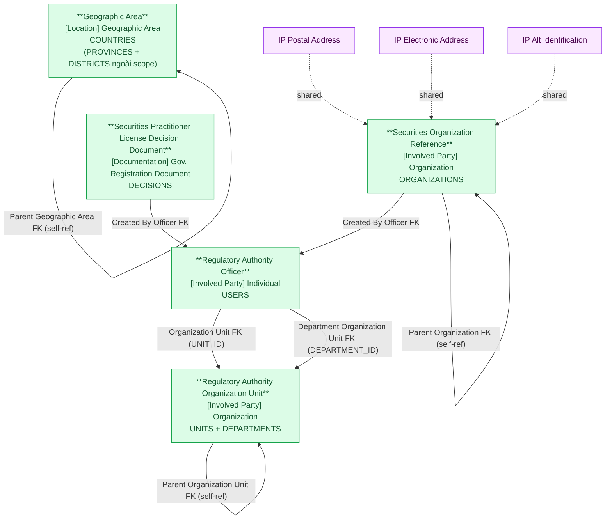

# NHNCK — HLD Tier 1: Reference Data (Main Entities)

> **Phụ thuộc:** Không phụ thuộc Tier nào — là nền tảng cho tất cả Tier sau.
>
> **Thiết kế theo:** [NHNCK_HLD_Overview.md](NHNCK_HLD_Overview.md)

---

## 6a. Bảng tổng quan BCV Concept

| BCV Core Object | BCV Concept | Category | Source Table | Source Table Change Mode | Mô tả bảng nguồn | Atomic Entity | Table Type | BCV Term |
|---|---|---|---|---|---|---|---|---|
| Location | [Location] Geographic Area | Geographic Area | COUNTRIES | Update | Danh mục quốc gia/vùng lãnh thổ theo ISO 3166 | Geographic Area | Fundamental | Geographic Area — BCV ngoại lệ: dù chỉ có Code+Name vẫn là Atomic entity vì BCV có Data Concept Location riêng. PROVINCES và DISTRICTS từ NHNCK ngoài scope. |
| Involved Party | [Involved Party] Organization | Organization | UNITS | Update | Danh mục đơn vị thuộc UBCKNN | Regulatory Authority Organization Unit | Fundamental | Organization — cơ cấu tổ chức UBCKNN dạng cây self-referencing. Cùng Atomic entity với DEPARTMENTS. Phân biệt bằng Organization Unit Type Code (UNIT/DEPARTMENT) và Source System Code. |
| Involved Party | [Involved Party] Organization | Organization | DEPARTMENTS | Update | Danh mục phòng ban thuộc UBCKNN | Regulatory Authority Organization Unit | Fundamental | Organization — cùng Atomic entity với UNITS. Parent của DEPARTMENTS trỏ đến UNITS (UNIT_ID). Phân biệt bằng Organization Unit Type Code = DEPARTMENT và Source System Code. 2 attr file riêng biệt (attr_NHNCK_Units.csv + attr_NHNCK_Departments.csv). |
| Involved Party | [Involved Party] Organization | Organization | ORGANIZATIONS | Update | Thông tin các tổ chức tham gia TTCK (CTCK, QLQ, Ngân hàng...) | Securities Organization Reference | Fundamental | Organization — *"Identifies an Involved Party that may stand alone in an operational or legal context."* Cấu trúc trường: mã tổ chức, tên, loại hình, vốn điều lệ, trạng thái, self-ref PARENT_ID. Được FK từ Employment Status và Organization Employment Report. |
| Documentation | [Documentation] Gov. Registration Document | Government Registration Document | DECISIONS | Update | Danh mục các quyết định hành chính do UBCKNN ban hành | Securities Practitioner License Decision Document | Fundamental | Government Registration Document — *"Identifies a Documentation Item that is issued by a principality or sovereignty."* Cấu trúc trường: số QĐ, tiêu đề, loại quyết định, ngày ký, người ký, trạng thái, file đính kèm. Được FK từ Certificate Document (×2), Certificate Group Document, Conduct Violation, Examination Assessment. |
| Involved Party | [Involved Party] Individual | Individual | USERS | Update | Thông tin cán bộ/chuyên viên UBCKNN có tài khoản trong hệ thống NHNCK | Regulatory Authority Officer | Fundamental | Individual — *"Identifies an Involved Party who is a natural person."* Cấu trúc trường: mã cán bộ, username, họ tên, email, điện thoại, FK đến Organization Unit (×2: đơn vị + phòng ban), chức vụ, trạng thái. Không lưu PASSWORD. |

---

## 6b. Diagram Source (Mermaid)

---

## 6c. Diagram Atomic (Mermaid)

---

## 6d. Danh mục & Tham chiếu

| Source Table | Mô tả | Scheme Code dự kiến | Ghi chú |
|---|---|---|---|
| POSITIONS | Danh mục chức vụ | POSITION | Chỉ có Code + Name → Classification Value (Employment Position Type). Không tạo Atomic entity. |
| EDUCATION_LEVELS | Danh mục trình độ học vấn | EDUCATION_LEVEL | Classification Value. |
| APPLICATION_STATUSES | Định nghĩa trạng thái hồ sơ | APPLICATION_STATUS | Classification Value. |
| CERTIFICATES | Danh mục loại chứng chỉ hành nghề | CERTIFICATE_TYPE | Classification Value — chỉ có CERTIFICATE_CODE + CERTIFICATE_NAME + metadata vận hành. |
| SPECIALIZATIONS | Danh mục chuyên môn | SPECIALIZATION | Classification Value. |
| DOCUMENTS | Danh mục loại tài liệu hồ sơ | DOCUMENT_TYPE | Classification Value. |
| APPLICATION_SOURCES | Hình thức nộp hồ sơ | APPLICATION_SOURCE | Classification Value. |

---

## 6e. Bảng chờ thiết kế

Không có bảng nào trong Tier 1 chưa đủ thông tin cột.

---

## 6f. Điểm cần xác nhận

| # | Câu hỏi | Ảnh hưởng |
|---|---|---|
| 1 | `DECISIONS.CREATED_BY` là FK thực đến USERS. | **Xác nhận.** FK thực → thiết kế giữ Created By Officer FK trên entity License Decision Document. |
| 2 | `ORGANIZATIONS` có bao gồm cả UBCKNN không? | **Xác nhận: không bao gồm.** ORGANIZATIONS chỉ chứa tổ chức tham gia TTCK bên ngoài → không có overlap với Regulatory Authority Organization Unit. |
| 3 | `ORGANIZATIONS.ORGANIZATION_TYPE_ID` tự tham chiếu — là loại hình tổ chức (Classification Value) hay FK entity khác? | **Xác nhận: Classification Value.** Xử lý thành ORGANIZATION_TYPE_CODE trên Atomic, không tạo FK entity riêng. |
