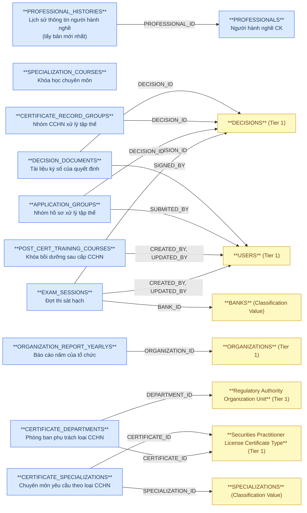

# NHNCK — HLD Tier 2: Phụ thuộc Tier 1

> **Phụ thuộc Tier 1:** Securities Practitioner License Decision Document, Regulatory Authority Officer, Securities Organization Reference, Regulatory Authority Organization Unit, Securities Practitioner License Certificate Type
>
> **Thiết kế theo:** [NHNCK_HLD_Overview.md](NHNCK_HLD_Overview.md)

---

## 6a. Bảng tổng quan BCV Concept

| BCV Core Object | BCV Concept | Category | Source Table | Source Table Change Mode | Mô tả bảng nguồn | Atomic Entity | Table Type | BCV Term |
|---|---|---|---|---|---|---|---|---|
| Involved Party | [Involved Party] Individual | Individual | PROFESSIONALS | Update | Thông tin người hành nghề chứng khoán được UBCKNN quản lý | Securities Practitioner | Fundamental | Individual — *"Identifies an Involved Party who is a natural person."* Cấu trúc trường: mã người hành nghề, họ tên, ngày sinh đầy đủ, giới tính, quốc tịch, nơi sinh, trình độ học vấn, hình thức đăng ký, trạng thái hành nghề, trạng thái tài khoản. Không FK đến bảng nghiệp vụ nào trong Tier 1 (chỉ dùng shared entities). |
| Involved Party | [Involved Party] Individual | Individual | PROFESSIONAL_HISTORIES | Update | Lịch sử thay đổi thông tin cá nhân của người hành nghề | Securities Practitioner Reason Change History | Fundamental | Individual — **Thiết kế lại 2026-07-07** (bản cũ map nhầm source_columns sang PROFESSIONALS). Grain: 1 dòng = 1 lần ghi nhận thay đổi thông tin — chỉ lưu ID/PROFESSIONAL_ID/CHANGE_DATE/REASON_UPDATE. FK đến Securities Practitioner qua PROFESSIONAL_ID. ~43 cột snapshot còn lại loại khỏi thiết kế (xem pending_design.yaml). |
| Business Activity | [Business Activity] Business Activity | Business Activity | SPECIALIZATION_COURSES | Update | Danh mục khóa học chuyên môn bổ sung kiến thức cho người hành nghề | Securities Practitioner Professional Training Class | Fundamental | **BCO điều chỉnh 2026-07-24 (Event → Business Activity)** theo yêu cầu tường minh Data Modeler. Term candidate `[Event] Training Course` — *"Identifies an Event that is a course of instruction"* — khớp cấu trúc trường hơn (mã khóa học, tên khóa học, loại chuyên môn, thời gian thi, địa điểm, trạng thái) nhưng không dùng theo quyết định Data Modeler. Dùng catch-all `[Business Activity] Business Activity` — cùng term với entity con Training Class Enrollment (SPECIALIZATION_COURSE_DETAILS), vì terms.csv không có term "training class" riêng dưới Business Activity. Xem `NHNCK_HLD_Overview.md` 7e #13. |
| Communication | [Communication] Assessment | Assessment | EXAM_SESSIONS | Update | Danh mục các đợt thi sát hạch cấp CCHN do UBCKNN tổ chức | Securities Practitioner Qualification Examination Assessment | Fundamental | Assessment — *"Identifies a Communication that is an evaluation or appraisal."* Cấu trúc trường: Session CODE/ITEM_NAME/SESSION_, YEAR, ORGANIZING_UNIT, APPLICATION_START_DATE/END_DATE, EXAM_START_DATE/END_DATE, EXAM_LOCATIONS, SUBMISSION_METHODS, RECORD_STATUS, FK đến DECISIONS, FK đến USERS (CREATED_BY + UPDATED_BY), BANK_ID (phí thi). FK đến Tier 1 (Decision + Officer). |
| Business Activity | [Business Activity] Business Activity | Business Activity | POST_CERT_TRAINING_COURSES | Update | Danh mục khóa học/lớp bồi dưỡng kiến thức định kỳ sau cấp CCHN | Securities Practitioner Post Certification Training Course | Fundamental | (1) Term candidate: không có BCV term riêng cho "training class/course" dưới Business Activity trong knowledge/terms.csv (chỉ có `[Event] Training Course`, đã dùng cho SPECIALIZATION_COURSES) — tái dùng catch-all `[Business Activity] Business Activity` theo yêu cầu tường minh Data Modeler (2026-07-24). (2) Cấu trúc trường: COURSE_CODE, COURSE_NAME, CLASS_CODE, STATUS (1/0 — Boolean). Không FK đến bảng nghiệp vụ nào (chỉ audit FK USERS). (3) Đặt tên "Post Certification" để phân biệt với "Professional Training Class" (SPECIALIZATION_COURSES) — 2 domain đào tạo khác nhau: trước cấp CCHN (thi + chuyên môn) vs sau cấp CCHN (bồi dưỡng định kỳ). |
| Documentation | [Documentation] Employer Registration | Employer Registration | ORGANIZATION_REPORT_YEARLYS | Update | Báo cáo năm mà tổ chức nộp về tình hình nhân sự hành nghề chứng khoán | Securities Practitioner Organization Annual Report | Fundamental | (1) Term candidate: `[Documentation] Employer Registration` — *"Identifies a Government Registration Document that officially records an Involved Party as an employer."* Cùng concept với entity Tier 3 `Securities Practitioner Organization Employment Report` (nguồn ORGANIZATION_REPORTS) nhưng khác grain: đây là container báo cáo theo năm do 1 tổ chức nộp (1 dòng = 1 lần nộp báo cáo năm), không phải 1 dòng/1 người hành nghề. (2) Cấu trúc trường: ORGANIZATION_ID (FK), NAME, SUBMISSION_DATE, YEAR, TYPE, FILE_PATH, STATUS — đúng cấu trúc 1 hồ sơ báo cáo độc lập, không suy ra được từ ORGANIZATIONS hay ORGANIZATION_REPORTS. (3) Chọn `[Documentation] Employer Registration`. Quyết định Data Modeler (2026-08-13) — đảo lại out_of_scope trước đó ("cần khảo sát thêm"). |
| Group | [Group] Group | Group | APPLICATION_GROUPS | Update | Nhóm hồ sơ CCHN được cán bộ tạo để xử lý tập thể (batch) | Securities Practitioner License Application Group | Fundamental | (1) Term candidate: `[Group] Group` — *"Identifies a specific grouping of objects that is of interest to the Financial Organization."* (2) Cấu trúc trường: GROUP_NAME, DESCRIPTION, STATUS, GROUP_CREATED_DATE, GROUP_COMPLETED_DATE, APPLICATION_COUNT, APPLICATION_TYPE, SUBMITED_DATE, SUBMITED_BY — đủ attribute nghiệp vụ riêng của nhóm (ngày tạo/hoàn thành, số lượng, loại hồ sơ batch, workflow gửi cấp trên), không suy ra được từ DECISIONS hay APPLICATIONS. (3) Chọn `[Group] Group`. Quyết định Data Modeler (2026-08-13) — đảo lại out_of_scope trước đó (Batch Processing); rà lại theo 2 điều kiện phân biệt Batch Processing Metadata vs entity thật (xem SKILL.md Bước 2) xác nhận các attribute trên không suy ra được từ entity đã có. |
| Group | [Group] Group | Group | CERTIFICATE_RECORD_GROUPS | Update | Nhóm chứng chỉ hành nghề được cán bộ tạo để xử lý cấp/thu hồi/hủy tập thể (batch) | Securities Practitioner License Certificate Group | Fundamental | (1)(2)(3) Tương tự `Securities Practitioner License Application Group` — cấu trúc trường GROUP_NAME/DESCRIPTION/STATUS/TYPE/GROUP_CREATED_DATE/GROUP_COMPLETED_DATE/CERTIFICATE_RECORD_COUNT là attribute nghiệp vụ riêng của nhóm, không suy ra được từ DECISIONS hay CERTIFICATE_RECORDS. Chọn `[Group] Group`. Quyết định Data Modeler (2026-08-13) — đảo lại out_of_scope trước đó (Batch Processing). |
| Documentation | [Documentation] Gov. Registration Document | Government Registration Document | DECISION_DOCUMENTS | Update | Văn bản/tài liệu ký số của quyết định hành chính, kèm thông tin người ký | Securities Practitioner License Decision Document Attachment | Fundamental | (1) Term candidate: tái dùng `[Documentation] Gov. Registration Document` — cùng concept với entity cha `Securities Practitioner License Decision Document` (đây là bản tài liệu/file gắn với quyết định, không phải khái niệm khác). (2) Cấu trúc trường: DECISION_NUMBER, TYPE, POSITION, FILE_PATH, SIGNED_BY, SIGNED_DATE, STATUS — có metadata ký số (người ký, ngày ký, chức vụ người ký) vượt quá điều kiện loại trừ "File Attachment" (chỉ tên file + đường dẫn + loại tài liệu). (3) Chọn `[Documentation] Gov. Registration Document`. Quyết định Data Modeler (2026-08-13) — đảo lại out_of_scope trước đó (Sub-process). |
| Involved Party | [Involved Party] Organization | Organization | CERTIFICATE_DEPARTMENTS | Update | Liên kết phòng ban phụ trách với loại chứng chỉ hành nghề | Regulatory Authority Organization Unit X Securities Practitioner License Certificate Type Relationship | Relative | (1) Term candidate: tái dùng `[Involved Party] Organization` — cùng concept với entity cha Tier 1 `Regulatory Authority Organization Unit`, khớp BCO Involved Party theo yêu cầu tường minh Data Modeler. (2) Cấu trúc trường: ID (không map), CERTIFICATE_ID (FK→CERTIFICATES), DEPARTMENT_ID (FK→DEPARTMENTS) — pure junction 2 FK, không có attribute nghiệp vụ riêng → PK composite 2 FK, không tạo Id/Code riêng cho chính entity (theo pattern entity link `_x_` khác trong dự án). (3) Trước đây đánh out_of_scope (Application Config, xem Overview 7f cũ) — đảo lại theo quyết định Data Modeler (2026-08-15): đây là quan hệ phân công phòng ban phụ trách xử lý từng loại CCHN, có ý nghĩa nghiệp vụ thay vì chỉ là cấu hình quy trình thuần. |
| Documentation | [Documentation] Gov. Registration Document | Government Registration Document | CERTIFICATE_SPECIALIZATIONS | Update | Liên kết chuyên môn yêu cầu với loại chứng chỉ hành nghề | Securities Practitioner License Certificate Type X Classification Specialization Relationship | Relative | (1) Term candidate: tái dùng `[Documentation] Gov. Registration Document` — cùng concept với entity cha Tier 1 `Securities Practitioner License Certificate Type`, khớp BCO Documentation theo yêu cầu tường minh Data Modeler. (2) Cấu trúc trường: ID (không map), CERTIFICATE_ID (FK→CERTIFICATES), SPECIALIZATION_ID (FK→SPECIALIZATIONS), SORT_ORDER, DOCUMENT_TYPE, IS_REQUIRED — có 3 attribute nghiệp vụ riêng ngoài 2 FK (thứ tự hiển thị, loại tài liệu yêu cầu — không có FK note trong BRD, ETL-derived Classification Value tạm thời, bắt buộc hay không) → giữ làm entity Relative riêng, không denormalize ARRAY. (3) Trước đây đánh out_of_scope (Application Config, xem Overview 7f cũ) — đảo lại theo quyết định Data Modeler (2026-08-15): quan hệ xác định chuyên môn nào bắt buộc cho từng loại CCHN, kèm attribute nghiệp vụ riêng (SORT_ORDER/DOCUMENT_TYPE/IS_REQUIRED). |

---

## 6b. Diagram Source (Mermaid)

---

## 6c. Diagram Atomic (Mermaid)

```mermaid
graph TD
    classDef atomic fill:#dcfce7,stroke:#16a34a,color:#14532d
    classDef shared fill:#fae8ff,stroke:#9333ea,color:#4a044e
    classDef outscope fill:#fef9c3,stroke:#ca8a04,color:#713f12

    PRAC["**Securities Practitioner**\n[Involved Party] Individual\nPROFESSIONALS"]:::atomic
    REASONCHG["**Securities Practitioner\nReason Change History**\n[Involved Party] Individual\nPROFESSIONAL_HISTORIES"]:::atomic
    TRAINCLASS["**Securities Practitioner\nProfessional Training Class**\n[Business Activity] Business Activity\nSPECIALIZATION_COURSES"]:::atomic
    EXAM["**Securities Practitioner\nQualification Examination Assessment**\n[Communication] Assessment\nEXAM_SESSIONS"]:::atomic
    PCTCOURSE["**Securities Practitioner Post\nCertification Training Course**\n[Business Activity] Business Activity\nPOST_CERT_TRAINING_COURSES"]:::atomic
    ANNUALRPT["**Securities Practitioner Organization\nAnnual Report**\n[Documentation] Employer Registration\nORGANIZATION_REPORT_YEARLYS"]:::atomic
    APPGROUP["**Securities Practitioner License\nApplication Group**\n[Group] Group\nAPPLICATION_GROUPS"]:::atomic
    CERTGROUP["**Securities Practitioner License\nCertificate Group**\n[Group] Group\nCERTIFICATE_RECORD_GROUPS"]:::atomic
    DECDOC["**Securities Practitioner License Decision\nDocument Attachment**\n[Documentation] Gov. Registration Document\nDECISION_DOCUMENTS"]:::atomic
    CERTDEPT["**Regulatory Authority Organization Unit\nX License Certificate Type Relationship**\n[Involved Party] Organization\nCERTIFICATE_DEPARTMENTS"]:::atomic
    CERTSPEC["**License Certificate Type\nX Classification Specialization Relationship**\n[Documentation] Gov. Registration Document\nCERTIFICATE_SPECIALIZATIONS"]:::atomic

    ADDR["IP Postal Address"]:::shared
    EADDR["IP Electronic Address"]:::shared
    ALTID["IP Alt Identification"]:::shared

    DECISION["**License Decision Document** (Tier 1)"]:::outscope
    OFFICER["**Regulatory Authority Officer** (Tier 1)"]:::outscope
    SECORG["**Securities Organization Reference** (Tier 1)"]:::outscope
    ORGUNITATOMIC["**Regulatory Authority Organization Unit** (Tier 1)"]:::outscope
    CERTTYPEATOMIC["**Securities Practitioner License Certificate Type** (Tier 1)"]:::outscope

    ADDR -.->|"shared"| PRAC
    EADDR -.->|"shared"| PRAC
    ALTID -.->|"shared"| PRAC
    EXAM -->|"Decision FK"| DECISION
    EXAM -->|"Created By Officer FK"| OFFICER
    EXAM -->|"Updated By Officer FK"| OFFICER
    ANNUALRPT -->|"Organization FK"| SECORG
    APPGROUP -->|"Decision FK"| DECISION
    APPGROUP -->|"Submitted By Officer FK"| OFFICER
    CERTGROUP -->|"Decision FK"| DECISION
    DECDOC -->|"Decision FK"| DECISION
    DECDOC -->|"Signed By Officer FK"| OFFICER
    CERTDEPT -->|"Organization Unit FK"| ORGUNITATOMIC
    CERTDEPT -->|"Certificate Type FK"| CERTTYPEATOMIC
    CERTSPEC -->|"Certificate Type FK"| CERTTYPEATOMIC
```

---

## 6d. Danh mục & Tham chiếu

| Source Table | Mô tả | Scheme Code | Ghi chú |
|---|---|---|---|
| BANKS | Danh mục ngân hàng (dùng cho nộp phí thi) | BANK | Classification Value. FK từ EXAM_SESSIONS.BANK_ID — chỉ có mã + tên ngân hàng. |
| CERTIFICATE_SPECIALIZATIONS.DOCUMENT_TYPE | Loại tài liệu yêu cầu cho chuyên môn (không có FK note trong BRD, giá trị số) | NHNCK_CERT_SPEC_DOCUMENT_TYPE | Classification Value tạm — chưa có bảng danh mục nguồn tường minh, `source_type: modeler_defined`, `values: []` — cần profile dữ liệu để xác nhận value set trước go-live. |

---

## 6e. Bảng chờ thiết kế

Không có bảng nào trong Tier 2 chưa đủ thông tin cột.

---

## 6f. Điểm cần xác nhận

| # | Câu hỏi | Ảnh hưởng |
|---|---|---|
| 1 | `PROFESSIONALS` có FK đến bất kỳ bảng nghiệp vụ Tier 1 nào không (ngoài ORGANIZATIONS, COUNTRIES, PROVINCES, DISTRICTS là danh mục)? | Hiện tại ORGANIZATION_ID trỏ đến ORGANIZATIONS — là Tier 1 entity, không phải Classification Value. Tuy nhiên PROFESSIONALS thiết kế ở Tier 2 vì ORGANIZATION_ID là FK mô tả tổ chức hiện tại (denormalized, có thể null), không phải dependency lifecycle. Cần xác nhận. |
| 2 | `SPECIALIZATION_COURSES.SPECIALIZATION_ID` trỏ đến SPECIALIZATIONS (Classification Value) — xác nhận không có FK đến entity nghiệp vụ Tier 1 nào khác. | **Xác nhận: đúng.** SPECIALIZATION_ID là Classification Value → Tier 2 giữ nguyên. |
| 3 | `EXAM_SESSIONS.BANK_ID` — BANKS chỉ là danh mục thanh toán phí? Hay BANKS là entity Tier 1 phức tạp hơn? | Nếu BANKS chỉ có CODE + NAME → Classification Value, không tạo Atomic entity. |
| 4 | `POST_CERT_TRAINING_COURSES` — trước đây "Isolated" ngoài scope (7f, lý do "chưa có bảng enrollment liên quan"). Nay `POST_CERT_TRAINING_RESULTS` (Tier 3) được thiết kế làm entity enrollment/kết quả — không còn lý do loại trừ. | **Đưa vào scope theo quyết định Data Modeler (2026-07-24).** BCO Business Activity (không phải Event như SPECIALIZATION_COURSES) — theo yêu cầu tường minh Data Modeler, dùng chung catch-all `[Business Activity] Business Activity` với entity con Post Certification Training Result. |
| 5 | `ORGANIZATION_REPORT_YEARLYS` (Securities Practitioner Organization Annual Report) và `ORGANIZATION_REPORTS` (Tier 3, Securities Practitioner Organization Employment Report) mô tả cùng lĩnh vực nghiệp vụ "báo cáo của tổ chức" nhưng khác grain (năm/container vs từng người hành nghề) — cần xác nhận đây thực sự là 2 entity riêng, không phải cùng 1 entity bị tách nhầm. | **Chưa xác nhận — Data Modeler review.** Thiết kế tạm giữ 2 entity riêng theo đúng cấu trúc PK/FK nguồn (2 bảng độc lập, PK riêng, không có quan hệ 1-1). `ORGANIZATION_REPORT_LOG_SYNCS` (Tier 4) là cầu nối FK cả 2 — xem 6f Tier 4. |
| 6 | `DECISION_DOCUMENTS.DECISION_NUMBER` trùng tên với số quyết định đã có trên `DECISIONS` (entity cha) — cần xác nhận đây là dữ liệu denormalize (snapshot số QĐ tại thời điểm tạo file) hay lỗi thiết kế nguồn (duplicate không cần thiết). | **Đã xác nhận (2026-08-14) — trùng lặp thuần.** Loại `DECISION_DOCUMENTS.DECISION_NUMBER` khỏi Atomic attribute (xem `pending_design.yaml`), giữ FK Decision Id + Decision Code làm nguồn duy nhất — đồng bộ với việc đổi BK của `DECISIONS` sang `DECISION_NUMBER` (`lld_NHNCK_DECISIONS.yaml`). |
| 7 | **[MỚI 2026-08-15]** `CERTIFICATE_SPECIALIZATIONS.DOCUMENT_TYPE` không có FK note trong BRD (giá trị số, không rõ bảng danh mục nguồn) — tạm đăng ký Classification Value `NHNCK_CERT_SPEC_DOCUMENT_TYPE` (`modeler_defined`, `values: []`). | Cần profile dữ liệu để xác nhận value set trước go-live — xem 6d. |
