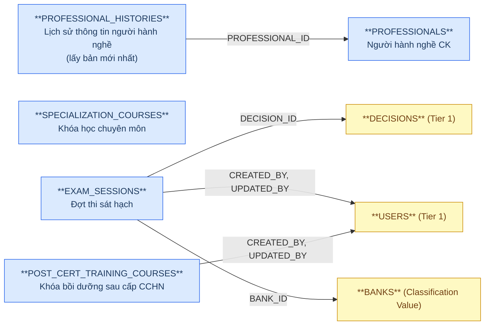
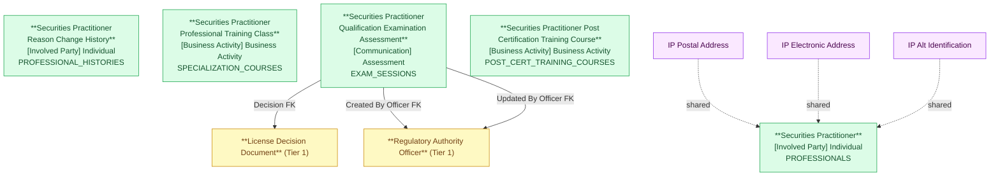

# NHNCK — HLD Tier 2: Phụ thuộc Tier 1

> **Phụ thuộc Tier 1:** Securities Practitioner License Decision Document, Regulatory Authority Officer, Securities Organization Reference
>
> **Thiết kế theo:** [NHNCK_HLD_Overview.md](NHNCK_HLD_Overview.md)

---

## 6a. Bảng tổng quan BCV Concept

| BCV Core Object | BCV Concept | Category | Source Table | Source Table Change Mode | Mô tả bảng nguồn | Atomic Entity | Table Type | BCV Term |
|---|---|---|---|---|---|---|---|---|
| Involved Party | [Involved Party] Individual | Individual | PROFESSIONALS | Update | Thông tin người hành nghề chứng khoán được UBCKNN quản lý | Securities Practitioner | Fundamental | Individual — *"Identifies an Involved Party who is a natural person."* Cấu trúc trường: mã người hành nghề, họ tên, ngày sinh đầy đủ, giới tính, quốc tịch, nơi sinh, trình độ học vấn, hình thức đăng ký, trạng thái hành nghề, trạng thái tài khoản. Không FK đến bảng nghiệp vụ nào trong Tier 1 (chỉ dùng shared entities). |
| Involved Party | [Involved Party] Individual | Individual | PROFESSIONAL_HISTORIES | Update | Lịch sử thay đổi thông tin cá nhân của người hành nghề | Securities Practitioner Reason Change History | Fundamental | Individual — **Thiết kế lại 2026-07-07** (bản cũ map nhầm source_columns sang PROFESSIONALS). Grain: 1 dòng = 1 lần ghi nhận thay đổi thông tin — chỉ lưu ID/PROFESSIONAL_ID/CHANGE_DATE/REASON_UPDATE. FK đến Securities Practitioner qua PROFESSIONAL_ID. ~43 cột snapshot còn lại loại khỏi thiết kế (xem pending_design.yaml). |
| Business Activity | [Business Activity] Business Activity | Business Activity | SPECIALIZATION_COURSES | Update | Danh mục khóa học chuyên môn bổ sung kiến thức cho người hành nghề | Securities Practitioner Professional Training Class | Fundamental | **BCO điều chỉnh 2026-07-24 (Event → Business Activity)** theo yêu cầu tường minh Data Modeler. Term candidate `[Event] Training Course` — *"Identifies an Event that is a course of instruction"* — khớp cấu trúc trường hơn (mã khóa học, tên khóa học, loại chuyên môn, thời gian thi, địa điểm, trạng thái) nhưng không dùng theo quyết định Data Modeler. Dùng catch-all `[Business Activity] Business Activity` — cùng term với entity con Training Class Enrollment (SPECIALIZATION_COURSE_DETAILS), vì terms.csv không có term "training class" riêng dưới Business Activity. Xem `NHNCK_HLD_Overview.md` 7e #13. |
| Communication | [Communication] Assessment | Assessment | EXAM_SESSIONS | Update | Danh mục các đợt thi sát hạch cấp CCHN do UBCKNN tổ chức | Securities Practitioner Qualification Examination Assessment | Fundamental | Assessment — *"Identifies a Communication that is an evaluation or appraisal."* Cấu trúc trường: Session CODE/ITEM_NAME/SESSION_, YEAR, ORGANIZING_UNIT, APPLICATION_START_DATE/END_DATE, EXAM_START_DATE/END_DATE, EXAM_LOCATIONS, SUBMISSION_METHODS, RECORD_STATUS, FK đến DECISIONS, FK đến USERS (CREATED_BY + UPDATED_BY), BANK_ID (phí thi). FK đến Tier 1 (Decision + Officer). |
| Business Activity | [Business Activity] Business Activity | Business Activity | POST_CERT_TRAINING_COURSES | Update | Danh mục khóa học/lớp bồi dưỡng kiến thức định kỳ sau cấp CCHN | Securities Practitioner Post Certification Training Course | Fundamental | (1) Term candidate: không có BCV term riêng cho "training class/course" dưới Business Activity trong knowledge/terms.csv (chỉ có `[Event] Training Course`, đã dùng cho SPECIALIZATION_COURSES) — tái dùng catch-all `[Business Activity] Business Activity` theo yêu cầu tường minh Data Modeler (2026-07-24). (2) Cấu trúc trường: COURSE_CODE, COURSE_NAME, CLASS_CODE, STATUS (1/0 — Boolean). Không FK đến bảng nghiệp vụ nào (chỉ audit FK USERS). (3) Đặt tên "Post Certification" để phân biệt với "Professional Training Class" (SPECIALIZATION_COURSES) — 2 domain đào tạo khác nhau: trước cấp CCHN (thi + chuyên môn) vs sau cấp CCHN (bồi dưỡng định kỳ). |

---

## 6b. Diagram Source (Mermaid)

---

## 6c. Diagram Atomic (Mermaid)

---

## 6d. Danh mục & Tham chiếu

| Source Table | Mô tả | Scheme Code | Ghi chú |
|---|---|---|---|
| BANKS | Danh mục ngân hàng (dùng cho nộp phí thi) | BANK | Classification Value. FK từ EXAM_SESSIONS.BANK_ID — chỉ có mã + tên ngân hàng. |

---

## 6e. Bảng chờ thiết kế

Không có bảng nào trong Tier 2 chưa đủ thông tin cột.

---

## 6f. Điểm cần xác nhận

| # | Câu hỏi | Ảnh hưởng |
|---|---|---|
| 1 | `PROFESSIONALS` có FK đến bất kỳ bảng nghiệp vụ Tier 1 nào không (ngoài ORGANIZATIONS, COUNTRIES, PROVINCES, DISTRICTS là danh mục)? | Hiện tại ORGANIZATION_ID trỏ đến ORGANIZATIONS — là Tier 1 entity, không phải Classification Value. Tuy nhiên PROFESSIONALS thiết kế ở Tier 2 vì ORGANIZATION_ID là FK mô tả tổ chức hiện tại (denormalized, có thể null), không phải dependency lifecycle. Cần xác nhận. |
| 2 | `SPECIALIZATION_COURSES.SPECIALIZATION_ID` trỏ đến SPECIALIZATIONS (Classification Value) — xác nhận không có FK đến entity nghiệp vụ Tier 1 nào khác. | **Xác nhận: đúng.** SPECIALIZATION_ID là Classification Value → Tier 2 giữ nguyên. |
| 3 | `EXAM_SESSIONS.BANK_ID` — BANKS chỉ là danh mục thanh toán phí? Hay BANKS là entity Tier 1 phức tạp hơn? | Nếu BANKS chỉ có CODE + NAME → Classification Value, không tạo Atomic entity. |
| 4 | `POST_CERT_TRAINING_COURSES` — trước đây "Isolated" ngoài scope (7f, lý do "chưa có bảng enrollment liên quan"). Nay `POST_CERT_TRAINING_RESULTS` (Tier 3) được thiết kế làm entity enrollment/kết quả — không còn lý do loại trừ. | **Đưa vào scope theo quyết định Data Modeler (2026-07-24).** BCO Business Activity (không phải Event như SPECIALIZATION_COURSES) — theo yêu cầu tường minh Data Modeler, dùng chung catch-all `[Business Activity] Business Activity` với entity con Post Certification Training Result. |
