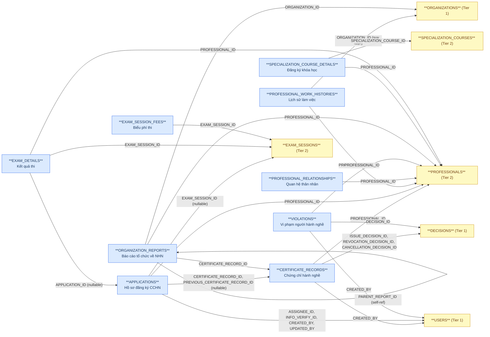

# NHNCK — HLD Tier 3: Phụ thuộc Tier 2

> **Phụ thuộc Tier 1:** Securities Practitioner License Decision Document, Regulatory Authority Officer, Securities Organization Reference
> **Phụ thuộc Tier 2:** Securities Practitioner, Securities Practitioner Professional Training Class, Securities Practitioner Qualification Examination Assessment
>
> **Thiết kế theo:** [NHNCK_HLD_Overview.md](NHNCK_HLD_Overview.md)

---

## 6a. Bảng tổng quan BCV Concept

| BCV Core Object | BCV Concept | Category | Source Table | Source Table Change Mode | Mô tả bảng nguồn | Atomic Entity | Table Type | BCV Term |
|---|---|---|---|---|---|---|---|---|
| Documentation | [Documentation] Gov. Registration Document | Government Registration Document | CERTIFICATE_RECORDS | Update | Chứng chỉ hành nghề được cấp cho người hành nghề | Securities Practitioner License Certificate Document | Fundamental | Government Registration Document — cấu trúc trường: CERTIFICATE_ID (type), CERTIFICATE_NUMBER, ISSUE_DATE, PROCESS_STATUS, CONVERSION_STATUS, FK đến PROFESSIONALS, DECISIONS (×3: ISSUE + REVOCATION + CANCELLATION), USERS (CREATED_BY). FK đến Tier 2 (Practitioner) và Tier 1 (Decision + Officer). |
| Documentation | [Documentation] Gov. Registration Document | Government Registration Document | APPLICATIONS | Update | Hồ sơ đăng ký chứng chỉ hành nghề chứng khoán | Securities Practitioner License Application | Fundamental | Government Registration Document — cấu trúc trường: APPLICATION_CODE, APPLICATION_TYPE, REGISTRATION_TYPE, STATUS_ID, CERTIFICATE_ID (type), SUBMISSION_DATE, FK đến PROFESSIONALS (Tier 2), CERTIFICATE_RECORDS (×2: CERTIFICATE_RECORD_ID + PREVIOUS — nullable), EXAM_SESSIONS (nullable), USERS (×2: ASSIGNEE_ID + INFO_VERIFY_ID + CREATED_BY + UPDATED_BY). |
| Involved Party | [Involved Party] Individual Employment Status | Employment Status | PROFESSIONAL_WORK_HISTORIES | Update | Lịch sử làm việc của người hành nghề tại các tổ chức chứng khoán | Securities Practitioner Employment Status | Fundamental | Individual Employment Status — *"Identifies the current or past employment status of an Individual."* Cấu trúc trường: FK đến PROFESSIONALS (Tier 2), FK đến ORGANIZATIONS (Tier 1), POSITION (text tự do), DEPARTMENT (text tự do), HIRE_DATE, TERMINATION_DATE (NULL = đang làm). |
| Involved Party | [Involved Party] Involved Party Relationship | Relationship | PROFESSIONAL_RELATIONSHIPS | Update | Thông tin quan hệ thân nhân của người hành nghề | Securities Practitioner Related Party | Fundamental | Involved Party Relationship — cấu trúc trường: FK đến PROFESSIONALS (Tier 2), RELATIONSHIP_TYPE, FULL_NAME, BIRTH_YEAR, ADDRESS, OCCUPATION, WORKPLACE, IDENTITY_ID, COUNTRY_ID. |
| Business Activity | [Business Activity] Conduct Violation | Conduct Violation | VIOLATIONS | Update | Thông tin vi phạm của người hành nghề được ghi nhận kèm quyết định xử lý | Securities Practitioner Conduct Violation | Fundamental | Conduct Violation — *"Identifies a Business Activity that records a violation of conduct rules."* Cấu trúc trường: FK đến PROFESSIONALS (Tier 2), DECISIONS (Tier 1), USERS (CREATED_BY — Tier 1), RECORD_TYPE, NOTE, RECORD_STATUS. |
| Documentation | [Documentation] Employer Registration | Employer Registration | ORGANIZATION_REPORTS | Update | Báo cáo của tổ chức về tình trạng làm việc của người hành nghề | Securities Practitioner Organization Employment Report | Fact Append | Employer Registration — cấu trúc trường: FK đến PROFESSIONALS (Tier 2), ORGANIZATIONS (Tier 1), CERTIFICATE_RECORDS (Tier 3), self-ref PARENT_REPORT_ID, RECORD_TYPE, STATUS_ORGANIZATION, HIRE_DATE, TERMINATION_DATE, POSITION, DEPARTMENT, REPORT_DATE. Mỗi báo cáo là 1 sự kiện nộp báo cáo — insert-only. |
| Business Activity | [Business Activity] Business Activity | Business Activity | SPECIALIZATION_COURSE_DETAILS | Update | Chi tiết người tham gia khóa học chuyên môn và kết quả | Securities Practitioner Professional Training Class Enrollment | Fundamental | Business Activity — cấu trúc trường: FK đến SPECIALIZATION_COURSES (Tier 2), FK đến PROFESSIONALS (Tier 2), EXAM_SCORE, RESULT, RECORD_STATUS. Entity ghi nhận đăng ký + kết quả, có lifecycle riêng. |
| Communication | [Communication] Assessment | Assessment | EXAM_DETAILS | Update | Kết quả thi sát hạch của từng thí sinh trong từng đợt thi | Securities Practitioner Qualification Examination Assessment Result | Fundamental | Assessment — cấu trúc trường: FK đến EXAM_SESSIONS (Tier 2), FK đến PROFESSIONALS (Tier 2), FK đến APPLICATIONS (Tier 3 — nullable), LAW_SCORE, LAW_RESULT, SPECIALIZATION_SCORE, SPECIALIZATION_RESULT, RESULT. |
| Condition | [Condition] Financial Charge | Financial Charge | EXAM_SESSION_FEES | Update | Biểu phí thi quy định cho từng loại chứng chỉ trong từng đợt thi | Securities Practitioner Qualification Examination Assessment Fee | Fundamental | Financial Charge — *"Identifies a Condition that is a charge for a service."* Phân biệt với License Application Fee (Transaction) — đây là biểu phí quy định, không phải phí thực tế thu từng thí sinh. Cấu trúc trường: FK đến EXAM_SESSIONS (Tier 2), CERTIFICATE_ID (type), FEE_EXAM, FEE_APPEAL. |

---

## 6b. Diagram Source (Mermaid)

---

## 6c. Diagram Atomic (Mermaid)

```mermaid
graph TD
    classDef atomic fill:#dcfce7,stroke:#16a34a,color:#14532d
    classDef pattern fill:#e2e8f0,stroke:#64748b,color:#1e293b
    classDef outscope fill:#fef9c3,stroke:#ca8a04,color:#713f12

    CERTDOC["**License Certificate Document**\n[Documentation] Gov. Registration Document\nCERTIFICATE_RECORDS"]:::atomic
    APP["**License Application**\n[Documentation] Gov. Registration Document\nAPPLICATIONS"]:::atomic
    EMPST["**Employment Status**\n[Involved Party] Ind. Employment Status\nPROFESSIONAL_WORK_HISTORIES"]:::atomic
    RELP["**Related Party**\n[Involved Party] IP Relationship\nPROFESSIONAL_RELATIONSHIPS"]:::atomic
    VIO["**Conduct Violation**\n[Business Activity] Conduct Violation\nVIOLATIONS"]:::pattern
    EMPRPT["**Organization Employment Report**\n[Documentation] Employer Registration\nORGANIZATION_REPORTS"]:::pattern
    ENROLL["**Training Class Enrollment**\n[Business Activity] Business Activity\nSPECIALIZATION_COURSE_DETAILS"]:::atomic
    EXAMRES["**Examination Assessment Result**\n[Communication] Assessment\nEXAM_DETAILS"]:::atomic
    EXAMFEE["**Examination Assessment Fee**\n[Condition] Financial Charge\nEXAM_SESSION_FEES"]:::atomic

    PRAC["**Securities Practitioner** (Tier 2)"]:::outscope
    TRAINCLASS["**Professional Training Class** (Tier 2)"]:::outscope
    EXAM["**Qualification Examination Assessment** (Tier 2)"]:::outscope
    DECISION["**License Decision Document** (Tier 1)"]:::outscope
    OFFICER["**Regulatory Authority Officer** (Tier 1)"]:::outscope
    SECORG["**Securities Organization Reference** (Tier 1)"]:::outscope

    CERTDOC -->|"Practitioner FK"| PRAC
    CERTDOC -->|"Issuance Decision FK"| DECISION
    CERTDOC -->|"Revocation Decision FK"| DECISION
    CERTDOC -->|"Cancellation Decision FK"| DECISION
    CERTDOC -->|"Created By Officer FK"| OFFICER
    APP -->|"Practitioner FK"| PRAC
    APP -->|"Certificate Document FK (nullable)"| CERTDOC
    APP -->|"Examination Assessment FK (nullable)"| EXAM
    APP -->|"Assignee Officer FK"| OFFICER
    EMPST -->|"Practitioner FK"| PRAC
    EMPST -->|"Organization FK"| SECORG
    RELP -->|"Practitioner FK"| PRAC
    VIO -.->|"Practitioner FK"| PRAC
    VIO -.->|"Decision FK"| DECISION
    VIO -.->|"Created By Officer FK"| OFFICER
    EMPRPT -.->|"Practitioner FK"| PRAC
    EMPRPT -.->|"Organization FK"| SECORG
    EMPRPT -.->|"Certificate Document FK"| CERTDOC
    EMPRPT -.->|"self-ref Parent Report"| EMPRPT
    ENROLL -->|"Training Class FK"| TRAINCLASS
    ENROLL -->|"Practitioner FK"| PRAC
    EXAMRES -->|"Examination Assessment FK"| EXAM
    EXAMRES -->|"Practitioner FK"| PRAC
    EXAMRES -->|"License Application FK (nullable)"| APP
    EXAMFEE -->|"Examination Assessment FK"| EXAM
```

---

## 6d. Danh mục & Tham chiếu

Không có bảng mới nào trong Tier 3 thuộc dạng Classification Value — đã liệt kê đầy đủ ở Tier 1.

---

## 6e. Bảng chờ thiết kế

Không có bảng nào trong Tier 3 chưa đủ thông tin cột.

---

## 6f. Điểm cần xác nhận

| # | Câu hỏi | Ảnh hưởng |
|---|---|---|
| 1 | `APPLICATIONS.CERTIFICATE_RECORD_ID` và `PREVIOUS_CERTIFICATE_RECORD_ID` — cả 2 đều nullable? | **Xác nhận: đúng, cả 2 đều nullable.** Hồ sơ mới chưa có CCHN → nullable là đúng thiết kế. |
| 2 | `EXAM_DETAILS.APPLICATION_ID` — có trường hợp thí sinh thi không có hồ sơ đăng ký không? | **Xác nhận: không.** APPLICATION_ID luôn có về mặt nghiệp vụ. Giữ nullable về kỹ thuật để tương thích nguồn; ETL không load dòng thiếu APPLICATION_ID. |
